# SUP / e-journal Bilag 1 - Elementstruktur, version 2.2

- **Kildedokument:** `e-journal-elementstruktur-med-forklaring-280510.pdf`
- **Dato:** 28. maj 2010
- **Konverteringsformål:** Agent-egnet tekstversion med kilde-sideankre og separate diagram-/billedressourcer.
- **Kildeprincip:** Teksten nedenfor følger PDF-kilden. Mermaid-diagrammer er semantiske rekonstruktioner og bør kontrolleres mod originalfiguren ved tvivl.

<!-- Kildeside: 1 -->

Hvis du har brug for at læse dette dokument i et keyboard eller skærmlæservenligt format, så klik venligst på denne knap.

                                                                           SUP-specifikation

## Bilag 1 - version 2.2

                                                                                              Elementstruktur

## 28 maj 2010

                                                                                                                            Udarbejdet for

                                                                   E-Journal-Styregruppen

<!-- Kildeside: 2 -->

Hændelser

Planlagt procedure
Ordination
Medicin-ordination
Rekvisition
Bookning af proc.
Udført proc.
Medicin-givning
Kontaktperiode
Anamnestisk oplys.
Observation – fund
Prøveresultat
Effekt af behandling
Komplikation – bivirk.
Diagnose
Problem
Mål
Adm. karak. m.m.
Notat

De fremhævede bruges i dag.
De ikke fremhævede kan bruges for 3. generations EPJ

<!-- Kildeside: 3 -->

Felt                            Beskrivelse

Hændelsestype                   Denne kolonne er alene en rækkeoverskrift ved denne beskrivelse og ikke en del af datasættet
                                F: Alfanumerisk. Patientens CPR-nummer. Skal almindeligvis anonymiseres i dataudtræk til
                                analyseformål. Det anonymiserede ID skal i så fald væres ens for den enkelte person i forskellige
Person-ID                       udtræk.

Køn                             F: Kodet værdi. Værdisæt: M, K, U (ukendt). Personens køn på hændelsens starttidspunkt.
Personalder                     F: Heltal. Personens alder på hændelsens starttidspunkt rundet ned.

                                F: Kodet værdi. Kode for det fødesystem, som forløbet er udtrukket fra. Bemærk at de udtrukne
                                data oprindeligt kan være registreret i et andet system. Klassifikationen er bygget op som en
Fødesystem                      streng med 5 karakterer til leverandørnavnet og 5 karakterer til systemet.
                                Markering af teknisk oprettet forløb ved kontaktregistrering. Værdier: x = teknisk oprettet forløb.
Teknisk forløb                  Ellers blank.

                                F: Alfanumerisk. Oprindelig identifikation af forløbet. Den entydige forløbs-ID fra det system, hvor
Forløbs-ID                      forløbet oprettes. Ved teknisk oprettet forløb er forløbs-ID = oprindelig Kontakt-ID.
Forløbs-start                   F: SUP-tidspunkt. Forløbets starttidspunkt.
Forløbs-afslut                  F: SUP-tidspunkt. Forløbets afslutningstidspunkt.
                                F: Kodet værdi efter: 1) SST's Sgh-afd-klas., min. 6, max. 7 karak. 2) Ydernummerklas.
                                Oprindelig forløbsansvarlig enhed. Den lægefagligt ansv. Enhed (institution-afdeling / praksis),
Opr. forløbsansv. enhed kode    der opretter forløbet / kontaktperioden.
                                F: Alfanum. Kodetekst til forudgående kode. Her angives sygehusets navn eller kodetekst til
Opr. forløbsansv. inst. tekst   ydernummeret.
Opr. forløbsansv. afd. tekst    F: Alfanum. Kodetekst til forudgående kode. Her angives afdelingens navn.
                                F: Kodet værdi. Den på hændelsens starttidspunkt gældende forløbsdiagnose (eller
Forløbs-diag. kode              aktionsdiagnose ved kontaktregistrering).
                                Kodet værdi. Klassifikationstype for diagnosekoden. Værdier: SKS=SKS-klassifikationen.
Diag. klas                      ICPC=ICPC-klas.
Forløbs-diag. tekst             F: Alfanum. Kodetekst til forudgående diagnosekode.
                                F: Alfanumerisk. Registreringssystemets entydige ID for hændelsen. Bruges til identifikation,
Hæn. ID                         herunder ved referencer.
Hæn. type                       F: Kodet værdi. Forkortelse for hændelsens type. Udfyldes jf. nedenstående klass.
                                F: SUP-tidspunkt. Hændelsens starttidspunkt. Vil ofte være forskellig fra hændelsens
Hæn. start                      registreringstidspunkt.

<!-- Kildeside: 4 -->

Felt                  Beskrivelse

                      F: SUP-tidspunkt. Hændelsens sluttidspunkt. Feltet er kun relevant ved hændelser, der har en
                      informatisk relevant udstrækning, fx en opreation. Det er en forudsætning, at sluttidspunktet er
                      en del af hændelsen, og det skal derfor være registreret samtidig med starttidspunktet. Hvis der
                      er tale om en afslutning af en hændelse af længere varighed (fx en periode med gipsbandage),
Hæn. slut             som sker efter en konkret vurdering, anvendes i stedet afslutningstidspunkt = "Andet tidspunkt".
                      F: SUP-tidspunkt. Et tidspunkt, som har relation til hændelsen, men som ikke er en del af
                      hændelsen. Bruges for det meste til afslutning af hændelser med udstrækning. Kan være
Andet tidspunkt       besluttet og reg. af en anden end reg. inst./afd./pers.
                      F: Kodet værdi efter: 1) SST's Sgh-afd-klas., min. 6, max. 7 karak. 2) Ydernummerklass. Den for
Ansv. enhed kode      hændelsen ansvarlige enhed (institution-afdeling / praksis).
                      F: Alfanum. Kodetekst til forudgående kode. Her angives sygehusets navn eller kodetekst til
Ansv. inst. tekst     ydernummeret.
Ansv. afd. tekst      F: Alfanum. Kodetekst til forudgående kode. Her angives afdelingens navn.
                      F: Alfanum. Den ansvarlige person fra den ansvarlige enhed. Konkatenering af titel og navn. Skal
Ansv. person          helst være kodetekster fre et personaleregister.
                      F: Kodet værdi efter: 1) SST's Sgh-afd-klas., min. 6, max. 7 karak. 2) Ydernummerklas. Den
                      enhed (institution-afdeling / praksis), som den ansvarlige enhed arbejder sammen med om
                      hændelsen. Kan være lig ansvarlig enhed (fx kan producent og rekvirent være den samme
Anden enhed kode      enhed).
                      F: Alfanum. Kodetekst til forudgående kode. Her angives sygehusets navn eller kodetekst til
Anden inst. tekst     ydernummeret.
Anden afd. tekst      F: Alfanum. Kodetekst til forudgående kode. Her angives afdelingens navn.
                      F: Alfanum. Den ansvarlige person fra den "Anden enhed". Konkatenering af titel og navn. Skal
Anden person          helst være kodetekst fra personaleregister.
                      F: Kode værdi efter: 1) SST's Sgh-afd-klas., min. 6, max. 7 karak. 2) Ydernummerklas. Den
Afslut. enhed kode    enhed (institution-afdeling / praksis), som afslutter den pågældende hændelse.
                      F: Alfanum. Kodetekst til forudgående kode. Her angives sygehusets navn eller kodetekst til
Afslut. inst. tekst   ydernummeret.
Afslut. afd. tekst    F: Alfanum. Kodetekst til forudgående kode. Her angives afdelingens navn.
                      F: Alfanum. Den ansvarlige person fra den afsluttende enhed. Konkatenering af titel og navn. Skal
Afslut. person        helst være kodetekst fra personaleregister.
                      F: Kodet værdi fra lokal klas. Det relevante geografiske sted i forbindelse med hændelsen. Ved
                      booking dog stedet, hvor den påtænkte procedure skal foregå. Feltet skal ses som supplement til
                      den organisatoriske enhed, dvs. den institution-afdeling / praksis, der har ansvaret for
Stedkode              procedurens udførelse.
Sted-tekst            F: Alfanum. Kodetekst til forudgående stedkode.

<!-- Kildeside: 5 -->

Felt             Beskrivelse
                 F: Kodet værdi. Udfyldes med værdisættet: H (henvist), A (ambulant), I (indlagt), L
                 (lægepraksis), D (død) og S (inaktiv). Patientens forløbsstatus på hændelsens starttidspunkt. Ved
Forløb-status    kontaktregistrering anvendes kontakttypen.
                 F: SUP-tidspunkt. Blank=gyldig. Udfyldt=ugyldig fra det anførte tidspunkt. Ugyldighedstidspunkt.
                 Tidspunkt fra hvilket en hændelses informationselement er ugyldigt pga. opdatering. Ugyldige
                 inf.elementer skal ikke medtages ved kommunikation. Feltet er beregnet til brug ved opdateringer
Ugyl. tidsp      og til analyseformål.
                 F: SUP-tidspunkt. Automatisk tidsstempel ved registreringen. Dette felt vil ikke dække alle
                 felterne i recorden. Nogle felter er systemudfyldte / hentet fra anden registrering. Dette fremgår
Reg. tidsp       af kommentarerne til de enkelte felter eller implicit af sammenhængen.

                 F: Kodet værdi efter: 1) SST's Sgh-afd-klas., min. 6, max. 7 karak. 2) Ydernummerklas. Logon
Reg. inst-afd    ved registreringen. Dette felt vil kun dække nogle af felterne i recorden. Andre er systemudfyldte.
                 F: Alfanumerisk. Reg. persons ID. Logon ved registreringen. Dette felt vil kun dække nogle af
Reg. pers.       felterne i recorden. Andre er systemudfyldte.
                 F: SUP-tidspunkt. Tidspunkt for tilføjelse af elementet til systemets database. Overskrives af
                 modtageren ved overførsel af data til modtagerens SUP-database. Bevares ved udtræk af data til
Tilstede tidsp   analyse. Anvendes primært ved visse analyser.
                 F: Kodet værdi. Værdisæt ikke fastlagt. Reserveret til fremtidig brug, fx til angivelse af adgangs-
Sik. kode        betingelser etc.
                 F: Alfanum. Reference til anden hændelses-ID. En hændelse kan kun ref. til én anden hændelse,
                 og kun indenfor samme person. Ved flere valgmuligheder (fx Re/ord/plan) vælges den hændelse,
Hæn. ref.        som går umiddelbart forud for (udløser) den givne hændelse.
                 F: Inter-/intranet-link. Reference til objektfil (fx billede, EKG eller datasæt) i form af en inter-
                 /intranet-link til en server. Links medtages kun, hvis de kan anvendes i praksis af SUP-brugere.
Objekt ref.      Anvendelsen må dog godt forudsætte en særlig autorisation.
                 F: TXT. Fri tekst til hændelsen. Her gengives al fri tekst vedr. hændelsen, undt. Brødteksten i
Fri tekst        notater (som findes i attributten "Brødtekst" formateret i XHTML).
                 F: Talværdi. For visse hændelsestyper (se disse) evt. forudgået af >, <, >= eller <= uden blanke
Værdi 1          karakterer i mellem. Bruges forskelligt i de enkelte hændelser.
Enhed værdi 1    F: Alfanumerisk. Enhed for "Værdi 1". Der skal altid være en enhed til en værdi.
                 F: Talværdi. For visse hændelsestyper (se disse) evt. forudgået af >, <, >= eller <= uden blanke
Værdi 2          karakterer i mellem. Bruges forskelligt i de enkelte hændelser.
Enhed værdi 2    F: Alfanumerisk. Enhed for "Værdi 2". Der skal altid være en enhed til en værdi.
                 F: Talværdi. For visse hændelsestyper (se disse) evt. forudgået af >, <, >= eller <= uden blanke
Værdi 3          karakterer i mellem. Bruges forskelligt i de enkelte hændelser.
Enhed værdi 3    F: Alfanumerisk. Enhed for "Værdi 3". Der skal altid være en enhed til en værdi.

<!-- Kildeside: 6 -->

Felt             Beskrivelse
                 F: Kodet værdi. Primært SST's værdisæt for procedureart og diagnoseart. Bruges dog også til *-
Art              markering af prøveresultater og mål (se nedenfor).
                 F: Sammensat kodet værdi. Kode, der beskriver hændelsens primære indhold. Både supplerende
Primær-kode      koder og tillægskoder supplerer primærkodens indhold.

                 F: Kodet værdi. Klassifikationstype. Værdisæt p.t.: SKS=SKS-klassifikationen. SNO=Snomed.
                 SUP=dedikeret SUP-kode. LOK=lokal kode. ICPC=ICPC-klassifikation. IUPAC=International Union
                 of PURE and Applied Chemistry. LMS=Lægemiddelstyrelsens spec.takst. KOM=Kommunekode-
Klas             klas. Andre klassifikationstyper kan umiddelbart oprettes af SUP-projektet.

                 F: Alfanumerisk. Den på hændelsesstart-tidspunktet gældende tekst til koden. Kan alternativt
                 være ledeteksten til et struktureret, men ikke kodet felt i registreringssystemet. Primærkodefeltet
Kode-tekst       skal i så fald være blankt og klassifikationstypen = "Ingen".
Suppl. kode 1    F: Kodet værdi. 1. supplerende kode, der supplerer primærkoden. Fast anvendelse.
Klas             Se kommentar til primærkodens "Klas"
Kode-tekst       Se kommentar til primærkodens kodetekst
Suppl. kode 2    F: Kode. 2. supplerende kode, der supplerer primærkoden. Fast anvendelse.
Klas
Kode-tekst
Suppl. kode 3    F: Kode. 3. supplerende kode, der supplerer primærkoden. Fast anvendelse.
Klas
Kode-tekst
Suppl. kode 4    F: Kode. 4. supplerende kode, der supplerer primærkoden. Fast anvendelse.
Klas
Kode-tekst
Suppl. kode 5    F: Kode. 5. supplerende kode, der supplerer primærkoden. Fast anvendelse.
Klas
Kode-tekst

                 F: Kodet værdi. 1.-5. tillægskode, der supplerer primærkoden, dvs. tillægskoder hentet fra den
Tillægs-kode 1   aktuelle tillægs-kodning. Fri anvendelse indenfor SKS-systemets regler for tillægskodning.
Klas
Kode-tekst
Tillægs-kode 2
Klas
Kode-tekst
Tillægs-kode 3

<!-- Kildeside: 7 -->

Felt                             Beskrivelse
Klas
Kode-tekst
Tillægs-kode 4
Klas
Kode-tekst
Tillægs-kode 5
Klas
Kode-tekst

Ifht. domænemodellen mangler følgende felter i elementstrukturen:
Alle persondatafelter, Cave-oplysninger, Fødselsdato, Styrke (medicinering), Form (medicinering), Brødtekst i notater, Ansvarlig
person-ID

<!-- Kildeside: 8 -->

Felt                            Hændelse          Beskrivelse
                                                  En procedure (eller et sæt af procedurer), som planlægges udført, men som
                                    Planlagt      på planlægningstidspunktet ikke er hverken ordineret eller rekvireret. Kan
Hændelsestype                      procedure      f.eks. være et referenceprogram eller standardforløb.
Person-ID
Køn
Personalder
Fødesystem
Teknisk forløb
Forløbs-ID
Forløbs-start
Forløbs-afslut
Opr. forløbsansv. enhed kode
Opr. forløbsansv. inst. tekst
Opr. forløbsansv. afd. tekst
Forløbs-diag. kode
Diag. klas
Forløbs-diag. tekst
Hæn. ID
Hæn. type                           PLPROC
                                                  Tidsp. hvor planlægningen foretages for en given ptt., f.eks. en
Hæn. start                        Planlæg.tidsp   visitationsdato eller forundersøgelsesdato
Hæn. slut
                                                  Tidspunkt hvor planen afsluttes, enten fordi den er gennemført, opgivet,
Andet tidspunkt                    Afslut.tidsp   eller man har skiftet til en anden plan.
Ansv. enhed kode                    Plan.enh      Den enhed, der lægger / vælger planen for patienten.
Ansv. inst. tekst
Ansv. afd. tekst
Ansv. person
                                                  Anden afdeling bruges ikke for planlagte hændelser, da der ofte er tale om
Anden enhed kode                                  en plan med mange producenter.
Anden inst. tekst
Anden afd. tekst
Anden person
Afslut. enhed kode                 Afslut.enh     Den enhed, der afslutter planen for den pågældende ptt.
Afslut. inst. tekst
Afslut. afd. tekst
Afslut. person
Stedkode                            Plan.sted     Sted, hvor planlægningen foretages.

<!-- Kildeside: 9 -->

Felt             Hændelse        Beskrivelse
Sted-tekst
Forløb-status
Ugyl. tidsp
Reg. tidsp
Reg. inst-afd
Reg. pers.
Tilstede tidsp
Sik. kode
Hæn. ref.
Objekt ref.                      Evt. link til den pågældende plan, protokol eller ref.program.
Fri tekst
Værdi 1
Enhed værdi 1
Værdi 2
Enhed værdi 2
Værdi 3
Enhed værdi 3
Art
                                 Primærkode for den planlagte procedure. Kan evt. være en kode for en
Primær-kode         Procedure    protokol, et standardforløb eller et ref.program
Klas
Kode-tekst
Suppl. kode 1       Indikation   Begrundelse for valg af denne plan. Oftest en diagnosekode.
Klas
Kode-tekst
Suppl. kode 2        Prioritet   Prioritet for plan.
Klas                   SUP
Kode-tekst
                                 Kode for årsagen til, at planen afsluttes, f.eks. "Fuldført", "Behov for ny
Suppl. kode 3       Afsl.årsag   plan" eller "Opgivet".
Klas
Kode-tekst
Suppl. kode 4
Klas
Kode-tekst
Suppl. kode 5
Klas
Kode-tekst

<!-- Kildeside: 10 -->

Felt                            Hændelse   Beskrivelse
Tillægs-kode 1
Klas
Kode-tekst
Tillægs-kode 2
Klas
Kode-tekst
Tillægs-kode 3
Klas
Kode-tekst
Tillægs-kode 4
Klas
Kode-tekst
Tillægs-kode 5
Klas
Kode-tekst

Obligatorisk / Mandatory
Udtrækkes hvis data findes / Optional
Benyttes ikke for hændelsestypen

<!-- Kildeside: 11 -->

Felt                            Hændelse         Beskrivelse
Hændelsestype                      Ordination    En ordination, som ikke er en medicinordination.
Person-ID
Køn
Personalder
Fødesystem
Teknisk forløb
Forløbs-ID
Forløbs-start
Forløbs-afslut
Opr. forløbsansv. enhed kode
Opr. forløbsansv. inst. tekst
Opr. forløbsansv. afd. tekst
Forløbs-diag. kode
Diag. klas
Forløbs-diag. tekst
Hæn. ID
Hæn. type                             ORD
                                                 Ordinationens starttidsp. Det tidsp. hvor ordinationen skal træde i kraft. Vil
Hæn. start                          Starttidsp   ofte principielt være lig beslut.tidsp.
                                                 Ordinationens sluttidsp. Et ved ordinationen fastsat sluttidspunkt for den
Hæn. slut                           Sluttidsp    ordinerede procedure.

                                                 Ordinationens seponeringstidspunkt. Afbrydelse af ordinationen før det
                                                 fastsatte sluttidspunkt eller hvis der ikke er registreret et sluttidspunkt. Skal
Andet tidspunkt                     Sepo.tidsp   ligge før ordinationens sluttidspunkt, hvis dette er registreret.
Ansv. enhed kode                     Ord.enh     Den enhed, der foretager ordinationen.
Ansv. inst. tekst
Ansv. afd. tekst
Ansv. person
Anden enhed kode                    Prod.enh     Den planlagte producerende enhed
Anden inst. tekst
Anden afd. tekst
Anden person
                                                 Den enhed, der seponerer (afslutter) ordinationen (før det planlagte
Afslut. enhed kode                  Sepo.enh     sluttidsp., hvis et sådant findes).
Afslut. inst. tekst
Afslut. afd. tekst
Afslut. person

<!-- Kildeside: 12 -->

Felt             Hændelse         Beskrivelse
Stedkode             Ord.sted     Det sted, hvor den ordinerende enhed foretager ordinationen.
Sted-tekst
Forløb-status
Ugyl. tidsp
Reg. tidsp
Reg. inst-afd
Reg. pers.
Tilstede tidsp
Sik. kode
Hæn. ref.            Planl.proc   Ref. til den planlagte procedure, som evt. udløser ordinationen.
Objekt ref.
Fri tekst
Værdi 1                Antal      F.eks. antal fysiurgiske behandlinger
Enhed værdi 1
Værdi 2
Enhed værdi 2
Værdi 3
Enhed værdi 3
Art
Primær-kode          Procedure    Primærkode for den ordinerede procedure.
Klas
Kode-tekst
Suppl. kode 1        Indikation   Begrundelse for ordinationen. Oftest en diagnosekode.
Klas
Kode-tekst
Suppl. kode 2         Prioritet   Prioritet for proceduren.
Klas                    SUP
Kode-tekst

Suppl. kode 3        Afsl.årsag   Kode for årsagen til, at den seponerende enhed seponerer ordinationen.
Klas
Kode-tekst
Suppl. kode 4
Klas
Kode-tekst
Suppl. kode 5
Klas
Kode-tekst

<!-- Kildeside: 13 -->

Felt                            Hændelse   Beskrivelse
Tillægs-kode 1
Klas
Kode-tekst
Tillægs-kode 2
Klas
Kode-tekst
Tillægs-kode 3
Klas
Kode-tekst
Tillægs-kode 4
Klas
Kode-tekst
Tillægs-kode 5
Klas
Kode-tekst

Obligatorisk / Mandatory
Udtrækkes hvis data findes / Optional
Benyttes ikke for hændelsestypen

<!-- Kildeside: 14 -->

Felt                            Hændelse         Beskrivelse
                                    Medicin-
Hændelsestype                      ordination    Ordination af medikamentel behandling. Omfatter også anæstesi.
Person-ID
Køn
Personalder
Fødesystem
Teknisk forløb
Forløbs-ID
Forløbs-start
Forløbs-afslut
Opr. forløbsansv. enhed kode
Opr. forløbsansv. inst. tekst
Opr. forløbsansv. afd. tekst
Forløbs-diag. kode
Diag. klas
Forløbs-diag. tekst
Hæn. ID
Hæn. type                           MEDORD
Hæn. start                          Starttidsp   Det ordinerede starttidspunkt for første dosis
Hæn. slut                           Sluttidsp    Et ved ordinationen fastsat sluttidspunkt (sidste dosis).

                                                 Medicin-ordinationens seponeringstidspunkt. Afbrydelse af ordinationen før
                                                 det fastsatte sluttidspunkt, eller hvis der ikke er registreret et sluttidspunkt.
Andet tidspunkt                     Sepo.tidsp   Skal ligge før ordinationens sluttidspunkt, hvis dette er registreret.
Ansv. enhed kode                     Ord.enh     Den enhed, der foretager medicin-ordinationen.
Ansv. inst. tekst
Ansv. afd. tekst
Ansv. person
                                                 Den planlagte producerende enhed, dvs. den afdeling som skal give
Anden enhed kode                    Prod.enh     medicinen.
Anden inst. tekst
Anden afd. tekst
Anden person
                                                 Den enhed, der seponerer (afslutter) ordinationen (før det planlagte
Afslut. enhed kode                  Sepo.enh     sluttidsp., hvis et sådant findes).
Afslut. inst. tekst
Afslut. afd. tekst
Afslut. person

<!-- Kildeside: 15 -->

Felt             Hændelse         Beskrivelse

Stedkode             Ord.sted     Det sted, hvor den ordinerende enhed foretager medicin-ordinationen.
Sted-tekst
Forløb-status
Ugyl. tidsp
Reg. tidsp
Reg. inst-afd
Reg. pers.
Tilstede tidsp
Sik. kode
Hæn. ref.            Planl.proc   Ref. til den planlagte procedure, som evt. udløser ordinationen.
Objekt ref.                       Der kan evt. linkes til udvidet datasæt om medicinordination.
                                  Her tilføjes i fri tekst relevante supplerende oplysninger, som ikke er
                                  medtaget på struktureret form, f.eks. dosering (f.eks. 2+1+1),
Fri tekst                         dosingstidspunkter, infusionshastighed og særlige instrukser.

                                  Enkeltdosis ved engangsordinationer og pn-ordinationer. Her angives
                                  ENTEN mængden af det aktive indholdsstof pr. enkeltdosis fx i mg. ELLER
                                  antal præparatenheder, fx antal tabletter, dråber eller pust jf. SST-klas.
Værdi 1               E-dosis     Valget mellem de to muligheder vil fremgå af feltet "Enhed værdi 2".
Enhed værdi 1

                                  Døgndosis ved faste ordinationer. Her angives ENTEN mængden af det
                                  aktive indholdsstof pr. enkeltdosis fx i mg. ELLER antal præparatenheder, fx
                                  antal tabletter, dråber eller pust jf. SST-klas. Valget mellem de to
Værdi 2               D-dosis     muligheder vil fremgå af feltet "Enhed værdi 2".
Enhed værdi 2

                                  Max-døgndosis ved pn-ordinationer. Her angives ENTEN mængden af det
                                  aktive indholdsstof pr. enkeltdosis fx i mg. ELLER antal præparatenheder, fx
                                  antal tabletter, dråber eller pust jf. SST-klas. Valget mellem de to
Værdi 3               M-dosis     muligheder vil fremgå af feltet "Enhed værdi 3".
                                  Fælles enhed for alle tre værdier. ENTEN fx mg ELLER fx stk (ved tabletter),
Enhed værdi 3                     antal dråber og pust jf. SST-klas.
Art
Primær-kode          Præparat     Drug-ID for det ordinerede præparat.
                                  For officielle præparater: LMS (Lægemiddelstyrelsens specialitetstakst). For
Klas                              uofficielle præparater: Lokal

<!-- Kildeside: 16 -->

Felt             Hændelse        Beskrivelse

                                 Konkatenering af felterne: "Navn", "Form", "Styrke" uden overflødige
Kode-tekst                       blanke. Hentes fra LMS-takst. Ved lokal kode anv. lokal tekst.
Suppl. kode 1       Indikation   Begrundelse for medicin-ordinationen. Oftest en diagnosekode.
Klas
Kode-tekst
                                 Fast dosering, engangsdosis, efter skema eller p.n.-medicin kodet efter SUP-
Suppl. kode 2         Type       klassifikation.
Klas                  SUP
Kode-tekst
                                 Kode for årsagen til, at den seponerende enhed seponerer medicin-
Suppl. kode 3       Sep.årsag    ordinationen.
Klas
Kode-tekst
Suppl. kode 4          ATC       Kodet værdi efter ATC-klassifikationen.
Klas                   ATC
Kode-tekst
                                 Administrationsmåde (adgangsvej) for præparat. SKS-
                                 Behandlingsklassifikationens kapitel BZA. Hvis denne ikke benyttes i det
Suppl. kode 5       Adm.måde     lokale system, kan den lokale klassifikation anvendes.
Klas                  SKS
Kode-tekst
Tillægs-kode 1
Klas
Kode-tekst
Tillægs-kode 2
Klas
Kode-tekst
Tillægs-kode 3
Klas
Kode-tekst
Tillægs-kode 4
Klas
Kode-tekst
Tillægs-kode 5
Klas
Kode-tekst

<!-- Kildeside: 17 -->

Felt                             Hændelse   Beskrivelse
Obligatorisk / Mandatory
Udtrækkes hvis data findes / Optional
Benyttes ikke for hændelsestypen

<!-- Kildeside: 18 -->

Felt                            Hændelse          Beskrivelse
                                                  Rekvisition af en procedure. Inkluderer også henvisninger. Alm. ventetid og
Hændelsestype                      Rekvisition    intern ventetid repræsenteres således ens.
Person-ID
Køn
Personalder
Fødesystem
Teknisk forløb
Forløbs-ID
Forløbs-start
Forløbs-afslut
Opr. forløbsansv. enhed kode
Opr. forløbsansv. inst. tekst
Opr. forløbsansv. afd. tekst
Forløbs-diag. kode
Diag. klas
Forløbs-diag. tekst
Hæn. ID
Hæn. type                            REKV
Hæn. start                         Rekv.tidsp     Tidspunkt for foretagelse af rekvisitionen. Som regel lig reg.tidsp.
Hæn. slut
                                                  Afslutningstidspunkt = effektueringstidspunkt. Det tidspunkt, hvor
                                                  rekvisitionen udføres eller annulleres. Anvendes fx til beregning af ventetid.
                                                  Svarer for henvisninger til afslutningsdato. Kommer som regel fra
Andet tidspunkt                    Afslut.tidsp   procedurehændelsen.
Ansv. enhed kode                    Rekv.enh      Den enhed, der foretager rekvitionen.
Ansv. inst. tekst
Ansv. afd. tekst
Ansv. person
                                                  Den enhed, som rekvirenten sender rekvisitionen til, dvs. den planlagte
Anden enhed kode                    Prod.enh      producerende enhed.
Anden inst. tekst
Anden afd. tekst
Anden person
                                                  Den enhed, der faktisk effektuerer/afslutter rekvisitionen. Det vil normalt
                                                  være producenten, men kan også være rekvirenten selv ved annullering af
Afslut. enhed kode                  Afslut.enh    rekvisitionen.
Afslut. inst. tekst
Afslut. afd. tekst

<!-- Kildeside: 19 -->

Felt             Hændelse         Beskrivelse
Afslut. person
Stedkode             Rekv.st      Det sted, hvor den rekvirerende enhed foretager rekvisitionen.
Sted-tekst
Forløb-status
Ugyl. tidsp
Reg. tidsp
Reg. inst-afd
Reg. pers.
Tilstede tidsp
Sik. kode
                                  Ref. til den planlagte procedure eller ordination, som evt. udløser
Hæn. ref.           Ord./planl.   rekvisitionen.
Objekt ref.
Fri tekst
Værdi 1               Antal       F.eks. antal fys. behandlinger
Enhed værdi 1
Værdi 2
Enhed værdi 2
Værdi 3
Enhed værdi 3
Art
Primær-kode         Procedure     Primærkoden for den rekvirerede procedure.
Klas
Kode-tekst
Suppl. kode 1       Indikation    Begrundelse for rekvisitionen. Oftest en diagnosekode.
Klas
Kode-tekst
Suppl. kode 2        Prioritet    Prioritet for proceduren.
Klas                   SUP
Kode-tekst
                                  Kode for årsagen til, at rekvisitionen afsluttes, f.eks. "effektueret" eller
Suppl. kode 3       Afsl.årsag    annulleret.
Klas
Kode-tekst
Suppl. kode 4
Klas
Kode-tekst
Suppl. kode 5

<!-- Kildeside: 20 -->

Felt                            Hændelse   Beskrivelse
Klas
Kode-tekst
Tillægs-kode 1
Klas
Kode-tekst
Tillægs-kode 2
Klas
Kode-tekst
Tillægs-kode 3
Klas
Kode-tekst
Tillægs-kode 4
Klas
Kode-tekst
Tillægs-kode 5
Klas
Kode-tekst

Obligatorisk / Mandatory
Udtrækkes hvis data findes / Optional
Benyttes ikke for hændelsestypen

<!-- Kildeside: 21 -->

Felt                            Hændelse          Beskrivelse
                                                  Booking af en procedure. Behøver ikke nødvendigvis være ordineret eller
Hændelsestype                   Bookning af proc. rekvireret.
Person-ID
Køn
Personalder
Fødesystem
Teknisk forløb
Forløbs-ID
Forløbs-start
Forløbs-afslut
Opr. forløbsansv. enhed kode
Opr. forløbsansv. inst. tekst
Opr. forløbsansv. afd. tekst
Forløbs-diag. kode
Diag. klas
Forløbs-diag. tekst
Hæn. ID
Hæn. type                             BOOK
Hæn. start                          Starttidsp     Det bookede starttidspunkt
Hæn. slut                           Sluttidsp      Det bookede sluttidspunkt.
                                                   Afslutningstidspunkt = aflysningstidspunkt for bookingen. Når den bookede
                                                   procedure udføres, afsluttes bookingen ikke med en afslutningsdato. Anv. til
Andet tidspunkt                     Afslut.tidsp   belysning af aflyste bookinger.
                                                   Den enhed, der skal gennemføre den bookede procedure. Hvis andre end
                                                   producenten selv booker, gør de det på producentens vegne, og bookeren
Ansv. enhed kode                     Prod.enh      vil fremgå af reg. afd. og person.
Ansv. inst. tekst
Ansv. afd. tekst
Ansv. person
                                                   Den enhed, der har rekvireret proceduren. Herunder også ordinerende
Anden enhed kode                    Rekv.enh       enhed, hvis der ikke foreligger en rekvisition.
Anden inst. tekst
Anden afd. tekst
Anden person
                                                   Den enhed, der afslutter = aflyser bookingen. Ved patientens udeblivelse er
                                                   afslut. enhed = proc.enhed. Årsagen til aflysningen bør fremgår af
                                                   afslutningsårsagen. Når bookingen gennemføres, er der ingen afsluttende
Afslut. enhed kode                  Afslut.enh     enhed.

<!-- Kildeside: 22 -->

Felt                  Hændelse         Beskrivelse
Afslut. inst. tekst
Afslut. afd. tekst
Afslut. person
Stedkode                   Proc.st     Bemærk: Her stedet, hvor den bookede procedure skal foregå.
Sted-tekst
Forløb-status
Ugyl. tidsp
Reg. tidsp
Reg. inst-afd
Reg. pers.
Tilstede tidsp
Sik. kode
                                       Ref. til den umiddelbart forudgående rekvisition, ordination eller planlagte
                                       procedure, som får producenten (eller evt. rekvirenten) til at booke
Hæn. ref.                Re/ord/plan   proceduren.
Objekt ref.
Fri tekst
Værdi 1                                Man kan kun booke én enhed ad gangen.
Enhed værdi 1
Værdi 2
Enhed værdi 2
Værdi 3
Enhed værdi 3
Art
Primær-kode              Procedure     Primærkode for den bookede procedure.
Klas
Kode-tekst
Suppl. kode 1            Indikation    Begrundelse for bookingen. Oftest en diagnosekode.
Klas
Kode-tekst
Suppl. kode 2             Prioritet    Prioritet for proceduren.
Klas                        SUP
Kode-tekst

                                       Kode for årsagen til, at bookingen afsluttes uden at proceduren
Suppl. kode 3            Afsl.årsag    gennemføres, f.eks. "annulleret af rekvirent" eller "Patient udeblevet".
Klas
Kode-tekst

<!-- Kildeside: 23 -->

Felt                            Hændelse   Beskrivelse
Suppl. kode 4
Klas
Kode-tekst
Suppl. kode 5
Klas
Kode-tekst
Tillægs-kode 1
Klas
Kode-tekst
Tillægs-kode 2
Klas
Kode-tekst
Tillægs-kode 3
Klas
Kode-tekst
Tillægs-kode 4
Klas
Kode-tekst
Tillægs-kode 5
Klas
Kode-tekst

Obligatorisk / Mandatory
Udtrækkes hvis data findes / Optional
Benyttes ikke for hændelsestypen

<!-- Kildeside: 24 -->

Felt                            Hændelse          Beskrivelse
                                                  En udført procedure, der hverken er en medicingivning eller en status /
Hændelsestype                     Udført proc.    kontaktperiode.
Person-ID
Køn
Personalder
Fødesystem
Teknisk forløb
Forløbs-ID
Forløbs-start
Forløbs-afslut
Opr. forløbsansv. enhed kode
Opr. forløbsansv. inst. tekst
Opr. forløbsansv. afd. tekst
Forløbs-diag. kode
Diag. klas
Forløbs-diag. tekst
Hæn. ID
Hæn. type                             PROC
Hæn. start                          Starttidsp    Det faktiske starttidsp. for procedurens udførelse.
                                                  Det faktiske sluttidspunkt for selve proceduren, f.eks. sluttidspunkt for en
Hæn. slut                           Sluttidsp     operation

                                                  Afslutning af en procedure med udstrækning, f.eks. aftagning af
                                                  gipsbandage eller fjernelse af kateter. Nogle operative indbreb afsluttes
                                                  med en dedikeret kode, fx "Fjernelse af osteosyntesemateriale", og de
Andet tidspunkt                    Afslut.tidsp   registreres så som en selvstændig procedure.
Ansv. enhed kode                    Prod.enh      Den enhed, der har udført proceduren.
Ansv. inst. tekst
Ansv. afd. tekst
Ansv. person
                                                  Den enhed, der har rekvireret proceduren. Herunder også ordinerende
Anden enhed kode                    Rekv.enh      enhed, hvis der ikke foreligger en rekvisition.
Anden inst. tekst
Anden afd. tekst
Anden person
                                                  Den enhed, der afslutter en procedure med udstrækning, f.eks. fjerner et
Afslut. enhed kode                 Afslut.enh     kateter.
Afslut. inst. tekst

<!-- Kildeside: 25 -->

Felt                 Hændelse         Beskrivelse
Afslut. afd. tekst
Afslut. person
Stedkode                  Proc.st     Det sted, hvor proceduren udføres.
Sted-tekst
Forløb-status
Ugyl. tidsp
Reg. tidsp
Reg. inst-afd
Reg. pers.
Tilstede tidsp
Sik. kode

                                      Ref. til den umiddelbart forudgående rekvisition, ordination eller planlagte
Hæn. ref.               Re/ord/plan   procedure, som evt. får producenten til at udføre proceduren.
                                      Link til evt. notat eller anden beskrivelse af proceduren, f.eks.
Objekt ref.                           operationsbeskrivelse.
Fri tekst
Værdi 1                               Hver proc. hændelse repræsenterer kun én enhed (f.eks. stk.)
Enhed værdi 1
Værdi 2
Enhed værdi 2
Værdi 3
Enhed værdi 3
                                      Procedureart jf. SST. En af værdierne: V, P eller D efter SST's klassifikation.
Art                         X         Obl. Hvis operation, ellers blank.
Primær-kode             Procedure     Primærkoden for den udførte procedure.
Klas
Kode-tekst
                                      Begrundelse for proceduren. Oftest en diagnosekode. Indikation kan ved en
Suppl. kode 1           Indikation    anæstesi være en operation.
Klas
Kode-tekst
Suppl. kode 2            Prioritet    Prioritet for proceduren.
Klas                       SUP
Kode-tekst
                                      Kode for årsagen til, at en procedure med lang udtrækning afsluttes. Se
Suppl. kode 3           Afsl.årsag    kommentar til procedurens afslutningstidspunkt.
Klas

<!-- Kildeside: 26 -->

Felt                            Hændelse   Beskrivelse
Kode-tekst
Suppl. kode 4
Klas
Kode-tekst
Suppl. kode 5
Klas
Kode-tekst
Tillægs-kode 1
Klas
Kode-tekst
Tillægs-kode 2
Klas
Kode-tekst
Tillægs-kode 3
Klas
Kode-tekst
Tillægs-kode 4
Klas
Kode-tekst
Tillægs-kode 5
Klas
Kode-tekst

Obligatorisk / Mandatory
Udtrækkes hvis data findes / Optional
Benyttes ikke for hændelsestypen

<!-- Kildeside: 27 -->

Felt                            Hændelse           Beskrivelse
                                                   Én konkret medicingivning, dvs. én dosis, herunder en infusion. Kan også
                                                   omfatte et anæstesipræparat. Der udtrækkes kun givninger i
Hændelsestype                    Medicin-givning   udtræksdøgnet og de 2 forudgående døgn.
Person-ID
Køn
Personalder
Fødesystem
Teknisk forløb
Forløbs-ID
Forløbs-start
Forløbs-afslut
Opr. forløbsansv. enhed kode
Opr. forløbsansv. inst. tekst
Opr. forløbsansv. afd. tekst
Forløbs-diag. kode
Diag. klas
Forløbs-diag. tekst
Hæn. ID
Hæn. type                            MEDGIV

Hæn. start                          Starttidsp     Faktisk givningstidspunkt (eller starttidspunkt ved f.eks. infusioner).
Hæn. slut
                                                   Faktisk sluttidspunkt for medicingivningen af den pågældende dosis, f.eks.
Andet tidspunkt                    Afslut.tidsp    ved infusion.
Ansv. enhed kode                    Prod.enh       Den enhed, der giver medicinen.
Ansv. inst. tekst
Ansv. afd. tekst
Ansv. person
Anden enhed kode                     Ord.enh       Den enhed, der har ordineret medicinen.
Anden inst. tekst
Anden afd. tekst
Anden person
                                                   Den enhed, der afslutter en medicingivning, f.eks. ved nedtagning af et
Afslut. enhed kode                  Afslut.enh     drop.
Afslut. inst. tekst
Afslut. afd. tekst
Afslut. person
Stedkode                             Proc.st       Det sted, hvor medicingivningen foregår.

<!-- Kildeside: 28 -->

Felt             Hændelse        Beskrivelse
Sted-tekst
Forløb-status
Ugyl. tidsp
Reg. tidsp
Reg. inst-afd
Reg. pers.
Tilstede tidsp
Sik. kode
Hæn. ref.            Med.ord.    Ref. til den medicin-ordination, der evt. udløser givningen.
Objekt ref.                      Der kan evt. linkes til udvidet datasæt om medicingivning.
Fri tekst
                                 Enkeltdosis, der er givet. Her angives ENTEN mængden af det aktive
                                 indholdsstof pr. enkeltdosis fx i mg. ELLER antal præparatenheder, fx antal
                                 tabletter, dråber eller pust jf. SST-klas. Valget mellem de to muligheder vil
Værdi 1              E-dosis     fremgå af feltet "Enhed".
                                 Enhed for E-dosis. ENTEN fx mg ELLER fx stk (ved tabletter), antal dråber
Enhed værdi 1                    og pust jf. SST-klas.
Værdi 2
Enhed værdi 2
Værdi 3
Enhed værdi 3
Art
Primær-kode          Præparat    Drug-ID for det givne præparet.
                                 For officielle præparater: LMS (Lægemiddelstyrelsens specialitetstakst). For
Klas                             uofficielle præparater: Lokal.

                                 Konkatenering af felterne: "Navn", "Form", "Styrke" uden overflødige
Kode-tekst                       blanke. Hentes fra LMS-takst. Ved lokal kode anv. lokal tekst.
                                 Begrundelse for medicingivningen. Oftest en diagnosekode. Hentes normalt
Suppl. kode 1       Indikation   fra medicinordinationen.
Klas
Kode-tekst
                                 Fast dosering, engangsdosis, efter skema eller p.n.-medicin kodet efter
Suppl. kode 2         Type       SUP-klassifikation.
Klas                  SUP
Kode-tekst
                                 Koden for årsagen til afslutning af en medicin-givning, f.eks. afbrydelse af
Suppl. kode 3       Afsl.årsag   en infusion pga. allergisk reaktion.

<!-- Kildeside: 29 -->

Felt                            Hændelse           Beskrivelse
Klas
Kode-tekst
Suppl. kode 4                             ATC      Kodet værdi efter ATC-klassifikationen.
Klas                                      ATC
Kode-tekst
                                                   Administrationsmåde (adgangsvej) for præparat. SKS-
                                                   Behandlingsklassifikationens kapitel BZA. Hvis denne ikke benyttes i det
Suppl. kode 5                           Adm.måde   lokale system, kan den lokale klassifikation anvendes.
Klas                                      SKS
Kode-tekst
Tillægs-kode 1
Klas
Kode-tekst
Tillægs-kode 2
Klas
Kode-tekst
Tillægs-kode 3
Klas
Kode-tekst
Tillægs-kode 4
Klas
Kode-tekst
Tillægs-kode 5
Klas
Kode-tekst

Obligatorisk / Mandatory
Udtrækkes hvis data findes / Optional
Benyttes ikke for hændelsestypen

<!-- Kildeside: 30 -->

Felt                            Hændelse          Beskrivelse
                                                  En kontaktperiode ved kontaktregistrering og en status ved
                                                  forløbsregistrering. Der kan skiftes til samme kontakttype ved
                                                  overflytninger. Kan ordineres, rekvireres og bookes. Omfatter fx en
Hændelsestype                    Kontaktperiode   indlæggelse og et ambulant forløb, men ikke skift af adresse-afd.
Person-ID
Køn
Personalder
Fødesystem
Teknisk forløb
Forløbs-ID
Forløbs-start
Forløbs-afslut
Opr. forløbsansv. enhed kode
Opr. forløbsansv. inst. tekst
Opr. forløbsansv. afd. tekst
Forløbs-diag. kode
Diag. klas
Forløbs-diag. tekst
Hæn. ID
Hæn. type                            KONSTA
Hæn. start                          Starttidsp    Starttidsp. for kontaktperioden eller den pågældende status.
Hæn. slut

                                                  Afslutningstidspunkt for en kontaktperiode eller en status, f.eks.
                                                  udskrivningstidspunkt. Der skal være ét minut imellem sammenhængende
Andet tidspunkt                    Afslut.tidsp   statussers/kontakters afslutningstidsp. og starttidsp.
                                                  Den lægeligt ansvarlige enhed for kontakten / statussen (dvs.
                                                  stamafdelingen). Hvis ansvaret skifter, skal der oprettes en ny
Ansv. enhed kode                    Ansv.enh      kontakt/status og dermed en ny hændelse af denne type.
Ansv. inst. tekst
Ansv. afd. tekst
Ansv. person
                                                  Den enhed, der har rekvireret kontaktperioden/statussen, f.eks. henvisende
                                                  enhed. Herunder også ordinerende afd., hvis der ikke foreligger en
Anden enhed kode                    Rekv.enh      rekvisition. Obligatorisk for sygehusafdelinger.
Anden inst. tekst
Anden afd. tekst
Anden person

<!-- Kildeside: 31 -->

Felt                  Hændelse         Beskrivelse
                                       Den enhed, der afslutter den givne status/kontakt. Næsten altid lig
                                       stamafdelingen, men personen vil ofte være en anden end "Ansvarlig
Afslut. enhed kode       Afslut.enh    person".
Afslut. inst. tekst
Afslut. afd. tekst
Afslut. person

                                       Det sted, der har det lægelige ansvar for patienten under kontaktperioden.
Stedkode                  Stam.st      Bemærk: Adresseafdeling er en selvstændig procedure.
Sted-tekst
Forløb-status
Ugyl. tidsp
Reg. tidsp
Reg. inst-afd
Reg. pers.
Tilstede tidsp
Sik. kode
                                       Ref. til den rekvisition, ordination eller planlagte procedure, som evt. giver
Hæn. ref.                Re/ord/plan   anledning til den pågældende kontaktperiode/status.
Objekt ref.
Fri tekst                              F.eks. henvisningstekst
Værdi 1
Enhed værdi 1
Værdi 2
Enhed værdi 2
Værdi 3
Enhed værdi 3
Art
Primær-kode                Status      SUP-kode for statustype eller kontaktperiodetype
Klas                        SUP
Kode-tekst
                                       Begrundelse for kontaktperioden / statussen. Vil ofte være en
Suppl. kode 1            Indikation    henvisningsdiagnose.
Klas
Kode-tekst
Suppl. kode 2             Prioritet    Prioritet for kontakten eller statussen.
Klas                        SUP
Kode-tekst

<!-- Kildeside: 32 -->

Felt                            Hændelse             Beskrivelse

Suppl. kode 3                           Afsl.årsag   Kode for årsagen til afslutning af kontaktperioden, f.eks. udskrivningsmåde.
Klas
Kode-tekst
Suppl. kode 4
Klas
Kode-tekst
Suppl. kode 5
Klas
Kode-tekst
Tillægs-kode 1
Klas
Kode-tekst
Tillægs-kode 2
Klas
Kode-tekst
Tillægs-kode 3
Klas
Kode-tekst
Tillægs-kode 4
Klas
Kode-tekst
Tillægs-kode 5
Klas
Kode-tekst

Obligatorisk / Mandatory
Udtrækkes hvis data findes / Optional
Benyttes ikke for hændelsestypen

<!-- Kildeside: 33 -->

Felt                            Hændelse          Beskrivelse
                                                  En oplysning om patientens sygdomsforløb, som fortælles til en
                                  Anamnestisk     sundhedsfaglig person af patienten selv eller en anden person, f.eks. en
Hændelsestype                        oplys.       pårørende.
Person-ID
Køn
Personalder
Fødesystem
Teknisk forløb
Forløbs-ID
Forløbs-start
Forløbs-afslut
Opr. forløbsansv. enhed kode
Opr. forløbsansv. inst. tekst
Opr. forløbsansv. afd. tekst
Forløbs-diag. kode
Diag. klas
Forløbs-diag. tekst
Hæn. ID
Hæn. type                             ANAM
                                                  Konstateringstidspunkt. Tidspunkt, hvor fx lægen modtager oplysningen fra
Hæn. start                         Konst.tidsp.   patienten eller en anden kilde.
Hæn. slut
                                                  Anvendes til et anamnestisk tidspunkt, f.eks. datoen for sidste menstruation
                                                  eller et ulykkestilfælde. Alternativt kan længde af perioden siden den
                                                  anamnestiske indtraf / startede repræsenteres med "Værdi 1". Varigheden
                                                  af den anamnestiske begivenhed (fx et smerteanfald) kan repræsenteres
Andet tidspunkt                    Anam.tidsp     med "Værdi 2".
Ansv. enhed kode                   Konst.enh      Den enhed, der konstaterer oplysningen.
Ansv. inst. tekst
Ansv. afd. tekst
Ansv. person
Anden enhed kode
Anden inst. tekst
Anden afd. tekst
Anden person
Afslut. enhed kode
Afslut. inst. tekst
Afslut. afd. tekst

<!-- Kildeside: 34 -->

Felt             Hændelse        Beskrivelse
Afslut. person
                                 Det sted, hvor konstateringen finder sted (f.eks. ambulatoriet), hvis det er
Stedkode            Konst.sted   relevant.
Sted-tekst
Forløb-status
Ugyl. tidsp
Reg. tidsp
Reg. inst-afd
Reg. pers.
Tilstede tidsp
Sik. kode
                                 Ref. til den undersøgelse (udf. procedure), som ligger til grund for
Hæn. ref.            Us. hæn.    konstateringen, f.eks. "Stuegang" eller "Samtale med pårørende".
                                 Link til evt. notat eller anden beskrivelse (f.eks. et indscannet brev eller
Objekt ref.                      tidligere journal) med den anamnestiske oplysning.
Fri tekst

                                 F: Talværdi, evt. forudgået af >, <, >= eller <= uden blanke karakterer i
                                 mellem. Længden af perioden siden den anamnestiske begivenhed indtraf /
Værdi 1              Periode     startede angivet i fx dage / uger / år jf. "Enhed".
Enhed værdi 1                    Enhed for periode, f.eks. dage, måneder eller år.
                                 F: Talværdi, evt. forudgået af >, <, >= eller <= uden blanke karakterer i
                                 mellem. Varigheden af den anamnestiske begivenhed (fx et smerteanfald
Værdi 2              Varighed    eller udslæt)
Enhed værdi 2                    Enhed for varighed, f.eks. dage, måneder eller år.
Værdi 3
Enhed værdi 3
Art
                                 Primærkode for den anamnestiske oplysning, f.eks. "Allergi for …". En
                                 tidligere operation angives med en kode for "Tidligee udført procedure" og
Primær-kode         Anam. opl.   så den konkrete procedure som 1. tillægskode.
Klas
Kode-tekst
                                 Kode for hvordan oplysningen er fremkommet og fra hvem den stammer
Suppl. kode 1        Us.proc.    (f.eks. samtale med pårørende).
Klas
Kode-tekst
Suppl. kode 2

<!-- Kildeside: 35 -->

Felt                            Hændelse   Beskrivelse
Klas
Kode-tekst
Suppl. kode 3
Klas
Kode-tekst
Suppl. kode 4
Klas
Kode-tekst
Suppl. kode 5
Klas
Kode-tekst
Tillægs-kode 1
Klas
Kode-tekst
Tillægs-kode 2
Klas
Kode-tekst
Tillægs-kode 3
Klas
Kode-tekst
Tillægs-kode 4
Klas
Kode-tekst
Tillægs-kode 5
Klas
Kode-tekst

Obligatorisk / Mandatory
Udtrækkes hvis data findes / Optional
Benyttes ikke for hændelsestypen

<!-- Kildeside: 36 -->

Felt                            Hændelse         Beskrivelse
                                                 En observation eller et fund, der almindeligvis gøres af en sundhedsfaglig
                                                 person. Bruges til værdier/forhold konstateret ved en klinisk undersøgelse
                                 Observation /   af patienten, herunder fx puls, blodtryk og temperatur, en følt ømhed eller
Hændelsestype                        fund        et udslæt.
Person-ID
Køn
Personalder
Fødesystem
Teknisk forløb
Forløbs-ID
Forløbs-start
Forløbs-afslut
Opr. forløbsansv. enhed kode
Opr. forløbsansv. inst. tekst
Opr. forløbsansv. afd. tekst
Forløbs-diag. kode
Diag. klas
Forløbs-diag. tekst
Hæn. ID
Hæn. type                          OBSFUND
                                                 Observationstidsp. Tidsp. hvor observationen eller fundet er gjort (ikke
Hæn. start                          Obs.tidsp    nødvendigvis lig reg. tidsp.)
Hæn. slut
Andet tidspunkt
Ansv. enhed kode                    Obs.enh      Den observerende enhed.
Ansv. inst. tekst
Ansv. afd. tekst
Ansv. person
Anden enhed kode
Anden inst. tekst
Anden afd. tekst
Anden person
Afslut. enhed kode
Afslut. inst. tekst
Afslut. afd. tekst
Afslut. person
Stedkode                            Obs.sted     Stedet, hvor observationen / fundet er gjort.
Sted-tekst

<!-- Kildeside: 37 -->

Felt             Hændelse       Beskrivelse
Forløb-status
Ugyl. tidsp
Reg. tidsp
Reg. inst-afd
Reg. pers.
Tilstede tidsp
Sik. kode
                                Ref. til den undersøgelse (udf. procedure), som ligger til grund for
Hæn. ref.            Us. hæn.   observationen / fundet.
Objekt ref.
Fri tekst
                                F: Talværdi, evt. forudgået af >, <, >= eller <= uden blanke karakterer i
                                mellem. Observeret, målt eller fundet værdi, fx temperatur, puls,
                                respiration, diurese. Anvendes ikke til blodtryksværdier, hvis værdi 2 og 3
Værdi 1               Værdi     anvendes.
Enhed værdi 1
Værdi 2              Syst. BT   Systolisk blodtryk. Feltet anvendes kun ved blodtryksmåling.
Enhed værdi 2
Værdi 3              Dias.BT    Diastolisk blodtryk. Feltet anvendes kun ved blodtryksmåling.
Enhed værdi 3                   Fælles enhed for alle tre værdier.
Art
Primær-kode         Obs./fund   Primærkode for observation eller fund, f.eks. puls eller temperatur.
Klas                  SUP       SUP-klassifikation for de vigtigste. "Lokal" eller "Ingen" for resten.
Kode-tekst
Suppl. kode 1        Us.proc.   Koden for den undersøgelse, der påviste observationen eller fundet.
Klas
Kode-tekst
Suppl. kode 2
Klas
Kode-tekst
Suppl. kode 3
Klas
Kode-tekst
Suppl. kode 4
Klas
Kode-tekst
Suppl. kode 5
Klas

<!-- Kildeside: 38 -->

Felt                            Hændelse   Beskrivelse
Kode-tekst
Tillægs-kode 1
Klas
Kode-tekst
Tillægs-kode 2
Klas
Kode-tekst
Tillægs-kode 3
Klas
Kode-tekst
Tillægs-kode 4
Klas
Kode-tekst
Tillægs-kode 5
Klas
Kode-tekst

Obligatorisk / Mandatory
Udtrækkes hvis data findes / Optional
Benyttes ikke for hændelsestypen

<!-- Kildeside: 39 -->

Felt                            Hændelse          Beskrivelse

                                                  Et resultat af andre undersøgelser end den kliniske. Omfatter fx lab.svar,
                                                  rtg.svar og klin. fys. Resultater. Hændelsestypen benyttes kun, når der kan
Hændelsestype                     Prøveresultat   angives et konkret og sigende svar eller evt. et link til det pågældende svar.
Person-ID
Køn
Personalder
Fødesystem
Teknisk forløb
Forløbs-ID
Forløbs-start
Forløbs-afslut
Opr. forløbsansv. enhed kode
Opr. forløbsansv. inst. tekst
Opr. forløbsansv. afd. tekst
Forløbs-diag. kode
Diag. klas
Forløbs-diag. tekst
Hæn. ID
Hæn. type                            RESULT
Hæn. start                          Prøvetidsp    Tidspunkt for undersøgelsen eller prøvetagningen.
                                                  Tidspunkt, hvor den producerende afdeling afgiver/fremsender
Hæn. slut                           Svartidsp     svaret/resultatet.
Andet tidspunkt

Ansv. enhed kode                    Prod.enh      Den enhed, der frembringer prøveresultatet / svaret, f.eks. et laboratorium.
Ansv. inst. tekst
Ansv. afd. tekst
Ansv. person
                                                  Rekvirerende enhed. Herunder også ordinerende afd., hvis der ikke
Anden enhed kode                    Rekv.enh      foreligger en rekvisition.
Anden inst. tekst
Anden afd. tekst
Anden person
Afslut. enhed kode
Afslut. inst. tekst
Afslut. afd. tekst
Afslut. person

<!-- Kildeside: 40 -->

Felt             Hændelse          Beskrivelse
                                   Sted for fremkomst af resultat, f.eks. hvilken af flere rtg. afsnit eller
Stedkode              Proc.st      lokalafdelinger
Sted-tekst
Forløb-status
Ugyl. tidsp
Reg. tidsp
Reg. inst-afd
Reg. pers.
Tilstede tidsp
Sik. kode
                                   Ref. den undersøgelse (udf. procedure), der har givet anledning til
Hæn. ref.            Us. hæn.      resultatet.
                                   Link til f.eks. billedfil, elektronisk EKG-repræsentation eller special-
Objekt ref.                        datasæt. Der registreres en hændelse for hver objekt-fil.
Fri tekst                          Herunder f.eks. tekstuelle svar, kommentarer og advarsler.
                                   F: Talværdi, evt. forudgået af >, <, >= eller <= uden blanke karakterer i
Værdi 1                Værdi       mellem. Resultatværdi.
Enhed værdi 1
Værdi 2                Nedre       Nedre grænseværdi for resultatværdien
Enhed værdi 2
Værdi 3                Øvre        Øvre grænseværdi for resultatværdien.
Enhed værdi 3                      Fælles enhed for alle tre værdier.

Art                      *         Bruges til markering med en *, når resultatet er uden for normalområdet.
                                   Primærkode for resultatet (ikke us. proc.!) f.eks. "Hæmoglobin". Udover
                                   lab.prøver er kun få resultater og svar klassificeret indtil nu. For
                                   patologisvar anvendes her en SUP-kode for "Patologisvar". Blodtypesvar (og
                                   lignende) angives enten her efter en klassifikation over blodtyper eller som
Primær-kode         Result./svar   tekst i feltet "Fri tekst".
Klas
Kode-tekst
                                   Koden for undersøgelses-proceduren, hvis det er relevant. Ofte vil us.typen
                                   dog være indlysende, f.eks. ved blodprøvetagning. Ved patologisvar lig
Suppl. kode 1        Us.proc.      undersøgelsestype, f.eks. "Histologi" iht. SUP-klas.
Klas
Kode-tekst
                                   Anvendes til anatomisk lokalisation og dermed f.eks. T-koden ved
Suppl. kode 2        Anat.lok.     patologisvar.

<!-- Kildeside: 41 -->

Felt                            Hændelse            Beskrivelse
Klas                                  SNO           Oftest Snomed, men ellers lokal eller ingen klassifikation.
Kode-tekst
                                                    Anvendes til morfologi og dermed f.eks. M-koden ved patologisvar. Øvrige
Suppl. kode 3                           Morfologi   patologikoder repræsenteres som tillægskoder.
Klas                                      SNO       Oftest Snomed, men ellers lokal eller ingen klassifikation.
Kode-tekst
Suppl. kode 4
Klas
Kode-tekst
Suppl. kode 5
Klas
Kode-tekst
Tillægs-kode 1
Klas
Kode-tekst
Tillægs-kode 2
Klas
Kode-tekst
Tillægs-kode 3
Klas
Kode-tekst
Tillægs-kode 4
Klas
Kode-tekst
Tillægs-kode 5
Klas
Kode-tekst

Obligatorisk / Mandatory
Udtrækkes hvis data findes / Optional
Benyttes ikke for hændelsestypen

<!-- Kildeside: 42 -->

Felt                            Hændelse        Beskrivelse
                                                En effekt af en bestemt behandling, repræsenteret ved før- og efterværdier
                                    Effekt af   (eller koder) for en effektparameter, f.eks. et prøveresultat, en observation,
Hændelsestype                      behandling   et fund eller patientens vurdering.
Person-ID
Køn
Personalder
Fødesystem
Teknisk forløb
Forløbs-ID
Forløbs-start
Forløbs-afslut
Opr. forløbsansv. enhed kode
Opr. forløbsansv. inst. tekst
Opr. forløbsansv. afd. tekst
Forløbs-diag. kode
Diag. klas
Forløbs-diag. tekst
Hæn. ID
Hæn. type                            EFFEKT
                                                Tidsp. for observation af effektparameteren efter behandlingen
                                                (efterværdien - se "Værdi 2"). Det kan være behandlerens eller patientens
Hæn. start                          Obs.tidsp   observation.
Hæn. slut

Andet tidspunkt                    Beh.tidsp.   Starttidspunktet for den behandling, som tilskrives den pågældende effekt.
Ansv. enhed kode                    Obs.enh     Den enhed, der observerer, konstaterer eller får oplyst effekten.
Ansv. inst. tekst
Ansv. afd. tekst
Ansv. person

Anden enhed kode                    Prod.enh    Den enhed, der har udført den procedure, som man tilskriver effekten.
Anden inst. tekst
Anden afd. tekst
Anden person
Afslut. enhed kode
Afslut. inst. tekst
Afslut. afd. tekst
Afslut. person

<!-- Kildeside: 43 -->

Felt             Hændelse          Beskrivelse
Stedkode             Obs.sted      Stedet, hvor observationen foregår.
Sted-tekst
Forløb-status
Ugyl. tidsp
Reg. tidsp
Reg. inst-afd
Reg. pers.
Tilstede tidsp
Sik. kode
Hæn. ref.            Beh.hæn.      Ref. til den behandlingshændelse, som effekten tilskrives.
Objekt ref.
Fri tekst
                                   F: Talværdi, evt. forudgået af >, <, >= eller <= uden blanke karakterer i
                                   mellem. Værdi af effektparameteren målt/konstateret inden behandlingens
                                   start, fx et blodprøveresultat eller en målt bevægelighed før en
Værdi 1              Førværdi      hofteoperation.
Enhed værdi 1

                                   F: Talværdi, evt. forudgået af >, <, >= eller <= uden blanke karakterer i
                                   mellem. Værdi af effektparameteren målt/konstateret efter behandlingen på
                                   den angivne observationsdato, fx et blodprøveresultat eller en målt
Værdi 2              Efterværdi    bevægelighed efter en hofteoperation.
Enhed værdi 2
Værdi 3
Enhed værdi 3
Art
                                   Primærkode for den observerede effektparameter, f.eks. patienttilfredshed,
                                   smerter, bevægeliged eller en blodprøve. Der findes ikke p.t. en officiel
Primær-kode         Effektparam.   klas. for effektparametre.
Klas
Kode-tekst
Suppl. kode 1         Us.proc.     Evt. undersøgelse, der påviste behandlings-effekten.
Klas
Kode-tekst
Suppl. kode 2        Beh.proc.     Procedurekoden for den behandling, som effekten tilskrives.
Klas
Kode-tekst

<!-- Kildeside: 44 -->

Felt                            Hændelse            Beskrivelse

Suppl. kode 3                           Førkode     Kode for effektparameteren målt/konstateret inden behandlingens start.
Klas
Kode-tekst

Suppl. kode 4                           Efterkode   Kode for effektparameteren målt/konstateret på observationstidspunktet.
Klas
Kode-tekst
Suppl. kode 5
Klas
Kode-tekst
Tillægs-kode 1
Klas
Kode-tekst
Tillægs-kode 2
Klas
Kode-tekst
Tillægs-kode 3
Klas
Kode-tekst
Tillægs-kode 4
Klas
Kode-tekst
Tillægs-kode 5
Klas
Kode-tekst

Obligatorisk / Mandatory
Udtrækkes hvis data findes / Optional
Benyttes ikke for hændelsestypen

<!-- Kildeside: 45 -->

Felt                            Hændelse          Beskrivelse
                                                  Komplikationer og bivirkninger til en given behandling eller undersøgelse.
                                                  Beskrives ofte med en diagnosekode, men de er en særskilt hændelsestype
                                Komplikation/bivi i SUP, fordi det er hensigtsmæssigt at medtage specielle oplysninger og
Hændelsestype                          rk.        relationer vedr. disse hændelser.
Person-ID
Køn
Personalder
Fødesystem
Teknisk forløb
Forløbs-ID
Forløbs-start
Forløbs-afslut
Opr. forløbsansv. enhed kode
Opr. forløbsansv. inst. tekst
Opr. forløbsansv. afd. tekst
Forløbs-diag. kode
Diag. klas
Forløbs-diag. tekst
Hæn. ID
Hæn. type                            KOMBIV

                                                    Observationstidspunkt. Tidsp. for observation af komplikationen /
Hæn. start                           Obs.tidsp      bivirkningen (eller evt. patientens oplysning om observationstidspunktet).
Hæn. slut
                                                    Starttidspunktet for den procedure, som komplikationen eller bivirkningen
Andet tidspunkt                     Proc.tidsp.     tilskrives.

Ansv. enhed kode                     Obs.enh        Den enhed, der observerer eller får oplyst komplikationen eller bivirkningen.
Ansv. inst. tekst
Ansv. afd. tekst
Ansv. person
                                                    Den enhed, der har udført den procedure, som udløser en komplikation eller
Anden enhed kode                     Prod.enh       bivirkning.
Anden inst. tekst
Anden afd. tekst
Anden person
Afslut. enhed kode
Afslut. inst. tekst

<!-- Kildeside: 46 -->

Felt                 Hændelse       Beskrivelse
Afslut. afd. tekst
Afslut. person

Stedkode                 Obs.sted   Det sted, hvor komplikationen eller bivirkningen observeres eller oplyses.
Sted-tekst
Forløb-status
Ugyl. tidsp
Reg. tidsp
Reg. inst-afd
Reg. pers.
Tilstede tidsp
Sik. kode

Hæn. ref.               Proc.hæn.   Ref. til den proc.hændelse, der har medført komplikationen / bivirkningen.
Objekt ref.

Fri tekst                           Evt. supplerende tektuel beskrivelse af komplikationen / bivirkningen.
Værdi 1
Enhed værdi 1
Værdi 2
Enhed værdi 2
Værdi 3
Enhed værdi 3
Art
                                    Diagnosekode (eller problemkode) for den pågældende komplikation eller
Primær-kode              Diagnose   bivirkning.
Klas
Kode-tekst
Suppl. kode 1
Klas
Kode-tekst
Suppl. kode 2             Proc.     Kode for den procedure, der udløste komplik. eller bivirkning
Klas
Kode-tekst
Suppl. kode 3
Klas
Kode-tekst
Suppl. kode 4

<!-- Kildeside: 47 -->

Felt                            Hændelse   Beskrivelse
Klas
Kode-tekst
Suppl. kode 5
Klas
Kode-tekst
Tillægs-kode 1
Klas
Kode-tekst
Tillægs-kode 2
Klas
Kode-tekst
Tillægs-kode 3
Klas
Kode-tekst
Tillægs-kode 4
Klas
Kode-tekst
Tillægs-kode 5
Klas
Kode-tekst

Obligatorisk / Mandatory
Udtrækkes hvis data findes / Optional
Benyttes ikke for hændelsestypen

<!-- Kildeside: 48 -->

Felt                            Hændelse          Beskrivelse
                                                  Andre diagnoser end komplikationer og bivirkninger (hvis ellers
                                                  hændelsestypen "Komplikation/bivirkning" er taget i brug i det pågældende
Hændelsestype                      Diagnose       system).
Person-ID
Køn
Personalder
Fødesystem
Teknisk forløb
Forløbs-ID
Forløbs-start
Forløbs-afslut
Opr. forløbsansv. enhed kode
Opr. forløbsansv. inst. tekst
Opr. forløbsansv. afd. tekst
Forløbs-diag. kode
Diag. klas
Forløbs-diag. tekst
Hæn. ID
Hæn. type                             DIAG
                                                  Diagnosetidspunktet. Det tidspunkt, hvor diagnosen stilles. Ved
                                                  kontaktregistrering tidfæstes diagnoser ofte traditionelt til kontaktens
                                                  sluttidspunkt. Ved mangel på et korrekt starttidspunkt kan man derfor ved
                                                  afsluttede kontakter anvende dette sluttidspunkt i stedet. Ellers må man
                                                  som en nødløsning anvende diagnosens registreringstidspunkt som
Hæn. start                         Diag.tidsp     starttidspunkt.
Hæn. slut

Andet tidspunkt                    Afslut.tidsp   Datoen for afslutningen af en diagnose. Bruges især ved forløbsregistrering.
Ansv. enhed kode                    Diag.enh      Diagnoseansvarlig enhed. Den enhed, der stiller diagnosen.
Ansv. inst. tekst
Ansv. afd. tekst
Ansv. person
Anden enhed kode
Anden inst. tekst
Anden afd. tekst
Anden person
Afslut. enhed kode                 Afslut.enh     Den enhed, der afslutter / lukker diagnosen.
Afslut. inst. tekst

<!-- Kildeside: 49 -->

Felt                 Hændelse        Beskrivelse
Afslut. afd. tekst
Afslut. person
Stedkode                 Diag.sted   Det sted, hvor diagnosen er stillet.
Sted-tekst
Forløb-status
Ugyl. tidsp
Reg. tidsp
Reg. inst-afd
Reg. pers.
Tilstede tidsp
Sik. kode
                                     Ref. til en evt. procedure, der har relation til diagnosticeringen f.eks. til et
Hæn. ref.               Proc.hæn.    besøg, en status eller en procedure, f.eks. en operation.
Objekt ref.
Fri tekst
Værdi 1
Enhed værdi 1
Værdi 2
Enhed værdi 2
Værdi 3
Enhed værdi 3
                                     SST's diagnoseart. En af værdierne: A, G, B, H, C eller M jf. SST's
Art                          X       klassifikation.
Primær-kode              Diagnose    Diagnosekode.
Klas
Kode-tekst
Suppl. kode 1
Klas
Kode-tekst
Suppl. kode 2
Klas
Kode-tekst
Suppl. kode 3
Klas
Kode-tekst
Suppl. kode 4
Klas
Kode-tekst

<!-- Kildeside: 50 -->

Felt                            Hændelse   Beskrivelse
Suppl. kode 5
Klas
Kode-tekst
Tillægs-kode 1
Klas
Kode-tekst
Tillægs-kode 2
Klas
Kode-tekst
Tillægs-kode 3
Klas
Kode-tekst
Tillægs-kode 4
Klas
Kode-tekst
Tillægs-kode 5
Klas
Kode-tekst

Obligatorisk / Mandatory
Udtrækkes hvis data findes / Optional
Benyttes ikke for hændelsestypen

<!-- Kildeside: 51 -->

Felt                            Hændelse          Beskrivelse
                                                  Et problem i relation til patientens sygdomsforløb. Kan være en diagnose,
                                                  men behøver ikke være det. Det findes pt. ikke en off.
                                                  problemklassifikation, men derimod flere lokale klassifikationer over f.eks.
Hændelsestype                       Problem       sygeplejeproblemer.
Person-ID
Køn
Personalder
Fødesystem
Teknisk forløb
Forløbs-ID
Forløbs-start
Forløbs-afslut
Opr. forløbsansv. enhed kode
Opr. forløbsansv. inst. tekst
Opr. forløbsansv. afd. tekst
Forløbs-diag. kode
Diag. klas
Forløbs-diag. tekst
Hæn. ID
Hæn. type                            PROB
Hæn. start                         Konst.tidsp.   Konstateringstidspunkt for problemet.
Hæn. slut
                                                  Tidspunkt for afslutning af problemet, enten fordi det er løst, eller fordi man
                                                  ikke kan komme længere med løsningen af dette problem. Årsagen bør
Andet tidspunkt                    Afslut.tidsp   fremgå af "Afslutningsårsag".
Ansv. enhed kode                   Konst.enh      Den enhed, der konstaterer problemet.
Ansv. inst. tekst
Ansv. afd. tekst
Ansv. person
Anden enhed kode
Anden inst. tekst
Anden afd. tekst
Anden person
Afslut. enhed kode                 Afslut.enh     Den enhed, der afslutter problemet.
Afslut. inst. tekst
Afslut. afd. tekst
Afslut. person
Stedkode                           Konst.sted     Det sted, hvor problemet konstateres.

<!-- Kildeside: 52 -->

Felt             Hændelse        Beskrivelse
Sted-tekst
Forløb-status
Ugyl. tidsp
Reg. tidsp
Reg. inst-afd
Reg. pers.
Tilstede tidsp
Sik. kode
                                 Ref. til f.eks. et besøg, en status eller en procedure (f.eks. en operation),
Hæn. ref.           Proc.hæn.    hvor problemet konstateres.
Objekt ref.
Fri tekst

                                 F: Talværdi, evt. forudgået af >, <, >= eller <= uden blanke karakterer i
Værdi 1               Værdi      mellem. Værdi med relation til problemet, fx værdi på en smerteskala.
Enhed værdi 1
Værdi 2
Enhed værdi 2
Værdi 3
Enhed værdi 3
Art
Primær-kode          Problem     Primærkoden for problemet. Kan f.eks. være en diagnosekode.
Klas
Kode-tekst
Suppl. kode 1         Årsag      Kode for en evt. kendt årsag til problemet, f.eks. en diagnose.
Klas
Kode-tekst
Suppl. kode 2
Klas
Kode-tekst
                                 Koden for årsagen til afslutningen af problemet, f.eks. "Løst" eller "Løsning
Suppl. kode 3       Afsl.årsag   ikke mulig".
Klas
Kode-tekst
Suppl. kode 4
Klas
Kode-tekst
Suppl. kode 5

<!-- Kildeside: 53 -->

Felt                            Hændelse   Beskrivelse
Klas
Kode-tekst
Tillægs-kode 1
Klas
Kode-tekst
Tillægs-kode 2
Klas
Kode-tekst
Tillægs-kode 3
Klas
Kode-tekst
Tillægs-kode 4
Klas
Kode-tekst
Tillægs-kode 5
Klas
Kode-tekst

Obligatorisk / Mandatory
Udtrækkes hvis data findes / Optional
Benyttes ikke for hændelsestypen

<!-- Kildeside: 54 -->

Felt                            Hændelse           Beskrivelse
Hændelsestype                         Mål          Et opstillet mål for behandling eller pleje.
Person-ID
Køn
Personalder
Fødesystem
Teknisk forløb
Forløbs-ID
Forløbs-start
Forløbs-afslut
Opr. forløbsansv. enhed kode
Opr. forløbsansv. inst. tekst
Opr. forløbsansv. afd. tekst
Forløbs-diag. kode
Diag. klas
Forløbs-diag. tekst
Hæn. ID
Hæn. type                              MÅL
Hæn. start                         Beslut.tidsp.   Tidspunkt, hvor målet opstilles.
Hæn. slut                          Ønsk.opfyl.     Tidspunkt, hvor målet ønskes nået.
                                                   Tidspunkt for afslutning af målet, enten fordi målet er nået, eller fordi man
Andet tidspunkt                    Afslut.tidsp    har opgivet målet (det bør fremgår af "Afslutningsårsag")
Ansv. enhed kode                   Beslut.enh      Den enhed, der opstiller målet
Ansv. inst. tekst
Ansv. afd. tekst
Ansv. person
Anden enhed kode
Anden inst. tekst
Anden afd. tekst
Anden person
Afslut. enhed kode                  Afslut.enh     Denne enhed, der afslutter målet.
Afslut. inst. tekst
Afslut. afd. tekst
Afslut. person
Stedkode                            Beslut.st      Stedet, hvor målet opstilles.
Sted-tekst
Forløb-status
Ugyl. tidsp
Reg. tidsp

<!-- Kildeside: 55 -->

Felt             Hændelse        Beskrivelse
Reg. inst-afd
Reg. pers.
Tilstede tidsp
Sik. kode

Hæn. ref.            Prob/diag   Ref. til den hændelse (diagnose eller problem), som målet relaterer sig til.
Objekt ref.
Fri tekst

                                 F: Talværdi, evt. forudgået af >, <, >= eller <= uden blanke karakterer i
Værdi 1               Værdi      mellem. Værdi med relation til målet, fx niveau af bestemt blodprøveværdi.
Enhed værdi 1
                                 Evt. nedre grænseværdi for værdien. Anvendes til at angive et ønsket
Værdi 2               Nedre      interval, som en given parameter bør holde sig indenfor.
Enhed værdi 2
                                 Evt. øvre grænseværdi for værdien. Anvendes til at angive et ønsket
Værdi 3                Øvre      interval, som en given parameter bør holde sig indenfor.
Enhed værdi 3
                                 Bruges til markering med en *, når resultatet er uden for det ønskede
Art                     *        målområde.

Primær-kode            Mål       Målkode, dvs. primærkoden for målet. Der findes ingen off. klas. p.t.
Klas
Kode-tekst
Suppl. kode 1
Klas
Kode-tekst
Suppl. kode 2        Prob/diag   Kode for det problem eller diagnose, som målet relaterer sig til.
Klas
Kode-tekst
                                 Kode for årsagen til at målet afsluttes, f.eks. "Målet nået" eller "Målet
Suppl. kode 3       Afsl.årsag   opgivet".
Klas
Kode-tekst
Suppl. kode 4
Klas
Kode-tekst
Suppl. kode 5

<!-- Kildeside: 56 -->

Felt                            Hændelse   Beskrivelse
Klas
Kode-tekst
Tillægs-kode 1
Klas
Kode-tekst
Tillægs-kode 2
Klas
Kode-tekst
Tillægs-kode 3
Klas
Kode-tekst
Tillægs-kode 4
Klas
Kode-tekst
Tillægs-kode 5
Klas
Kode-tekst

Obligatorisk / Mandatory
Udtrækkes hvis data findes / Optional
Benyttes ikke for hændelsestypen

<!-- Kildeside: 57 -->

Felt                            Hændelse            Beskrivelse

Hændelsestype                   Adm. karak. m.m. Administrative forhold m.m. i relation til patientbehandlingen.
Person-ID
Køn
Personalder
Fødesystem
Teknisk forløb
Forløbs-ID
Forløbs-start
Forløbs-afslut
Opr. forløbsansv. enhed kode
Opr. forløbsansv. inst. tekst
Opr. forløbsansv. afd. tekst
Forløbs-diag. kode
Diag. klas
Forløbs-diag. tekst
Hæn. ID
Hæn. type                             ADM
Hæn. start                          Starttidsp      Start- eller konstateringstidsp. for det pågældende karakteristikum.
Hæn. slut                           Sluttidsp       Et i forvejen kendt sluttidspunkt, f.eks. for en passiv venteperiode.
                                                    Faktisk afslutnings-tidspunkt for den administrative hændelse, f.eks. for en
Andet tidspunkt                     Afslut.tidsp    betalingsgruppe eller kommunekode.

Ansv. enhed kode                    Konst.enh       Den enhed, der konstaterer eller beslutter et administrativt karakteristikum.
Ansv. inst. tekst
Ansv. afd. tekst
Ansv. person
Anden enhed kode
Anden inst. tekst
Anden afd. tekst
Anden person
Afslut. enhed kode                  Afslut.enh      Den enhed, der afslutter det pågældende karakteristikum.
Afslut. inst. tekst
Afslut. afd. tekst
Afslut. person

Stedkode                            Konst.sted      Det sted, hvor det pågældende karakteristikum konstateres eller besluttes.
Sted-tekst

<!-- Kildeside: 58 -->

Felt             Hændelse          Beskrivelse
Forløb-status
Ugyl. tidsp
Reg. tidsp
Reg. inst-afd
Reg. pers.
Tilstede tidsp
Sik. kode
                                   Ref. til udført procedure eller rekvisition. F.eks. ref. til rekv. ved passiv
Hæn. ref.           Proc./ rekv.   ventetid eller til et besøg eller en kontakt/status.
Objekt ref.
Fri tekst
Værdi 1
Enhed værdi 1
Værdi 2
Enhed værdi 2
Værdi 3
Enhed værdi 3
Art

Primær-kode         Adm.karak.     Karakteristikum-kode. Primærkode for det pågældende karakteristikum.
Klas                               SUP-klassifikation for de vigtigste. "Ingen" for resten.
Kode-tekst
Suppl. kode 1          Årsag       Kode for årsagen til det pågældende karakteristikum.
Klas
Kode-tekst
Suppl. kode 2
Klas
Kode-tekst
Suppl. kode 3       Afsl.årsag     Koden for afslutningsårsagen til afslutning af karakteristikum.
Klas
Kode-tekst
Suppl. kode 4
Klas
Kode-tekst
Suppl. kode 5
Klas
Kode-tekst
Tillægs-kode 1

<!-- Kildeside: 59 -->

Felt                            Hændelse   Beskrivelse
Klas
Kode-tekst
Tillægs-kode 2
Klas
Kode-tekst
Tillægs-kode 3
Klas
Kode-tekst
Tillægs-kode 4
Klas
Kode-tekst
Tillægs-kode 5
Klas
Kode-tekst

Obligatorisk / Mandatory
Udtrækkes hvis data findes / Optional
Benyttes ikke for hændelsestypen

<!-- Kildeside: 60 -->

Felt                            Hændelse          Beskrivelse
                                                  En fritekst-beskrivelse, som evt. kan være opdelt i strukturerede rubrikker.
                                                  Svarer til papirjournalens notater. Må kun omfatte ét tidspunkt. En hel
                                                  kontinuation skal således deles op med et notat for hver tilføjelse til
Hændelsestype                        Notat        kontinuationen.
Person-ID
Køn
Personalder
Fødesystem
Teknisk forløb
Forløbs-ID
Forløbs-start
Forløbs-afslut
Opr. forløbsansv. enhed kode
Opr. forløbsansv. inst. tekst
Opr. forløbsansv. afd. tekst
Forløbs-diag. kode
Diag. klas
Forløbs-diag. tekst
Hæn. ID
Hæn. type                            NOTAT
                                                  Det tidspunkt, som notatet relaterer sig til. F.eks. starttidspunkt for
                                                  stuegang eller amb. besøg på en given patient - ikke dikterings- eller
Hæn. start                         Konst.tidsp.   skrivningstidsp.
Hæn. slut
Andet tidspunkt
Ansv. enhed kode                    Prod.enh      Den enhed, der udarbejder notatet.
Ansv. inst. tekst
Ansv. afd. tekst
Ansv. person
                                                  Rekvirende enhed for notatet, herunder også ordinerende enhed, hvis der
                                                  ikke foreligger en rekvisition. Relevant fx ved tilsyn og andre tilsvarende
Anden enhed kode                    Rekv.enh      svar på notatform.
Anden inst. tekst
Anden afd. tekst
Anden person
Afslut. enhed kode
Afslut. inst. tekst
Afslut. afd. tekst

<!-- Kildeside: 61 -->

Felt             Hændelse       Beskrivelse
Afslut. person
Stedkode              Proc.st   Sted for den hændelse, som notatet relaterer sig til.
Sted-tekst
Forløb-status
Ugyl. tidsp
Reg. tidsp
Reg. inst-afd
Reg. pers.
Tilstede tidsp
Sik. kode
                                Ref. en evt. procedure, som notatet omhandler (f.eks. en operation) eller
Hæn. ref.           Proc.hæn.   en generel procedure, f.eks. stuegang og amb. besøg.
                                Evt. link til en særlig udgave af notatet, herunder f.eks. til en grafisk
Objekt ref.                     formatering, der indeholder kurver eller billeder.
                                F: Txt. En fri tekst om notatet kan gengives her (men ikke notatets
                                brødtekst, som repræsenteres af en særskilt attribut i UML/XML-
Fri tekst                       specifikationen, og som kun gengives i browseren).
Værdi 1
Enhed værdi 1
Værdi 2
Enhed værdi 2
Værdi 3
Enhed værdi 3
Art
Primær-kode                     Primærkoden (notattypen) udfyldes ikke for notater.
Klas                  Ingen
Kode-tekst                      Her angives notatets lokale overskrift.

                                Koden for den procedure, som notatet evt. omhandler (f.eks. en operation)
Suppl. kode 1         Proc.     eller en generel notatprocedure, f.eks. stuegang og amb. besøg.
Klas
Kode-tekst
Suppl. kode 2
Klas
Kode-tekst
Suppl. kode 3
Klas
Kode-tekst

<!-- Kildeside: 62 -->

Felt                            Hændelse   Beskrivelse
Suppl. kode 4
Klas
Kode-tekst
Suppl. kode 5
Klas
Kode-tekst
Tillægs-kode 1
Klas
Kode-tekst
Tillægs-kode 2
Klas
Kode-tekst
Tillægs-kode 3
Klas
Kode-tekst
Tillægs-kode 4
Klas
Kode-tekst
Tillægs-kode 5
Klas
Kode-tekst

Obligatorisk / Mandatory
Udtrækkes hvis data findes / Optional
Benyttes ikke for hændelsestypen

# Agentnoter om farvekodning og hændelsestyper

**Vigtigt:** Elementstrukturens tabeller bruger farver som semantik: grøn = obligatorisk/mandatory, grå = udtrækkes hvis data findes/optional, rød = benyttes ikke for hændelsestypen. PDF-sidebillederne er derfor relevante som kontrolkilde, fordi ren tekstudtræk ikke bevarer cellefarver.

## Hændelsestyper - Mermaid-overblik

```mermaid
flowchart TB
    H["Hændelser"]
    E0["Medicinordination"]
    E1["Medicingivning"]
    E2["Notat"]
    E3["Prøveresultat"]
    E4["Observation/fund"]
    E5["Diagnose"]
    E6["Administrativ karakteristikum"]
    E7["Rekvisition"]
    E8["Kontaktperiode"]
    E9["Udført procedure"]
    E10["Ordination"]
    E11["Planlagt procedure"]
    E12["Booking af procedure"]
    E13["Anamnestisk oplysning"]
    E14["Effekt af behandling"]
    E15["Komplikation/bivirkning"]
    E16["Problem"]
    E17["Mål"]
    H -->|"type"| E0
    H -->|"type"| E1
    H -->|"type"| E2
    H -->|"type"| E3
    H -->|"type"| E4
    H -->|"type"| E5
    H -->|"type"| E6
    H -->|"type"| E7
    H -->|"type"| E8
    H -->|"type"| E9
    H -->|"type"| E10
    H -->|"type"| E11
    H -->|"type"| E12
    H -->|"type"| E13
    H -->|"type"| E14
    H -->|"type"| E15
    H -->|"type"| E16
    H -->|"type"| E17
```

Mermaid-kilde: `bilag_01_v2_2_elementstruktur_assets/bilag_01_v2_2_elementstruktur_haendelsestyper_overblik.mmd`
