# SUP-specifikation, version 2.0 - Bilag 2: Domænemodel

> **Kildedokument:** Udkast af 12. juni 2003, udarbejdet for SUP-Styregruppen.

> **Konverteringsnote:** Denne Markdown-version er lavet til maskinel/agentbaseret fortolkning. Tekst og terminologi er bevaret så tæt på kilden som praktisk muligt. Komplekse UML-diagrammer er gemt som separate billedressourcer og ledsaget af en tekstlig billedbeskrivelse. Ved tvivl om kardinaliteter eller grafiske relationer er det tilknyttede billede autoritativt.

## Ressourcestruktur

- Markdown-dokument: `bilag_02_domaenemodel.md`
- Billedressourcer: `bilag_02_domaenemodel_assets/`
- Billedfiler følger mønsteret `bilag_02_pXX_<emne>.png`, hvor `XX` er PDF-siden.

---

<!-- Kilde: PDF side 1 -->

## Dokumentoplysninger

- SUP-specifikation, version 2.0
- Bilag 2: Domænemodel
- Udkast af 12. juni 2003
- Udarbejdet for SUP-Styregruppen
- © Uddrag af indholdet kan gengives med tydelig kildeangivelse

<!-- Kilde: PDF side 2 -->

## Indholdsfortegnelse

```text
1.      Læsevejledning ................................................................................4
2.      Pakke: Domænemodel ....................................................................5
2.1     Pakkediagram ..................................................................................................5
2.2     Klassediagram - total.......................................................................................6
3.      Pakke: Hændelse .............................................................................7
3.1     Klassediagram hændelse .................................................................................7
3.2     Klassediagram hændelsestyper .......................................................................8
3.3     Klassediagram Personoplysninger ..................................................................9
3.4     Klasser...........................................................................................................10
4.      Pakke: Klassifikation....................................................................14
4.1     Klassediagram klassifikation.........................................................................14
4.2     Klasser...........................................................................................................15
5.      Pakke: Organisation .....................................................................17
5.1     Klassediagram organisation ..........................................................................17
5.2     Klasser...........................................................................................................18
6.      Pakke: Administrative karakteristika ........................................25
6.1     Klassediagram administrativ karakteristikum...............................................25
6.2     Klasser...........................................................................................................26
7.      Pakke: Kontaktperiode ................................................................28
7.1     Klassediagram kontaktperiode ......................................................................28
7.2     Klasser...........................................................................................................29
8.      Pakke: Medicinering.....................................................................31
8.1     Klassediagram medicinordination / medicingivning.....................................31
8.2     Klasser...........................................................................................................32
9.      Pakke: Notat ..................................................................................37
9.1     Klassediagram notat ......................................................................................37
9.2     Klasser...........................................................................................................38
```

10. Pakke: Procedureproces...............................................................40
```text
10.1       Klassediagram procedureproces ...............................................................40
10.2       Klassediagram Booking af procedure........................................................41
10.3       Klassediagram Ordination .........................................................................42
10.4       Klassediagram Planlagt procedure.............................................................43
10.5       Klassediagram Rekvisition ........................................................................44
10.6       Klassediagram Udført procedure ...............................................................45
10.7       Klasser........................................................................................................46
```

11. Pakke: Resultat .............................................................................55
```text
11.1       Klassediagram resultat ..............................................................................55
11.2       Klassediagram Anamnestisk oplysning .....................................................56
11.3       Klassediagram Observation/fund...............................................................57
11.4       Klassediagram Prøveresultat......................................................................58
11.5       Klasser........................................................................................................59
```


---

<!-- Kilde: PDF side 3 -->

12. Pakke: Vurdering..........................................................................64
```text
12.1      Klassediagram vurdering ..........................................................................64
12.2      Klassediagram Diagnose............................................................................65
12.3      Klassediagram Effekt af behandling..........................................................66
12.4      Klassediagram Komplikation/bivirkning...................................................67
12.5      Klassediagram Problem og Mål.................................................................68
12.6      Klasser........................................................................................................69
```

13. Datatyper .......................................................................................76

---

<!-- Kilde: PDF side 4 -->

## 1. Læsevejledning

Domænemodellen er udarbejdet i UML-notation (Unified Modelling Language), og
det forudsættes, at læseren er bekendt med denne notation og OMT (Object Model-
ling Technique). F.eks. forudsættes det, at læseren er bekendt med, at:

- specialisering af klasser nedarver attributter fra den klasse, de er en specialisering
af.
- associationer mellem klasser angives med en fuldt optrukken linie.
- egenskaber ved en association kan angives ved en associations klasse.
- associations klasser knyttes til en association ved en stiplet linie.

Modellen er opdelt i et antal pakker. I den enkelte pakke er samlet modelelementer
(klasser / associationer / klassediagrammer), som er "logisk beslægtede". Det fremgår
af pakkediagrammet forrest i modellen samt af indholdsfortegnelsen, hvilke pakker
der findes.

De enkelte modelelementer er kun beskrevet ét sted - nemlig i den pakke, hvor de
"hører hjemme". Eksempelvis er klassen Prøveresultat kun beskrevet i pakken Resul-
tat.

De enkelte pakker er dog også indbyrdes afhængige, hvilket fremgår af pakkedia-
grammet. Eksempelvis findes der i pakken Resultat klassediagrammet Prøveresultat,
hvoraf det fremgår, at klassen Prøveresultat har en association til klassen Udført
procedure, der "hører hjemme" i pakken Procedureproces. Dette er eksplicit marke-
ret dels ved, at der på klassediagrammet står Udført procedure from Procedurepro-
ces, dels ved, at der på pakkediagrammet er markeret, at pakken Prøveresultat af-
hænger af pakken Procedureproces.

For pakker, der indeholder flere hændelsetyper, er der vist klassediagrammer, der
viser hændelsernes indbyrdes relationer i pakken.

Dette dokument er overordnet struktureret på følgende måde:

- Først vises et pakkediagram.
- Herefter vises for hver pakke i modellen (først pakkerne Hændelse, Klassifikati-
```text
on og Organisation, herefter de øvrige pakker sorteret stigende efter pakkenavn):
o Klassediagrammer i pakken (sorteret stigende efter diagramnavn)
o Klasser i pakken (sorteret stigende efter klassenavn)
 Associationer til klassen (sorteret stigende efter associationsnavn)
Kun associationer, som enten har et navn eller en beskrivelse, er
medtaget her.
```


---

<!-- Kilde: PDF side 5 -->

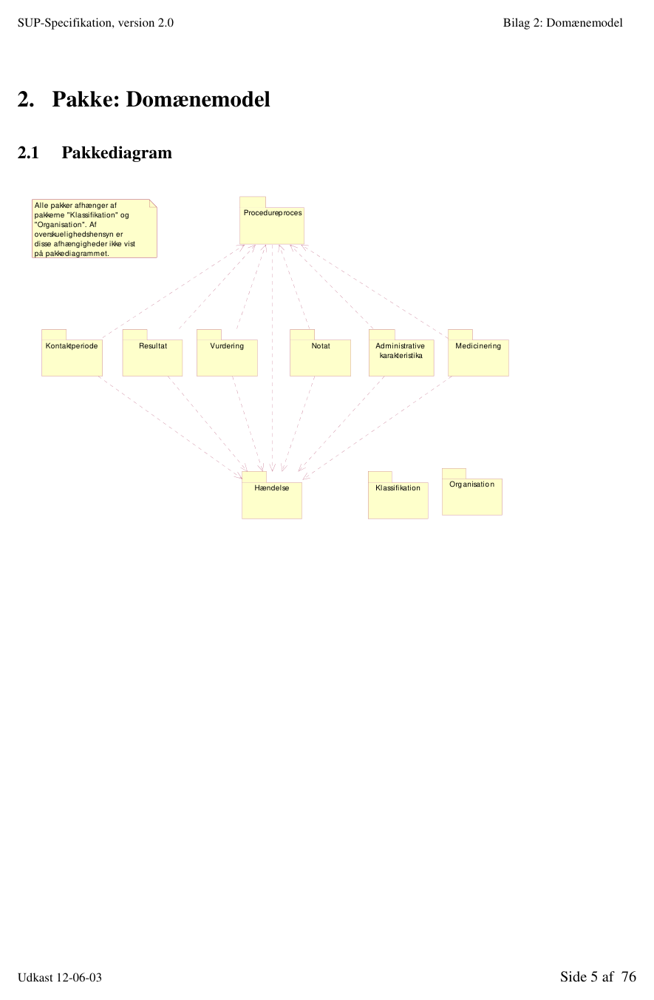

<!-- Billedbeskrivelse: Pakkediagrammet viser SUP-domænemodellens hovedpakker og deres afhængigheder. Hændelse er centralt placeret, mens bl.a. Notat, Procedureproces, Resultat, Administrative karakteristika, Kontaktperiode, Medicinering og Vurdering er særskilte faglige pakker. Dokumentet angiver desuden, at alle pakker afhænger af Klassifikation og Organisation, selv om disse afhængigheder ikke alle er tegnet. -->

## 2. Pakke: Domænemodel

### 2.1. Pakkediagram

```text
Alle pakker afhænger af
pakkerne "Klassifikation" og                       Procedurep roces
"Organisation". Af
overskuelighedshensyn er
disse afhængigheder ikke vist
på pakkediagrammet.
```

```text
Kontaktperiode               Resultat   Vurdering                  Notat   Administrative     Medicinering
karakteristika
```

Hændelse               Klassifikation    Org anisatio n

---

<!-- Kilde: PDF side 6 -->

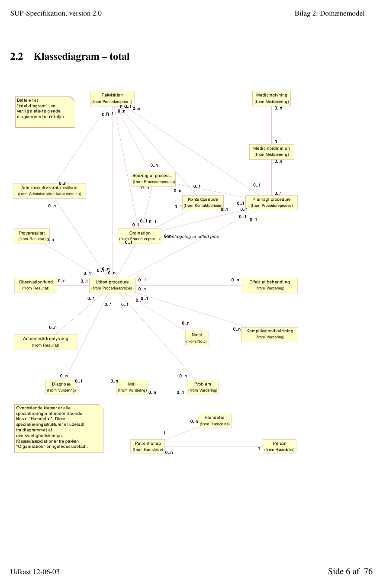

<!-- Billedbeskrivelse: Det samlede klassediagram viser de centrale hændelsestyper og deres relationer omkring Udført procedure, Patientforløb og Person. Diagrammet fremhæver, at de viste kliniske og administrative klasser er specialiseringer af Hændelse; organisationsrelationer er udeladt af hensyn til overskueligheden. -->

### 2.2. Klassediagram – total

```text
Rekvisit ion                                                                                                      Medicingivning
Det te e r et                                   (f rom Procedureproc...)                                                                                              (f r om Medic inering )
"tot al -d iagram" - se                                             0..1 0..n
0..1                                                                                                               0..n
ven li gst ef te rf ølg ende                                    0..n
0..1
0..1
```

dia gram mer f or det aljer.

0..1
```text
Medicinordination
(f r om Medic inering )
0..n
0.. n
```

```text
Booking af proced...
0..n                                                  (f rom Procedureproces)
0..1                                        0..1
Admi nistrati v karakt erist iku m                                                0..n
0..n
(f rom Administrativ e karakteristika)                                                                                                                                          0..1
Ko nta ktpe riode                                Planlagt procedure
0..1 (f rom Procedureproces)
0..n                                                                                    0..1 (f rom Kontaktperiode)
0..1                  0..1
0..1
0..1 0..1                                                                       0..1
0.. 1
Prøveresultat                                                             Ordination
0..n
Planlægning af udført proc
(f rom Resultat) 0..n                                              (f rom Procedureproc.. .)
0..1
```

0..n
0..1
```text
0..1            0..n
0..n          0..1                                     0 .. 1                                                                0..n
Observation/fund                                 Udført procedure                                                                                                  Effekt af behandling
(f rom Resultat)                              (f rom Procedureproces)         0..n                                                                                  (f rom Vurdering)
```

```text
0..1                                  0..1
0..1
0..1         0..1
```

0..n
```text
0..n                                                                                                                                0..n      Komplikation/bivirkning
Notat                                         (f rom Vurdering)
Anamnestisk oplysning
(f rom No...)
(f rom Resultat)
```

```text
0..n                                                                             0..n
0..1                     0.. n
Di agno se                                         Mål                                          Problem
(f rom Vurdering)                              (f r om Vu rde ring )
0..n              0..1 (f rom Vurdering)
```

Ovenstående klasser er alle
specialiseringer af nedenstående
```text
klasse "Hændelse". Disse                                                                                                           Hændelse
0..n
specialiseringsstrukturer er udeladt                                                                                            (f r om H æn de lse)
```

fra diagrammet af
1
overskuelighedshensyn.
```text
Klasser/associationer fra pakken                                               Patientforløb                                                                                         Person
"Organisation" er ligeledes udeladt.                                                                                                                                        1 (f r om H æn de lse)
(f rom Hændelse)
0..n
```


---

<!-- Kilde: PDF side 7 -->

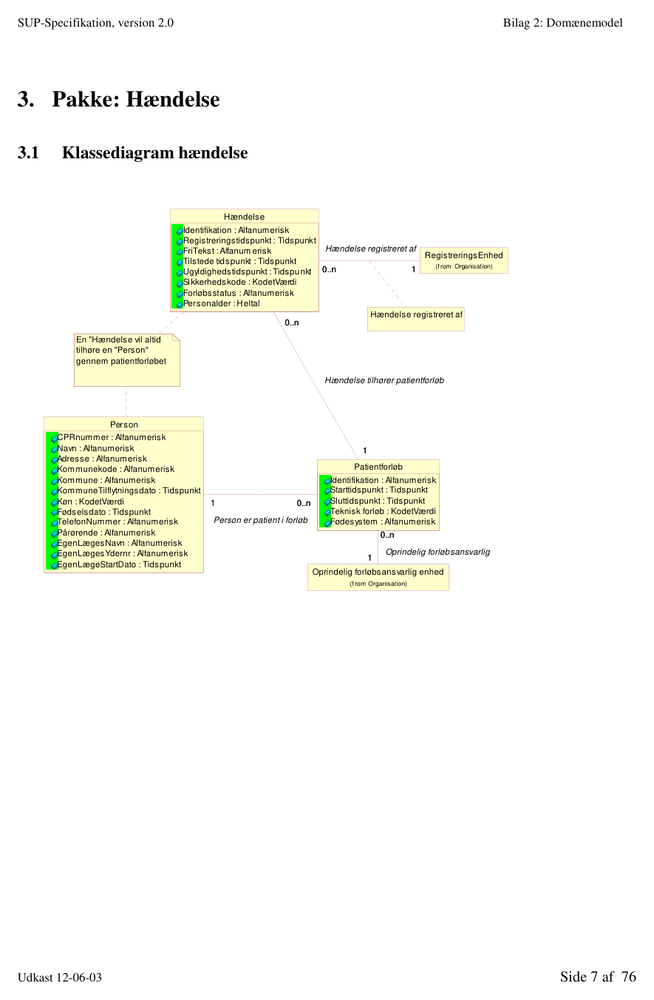

<!-- Billedbeskrivelse: Diagrammet viser grundmodellen for Hændelse: en Hændelse tilhører et Patientforløb, et Patientforløb vedrører én Person, og hændelser registreres af en RegistreringsEnhed. Patientforløbet har desuden en oprindelig forløbsansvarlig organisatorisk enhed. -->

## 3. Pakke: Hændelse

### 3.1. Klassediagram hændelse

Hændelse
```text
Identifikation : Alfanumerisk
Registreringstidspunkt : Tidspunkt
FriTekst : Alfanum erisk           Hændelse registreret af
RegistreringsEnhed
Tilstede tid spunkt : Tidspunkt
(f rom Organisation)
Ugyldighedstidspunkt : Tidspu nkt 0..n                   1
Si kkerhedskode : KodetVærdi
Forløbsstatus : Alfanumerisk
Personalder : H eltal
Hændelse registreret af
0..n
```

```text
En "Hændelse vil altid
tilhøre en "Person"
gennem patientforløbet
```

Hændelse tilhører patientforløb

Person
```text
CPRnummer : Alfanumerisk
Navn : Alfanumerisk                                                              1
Adresse : Alfanumerisk
Kommunekode : Alfanumerisk                                                    Patientforløb
Kommune : Alfanumerisk                                                  Identifikation : Alfanumerisk
KommuneTilflytningsdato : Tidspunkt                                     Starttidspunkt : Tidspunkt
Køn : KodetVærdi                      1                      0..n       Sluttidspunkt : Tidspunkt
Fødselsdato : Tidspunkt                                                 Teknisk forløb : KodetVærdi
TelefonNummer : Alfanumerisk          Person er patient i forløb        Fødesystem : Alfanumerisk
Pårørende : Alfanumerisk                                                                 0..n
EgenLægesNavn : Alfanumerisk
EgenLægesYdernr : Alfanumerisk                                                            Oprindelig forløb sansvarlig
1
EgenLægeStartDato : Tidspunkt
Oprindelig forløbsansvarlig enhed
(f rom Organisation)
```


---

<!-- Kilde: PDF side 8 -->

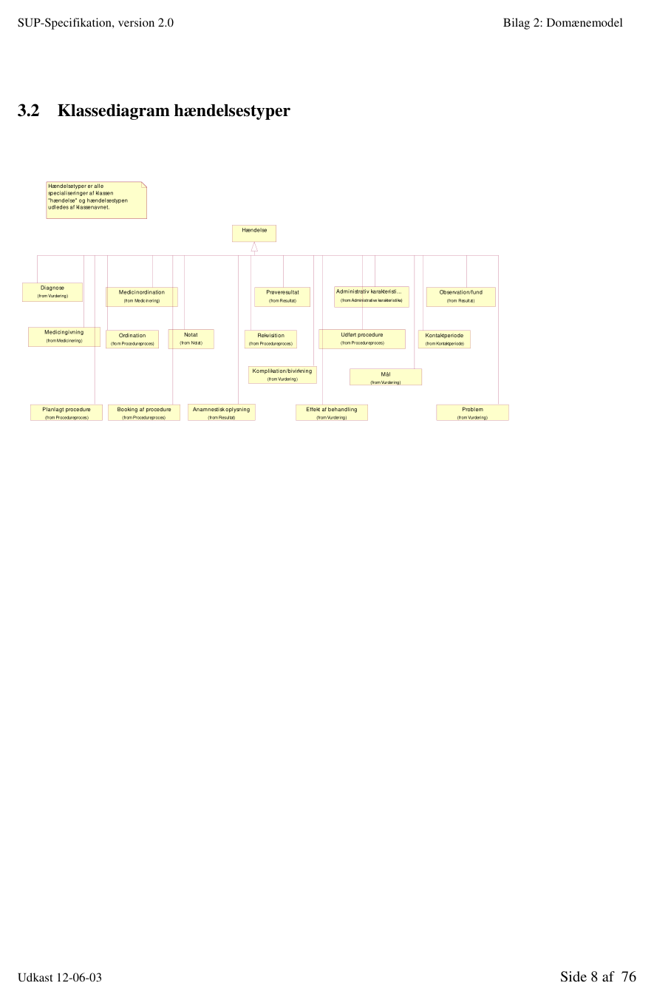

<!-- Billedbeskrivelse: Diagrammet viser hændelseshierarkiet: Medicinordination, Medicingivning, Notat, Prøveresultat, Observation/fund, Diagnose, Administrativ karakteristikum, Rekvisition, Kontaktperiode, Udført procedure, Ordination, Planlagt procedure, Booking af procedure, Anamnestisk oplysning, Effekt af behandling, Komplikation/bivirkning, Problem og Mål er alle specialiseringer af Hændelse. -->

### 3.2. Klassediagram hændelsestyper

```text
Hændelsetyper er alle
specialiseringer af klassen
"hændelse" og hændelsestypen
udledes af klassenavnet.
```

Hændelse

Diagnose
```text
Medic inordination                                                    Prøveresultat                     Administrativ karakteristi...                   Observation/fund
(from Vurdering)
(from Medic inering)                                                  (from Resultat)                   (from Administrative karakteristika)              (from Result at )
```

```text
Medicingivning                                           Notat                                                                         Udført procedure
Ordination                                                        Rekvisition                                                                    Kontaktperiode
(from Medicinering)
(from Procedureproces)        (from Notat )                       (from Procedureproces)                      (from Procedureproces)                 (from Kontaktperiode)
```

```text
Komplikation/bivirkning
Mål
(from Vurdering)
(from Vurdering)
```

```text
Planlagt procedure           Booking af procedure              Anamnestisk oplysning                                    Effekt af behandling                                                       Problem
(from Procedureproces)        (from Procedureproces)                   (from Resultat)                                     (from Vurdering)                                                    (from Vurdering)
```


---

<!-- Kilde: PDF side 9 -->

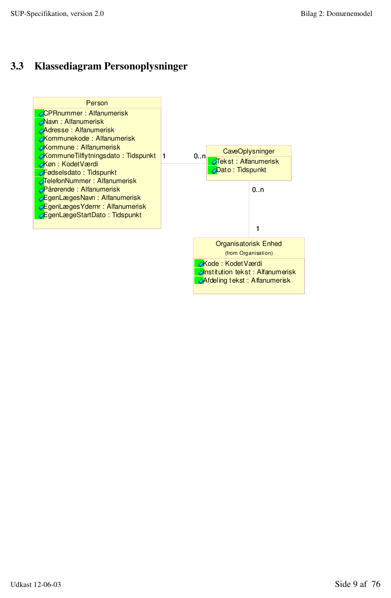

<!-- Billedbeskrivelse: Diagrammet viser Person med demografiske og administrative attributter samt relationen til CaveOplysninger. En person kan have flere caveoplysninger, og caveoplysninger kan knyttes til en organisatorisk enhed. -->

### 3.3. Klassediagram Personoplysninger

Person
```text
CPRnummer : Alfanumerisk
Navn : Alfanumerisk
Adresse : Alfanumerisk
Kommunekode : Alfanumerisk
Kommune : Alfanumerisk
CaveOplysninger
KommuneTilflytningsdato : Tidspunkt 1   0..n
Køn : KodetVærdi                               Tek st : Alfanumerisk
Fødselsdato : Tidspunkt                        Dat o : Tidspunkt
TelefonNummer : Alfanumerisk
Pårørende : Alfanumerisk                                     0..n
EgenLægesNavn : Alfanumerisk
EgenLægesYdernr : Alfanumerisk
EgenLægeStartDato : Tidspunkt
```

1

```text
Organisatorisk Enhed
(from Organisation)
```

```text
Kode : Kodet Værdi
Inst it ution tek st : Alfanumerisk
Afdeling t ekst : A lfanumerisk
```


---

<!-- Kilde: PDF side 10 -->

### 3.4. Klasser

#### 3.4.1. CaveOplysninger

```text
Attributter                        Beskrivelse                                                         Type
Tekst                              En tekstuel beskrivelse af f.eks. allergier, steroidbehandling,     Alfanumerisk
vigtige dispositioner, pacemaker, visse diagnoser som epilepsi
og diabetes.
Dato                               Dato for hvornår Caveoplysning er registreret.                      Tidspunkt
```

Associationer

#### 3.4.2. Hændelse

En ting, der sker, eller en egenskab, der konstateres, i relation til en patient.

```text
Attributter                        Beskrivelse                                                         Type
Identifikation                     Registreringssystemets entydige ID for hændelsen.                   Alfanumerisk
Bruges til identifikation, herunder ved referencer.
Registreringstidspunkt             Automatisk tidsstempel ved registreringen.                          Tidspunkt
Dette felt vil ikke dække alle felterne i recorden. Nogle felter
er systemudfyldte / hentet fra anden registrering. Dette fremgår
af kommentarerne til de enkelte felter eller implicit af sam-
menhængen.
FriTekst                           Fri tekst til hændelsen formateret i XHTML. Når friteksten          Alfanumerisk
vises formateret i en SUP web browser applikation skal den
kunne udprintes på en standard side.
```

```text
Her gengives al fri tekst vedr. hændelsen, undtaget brødteksten
i notater (som findes i attributten "Brødtekst" formateret i
XHTML).
```

```text
- Medicin ordination:
Her tilføjes i fri tekst relevante supplerende oplysninger,
som ikke er medtaget på struktureret form, f.eks.
dosering (f.eks. 2+1+1), doseringstidspunkter,
infusionshastighed og særlige instrukser.
- Kontaktperiode:
F.eks. henvisningstekst.
Tilstede tidspunkt                 Tidspunkt for tilføjelse af elementet til systemets database.      Tidspunkt
Overskrives af modtageren ved overførsel af data til modtage-
rens SUP-database. Bevares ved udtræk af data til analyse.
Anvendes primært ved visse analyser.
Ugyldighedstidspunkt               Blank=gyldig. Udfyldt=ugyldig fra det anførte tidspunkt.           Tidspunkt
Ugyldighedstidspunkt.
Tidspunkt fra hvilket en hændelses informationselement er
ugyldigt pga. opdatering.
Ugyldige informations elementer skal ikke medtages ved
kommunikation. Feltet er beregnet til brug ved opdateringer og
til analyseformål.
Sikkerhedskode                     Værdisæt ikke fastlagt.                                            KodetVærdi
Reserveret til fremtidig brug, f.eks. til angivelse af adgangs-
```


---

<!-- Kilde: PDF side 11 -->

betingelser etc
Forløbsstatus                    SUP-kode for statustype eller kontaktperiodetype                     Alfanumerisk
```text
Patientens status på hændelsens starttidspunkt., dvs. f.eks. "I",
hvis kontaktperioden er en indlæggelse. Indtil videre anvendes
kontakttypen, når man kontaktregistrerer.
```

```text
Udfyldes med værdisættet:
- D (Død)
- I (Indlagt)
- A (Ambulant, der også omfatter: Deldøgn, Forambulant,
Efterambulant, Almindelig ambulant, Skadestuepatient)
- H (Henvist)
- L (Lægepraksis, herunder: Almen lægepraksis, Speciallæge-
praksis)
- S (Inaktiv)
Personalder                      Personens alder på hændelsens starttidspunkt rundet ned.             Heltal
```

Associationer
Navn: Hændelse registreret af
Hvilken enhed registrerer hændelsen?
(hvilken organisatorisk enhed og evt. behandler)

Navn: Hændelse tilhører patientforløb

#### 3.4.3. Hændelse registreret af

```text
Attributter                      Beskrivelse                                                          Type
Registrerende medarbejder        Registrerende persons ID. Logon ved registreringen.                  Alfanumerisk
Dette felt vil kun dække nogle af felterne i recorden. Andre er
systemudfyldte.
```

Associationer

#### 3.4.4. Patientforløb

En del af et sygdomsforløb, hvor en person er i kontakt med sundhedsvæsenet med henblik på under-
søgelse, behandling og/eller pleje af samme helbredsproblem.
Bem.: "Helbredsproblem" omfatter i denne forbindelse både aktuelle, tidligere og potentielle hel-
bredsproblemer. En person kan have to eller flere patientforløb samtidigt for forskellige helbredspro-
blemer.

```text
Attributter                      Beskrivelse                                                     Type
Identifikation                   Oprindelig identifikation af forløbet. Den entydige forløbs-ID Alfanumerisk
fra det system, hvor forløbet oprettes.
Ved teknisk oprettet forløb er forløbs-ID = oprindelig Kontakt-
ID.
Starttidspunkt                   Forløbets starttidspunkt.                                       Tidspunkt
```


---

<!-- Kilde: PDF side 12 -->

Sluttidspunkt                    Forløbets afslutningstidspunkt.                                   Tidspunkt
```text
Teknisk forløb                   Markering af teknisk oprettet forløb ved kontaktregistrering.     KodetVærdi
Værdier: x = teknisk oprettet forløb. Ellers blank.
```

```text
Fødesystem                       Fødesystem: Kode for det fødesystem, som forløbet er udtruk-      Alfanumerisk
ket fra. Bemærk at de udtrukne data oprindeligt kan være regi-
streret i et andet system.
```

```text
Klassifikationens koder bygges op som en streng med de første
5 karakterer til leverandørnavnet og de næste 5 karakterer til
systemnavnet.
```

Associationer
Navn: Hændelse tilhører patientforløb

Navn: Oprindelig forløbsansvarlig
Hvem er oprindeligt forløbsansvarlig?
(Den organisatoriske enhed, der opretter forløbet.)

Navn: Person er patient i forløb

#### 3.4.5. Person

Et individ identificeret ved et CPR-nummer.

```text
Attributter                      Beskrivelse                                                     Type
CPRnummer                        Patientens CPR-nummer. Skal almindeligvis anonymiseres i        Alfanumerisk
dataudtræk til analyseformål. Det anonymiserede ID er i så fald
ens for den enkelte person i forskellige udtræk.
Navn                             Personens officielle navn på udtrækstidspunktet.                Alfanumerisk
```

```text
Adresse                          Personens folkeregister-adresse på udtrækstidspunktet.            Alfanumerisk
Konkatenering af vej, vejnummer, (evt. stednavn), postnum-
mer, by.
Kommunekode                      Kommunekode for personens bopælskommune i henhold til             Alfanumerisk
den officielle klassifikation af kommuner.
Kommune                          Navn på kommune.                                                  Alfanumerisk
```

KommuneTilflytningsdato          Tilflytningsdato til kommunen.                                    Tidspunkt
```text
Køn                              Værdisæt: M, K, U (ukendt).                                       KodetVærdi
Personens køn på hændelsens starttidspunkt.
Fødselsdato                      Personens fødselsdato                                             Tidspunkt
```

TelefonNummer                    Personens telefonnummer på udtrækstidspunktet.                    Alfanumerisk
```text
Pårørende                        Angivelse af personens pårørende med f.eks. navn, adresse,  Alfanumerisk
telefonnummer og personens relation til den pårørende (ek-
sempelvis mor, veninde, etc.).
EgenLægesNavn                    Oplysninger om personens egen læge på udtrækstidspunkt. Kan Alfanumerisk
f.eks. være oplysninger om navn, adresse og telefonnummer.
EgenLægesYdernr                  Sygesikringens officielle ydernummer på personens egen læge Alfanumerisk
```


---

<!-- Kilde: PDF side 13 -->

```text
på udtrækstidspunktet.
EgenLægeStartDato                Dato hvor personen har fået tilknyttet egen læge.    Tidspunkt
```

Associationer
Navn: Person er patient i forløb

---

<!-- Kilde: PDF side 14 -->

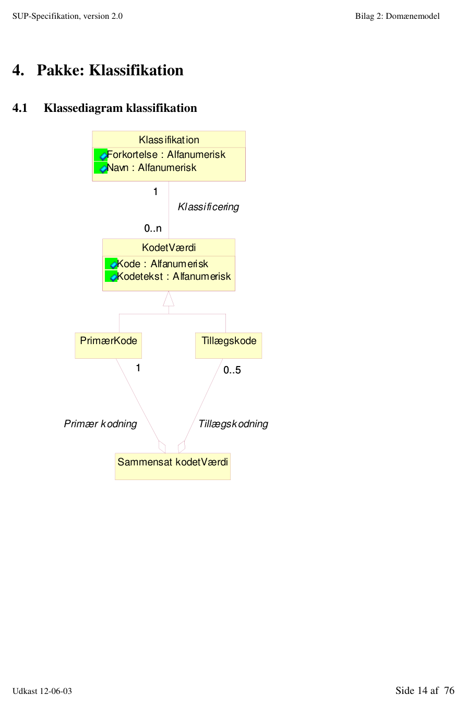

<!-- Billedbeskrivelse: Diagrammet viser klassifikationsmodellen: Klassifikation indeholder KodetVærdi; KodetVærdi specialiseres til PrimærKode og Tillægskode. Sammensat kodetVærdi består af én primærkode og op til fem tillægskoder. -->

## 4. Pakke: Klassifikation

### 4.1. Klassediagram klassifikation

```text
Klass ifikat ion
Forkortelse : Alfanumerisk
Navn : Alfanumerisk
```

1
Klassificering

0..n
KodetVærdi
```text
Kode : Alfanumerisk
Kodetekst : Alfanumerisk
```

PrimærKode                      Tillægskode
## 1. 0..5

Primær k odning                      Tillægsk odning

Sammensat kodetVærdi

---

<!-- Kilde: PDF side 15 -->

### 4.2. Klasser

#### 4.2.1. Klassifikation

En formålsbestemt opdeling af begreber i klasser efter ét eller flere inddelingskriterier.

Eksempler på forekomster:

SKS=SKS-klassifikationen
SGH=Sygehus-afdelingsklassifikationen
ICPC=ICPC-klassifikation
SNO=Snomed
SUP=dedikeret SUP-kode
LOK=lokal kode (altid x foran)
STED=Lokale klassifikationer over "Sted", dvs. geografisk sted / lokation
PERS=Lokale klassifikationer over "Person", dvs. titel og navn på personer(medarbejdere)
ENH=Klassifikation af måleenheder
KOM=Kommunekode klassifikation
YDNR=Sygesikringens klassifikation over ydernumre
IUPAC=International Union of Pure And Applied Chemistry.
ATC=Anatomisk-Terapeutisk-(Ch)kemisk klassifikation af lægemiddel indholdsstoffer.
ATC-koder anvendes som tillægskoder til specificering af diagnose- og procedurekoder.
For uofficielle præparater: Lokal.

```text
Attributter                       Beskrivelse                                                   Type
Forkortelse                       SUP-Kode for en klassifikation                                Alfanumerisk
```

Navn                              Kodetekst til ovennævnte kode                                 Alfanumerisk

Associationer
Navn: Klassificering

#### 4.2.2. KodetVærdi

En alfanumerisk repræsentation af et begreb

```text
Attributter                       Beskrivelse                                                   Type
Kode                              Alfanumerisk repræsentation af et begreb                      Alfanumerisk
```

```text
Kodetekst                         Den til en kode hørende korte tekstuelle beskrivelse. I særlige Alfanumerisk
tilfælde dog en konkateneret tekst sammensat fra flere kodetek-
ster.
```

Eksempler: (præparater)
```text
Konkatenering af felterne: "Navn", "Form", "Styrke" uden
overflødige blanke. Hentes fra LMS-takst.
Ved lokal kode anvendes lokal tekst.
```


---

<!-- Kilde: PDF side 16 -->

Associationer
Navn: Klassificering

#### 4.2.3. PrimærKode

En repræsentation af et begreb, der kan anvendes som en selvstændig beskrivelse af et objekt.

Associationer
Navn: Primær kodning

#### 4.2.4. Sammensat kodetVærdi

En multiaksial kodekombination bestående af én primærkode og ingen, én eller flere tillægskoder. I
SUP kan kombinationen af tekniske grunde indeholde fra 0 til 5 tillægskoder

Associationer
Navn: Primær kodning

Navn: Tillægskodning

#### 4.2.5. Tillægskode

En repræsentation af et begreb, der supplerer en primærkodes beskrivelse af et objekt. Tillægskoder
må supplere, men ikke ændre betydningen af primærkoden. Tillægskoder skal opfattes som supple-
rende akser i en multiaksial kodning.

Associationer
Navn: Tillægskodning

---

<!-- Kilde: PDF side 17 -->

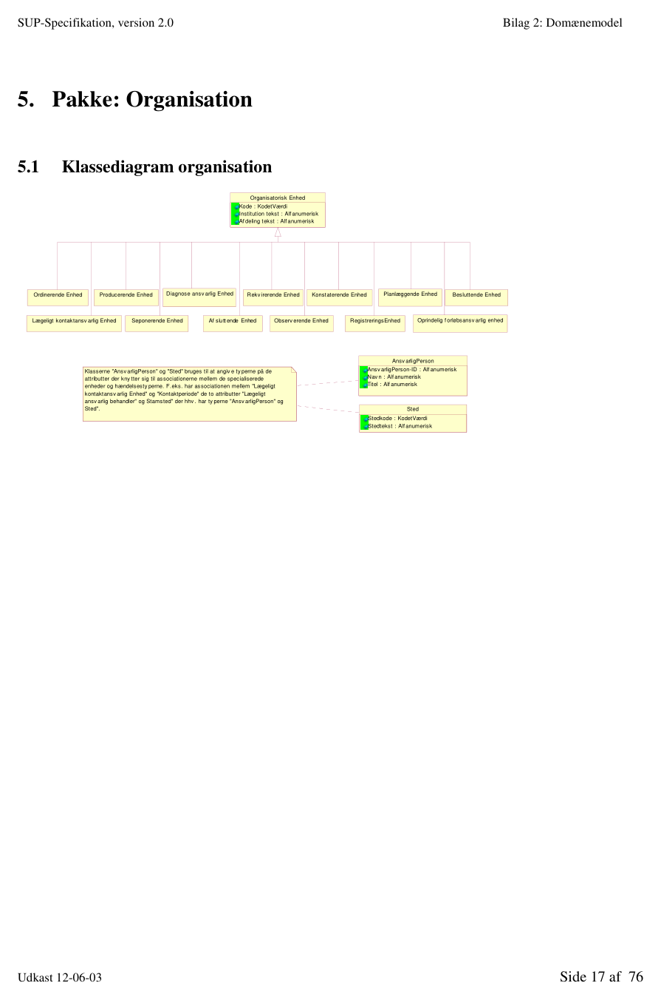

<!-- Billedbeskrivelse: Diagrammet viser Organisation-pakkens specialiseringer af Organisatorisk Enhed, bl.a. registrerende, ordinerende, producerende, rekvirerende, afsluttende og diagnoseansvarlig enhed. AnsvarligPerson og Sted anvendes som attributtyper på associationerne mellem organisatoriske enheder og hændelser. -->

## 5. Pakke: Organisation

### 5.1. Klassediagram organisation

```text
Organisatorisk Enhed
Kode : KodetVærdi
Institution tekst : Alf anumerisk
Af deling tekst : Alf anumerisk
```

Ordinerende Enhed        Producerende Enhed         Diagnose ansv arlig Enhed       Rekv irerende Enhed        Konstaterende Enhed         Planlæggende Enhed         Besluttende Enhed

Lægeligt kontaktansv arlig Enhed       Seponerende Enhed              Af slutt ende Enhed       Observ erende Enhed          RegistreringsEnhed          Oprindelig f orløbsansv arlig enhed

```text
Ansv arli gPerson
Klasserne "Ansv arligPerson" og "Sted" bruges til at angiv e ty perne på de                                      Ansv arligPerson-ID : Alf anumerisk
attributter der kny tter sig til associationerne mellem de specialiserede                                        Nav n : Alf anumerisk
enheder og hændelsesty perne. F.eks. har associationen mellem "Lægeligt                                          Titel : Alf anumerisk
kontaktansv arlig Enhed" og "Kontaktperiode" de to attributter "Lægeligt
ansv arlig behandler" og Stamsted" der hhv . har ty perne "Ansv arligPerson" og
Sted".                                                                                                                          Sted
Stedkode : KodetVærdi
Stedtekst : Alf anumerisk
```


---

<!-- Kilde: PDF side 18 -->

### 5.2. Klasser

#### 5.2.1. Afsluttende Enhed

Den enhed (institutionsafdeling / praksis), som afslutter den pågældende hændelse.

- Planlagt procedure:
Den enhed, der afslutter planen for den pågældende patient.
```text
Den enhed, der faktisk effektuerer/afslutter rekvisitionen.
Det vil normalt være producenten, men kan også være rekvirenten
selv ved annullering af rekvisitionen.
```

- Booking af procedure:
```text
Den enhed, der afslutter = aflyser bookingen. Ved patientens udeblivelse
er afslut. enhed = proc.enhed. Årsagen til aflysningen bør fremgå af
afslutningsårsagen. Når bookingen gennemføres, er der ingen afsluttende enhed.
```

- Udført procedure:
Den enhed, der afslutter en procedure med udstrækning, f.eks. fjerner et kateter.
Den enhed, der afslutter en medicingivning, f.eks. ved nedtagning af et drop.
```text
Den enhed, der afslutter den givne status/kontakt. Næsten altid lig
stamafdelingen, men personen vil ofte være en anden end "Ansvarlig person".
```

- Diagnose:
Den enhed, der afslutter / lukker diagnosen.
Den enhed, der afslutter problemet.
Den enhed, der afslutter målet.
Den enhed, der afslutter det pågældende karakteristikum.

Associationer
Navn: Administrativt karakteristikum afsluttet af
Hvem har afsluttet administrativt karakteristikum?
(hvilken organisatoriske enhed og evt. behandler)

Navn: Booking af procedure afsluttet af
Hvem har afsluttet booking af procedure?
(hvilken organisatoriske enhed og evt. behandler)

Navn: Diagnose afsluttet af
Hvem har afsluttet diagnosen?
(hvilken organisatoriske enhed og evt. behandler)

Navn: Kontaktperiode afsluttet af
Hvem har afsluttet kontaktperioden?
(hvilken organisatoriske enhed og evt. behandler)

Navn: Medicingivning afsluttet af
Hvem har afsluttet medicingivningen?
(hvilken organisatoriske enhed og evt. behandler)

Navn: Mål afsluttet af

---

<!-- Kilde: PDF side 19 -->

Hvem afslutter målet?

(hvilken organisatoriske enhed og evt. behandler)

Navn: Planlagt procedure afsluttet af

Navn: Problem afsluttet af
Hvem afslutter problemet?

(hvilken organisatoriske enhed og evt. behandler)

Navn: Rekvisition faktisk afsluttet af
Hvem har faktisk effektueret rekvisitionen?
(hvilken organisatoriske enhed og evt. behandler)

Navn: Udført procedure afsluttet af
Hvem har afsluttet den udførte procedure?
(hvilken organisatoriske enhed og evt. behandler)

#### 5.2.2. AnsvarligPerson

Den ansvarlige person fra den ansvarlige enhed. Konkatenering af titel og navn.
Bør være kodetekster fra et personaleregister.

```text
Attributter                      Beskrivelse                                                        Type
AnsvarligPerson-ID               Lokal ID for den person, der har et (med-)ansvar for hændel-       Alfanumerisk
sen.
Kan være patienten selv - i såfald er ID: "Patienten selv"
Navn                             Behandlerens navn                                                  Alfanumerisk
```

```text
Titel                            Behandlerens titel. Titel og Navn konkateneres i det tekstfelt,    Alfanumerisk
der er afsat til "behandler"
```

Associationer

#### 5.2.3. Besluttende Enhed

Den enhed, der opstiller målet

Associationer
Navn: Mål besluttet af
Hvem har opstillet målet?
(hvilken organisatoriske enhed og evt. behandler)

#### 5.2.4. Diagnose ansvarlig Enhed

Diagnoseansvarlig enhed. Den enhed, der stiller diagnosen.

Associationer
Navn: Diagnosticering udført af

---

<!-- Kilde: PDF side 20 -->

Hvem har udført diagnosticeringen?
(hvilken organisatoriske enhed og evt. behandler)

#### 5.2.5. Konstaterende Enhed

- Administrativ karakteristikum:
Den enhed, der konstaterer eller beslutter et administrativt karakteristikum.
- Anamnestisk oplysning:
Den enhed, der konstaterer oplysningen.
- Problem:
Den enhed, der konstaterer problemet.

Associationer
Navn: Administrativt karakteristikum konstateret af
Hvem har konstateret et givet adm.karakteristikum?
(hvilken organisatoriske enhed og evt. behandler)

Navn: Anamnestisk oplysning konstateret af
Hvem har konstateret de anamnestiske oplysninger?
(hvilken organisatoriske enhed og evt. behandler)

Navn: Problem konstateret af
Hvem har konstateret problemet?

(hvilken organisatoriske enhed og evt. behandler)

#### 5.2.6. Lægeligt kontaktansvarlig Enhed

Den lægeligt ansvarlige enhed for kontakten / statussen (dvs. stamafdelingen).
Hvis ansvaret skifter, oprettes en ny hændelse af denne type.

Associationer
Navn: Lægelig ansvarlig for kontaktperiode
Hvem er lægelig ansvarlig for kontaktperiode?
(hvilken organisatoriske enhed og evt. behandler)

#### 5.2.7. Observerende Enhed

- Den enhed, der observerer en observation / et fund

- Den enhed, der observerer, konstaterer eller får oplyst effekten af en behandling.

- Den enhed, der observerer eller får oplyst komplikationen eller bivirkningen.

Associationer
Navn: Anamnestisk oplysning observeret af
Hvem har observeret/konstateret de anamnestiske oplysninger?
(hvilken organisatoriske enhed og evt. behandler)

---

<!-- Kilde: PDF side 21 -->

Navn: Effekt af behandling observeret af
Hvem har observeret (eller konstateret) effekten?
(hvilken organisatoriske enhed og evt. behandler)

Navn: Komplikation/bivirkning observeret af
Hvem har observeret/konstateret (eller fået oplyst) komplikationen eller bivirkningen.
(hvilken organisatoriske enhed og evt. behandler)

Navn: Observation/fund observeret af
Hvem har observeret/fundet?
(hvilken organisatoriske enhed og evt. behandler)

#### 5.2.8. Oprindelig forløbsansvarlig enhed

Oprindelig forløbsansvarlig enhed.
Den lægefagligt ansv. institution og afdeling, der opretter forløbet / kontaktperioden.
Kan evt. være et ydernr.

Associationer
Navn: Oprindelig forløbsansvarlig
Hvem er oprindeligt forløbsansvarlig?
(Den organisatoriske enhed, der opretter forløbet.)

#### 5.2.9. Ordinerende Enhed

Den enhed, der foretager ordinationen.

Associationer
Navn: Medicingivning ordineret af
Hvem har ordineret medicingivningen?
(hvilken organisatoriske enhed og evt. behandler)

Navn: Medicinordination ordineret af
Hvem har ordineret medicinordinationen?
(hvilken organisatoriske enhed og evt. behandler)

Navn: Ordination ordineret af
Hvem ordinerer ordinationen?
(hvilken organisatoriske enhed og evt. behandler)

#### 5.2.10. Organisatorisk Enhed

```text
Attributter                      Beskrivelse                                                       Type
Kode                             Kodet værdi efter:                                                KodetVærdi
1) SST's sygehusafdelings klassifikation.,
min. 6, max. 7 karak.
2) Ydernummerklassifikation
Oprindelig forløbsansvarlig enhed.
Den lægefagligt ansvarlige enhed (institutionsafdeling / prak-
```


---

<!-- Kilde: PDF side 22 -->

```text
sis), der opretter forløbet / kontaktperioden.
Institution tekst                Kodetekst til forudgående kode.                                  Alfanumerisk
Her angives sygehusets navn eller kodetekst til ydernummeret.
Afdeling tekst                   Kodetekst til forudgående kode.                                  Alfanumerisk
Her angives afdelingens navn.
```

Associationer

#### 5.2.11. Planlæggende Enhed

Den enhed, der lægger / vælger planen for patienten.

Associationer
Navn: Planlagt procedure planlagt af

#### 5.2.12. Producerende Enhed

Den producerende enhed.
F.eks.
- Den enhed, der udfører proceduren.
- Den enhed, der giver medicinen.
- Den enhed, der frembringer prøveresultatet / svaret, f.eks. et laboratorium.
- Den enhed, der udarbejder notatet.
- Den planlagte producerende enhed
- Den enhed, der skal gennemføre den bookede procedure. Hvis andre end producenten selv booker,
gør de det på producentens vegne, og bookeren vil fremgå af reg. afd. og person.
- Den enhed, der har udført en procedure, som udløser en komplikation eller bivirkning.
- Den enhed, der har udført den procedure, som man tilskriver effekten.

Associationer
Navn: Booking af procedure produceret af
Hvem skal gennemføre den bookede procedure?
(hvilken organisatoriske enhed og evt. behandler)

Hvis andre end producenten selv booker, gør de det på producentens vegne, og bookeren vil fremgå af
reg. afd. og person.

Navn: Effekt af behandling produceret af
Hvem har udført den procedure, som man nu observerer effekten af ?
(hvilken organisatoriske enhed/og evt. behandler)

Navn: Komplikation/bivirkning produceret af
Hvem har udført den procedure, som udløser en komplikation eller bivirkning.

(hvilken organisatoriske enhed/og evt. behandler)

Navn: Medicin givet af
Hvem har givet medicinen?
(hvilken organisatoriske enhed og evt. behandler)

---

<!-- Kilde: PDF side 23 -->

Navn: Medicin planlagt givet af
Hvem er medicinen planlagt givet af?
(hvilken organisatoriske enhed og evt. behandler)

Navn: Notat produceret af
Hvem har produceret notatet?
(hvilken organisatoriske enhed og evt. behandler)

Navn: Ordination planlagt produceret af
Hvem er planlagt producent af ordinationen?
(hvilken organisatoriske enhed og evt. behandler)

Navn: Prøveresultat produceret af
Hvem har produceret prøveresultatet?
(hvilken organisatoriske enhed og evt. behandler)

Navn: Rekvisition planlagt produceret af
Rekvirenten sender rekvisitionen til Producerende Enhed

Navn: Udført procedure produceret af
Hvem har produceret den udførte procedure?
(hvilken organisatoriske enhed og evt. behandler)

#### 5.2.13. RegistreringsEnhed

Logon ved registreringen.
Dette felt vil kun dække nogle af felterne i recorden. Andre er systemudfyldte.

Associationer
Navn: Hændelse registreret af
Hvilken enhed registrerer hændelsen?
(hvilken organisatorisk enhed og evt. behandler)

#### 5.2.14. Rekvirerende Enhed

Den enhed, der foretager rekvisitionen.

Den enhed, der har rekvireret proceduren.
Herunder også ordinerende enhed, hvis der ikke foreligger en rekvisition.

Den enhed der har rekvireret bookningen.

Den enhed der har rekvireret prøveresultatet.

Den enhed, der har rekvireret kontaktperioden/statussen, f.eks. henvisende enhed. Herunder også
ordinerende afd., hvis der ikke foreligger en rekvisition.
Obligatorisk for sygehusafdelinger.

Rekvirerende enhed for notatet, herunder også ordinerende enhed, hvis der ikke foreligger en rekvisi-
tion.
Relevant f.eks. ved tilsyn og andre tilsvarende svar på notatform.

Associationer
Navn: Booking af procedure rekvireret af

---

<!-- Kilde: PDF side 24 -->

Hvem har rekvireret den bookede procedure?
(hvilken organisatoriske enhed og evt. behandler)

Den enhed, der har rekvireret proceduren. Herunder også ordinerende enhed, hvis der ikke foreligger
en rekvisition.

Navn: Notat rekvireret af
Hvem har rekvireret notatet?
(hvilken organisatoriske enhed og evt. behandler)

Navn: Prøveresultat rekvireret af
Hvem har rekvireret prøveresultatet?
(hvilken organisatoriske enhed og evt. behandler)

Navn: Rekv.enhed til kontaktperiode
Hvem er rekvireret til kontaktperioden?
(hvilken organisatoriske enhed og evt. behandler)

Navn: Rekvisition rekvireret af
Hvem har rekvireret rekvisitionen?
(hvilken organisatoriske enhed og evt. behandler)

Navn: Udført procedure rekvireret af
Hvem har rekvireret den udførte procedure?
(hvilken organisatoriske enhed og evt. behandler)

#### 5.2.15. Seponerende Enhed

Den enhed, der seponerer (afslutter) ordinationen (før det planlagte sluttidspunkt, hvis et sådant fin-
des).

Associationer
Navn: Medicinordination seponeret af
Hvem har seponeret medicinordinationen?
(hvilken organisatoriske enhed og evt. behandler)

Navn: Ordination seponeret af
Hvem har seponeret ordinationen?
(hvilken organisatoriske enhed og evt. behandler)

#### 5.2.16. Sted

Det relevante geografiske sted i forbindelse med hændelsen. Ved booking dog stedet, hvor den på-
tænkte procedure skal foregå.
Feltet skal ses som supplement til den organisatoriske enhed, dvs. den institutionsafdeling / praksis,
der har ansvaret for procedurens udførelse.

```text
Attributter                      Beskrivelse                                                         Type
Stedkode                         Kodet værdi fra lokal klassifikation.                               KodetVærdi
```

Stedtekst                        Kodetekst til forudgående stedkode.                                 Alfanumerisk
Associationer

---

<!-- Kilde: PDF side 25 -->

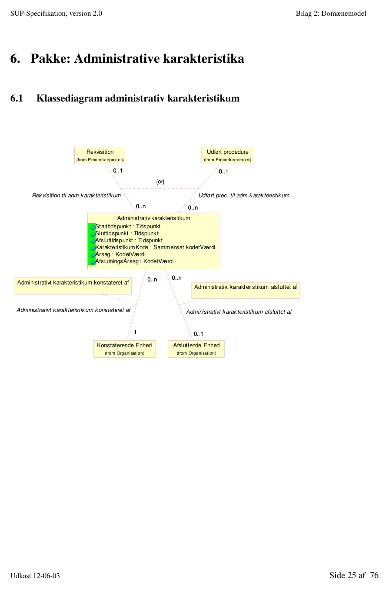

<!-- Billedbeskrivelse: Diagrammet viser Administrativ karakteristikum med start/slut/afslutning, kode og årsager samt relationer til konstaterende og afsluttende enheder, Rekvisition og Udført procedure. -->

## 6. Pakke: Administrative karakteristika

### 6.1. Klassediagram administrativ karakteristikum

```text
Rekvisition                                               Udført procedure
(from P rocedureproces)                                       (from Procedureproces)
```

```text
0..1                                                0..1
{or}
```

```text
Rek visition til adm.k arak teristik um                                       Udført proc. til adm.k arak teristik um
0..n                     0..n
Administrativ karakteristikum
St art tidspunk t : Tidspunkt
Sluttidspunkt : Tidspunk t
Afsluttidspunkt : Tidspunkt
KarakteristikumKode : Sammensat kodetVærdi
Årsag : KodetVærdi
AfslutningsÅrsag : KodetVærdi
```

0..n      0..n
Administrativt karakteristikum konstateret af
Administrativt karakt eristikum afsluttet af

Administrativt k arak teristik um k onstateret af                            Administrativt k arak teristik um afsluttet af

## 1. 0..1

```text
Konstaterende Enhed                 Afsluttende Enhed
(from Organisation)               (from Organisation)
```


---

<!-- Kilde: PDF side 26 -->

### 6.2. Klasser

#### 6.2.1. Administrativ karakteristikum

Et administrativt forhold i relation til patientbehandlingen. Bruges også til at repræsentere specielle
forhold, som ikke falder ind under de øvrige hændelsestyper.

Eksempelvis :

- Egen læge (iht. ydernummer-klassifikation)
- Kommunekode (iht. kommunekode-klassifikation)

```text
Attributter                        Beskrivelse                                                          Type
Starttidspunkt                     Start- eller konstateringstidspunkt for det pågældende karakte-      Tidspunkt
ristikum.
Vil ofte være forløbets eller kontaktperiodens starttidspunkt.
Sluttidspunkt                      Et i forvejen kendt sluttidspunkt f.eks. for en passiv venteperi-    Tidspunkt
ode
Afsluttidspunkt                    Faktisk afslutnings-tidspunkt for den administrative hændelse,       Tidspunkt
f.eks. for en betalingsgruppe eller kommunekode.
KarakteristikumKode                Karakteristikum-kode. Primærkode for det pågældende karak-           Sammensat ko-
teristikum.                                                          detVærdi
```

```text
Kodet efter SUP-klassifikation for de vigtigste. "Ingen" for
resten.
Årsag                              Kode for årsagen til det pågældende karakteristikum, f.eks.     KodetVærdi
årsagen til en passiv venteperiode.
AfslutningsÅrsag                   Koden for afslutningsårsagen ved afslutning af karakteristikum. KodetVærdi
```

En evt. lokal klassifikation anvendes, hvis den findes.

Associationer
Navn: Administrativt karakteristikum afsluttet af
Hvem har afsluttet administrativt karakteristikum?
(hvilken organisatoriske enhed og evt. behandler)

Navn: Administrativt karakteristikum konstateret af
Hvem har konstateret et givet adm.karakteristikum?
(hvilken organisatoriske enhed og evt. behandler)

Navn: Rekvisition til adm.karakteristikum
Ref. til rekvisition.
F.eks. ref. til rekv./henvisning ved passiv ventetid.

Navn: Udført proc. til adm.karakteristikum
Ref. til udført procedure. F.eks. ref. til et besøg eller en status.

#### 6.2.2. Administrativt karakteristikum afsluttet af


---

<!-- Kilde: PDF side 27 -->

```text
Attributter                      Beskrivelse                                                    Type
Afsluttende behandler            Den afsluttende medarbejder fra den afsluttende enhed.         AnsvarligPerson
```

Associationer

#### 6.2.3. Administrativt karakteristikum konstateret af

```text
Attributter                      Beskrivelse                                                    Type
Konstaterende behandler          Den konstaterende medarbejder fra den konstaterende enhed.     AnsvarligPerson
```

```text
KonstateringsSted                Det sted, hvor det pågældende karakteristikum konstateres eller Sted
besluttes.
```

Associationer

---

<!-- Kilde: PDF side 28 -->

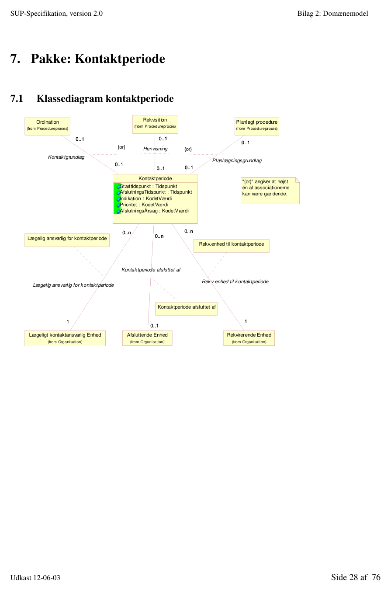

<!-- Billedbeskrivelse: Diagrammet viser Kontaktperiode med start- og afslutningstidspunkt, indikation, prioritet og afslutningsårsag. Kontaktperioden kan have grundlag i Ordination, Rekvisition eller Planlagt procedure og har relationer til lægeligt ansvarlig, rekvirerende og afsluttende enhed. {or}-begrænsningen angiver alternative relationer. -->

## 7. Pakke: Kontaktperiode

### 7.1. Klassediagram kontaktperiode

```text
Ordination                                               Rek vis it ion                                 Planlagt proc edure
(f rom Proced ureproces)
(from Procedureproces)                                                                                       (f rom Proced ure proces)
```

```text
0..1                                         0..1
0.. 1
{or}           Henvisning            {or}
Kontak tgrundlag
Planlægningsgrundlag
0..1
0..1           0.. 1
```

Kontaktperiode
```text
"{or}" angiver at højst
Start tidspunkt : Tidspunkt                                     én af associationerne
AfslutningsTidspunkt : Tidspunkt                                kan være gældende.
Indi kation : KodetVæ rdi
Prioritet : KodetVærdi
AfslutningsÅrs ag : KodetV ærdi
```

```text
0..n                               0.. n
Lægelig ansvarlig for kontaktperiode                                0.. n
Rekv.enhed til kontaktperiode
```

Kontak tperiode afsluttet af
```text
Rek v.enhed til k ontak tperiode
Lægelig ansvarl ig for k ontak t periode
```

Kontaktperiode afsluttet af

## 1. 1

0..1
```text
Lægeligt kontaktansvarlig Enhed                      Afsluttende Enhed                                  Rekvirerende Enhed
(from Organisation)                         (from Organisation)                                 (from Organisation)
```


---

<!-- Kilde: PDF side 29 -->

### 7.2. Klasser

#### 7.2.1. Kontaktperiode

En kontaktperiode ved kontaktregistrering og en status ved forløbsregistrering. Der kan skiftes til
samme kontakttype ved overflytninger. Kan ordineres, rekvireres og bookes.
Omfatter f.eks. en indlæggelse og et ambulant forløb, men ikke skift af adresse-afd.

```text
Attributter                      Beskrivelse                                                     Type
Starttidspunkt                   Starttidspunkt for kontaktperioden eller den pågældende status. Tidspunkt
```

```text
AfslutningsTidspunkt             Afslutningstidspunkt for en kontaktperiode eller en status,          Tidspunkt
f.eks. udskrivningstidspunkt. Der skal være ét minut imellem
sammenhængende statussers/kontakters afslutningstidspunkt.
og starttidspunkt.
Indikation                       Diagnose- / problemkode som begrundelsen for kontaktperio-           KodetVærdi
den. Vil ofte være en henvisningsdiagnose.
Prioritet                        Prioritering af kontaktperioden iht. SUP-klassifikation.             KodetVærdi
```

- Akut
```text
- Fremskyndet / subakut
- Planlagt procedure.
```

```text
AfslutningsÅrsag                 Kode for årsagen til afslutning af kontaktperioden, f.eks. ud-       KodetVærdi
skrivningsmåde.
```

En evt. lokal klassifikation anvendes, hvis den findes.

Associationer
Navn: Henvisning
Den rekvisition som giver anledning til den pågældende kontaktperiode/status.

Navn: Kontaktgrundlag
Den ordination som giver anledning til den pågældende kontaktperiode/status.

Navn: Kontaktperiode afsluttet af
Hvem har afsluttet kontaktperioden?
(hvilken organisatoriske enhed og evt. behandler)

Navn: Lægelig ansvarlig for kontaktperiode
Hvem er lægelig ansvarlig for kontaktperiode?
(hvilken organisatoriske enhed og evt. behandler)

Navn: Planlægningsgrundlag
Den planlagte procedure som giver anledning til den pågældende kontaktperiode/status.

Navn: Rekv.enhed til kontaktperiode
Hvem er rekvireret til kontaktperioden?
(hvilken organisatoriske enhed og evt. behandler)

#### 7.2.2. Kontaktperiode afsluttet af

Afslutning af kontaktperiode.

---

<!-- Kilde: PDF side 30 -->

Vil næsten altid afsluttes af stamafdelingen, men personen vil ofte være en anden end "Ansvarlig
person"

```text
Attributter                      Beskrivelse                                                       Type
Afsluttende behandler            Den afsluttende medarbejder fra den afsluttende enhed.            AnsvarligPerson
```

Associationer

#### 7.2.3. Lægelig ansvarlig for kontaktperiode

```text
Attributter                      Beskrivelse                                                       Type
Lægeligt ansvarlig behandler     Den lægeligt ansvarlige medarbejder fra den lægeligt ansvarli-    AnsvarligPerson
ge enhed.
Stamsted                         Det sted, der har det lægelige ansvar for patienten under kon-    Sted
taktperioden.
Bemærk:
Adresseafdeling er en selvstændig procedure
```

Associationer

#### 7.2.4. Rekv.enhed til kontaktperiode

Herunder også ordinerende afd., hvis der ikke foreligger en rekvisition.
Svar til henvisende afd.
Obligatorisk for sygehusafdelinger.

```text
Attributter                      Beskrivelse                                                       Type
Rekvirerende behandler           Den rekvirerende medarbejder fra den rekvirerende enhed.          AnsvarligPerson
```

Associationer

---

<!-- Kilde: PDF side 31 -->

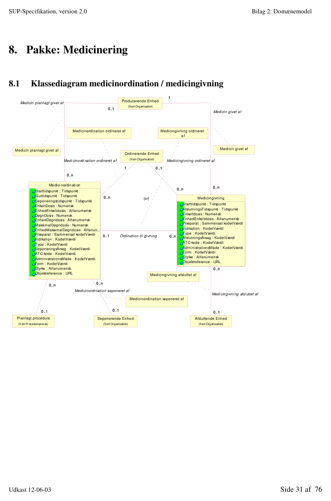

<!-- Billedbeskrivelse: Diagrammet forbinder Medicinordination og Medicingivning. En givning kan være udløst af en ordination; begge har relationer til ordinerende/producerende/afsluttende eller seponerende enheder. Diagrammet viser også doserings-, præparat- og administrationsattributter. -->

## 8. Pakke: Medicinering

### 8.1. Klassediagram medicinordination / medicingivning

1
```text
Producerende Enhed
Medicin planlagt givet af
(from Organisation)
0..1
Medicin givet af
```

```text
Medicinordination ordineret af                                        Medicingivning ordineret
af
```

```text
Medicin planlagt givet af                                                                                                                                   Medicin givet af
Ordinerende Enhed
(from Organisation)
Medi cino rdi nat ion ordineret a f                                              Medicingivning ordineret af
```

## 1. 0 ..1

0..n

```text
Me dici nordin ati on
0..n                  0..n
Starttidspunkt : Tidspunkt
Sluttidspunkt : T idspunkt          0..n                                             {or}                                  Medicingivning
Seponeringstidspunkt : Tidspunkt
EnkeltDosis : Numerisk                                                                                              Starttidspunkt : T idspunkt
EnhedEnkeltdosis : Alfanumerisk                                                                                     AfslutningsTidspunkt : Tidspunkt
DøgnDosis : Numerisk                                                                                                Enkeltdosis : Numerisk
EnhedDøgndosis : Alfanumerisk                                                                                       EnhedEnkeltdosis : Alfanumerisk
MaksimalDøgndosis : Numerisk                                                                                        Præparat : Sammensat kodetVærdi
EnhedMaksimalDøgndosis : Alfanum...                                                                                 Indikation : KodetVærdi
Præparat : Sammensat kodetVærdi                                                                                     Type : KodetVærdi
0..1                          Ordination til givning                  0..n
Indikation : KodetVærdi                                                                                             AfslutningsÅrsag : KodetVærdi
Type : KodetVærdi                                                                                                   ATC-kode : KodetVærdi
SeponeringsÅrsag : KodetVærdi                                                                                       AdministrationsMåde : KodetVærdi
ATC-kode : KodetVærdi                                                                                               Form : KodetVærdi
AdministrationsMåde : KodetVærdi                                                                                    Styrke : Alfanumerisk
Form : KodetVærdi                                                                                                   Objektreference : URL
Styrke : Alfanumerisk                                                                                                                  0..n
Objektreference : URL                                                                       Medicingivning afsluttet af
```

0..n
0..n
```text
Medicinordination seponeret af
Medi cing ivni ng afsl uttet af
Medicinordination seponeret af
```

## 0. ..1                                                0..1                                                                        0..1

```text
Planlagt procedure                                         Seponerende Enhe d                                                          Afsluttende Enhed
(fr om Pr ocedureproc es)                                        (from Organisation)                                                     (from Organisation)
```


---

<!-- Kilde: PDF side 32 -->

### 8.2. Klasser

#### 8.2.1. Medicin givet af

```text
Attributter                      Beskrivelse                                                         Type
Producerende behandler           Den producerende behandler fra den producerende enhed.              AnsvarligPerson
```

Procedure sted                   Det sted, hvor medicingivningen foregår.                            Sted

Associationer

#### 8.2.2. Medicin planlagt givet af

```text
Attributter                      Beskrivelse                                                         Type
Producerende behandler           Den producerende medarbejder fra den producerende enhed.            AnsvarligPerson
```

Associationer

#### 8.2.3. Medicingivning

Én konkret medicingivning, dvs. én dosis, herunder en infusion.
Kan også omfatte et anæstesipræparat.
Der udtrækkes kun givninger i udtræksdøgnet og de 2 forudgående døgn.

```text
Attributter                      Beskrivelse                                                         Type
Starttidspunkt                   Faktisk givningstidspunkt (eller starttidspunkt ved f.eks. infu-    Tidspunkt
sioner).
AfslutningsTidspunkt             Faktisk sluttidspunkt for medicingivningen af den pågældende        Tidspunkt
dosis, f.eks. ved infusion.
Enkeltdosis                      Enkeltdosis, der er givet.                                          Numerisk
Her angives
ENTEN mængden af det aktive indholdsstof pr. enkeltdosis
f.eks. i mg.
ELLER antal præparatenheder, f.eks. antal tabletter, dråber
eller pust jf. SST-klas.
Valget mellem de to muligheder vil fremgå af feltet "Enhed".
EnhedEnkeltdosis                 Enhed for Enkeltdosis.                                              Alfanumerisk
ENTEN f.eks. mg
ELLER f.eks. stk (ved tabletter), antal dråber og pust jf. SST-
klas.
Forkortelse fra Lægemiddelstyrelsens specialitetstakst (LMS).
Præparat                         Drug-ID for det givne præparat.                                     Sammensat ko-
detVærdi
Type: For officielle præparater: LMS (Lægemiddelstyrelsens
specialitetstakst). For uofficielle præparater: Lokal.
```


---

<!-- Kilde: PDF side 33 -->

```text
Tekst: Konkatenering af felterne: "Navn", "Form", "Styrke"
uden overflødige blanke. Hentes fra LMS-takst. Ved lokal kode
anvendes lokal tekst.
Indikation                       Begrundelse for medicingivningen. Oftest en diagnosekode.     KodetVærdi
Hentes normalt fra medicinordinationen.
Type                             Fast dosering, engangsdosis, efter skema eller p.n.-medicin   KodetVærdi
kodet efter SUP-klassifikation.
AfslutningsÅrsag                 Koden for årsagen til afslutning af en medicingivning, f.eks. KodetVærdi
afbrydelse af en infusion pga. allergisk reaktion.
```

```text
En evt. lokal klassifikationer anvendes, hvis den findes.
ATC-kode                         Kodet værdi efter ATC-klassifikationen for præparatet.              KodetVærdi
```

```text
AdministrationsMåde              Administrationsmåde (adgangsvej) for præparat.                      KodetVærdi
SKS-Behandlingsklassifikationens kapitel BZA. Hvis denne
ikke benyttes i det lokale system, kan den lokale klassifikation
anvendes.
Form                             Lægemiddelform.                                                     KodetVærdi
Forkortelsen for form fra Lægemiddelstyrelsens specialitets-
takst bør anvendes.
Styrke                           Mængden af det aktive indholdsstof (værdi + enhed)                  Alfanumerisk
```

Objektreference                  Der kan evt. linkes til udvidet datasæt om medicingivning.          URL

Associationer
Navn: Medicin givet af
Hvem har givet medicinen?
(hvilken organisatoriske enhed og evt. behandler)

Navn: Medicingivning afsluttet af
Hvem har afsluttet medicingivningen?
(hvilken organisatoriske enhed og evt. behandler)

Navn: Medicingivning ordineret af
Hvem har ordineret medicingivningen?
(hvilken organisatoriske enhed og evt. behandler)

Navn: Ordination til givning
Den ordination, der udløser givningen.

#### 8.2.4. Medicingivning afsluttet af

```text
Attributter                      Beskrivelse                                                         Type
Afsluttende behandler            Den afsluttende behandler fra den afsluttende enhed.                AnsvarligPerson
```

Associationer

---

<!-- Kilde: PDF side 34 -->

#### 8.2.5. Medicingivning ordineret af

```text
Attributter                      Beskrivelse                                                        Type
Ordinerende behandler            Den ordinerende behandler fra den ordinerende enhed.               AnsvarligPerson
```

Associationer

#### 8.2.6. Medicinordination

Ordination af medikamentel behandling.
Omfatter også anæstesi.

```text
Attributter                      Beskrivelse                                                        Type
Starttidspunkt                   Det ordinerede starttidspunkt for første dosis.                    Tidspunkt
```

Sluttidspunkt                    Et ved ordinationen fastsat sluttidspunkt (sidste dosis).          Tidspunkt
```text
Seponeringstidspunkt             Medicin-ordinationens seponeringstidspunkt.                         Tidspunkt
Afbrydelse af ordinationen før det fastsatte sluttidspunkt, eller
hvis der ikke er registreret et sluttidspunkt.
Skal ligge før ordinationens sluttidspunkt, hvis dette er registre-
ret.
EnkeltDosis                      Enkeltdosis ved engangsordinationer og pn-ordinationer.             Numerisk
Her angives
ENTEN mængden af det aktive indholdsstof pr. enkeltdosis
f.eks. i mg.
ELLER antal præparatenheder, f.eks. antal tabletter, dråber
eller pust jf. SST-klas.
Valget mellem de to muligheder vil fremgå af feltet "EnhedEn-
keltDosis".
EnhedEnkeltdosis                 Enhed for "Enkeltdosis". Der skal altid være en enhed til en        Alfanumerisk
værdi.
ENTEN f.eks. mg
ELLER f.eks. stk (ved tabletter), antal dråber og pust jf. SST-
klas.
Forkortelse fra Lægemiddelstyrelsens specialitetstakst (LMS).
```

```text
DøgnDosis                        Døgndosis ved faste ordinationer.                                  Numerisk
Her angives
ENTEN mængden af det aktive indholdsstof pr. enkeltdosis
f.eks. i mg.
ELLER antal præparatenheder, f.eks. antal tabletter, dråber
eller pust jf. SST-klas.
Valget mellem de to muligheder vil fremgå af feltet "Enhed-
DøgnDosis".
EnhedDøgndosis                   Enhed for "Døgndosis". Der skal altid være en enhed til en         Alfanumerisk
værdi.
ENTEN f.eks. mg
ELLER f.eks. stk (ved tabletter), antal dråber og pust jf. SST-
klas.
Forkortelse fra Lægemiddelstyrelsens specialitetstakst (LMS).
```

MaksimalDøgndosis                Max-døgndosis ved pn-ordinationer.                                 Numerisk

---

<!-- Kilde: PDF side 35 -->

Her angives
```text
ENTEN mængden af det aktive indholdsstof pr. enkeltdosis
f.eks. i mg.
ELLER antal præparatenheder, f.eks. antal tabletter, dråber
eller pust jf. SST-klas.
Valget mellem de to muligheder vil fremgå af feltet "Enhed-
MaksimalDøgnDosis".
EnhedMaksimalDøgndosis           Enhed for "Enkeltdosis". Der skal altid være en enhed til en        Alfanumerisk
værdi.
ENTEN f.eks. mg
ELLER f.eks. stk (ved tabletter), antal dråber og pust jf. SST-
klas.
Forkortelse fra Lægemiddelstyrelsens specialitetstakst (LMS).
```

```text
Præparat                         Drug-ID for det ordinerede præparat.                                Sammensat ko-
detVærdi
Type: For officielle præparater: LMS (Lægemiddelstyrelsens
specialitetstakst). For uofficielle præparater: Lokal.
```

```text
Tekst: Konkatenering af felterne: "Navn", "Form", "Styrke"
uden overflødige blanke. Hentes fra LMS-takst. Ved lokal kode
anvendes lokal tekst.
Indikation                       Begrundelse for medicin-ordinationen. Oftest en diagnosekode. KodetVærdi
```

```text
Type                             Fast dosering, engangsdosis, efter skema eller p.n.-medicin         KodetVærdi
kodet efter SUP-klassifikation.
SeponeringsÅrsag                 Kode for årsagen til, at den seponerende enhed seponerer me-        KodetVærdi
dicin-ordinationen.
ATC-kode                         Kodet værdi efter ATC-klassifikationen for præparatet.              KodetVærdi
```

```text
AdministrationsMåde              Administrationsmåde (adgangsvej) for præparat.                      KodetVærdi
SKS-Behandlingsklassifikationens kapitel BZA. Hvis denne
ikke benyttes i det lokale system, kan den lokale klassifikation
anvendes.
```

```text
Form                             Lægemiddelform.                                                     KodetVærdi
Forkortelsen for form fra Lægemiddelstyrelsens specialitets-
takst bør anvendes.
Styrke                           Mængden af det aktive indholdsstof (værdi + enhed)                  Alfanumerisk
```

Objektreference                  Der kan evt. linkes til udvidet datasæt om medicinordination.       URL

Associationer
Navn: Medicin planlagt givet af
Hvem er medicinen planlagt givet af?
(hvilken organisatoriske enhed og evt. behandler)

Navn: Medicinordination ordineret af
Hvem har ordineret medicinordinationen?
(hvilken organisatoriske enhed og evt. behandler)

Navn: Medicinordination seponeret af
Hvem har seponeret medicinordinationen?
(hvilken organisatoriske enhed og evt. behandler)

---

<!-- Kilde: PDF side 36 -->

Navn: Ordination til givning
Den ordination, der udløser givningen.

#### 8.2.7. Medicinordination ordineret af

```text
Attributter                      Beskrivelse                                                     Type
Ordinerende behandler            Den ordinerende behandler fra den ordinerende enhed.            AnsvarligPerson
```

Ordinationssted                  Det sted, hvor den ordinerende enhed foretager ordinationen.    Sted

Associationer

#### 8.2.8. Medicinordination seponeret af

```text
Attributter                      Beskrivelse                                                     Type
Seponerende behandler            Den seponerende medarbejder fra den seponerende enhed.          AnsvarligPerson
```

Associationer

---

<!-- Kilde: PDF side 37 -->

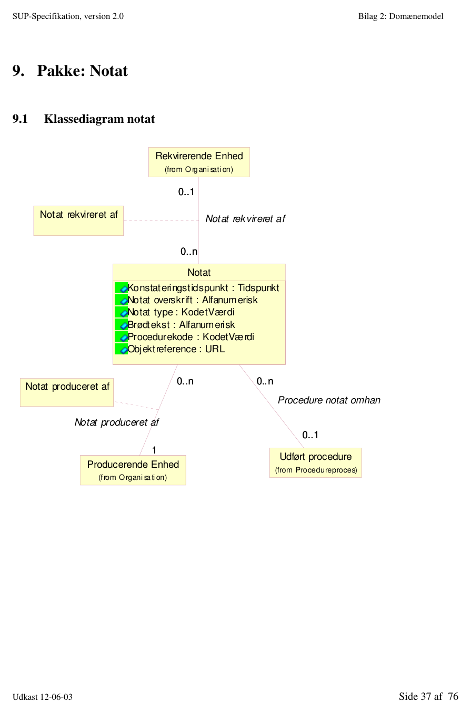

<!-- Billedbeskrivelse: Diagrammet viser Notat med konstateringstidspunkt, overskrift, type, brødtekst, procedurekode og objektreference. Notatet produceres af en Producerende Enhed, kan være rekvireret af en Rekvirerende Enhed og kan referere til en Udført procedure. -->

## 9. Pakke: Notat

### 9.1. Klassediagram notat

```text
Rekvirerende Enhed
(from O rg ani sati on)
```

0..1

Not at rekvireret af                                Not at rek vireret af

0..n

Notat
```text
Konstat eringst idspunkt : Tidspunkt
Notat overskrift : Alfanumerisk
Notat type : KodetVærdi
Brødt ekst : Alfanumerisk
Procedurekode : KodetVæ rdi
Objekt reference : URL
```

```text
0..n                  0.. n
Notat produceret af
Procedure notat omhan
```

```text
Notat produceret af
0..1
1
Udført procedure
Producerende Enhed                                          (from Procedureproces)
(f rom O rgani sa ti on)
```


---

<!-- Kilde: PDF side 38 -->

### 9.2. Klasser

#### 9.2.1. Notat

En fritekst-beskrivelse, som evt. kan være opdelt i strukturerede rubrikker. Svarer til papirjournalens
notater.
Må kun omfatte ét tidspunkt. En hel kontinuation skal således deles op med et notat for hver tilføjelse
til kontinuationen.
Indeholder altid den formaterede tekst, også selvom der medfølger strukturerede rubrikhændelser.

```text
Attributter                      Beskrivelse                                                            Type
Konstateringstidspunkt           Det tidspunkt, som notatet relaterer sig til. F.eks. starttidspunkt    Tidspunkt
for stuegang eller ambulant besøg på en given patient - ikke
dikterings- eller skrivningstidspunkt.
Notat overskrift                 Notatets lokale overskrift.                                            Alfanumerisk
```

```text
Notat type                       Udfyldes kun med tekst i kodetekstfeltet, da der ikke findes en        KodetVærdi
klassifikation for notatyper. Kodefeltet udfyldes ikke, mens der
i klassifikationstypen angives "Ingen".
Brødtekst                        Tekst formateret i XHTML. Når brødteksten vises formateret i           Alfanumerisk
en SUP web browser applikation skal den kunne udprintes på
en standard side..
Procedurekode                    Koden for den procedure, som notatet evt. omhandler (f.eks. en         KodetVærdi
operation) eller en generel notatprocedure, f.eks. stuegang og
amb. besøg.
Objektreference                  Evt. link til en særlig udgave af notatet, herunder f.eks. til en      URL
grafisk formatering, der indeholder kurver eller billeder.
```

Associationer
Navn: Notat produceret af
Hvem har produceret notatet?
(hvilken organisatoriske enhed og evt. behandler)

Navn: Notat rekvireret af
Hvem har rekvireret notatet?
(hvilken organisatoriske enhed og evt. behandler)

Navn: Procedure notat omhandler
En procedure, som notatet omhandler (f.eks. en operation) eller en generel notatprocedure, f.eks. stue-
gang og amb. besøg.

#### 9.2.2. Notat produceret af

```text
Attributter                      Beskrivelse                                                            Type
Producerende behandler           Den producerende medarbejder fra den producerende enhed.               AnsvarligPerson
```

Procedurested                    Sted for den hændelse, som notatet relaterer sig til.                  Sted

---

<!-- Kilde: PDF side 39 -->

Associationer

#### 9.2.3. Notat rekvireret af

```text
Attributter                      Beskrivelse                                                 Type
Rekvirerende behandler           Den rekvirerende medarbejder fra den rekvirerende enhed.    AnsvarligPerson
```

Associationer

---

<!-- Kilde: PDF side 40 -->

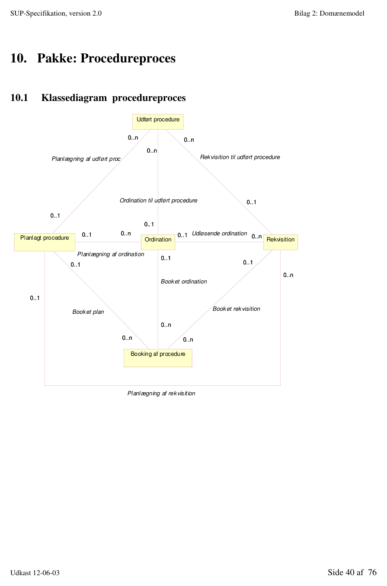

<!-- Billedbeskrivelse: Procesdiagrammet viser sammenhængene mellem Planlagt procedure, Ordination, Rekvisition, Booking af procedure og Udført procedure. Relationerne modellerer bl.a. planlægning, udløsning, booking og den udførte procedures forudgående ordination eller rekvisition. -->

## 10. Pakke: Procedureproces

### 10.1. Klassediagram procedureproces

Udført procedure

```text
0..n                    0..n
0..n
Planlægning af udført proc                                     Rek visition til udført procedure
```

Ordination til udført procedure                          0..1
0..1
0..1
```text
0..1          0..n                    0..1 Udløsende ordination 0..n
Planlagt procedure                                  Ordination                                          Rekvisition
```

```text
Planlægning af ordination
0..1
0..1                                                                    0..1
```

0..n
Book et ordination
0..1

Book et plan                                                Book et rek visition
0..n

0..n                      0..n
Booking af procedure

Planlægning af rek vis it ion

---

<!-- Kilde: PDF side 41 -->

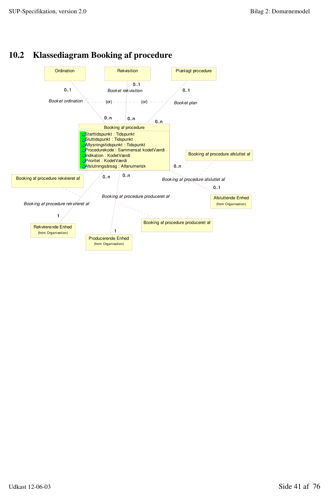

<!-- Billedbeskrivelse: Diagrammet viser Booking af procedure med bookede tidspunkter, evt. aflysning, procedurekode, indikation, prioritet og afslutningsårsag samt koblinger til ordination, rekvisition, plan og organisatoriske roller. -->

### 10.2. Klassediagram Booking af procedure

Ordination                              Rekvisition                    Planlagt procedure

0..1
0.. 1                   Book et rek visition                           0..1
Book et ordination               {or}                     {or}            Book et plan

```text
0..n             0..n
0..n
Booking af procedure
Starttidspunkt : Tidspunkt
Sluttidspunkt : Tidspunkt
Aflysningstidspunkt : Tidspunkt
Procedurekode : Sammensat kodetVærdi
Indikation : KodetVærdi                                        Booking af procedure afsluttet af
Prioritet : KodetVærdi
Afslutningsårsag : Alfanumerisk                      0..n
```

```text
0.. n          0..n
Booking af procedure rekvireret af                                                   Book ing af procedure afsluttet af
0..1
Book ing af procedure produceret af                                Afsluttende Enhed
Book ing af procedure rek vireret af                                                                           (from Organisation)
```

1
```text
Booking af procedure produceret af
Rekvirerende Enhed
(from Organisation)                           1
Producerende Enhed
(from Organisation)
```


---

<!-- Kilde: PDF side 42 -->

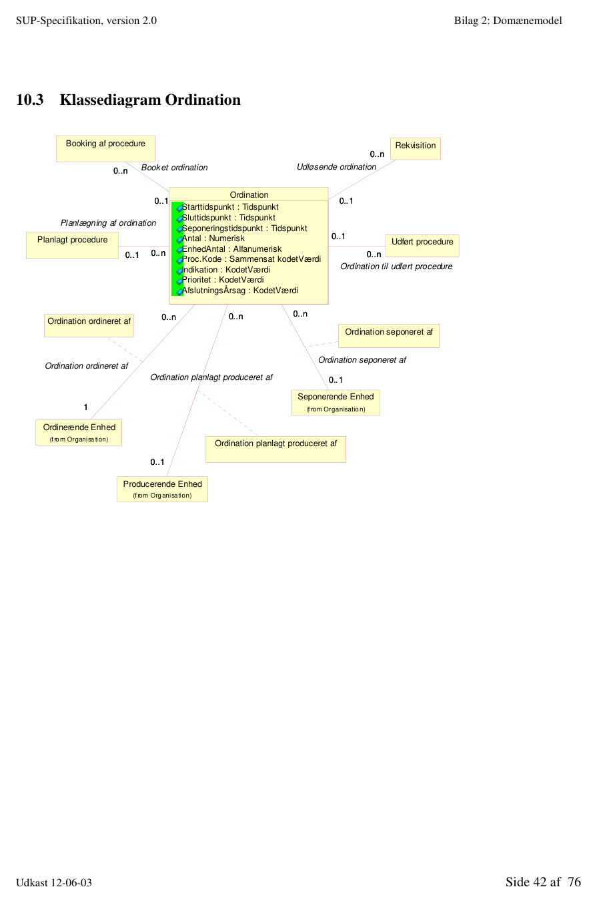

<!-- Billedbeskrivelse: Diagrammet viser Ordination (ikke medicinordination) med start/slut/seponering, antal, procedurekode, indikation og prioritet samt relationer til udført procedure, plan, booking, rekvisition og relevante organisatoriske enheder. -->

### 10.3. Klassediagram Ordination

```text
Booking af procedure                                                                                   Rekvisition
0..n
Book et ordination                         Udløsende ordination
0..n
```

Ordination
```text
0..1                                                 0.. 1
Starttidspunkt : Tidspunkt
Sluttidspunkt : Tidspunkt
Planlægning af ordination
Seponeringstidspunkt : Tidspunkt
Planlagt procedure                                    Antal : Numerisk                       0..1
Udført procedure
EnhedAntal : Alfanumerisk
0..1      0.. n                                                         0..n
Proc.Kode : Sammensat kodetVærdi
Indikation : KodetVærdi                    Ordination til udført procedure
Prioritet : KodetVærdi
AfslutningsÅrsag : KodetVærdi
```

```text
0..n              0..n              0..n
Ordination ordineret af
Ordination seponeret af
```

```text
Ordination seponeret af
Ordination ordineret af
Ordination planlagt produceret af                 0.. 1
Seponerende Enhed
1                                                                    (f rom Organisatio n)
```

```text
Ordinerende Enhed
(f ro m Organisa tion)
Ordination planlagt produceret af
```

0..1

```text
Producerende Enhed
(f rom Org anisa tion)
```


---

<!-- Kilde: PDF side 43 -->

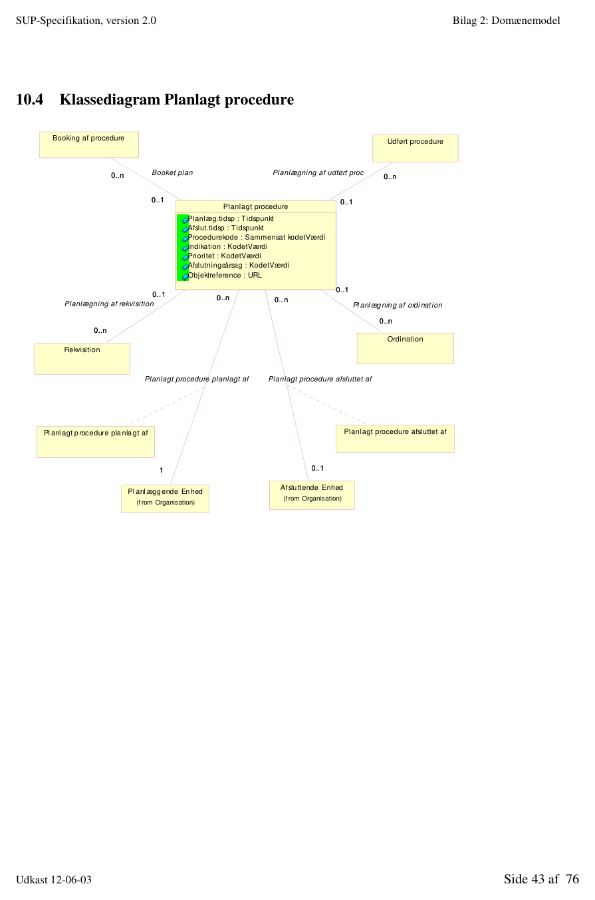

<!-- Billedbeskrivelse: Diagrammet viser Planlagt procedure og dens relationer til udført procedure, ordination, rekvisition og booking. Planen knyttes til planlæggende og afsluttende enhed og indeholder bl.a. planlægningstidspunkt, procedurekode, indikation, prioritet og objektreference. -->

### 10.4. Klassediagram Planlagt procedure

Booking af procedure                                                                                          Udført procedure

0..n           Booket plan                      Planlægning af udført proc             0..n

```text
0..1                                                    0..1
Planlagt procedure
Planlæg.tidsp : Tidspunkt
Afslut.tidsp : Tidspunkt
Procedurekode : Sammensat kodetVærdi
Indikation : KodetVærdi
Prioritet : KodetVærdi
Afslutningsårsag : KodetVærdi
Objektreference : URL
```

0..1
0.. 1
```text
0..n            0.. n
Planlægning af rekvisition                                                                     Pl anl æg nin g af ordi nat ion
```

0..n
0..n
Ordination
Rekvisition

Planlagt procedure planlagt af      Planlagt procedure afsluttet af

Pl anl agt p roc edure pla nla gt af                                                               Planlagt procedure afsluttet af

## 1. 0.. 1

```text
Af slu tt ende Enhed
Pl anl ægg ende En hed
(f rom Organisation)
(f rom Organisation)
```


---

<!-- Kilde: PDF side 44 -->

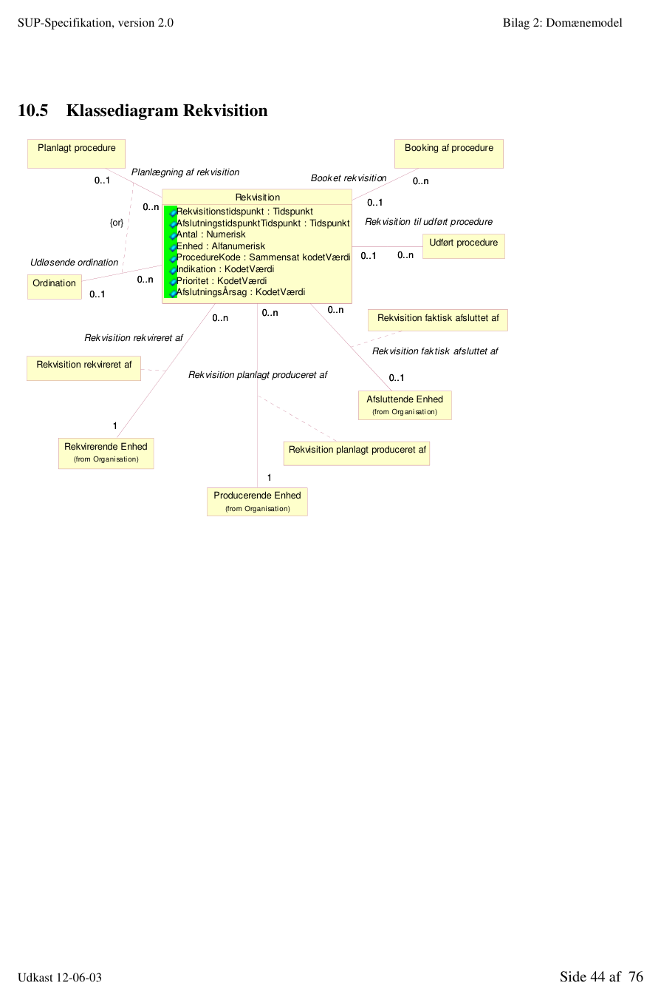

<!-- Billedbeskrivelse: Diagrammet viser Rekvisition med rekvisitions- og afslutningstidspunkt, antal, procedurekode, indikation og prioritet. Rekvisitionen kan udløses af en ordination, planlægges fra en plan, bookes og resultere i en udført procedure. -->

### 10.5. Klassediagram Rekvisition

Planlagt procedure                                                                                   Booking af procedure
```text
Planlægning af rek visition
0..1                                                       Book et rek visition          0..n
Rekvisit ion
0..n                                                      0..1
Rekvisitionstidspunkt : Tidspunkt
{or}              AfslutningstidspunktTidspunkt : Tidspunkt         Rek visit ion til udført procedure
Antal : Numerisk
Enhed : Alfanumerisk                                                     Udført procedure
ProcedureKode : Sammensat kodetVærdi             0..1        0..n
```

Udløsende ordination
```text
Indikation : KodetVærdi
Ordination                   0..n      Prioritet : KodetVærdi
0..1                     AfslutningsÅrsag : KodetVærdi
```

```text
0..n               0..n
0..n                                          Rekvisition faktisk afsluttet af
```

```text
Rek visition rek vireret af
Rek visition fak tisk afsluttet af
Rekvisition rekvireret af
Rek visition planlagt produceret af                    0..1
```

```text
Afsluttende Enhed
(from Org ani sati on)
```

1

```text
Rekvirerende Enhed                                            Rekvisition planlagt produceret af
(from Organisation)
```

1
```text
Producerende Enhed
(from Organisation)
```


---

<!-- Kilde: PDF side 45 -->

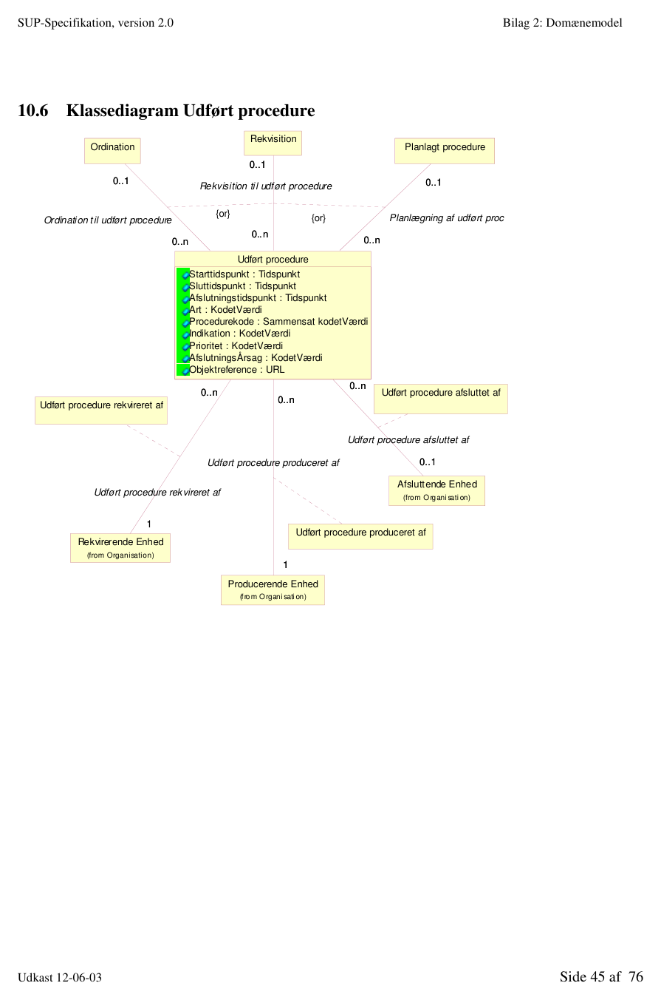

<!-- Billedbeskrivelse: Diagrammet viser Udført procedure med faktiske tidsstempler, art, procedurekode, indikation, prioritet, afslutningsårsag og objektreference. Den kan være knyttet til forudgående plan, ordination eller rekvisition og til rekvirerende, producerende og afsluttende enheder. -->

### 10.6. Klassediagram Udført procedure

Rekvisition
```text
Ordination                                                                                   Planlagt procedure
0..1
0..1                       Rekvisition til udf ørt procedure                                  0..1
```

```text
{or}                              {or}              Planlægning af udført proc
Ordination t il udført procedure
0..n
0..n                                                     0..n
Udført procedure
Starttidspunkt : Tidspunkt
Sluttidspunkt : Tidspunkt
Afslutningstidspunkt : Tidspunkt
Art : KodetVærdi
Procedurekode : Sammensat kodetVærdi
Indikation : KodetVærdi
Prioritet : KodetVærdi
AfslutningsÅrsag : KodetVærdi
Objektreference : URL
0..n
0..n                                                   Udført procedure afsluttet af
0..n
Udført procedure rekvireret af
```

Udført procedure afsluttet af
Udført procedure produceret af                                  0..1
```text
Afslutt ende Enhed
Udført procedure rek vireret af                                                             (from O rg ani sati on)
```

1
```text
Udført procedure produceret af
Rekvirerende Enhed
(from Organisation)
1
Producerende Enhed
(f ro m O rgani sati on)
```


---

<!-- Kilde: PDF side 46 -->

### 10.7. Klasser

#### 10.7.1. Booking af procedure

Booking af en procedure. Behøver ikke nødvendigvis være ordineret eller rekvireret.

```text
Attributter                      Beskrivelse                                                        Type
Starttidspunkt                   Det bookede starttidspunkt.                                        Tidspunkt
```

Sluttidspunkt                    Det bookede sluttidspunkt.                                         Tidspunkt
```text
Aflysningstidspunkt              Aflysningstidspunkt for bookingen. Når den bookede procedu-        Tidspunkt
re udføres, afsluttes bookingen ikke med en afslutningsdato.
Anvendes til belysning af aflyste bookinger.
Procedurekode                    Primærkode for den bookede procedure.                              Sammensat ko-
detVærdi
Indikation                       Begrundelse for bookingen. Oftest en diagnosekode.                 KodetVærdi
```

Prioritet                        Prioritet for proceduren.                                          KodetVærdi
```text
Prioritering iht. SUP-klassifikation.
- Akut
- Fremskyndet / subakut
- Planlagt procedure.
Afslutningsårsag                 Kode for årsagen til, at bookingen afsluttes uden at proceduren    Alfanumerisk
gennemføres, f.eks. "annulleret af rekvirent" eller "Patient
udeblevet".
```

Associationer
Navn: Booket ordination

Navn: Booket plan

Navn: Booket rekvisition

Navn: Booking af procedure afsluttet af
Hvem har afsluttet booking af procedure?
(hvilken organisatoriske enhed og evt. behandler)

Navn: Booking af procedure produceret af
Hvem skal gennemføre den bookede procedure?
(hvilken organisatoriske enhed og evt. behandler)

Hvis andre end producenten selv booker, gør de det på producentens vegne, og bookeren vil fremgå af
reg. afd. og person.

Navn: Booking af procedure rekvireret af
Hvem har rekvireret den bookede procedure?
(hvilken organisatoriske enhed og evt. behandler)

---

<!-- Kilde: PDF side 47 -->

Den enhed, der har rekvireret proceduren. Herunder også ordinerende enhed, hvis der ikke foreligger
en rekvisition.

#### 10.7.2. Booking af procedure afsluttet af

```text
Attributter                      Beskrivelse                                                       Type
Afsluttende behandler            Den afsluttende behandler fra den afsluttende enhed.              AnsvarligPerson
```

Associationer

#### 10.7.3. Booking af procedure produceret af

```text
Attributter                      Beskrivelse                                                       Type
Producerende behandler           Den producerende behandler fra den producerende enhed.            AnsvarligPerson
```

Udførelsessted                   Det sted, hvor den bookede procedure skal foregå.                 Sted

Associationer

#### 10.7.4. Booking af procedure rekvireret af

Associationer

#### 10.7.5. Ordination

En ordination, som ikke er en medicinordination.

```text
Attributter                      Beskrivelse                                                         Type
Starttidspunkt                   Ordinationens starttidspunkt.                                       Tidspunkt
Det tidspunkt hvor ordinationen skal træde kraft. Vil ofte prin-
cipielt være lig beslut.tidspunkt.
Sluttidspunkt                    Ordinationens sluttidspunkt.                                        Tidspunkt
Et ved ordinationen fastsat sluttidspunkt for den ordinerede
procedure.
Seponeringstidspunkt             Ordinationens seponeringstidspunkt.                                 Tidspunkt
Afbrydelse af ordinationen før det fastsatte sluttidspunkt eller
hvis der ikke er registreret et sluttidspunkt.
Skal ligge før ordinationens sluttidspunkt, hvis dette er registre-
ret.
Antal                            F.eks. antal fysiurgiske behandlinger.                              Numerisk
```

```text
EnhedAntal                       Enhed for antal.                                                  Alfanumerisk
Der skal altid være en enhed til et antal.
```

```text
Proc.Kode                        Primærkode for den ordinerede procedure.                          Sammensat ko-
detVærdi
```


---

<!-- Kilde: PDF side 48 -->

Indikation                       Begrundelse for ordinationen. Oftest en diagnosekode.             KodetVærdi
Prioritet                        Prioritet for proceduren                                          KodetVærdi
```text
Prioritering af ordinationernes effektuering iht. SUP-
klassifikation
- Akut
- Fremskyndet / subakut
- Planlagt procedure.
AfslutningsÅrsag                 Kode for årsagen til, at den seponerende enhed seponerer ordi-    KodetVærdi
nationen.
En evt. lokal klassifikation anvendes, hvis den findes.
```

Associationer
Navn: Booket ordination

Navn: Kontaktgrundlag
Den ordination som giver anledning til den pågældende kontaktperiode/status.

Navn: Ordination ordineret af
Hvem ordinerer ordinationen?
(hvilken organisatoriske enhed og evt. behandler)

Navn: Ordination planlagt produceret af
Hvem er planlagt producent af ordinationen?
(hvilken organisatoriske enhed og evt. behandler)

Navn: Ordination seponeret af
Hvem har seponeret ordinationen?
(hvilken organisatoriske enhed og evt. behandler)

Navn: Ordination til udført procedure
Den umiddelbart forudgående ordination som får producenten til at udføre proceduren.

Navn: Planlægning af ordination

Navn: Udløsende ordination
Den ordination som udløser rekvisitionen.

#### 10.7.6. Ordination ordineret af

```text
Attributter                      Beskrivelse                                                       Type
Ordinerende behandler            Den ordinerende medarbejder fra den ordinerende enhed.            AnsvarligPerson
```

Ordinationssted                  Det sted, hvor den ordinerende enhed foretager ordinationen.      Sted

---

<!-- Kilde: PDF side 49 -->

Associationer

#### 10.7.7. Ordination planlagt produceret af

```text
Attributter                      Beskrivelse                                                 Type
Producerende behandler           Den planlagte producerende medarbejder fra den producerende AnsvarligPerson
enhed.
```

Associationer

#### 10.7.8. Ordination seponeret af

```text
Attributter                      Beskrivelse                                                        Type
Seponerende behandler            Den seponerende medarbejder fra den seponerende enhed.             AnsvarligPerson
```

Associationer

#### 10.7.9. Planlagt procedure

En procedure (eller et sæt af procedurer), som planlægges udført, men som på planlægningstidspunk-
tet ikke er hverken ordineret eller rekvireret. Kan f.eks. være et referenceprogram eller standardforløb.

```text
Attributter                      Beskrivelse                                                       Type
Planlæg.tidsp                    Tidspunkt hvor planlægningen foretages for en given patient, Tidspunkt
f.eks. en visitationsdato eller forundersøgelsesdato.
Afslut.tidsp                     Tidspunkt hvor planen afsluttes, enten fordi den er gennemført, Tidspunkt
opgivet, eller man har skiftet til en anden plan.
Procedurekode                    Primærkode for den planlagte procedure.                           Sammensat ko-
Kan evt. være en kode for en protokol, et standardforløb eller et detVærdi
ref.program.
Indikation                       Begrundelse for valg af denne plan. Oftest en diagnosekode.       KodetVærdi
```

Prioritet                        Prioritet for plan.                                                KodetVærdi
```text
Prioritering iht. SUP-klassifikation.
- Akut
- Fremskyndet / subakut
- Planlagt procedure.
Afslutningsårsag                 Kode for årsagen til, at planen afsluttes, f.eks. "Fuldført", "Be- KodetVærdi
hov for ny plan" eller "Opgivet".
Objektreference                  Reference til objektfil (f.eks. billede, EKG eller datasæt) i form URL
af en inter-/intranet-link til en server.
Links medtages kun, hvis de kan anvendes i praksis af SUP-
brugere. Anvendelsen må dog godt forudsætte en særlig autori-
sation.
```

Evt. link til den pågældende plan, protokol eller ref.program.

---

<!-- Kilde: PDF side 50 -->

Associationer
Navn: Booket plan

Navn: Planlagt procedure afsluttet af

Navn: Planlagt procedure planlagt af

Navn: Planlægning af ordination

Navn: Planlægning af rekvisition

Navn: Planlægning af udført proc

Navn: Planlægningsgrundlag
Den planlagte procedure som giver anledning til den pågældende kontaktperiode/status.

#### 10.7.10. Planlagt procedure afsluttet af

```text
Attributter                      Beskrivelse                                                       Type
Afsluttende behandler            Den afsluttende medarbejder fra den afsluttende enhed.            AnsvarligPerson
```

Associationer

#### 10.7.11. Planlagt procedure planlagt af

```text
Attributter                      Beskrivelse                                                       Type
Planlæggende behandler           Den planlæggende behandler fra den planlæggende enhed             AnsvarligPerson
```

Plan.sted                        Sted, hvor planlægningen foretages.                               Sted

Associationer

#### 10.7.12. Rekvisition

Rekvisition af en procedure.
Inkluderer også henvisninger. Alm. ventetid og intern ventetid repræsenteres således ens.

```text
Attributter                      Beskrivelse                                                       Type
Rekvisitionstidspunkt            Tidspunkt for foretagelse af rekvisitionen. Som regel lig reg.    Tidspunkt
tidspunkt.
Afslutningstidspunkt-            Afslutningstidspunkt=effektueringstidspunkt.                      Tidspunkt
```


---

<!-- Kilde: PDF side 51 -->

```text
Tidspunkt                         Det tidspunkt, hvor rekvisitionen udføres eller annulleres. An-
vendes f.eks. til beregning af ventetid. Svarer for henvisninger
til afslutningsdato. Kommer som regel fra procedurehændelsen.
Antal                             Antal rekvirerede enheder. F.eks. antal fys. behandlinger        Numerisk
```

Enhed                             Enheden for "Antal", f.eks. "stk"                                      Alfanumerisk
```text
ProcedureKode                     Primærkoden for den rekvirerede procedure.                             Sammensat ko-
detVærdi
Indikation                        Diagnose- / problemkode som begrundelsen for rekvisitionen.            KodetVærdi
```

```text
Prioritet                         Prioritering af rekvisitionens effektuering iht. SUP-                  KodetVærdi
klassifikation
- Akut
- Fremskyndet / subakut
- Planlagt procedure.
AfslutningsÅrsag                  Kode for årsagen til, at rekvisitionen afsluttes, f.eks. "effektue-    KodetVærdi
ret" eller annulleret. En evt. lokal klassifikationer anvendes,
hvis den findes.
```

Associationer
Navn: Booket rekvisition

Navn: Henvisning
Den rekvisition som giver anledning til den pågældende kontaktperiode/status.

Navn: Planlægning af rekvisition

Navn: Rekvisition faktisk afsluttet af
Hvem har faktisk effektueret rekvisitionen?
(hvilken organisatoriske enhed og evt. behandler)

Navn: Rekvisition planlagt produceret af
Rekvirenten sender rekvisitionen til Producerende Enhed

Navn: Rekvisition rekvireret af
Hvem har rekvireret rekvisitionen?
(hvilken organisatoriske enhed og evt. behandler)

Navn: Rekvisition til adm.karakteristikum
Ref. til rekvisition.
F.eks. ref. til rekv./henvisning ved passiv ventetid.

Navn: Rekvisition til udført procedure
Den umiddelbart forudgående rekvisition som får producenten til at udføre proceduren.

Navn: Udløsende ordination
Den ordination som udløser rekvisitionen.

#### 10.7.13. Rekvisition faktisk afsluttet af

Faktisk effektuering/afslutning af rekvisitionen.

---

<!-- Kilde: PDF side 52 -->

Det vil normalt være producenten, men kan også være rekvirenten selv ved annullering af rekvisitio-
nen.

```text
Attributter                      Beskrivelse                                                          Type
Afsluttende behandler            Den person, der faktisk effektuerer rekvisitionen                    AnsvarligPerson
```

Associationer

#### 10.7.14. Rekvisition planlagt produceret af

```text
Attributter                      Beskrivelse                                                          Type
Producerende behandler           Den behandler fra den producerende enhed, som øn-                    AnsvarligPerson
skes/planlægges til at effektuere rekvisitionen.
```

Associationer

#### 10.7.15. Rekvisition rekvireret af

```text
Attributter                      Beskrivelse                                                          Type
Rekvisitionssted                 Stedet hvorfra rekvisitionen foretages                               Sted
```

Rekvirerende behandler           Den rekvirerende behandler fra den rekvirerende enhed.               AnsvarligPerson

Associationer

#### 10.7.16. Udført procedure

En udført procedure, der hverken er en medicingivning eller en status / kontaktperiode.

```text
Attributter                      Beskrivelse                                                          Type
Starttidspunkt                   Det faktiske starttidspunkt for procedurens udførelse.               Tidspunkt
```

```text
Sluttidspunkt                    Det faktiske sluttidspunkt for selve proceduren, f.eks. sluttids-    Tidspunkt
punkt for en operation.
Afslutningstidspunkt             Afslutning af en procedure med udstrækning, f.eks. aftagning         Tidspunkt
af gipsbandage eller seponering af kateter.
Nogle operationer afsluttes med en dedikeret operationskode,
f.eks. "fjernelse af osteosyntesemateriale", og de registreres
som en selvstændig procedure.
Art                              Procedureart jf. SST. Én af værdierne: V, P eller D. Obl. hvis       KodetVærdi
operation, ellers blank.
Procedurekode                    Primærkoden for den procedure, der udføres                           Sammensat ko-
detVærdi
Indikation                       Begrundelse for proceduren i form af diagnose- eller problem-        KodetVærdi
kode. Indikation kan ved f.eks. anæstesi være en operation.
Prioritet                        Prioritet for proceduren.                                            KodetVærdi
```


---

<!-- Kilde: PDF side 53 -->

```text
Prioritering iht. SUP-klassifikation.
- Akut
- Fremskyndet / subakut
- Planlagt procedure.
AfslutningsÅrsag                   Kode for årsagen til, at en procedure med lang udtrækning            KodetVærdi
afsluttes. Se kommentar til procedurens afslutningstidspunkt.
En evt. lokal klassifikationer anvendes, hvis den findes.
Objektreference                    Link til evt. notat eller anden beskrivelse af proceduren, f.eks.    URL
operationsbeskrivelse.
```

Associationer
Navn: Behandlingsproc. der har effekten
Den behandlingshændelse, som effekten tilskrives.

Navn: Diagn.ref til proc
En procedure med relation til diagnosticeringen f.eks. til et besøg, en status eller en procedure, f.eks.
en operation.

Navn: Ordination til udført procedure
Den umiddelbart forudgående ordination som får producenten til at udføre proceduren.

Navn: Planlægning af udført proc

Navn: Procedure der kompliceres/ har bivirkning
Den proc.hændelse, der har komplikation / bivirkning

Navn: Procedure hvor man konstaterer problem
F.eks. et besøg, en status eller en procedure (f.eks. en operation), hvor problemet konstateres.

Navn: Procedure hvor opl. blev givet
Ref. til en evt. procedurehændelse der ligger til grund for konstateringen, f.eks. "Samtale med pårø-
rende".

Navn: Procedure notat omhandler
En procedure, som notatet omhandler (f.eks. en operation) eller en generel notatprocedure, f.eks. stue-
gang og amb. besøg.

Navn: Rekvisition til udført procedure
Den umiddelbart forudgående rekvisition som får producenten til at udføre proceduren.

Navn: Udført proc. til adm.karakteristikum
Ref. til udført procedure. F.eks. ref. til et besøg eller en status.

Navn: Udført procedure afsluttet af
Hvem har afsluttet den udførte procedure?
(hvilken organisatoriske enhed og evt. behandler)

Navn: Udført procedure produceret af
Hvem har produceret den udførte procedure?
(hvilken organisatoriske enhed og evt. behandler)

Navn: Udført procedure rekvireret af
Hvem har rekvireret den udførte procedure?
(hvilken organisatoriske enhed og evt. behandler)

---

<!-- Kilde: PDF side 54 -->

Navn: Undersøgelse til grund for obs/fund
Den undersøgelse (udført procedure), som ligger til grund for observationen / fundet.

Navn: Undersøgelse til grund for resultat
Den undersøgelse (udført procedure), der har givet anledning til resultatet.
Der bør måske på længere sigt altid foreligge en procedurehændelse aht. produktions- og forbrugsop-
gørelser. Alternativt må man ved manglende udfyldelse af dette felt med forsigtighed medtælle prø-
veresultater ved disse opgørelser.

#### 10.7.17. Udført procedure afsluttet af

Afslutning af en procedure med udstrækning, f.eks. fjernelse af et kateter.

```text
Attributter                      Beskrivelse                                                   Type
Afsluttende behandler            Den afsluttende behandler fra den afsluttende enhed.          AnsvarligPerson
```

Associationer

#### 10.7.18. Udført procedure produceret af

```text
Attributter                      Beskrivelse                                                   Type
Producerende medarbejder         Den producerende medarbejder fra den producerende enhed.      Medarbejder
```

Udførelsessted                   Det sted, hvor proceduren udføres.                            Sted

Associationer

#### 10.7.19. Udført procedure rekvireret af

```text
Attributter                      Beskrivelse                                                   Type
Rekvirerende behandler           Den rekvirerende medarbejder fra den rekvirerende enhed.      AnsvarligPerson
```

Associationer

---

<!-- Kilde: PDF side 55 -->

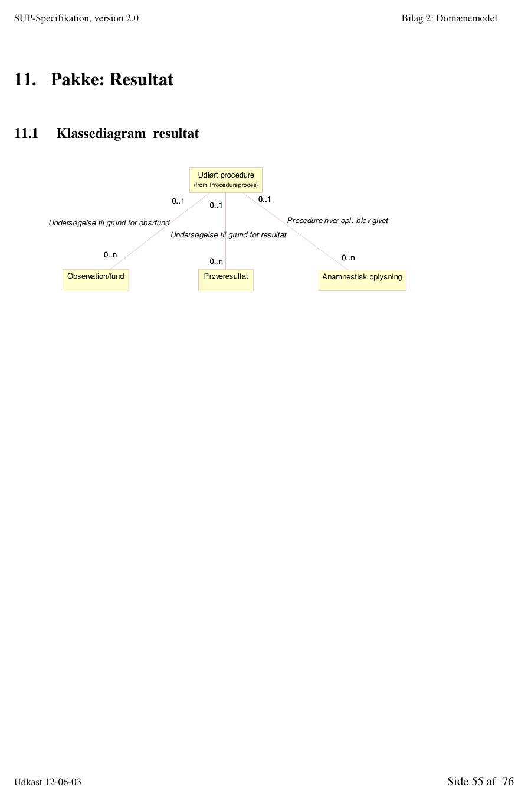

<!-- Billedbeskrivelse: Resultat-pakkens oversigtsdiagram viser Anamnestisk oplysning, Observation/fund og Prøveresultat og deres mulige relationer til Udført procedure som grundlag eller kontekst. -->

## 11. Pakke: Resultat

### 11.1. Klassediagram resultat

```text
Udført procedure
(from Procedureproces)
```

```text
0..1                            0..1
0..1
```

```text
Undersøgelse til grund for obs/fund                                          Procedure hvor opl. blev givet
Undersøgelse til grund for resultat
```

```text
0..n                                                                         0..n
0..n
Observation/fund                           Prøveresultat                          Anamnestisk oplysning
```


---

<!-- Kilde: PDF side 56 -->

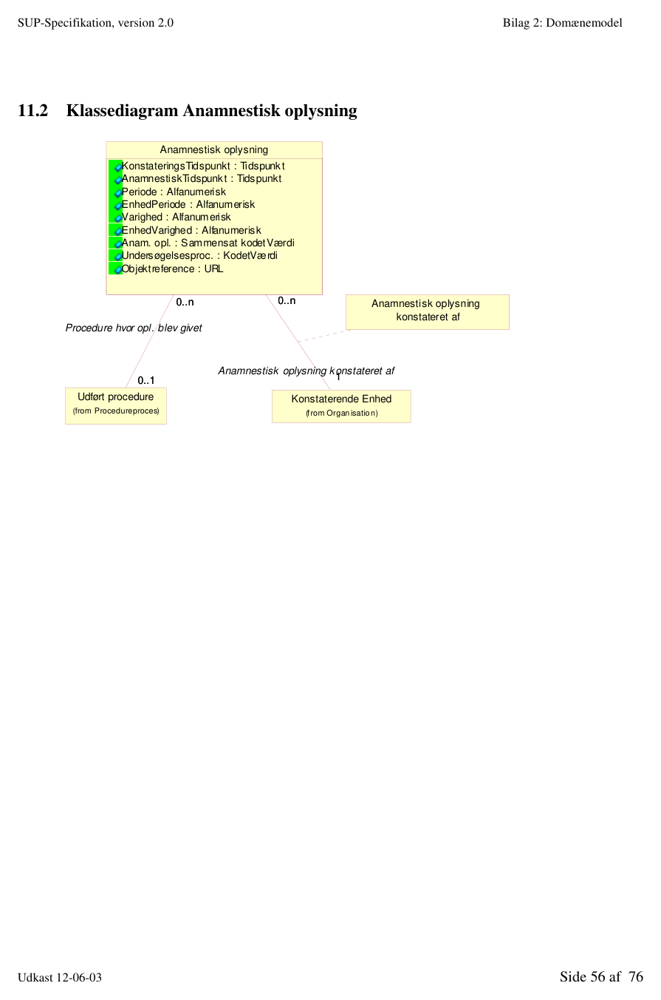

<!-- Billedbeskrivelse: Diagrammet viser Anamnestisk oplysning med konstateringstidspunkt, anamnestisk tidspunkt/periode/varighed, kode, undersøgelsesprocedure og objektreference. Oplysningen kan knyttes til en udført procedure og en konstaterende enhed. -->

### 11.2. Klassediagram Anamnestisk oplysning

```text
Anamnestisk oplysning
KonstateringsTidspunkt : Tidspunk t
AnamnestiskTidspunk t : Tids punkt
Periode : Alfanumerisk
EnhedPeriode : Alfanumerisk
Varighed : Alfanumerisk
EnhedVarighed : Alfanumeris k
Anam. opl. : S ammensat kodet Værdi
Unders øgelsesproc. : KodetVæ rdi
Objektreference : URL
```

```text
0..n                 0..n                      Anamnestisk oplysning
konstateret af
Procedure hvor opl. blev givet
```

```text
Anamnestisk oplysning k onstateret af
0..1                                        1
Udført procedure                                   Konstaterende Enhed
(from Procedureproces)                                  (f rom Organ isatio n)
```


---

<!-- Kilde: PDF side 57 -->

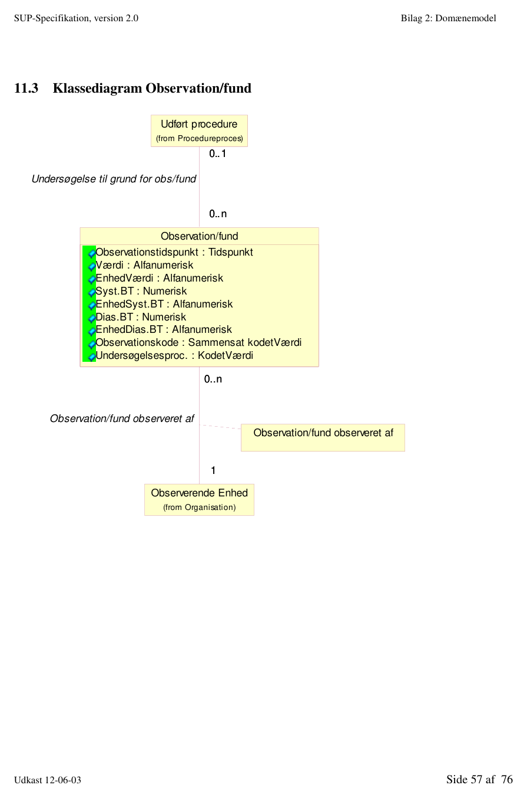

<!-- Billedbeskrivelse: Diagrammet viser Observation/fund med observationstidspunkt, værdi/enhed, særskilte blodtryksfelter, observationskode og undersøgelsesprocedure. Observationen kan have en Udført procedure som grundlag og knyttes til en Observerende Enhed. -->

### 11.3. Klassediagram Observation/fund

```text
Udført procedure
(from Procedureproces)
0..1
```

Undersøgelse til grund for obs/fund

0..n

```text
Observation/fund
Observationstidspunkt : Tidspunkt
Værdi : Alfanumerisk
EnhedVærdi : Alfanumerisk
Syst.BT : Numerisk
EnhedSyst.BT : Alfanumerisk
Dias.BT : Numerisk
EnhedDias.BT : Alfanumerisk
Observationskode : Sammensat kodetVærdi
Undersøgelsesproc. : KodetVærdi
```

0..n

```text
Observation/fund observeret af
Observation/fund observeret af
```

1

```text
Observerende Enhed
(from Organisation)
```


---

<!-- Kilde: PDF side 58 -->

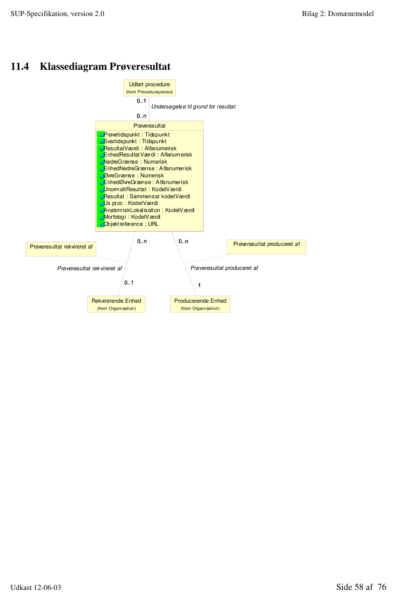

<!-- Billedbeskrivelse: Diagrammet viser Prøveresultat med prøve- og svartidspunkt, resultatværdi, referencegrænser, markering af unormalt resultat, resultatkode, undersøgelsesprocedure, anatomisk lokalisation, morfologi og objektreference. Resultatet har relationer til udført procedure, rekvirerende enhed og producerende enhed. -->

### 11.4. Klassediagram Prøveresultat

```text
Udført procedure
(from Procedureproces)
```

0..1
```text
Undersøgels e til grund for resultat
0..n
Prøveresultat
Prøvetidspunkt : Tidspunkt
Svartidspunkt : Tidspunkt
ResultatVærdi : Alfanumerisk
EnhedResultat Værdi : Alfanum erisk
NedreGrænse : Numerisk
EnhedNedreGrænse : A lfanumerisk
ØvreGrænse : Numerisk
EnhedØvreGrænse : A lfanumerisk
UnormaltResultat : KodetVærdi
Resultat : Sammensat kodetVærdi
Us.proc : KodetVærdi
AnatomiskLokalisation : KodetV ærdi
Morfologi : KodetV ærdi
Objekt reference : URL
```

```text
0.. n              0..n
Prøveresultat rekvireret af                                                                    Prøveresultat produceret af
```

Prøveresultat rek vireret af                                       Prøveresultat produceret af
0..1                                  1
```text
Rekvirerende Enhed                         Producerende Enhed
(from Organisation)                       (from Organisation)
```


---

<!-- Kilde: PDF side 59 -->

### 11.5. Klasser

#### 11.5.1. Anamnestisk oplysning

En oplysning om patientens sygdomsforløb, som fortælles til en sundhedsfaglig person af patienten
selv eller en anden person, f.eks. en pårørende.

```text
Attributter                      Beskrivelse                                                          Type
KonstateringsTidspunkt           Konstateringstidspunkt.                                              Tidspunkt
Tidspunkt, hvor f.eks. lægen modtager oplysningen fra patien-
ten eller en anden kilde.
AnamnestiskTidspunkt             Anvendes til et anamnestisk tidspunkt, f.eks. datoen for sidste      Tidspunkt
menstruation eller et ulykkestilfælde.
Alternativt kan længde af perioden siden den anamnestiske
begivenhed indtraf / startede repræsenteres med "Periode" .
Varigheden af den anamnestiske begivenhed (fx et smertean-
fald) kan repræsenteres med "Periode".
Periode                          Angives med talværdi, evt. forudgået af >, <, >= eller <= uden       Alfanumerisk
blanke karakterer i mellem.
Længden af perioden siden den anamnestiske begivenhed ind-
traf / startede angivet i f.eks. dage / uger / år jf. "Enhed" for
periode.
```

EnhedPeriode                     Enhed for periode, f.eks. dage, måneder eller år.                    Alfanumerisk
```text
Varighed                         Angives med talværdi, evt. forudgået af >, <, >= eller <= uden       Alfanumerisk
blanke karakterer i mellem.
Varigheden af den anamnestiske begivenhed (fx et smertean-
fald eller udslæt)
EnhedVarighed                    Enhed for varighed, f.eks. dage, måneder eller år.                   Alfanumerisk
```

```text
Anam. opl.                       Primærkode for den anamnestiske oplysning, f.eks. "Allergi for       Sammensat ko-
…".                                                                  detVærdi
En tidligere operation angives med en kode for "Tidligere ud-
ført procedure" og så den konkrete procedure som 1. tillægsko-
de.
Undersøgelsesproc.               Kode for hvordan oplysningen er fremkommet og fra hvem den           KodetVærdi
stammer (f.eks. samtale med pårørende).
Objektreference                  Link til evt. notat eller anden beskrivelse af proceduren, f.eks.    URL
operationsbeskrivelse.
```

Associationer
Navn: Anamnestisk oplysning konstateret af
Hvem har konstateret de anamnestiske oplysninger?
(hvilken organisatoriske enhed og evt. behandler)

Navn: Anamnestisk oplysning observeret af
Hvem har observeret/konstateret de anamnestiske oplysninger?
(hvilken organisatoriske enhed og evt. behandler)

Navn: Procedure hvor opl. blev givet
Ref. til en evt. procedurehændelse der ligger til grund for konstateringen, f.eks. "Samtale med pårø-
rende".

---

<!-- Kilde: PDF side 60 -->

#### 11.5.2. Anamnestisk oplysning konstateret af

```text
Attributter                      Beskrivelse                                                         Type
Konstaterende behandler          Den konstaterende medarbejder fra den konstaterende enhed.          AnsvarligPerson
```

```text
KonstateringsSted                Det sted, hvor konstateringen finder sted (f.eks. ambulatoriet),    Sted
hvis det er relevant.
```

Associationer

#### 11.5.3. Anamnestisk oplysning observeret af

```text
Attributter                      Beskrivelse                                                         Type
Observerende behandler           Den observerende medarbejder fra den observerende enhed.            AnsvarligPerson
```

```text
ObservationsSted                 Det sted, hvor konstateringen finder sted (f.eks. ambulatoriet),    Sted
hvis det er relevant.
```

Associationer

#### 11.5.4. Observation/fund

En observation eller et fund, der almindeligvis gøres af en sundhedsfaglig person.
Bruges til værdier/forhold konstateret ved en klinisk undersøgelse af patienten, herunder f.eks. puls,
blodtryk og temperatur, en følt ømhed eller et udslæt.

```text
Attributter                      Beskrivelse                                                         Type
Observationstidspunkt            Observationstidsp.                                                  Tidspunkt
Tidspunkt hvor observationen eller fundet er gjort (ikke nød-
vendigvis lig reg. tidspunkt.)
Værdi                            Angives med talværdi, evt. forudgået af >, <, >= eller <= uden      Alfanumerisk
blanke karakterer i mellem.
Observeret, målt eller fundet værdi, f.eks. temperatur, puls,
respiration, diurese.
Anvendes ikke til blodtryksværdier, hvis Syst.BT og Dias.BT
anvendes.
EnhedVærdi                       Enhed for værdi.                                                    Alfanumerisk
```

```text
Syst.BT                          Systolisk blodtryk.                                                 Numerisk
Attribut anvendes kun ved blodtryksmåling.
```

EnhedSyst.BT                     Enhed for Syst.BT.                                                  Alfanumerisk
```text
Dias.BT                          Diastolisk blodtryk.                                                Numerisk
Attribut anvendes kun ved blodtryksmåling.
EnhedDias.BT                     Enhed for Dias.BT.                                                  Alfanumerisk
```

Observationskode                 Primærkode for observation eller fund, f.eks. puls eller tempe-     Sammensat ko-

---

<!-- Kilde: PDF side 61 -->

```text
ratur. Ved manglende kode anbringes datas ledetekst i kodetek- detVærdi
sten.
```

Findes kun undtagelsesvist p.t., men kan oprettes i SUP
```text
Da SKS-undersøgelsesklassifikationen ikke er færdig, anven-
des p.t. følgende SUP-koder:
```

```text
XSUP00PU           Puls
XSUP00BT           Blodtryk
XSUP00TP           Temperatur
XSUP00HJ           Højde
XSUP00VG           Vægt
```

```text
Ved andre strukturerede observationer og fund anbringes den
lokale kodetekst i kodeteksten til primærkoden.
```

```text
Undersøgelsesproc.               Koden for den undersøgelse, der påviste observationen eller           KodetVærdi
fundet.
```

Associationer
Navn: Observation/fund observeret af
Hvem har observeret/fundet?
(hvilken organisatoriske enhed og evt. behandler)

Navn: Undersøgelse til grund for obs/fund
Den undersøgelse (udført procedure), som ligger til grund for observationen / fundet.

#### 11.5.5. Observation/fund observeret af

```text
Attributter                      Beskrivelse                                                           Type
Observerende behandler           Den observerende medarbejder fra den observerende enhed.              AnsvarligPerson
```

ObservationsSted                 Stedet, hvor observationen / fundet er gjort.                         Sted

Associationer

#### 11.5.6. Prøveresultat

Et resultat af andre undersøgelser end den kliniske.
Omfatter f.eks. lab.svar, rtg. svar og klin.fys.resultater. Hændelsestypen benyttes kun, når der kan
angives et konkret og sigende svar eller evt. et link til det pågældende svar.

```text
Attributter                      Beskrivelse                                                           Type
Prøvetidspunkt                   Tidspunkt for undersøgelsen eller prøvetagningen.                     Tidspunkt
```

```text
Svartidspunkt                    Tidspunkt, hvor den producerende afdeling afgiver/fremsender          Tidspunkt
svaret/resultatet.
ResultatVærdi                    Angives som talværdi, evt. forudgået af >, <, >= eller <= uden        Alfanumerisk
blanke karakterer i mellem.
```


---

<!-- Kilde: PDF side 62 -->

Resultatværdi.
```text
EnhedResultatVærdi               Enhed for ResultatVærdi.                                            Alfanumerisk
For lab-prøver bør anvendes enheder fra IUPAC.
NedreGrænse                      Nedre grænseværdi for resultatværdien                               Numerisk
```

```text
EnhedNedreGrænse                 Enhed for NedreGrænse.                                              Alfanumerisk
For lab-prøver bør anvendes enheder fra IUPAC.
ØvreGrænse                       Øvre grænseværdi for resultatværdien.                               Numerisk
```

```text
EnhedØvreGrænse                  Enhed for ØvreGrænse.                                               Alfanumerisk
For lab-prøver bør anvendes enheder fra IUPAC.
UnormaltResultat                 Markering med en *, når resultatet er patologisk / uden for         KodetVærdi
normalområdet.
Resultat                         Primærkode for resultatet (ikke us. proc.!) f.eks. "Hæmoglo-        Sammensat ko-
bin". Udover lab.prøver er kun få resultater og svar klassifice-    detVærdi
ret indtil nu.
For patologisvar anvendes her en SUP-kode for "Patologisvar"
XSUP00PA.
Blodtypesvar (og lignende) angives enten her efter en klassifi-
kation over blodtyper eller som tekst i feltet "Fri tekst".
```

```text
Ved lab.svar bør anvendes IUPAC's korte koder. Ellers lokal
kode.
```

```text
Mikrobiologisvar oprettes som et særskilt notat med overskrif-
ten "Mikrobiologisvar" og selve svaret i brødteksten.
Us.proc                          Koden for undersøgelses-proceduren, hvis det er relevant. Ofte      KodetVærdi
vil us.typen dog være indlysende, f.eks. ved blodprøvetagning.
Ved patologisvar lig undersøgelsestype efter følgende SUP-
klas:
```

```text
XSUP00PH          Histologi
XSUP00PC          Cytologi
XSUP00PF          Frysemikroskopi
XSUP00PS          Section
```

```text
AnatomiskLokalisation            Anvendes til anatomisk lokalisation og dermed f.eks. T-koden        KodetVærdi
ved patologisvar.
```

```text
Oftest Snomed, men ellers lokal eller ingen klassifikation.
Morfologi                        Anvendes til morfologi og dermed f.eks. M-koden ved patolo-         KodetVærdi
gisvar. Øvrige patologikoder repræsenteres som tillægskoder.
```

Oftest Snomed, men ellers lokal eller ingen klassifikation.
```text
Objektreference                  Link til f.eks. billedfil, elektronisk EKG-repræsentation eller     URL
specialdatasæt. Der registreres en hændelse for hver objektfil.
```

Associationer
Navn: Prøveresultat produceret af
Hvem har produceret prøveresultatet?
(hvilken organisatoriske enhed og evt. behandler)

Navn: Prøveresultat rekvireret af
Hvem har rekvireret prøveresultatet?
(hvilken organisatoriske enhed og evt. behandler)

---

<!-- Kilde: PDF side 63 -->

Navn: Undersøgelse til grund for resultat
Den undersøgelse (udført procedure), der har givet anledning til resultatet.
Der bør måske på længere sigt altid foreligge en procedurehændelse aht. produktions- og forbrugsop-
gørelser. Alternativt må man ved manglende udfyldelse af dette felt med forsigtighed medtælle prø-
veresultater ved disse opgørelser.

#### 11.5.7. Prøveresultat produceret af

```text
Attributter                      Beskrivelse                                                            Type
Producerende behandler           Den producerende medarbejder fra den producerende enhed.               AnsvarligPerson
```

```text
ProcedureSted                    Sted for fremkomst af resultat, f.eks. hvilken af flere rtg. afsnit    Sted
eller lokalafdelinger
```

Associationer

#### 11.5.8. Prøveresultat rekvireret af

```text
Attributter                      Beskrivelse                                                            Type
Rekvirerende behandler           Den rekvirerende medarbejder fra den rekvirerende enhed.               AnsvarligPerson
```

Associationer

---

<!-- Kilde: PDF side 64 -->

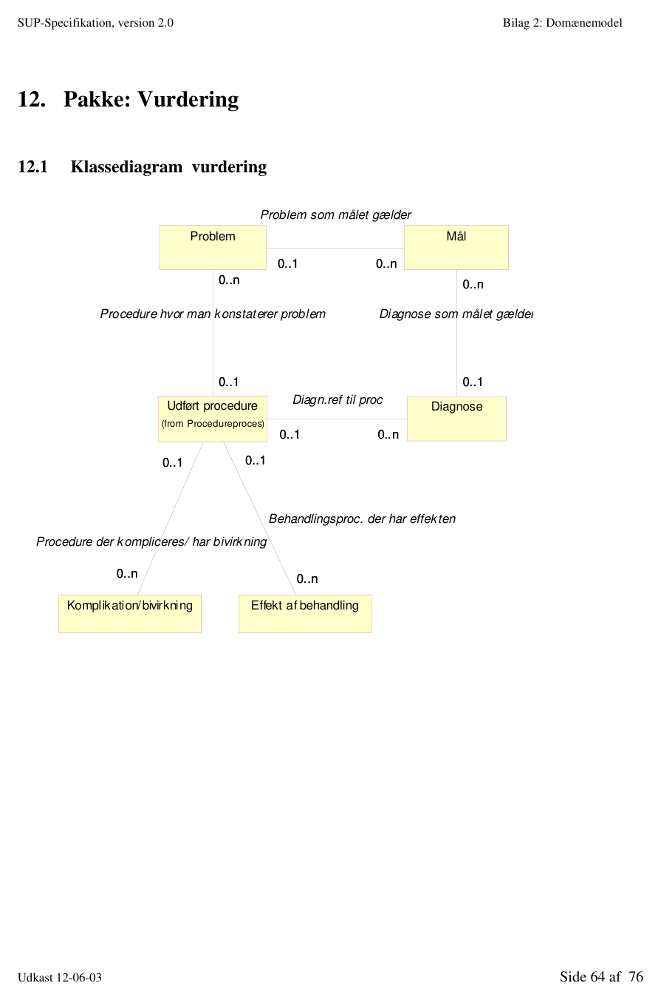

<!-- Billedbeskrivelse: Vurdering-pakkens oversigtsdiagram viser Diagnose, Problem, Mål, Effekt af behandling og Komplikation/bivirkning samt deres relationer til Udført procedure og indbyrdes relationer, eksempelvis mål knyttet til problem eller diagnose. -->

## 12. Pakke: Vurdering

### 12.1. Klassediagram vurdering

```text
Problem som målet gælder
Problem                                            Mål
```

```text
0..1               0..n
0..n                                               0..n
```

Procedure hvor man k onstaterer problem                    Diagnose som målet gælder

```text
0..1                                               0..1
Udført procedure             Diagn.ref til proc
Diagnose
(from Procedureproces)
0..1               0.. n
```

0..1               0..1

```text
Behandlingsproc. der har effek ten
Procedure der k ompliceres/ har bivirk ning
```

0..n                                   0..n
Komplik ation/ bivirkning             Effekt af behandling

---

<!-- Kilde: PDF side 65 -->

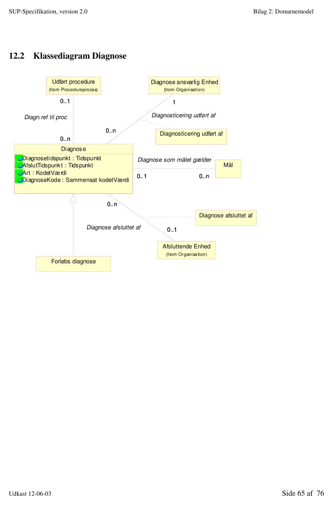

<!-- Billedbeskrivelse: Diagrammet viser Diagnose med diagnosetidspunkt, afslutningstidspunkt, art og diagnosekode. Diagnosen kan referere til en udført procedure, knyttes til mål, stilles af en diagnoseansvarlig enhed og afsluttes af en afsluttende enhed. -->

### 12.2. Klassediagram Diagnose

```text
Udført procedure                          Diagnose ansvarlig Enhed
(from Procedureproces)                           (from Organisation)
```

0..1                                           1
Diagn.ref til proc                                     Diagnosticering udført af
0..n
```text
Diagnosticering udført af
0..n
Diagnos e
Diagnosetidspunkt : Tidspunkt                  Diagnose som målet gælder
AfslutTidspunk t : Tids punkt                                                         Mål
Art : KodetVæ rdi
0.. 1                        0..n
DiagnoseKode : Sammensat kodetVærdi
```

0.. n
Diagnose afsluttet af
Diagnose afsluttet af            0..1
```text
Afsluttende Enhed
(f rom Organisa tion)
Forløbs diagnose
```


---

<!-- Kilde: PDF side 66 -->

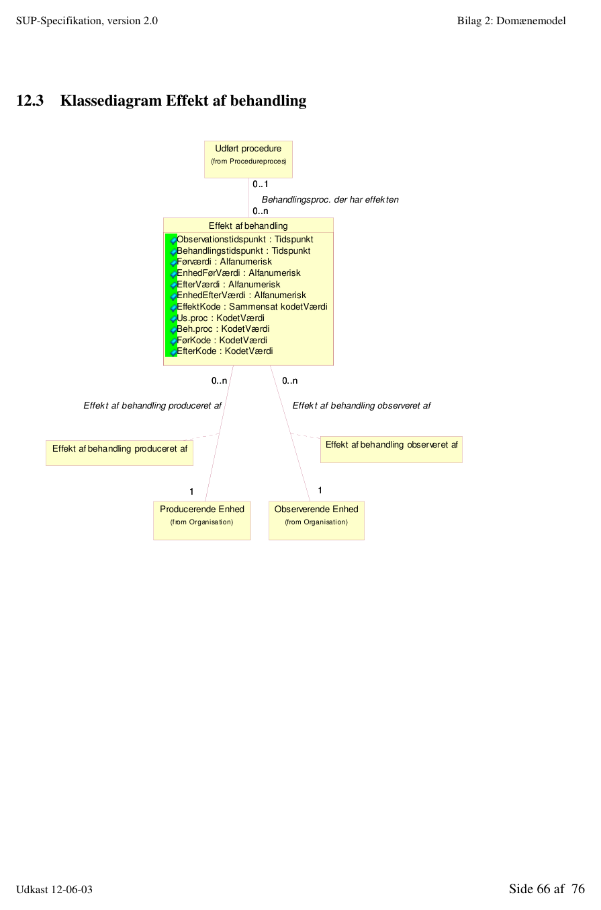

<!-- Billedbeskrivelse: Diagrammet viser Effekt af behandling med før- og efterværdi/koder, observations- og behandlingstidspunkt samt relation til den udførte behandlingsprocedure, producerende enhed og observerende enhed. -->

### 12.3. Klassediagram Effekt af behandling

```text
Udført procedure
(from Procedureproces)
```

0..1
```text
Behandlingsproc. der har effek ten
0..n
Effekt af behandling
Observationstidspunkt : Tidspunkt
Behandlingstidspunkt : Tidspunkt
Førværdi : Alfanumerisk
EnhedFørVærdi : Alfanumerisk
EfterVærdi : Alfanumerisk
EnhedEfterVærdi : Alfanumerisk
EffektKode : Sammensat kodetVærdi
Us.proc : KodetVærdi
Beh.proc : KodetVærdi
FørKode : KodetVærdi
EfterKode : KodetVærdi
```

0..n                0..n
Effek t af behandling produceret af                         Effek t af behandling observeret af

Effekt af behandling produceret af                                           Effekt af behandling observeret af

## 1. 1

```text
Producerende Enhed                Observerende Enhed
(f rom Organisa tion)             (from Organisation)
```


---

<!-- Kilde: PDF side 67 -->

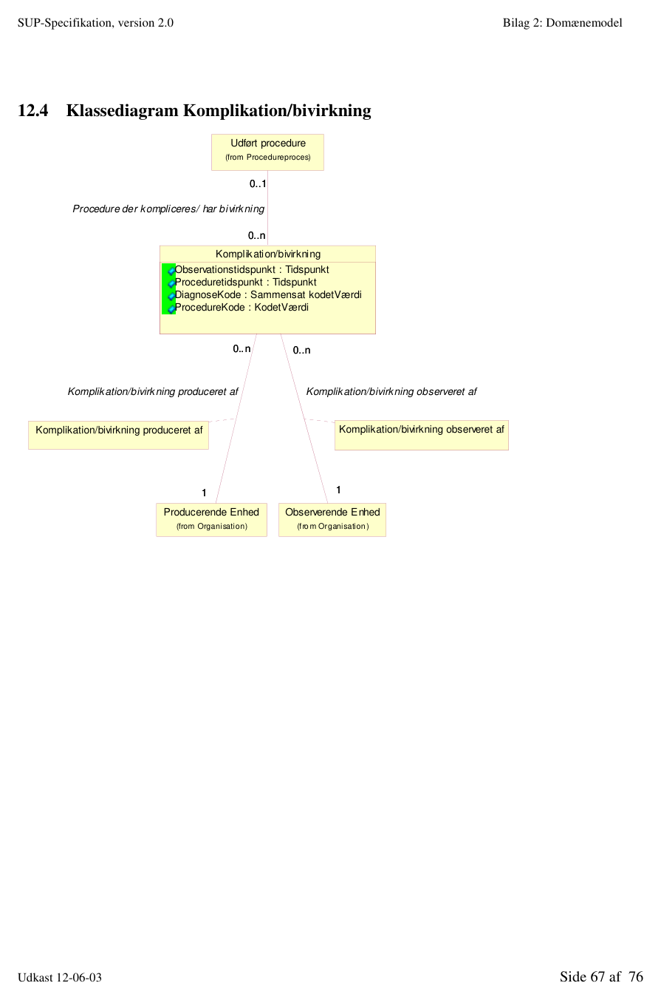

<!-- Billedbeskrivelse: Diagrammet viser Komplikation/bivirkning med observations- og proceduretidspunkt, diagnosekode og procedurekode samt relation til den udløsende udførte procedure, producerende enhed og observerende enhed. -->

### 12.4. Klassediagram Komplikation/bivirkning

```text
Udført procedure
(from Procedureproces)
```

0..1

Procedure der k ompliceres/ har bivirk ning
0..n
```text
Komplik ation/bivirkning
Observationstidspunkt : Tidspunkt
Proceduretidspunkt : Tidspunkt
DiagnoseKode : Sammensat kodetVærdi
ProcedureKode : KodetVærdi
```

0.. n          0..n

Komplik ation/bivirk ning produceret af                   Komplik ation/bivirk ning observeret af

Komplikation/bivirkning produceret af                                     Komplikation/bivirkning observeret af

## 1. 1

```text
Producerende Enhed              Observerende E nhed
(from Organisation)            (f ro m Organisation )
```


---

<!-- Kilde: PDF side 68 -->

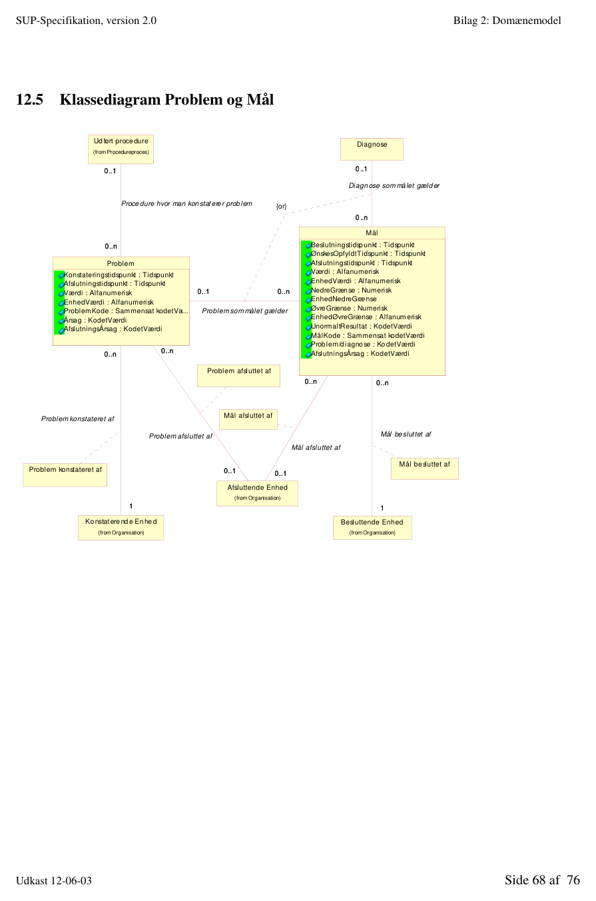

<!-- Billedbeskrivelse: Diagrammet viser Problem og Mål. Problem har konstaterings-/afslutningstidspunkt, værdi, problemkode og årsager; Mål har beslutnings-/ønsket opfyldelses-/afslutningstidspunkt, målområde og målkode. Et mål kan knyttes til et problem eller en diagnose og til besluttende/afsluttende enheder. -->

### 12.5. Klassediagram Problem og Mål

```text
Ud ført proce dure
Diagnose
(from Procedureproces)
```

0..1                                                                                       0 ..1
Diagn ose som må let gæld er
```text
Proce dure hvor man kon stat ere r prob lem           {or}
0 ..n
```

Mål
```text
0..n                                                                      Beslutningstidsp unkt : Tidspunkt
ØnskesOpfyldtTidspunkt : Tidspunkt
Problem                                                                   Afslutningstidspunkt : Tidspunkt
Konstateringstidspunkt : Tidspunkt                                                       Værdi : Alfanumerisk
Afslutningstidspunkt : Tidspunkt                                                         EnhedVærdi : Al fanumerisk
Værdi : Alfanumerisk                           0..1                         0..n         NedreGræn se : Numerisk
EnhedVærdi : Alfanumerisk                                                                EnhedNedreGræ nse
ProblemKode : Sammensat kodetVæ...              Problem som målet gælder                 Øvre Grænse : Numerisk
Årsag : KodetVærdi                                                                       EnhedØvreGrænse : Alfanum erisk
AfslutningsÅrsag : KodetVærdi                                                            UnormaltResultat : KodetVærdi
MålKode : Sammensat kodetVærdi
Prob lem/d iagno se : Ko detVærdi
0..n                                                  AfslutningsÅrsag : KodetVærdi
0..n
```

```text
Problem afsluttet af
0..n                        0..n
```

```text
Mål afsluttet af
Problem konstateret af
```

```text
Problem afsluttet af                                                                Mål be slut tet af
Mål afsluttet af
```

```text
Mål be sluttet af
Problem konstateret af                                           0..1                0..1
```

```text
Afsluttende Enhed
(from Organisation)
1                                                                                           1
Ko nstat ere nd e En he d                                                                       Besluttende Enhed
(from Organisation)                                                                           (from Organisation)
```


---

<!-- Kilde: PDF side 69 -->

### 12.6. Klasser

#### 12.6.1. Diagnose

Andre diagnoser end komplikationer og bivirkninger (hvis ellers hændelsestypen "Komplikati-
on/bivirkning" er taget i brug i det pågældende system).

```text
Attributter                       Beskrivelse                                                         Type
Diagnosetidspunkt                 Diagnosetidspunktet.                                                Tidspunkt
Det tidspunkt, hvor diagnosen stilles.
AfslutTidspunkt                   Datoen for afslutningen af en diagnose. Bruges især ved for-        Tidspunkt
løbsregistrering.
Art                               SST's diagnoseart.                                                  KodetVærdi
Én af værdierne: A, G, B, H, C eller M jf.
SST's klassifikation.
DiagnoseKode                      Diagnosekode. Primærkode for diagnosen.                             Sammensat ko-
detVærdi
```

Associationer
Navn: Diagn.ref til proc
En procedure med relation til diagnosticeringen f.eks. til et besøg, en status eller en procedure, f.eks.
en operation.

Navn: Diagnose afsluttet af
Hvem har afsluttet diagnosen?
(hvilken organisatoriske enhed og evt. behandler)

Navn: Diagnose som målet gælder
Den diagnose, som målet relaterer sig til.

Navn: Diagnosticering udført af
Hvem har udført diagnosticeringen?
(hvilken organisatoriske enhed og evt. behandler)

#### 12.6.2. Diagnose afsluttet af

```text
Attributter                       Beskrivelse                                                         Type
Afsluttende behandler             Den afsluttende medarbejder fra den afsluttende enhed.              AnsvarligPerson
```

Associationer

#### 12.6.3. Diagnosticering udført af

```text
Attributter                       Beskrivelse                                                         Type
Ansvarlig behandler               Den ansvarlige medarbejder fra den ansvarlige enhed.                AnsvarligPerson
```


---

<!-- Kilde: PDF side 70 -->

DiagoseSted                      Det sted, hvor diagnosen er stillet.                                Sted

Associationer

#### 12.6.4. Effekt af behandling

En effekt af en bestemt behandling, repræsenteret ved før- og efterværdier (eller koder) for en effekt-
parameter, f.eks. et prøveresultat, en observation, et fund eller patientens vurdering.

```text
Attributter                      Beskrivelse                                                         Type
Observationstidspunkt            Tidspunkt for observation af effektparameteren efter behand-        Tidspunkt
lingen (se "Efterværdi" ). Det kan være behandlerens eller
patientens observation.
Behandlingstidspunkt             Starttidspunktet for den behandling, som tilskrives den pågæl-      Tidspunkt
dende effekt.
Førværdi                         Angives med talværdi, evt. forudgået af >, <, >= eller <= uden      Alfanumerisk
blanke karakterer i mellem.
Værdi af effektparameteren målt/konstateret inden behandlin-
gens start, f.eks. et blodprøveresultat eller en målt bevægelig-
hed før en hofteoperation.
EnhedFørVærdi                    Enhed for FørVærdi                                                  Alfanumerisk
```

```text
EfterVærdi                       Angives med talværdi, evt. forudgået af >, <, >= eller <= uden Alfanumerisk
blanke karakterer i mellem.
Værdi af effektparameteren målt/konstateret efter behandlingen
på den angivne observationsdato, f.eks. et blodprøveresultat
eller en målt bevægelighed efter en hofteoperation.
EnhedEfterVærdi                  Enhed for EfterVærdi                                           Alfanumerisk
```

```text
EffektKode                       Primærkode for den observerede effektparameter, f.eks. pati-        Sammensat ko-
enttilfredshed, smerter, bevægelighed eller en blodprøve.           detVærdi
Der findes ikke p.t. en officiel klas. for effektparametre.
Us.proc                          Evt. undersøgelse, der påviste behandlings-effekten.                KodetVærdi
```

Beh.proc                         Procedurekoden for den behandling, som effekten tilskrives.         KodetVærdi
```text
FørKode                          Kode for effektparameteren målt/konstateret inden behandlin-        KodetVærdi
gens start.
EfterKode                        Kode for effektparameteren målt/konstateret på observations-        KodetVærdi
tidspunktet.
```

Associationer
Navn: Behandlingsproc. der har effekten
Den behandlingshændelse, som effekten tilskrives.

Navn: Effekt af behandling observeret af
Hvem har observeret (eller konstateret) effekten?
(hvilken organisatoriske enhed og evt. behandler)

Navn: Effekt af behandling produceret af

---

<!-- Kilde: PDF side 71 -->

Hvem har udført den procedure, som man nu observerer effekten af ?
(hvilken organisatoriske enhed/og evt. behandler)

#### 12.6.5. Effekt af behandling observeret af

```text
Attributter                      Beskrivelse                                                         Type
Observerende behandler           Den observerende medarbejder fra den observerende enhed.            AnsvarligPerson
```

ObservationsSted                 Stedet, hvor observationen foregår.                                 Sted

Associationer

#### 12.6.6. Effekt af behandling produceret af

```text
Attributter                      Beskrivelse                                                         Type
Producerende behandler           Den producerende medarbejder fra den producerende enhed.            AnsvarligPerson
```

Associationer

#### 12.6.7. Forløbs diagnose

Den på hændelsens starttidspunkt gældende forløbsdiagnose (eller aktionsdiagnose ved kontaktregi-
strering). Forløbsdiagnosen er den diagnose, der aktuelt bedst beskriver den tilstand, der er årsag til
det igangværende eller afsluttede sygehusforløb.

Associationer

#### 12.6.8. Komplikation/bivirkning

Komplikationer og bivirkninger til en given behandling eller undersøgelse. Beskrives ofte med en
diagnosekode, men de er en særskilt hændelsestype i SUP, fordi det er hensigtsmæssigt at medtage
specielle oplysninger og relationer vedr. disse hændelser.

```text
Attributter                      Beskrivelse                                                         Type
Observationstidspunkt            Observationstidspunkt. Tidspunkt for observation af komplika-       Tidspunkt
tionen / bivirkningen (eller evt. patientens oplysning om obser-
vationstidspunktet).
Proceduretidspunkt               Starttidspunktet for den procedure, som komplikationen eller        Tidspunkt
bivirkningen tilskrives.
DiagnoseKode                     Diagnosekode (eller problemkode) for den pågældende kom-            Sammensat ko-
plikation eller bivirkning.                                         detVærdi
ProcedureKode                    Kode for den procedure, der udløste komplikation eller bivirk-      KodetVærdi
ning
```


---

<!-- Kilde: PDF side 72 -->

Associationer
Navn: Komplikation/bivirkning observeret af
Hvem har observeret/konstateret (eller fået oplyst) komplikationen eller bivirkningen.
(hvilken organisatoriske enhed og evt. behandler)

Navn: Komplikation/bivirkning produceret af
Hvem har udført den procedure, som udløser en komplikation eller bivirkning.

(hvilken organisatoriske enhed/og evt. behandler)

Navn: Procedure der kompliceres/ har bivirkning
Den proc.hændelse, der har komplikation / bivirkning

#### 12.6.9. Komplikation/bivirkning observeret af

```text
Attributter                       Beskrivelse                                                    Type
Observerende behandler            Den observerende medarbejder fra den observerende enhed.       AnsvarligPerson
```

```text
ObservationsSted                  Det sted, hvor komplikationen eller bivirkningen observeres    Sted
eller oplyses.
```

Associationer

#### 12.6.10. Komplikation/bivirkning produceret af

```text
Attributter                       Beskrivelse                                                    Type
Producerende behandler            Den producerende medarbejder fra den producerende enhed.       AnsvarligPerson
```

Associationer

#### 12.6.11. Mål

Et opstillet mål for behandling eller pleje.

```text
Attributter                       Beskrivelse                                                    Type
Beslutningstidspunkt              Tidspunkt hvor målet opstilles.                                Tidspunkt
```

ØnskesOpfyldtTidspunkt            Tidspunkt hvor målet ønskes nået.                              Tidspunkt
```text
Afslutningstidspunkt              Tidspunkt for afslutning af målet, enten fordi målet er nået,   Tidspunkt
eller fordi man har opgivet målet (det bør fremgår af "Afslut-
ningsårsag")
Værdi                             Angives med talværdi, evt. forudgået af >, <, >= eller <= uden Alfanumerisk
blanke karakterer i mellem.
Værdi med relation til målet, f.eks. niveau af bestemt blodprø-
```


---

<!-- Kilde: PDF side 73 -->

veværdi.
EnhedVærdi                       Enhed for Værdi                                                       Alfanumerisk
```text
NedreGrænse                      Evt. nedre grænseværdi for værdien. Anvendes til at angive et Numerisk
ønsket interval, som en given parameter bør holde sig indenfor.
```

EnhedNedreGrænse                 Enhed for NedreGrænse
```text
ØvreGrænse                       Evt. øvre grænseværdi for værdien. Anvendes til at angive et    Numerisk
ønsket interval, som en given parameter bør holde sig indenfor.
EnhedØvreGrænse                  Enhed for ØvreGrænse                                            Alfanumerisk
```

```text
UnormaltResultat                 Bruges til markering med en *, når resultatet er uden for det         KodetVærdi
ønskede målområde.
MålKode                          Målkode, dvs. primærkoden for målet.                                  Sammensat ko-
Der findes ingen officiel klassifikation pt.                          detVærdi
Problem/diagnose                 Kode for det problem eller diagnose, som målet relaterer sig til.     KodetVærdi
```

```text
AfslutningsÅrsag                 Kode for årsagen til at målet afsluttes, f.eks. "Målet nået" eller    KodetVærdi
"Målet opgivet".
```

Associationer
Navn: Diagnose som målet gælder
Den diagnose, som målet relaterer sig til.

Navn: Mål afsluttet af
Hvem afslutter målet?

(hvilken organisatoriske enhed og evt. behandler)

Navn: Mål besluttet af
Hvem har opstillet målet?
(hvilken organisatoriske enhed og evt. behandler)

Navn: Problem som målet gælder
Det problem, som målet relaterer sig til.

#### 12.6.12. Mål afsluttet af

```text
Attributter                      Beskrivelse                                                           Type
Afsluttende behandler            Den afsluttende medarbejder fra den afsluttende enhed.                AnsvarligPerson
```

Associationer

#### 12.6.13. Mål besluttet af

```text
Attributter                      Beskrivelse                                                           Type
Besluttende behandler            Den besluttende medarbejder fra den besluttende enhed.                AnsvarligPerson
```


---

<!-- Kilde: PDF side 74 -->

Besluttende Sted                 Stedet, hvor målet opstilles.                                      Sted

Associationer

#### 12.6.14. Problem

Et problem i relation til patientens sygdomsforløb. Kan være en diagnose, men behøver ikke være det.
Det findes pt. ikke en officiel problemklassifikation, men derimod flere lokale klassifikationer over
f.eks. sygeplejeproblemer.

```text
Attributter                      Beskrivelse                                                        Type
Konstateringstidspunkt           Konstateringstidspunkt for problemet.                              Tidspunkt
```

```text
Afslutningstidspunkt             Tidspunkt for afslutning af problemet, enten fordi det er løst, Tidspunkt
eller fordi man ikke kan komme længere med løsningen af
dette problem. Årsagen bør fremgå af "Afslutningsårsag".
Værdi                            Angives med talværdi, evt. forudgået af >, <, >= eller <= uden Alfanumerisk
blanke karakterer i mellem.
Værdi med relation til problemet, f.eks. værdi på en smerteska-
la.
EnhedVærdi                       Enhed for værdi.                                                Alfanumerisk
```

```text
ProblemKode                      Primærkoden for problemet. Kan f.eks. være en diagnosekode.        Sammensat ko-
detVærdi
Årsag                            Kode for en evt. kendt årsag til problemet, f.eks. en diagnose.    KodetVærdi
```

```text
AfslutningsÅrsag                 Koden for årsagen til afslutningen af problemet, f.eks. "Løst"     KodetVærdi
eller "Løsning ikke mulig".
```

Associationer
Navn: Problem afsluttet af
Hvem afslutter problemet?

(hvilken organisatoriske enhed og evt. behandler)

Navn: Problem konstateret af
Hvem har konstateret problemet?

(hvilken organisatoriske enhed og evt. behandler)

Navn: Problem som målet gælder
Det problem, som målet relaterer sig til.

Navn: Procedure hvor man konstaterer problem
F.eks. et besøg, en status eller en procedure (f.eks. en operation), hvor problemet konstateres.

#### 12.6.15. Problem afsluttet af

```text
Attributter                      Beskrivelse                                                        Type
Afsluttende behandler            Den afsluttende medarbejder fra den afsluttende enhed.             AnsvarligPerson
```


---

<!-- Kilde: PDF side 75 -->

Associationer

#### 12.6.16. Problem konstateret af

```text
Attributter                      Beskrivelse                                                   Type
Konstaterende behandler          Den konstaterende medarbejder fra den konstaterende enhed.    AnsvarligPerson
```

KonstateringsSted                Det sted, hvor problemet konstateres.                         Sted

Associationer

---

<!-- Kilde: PDF side 76 -->

## 13. Datatyper

I domænemodellen benyttes nedenstående datatyper.

```text
Datatype                  Beskrivelse
Alfanumerisk              En streng bestående af vilkårlige tegn - numeriske, alfanume-
riske og specialtegn.
Numerisk                  Tal, herunder decimaltal hvor decimaler angives med kom-
ma.
Tidspunkt                 På formatet ÅÅÅÅ-MM-DD TT:MM:SS.
Kodet Værdi               Består af en kode og en der til hørende kodetekst. Er beskre-
vet yderlig under pakken "Klassifikation".
Sammensat ko-             En kodekombination bestående af én primærkode og ingen
detVærdi                  eller flere tillægskoder. I SUP kan kombinationen af tekniske
grunde indeholde fra 0 til 5 tillægskoder. Se endvidere pakken
"Klassifikation"
URL                       Uniform Resource Locator - en formateret streng der som
formål har at identificere en ressource på Internettet eller in-
tranettet.
```


---
