# SUP Bilag 2 - Domænemodel, version 2.2

- **Kildedokument:** `bilag20022020domaenemodel2022.pdf`
- **Dato:** 20. august 2004
- **Konverteringsformål:** Agent-egnet tekstversion med kilde-sideankre og separate diagram-/billedressourcer.
- **Kildeprincip:** Teksten nedenfor følger PDF-kilden. Mermaid-diagrammer er semantiske rekonstruktioner og bør kontrolleres mod originalfiguren ved tvivl.

<!-- Kildeside: 1 -->

Hvis du har brug for at læse dette dokument i et keyboard eller skærmlæservenligt format, så klik venligst på denne knap.

                                            SUP-specifikation

## Bilag 2 - version 2.2

                                                               Domænemodel

## 20 august 2004

                                                                              Udarbejdet for

                                                   SUP-Styregruppen

                                                © Uddrag af indholdet kan gengives med tydelig kildeangivelse

<!-- Kildeside: 2 -->

Ændringslog
  Version       Dato       Ændrede sider eller afsnit           Kommentarer
### 2.0 20.03.03                                         1. udgave
### 2.1 14.05.04    Mange sider, detaljeret læsning er   Ændringer vedr. bla.
                           nødvendigt                           • Stavefejl og navngivning af attributter
                                                                • Forløbsstatus er flyttet fra pakken ’Hændelse’
                                                                     til pakken ’Kontaktperiode’.
                                                                • Beskrivelse af Tilstedetidspunkt
                                                                • Ingen begrænsning på antal tillægskoder
                                                                • pakken ’Organisation’
                                                                • Typen af ’-sted’

### 2.2 20.08.2004   3. Pakke: Hændelser.                 Attribut ”Udtrækstidspunkt” tilføjet klassen
                                                                "Patientforløb”.

<!-- Kildeside: 3 -->

Indholdsfortegnelse

1.      Læsevejledning................................................................................5
2.      Pakke: Domænemodel....................................................................6
  2.1     Pakkediagram.................................................................................................. 6
  2.2     Klassediagram - total ...................................................................................... 7
3.      Pakke: Hændelse.............................................................................8
  3.1     Klassediagram hændelse................................................................................. 8
  3.2     Klassediagram hændelsestyper ....................................................................... 9
  3.3     Klassediagram Personoplysninger ................................................................ 10
  3.4     Klasser........................................................................................................... 11
4.      Pakke: Klassifikation....................................................................14
  4.1     Klassediagram klassifikation ........................................................................ 14
  4.2     Klasser........................................................................................................... 15
5.      Pakke: Organisation.....................................................................17
  5.1     Klassediagram organisation .......................................................................... 17
  5.2     Klasser........................................................................................................... 18
6.      Pakke: Administrative karakteristika ........................................25
  6.1     Klassediagram administrativ karakteristikum............................................... 25
  6.2     Klasser........................................................................................................... 26
7.      Pakke: Kontaktperiode ................................................................28
  7.1     Klassediagram kontaktperiode...................................................................... 28
  7.2     Klasser........................................................................................................... 29
8.      Pakke: Medicinering ....................................................................31
  8.1     Klassediagram medicinordination / medicingivning .................................... 31
  8.2     Klasser........................................................................................................... 32
9.      Pakke: Notat..................................................................................37
  9.1     Klassediagram notat...................................................................................... 37
  9.2     Klasser........................................................................................................... 38
10. Pakke: Procedureproces ..............................................................40
  10.1       Klassediagram procedureproces ............................................................... 40
  10.2       Klassediagram Booking af procedure........................................................ 41
  10.3       Klassediagram Ordination ......................................................................... 42
  10.4       Klassediagram Planlagt procedure ............................................................ 43
  10.5       Klassediagram Rekvisition ........................................................................ 44
  10.6       Klassediagram Udført procedure............................................................... 45
  10.7       Klasser ....................................................................................................... 46
11. Pakke: Resultat .............................................................................56
  11.1       Klassediagram resultat.............................................................................. 56
  11.2       Klassediagram Anamnestisk oplysning..................................................... 57
  11.3       Klassediagram Observation/fund .............................................................. 58
  11.4       Klassediagram Prøveresultat ..................................................................... 59

<!-- Kildeside: 4 -->

11.5       Klasser ....................................................................................................... 60
12. Pakke: Vurdering .........................................................................65
  12.1       Klassediagram vurdering.......................................................................... 65
  12.2       Klassediagram Diagnose ........................................................................... 66
  12.3       Klassediagram Effekt af behandling.......................................................... 67
  12.4       Klassediagram Komplikation/bivirkning .................................................. 68
  12.5       Klassediagram Problem og Mål ................................................................ 69
  12.6       Klasser ....................................................................................................... 70
13. Datatyper .......................................................................................77

<!-- Kildeside: 5 -->

## 1 Læsevejledning
Domænemodellen er udarbejdet i UML-notation (Unified Modelling Language), og
det forudsættes, at læseren er bekendt med denne notation og OMT (Object
Modelling Technique). F.eks. forudsættes det, at læseren er bekendt med, at:

•   specialisering af klasser nedarver attributter fra den klasse, de er en specialisering
    af.
•   associationer mellem klasser angives med en fuldt optrukken linie.
•   egenskaber ved en association kan angives ved en associations klasse.
•   associations klasser knyttes til en association ved en stiplet linie.

Modellen er opdelt i et antal pakker. I den enkelte pakke er samlet modelelementer
(klasser / associationer / klassediagrammer), som er "logisk beslægtede". Det fremgår
af pakkediagrammet forrest i modellen samt af indholdsfortegnelsen, hvilke pakker
der findes.

De enkelte modelelementer er kun beskrevet ét sted - nemlig i den pakke, hvor de
"hører hjemme". Eksempelvis er klassen Prøveresultat kun beskrevet i pakken
Resultat.

De enkelte pakker er dog også indbyrdes afhængige, hvilket fremgår af
pakkediagrammet. Eksempelvis findes der i pakken Resultat klassediagrammet
Prøveresultat, hvoraf det fremgår, at klassen Prøveresultat har en association til
klassen Udført procedure, der "hører hjemme" i pakken Procedureproces. Dette er
eksplicit markeret dels ved, at der på klassediagrammet står Udført procedure from
Procedureproces, dels ved, at der på pakkediagrammet er markeret, at pakken
Prøveresultat afhænger af pakken Procedureproces.

For pakker, der indeholder flere hændelsetyper, er der vist klassediagrammer, der
viser hændelsernes indbyrdes relationer i pakken.

Dette dokument er overordnet struktureret på følgende måde:

•   Først vises et pakkediagram.
•   Herefter vises for hver pakke i modellen (først pakkerne Hændelse,
    Klassifikation og Organisation, herefter de øvrige pakker sorteret stigende efter
    pakkenavn):
       o Klassediagrammer i pakken (sorteret stigende efter diagramnavn)
       o Klasser i pakken (sorteret stigende efter klassenavn)
                ƒ Associationer til klassen (sorteret stigende efter associationsnavn)
                    Kun associationer, som enten har et navn eller en beskrivelse, er
                    medtaget her.

<!-- Kildeside: 6 -->

## 2 Pakke: Domænemodel

### 2.1 Pakkediagram

   Alle pakker afhænger af
   pakkerne "Klassifikation" og                       Procedurep roces
   "Organisation". Af
   overskuelighedshensyn er
   disse afhængigheder ikke vist
   på pakkediagrammet.

      Kontaktperiode               Resultat   Vurdering                  Notat   Administrative      Medicinering
                                                                                  karakteristika

                                                          Hændelse               Klassifikation     Org anisatio n

<!-- Kildeside: 7 -->

### 2.2 Klassediagram - total
                                                   Rekvisition                                                                               Medicingivning
  Dette er et                                (from Procedureproces)                                                                          (from Medicinering)
  "total-diagram" - se                                       0..1
                                                               0.. 10..n                                                                                  0..n
  venligst efterfølgende                                    0..n
                                                     0..1
                                                   0..1
  diagrammer for detaljer.                                                                                                             Medicingivning f orårsaget af

                                                                                                                                                     0..1
                                                                                                                                            Medicinordination
                                                                                                                                             (from Medicinering)
                                                                                                                                                          0..n
                                                                                0..n

                                                                          Booking af
                     0..n                                                  procedure                       Book et procedure
                                                                                                            0..1                            0..1
  Administrativ karakteristikum                                     (f rom0..n
                                                                           Proc edureproc es)
                                                                                            0..n                                                      0..1
   (from Administrative karakt eristika)
                                                                                                       Kontaktperiode                      Planlagt procedure
                                                                                                                                  0.. 1 (from Procedureproces)
                    0.. n                                                                       0..1 (from Kontaktperiode)
                                                                                                                         0..1       0.. 1
                                                                                                                                   0..1
                                                                        0.. 1 0.. 1                                                       0.. 1
                                                                    0..1
  Prøveresultat                                                   Ordination
                                                                                        0..
                                                                                        Planlægning af udført proc
  (from Resultat) 0..n                                       (from Procedureproces)
                                                                 0..1

                 Prøveresultat til procedure

                                    0..0..n
## 1 0..n
                              0..1
                Udløsende procedure                                      0..1                                                   0..n
  Observation/fund 0..n      0..1  Udført proc edure                                                                                      Effekt af behandling
     (from Resultat)                         (from Procedureproces)      0..n                                                                (f ro m Vu rde ri ng)

                                           0.. 1                    0..1
                                                                  0..1
                                                    0..1     0..1 Not at til procedure

                                                                                                    0..n
                    0..n                                                                                                        0..n Komplikation/bivirk ning
                                                                                                           Notat                             (f ro m Vu rde ri ng)
   Anamnestisk oplysning                                                                               (from Notat)
           (from Resultat)

                             0..n                                                      0..n
                                                                 Problem / diagnose som målet gælder
                       Diagnose                                   Mål                         Problem
                   (from Vurdering)                         (from Vurdering) 0.. n               0..1 (f ro m Vu rde ri ng)

 Ovens tående klasser er alle
 spec ialiseringer af nedenstående
 klasse "Hændelse". Disse                                                                                        Hændelse
                                                                                                         0..n (from Hændelse)
 spec ialiseringsstruk turer er udeladt
 fra diagrammet af                                                                      1
 overskuelighedshensyn.
 Klasser/associationer fra pakken                                       Patientforløb                                                                   Person
                                                                    (from Hændelse)                                                            1   (from Hændelse)
 "Organisation" er ligeledes udeladt.                                                    0..n

<!-- Kildeside: 8 -->

## 3 Pakke: Hændelse

### 3.1 Klassediagram hændelse

                                                  Hændelse
                                      Identifikation : Alfanumerisk
                                      Registreringstidspunkt : Tidspunkt Hændelse registreret af
                                      FriTekst : Alfanum erisk                                                RegistreringsEnhed
                                      Tilstede tid spunkt : Tidspunkt                                           (f rom Organisation)
                                                                         0..n                  1
                                      Ugyldighedstidspunkt : Tidspu nkt
                                      Si kkerhedskode : KodetVærdi
                                      Personalder : H eltal

                                                                0..n                       Hændelse registreret af

             En "Hændelse vil altid
             tilhøre en "Person"
             gennem patientforløbet
                                                                            Hændelse tilhører patientforløb

                     Person
       CPRnummer : Alfanumerisk
                                                                                       1
       Navn : Alfanumerisk
       Adresse : Alfanumerisk                                                         Patientforløb
       Kommunekode : Alfanumerisk                                            Identifikation : Alfanumerisk
       Kommune : Alfanumerisk                                                Starttidspunkt : Tidspunkt
       KommuneTilflytningsdato : Tidspunkt                                   Sluttidspunkt : Tidspunkt
       Køn : KodetVærdi                      1                      0..n     Teknisk forløb : KodetVærdi
       Fødselsdato : Tidspunkt                                               Fødesystem : Alfanumerisk
       TelefonNummer : Alfanumerisk          Person er patient i forløb
                                                                             Udtrækstidspunkt : Tidspunkt
       Pårørende : Alfanumerisk
       EgenLægesNavn : Alfanumerisk                                                            0..n
       EgenLægesYdernr : Alfanumerisk
                                                                                                  Oprindelig forløb sansvarlig
       EgenLægeStartDato : Tidspunkt                                                       1
                                                                           Oprindelig forløbsansvarlig enhed
                                                                                    (f rom Organ is at ion)

<!-- Kildeside: 9 -->

### 3.2 Klassediagram hændelsestyper

        Hændelsety per er alle
        specialiseringer af klassen
        "hændelse" og hændelsesty pen
        udledes af klassenav net.

                                                                                                Hændelse

      Diagnose
                                    Medicinordination                                                    Prøv eresulta t                            Administrativ                       Observ ation/f und
   (from Vurdering)
                                     (from Medicinering)                                                   (from Resultat)                         karakteristikum                          (from Resultat)
                                                                                                                                          (from Administrative karakteristika)

       Medicingiv ning                                           Notat                                                                      Udf ørt procedure
                                    Ord inati on                                                     Rek v isi tio n                                                              Kontaktperiode
       (from Medicinering)
                               (from Procedureproces)          (from Notat)                      (from Procedureproces)                   (from Procedureproces)                 (from Kontaktperiode)

                                                                                                    Komplikation/biv irkn ing
                                                                                                                                                                 Mål
                                                                                                         (from Vurdering)
                                                                                                                                                          (from Vurdering)

      Planlagt procedure           Boo ki ng af p ro ce dure         Anamnestisk oply sning                                  Ef f ekt af behandling                                                 Proble m
      (from Procedureproces)        (from Procedureproces)                    (from Resultat)                                   (from Vurdering)                                                (from Vurdering)

<!-- Kildeside: 10 -->

### 3.3 Klassediagram Personoplysninger

                       Person
         CPRnummer : Alfanumerisk
         Navn : Alfanumerisk
         Adresse : Alfanumerisk
         Kommunekode : Alfanumerisk
         Kommune : Alfanumerisk
                                                          CaveOplysninger
         KommuneTilflytningsdato : Tidspunkt 1   0..n
         Køn : KodetVærdi                               Tek st : Alfanumerisk
         Fødselsdato : Tidspunkt                        Dat o : Tidspunkt
         TelefonNummer : Alfanumerisk
         Pårørende : Alfanumerisk                                     0..n
         EgenLægesNavn : Alfanumerisk
         EgenLægesYdernr : Alfanumerisk
         EgenLægeStartDato : Tidspunkt

                                                                        1

                                                        Organisatorisk Enhed
                                                            (from Organisation)

                                                    Kode : Kodet Værdi
                                                    Inst it ution tek st : Alfanumerisk
                                                    Afdeling t ekst : A lfanumerisk

<!-- Kildeside: 11 -->

### 3.4 Klasser
#### 3.4.1 CaveOplysninger

Attributter                        Beskrivelse                                                        Type
Tekst                              En tekstuel beskrivelse af f.eks. allergier, steroidbehandling,    Alfanumerisk
                                   vigtige dispositioner, pacemaker, visse diagnoser som epilepsi
                                   og diabetes.
Dato                               Dato for hvornår Caveoplysning er registreret.                     Tidspunkt

Associationer

#### 3.4.2 Hændelse
En ting, der sker, eller en egenskab, der konstateres, i relation til en patient.

Attributter                        Beskrivelse                                                        Type
Identifikation                     Registreringssystemets entydige ID for hændelsen.                  Alfanumerisk
                                   Bruges til identifikation, herunder ved referencer.
Registreringstidspunkt             Automatisk tidsstempel ved registreringen.                         Tidspunkt
                                   Dette felt vil ikke dække alle felterne i recorden. Nogle felter
                                   er systemudfyldte / hentet fra anden registrering. Dette fremgår
                                   af kommentarerne til de enkelte felter eller implicit af
                                   sammenhængen.
FriTekst                           Fri tekst til hændelsen formateret i XHTML. Når friteksten         Alfanumerisk
                                   vises formateret i en SUP web browser applikation skal den
                                   kunne udprintes på en standard side.

                                   Her gengives al fri tekst vedr. hændelsen, undtaget brødteksten
                                   i notater (som findes i attributten "Brødtekst" formateret i
                                   XHTML).

                                   - Medicin ordination:
                                          Her tilføjes i fri tekst relevante supplerende oplysninger,
                                          som ikke er medtaget på struktureret form, f.eks.
                                          dosering (f.eks. 2+1+1), doseringstidspunkter,
                                          infusionshastighed og særlige instrukser.
                                   - Kontaktperiode:
                                          F.eks. henvisningstekst.
Tilstede tidspunkt                 Tidspunkt for tilføjelse af elementet til fødesystemets database. Tidspunkt
                                   Anvendes primært ved visse analyser.
Ugyldighedstidspunkt               Blank=gyldig. Udfyldt=ugyldig fra det anførte tidspunkt.           Tidspunkt
                                   Ugyldighedstidspunkt.
                                   Tidspunkt fra hvilket en hændelses informationselement er
                                   ugyldigt pga. opdatering.
                                   Ugyldige informations elementer skal ikke medtages ved
                                   kommunikation. Feltet er beregnet til brug ved opdateringer og
                                   til analyseformål.
Sikkerhedskode                     Værdisæt ikke fastlagt.                                            KodetVærdi

<!-- Kildeside: 12 -->

Reserveret til fremtidig brug, f.eks. til angivelse af adgangs-
                                betingelser etc
Personalder                     Personens alder på hændelsens starttidspunkt rundet ned.          Heltal

Associationer
Navn: Hændelse registreret af
Hvilken enhed registrerer hændelsen?
(hvilken organisatorisk enhed og evt. behandler)

Navn: Hændelse tilhører patientforløb

#### 3.4.3 Hændelse registreret af

Attributter                     Beskrivelse                                                       Type
Registrerende medarbejder       Registrerende persons ID. Logon ved registreringen.               Alfanumerisk
                                Dette felt vil kun dække nogle af felterne i recorden. Andre er
                                systemudfyldte.

Associationer

#### 3.4.4 Patientforløb
En del af et sygdomsforløb, hvor en person er i kontakt med sundhedsvæsenet med henblik på
undersøgelse, behandling og/eller pleje af samme helbredsproblem.
Bem.: "Helbredsproblem" omfatter i denne forbindelse både aktuelle, tidligere og potentielle
helbredsproblemer. En person kan have to eller flere patientforløb samtidigt for forskellige
helbredsproblemer.

Attributter                     Beskrivelse                                                     Type
Identifikation                  Oprindelig identifikation af forløbet. Den entydige forløbs-ID Alfanumerisk
                                fra det system, hvor forløbet oprettes.
                                Ved teknisk oprettet forløb er forløbs-ID = oprindelig Kontakt-
                                ID.
Starttidspunkt                  Forløbets starttidspunkt.                                       Tidspunkt

Sluttidspunkt                   Forløbets afslutningstidspunkt.                                   Tidspunkt

Teknisk forløb                  Markering af teknisk oprettet forløb ved kontaktregistrering.     KodetVærdi
                                Værdier: x = teknisk oprettet forløb. Ellers blank.

Fødesystem                      Fødesystem: Kode for det fødesystem, som forløbet er           Alfanumerisk
                                udtrukket fra. Bemærk at de udtrukne data oprindeligt kan være
                                registreret i et andet system.

                                Klassifikationens koder bygges op som en streng med de første
## 5 karakterer til leverandørnavnet og de næste 5 karakterer til
                                systemnavnet.

<!-- Kildeside: 13 -->

Udtrækstidspunkt                 Tidspunkt for dataudtræk fra fødesystemet.                    Tidspunkt

Associationer
Navn: Hændelse tilhører patientforløb

Navn: Oprindelig forløbsansvarlig
Hvem er oprindeligt forløbsansvarlig?
(Den organisatoriske enhed, der opretter forløbet.)

Navn: Person er patient i forløb

#### 3.4.5 Person
Et individ identificeret ved et CPR-nummer.

Attributter                      Beskrivelse                                                     Type
CPRnummer                        Patientens CPR-nummer. Skal almindeligvis anonymiseres i        Alfanumerisk
                                 dataudtræk til analyseformål. Det anonymiserede ID er i så fald
                                 ens for den enkelte person i forskellige udtræk.
Navn                             Personens officielle navn på udtrækstidspunktet.                Alfanumerisk

Adresse                          Personens folkeregister-adresse på udtrækstidspunktet.        Alfanumerisk
                                 Konkatenering af vej, vejnummer, (evt. stednavn),
                                 postnummer, by.
Kommunekode                      Kommunekode for personens bopælskommune i henhold til         Alfanumerisk
                                 den officielle klassifikation af kommuner.
Kommune                          Navn på kommune.                                              Alfanumerisk

KommuneTilflytningsdato          Tilflytningsdato til kommunen.                                Tidspunkt

Køn                              Værdisæt: M, K, U (ukendt).                                   KodetVærdi
                                 Personens køn på hændelsens starttidspunkt.
Fødselsdato                      Personens fødselsdato                                         Tidspunkt

TelefonNummer                    Personens telefonnummer på udtrækstidspunktet.                Alfanumerisk

Pårørende                        Angivelse af personens pårørende med f.eks. navn, adresse,    Alfanumerisk
                                 telefonnummer og personens relation til den pårørende
                                 (eksempelvis mor, veninde, etc.).
EgenLægesNavn                    Oplysninger om personens egen læge på udtrækstidspunkt. Kan   Alfanumerisk
                                 f.eks. være oplysninger om navn, adresse og telefonnummer.
EgenLægesYdernr                  Sygesikringens officielle ydernummer på personens egen læge   Alfanumerisk
                                 på udtrækstidspunktet.
EgenLægeStartDato                Dato hvor personen har fået tilknyttet egen læge.             Tidspunkt

Associationer
Navn: Person er patient i forløb

<!-- Kildeside: 14 -->

## 4 Pakke: Klassifikation

### 4.1 Klassediagram klassifikation

                               Klas sifikation
                        Forkortels e : Alfanumerisk
                        Navn : Alfanumerisk

                                   1
                                         Klassificering

                                  0..n
                              KodetVærdi
                          Kode : Alfanumerisk
                          Kodetekst : Alfanumerisk

                    PrimærKode                Tillægskode

## 1 0..n

             Primær k odning                 Tillægsk odning

                          Sammensat kodetVærdi

<!-- Kildeside: 15 -->

### 4.2 Klasser
#### 4.2.1 Klassifikation
En formålsbestemt opdeling af begreber i klasser efter ét eller flere inddelingskriterier.

Eksempler på forekomster:

SKS=SKS-klassifikationen
SGH=Sygehus-afdelingsklassifikationen
ICPC=ICPC-klassifikation
SNO=Snomed
SUP=dedikeret SUP-kode
LOK=lokal kode (altid x foran)
STED=Lokale klassifikationer over "Sted", dvs. geografisk sted / lokation
PERS=Lokale klassifikationer over "Person", dvs. titel og navn på personer(medarbejdere)
ENH=Klassifikation af måleenheder
KOM=Kommunekode klassifikation
YDNR=Sygesikringens klassifikation over ydernumre
IUPAC=International Union of Pure And Applied Chemistry.
ATC=Anatomisk-Terapeutisk-(Ch)kemisk klassifikation af lægemiddel indholdsstoffer.
     ATC-koder anvendes som tillægskoder til specificering af diagnose- og procedurekoder.
For officielle præparater: LMS (Lægemiddelstyrelsens specialitetstakst).
For uofficielle præparater: Lokal.

Attributter                       Beskrivelse                                                       Type
Forkortelse                       SUP-Kode for en klassifikation                                    Alfanumerisk

Navn                              Kodetekst til ovennævnte kode                                     Alfanumerisk

Associationer
Navn: Klassificering

#### 4.2.2 KodetVærdi
En alfanumerisk repræsentation af et begreb

Attributter                       Beskrivelse                                                       Type
Kode                              Alfanumerisk repræsentation af et begreb                          Alfanumerisk

Kodetekst                         Den til en kode hørende korte tekstuelle beskrivelse. I særlige   Alfanumerisk
                                  tilfælde dog en konkateneret tekst sammensat fra flere
                                  kodetekster.

                                  Eksempler: (præparater)

                                  Konkatenering af felterne: "Navn", "Form", "Styrke" uden
                                  overflødige blanke. Hentes fra LMS-takst.

<!-- Kildeside: 16 -->

Ved lokal kode anvendes lokal tekst.

Associationer
Navn: Klassificering

#### 4.2.3 PrimærKode
En repræsentation af et begreb, der kan anvendes som en selvstændig beskrivelse af et objekt.

Associationer
Navn: Primær kodning

#### 4.2.4 Sammensat kodetVærdi
En multiaksial kodekombination bestående af én primærkode og ingen, én eller flere tillægskoder.

Associationer
Navn: Primær kodning

Navn: Tillægskodning

#### 4.2.5 Tillægskode
En repræsentation af et begreb, der supplerer en primærkodes beskrivelse af et objekt. Tillægskoder
må supplere, men ikke ændre betydningen af primærkoden. Tillægskoder skal opfattes som
supplerende akser i en multiaksial kodning.

Associationer
Navn: Tillægskodning

<!-- Kildeside: 17 -->

## 5 Pakke: Organisation

### 5.1 Klassediagram organisation
                                                                                   Orga nisatorisk Enhed
                                                                               Kode : KodetVærdi
                                                                               Institution tekst : Alfanumerisk
                                                                               Afdeling tekst : Alfanumerisk

  Ordinerende Enhed       Producerende Enhed       Diagnose ansvarlig Enhed     Re kvi reren de E nhed    Ko nstat eren de Enh ed      Pla nlægg en de E nh ed    Besluttende Enhed

  Lægeligt kontaktansvarlig Enhed    Seponerende Enhed            Afsluttende Enhed        Ob se rvere nd e En hed       Re gi stre ri ng sEnh ed   Oprindelig forløbsansvarlig enhed

                      Klassen "AnsvarligPerson" bruges til at angive typen på de attributter der
                      knytter sig til associationerne mellem de specialiserede enheder og                                                   AnsvarligPerson
                      hændelsestyperne. F.eks. har associationen mellem "Lægeligt                                                Identifikation : Alfanumerisk
                      kontaktansvarlig Enhed" og "Kontaktperiode" attributten "Lægeligt ansvarlig                                Navn : Alfanumerisk
                      behandler" der har typen "AnsvarligPerson".                                                                Titel : Alfanumerisk

<!-- Kildeside: 18 -->

### 5.2 Klasser
#### 5.2.1 Afsluttende Enhed
Den enhed (institutionsafdeling / praksis), som afslutter den pågældende hændelse.

- Planlagt procedure:
       Den enhed, der afslutter planen for den pågældende patient.
- Rekvisition:
       Den enhed, der faktisk effektuerer/afslutter rekvisitionen.
       Det vil normalt være producenten, men kan også være rekvirenten
       selv ved annullering af rekvisitionen.
- Booking af procedure:
       Den enhed, der afslutter = aflyser bookingen. Ved patientens udeblivelse
       er afslut. enhed = proc.enhed. Årsagen til aflysningen bør fremgå af
       afslutningsårsagen. Når bookingen gennemføres, er der ingen afsluttende enhed.
- Udført procedure:
       Den enhed, der afslutter en procedure med udstrækning, f.eks. fjerner et kateter.
- Medicingivning:
       Den enhed, der afslutter en medicingivning, f.eks. ved nedtagning af et drop.
- Kontaktperiode/status:
       Den enhed, der afslutter den givne status/kontakt. Næsten altid lig
       stamafdelingen, men personen vil ofte være en anden end "Ansvarlig person".
- Diagnose:
       Den enhed, der afslutter / lukker diagnosen.
-Problem:
       Den enhed, der afslutter problemet.
- Mål:
      Den enhed, der afslutter målet.
- Administrativt karakteristikum:
      Den enhed, der afslutter det pågældende karakteristikum.

Associationer
Navn: Administrativt karakteristikum afsluttet af
Hvem har afsluttet administrativt karakteristikum?
(hvilken organisatoriske enhed og evt. behandler)

Navn: Booking af procedure afsluttet af
Hvem har afsluttet booking af procedure?
(hvilken organisatoriske enhed og evt. behandler)

Navn: Diagnose afsluttet af
Hvem har afsluttet diagnosen?
(hvilken organisatoriske enhed og evt. behandler)

Navn: Kontaktperiode afsluttet af
Hvem har afsluttet kontaktperioden?
(hvilken organisatoriske enhed og evt. behandler)

Navn: Medicingivning afsluttet af
Hvem har afsluttet medicingivningen?
(hvilken organisatoriske enhed og evt. behandler)

<!-- Kildeside: 19 -->

Navn: Mål afsluttet af
Hvem afslutter målet?

(hvilken organisatoriske enhed og evt. behandler)

Navn: Planlagt procedure afsluttet af

Navn: Problem afsluttet af
Hvem afslutter problemet?

(hvilken organisatoriske enhed og evt. behandler)

Navn: Rekvisition faktisk afsluttet af
Hvem har faktisk effektueret rekvisitionen?
(hvilken organisatoriske enhed og evt. behandler)

Navn: Udført procedure afsluttet af
Hvem har afsluttet den udførte procedure?
(hvilken organisatoriske enhed og evt. behandler)

#### 5.2.2 AnsvarligPerson
Den ansvarlige person fra den ansvarlige enhed. Konkatenering af titel og navn.
Bør være kodetekster fra et personaleregister.

Attributter                      Beskrivelse                                                       Type
Identifikation                   Lokal ID for den person, der har et (med-)ansvar for              Alfanumerisk
                                 hændelsen.
                                 Kan være patienten selv - i såfald er ID: "Patienten selv"
Navn                             Behandlerens navn                                                 Alfanumerisk

Titel                            Behandlerens titel. Titel og Navn konkateneres i det tekstfelt,   Alfanumerisk
                                 der er afsat til "behandler"

Associationer

#### 5.2.3 Besluttende Enhed
Den enhed, der opstiller målet

Associationer
Navn: Mål besluttet af
Hvem har opstillet målet?
(hvilken organisatoriske enhed og evt. behandler)

#### 5.2.4 Diagnose ansvarlig Enhed
Diagnoseansvarlig enhed. Den enhed, der stiller diagnosen.

<!-- Kildeside: 20 -->

Associationer
Navn: Diagnosticering udført af
Hvem har udført diagnosticeringen?
(hvilken organisatoriske enhed og evt. behandler)

#### 5.2.5 Konstaterende Enhed
- Administrativ karakteristikum:
     Den enhed, der konstaterer eller beslutter et administrativt karakteristikum.

- Anamnestisk oplysning:
     Den enhed, der konstaterer oplysningen.

- Problem:
      Den enhed, der konstaterer problemet.

Associationer
Navn: Administrativt karakteristikum konstateret af
Hvem har konstateret et givet adm.karakteristikum?
(hvilken organisatoriske enhed og evt. behandler)

Navn: Anamnestisk oplysning konstateret af
Hvem har konstateret de anamnestiske oplysninger?
(hvilken organisatoriske enhed og evt. behandler)

Navn: Problem konstateret af
Hvem har konstateret problemet?

(hvilken organisatoriske enhed og evt. behandler)

#### 5.2.6 Lægeligt kontaktansvarlig Enhed
Den lægeligt ansvarlige enhed for kontakten / statussen (dvs. stamafdelingen).
Hvis ansvaret skifter, oprettes en ny hændelse af denne type.

Associationer
Navn: Lægelig ansvarlig for kontaktperiode
Hvem er lægelig ansvarlig for kontaktperiode?
(hvilken organisatoriske enhed og evt. behandler)

#### 5.2.7 Observerende Enhed
- Den enhed, der observerer en observation / et fund

- Den enhed, der observerer, konstaterer eller får oplyst effekten af en behandling.

- Den enhed, der observerer eller får oplyst komplikationen eller bivirkningen.

<!-- Kildeside: 21 -->

Associationer
Navn: Effekt af behandling observeret af
Hvem har observeret (eller konstateret) effekten?
(hvilken organisatoriske enhed og evt. behandler)

Navn: Komplikation/bivirkning observeret af
Hvem har observeret/konstateret (eller fået oplyst) komplikationen eller bivirkningen.
(hvilken organisatoriske enhed og evt. behandler)

Navn: Observation/fund observeret af
Hvem har observeret/fundet?
(hvilken organisatoriske enhed og evt. behandler)

#### 5.2.8 Oprindelig forløbsansvarlig enhed
Oprindelig forløbsansvarlig enhed.
Den lægefagligt ansv. institution og afdeling, der opretter forløbet / kontaktperioden.
Kan evt. være et ydernr.

Associationer
Navn: Oprindelig forløbsansvarlig
Hvem er oprindeligt forløbsansvarlig?
(Den organisatoriske enhed, der opretter forløbet.)

#### 5.2.9 Ordinerende Enhed
Den enhed, der foretager ordinationen.

Associationer
Navn: Medicingivning ordineret af
Hvem har ordineret medicingivningen?
(hvilken organisatoriske enhed og evt. behandler)

Navn: Medicinordination ordineret af
Hvem har ordineret medicinordinationen?
(hvilken organisatoriske enhed og evt. behandler)

Navn: Ordination ordineret af
Hvem ordinerer ordinationen?
(hvilken organisatoriske enhed og evt. behandler)

#### 5.2.10 Organisatorisk Enhed

Attributter                      Beskrivelse                                                      Type
Kode                             Kodet værdi efter:                                               KodetVærdi
                                 1) SST's sygehusafdelings klassifikation.,
                                 min. 6, max. 7 karak.

<!-- Kildeside: 22 -->

2) Ydernummerklassifikation
                                Oprindelig forløbsansvarlig enhed.
                                Den lægefagligt ansvarlige enhed (institutionsafdeling /
                                praksis), der opretter forløbet / kontaktperioden.
Institution tekst               Kodetekst til forudgående kode.                                 Alfanumerisk
                                Her angives sygehusets navn eller kodetekst til ydernummeret.
Afdeling tekst                  Kodetekst til forudgående kode.                                 Alfanumerisk
                                Her angives afdelingens navn.

Associationer

#### 5.2.11 Planlæggende Enhed
Den enhed, der lægger / vælger planen for patienten.

Associationer
Navn: Planlagt procedure planlagt af

#### 5.2.12 Producerende Enhed
Den producerende enhed.
F.eks.
- Den enhed, der udfører proceduren.
- Den enhed, der giver medicinen.
- Den enhed, der frembringer prøveresultatet / svaret, f.eks. et laboratorium.
- Den enhed, der udarbejder notatet.
- Den planlagte producerende enhed
- Den enhed, der skal gennemføre den bookede procedure. Hvis andre end producenten selv booker,
gør de det på producentens vegne, og bookeren vil fremgå af reg. afd. og person.
- Den enhed, der har udført en procedure, som udløser en komplikation eller bivirkning.
- Den enhed, der har udført den procedure, som man tilskriver effekten.

Associationer
Navn: Booking af procedure produceret af
Hvem skal gennemføre den bookede procedure?
(hvilken organisatoriske enhed og evt. behandler)

Hvis andre end producenten selv booker, gør de det på producentens vegne, og bookeren vil fremgå af
reg. afd. og person.

Navn: Effekt af behandling produceret af
Hvem har udført den procedure, som man nu observerer effekten af ?
(hvilken organisatoriske enhed/og evt. behandler)

Navn: Komplikation/bivirkning produceret af
Hvem har udført den procedure, som udløser en komplikation eller bivirkning.

(hvilken organisatoriske enhed/og evt. behandler)

<!-- Kildeside: 23 -->

Navn: Medicin givet af
Hvem har givet medicinen?
(hvilken organisatoriske enhed og evt. behandler)

Navn: Medicin planlagt givet af
Hvem er medicinen planlagt givet af?
(hvilken organisatoriske enhed og evt. behandler)

Navn: Notat produceret af
Hvem har produceret notatet?
(hvilken organisatoriske enhed og evt. behandler)

Navn: Ordination planlagt produceret af
Hvem er planlagt producent af ordinationen?
(hvilken organisatoriske enhed og evt. behandler)

Navn: Prøveresultat produceret af
Hvem har produceret prøveresultatet?
(hvilken organisatoriske enhed og evt. behandler)

Navn: Rekvisition planlagt produceret af
Rekvirenten sender rekvisitionen til Producerende Enhed

Navn: Udført procedure produceret af
Hvem har produceret den udførte procedure?
(hvilken organisatoriske enhed og evt. behandler)

#### 5.2.13 RegistreringsEnhed
Logon ved registreringen.
Dette felt vil kun dække nogle af felterne i recorden. Andre er systemudfyldte.

Associationer
Navn: Hændelse registreret af
Hvilken enhed registrerer hændelsen?
(hvilken organisatorisk enhed og evt. behandler)

#### 5.2.14 Rekvirerende Enhed
Den enhed, der foretager rekvisitionen.

Den enhed, der har rekvireret proceduren.
Herunder også ordinerende enhed, hvis der ikke foreligger en rekvisition.

Den enhed der har rekvireret bookningen.

Den enhed der har rekvireret prøveresultatet.

Den enhed, der har rekvireret kontaktperioden/statussen, f.eks. henvisende enhed. Herunder også
ordinerende afd., hvis der ikke foreligger en rekvisition.
Obligatorisk for sygehusafdelinger.

Rekvirerende enhed for notatet, herunder også ordinerende enhed, hvis der ikke foreligger en
rekvisition.

<!-- Kildeside: 24 -->

Relevant f.eks. ved tilsyn og andre tilsvarende svar på notatform.

Associationer
Navn: Booking af procedure rekvireret af
Hvem har rekvireret den bookede procedure?
(hvilken organisatoriske enhed og evt. behandler)

Den enhed, der har rekvireret proceduren. Herunder også ordinerende enhed, hvis der ikke foreligger
en rekvisition.

Navn: Notat rekvireret af
Hvem har rekvireret notatet?
(hvilken organisatoriske enhed og evt. behandler)

Navn: Prøveresultat rekvireret af
Hvem har rekvireret prøveresultatet?
(hvilken organisatoriske enhed og evt. behandler)

Navn: Rekv.enhed til kontaktperiode
Hvem er rekvireret til kontaktperioden?
(hvilken organisatoriske enhed og evt. behandler)

Navn: Rekvisition rekvireret af
Hvem har rekvireret rekvisitionen?
(hvilken organisatoriske enhed og evt. behandler)

Navn: Udført procedure rekvireret af
Hvem har rekvireret den udførte procedure?
(hvilken organisatoriske enhed og evt. behandler)

#### 5.2.15 Seponerende Enhed
Den enhed, der seponerer (afslutter) ordinationen (før det planlagte sluttidspunkt, hvis et sådant
findes).

Associationer
Navn: Medicinordination seponeret af
Hvem har seponeret medicinordinationen?
(hvilken organisatoriske enhed og evt. behandler)

Navn: Ordination seponeret af
Hvem har seponeret ordinationen?
(hvilken organisatoriske enhed og evt. behandler)

<!-- Kildeside: 25 -->

## 6 Pakke: Administrative karakteristika

### 6.1 Klassediagram administrativ karakteristikum

                               Rekvisition                                                 Udført procedure
                          (from P roc edureproces)                                        (from Procedureproces)

                                            0..1                                                0..1
                                                                 {or}

       Rek visition til adm.k arak teristik um                                        Udført proc. til adm.k arak teristik um
                                                      0..n                     0..n
                                              Administrativ karakteristikum
                                   St art tidspunk t : Tidspunkt
                                   Sluttidspunkt : Tidspunk t
                                   Afslutt idspunkt : Tidspunkt
                                   KarakteristikumKode : Sammensat kodetVærdi
                                   Årsag : KodetVærdi
                                   AfslutningsÅrsag : KodetVærdi

                                                              0..n      0..n
  Administrativt karakteristikum konstateret af
                                                                                  Administrativt karakt eristikum afsluttet af

 Administrativt k arak teristik um k onstateret af                             Administrativt k arak teristik um afsluttet af

## 1 0.. 1

                                    Konstaterende Enhed                 Afsluttende Enhed
                                        (from Organisation)              (from Organisation)

<!-- Kildeside: 26 -->

### 6.2 Klasser
#### 6.2.1 Administrativ karakteristikum
Et administrativt forhold i relation til patientbehandlingen. Bruges også til at repræsentere specielle
forhold, som ikke falder ind under de øvrige hændelsestyper.

Eksempelvis :

- Egen læge (iht. ydernummer-klassifikation)
- Kommunekode (iht. kommunekode-klassifikation)

Attributter                        Beskrivelse                                                       Type
Starttidspunkt                     Start- eller konstateringstidspunkt for det pågældende            Tidspunkt
                                   karakteristikum.
                                   Vil ofte være forløbets eller kontaktperiodens starttidspunkt.
Sluttidspunkt                      Et i forvejen kendt sluttidspunkt f.eks. for en passiv            Tidspunkt
                                   venteperiode
Afsluttidspunkt                    Faktisk afslutnings-tidspunkt for den administrative hændelse,    Tidspunkt
                                   f.eks. for en betalingsgruppe eller kommunekode.
KarakteristikumKode                Karakteristikum-kode. Primærkode for det pågældende               Sammensat
                                   karakteristikum.                                                  kodetVærdi

                                   Kodet efter SUP-klassifikation for de vigtigste. "Ingen" for
                                   resten.
Årsag                              Kode for årsagen til det pågældende karakteristikum, f.eks.     KodetVærdi
                                   årsagen til en passiv venteperiode.
AfslutningsÅrsag                   Koden for afslutningsårsagen ved afslutning af karakteristikum. KodetVærdi

                                   En evt. lokal klassifikation anvendes, hvis den findes.

Associationer
Navn: Administrativt karakteristikum afsluttet af
Hvem har afsluttet administrativt karakteristikum?
(hvilken organisatoriske enhed og evt. behandler)

Navn: Administrativt karakteristikum konstateret af
Hvem har konstateret et givet adm.karakteristikum?
(hvilken organisatoriske enhed og evt. behandler)

Navn: Rekvisition til adm.karakteristikum
Ref. til rekvisition.
F.eks. ref. til rekv./henvisning ved passiv ventetid.

Navn: Udført proc. til adm.karakteristikum
Ref. til udført procedure. F.eks. ref. til et besøg eller en status.

<!-- Kildeside: 27 -->

#### 6.2.2 Administrativt karakteristikum afsluttet af

Attributter               Beskrivelse                                                   Type
Afsluttende behandler     Den afsluttende medarbejder fra den afsluttende enhed.        AnsvarligPerson

Associationer

#### 6.2.3 Administrativt karakteristikum konstateret af

Attributter               Beskrivelse                                                   Type
Konstaterende behandler   Den konstaterende medarbejder fra den konstaterende enhed.    AnsvarligPerson

Associationer

<!-- Kildeside: 28 -->

## 7 Pakke: Kontaktperiode

### 7.1 Klassediagram kontaktperiode

           Ordination                                              Rek vis it ion                                 Planlagt proc edure
                                                              (f rom Proced ureproces)
      (from Procedureproces)                                                                                      (f rom Proced ure proces)

                                0..1                                        0..1
                                                                                                                     0.. 1
                                                    {or}           Henvisning            {or}
                 Kontak tgrundlag
                                                                                                      Planlægningsgrundlag
                                                   0..1
                                                                          0..1           0.. 1

                                                                Kontaktperiode
                                                                                                                     "{or}" angiver at højst
                                                     St art tidspunkt : Tidspunkt                                    én af associationerne
                                                     AfslutningsTidspunkt : Tidspunkt                                kan være gældende.
                                                     Forløbsstatus : KodetVæ rdi
                                                     Indikation : KodetVæ rdi
                                                     Prioritet : Kodet Værdi
                                                     AfslutningsÅrs ag : KodetV ærdi

                                                      0..n                               0.. n
      Lægelig ansvarlig for kontaktperiode                               0.. n
                                                                                                 Rekv.enhed til kontaktperiode

                                                      Kontak tperiode afsluttet af

                                                                                                  Rek v.enhed til k ontak tperiode
         Lægelig ansvarlig for k ontak t periode

                                                                           Kontaktperiode afsluttet af

## 1 1
                                                                       0..1
       Lægeligt kontaktansvarlig Enhed                     Afsluttende Enhed                                  Rekvirerende Enhed
                 (from Organisation)                        (from Organisation)                                 (from Organisation)

<!-- Kildeside: 29 -->

### 7.2 Klasser
#### 7.2.1 Kontaktperiode
En kontaktperiode ved kontaktregistrering og en status ved forløbsregistrering. Der kan skiftes til
samme kontakttype ved overflytninger. Kan ordineres, rekvireres og bookes.
Omfatter f.eks. en indlæggelse og et ambulant forløb, men ikke skift af adresse-afd.

Attributter                      Beskrivelse                                                     Type
Starttidspunkt                   Starttidspunkt for kontaktperioden eller den pågældende status. Tidspunkt

AfslutningsTidspunkt             Afslutningstidspunkt for en kontaktperiode eller en status,          Tidspunkt
                                 f.eks. udskrivningstidspunkt. Der skal være ét minut imellem
                                 sammenhængende statussers/kontakters afslutningstidspunkt.
                                 og starttidspunkt.
Forløbsstatus                    Statustype eller kontaktperiodetype defineret iht. SUP-kode          KodetVærdi
                                 klassifikationen, som beskrevt i Bilag 13.

                                 Patientens status på hændelsens starttidspunkt., dvs. f.eks. "I",
                                 hvis kontaktperioden er en indlæggelse. Indtil videre anvendes
                                 kontakttypen, når man kontaktregistrerer.
Indikation                       Diagnose- / problemkode som begrundelsen for                         KodetVærdi
                                 kontaktperioden. Vil ofte være en henvisningsdiagnose.
Prioritet                        Prioritering af kontaktperioden iht. SUP-klassifikation.             KodetVærdi

                                 - Akut
                                 - Fremskyndet / subakut
                                 - Planlagt procedure.

AfslutningsÅrsag                 Kode for årsagen til afslutning af kontaktperioden, f.eks.           KodetVærdi
                                 udskrivningsmåde.

                                 En evt. lokal klassifikation anvendes, hvis den findes.

Associationer
Navn: Henvisning
Den rekvisition som giver anledning til den pågældende kontaktperiode/status.

Navn: Kontaktgrundlag
Den ordination som giver anledning til den pågældende kontaktperiode/status.

Navn: Kontaktperiode afsluttet af
Hvem har afsluttet kontaktperioden?
(hvilken organisatoriske enhed og evt. behandler)

Navn: Lægelig ansvarlig for kontaktperiode
Hvem er lægelig ansvarlig for kontaktperiode?
(hvilken organisatoriske enhed og evt. behandler)

Navn: Planlægningsgrundlag
Den planlagte procedure som giver anledning til den pågældende kontaktperiode/status.

<!-- Kildeside: 30 -->

Navn: Rekv.enhed til kontaktperiode
Hvem er rekvireret til kontaktperioden?
(hvilken organisatoriske enhed og evt. behandler)

#### 7.2.2 Kontaktperiode afsluttet af
Afslutning af kontaktperiode.
Vil næsten altid afsluttes af stamafdelingen, men personen vil ofte være en anden end "Ansvarlig
person"

Attributter                      Beskrivelse                                                       Type
Afsluttende behandler            Den afsluttende medarbejder fra den afsluttende enhed.            AnsvarligPerson

Associationer

#### 7.2.3 Lægelig ansvarlig for kontaktperiode

Attributter                      Beskrivelse                                                       Type
Lægeligt ansvarlig behandler     Den lægeligt ansvarlige medarbejder fra den lægeligt              AnsvarligPerson
                                 ansvarlige enhed.
Stamsted                         Det sted, der har det lægelige ansvar for patienten under         Alfanumerisk
                                 kontaktperioden.

Associationer

#### 7.2.4 Rekv.enhed til kontaktperiode
Herunder også ordinerende afd., hvis der ikke foreligger en rekvisition.
Svar til henvisende afd.
Obligatorisk for sygehusafdelinger.

Attributter                      Beskrivelse                                                       Type
Rekvirerende behandler           Den rekvirerende medarbejder fra den rekvirerende enhed.          AnsvarligPerson

Associationer

<!-- Kildeside: 31 -->

## 8 Pakke: Medicinering

### 8.1 Klassediagram medicinordination / medicingivning
                                                                                                                       1
                                                                                 Producerende Enhed
      Med icin pl anl agt gi vet a f
                                                                                         (from Or ganisation)
                                                                      0..1
                                                                                                                                                     Medi cin givet af

                                              Medicinordination ordineret af                                      Medicingivning ordineret
                                                                                                                             af

  Medicin planlagt givet af                                                                                                                                  Me dicin g ivet af
                                                                                   Ordinerende Enhed
                                                                                          (from Organisation)
                                        Medicinordination ordineret af                                                 Medicingivning ordineret af
## 1 0..1
                                          0..n

                              Med icin ord ina tio n
                                                                                                                               0..n                  0..n
                Starttidspunkt : Tidspunkt
                Sluttidspunkt : Tidspunkt                          0..n                              {or}                                 Medicingivning
                Seponeringstidspunkt : Tidspunkt
                EnkeltDosis : Numerisk                                                                                            Starttidspunkt : Tidspunkt
                DøgnDosis : Numerisk                                                                                              AfslutningsTidspunkt : Tidspunkt
                MaksimalDøgndosis : Numerisk                                                                                      Enkeltdosis : Numerisk
                Enhed : Alfanumerisk                                                                                              EnhedEnkeltdosis : Alfanumerisk
                Præparat : Sammensat kodetVærdi                                                                                   Præparat : Sammensat kodetVærdi
                Indikation : KodetVærdi                                                                                           Indikation : KodetVærdi
                Type : KodetVærdi                                                                                                 Type : KodetVærdi
## 0 ..1     Medicingivning forårsaget af                  0..n
                SeponeringsÅrsag : KodetVærdi                                                                                     AfslutningsÅrsag : KodetVærdi
                ATC kode : KodetVærdi                                                                                             ATC kode : KodetVærdi
                Administrationsmåde : KodetVærdi                                                                                  Administrationsmåde : KodetVærdi
                Form : KodetVærdi                                                                                                 Form : KodetVærdi
                Styrke : Alfanumerisk                                                                                             Styrke : Alfanumerisk
                Objektreference : URL                                                                                             Objektreference : URL
## 0 ..n
                                                                                                            Medicingivning afsluttet af

                                                            0..n
                              0..n
                                                 Medicinordination seponeret af
                                                                                                                                                    Medicingivning afsluttet af
                                                                                          Medicinordination seponeret af

                     0 ..1                                                0..1                                                                       0 ..1
   Planlagt procedure                                        Seponerende Enhed                                                          Afsluttende Enhed
   (from Pr ocedureproc es)                                        (from Organisation)                                                    (from Organisation)

<!-- Kildeside: 32 -->

### 8.2 Klasser
#### 8.2.1 Medicin givet af

Attributter                   Beskrivelse                                                       Type
Producerende behandler        Den producerende behandler fra den producerende enhed.            AnsvarligPerson

Procedure sted                Det sted, hvor medicingivningen foregår.                          Alfanumerisk

Associationer

#### 8.2.2 Medicin planlagt givet af

Attributter                   Beskrivelse                                                       Type
Producerende behandler        Den producerende medarbejder fra den producerende enhed.          AnsvarligPerson

Associationer

#### 8.2.3 Medicingivning
Én konkret medicingivning, dvs. én dosis, herunder en infusion.
Kan også omfatte et anæstesipræparat.
Som udgangspunkt skal der kun udtrækkes givninger i udtræksdøgnet og de 2 forudgående døgn.

Attributter                   Beskrivelse                                                       Type
Starttidspunkt                Faktisk givningstidspunkt (eller starttidspunkt ved f.eks.        Tidspunkt
                              infusioner).
AfslutningsTidspunkt          Faktisk sluttidspunkt for medicingivningen af den pågældende      Tidspunkt
                              dosis, f.eks. ved infusion.
Enkeltdosis                   Enkeltdosis, der er givet.                                        Numerisk
                              Her angives
                              ENTEN mængden af det aktive indholdsstof pr. enkeltdosis
                              f.eks. i mg.
                              ELLER antal præparatenheder, f.eks. antal tabletter, dråber
                              eller pust jf. SST-klas.
                              Valget mellem de to muligheder vil fremgå af feltet "Enhed".
EnhedEnkeltdosis              Enhed for Enkeltdosis.                                            Alfanumerisk
                              ENTEN f.eks. mg
                              ELLER f.eks. stk (ved tabletter), antal dråber og pust jf. SST-
                              klas.
                              Forkortelse fra Lægemiddelstyrelsens specialitetstakst (LMS).
Præparat                      Drug-ID for det givne præparat.                                   Sammensat
                                                                                                kodetVærdi
                              Type: For officielle præparater: LMS (Lægemiddelstyrelsens

<!-- Kildeside: 33 -->

specialitetstakst). For uofficielle præparater: Lokal.

                                Tekst: Konkatenering af felterne: "Navn", "Form", "Styrke"
                                uden overflødige blanke. Hentes fra LMS-takst. Ved lokal kode
                                anvendes lokal tekst.
Indikation                      Begrundelse for medicingivningen. Oftest en diagnosekode.     KodetVærdi
                                Hentes normalt fra medicinordinationen.
Type                            Fast dosering, engangsdosis, efter skema eller p.n.-medicin   KodetVærdi
                                kodet efter SUP-klassifikation.
AfslutningsÅrsag                Koden for årsagen til afslutning af en medicingivning, f.eks. KodetVærdi
                                afbrydelse af en infusion pga. allergisk reaktion.

                                En evt. lokal klassifikationer anvendes, hvis den findes.
ATC kode                        Kodet værdi efter ATC-klassifikationen for præparatet.               KodetVærdi

Administrationsmåde             Administrationsmåde (adgangsvej) for præparat.                       KodetVærdi
                                SKS-Behandlingsklassifikationens kapitel BZA. Hvis denne
                                ikke benyttes i det lokale system, kan den lokale klassifikation
                                anvendes.
Form                            Lægemiddelform.                                                      KodetVærdi
                                Forkortelsen for form fra Lægemiddelstyrelsens
                                specialitetstakst bør anvendes.
Styrke                          Mængden af det aktive indholdsstof (værdi + enhed)                   Alfanumerisk

Objektreference                 Der kan evt. linkes til udvidet datasæt om medicingivning.           URL

Associationer
Navn: Medicin givet af
Hvem har givet medicinen?
(hvilken organisatoriske enhed og evt. behandler)

Navn: Medicingivning afsluttet af
Hvem har afsluttet medicingivningen?
(hvilken organisatoriske enhed og evt. behandler)

Navn: Medicingivning forårsaget af
Den ordination, der udløser givningen.

Navn: Medicingivning ordineret af
Hvem har ordineret medicingivningen?
(hvilken organisatoriske enhed og evt. behandler)

#### 8.2.4 Medicingivning afsluttet af

Attributter                     Beskrivelse                                                          Type
Afsluttende behandler           Den afsluttende behandler fra den afsluttende enhed.                 AnsvarligPerson

<!-- Kildeside: 34 -->

Associationer

#### 8.2.5 Medicingivning ordineret af

Attributter                   Beskrivelse                                                         Type
Ordinerende behandler         Den ordinerende behandler fra den ordinerende enhed.                AnsvarligPerson

Associationer

#### 8.2.6 Medicinordination
Ordination af medikamentel behandling.
Omfatter også anæstesi.

Attributter                   Beskrivelse                                                         Type
Starttidspunkt                Det ordinerede starttidspunkt for første dosis.                     Tidspunkt

Sluttidspunkt                 Et ved ordinationen fastsat sluttidspunkt (sidste dosis).           Tidspunkt

Seponeringstidspunkt          Medicin-ordinationens seponeringstidspunkt.                         Tidspunkt
                              Afbrydelse af ordinationen før det fastsatte sluttidspunkt, eller
                              hvis der ikke er registreret et sluttidspunkt.
                              Skal ligge før ordinationens sluttidspunkt, hvis dette er
                              registreret.
EnkeltDosis                   Enkeltdosis ved engangsordinationer og pn-ordinationer.             Numerisk
                              Her angives
                              ENTEN mængden af det aktive indholdsstof pr. enkeltdosis
                              f.eks. i mg.
                              ELLER antal præparatenheder, f.eks. antal tabletter, dråber
                              eller pust jf. SST-klas.
                              Valget mellem de to muligheder vil fremgå af feltet
                              "EnhedEnkeltDosis".
DøgnDosis                     Døgndosis ved faste ordinationer.                                   Numerisk
                              Her angives
                              ENTEN mængden af det aktive indholdsstof pr. enkeltdosis
                              f.eks. i mg.
                              ELLER antal præparatenheder, f.eks. antal tabletter, dråber
                              eller pust jf. SST-klas.
                              Valget mellem de to muligheder vil fremgå af feltet
                              "EnhedDøgnDosis".
MaksimalDøgndosis             Max-døgndosis ved pn-ordinationer.                                  Numerisk
                              Her angives
                              ENTEN mængden af det aktive indholdsstof pr. enkeltdosis
                              f.eks. i mg.
                              ELLER antal præparatenheder, f.eks. antal tabletter, dråber
                              eller pust jf. SST-klas.
                              Valget mellem de to muligheder vil fremgå af feltet
                              "EnhedMaksimalDøgnDosis".
Enhed                         Enhed for "Enkeltdosis", "DøgnDosis" og "MaksimalDosis" .           Alfanumerisk
                              Der skal altid være en enhed til en værdi. ENTEN f.eks. mg
                              ELLER f.eks. stk (ved tabletter), antal dråber og pust jf. SST-
                              klas.

<!-- Kildeside: 35 -->

Forkortelse fra Lægemiddelstyrelsens specialitetstakst (LMS).

Præparat                        Drug-ID for det ordinerede præparat.                               Sammensat
                                                                                                   kodetVærdi
                                Type: For officielle præparater: LMS (Lægemiddelstyrelsens
                                specialitetstakst). For uofficielle præparater: Lokal.

                                Tekst: Konkatenering af felterne: "Navn", "Form", "Styrke"
                                uden overflødige blanke. Hentes fra LMS-takst. Ved lokal kode
                                anvendes lokal tekst.
Indikation                      Begrundelse for medicin-ordinationen. Oftest en diagnosekode. KodetVærdi

Type                            Fast dosering, engangsdosis, efter skema eller p.n.-medicin        KodetVærdi
                                kodet efter SUP-klassifikation.
SeponeringsÅrsag                Kode for årsagen til, at den seponerende enhed seponerer           KodetVærdi
                                medicin-ordinationen.
ATC kode                        Kodet værdi efter ATC-klassifikationen for præparatet.             KodetVærdi

Administrationsmåde             Administrationsmåde (adgangsvej) for præparat.                     KodetVærdi
                                SKS-Behandlingsklassifikationens kapitel BZA. Hvis denne
                                ikke benyttes i det lokale system, kan den lokale klassifikation
                                anvendes.

Form                            Lægemiddelform.                                                    KodetVærdi
                                Forkortelsen for form fra Lægemiddelstyrelsens
                                specialitetstakst bør anvendes.
Styrke                          Mængden af det aktive indholdsstof (værdi + enhed)                 Alfanumerisk

Objektreference                 Der kan evt. linkes til udvidet datasæt om medicinordination.      URL

Associationer
Navn: Medicin planlagt givet af
Hvem er medicinen planlagt givet af?
(hvilken organisatoriske enhed og evt. behandler)

Navn: Medicingivning forårsaget af
Den ordination, der udløser givningen.

Navn: Medicinordination ordineret af
Hvem har ordineret medicinordinationen?
(hvilken organisatoriske enhed og evt. behandler)

Navn: Medicinordination seponeret af
Hvem har seponeret medicinordinationen?
(hvilken organisatoriske enhed og evt. behandler)

#### 8.2.7 Medicinordination ordineret af

Attributter                     Beskrivelse                                                        Type
Ordinerende behandler           Den ordinerende behandler fra den ordinerende enhed.               AnsvarligPerson

<!-- Kildeside: 36 -->

Ordinationssted         Det sted, hvor den ordinerende enhed foretager ordinationen.   Alfanumerisk

Associationer

#### 8.2.8 Medicinordination seponeret af

Attributter             Beskrivelse                                                    Type
Seponerende behandler   Den seponerende medarbejder fra den seponerende enhed.         AnsvarligPerson

Associationer

<!-- Kildeside: 37 -->

## 9 Pakke: Notat

### 9.1 Klassediagram notat

                                     Rekvirerende Enhed
                                        (from Organisation)

                                            0..1

      Not at rek vireret af
                                                   Notat rek vireret af

                                            0..n

                                              Notat
                               Konstateringstidspunkt : Tidspu...
                               Overskrift : Alfanumerisk
                               Notat type : KodetVærdi
                               Brødtekst : Alfanumerisk
                               ...

                                            0..n              0..n
   Notat produceret af
                                                                          Notat til procedure

               Notat produceret af
                                                                            0..1
                                 1
                                                                      Udført procedure
                    Producerende Enhed                               (from Procedureproces)
                      (from Organisation)

<!-- Kildeside: 38 -->

### 9.2 Klasser
#### 9.2.1 Notat
En fritekst-beskrivelse, som evt. kan være opdelt i strukturerede rubrikker. Svarer til papirjournalens
notater.
Må kun omfatte ét tidspunkt. En hel kontinuation skal således deles op med et notat for hver tilføjelse
til kontinuationen.
Indeholder altid den formaterede tekst, også selvom der medfølger strukturerede rubrikhændelser.

Attributter                      Beskrivelse                                                         Type
Konstateringstidspunkt           Det tidspunkt, som notatet relaterer sig til. F.eks. starttidspunkt Tidspunkt
                                 for stuegang eller ambulant besøg på en given patient - ikke
                                 dikterings- eller skrivningstidspunkt.
Overskrift                       Notatets lokale overskrift.                                         Alfanumerisk

Notat type                       Udfyldes kun med tekst i kodetekstfeltet, da der ikke findes en     KodetVærdi
                                 klassifikation for notatyper. Kodefeltet udfyldes ikke, mens der
                                 i klassifikationsforkortelsen angives "Ingen".
Brødtekst                        Tekst formateret i XHTML. Når brødteksten vises formateret i        Alfanumerisk
                                 en SUP web browser applikation skal den kunne udprintes på
                                 en standard side..
Procedurekode                    Koden for den procedure, som notatet evt. omhandler (f.eks. en      KodetVærdi
                                 operation) eller en generel notatprocedure, f.eks. stuegang og
                                 amb. besøg.
Objektreference                  Evt. link til en særlig udgave af notatet, herunder f.eks. til en   URL
                                 grafisk formatering, der indeholder kurver eller billeder.

Associationer
Navn: Notat produceret af
Hvem har produceret notatet?
(hvilken organisatoriske enhed og evt. behandler)

Navn: Notat rekvireret af
Hvem har rekvireret notatet?
(hvilken organisatoriske enhed og evt. behandler)

Navn: Notat til procedure
En procedure, som notatet omhandler (f.eks. en operation) eller en generel notatprocedure, f.eks.
stuegang og amb. besøg.

#### 9.2.2 Notat produceret af

Attributter                      Beskrivelse                                                         Type
Producerende behandler           Den producerende medarbejder fra den producerende enhed.            AnsvarligPerson

Procedurested                    Sted for den hændelse, som notatet relaterer sig til.               Alfanumerisk

<!-- Kildeside: 39 -->

Associationer

#### 9.2.3 Notat rekvireret af

Attributter              Beskrivelse                                                  Type
Rekvirerende behandler   Den rekvirerende medarbejder fra den rekvirerende enhed.     AnsvarligPerson

Associationer

<!-- Kildeside: 40 -->

## 10 Pakke: Procedureproces

### 10.1 Klassediagram procedureproces
                                                     Udført procedure

                                                0..n                    0..n
                                                        0..n
                Planlægning af udf ørt proc                                     Rek visition til udført procedure

                                          Ordination til udført procedure                          0..1

               0..1
                                                       0.. 1
                               0..1           0..n                    0..1 Udløsende ordination 0..n
   Planlagt procedure                                   Ordination                                          Rekvisition

                          Planlægning af ordination
                                                               0..1
                        0..1                                                                     0..1

                                                                                                                    0..n
                                                               Book et ordination

       0..1

                      Book et procedure                                              Book et rek visition

                                                               0..n

                                              0..n                      0..n

                                                 Booking af procedure

                                                Planlægning af rek vis it ion

<!-- Kildeside: 41 -->

### 10.2 Klassediagram Booking af procedure
            Ordination                                          Rekvisition                                   Planlagt procedure

                                                                     0..1
                      0..1                             Book et rek visition                                    0..1
                                             {or}                               {or}
            Book et ordination                                                                         Book et procedure

    Booking                                    0..n                  0..n
    udløst af                                                                            0..n
                                                      Booking af procedure
                                       Starttidspunkt : Tidspunkt
                                       Sluttidspunkt : Tidspunkt
                                       Aflysningstidspunkt : Tidspunkt
                                       Procedurekode : Sammensat kodetVærdi
                                       Indikation : KodetVærdi                                         Booking af procedure afsluttet af
                                       Prioritet : KodetVærdi
                                       Afslutningsårsag : Alfanumerisk                          0..n

                                                    0.. n         0..n
  Booking af procedure rekvireret af                                                   Book ing af procedure afsluttet af

                                                                                                                      0..1
                                                    Book ing af procedure produceret af                               Afsluttende Enhed
      Book ing af procedure rek vireret af                                                                             (from Organisation)

                             1
                                                                              Booking af procedure produceret af
           Rekvirerende Enhed
                (from Organisation)                         1
                                         Producerende Enhed
                                              (from Organisation)

<!-- Kildeside: 42 -->

### 10.3 Klassediagram Ordination

              Booking af procedure                                                                                    Rekvisition
                                                                                                          0..n
                                           Book et ordination                          Udløsende ordination
                                 0..n

                                                                        Ordination
                                                0..1                                            0.. 1
                                                          Starttidspunkt : Tidspunkt
                                                          Sluttidspunkt : Tidspunkt
           Planlægning af ordination
                                                          Seponeringstidspunkt : Tidspunkt
    Planlagt procedure                                    Antal : Numerisk                    0..1
                                                                                                                Udført procedure
                                                          EnhedAntal : Alfanumerisk
                                    0..1      0.. n                                                     0..n
                                                          Procedurekode : Sammensat kodetV...
                                                          Indikation : KodetVærdi                Ordination til udført procedure
                                                          Prioritet : KodetVærdi
                                                          AfslutningsÅrsag : KodetVærdi

                                                  0..n                0..n             0..n
        Ordination ordineret af
                                                                                                         Ordination seponeret af

                                                                                              Ordination seponeret af
       Ordination ordineret af
                                              Ordination planlagt produceret af                  0.. 1

                                                                                        Seponerende Enhed
## 1 (f rom Organisatio n)

       Ordinerende Enhed
        (f ro m Organisa tion)
                                                                  Ordination planlagt produceret af

                                              0..1

                                   Producerende Enhed
                                        (f rom Org anisa tion)

<!-- Kildeside: 43 -->

### 10.4 Klassediagram Planlagt procedure

          Booking af procedure
                                                                                                                        Udført procedure

                               0..n       Booket procedure                     Planlægning af udført proc             0..n

                                              0..1                                                    0..1
                                                                  Planlagt procedure
                                                         Planlægningstidspunkt : Tidspunkt
                                                         Afslutningstidspunkt : Tidspunkt
                                                         Procedurekode : Sammensat kodetVærdi
                                                         Indikation : KodetVærdi
                                                         Prioritet : KodetVærdi
                                                         Afslutningsårsag : KodetVærdi
                                                         Objektreference : URL

                                                                                                     0..1
                                        0.. 1                   0..n            0.. n
              Planlægning af rekvisition                                                                    Pl anl æg nin g af ordi nat ion

                                                                                                                     0..n
                        0..n
                                                                                                                        Ordination
              Rekvisition

                                          Planlagt procedure planlagt af      Planlagt procedure afsluttet af

       Pl anl agt p roc edure pla nla gt af                                                               Planlagt procedure afsluttet af

## 1 0.. 1

                                      Pl anl ægg ende En hed                      Af slu tt ende Enhed
                                                                                   (f rom Organisation)
                                        (f rom Organisation)

<!-- Kildeside: 44 -->

### 10.5 Klassediagram Rekvisition
   Planlagt procedure                                                                                  Booking af procedure

                              Planlægning af rek visition
                   0..1                                                     Book et rek visition          0..n
                                                         Rekvisit ion
                     {or}          0..n                                                    0..1
  Udløsende ordination                    Rekvisitionstidspunkt : Tidspunkt
                                          Afslutningstidspunkt : Tidspunkt                Rek visit ion til udført procedure
                                          Antal : Numerisk
   Ordination                             Enhed : Alfanumerisk                                                   Udført procedure
                 0..1          0..n       Procedurekode : Sammensat kodetVærdi           0..1        0..n
                                          Indikation : KodetVærdi
                                          Prioritet : KodetVærdi
                                          AfslutningsÅrsag : KodetVærdi
                Rekvisition
                udløst af                                      0..n               0..n
                                                  0..n                                          Rekvisition faktisk afsluttet af

            Rek visition rek vireret af                                                     Rek visition fak tisk afsluttet af

   Rekvisition rekvireret af                Rek visition planlagt produceret af                    0..1

                                                                                          Afsluttende Enhed
                                                                                            (from Org ani sati on)

                          1

          Rekvirerende Enhed                                           Rekvisition planlagt produceret af
             (from Organisation)

                                                                 1
                                                  Producerende Enhed
                                                     (from Organisation)

<!-- Kildeside: 45 -->

### 10.6 Klassediagram Udført procedure
                  Ordination                              Rekvisition
                                                                                                        Planlagt procedure
                                                          0..1
                       0..1
                                            Rekvisition til udf ørt procedure                                  0..1
  Ordination til udført procedure
                                                {or}                              {or}              Planlægning af udført proc
                                                           0.. n
                                     0..n                                                   0..n
   Udløsende
                                                     Udført procedure
   hændelse
                                        Starttidspunkt : Tidspunkt
                                        Sluttidspunkt : Tidspunkt
                                        Afslutningstidspunkt : Tidspunkt
                                        Art : KodetVærdi
                                        Procedurekode : Sammensat kodetVærdi
                                        Indikation : KodetVærdi
                                        Prioritet : KodetVærdi
                                        AfslutningsÅrsag : KodetVærdi
                                        Objektreference : URL
                                                                                         0..n
                                            0..n                                                   Udført procedure afsluttet af
                                                                    0..n
    Udført procedure rekvireret af

                                                                                         Udført procedure afsluttet af

                                             Udført procedure produceret af                                  0..1

                                                                                                      Afslutt ende Enhed
                 Udført procedure rek vireret af                                                        (from O rg ani sati on)

                               1
                                                                           Udført procedure produceret af
             Rekvirerende Enhed
               (from Organisation)
                                                                      1

                                                   Producerende Enhed
                                                       (f ro m O rgani sati on)

<!-- Kildeside: 46 -->

### 10.7 Klasser
#### 10.7.1 Booking af procedure
Booking af en procedure. Behøver ikke nødvendigvis være ordineret eller rekvireret.

Attributter                     Beskrivelse                                                       Type
Starttidspunkt                  Det bookede starttidspunkt.                                       Tidspunkt

Sluttidspunkt                   Det bookede sluttidspunkt.                                        Tidspunkt

Aflysningstidspunkt             Aflysningstidspunkt for bookingen. Når den bookede                Tidspunkt
                                procedure udføres, afsluttes bookingen ikke med en
                                afslutningsdato.
                                Anvendes til belysning af aflyste bookinger.
Procedurekode                   Primærkode for den bookede procedure.                             Sammensat
                                                                                                  kodetVærdi
Indikation                      Begrundelse for bookingen. Oftest en diagnosekode.                KodetVærdi

Prioritet                       Prioritet for proceduren.                                         KodetVærdi

                                Prioritering iht. SUP-klassifikation.
                                - Akut
                                - Fremskyndet / subakut
                                - Planlagt procedure.
Afslutningsårsag                Kode for årsagen til, at bookingen afsluttes uden at proceduren   Alfanumerisk
                                gennemføres, f.eks. "annulleret af rekvirent" eller "Patient
                                udeblevet".

Associationer
Navn: Booket ordination
Den pågældende ordination der har givet anledning til bookningen.

Navn: Booket procedure
Den pågældende procedure der har givet anledning til bookningen.

Navn: Booket rekvisition
Den pågældende rekvisition der har givet anledning til bookningen.

Navn: Booking af procedure afsluttet af
Hvem har afsluttet booking af procedure?
(hvilken organisatoriske enhed og evt. behandler)

Navn: Booking af procedure produceret af
Hvem skal gennemføre den bookede procedure?
(hvilken organisatoriske enhed og evt. behandler)

Hvis andre end producenten selv booker, gør de det på producentens vegne, og bookeren vil fremgå af
reg. afd. og person.

Navn: Booking af procedure rekvireret af

<!-- Kildeside: 47 -->

Hvem har rekvireret den bookede procedure?
(hvilken organisatoriske enhed og evt. behandler)

Den enhed, der har rekvireret proceduren. Herunder også ordinerende enhed, hvis der ikke foreligger
en rekvisition.

#### 10.7.2 Booking af procedure afsluttet af

Attributter                     Beskrivelse                                                        Type
Afsluttende behandler           Den afsluttende behandler fra den afsluttende enhed.               AnsvarligPerson

Associationer

#### 10.7.3 Booking af procedure produceret af

Attributter                     Beskrivelse                                                        Type
Producerende behandler          Den producerende behandler fra den producerende enhed.             AnsvarligPerson

Udførelsessted                  Det sted, hvor den bookede procedure skal foregå.                  Alfanumerisk

Associationer

#### 10.7.4 Booking af procedure rekvireret af

Attributter                     Beskrivelse                                                        Type
Rekvirerende behandler          Den rekvirerende behandler fra den rekvirerende enhed.             AnsvarligPerson

Associationer

#### 10.7.5 Ordination
En ordination, som ikke er en medicinordination.

Attributter                     Beskrivelse                                                        Type
Starttidspunkt                  Ordinationens starttidspunkt.                                      Tidspunkt
                                Det tidspunkt hvor ordinationen skal træde kraft. Vil ofte
                                principielt være lig beslut.tidspunkt.
Sluttidspunkt                   Ordinationens sluttidspunkt.                                       Tidspunkt
                                Et ved ordinationen fastsat sluttidspunkt for den ordinerede
                                procedure.
Seponeringstidspunkt            Ordinationens seponeringstidspunkt.                                Tidspunkt
                                Afbrydelse af ordinationen før det fastsatte sluttidspunkt eller

<!-- Kildeside: 48 -->

hvis der ikke er registreret et sluttidspunkt.
                                Skal ligge før ordinationens sluttidspunkt, hvis dette er
                                registreret.
Antal                           F.eks. antal fysiurgiske behandlinger.                           Numerisk

EnhedAntal                      Enhed for antal.                                                 Alfanumerisk
                                Der skal altid være en enhed til et antal.

Procedurekode                   Primærkode for den ordinerede procedure.                         Sammensat
                                                                                                 kodetVærdi
Indikation                      Begrundelse for ordinationen. Oftest en diagnosekode.            KodetVærdi

Prioritet                       Prioritet for proceduren                                         KodetVærdi

                                Prioritering af ordinationernes effektuering iht. SUP-
                                klassifikation
                                - Akut
                                - Fremskyndet / subakut
                                - Planlagt procedure.
AfslutningsÅrsag                Kode for årsagen til, at den seponerende enhed seponerer         KodetVærdi
                                ordinationen.
                                En evt. lokal klassifikation anvendes, hvis den findes.

Associationer
Navn: Booket ordination
Den pågældende ordination der har givet anledning til bookningen.

Navn: Kontaktgrundlag
Den ordination som giver anledning til den pågældende kontaktperiode/status.

Navn: Ordination ordineret af
Hvem ordinerer ordinationen?
(hvilken organisatoriske enhed og evt. behandler)

Navn: Ordination planlagt produceret af
Hvem er planlagt producent af ordinationen?
(hvilken organisatoriske enhed og evt. behandler)

Navn: Ordination seponeret af
Hvem har seponeret ordinationen?
(hvilken organisatoriske enhed og evt. behandler)

Navn: Ordination til udført procedure
Den umiddelbart forudgående ordination som får producenten til at udføre proceduren.

Navn: Planlægning af ordination
Den planlagte procedure som lægger til grund for ordinationen.

Navn: Udløsende ordination
Den ordination som udløser rekvisitionen.

#### 10.7.6 Ordination ordineret af

<!-- Kildeside: 49 -->

Attributter                      Beskrivelse                                                       Type
Ordinerende behandler            Den ordinerende medarbejder fra den ordinerende enhed.            AnsvarligPerson

Ordinationssted                  Det sted, hvor den ordinerende enhed foretager ordinationen.      Alfanumerisk

Associationer

#### 10.7.7 Ordination planlagt produceret af

Attributter                      Beskrivelse                                                 Type
Producerende behandler           Den planlagte producerende medarbejder fra den producerende AnsvarligPerson
                                 enhed.

Associationer

#### 10.7.8 Ordination seponeret af

Attributter                      Beskrivelse                                                       Type
Seponerende behandler            Den seponerende medarbejder fra den seponerende enhed.            AnsvarligPerson

Associationer

#### 10.7.9 Planlagt procedure
En procedure (eller et sæt af procedurer), som planlægges udført, men som på
planlægningstidspunktet ikke er hverken ordineret eller rekvireret. Kan f.eks. være et
referenceprogram eller standardforløb.

Attributter                      Beskrivelse                                                       Type
Planlægningstidspunkt            Tidspunkt hvor planlægningen foretages for en given patient, Tidspunkt
                                 f.eks. en visitationsdato eller forundersøgelsesdato.
Afslutningstidspunkt             Tidspunkt hvor planen afsluttes, enten fordi den er gennemført, Tidspunkt
                                 opgivet, eller man har skiftet til en anden plan.
Procedurekode                    Primærkode for den planlagte procedure.                           Sammensat
                                 Kan evt. være en kode for en protokol, et standardforløb eller et kodetVærdi
                                 ref.program.
Indikation                       Begrundelse for valg af denne plan. Oftest en diagnosekode.       KodetVærdi

Prioritet                        Prioritet for plan.                                               KodetVærdi

                                 Prioritering iht. SUP-klassifikation.
                                 - Akut
                                 - Fremskyndet / subakut
                                 - Planlagt procedure.
Afslutningsårsag                 Kode for årsagen til, at planen afsluttes, f.eks. "Fuldført",     KodetVærdi

<!-- Kildeside: 50 -->

"Behov for ny plan" eller "Opgivet".
Objektreference                 Reference til objektfil (f.eks. billede, EKG eller datasæt) i form URL
                                af en inter-/intranet-link til en server.
                                Links medtages kun, hvis de kan anvendes i praksis af SUP-
                                brugere. Anvendelsen må dog godt forudsætte en særlig
                                autorisation.

                                Evt. link til den pågældende plan, protokol eller ref.program.

Associationer
Navn: Booket procedure
Den pågældende procedure der har givet anledning til bookningen.

Navn: Planlagt procedure afsluttet af

Navn: Planlagt procedure planlagt af

Navn: Planlægning af ordination
Den planlagte procedure som lægger til grund for ordinationen.

Navn: Planlægning af rekvisition

Navn: Planlægning af udført proc

Navn: Planlægningsgrundlag
Den planlagte procedure som giver anledning til den pågældende kontaktperiode/status.

#### 10.7.10 Planlagt procedure afsluttet af

Attributter                     Beskrivelse                                                      Type
Afsluttende behandler           Den afsluttende medarbejder fra den afsluttende enhed.           AnsvarligPerson

Associationer

#### 10.7.11 Planlagt procedure planlagt af

Attributter                     Beskrivelse                                                      Type
Planlæggende behandler          Den planlæggende behandler fra den planlæggende enhed            AnsvarligPerson

Planlægningssted                Sted, hvor planlægningen foretages.                              Alfanumerisk

<!-- Kildeside: 51 -->

Associationer

#### 10.7.12 Rekvisition
Rekvisition af en procedure.
Inkluderer også henvisninger. Alm. ventetid og intern ventetid repræsenteres således ens.

Attributter                     Beskrivelse                                                       Type
Rekvisitionstidspunkt           Tidspunkt for foretagelse af rekvisitionen. Som regel lig reg.    Tidspunkt
                                tidspunkt.
Afslutningstidspunkt            Afslutningstidspunkt=effektueringstidspunkt.                      Tidspunkt
                                Det tidspunkt, hvor rekvisitionen udføres eller annulleres.
                                Anvendes f.eks. til beregning af ventetid. Svarer for
                                henvisninger til afslutningsdato. Kommer som regel fra
                                procedurehændelsen.
Antal                           Antal rekvirerede enheder. F.eks. antal fys. behandlinger         Numerisk

Enhed                           Enheden for "Antal", f.eks. "stk"                                 Alfanumerisk

Procedurekode                   Primærkoden for den rekvirerede procedure.                        Sammensat
                                                                                                  kodetVærdi
Indikation                      Diagnose- / problemkode som begrundelsen for rekvisitionen.       KodetVærdi

Prioritet                       Prioritering af rekvisitionens effektuering iht. SUP-             KodetVærdi
                                klassifikation
                                - Akut
                                - Fremskyndet / subakut
                                - Planlagt procedure.
AfslutningsÅrsag                Kode for årsagen til, at rekvisitionen afsluttes, f.eks.          KodetVærdi
                                "effektueret" eller annulleret. En evt. lokal klassifikationer
                                anvendes, hvis den findes.

Associationer
Navn: Booket rekvisition
Den pågældende rekvisition der har givet anledning til bookningen.

Navn: Henvisning
Den rekvisition som giver anledning til den pågældende kontaktperiode/status.

Navn: Planlægning af rekvisition

Navn: Rekvisition faktisk afsluttet af
Hvem har faktisk effektueret rekvisitionen?
(hvilken organisatoriske enhed og evt. behandler)

Navn: Rekvisition planlagt produceret af
Rekvirenten sender rekvisitionen til Producerende Enhed

Navn: Rekvisition rekvireret af
Hvem har rekvireret rekvisitionen?
(hvilken organisatoriske enhed og evt. behandler)

Navn: Rekvisition til adm.karakteristikum

<!-- Kildeside: 52 -->

Ref. til rekvisition.
F.eks. ref. til rekv./henvisning ved passiv ventetid.

Navn: Rekvisition til udført procedure
Den umiddelbart forudgående rekvisition som får producenten til at udføre proceduren.

Navn: Udløsende ordination
Den ordination som udløser rekvisitionen.

#### 10.7.13 Rekvisition faktisk afsluttet af
Faktisk effektuering/afslutning af rekvisitionen.

Det vil normalt være producenten, men kan også være rekvirenten selv ved annullering af
rekvisitionen.

Attributter                       Beskrivelse                                                      Type
Afsluttende behandler             Den person, der faktisk effektuerer rekvisitionen                AnsvarligPerson

Associationer

#### 10.7.14 Rekvisition planlagt produceret af

Attributter                       Beskrivelse                                                      Type
Producerende behandler            Den behandler fra den producerende enhed, som                    AnsvarligPerson
                                  ønskes/planlægges til at effektuere rekvisitionen.

Associationer

#### 10.7.15 Rekvisition rekvireret af

Attributter                       Beskrivelse                                                      Type
Rekvirerende behandler            Den rekvirerende behandler fra den rekvirerende enhed.           AnsvarligPerson

Rekvisitionssted                  Stedet hvorfra rekvisitionen foretages                           Alfanumerisk

Associationer

#### 10.7.16 Udført procedure
En udført procedure, der hverken er en medicingivning eller en status / kontaktperiode.

Attributter                       Beskrivelse                                                      Type
Starttidspunkt                    Det faktiske starttidspunkt for procedurens udførelse.           Tidspunkt

<!-- Kildeside: 53 -->

Sluttidspunkt                     Det faktiske sluttidspunkt for selve proceduren, f.eks.             Tidspunkt
                                  sluttidspunkt for en operation.
Afslutningstidspunkt              Afslutning af en procedure med udstrækning, f.eks. aftagning        Tidspunkt
                                  af gipsbandage eller seponering af kateter.
                                  Nogle operationer afsluttes med en dedikeret operationskode,
                                  f.eks. "fjernelse af osteosyntesemateriale", og de registreres
                                  som en selvstændig procedure.
Art                               Procedureart jf. SST. Én af værdierne: V, P eller D. Obl. hvis      KodetVærdi
                                  operation, ellers blank.
Procedurekode                     Primærkoden for den procedure, der udføres                          Sammensat
                                                                                                      kodetVærdi
Indikation                        Begrundelse for proceduren i form af diagnose- eller                KodetVærdi
                                  problemkode. Indikation kan ved f.eks. anæstesi være en
                                  operation.
Prioritet                         Prioritet for proceduren.                                           KodetVærdi

                                  Prioritering iht. SUP-klassifikation.
                                  - Akut
                                  - Fremskyndet / subakut
                                  - Planlagt procedure.
AfslutningsÅrsag                  Kode for årsagen til, at en procedure med lang udtrækning           KodetVærdi
                                  afsluttes. Se kommentar til procedurens afslutningstidspunkt.
                                  En evt. lokal klassifikationer anvendes, hvis den findes.
Objektreference                   Link til evt. notat eller anden beskrivelse af proceduren, f.eks.   URL
                                  operationsbeskrivelse.

Associationer
Navn: Behandlingsproc. der har effekten
Den behandlingshændelse, som effekten tilskrives.

Navn: Diagn.ref til proc
En procedure med relation til diagnosticeringen f.eks. til et besøg, en status eller en procedure, f.eks.
en operation.

Navn: Notat til procedure
En procedure, som notatet omhandler (f.eks. en operation) eller en generel notatprocedure, f.eks.
stuegang og amb. besøg.

Navn: Ordination til udført procedure
Den umiddelbart forudgående ordination som får producenten til at udføre proceduren.

Navn: Planlægning af udført proc

Navn: Procedure der kompliceres/ har bivirkning
Den proc.hændelse, der har komplikation / bivirkning

Navn: Procedure hvor man konstaterer problem
F.eks. et besøg, en status eller en procedure (f.eks. en operation), hvor problemet konstateres.

Navn: Procedure hvor opl. blev givet
Ref. til en evt. procedurehændelse der ligger til grund for konstateringen, f.eks. "Samtale med
pårørende".

<!-- Kildeside: 54 -->

Navn: Prøveresultat til procedure
Den undersøgelse (udført procedure), der har givet anledning til resultatet.
Der bør måske på længere sigt altid foreligge en procedurehændelse aht. produktions- og
forbrugsopgørelser. Alternativt må man ved manglende udfyldelse af dette felt med forsigtighed
medtælle prøveresultater ved disse opgørelser.

Navn: Rekvisition til udført procedure
Den umiddelbart forudgående rekvisition som får producenten til at udføre proceduren.

Navn: Udført proc. til adm.karakteristikum
Ref. til udført procedure. F.eks. ref. til et besøg eller en status.

Navn: Udført procedure afsluttet af
Hvem har afsluttet den udførte procedure?
(hvilken organisatoriske enhed og evt. behandler)

Navn: Udført procedure produceret af
Hvem har produceret den udførte procedure?
(hvilken organisatoriske enhed og evt. behandler)

Navn: Udført procedure rekvireret af
Hvem har rekvireret den udførte procedure?
(hvilken organisatoriske enhed og evt. behandler)

Navn: Udløsende procedure
Den undersøgelse (udført procedure), som ligger til grund for observationen / fundet.

#### 10.7.17 Udført procedure afsluttet af
Afslutning af en procedure med udstrækning, f.eks. fjernelse af et kateter.

Attributter                        Beskrivelse                                                   Type
Afsluttende behandler              Den afsluttende behandler fra den afsluttende enhed.          AnsvarligPerson

Associationer

#### 10.7.18 Udført procedure produceret af

Attributter                        Beskrivelse                                                   Type
Producerende medarbejder           Den producerende medarbejder fra den producerende enhed.      Medarbejder

Udførelsessted                     Det sted, hvor proceduren udføres.                            Sted

Associationer

#### 10.7.19 Udført procedure rekvireret af

<!-- Kildeside: 55 -->

Attributter              Beskrivelse                                                  Type
Rekvirerende behandler   Den rekvirerende medarbejder fra den rekvirerende enhed.     AnsvarligPerson

Associationer

<!-- Kildeside: 56 -->

## 11 Pakke: Resultat

### 11.1 Klassediagram resultat

                                            Udført procedure
                                           (from Procedureproces)

                                    0..1                            0..1
                                                0..1

              Udløsende procedure                                          Procedure hvor opl. blev givet
                                       Prøveresultat til procedure

                       0..n                                                                0..n
                                                0.. n
             Observation/fund                 Prøveresultat                          Anamnestisk oplysning

<!-- Kildeside: 57 -->

### 11.2 Klassediagram Anamnestisk oplysning

                                   Anamnestisk oplysning
                      KonstateringsTidspunkt : Tidspunk t
                      AnamnestiskTidspunk t : Tids punkt
                      Periode : Alfanumerisk
                      EnhedPeriode : Alfanumerisk
                      Varighed : Alfanumerisk
                      EnhedVarighed : Alfanumeris k
                      AnamnestiskOplysning : Sammensat kod...
                      Us.proc : KodetVærdi
                      Objekt reference : URL

                                      0..n                 0..n                      Anamnestisk oplysning
                                                                                         konstateret af
        Procedure hvor opl. blev givet

                                              Anamnestisk oplysning k onstateret af
                          0..1                                        1
             Udført procedure                                 Konstaterende Enhed
          (from Procedureproces)                                  (f rom Organ isatio n)

<!-- Kildeside: 58 -->

### 11.3 Klassediagram Observation/fund

                                Udført procedure
                               (from Procedureproces)

                                            0.. 1

             Udløsende procedure

                                            0.. n

                                Observation/fund
                    Observationstidspunkt : Tidspunkt
                    Værdi : Alfanumerisk
                    EnhedVærdi : Alfanumerisk
                    SystBT : Numerisk
                    SystBTEnhed : Alfanumerisk
                    DiasBT : Numerisk
                    DiasBTEnhed : Alfanumerisk
                    Observationskode : Sammensat kodetVærdi
                    Undersøgelsesprocedure : KodetVærdi

                                           0..n

        Observation/fund observeret af
                                                        Observation/fund observeret af

                                            1

                              Observerende Enhed
                                (from Organisation)

<!-- Kildeside: 59 -->

### 11.4 Klassediagram Prøveresultat
                                                    Udført procedure
                                                   (from Procedureproces)

                                                           0..1
                                                                   Prøveresultat til procedure
                                                           0..n
                                                      Prøveresultat
                                        Prøvetidspunkt : Tidspunkt
                                        Svartidspunkt : Tidspunkt
                                        ResultatVærdi : Alfanumerisk
                                        EnhedResultat Værdi : Alfanumerisk
                                        NedreGrænse : Numerisk
                                        EnhedNedreGrænse : A lfanumerisk
                                        ØvreGrænse : Numerisk
                                        EnhedØvreGrænse : A lfanumerisk
                                        Unormalt resultat : KodetVæ rdi
                                        Resultat : Sammensat kodetVærdi
                                        Unders øgels esprocedure : Kodet Værdi
                                        Anatomisk Lokalisat ion : Kodet Værdi
                                        Morfologi : KodetV ærdi
                                        Objekt reference : URL

                                                           0.. n             0..n
       Prøveresultat rekvireret af                                                                   Prøveresultat produceret af

                  Prøveresultat rek vireret af                                      Prøveresultat produceret af

                                                  0..1                                 1

                                 Rekvirerende Enhed                         Producerende Enhed
                                     (from Organisation)                      (from Organisation)

<!-- Kildeside: 60 -->

### 11.5 Klasser
#### 11.5.1 Anamnestisk oplysning
En oplysning om patientens sygdomsforløb, som fortælles til en sundhedsfaglig person af patienten
selv eller en anden person, f.eks. en pårørende.

Attributter                      Beskrivelse                                                            Type
KonstateringsTidspunkt           Konstateringstidspunkt.                                                Tidspunkt
                                 Tidspunkt, hvor f.eks. lægen modtager oplysningen fra
                                 patienten eller en anden kilde.
AnamnestiskTidspunkt             Anvendes til et anamnestisk tidspunkt, f.eks. datoen for sidste        Tidspunkt
                                 menstruation eller et ulykkestilfælde.
                                 Alternativt kan længde af perioden siden den anamnestiske
                                 begivenhed indtraf / startede repræsenteres med "Periode" .
                                 Varigheden af den anamnestiske begivenhed (fx et
                                 smerteanfald) kan repræsenteres med "Periode".
Periode                          Angives med talværdi, evt. forudgået af >, <, >= eller <= uden         Alfanumerisk
                                 blanke karakterer i mellem.
                                 Længden af perioden siden den anamnestiske begivenhed
                                 indtraf / startede angivet i f.eks. dage / uger / år jf. "Enhed" for
                                 periode.

EnhedPeriode                     Enhed for periode, f.eks. dage, måneder eller år.                      Alfanumerisk

Varighed                         Angives med talværdi, evt. forudgået af >, <, >= eller <= uden         Alfanumerisk
                                 blanke karakterer i mellem.
                                 Varigheden af den anamnestiske begivenhed (fx et
                                 smerteanfald eller udslæt)
EnhedVarighed                    Enhed for varighed, f.eks. dage, måneder eller år.                     Alfanumerisk

AnamnestiskOplysning             Primærkode for den anamnestiske oplysning, f.eks. "Allergi for         Sammensat
                                 …".                                                                    kodetVærdi
                                 En tidligere operation angives med en kode for "Tidligere
                                 udført procedure" og så den konkrete procedure som 1.
                                 tillægskode.
Us.proc                          Kode for hvordan oplysningen er fremkommet og fra hvem den             KodetVærdi
                                 stammer (f.eks. samtale med pårørende).
Objektreference                  Link til evt. notat eller anden beskrivelse af proceduren, f.eks.      URL
                                 operationsbeskrivelse.

Associationer
Navn: Anamnestisk oplysning konstateret af
Hvem har konstateret de anamnestiske oplysninger?
(hvilken organisatoriske enhed og evt. behandler)

Navn: Procedure hvor opl. blev givet
Ref. til en evt. procedurehændelse der ligger til grund for konstateringen, f.eks. "Samtale med
pårørende".

<!-- Kildeside: 61 -->

#### 11.5.2 Anamnestisk oplysning konstateret af

Attributter                      Beskrivelse                                                        Type
Konstaterende behandler          Den konstaterende medarbejder fra den konstaterende enhed.         AnsvarligPerson

KonstateringsSted                Det sted, hvor konstateringen finder sted (f.eks. ambulatoriet),   Alfanumerisk
                                 hvis det er relevant.

Associationer

#### 11.5.3 Observation/fund
En observation eller et fund, der almindeligvis gøres af en sundhedsfaglig person.
Bruges til værdier/forhold konstateret ved en klinisk undersøgelse af patienten, herunder f.eks. puls,
blodtryk og temperatur, en følt ømhed eller et udslæt.

Attributter                      Beskrivelse                                                        Type
Observationstidspunkt            Observationstidsp.                                                 Tidspunkt
                                 Tidspunkt hvor observationen eller fundet er gjort (ikke
                                 nødvendigvis lig reg. tidspunkt.)
Værdi                            Angives med talværdi, evt. forudgået af >, <, >= eller <= uden     Alfanumerisk
                                 blanke karakterer i mellem.
                                 Observeret, målt eller fundet værdi, f.eks. temperatur, puls,
                                 respiration, diurese.
                                 Anvendes ikke til blodtryksværdier, hvis Syst.BT og Dias.BT
                                 anvendes.
EnhedVærdi                       Enhed for værdi.                                                   Alfanumerisk

SystBT                           Systolisk blodtryk.                                                Numerisk
                                 Attribut anvendes kun ved blodtryksmåling.

SystBTEnhed                      Enhed for Syst.BT.                                                 Alfanumerisk

DiasBT                           Diastolisk blodtryk.                                               Numerisk
                                 Attribut anvendes kun ved blodtryksmåling.
DiasBTEnhed                      Enhed for Dias.BT.                                                 Alfanumerisk

Observationskode                 Primærkode for observation eller fund, f.eks. puls eller           Sammensat
                                 temperatur. Ved manglende kode anbringes datas ledetekst i         kodetVærdi
                                 kodeteksten.

                                 Findes kun undtagelsesvist p.t., men kan oprettes i SUP

                                 Da SKS-undersøgelsesklassifikationen ikke er færdig,
                                 anvendes p.t. følgende SUP-koder:

                                 XSUP00PU          Puls
                                 XSUP00BT          Blodtryk
                                 XSUP00TP          Temperatur
                                 XSUP00HJ          Højde
                                 XSUP00VG          Vægt

<!-- Kildeside: 62 -->

Ved andre strukturerede observationer og fund anbringes den
                                 lokale kodetekst i kodeteksten til primærkoden.

Undersøgelsesprocedure           Koden for den undersøgelse, der påviste observationen eller           KodetVærdi
                                 fundet.

Associationer
Navn: Observation/fund observeret af
Hvem har observeret/fundet?
(hvilken organisatoriske enhed og evt. behandler)

Navn: Udløsende procedure
Den undersøgelse (udført procedure), som ligger til grund for observationen / fundet.

#### 11.5.4 Observation/fund observeret af

Attributter                      Beskrivelse                                                           Type
Observerende behandler           Den observerende medarbejder fra den observerende enhed.              AnsvarligPerson

ObservationsSted                 Stedet, hvor observationen / fundet er gjort.                         Alfanumerisk

Associationer

#### 11.5.5 Prøveresultat
Et resultat af andre undersøgelser end den kliniske.
Omfatter f.eks. lab.svar, rtg. svar og klin.fys.resultater. Hændelsestypen benyttes kun, når der kan
angives et konkret og sigende svar eller evt. et link til det pågældende svar.

Attributter                      Beskrivelse                                                           Type
Prøvetidspunkt                   Tidspunkt for undersøgelsen eller prøvetagningen.                     Tidspunkt

Svartidspunkt                    Tidspunkt, hvor den producerende afdeling afgiver/fremsender          Tidspunkt
                                 svaret/resultatet.
ResultatVærdi                    Angives som talværdi, evt. forudgået af >, <, >= eller <= uden        Alfanumerisk
                                 blanke karakterer i mellem.
                                 Resultatværdi.
EnhedResultatVærdi               Enhed for ResultatVærdi.                                              Alfanumerisk
                                 For lab-prøver bør anvendes enheder fra IUPAC.
NedreGrænse                      Nedre grænseværdi for resultatværdien                                 Numerisk

EnhedNedreGrænse                 Enhed for NedreGrænse.                                                Alfanumerisk
                                 For lab-prøver bør anvendes enheder fra IUPAC.
ØvreGrænse                       Øvre grænseværdi for resultatværdien.                                 Numerisk

EnhedØvreGrænse                  Enhed for ØvreGrænse.                                                 Alfanumerisk
                                 For lab-prøver bør anvendes enheder fra IUPAC.
Unormalt resultat                Markering med en *, når resultatet er patologisk / uden for           KodetVærdi
                                 normalområdet.

<!-- Kildeside: 63 -->

Resultat                        Primærkode for resultatet (ikke us. proc.!) f.eks.                    Sammensat
                                "Hæmoglobin". Udover lab.prøver er kun få resultater og svar          kodetVærdi
                                klassificeret indtil nu.
                                For patologisvar anvendes her en SUP-kode for "Patologisvar"
                                XSUP00PA.
                                Blodtypesvar (og lignende) angives enten her efter en
                                klassifikation over blodtyper eller som tekst i feltet "Fri tekst".

                                Ved lab.svar bør anvendes IUPAC's korte koder. Ellers lokal
                                kode.

                                Mikrobiologisvar oprettes som et særskilt notat med
                                overskriften "Mikrobiologisvar" og selve svaret i brødteksten.
Undersøgelsesprocedure          Koden for undersøgelses-proceduren, hvis det er relevant. Ofte        KodetVærdi
                                vil us.typen dog være indlysende, f.eks. ved blodprøvetagning.
                                Ved patologisvar lig undersøgelsestype efter følgende SUP-
                                klas:

                                         XSUP00PH           Histologi
                                         XSUP00PC           Cytologi
                                         XSUP00PF           Frysemikroskopi
                                         XSUP00PS           Section

Anatomisk Lokalisation          Anvendes til anatomisk lokalisation og dermed f.eks. T-koden          KodetVærdi
                                ved patologisvar.

                                Oftest Snomed, men ellers lokal eller ingen klassifikation.
Morfologi                       Anvendes til morfologi og dermed f.eks. M-koden ved                   KodetVærdi
                                patologisvar. Øvrige patologikoder repræsenteres som
                                tillægskoder.

                                Oftest Snomed, men ellers lokal eller ingen klassifikation.

Objektreference                 Link til f.eks. billedfil, elektronisk EKG-repræsentation eller       URL
                                specialdatasæt. Der registreres en hændelse for hver objektfil.

Associationer
Navn: Prøveresultat produceret af
Hvem har produceret prøveresultatet?
(hvilken organisatoriske enhed og evt. behandler)

Navn: Prøveresultat rekvireret af
Hvem har rekvireret prøveresultatet?
(hvilken organisatoriske enhed og evt. behandler)

Navn: Prøveresultat til procedure
Den undersøgelse (udført procedure), der har givet anledning til resultatet.
Der bør måske på længere sigt altid foreligge en procedurehændelse aht. produktions- og
forbrugsopgørelser. Alternativt må man ved manglende udfyldelse af dette felt med forsigtighed
medtælle prøveresultater ved disse opgørelser.

#### 11.5.6 Prøveresultat produceret af

<!-- Kildeside: 64 -->

Attributter                 Beskrivelse                                                           Type
Producerende behandler      Den producerende medarbejder fra den producerende enhed.              AnsvarligPerson

ProcedureSted               Sted for fremkomst af resultat, f.eks. hvilken af flere rtg. afsnit   Alfanumerisk
                            eller lokalafdelinger

Associationer

#### 11.5.7 Prøveresultat rekvireret af

Attributter                 Beskrivelse                                                           Type
Rekvirerende behandler      Den rekvirerende medarbejder fra den rekvirerende enhed.              AnsvarligPerson

Associationer

<!-- Kildeside: 65 -->

## 12 Pakke: Vurdering

### 12.1 Klassediagram vurdering

                                         Problem / diagnose som målet gælder
                                  Problem                                            Mål

                                                      0..1               0..n
                                       0..n

               Procedure hvor man k onstat erer problem

                                       0..1
                                                         Diagn.ref til proc
                            Udført procedure                                      Diagnose
                           (from Procedureproces)
                                                       0..1               0.. n

                           0..1               0..1

                                                     Behandlingsproc. der har effek ten
   Procedure der k ompliceres/ har bivirk ning

                    0..n                                  0..n

         Komplik ation/ bivirkning             Effekt af behandling

<!-- Kildeside: 66 -->

### 12.2 Klassediagram Diagnose

                  Udført procedure                       Diagnose ansvarlig Enhed
                 (from Procedureproces)                      (from Organisation)

                      0..1                                       1

       Diagn.ref til proc                                Diagnosticering udført af

                                          0..n
                                                            Diagnosticering udført af
                      0..n
                   Diagnos e
    Diagnosetidspunkt : Tidspunkt
    AfslutTidspunk t : Tids punkt                                                       Mål
    Art : KodetVæ rdi
    DiagnoseKode : Sammensat kodetVærdi

                                          0.. n
                                                                              Diagnose afsluttet af

                                 Diagnose afsluttet af         0..1

                                                             Afsluttende Enhed
                                                              (f rom Organisa tion)

<!-- Kildeside: 67 -->

### 12.3 Klassediagram Effekt af behandling

                                                  Udført procedure
                                                 (from Procedureproces)

                                                             0.. 1
                                                               Behandlingsproc. der har effek ten
                                                             0..n
                                              Effekt af behandling
                                      Observationstidspunkt : Tidspunkt
                                      Behandlingstidspunkt : Tidspunkt
                                      Førværdi : Alfanumerisk
                                      EnhedFørVærdi : Alfanumerisk
                                      EfterVærdi : Alfanumerisk
                                      EnhedEfterVærdi : Alfanumerisk
                                      EffektKode : Sammensat kodetVærdi
                                      Undersøgelsesprocedure : KodetVær. ..
                                      Behandlingsprocedure : KodetVærdi
                                      FørKode : KodetVærdi
                                      EfterKode : KodetVærdi

                                                 0..n                 0..n

              Effek t af behandling produceret af                         Effek t af behandling observeret af

       Effekt af behandling produceret af                                           Effekt af behandling observeret af

## 1 1

                                  Producerende Enhed                 Observerende Enhed
                                    (f rom Organisa tion)              (from Organisation)

<!-- Kildeside: 68 -->

### 12.4 Klassediagram Komplikation/bivirkning
                                                Udført procedure
                                               (from Procedureproces)

                                                        0..1

           Procedure der k ompliceres/ har bivirk ning

                                                        0..n
                                          Komplik ation/bivirkning
                                  Observationstidspunkt : Tidspunkt
                                  Proceduretidspunkt : Tidspunkt
                                  DiagnoseKode : Sammensat kodetVærdi
                                  Procedurekode : KodetVærdi

                                                 0.. n          0..n

          Komplik ation/bivirk ning produceret af                  Komplik ation/bivirk ning observeret af

   Komplikation/bivirkning produceret af                                     Komplikation/bivirkning observeret af

## 1 1

                                Producerende Enhed             Observerende E nhed
                                  (from Organisation)            (f ro m Organisation )

<!-- Kildeside: 69 -->

### 12.5 Klassediagram Problem og Mål

                     Ud ført proce dure
                                                                                                                       Diagnose
                     (from Procedureproces)

                           0..1

                                  Proce dure hvor man kon stat ere r prob lem           {or}

                                                                                                                          Mål
                           0..n                                                          Beslutningstidsp unkt : Tidspunkt
                                                                                         ØnskesOpfyldtTidspunkt : Tidspunkt
                          Problem                                                        Afslutningstidspunkt : Tidspunkt
            Konstateringstidspunkt : Tidspunkt                                           Værdi : Alfanumerisk
            Afslutningstidspunkt : Tidspunkt                                             EnhedVærdi : Al fanumerisk
            Værdi : Alfanumerisk                   0..1                       0..n       NedreGræn se : Numerisk
            Enhed : Alfanumerisk                                                         EnhedNedreGræ nse
            ProblemKode : Sammensat kodetVæ... Probl em / dia gn ose som må let gæ lde r Øvre Grænse : Numerisk
            Årsag : KodetVærdi                                                           EnhedØvreGrænse : Alfanum erisk
            AfslutningsÅrsag : KodetVærdi                                                UnormaltResultat : KodetVærdi
                                                                                         MålKode : Sammensat kodetVærdi
                                                                                         Prob lem/d iagno se : Ko detVærdi
                         0..n             0..n                                           AfslutningsÅrsag : KodetVærdi

                                                               Problem afsluttet af
                                                                                                   0..n                        0..n

                                                                    Mål afsluttet af
     Problem konstateret af

                                             Problem afsluttet af                                                               Mål be slut tet af
                                                                                               Mål afsluttet af

                                                                                                                                          Mål be sluttet af
  Problem konstateret af                                            0..1               0..1

                                                                     Afsluttende Enhed
                                                                       (from Organisation)
## 1 1
                   Ko nstat ere nd e En he d                                                                      Besluttende Enhed
                       (from Organisation)                                                                          (from Organisation)

<!-- Kildeside: 70 -->

### 12.6 Klasser
#### 12.6.1 Diagnose
Andre diagnoser end komplikationer og bivirkninger (hvis ellers hændelsestypen
"Komplikation/bivirkning" er taget i brug i det pågældende system).

Attributter                       Beskrivelse                                                         Type
Diagnosetidspunkt                 Diagnosetidspunktet.                                                Tidspunkt
                                  Det tidspunkt, hvor diagnosen stilles.
AfslutTidspunkt                   Datoen for afslutningen af en diagnose. Bruges især ved             Tidspunkt
                                  forløbsregistrering.
Art                               SST's diagnoseart.                                                  KodetVærdi
                                  Én af værdierne: A, G, B, H, C eller M jf.
                                  SST's klassifikation.
DiagnoseKode                      Diagnosekode. Primærkoden for den yngste diagnose-hændelse          Sammensat
                                  i et forløb benyttes som Forløbsdiagnose (eller aktionsdiagnose     kodetVærdi
                                  ved kontaktregistrering. Forløbsdiagnosen er den diagnose, der
                                  aktuelt bedst beskriver den tilstand, der er årsag til det
                                  igangværende eller afsluttede sygehusforløb.

Associationer
Navn: Diagn.ref til proc
En procedure med relation til diagnosticeringen f.eks. til et besøg, en status eller en procedure, f.eks.
en operation.

Navn: Diagnose afsluttet af
Hvem har afsluttet diagnosen?
(hvilken organisatoriske enhed og evt. behandler)

Navn: Diagnosticering udført af
Hvem har udført diagnosticeringen?
(hvilken organisatoriske enhed og evt. behandler)

#### 12.6.2 Diagnose afsluttet af

Attributter                       Beskrivelse                                                         Type
Afsluttende behandler             Den afsluttende medarbejder fra den afsluttende enhed.              AnsvarligPerson

Associationer

#### 12.6.3 Diagnosticering udført af

<!-- Kildeside: 71 -->

Attributter                      Beskrivelse                                                      Type
Ansvarlig behandler              Den ansvarlige medarbejder fra den ansvarlige enhed.             AnsvarligPerson

Diagosested                      Det sted, hvor diagnosen er stillet.                             Alfanumerisk

Associationer

#### 12.6.4 Effekt af behandling
En effekt af en bestemt behandling, repræsenteret ved før- og efterværdier (eller koder) for en
effektparameter, f.eks. et prøveresultat, en observation, et fund eller patientens vurdering.

Attributter                      Beskrivelse                                                      Type
Observationstidspunkt            Tidspunkt for observation af effektparameteren efter             Tidspunkt
                                 behandlingen (se "Efterværdi" ). Det kan være behandlerens
                                 eller patientens observation.
Behandlingstidspunkt             Starttidspunktet for den behandling, som tilskrives den          Tidspunkt
                                 pågældende effekt.
Førværdi                         Angives med talværdi, evt. forudgået af >, <, >= eller <= uden   Alfanumerisk
                                 blanke karakterer i mellem.
                                 Værdi af effektparameteren målt/konstateret inden
                                 behandlingens start, f.eks. et blodprøveresultat eller en målt
                                 bevægelighed før en hofteoperation.
EnhedFørVærdi                    Enhed for FørVærdi                                               Alfanumerisk

EfterVærdi                       Angives med talværdi, evt. forudgået af >, <, >= eller <= uden Alfanumerisk
                                 blanke karakterer i mellem.
                                 Værdi af effektparameteren målt/konstateret efter behandlingen
                                 på den angivne observationsdato, f.eks. et blodprøveresultat
                                 eller en målt bevægelighed efter en hofteoperation.
EnhedEfterVærdi                  Enhed for EfterVærdi                                           Alfanumerisk

EffektKode                       Primærkode for den observerede effektparameter, f.eks.           Sammensat
                                 patienttilfredshed, smerter, bevægelighed eller en blodprøve.    kodetVærdi
                                 Der findes ikke p.t. en officiel klas. for effektparametre.
Undersøgelsesprocedure           Evt. undersøgelse, der påviste behandlings-effekten.             KodetVærdi

Behandlingsprocedure             Procedurekoden for den behandling, som effekten tilskrives.      KodetVærdi

FørKode                          Kode for effektparameteren målt/konstateret inden                KodetVærdi
                                 behandlingens start.
EfterKode                        Kode for effektparameteren målt/konstateret på                   KodetVærdi
                                 observationstidspunktet.

Associationer
Navn: Behandlingsproc. der har effekten
Den behandlingshændelse, som effekten tilskrives.

Navn: Effekt af behandling observeret af
Hvem har observeret (eller konstateret) effekten?
(hvilken organisatoriske enhed og evt. behandler)

<!-- Kildeside: 72 -->

Navn: Effekt af behandling produceret af
Hvem har udført den procedure, som man nu observerer effekten af ?
(hvilken organisatoriske enhed/og evt. behandler)

#### 12.6.5 Effekt af behandling observeret af

Attributter                     Beskrivelse                                                      Type
Observerende behandler          Den observerende medarbejder fra den observerende enhed.         AnsvarligPerson

ObservationsSted                Stedet, hvor observationen foregår.                              Alfanumerisk

Associationer

#### 12.6.6 Effekt af behandling produceret af

Attributter                     Beskrivelse                                                      Type
Producerende behandler          Den producerende medarbejder fra den producerende enhed.         AnsvarligPerson

Associationer

#### 12.6.7 Komplikation/bivirkning
Komplikationer og bivirkninger til en given behandling eller undersøgelse. Beskrives ofte med en
diagnosekode, men de er en særskilt hændelsestype i SUP, fordi det er hensigtsmæssigt at medtage
specielle oplysninger og relationer vedr. disse hændelser.

Attributter                     Beskrivelse                                                      Type
Observationstidspunkt           Observationstidspunkt. Tidspunkt for observation af              Tidspunkt
                                komplikationen / bivirkningen (eller evt. patientens oplysning
                                om observationstidspunktet).
Proceduretidspunkt              Starttidspunktet for den procedure, som komplikationen eller     Tidspunkt
                                bivirkningen tilskrives.
DiagnoseKode                    Diagnosekode (eller problemkode) for den pågældende              Sammensat
                                komplikation eller bivirkning.                                   kodetVærdi
Procedurekode                   Kode for den procedure, der udløste komplikation eller           KodetVærdi
                                bivirkning

Associationer
Navn: Komplikation/bivirkning observeret af
Hvem har observeret/konstateret (eller fået oplyst) komplikationen eller bivirkningen.
(hvilken organisatoriske enhed og evt. behandler)

<!-- Kildeside: 73 -->

Navn: Komplikation/bivirkning produceret af
Hvem har udført den procedure, som udløser en komplikation eller bivirkning.

(hvilken organisatoriske enhed/og evt. behandler)

Navn: Procedure der kompliceres/ har bivirkning
Den proc.hændelse, der har komplikation / bivirkning

#### 12.6.8 Komplikation/bivirkning observeret af

Attributter                       Beskrivelse                                                   Type
Observerende behandler            Den observerende medarbejder fra den observerende enhed.      AnsvarligPerson

ObservationsSted                  Det sted, hvor komplikationen eller bivirkningen observeres   Alfanumerisk
                                  eller oplyses.

Associationer

#### 12.6.9 Komplikation/bivirkning produceret af

Attributter                       Beskrivelse                                                   Type
Producerende behandler            Den producerende medarbejder fra den producerende enhed.      AnsvarligPerson

Associationer

#### 12.6.10 Mål
Et opstillet mål for behandling eller pleje.

Attributter                       Beskrivelse                                                   Type
Beslutningstidspunkt              Tidspunkt hvor målet opstilles.                               Tidspunkt

ØnskesOpfyldtTidspunkt            Tidspunkt hvor målet ønskes nået.                             Tidspunkt

Afslutningstidspunkt              Tidspunkt for afslutning af målet, enten fordi målet er nået,  Tidspunkt
                                  eller fordi man har opgivet målet (det bør fremgår af
                                  "Afslutningsårsag")
Værdi                             Angives med talværdi, evt. forudgået af >, <, >= eller <= uden Alfanumerisk
                                  blanke karakterer i mellem.
                                  Værdi med relation til målet, f.eks. niveau af bestemt
                                  blodprøveværdi.
EnhedVærdi                        Enhed for Værdi                                                Alfanumerisk

NedreGrænse                       Evt. nedre grænseværdi for værdien. Anvendes til at angive et Numerisk
                                  ønsket interval, som en given parameter bør holde sig indenfor.

<!-- Kildeside: 74 -->

EnhedNedreGrænse                 Enhed for NedreGrænse

ØvreGrænse                       Evt. øvre grænseværdi for værdien. Anvendes til at angive et    Numerisk
                                 ønsket interval, som en given parameter bør holde sig indenfor.
EnhedØvreGrænse                  Enhed for ØvreGrænse                                            Alfanumerisk

UnormaltResultat                 Bruges til markering med en *, når resultatet er uden for det        KodetVærdi
                                 ønskede målområde.
MålKode                          Målkode, dvs. primærkoden for målet.                                 Sammensat
                                 Der findes ingen officiel klassifikation pt.                         kodetVærdi
Problem/diagnose                 Kode for det problem eller diagnose, som målet relaterer sig til.    KodetVærdi

AfslutningsÅrsag                 Kode for årsagen til at målet afsluttes, f.eks. "Målet nået" eller   KodetVærdi
                                 "Målet opgivet".

Associationer
Navn: Mål afsluttet af
Hvem afslutter målet?

(hvilken organisatoriske enhed og evt. behandler)

Navn: Mål besluttet af
Hvem har opstillet målet?
(hvilken organisatoriske enhed og evt. behandler)

Navn: Problem / diagnose som målet gælder
Det problem eller den diagnose, som målet relaterer sig til.

#### 12.6.11 Mål afsluttet af

Attributter                      Beskrivelse                                                          Type
Afsluttende behandler            Den afsluttende medarbejder fra den afsluttende enhed.               AnsvarligPerson

Associationer

#### 12.6.12 Mål besluttet af

Attributter                      Beskrivelse                                                          Type
Besluttende behandler            Den besluttende medarbejder fra den besluttende enhed.               AnsvarligPerson

Besluttende Sted                 Stedet, hvor målet opstilles.                                        Alfanumerisk

<!-- Kildeside: 75 -->

Associationer

#### 12.6.13 Problem
Et problem i relation til patientens sygdomsforløb. Kan være en diagnose, men behøver ikke være det.
Det findes pt. ikke en officiel problemklassifikation, men derimod flere lokale klassifikationer over
f.eks. sygeplejeproblemer.

Attributter                      Beskrivelse                                                       Type
Konstateringstidspunkt           Konstateringstidspunkt for problemet.                             Tidspunkt

Afslutningstidspunkt             Tidspunkt for afslutning af problemet, enten fordi det er løst,   Tidspunkt
                                 eller fordi man ikke kan komme længere med løsningen af
                                 dette problem. Årsagen bør fremgå af "Afslutningsårsag".
Værdi                            Angives med talværdi, evt. forudgået af >, <, >= eller <= uden    Alfanumerisk
                                 blanke karakterer i mellem.
                                 Værdi med relation til problemet, f.eks. værdi på en
                                 smerteskala.
Enhed                            Enhed for værdi.                                                  Alfanumerisk

ProblemKode                      Primærkoden for problemet. Kan f.eks. være en diagnosekode.       Sammensat
                                                                                                   kodetVærdi
Årsag                            Kode for en evt. kendt årsag til problemet, f.eks. en diagnose.   KodetVærdi

AfslutningsÅrsag                 Koden for årsagen til afslutningen af problemet, f.eks. "Løst"    KodetVærdi
                                 eller "Løsning ikke mulig".

Associationer
Navn: Problem / diagnose som målet gælder
Det problem eller den diagnose, som målet relaterer sig til.

Navn: Problem afsluttet af
Hvem afslutter problemet?

(hvilken organisatoriske enhed og evt. behandler)

Navn: Problem konstateret af
Hvem har konstateret problemet?

(hvilken organisatoriske enhed og evt. behandler)

Navn: Procedure hvor man konstaterer problem
F.eks. et besøg, en status eller en procedure (f.eks. en operation), hvor problemet konstateres.

#### 12.6.14 Problem afsluttet af

Attributter                      Beskrivelse                                                       Type
Afsluttende behandler            Den afsluttende medarbejder fra den afsluttende enhed.            AnsvarligPerson

<!-- Kildeside: 76 -->

Associationer

#### 12.6.15 Problem konstateret af

Attributter               Beskrivelse                                                  Type
Konstaterende behandler   Den konstaterende medarbejder fra den konstaterende enhed.   AnsvarligPerson

KonstateringsSted         Det sted, hvor problemet konstateres.                        Alfanumerisk

Associationer

<!-- Kildeside: 77 -->

## 13 Datatyper
I domænemodellen benyttes nedenstående datatyper.

Datatype             Beskrivelse
Alfanumerisk         En streng bestående af vilkårlige tegn - numeriske,
                     alfanumeriske og specialtegn.
Numerisk             Tal, herunder decimaltal hvor decimaler angives med
                     komma.
Tidspunkt            På formatet ÅÅÅÅ-MM-DD TT:MM:SS.
Kodet Værdi          Består af en kode og en der til hørende kodetekst. Er
                     beskrevet yderlig under pakken ”Klassifikation”.
Sammensat            En kodekombination bestående af én primærkode og ingen
kodetVærdi           eller flere tillægskoder. I SUP kan kombinationen af tekniske
                     grunde indeholde fra 0 til 5 tillægskoder. Se endvidere pakken
                     ”Klassifikation”
URL                  Uniform Resource Locator - en formateret streng der som
                     formål har at identificere en ressource på Internettet eller
                     intranettet.

# Diagrammer og Mermaid-rekonstruktioner

Domænemodellen er udarbejdet i UML. De følgende Mermaid-diagrammer er agentvenlige, semantiske rekonstruktioner. Originaldiagrammet er bevaret som PNG for kontrol af detaljer og kardinaliteter.

## Diagramrekonstruktion: Pakkediagram

<!-- Billedbeskrivelse: Pakkediagrammet viser domænemodellens logiske pakker. Kilden bemærker, at alle faglige pakker afhænger af Klassifikation og Organisation, selv om disse afhængigheder er udeladt i originaldiagrammet af hensyn til overskuelighed. -->

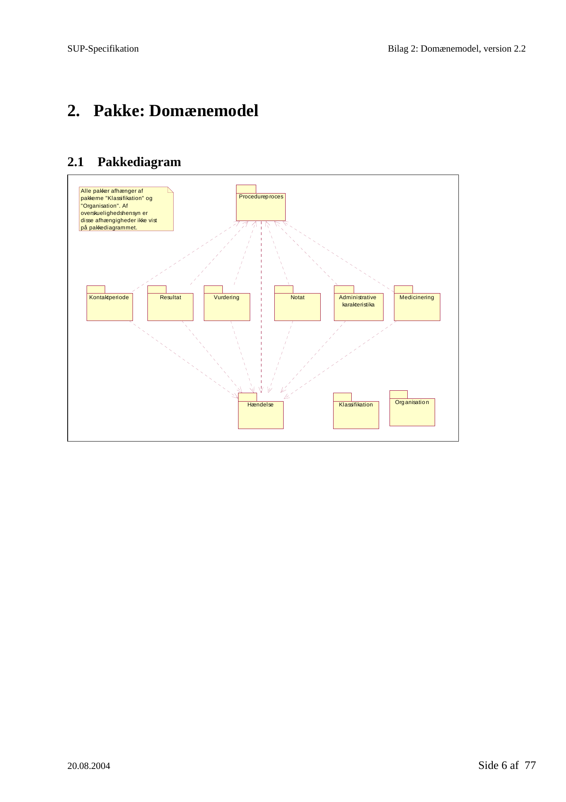

**Mermaid-rekonstruktion:** `bilag_02_v2_2_domaenemodel_assets/bilag_02_v2_2_domaenemodel_pakkediagram.mmd`

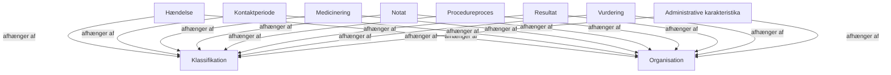
```mermaid
flowchart TB
    H["Hændelse"]
    K["Klassifikation"]
    O["Organisation"]
    KP["Kontaktperiode"]
    M["Medicinering"]
    N["Notat"]
    P["Procedureproces"]
    R["Resultat"]
    V["Vurdering"]
    A["Administrative karakteristika"]
    H -->|"afhænger af"| K
    KP -->|"afhænger af"| K
    M -->|"afhænger af"| K
    N -->|"afhænger af"| K
    P -->|"afhænger af"| K
    R -->|"afhænger af"| K
    V -->|"afhænger af"| K
    A -->|"afhænger af"| K
    H -->|"afhænger af"| O
    KP -->|"afhænger af"| O
    M -->|"afhænger af"| O
    N -->|"afhænger af"| O
    P -->|"afhænger af"| O
    R -->|"afhænger af"| O
    V -->|"afhænger af"| O
    A -->|"afhænger af"| O
```

## Diagramrekonstruktion: Klassediagram - total

<!-- Billedbeskrivelse: Totaldiagrammet samler de centrale hændelsestyper og deres vigtigste relationer omkring Person, Patientforløb og Hændelse. Specialiseringsforhold til Hændelse er i originalen bevidst udeladt. -->

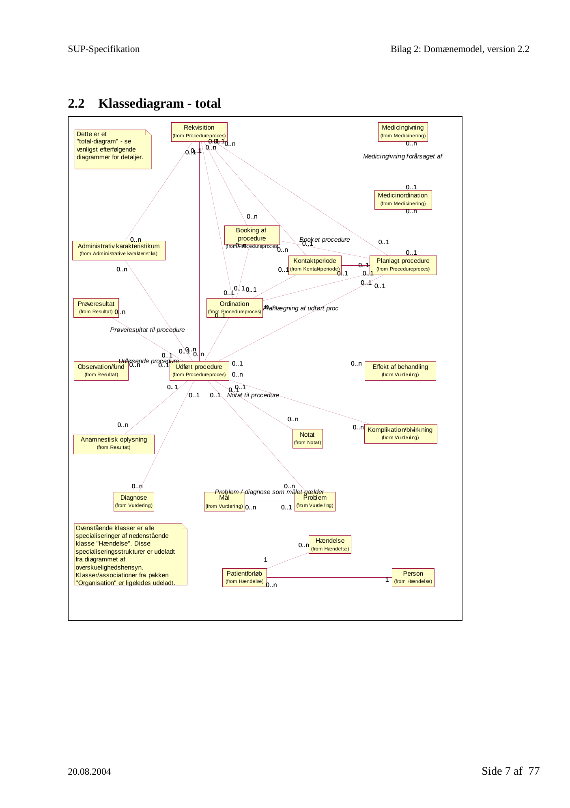

**Mermaid-rekonstruktion:** `bilag_02_v2_2_domaenemodel_assets/bilag_02_v2_2_domaenemodel_klassediagram_total.mmd`

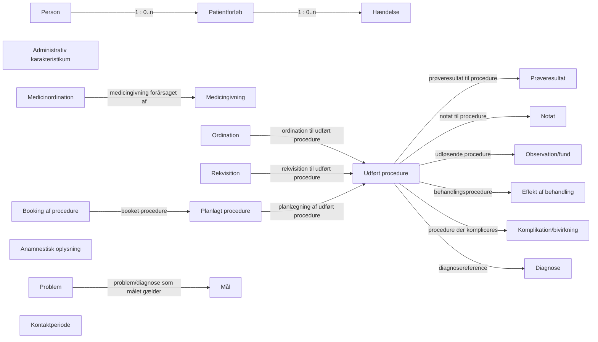
```mermaid
flowchart LR
    Per["Person"]
    PF["Patientforløb"]
    H["Hændelse"]
    Adm["Administrativ karakteristikum"]
    MedO["Medicinordination"]
    MedG["Medicingivning"]
    Not["Notat"]
    Book["Booking af procedure"]
    Ord["Ordination"]
    Plan["Planlagt procedure"]
    Rek["Rekvisition"]
    Udf["Udført procedure"]
    Ana["Anamnestisk oplysning"]
    Obs["Observation/fund"]
    Pro["Prøveresultat"]
    Diag["Diagnose"]
    Eff["Effekt af behandling"]
    Komp["Komplikation/bivirkning"]
    Prob["Problem"]
    Maal["Mål"]
    KP["Kontaktperiode"]
    Per -->|"1 : 0..n"| PF
    PF -->|"1 : 0..n"| H
    MedO -->|"medicingivning forårsaget af"| MedG
    Udf -->|"prøveresultat til procedure"| Pro
    Udf -->|"notat til procedure"| Not
    Udf -->|"udløsende procedure"| Obs
    Udf -->|"behandlingsprocedure"| Eff
    Udf -->|"procedure der kompliceres"| Komp
    Udf -->|"diagnosereference"| Diag
    Prob -->|"problem/diagnose som målet gælder"| Maal
    Ord -->|"ordination til udført procedure"| Udf
    Rek -->|"rekvisition til udført procedure"| Udf
    Plan -->|"planlægning af udført procedure"| Udf
    Book -->|"booket procedure"| Plan
```

## Diagramrekonstruktion: Klassediagram hændelse

<!-- Billedbeskrivelse: Diagrammet viser kæden Person -> Patientforløb -> Hændelse samt relationer til registrerende og oprindeligt forløbsansvarlig organisatorisk enhed. -->

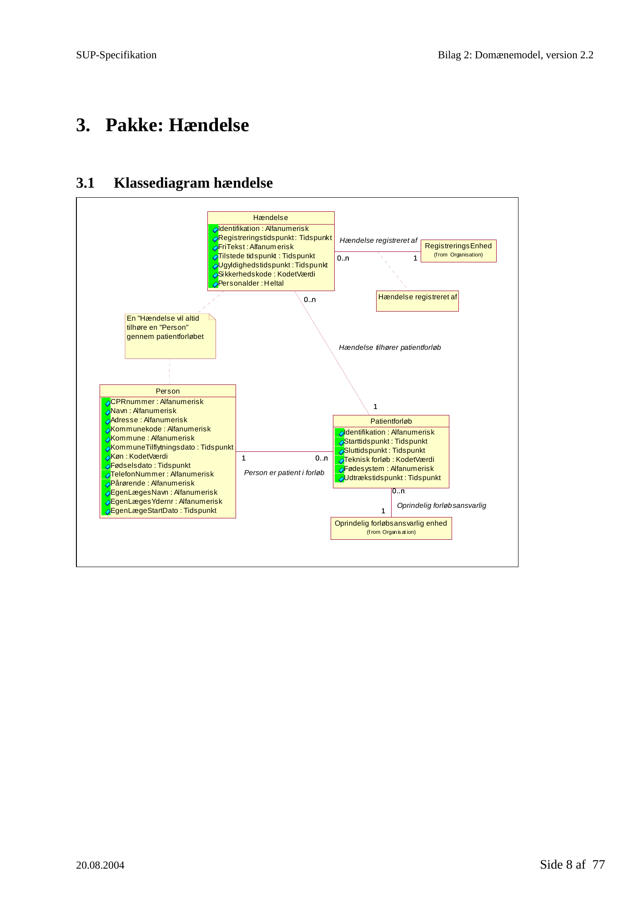

**Mermaid-rekonstruktion:** `bilag_02_v2_2_domaenemodel_assets/bilag_02_v2_2_domaenemodel_haendelse.mmd`

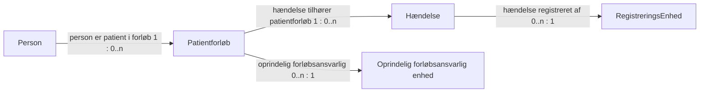
```mermaid
flowchart LR
    Per["Person"]
    PF["Patientforløb"]
    H["Hændelse"]
    RE["RegistreringsEnhed"]
    OE["Oprindelig forløbsansvarlig enhed"]
    Per -->|"person er patient i forløb 1 : 0..n"| PF
    PF -->|"hændelse tilhører patientforløb 1 : 0..n"| H
    H -->|"hændelse registreret af 0..n : 1"| RE
    PF -->|"oprindelig forløbsansvarlig 0..n : 1"| OE
```

## Diagramrekonstruktion: Klassediagram hændelsestyper

<!-- Billedbeskrivelse: Alle 18 hændelsestyper er specialiseringer af den fælles klasse Hændelse. -->

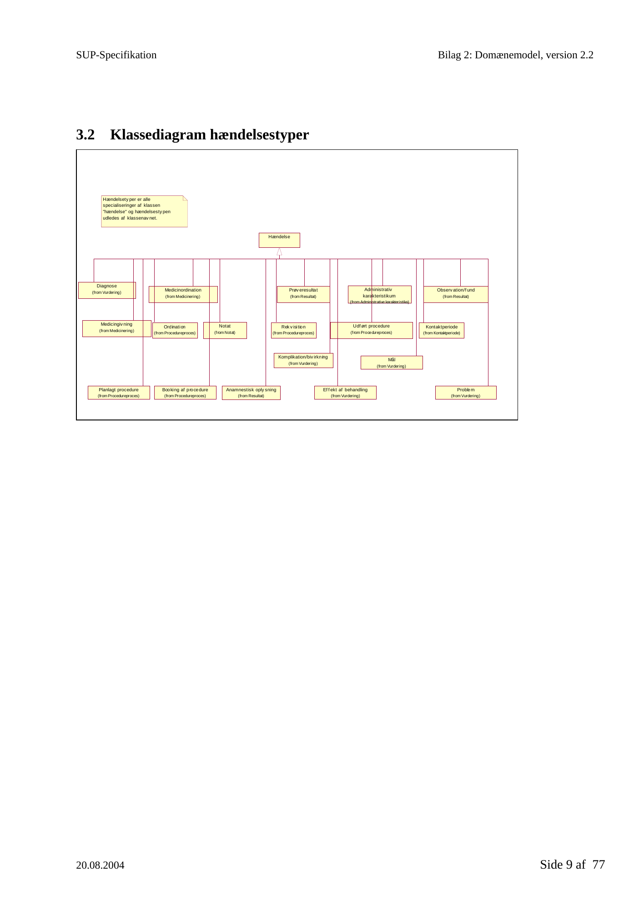

**Mermaid-rekonstruktion:** `bilag_02_v2_2_domaenemodel_assets/bilag_02_v2_2_domaenemodel_haendelsestyper.mmd`

```mermaid
flowchart TB
    H["Hændelse"]
    E0["Medicinordination"]
    E1["Medicingivning"]
    E2["Notat"]
    E3["Prøveresultat"]
    E4["Observation/fund"]
    E5["Diagnose"]
    E6["Administrativ karakteristikum"]
    E7["Rekvisition"]
    E8["Kontaktperiode"]
    E9["Udført procedure"]
    E10["Ordination"]
    E11["Planlagt procedure"]
    E12["Booking af procedure"]
    E13["Anamnestisk oplysning"]
    E14["Effekt af behandling"]
    E15["Komplikation/bivirkning"]
    E16["Problem"]
    E17["Mål"]
    H -->|"specialisering"| E0
    H -->|"specialisering"| E1
    H -->|"specialisering"| E2
    H -->|"specialisering"| E3
    H -->|"specialisering"| E4
    H -->|"specialisering"| E5
    H -->|"specialisering"| E6
    H -->|"specialisering"| E7
    H -->|"specialisering"| E8
    H -->|"specialisering"| E9
    H -->|"specialisering"| E10
    H -->|"specialisering"| E11
    H -->|"specialisering"| E12
    H -->|"specialisering"| E13
    H -->|"specialisering"| E14
    H -->|"specialisering"| E15
    H -->|"specialisering"| E16
    H -->|"specialisering"| E17
```

## Diagramrekonstruktion: Klassediagram Personoplysninger

<!-- Billedbeskrivelse: Person er knyttet til nul eller flere CAVE-oplysninger; CAVE-oplysninger kan knyttes til en organisatorisk enhed. -->

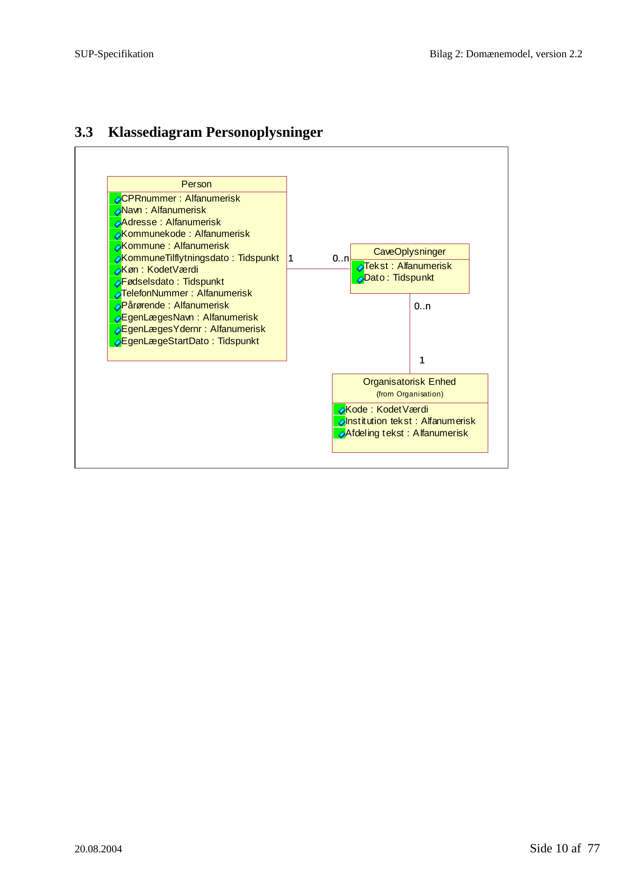

**Mermaid-rekonstruktion:** `bilag_02_v2_2_domaenemodel_assets/bilag_02_v2_2_domaenemodel_personoplysninger.mmd`

```mermaid
flowchart LR
    P["Person"]
    C["CaveOplysninger"]
    O["Organisatorisk Enhed"]
    P -->|"1 : 0..n"| C
    C -->|"0..n : 1"| O
```

## Diagramrekonstruktion: Klassediagram klassifikation

<!-- Billedbeskrivelse: Klassifikation indeholder kodede værdier. PrimærKode og Tillægskode specialiserer KodetVærdi og indgår i en Sammensat kodetVærdi. -->

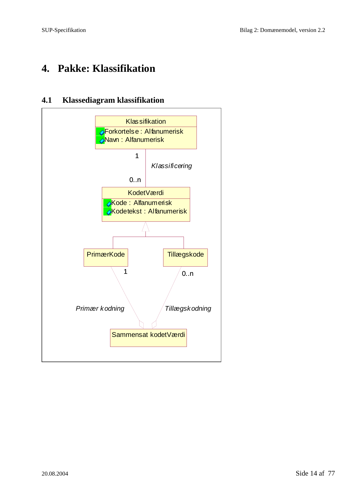

**Mermaid-rekonstruktion:** `bilag_02_v2_2_domaenemodel_assets/bilag_02_v2_2_domaenemodel_klassifikation.mmd`

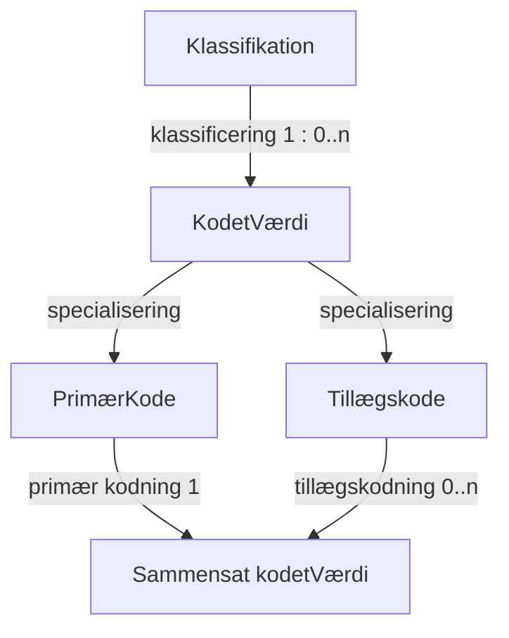
```mermaid
flowchart TB
    K["Klassifikation"]
    KV["KodetVærdi"]
    PK["PrimærKode"]
    TK["Tillægskode"]
    SKV["Sammensat kodetVærdi"]
    K -->|"klassificering 1 : 0..n"| KV
    KV -->|"specialisering"| PK
    KV -->|"specialisering"| TK
    PK -->|"primær kodning 1"| SKV
    TK -->|"tillægskodning 0..n"| SKV
```

## Diagramrekonstruktion: Klassediagram organisation

<!-- Billedbeskrivelse: Organisatorisk Enhed specialiseres i en række semantiske roller, bl.a. registrerende, ordinerende, producerende, rekvirerende og afsluttende enhed. AnsvarligPerson bruges til behandlerattributter på relationerne. -->

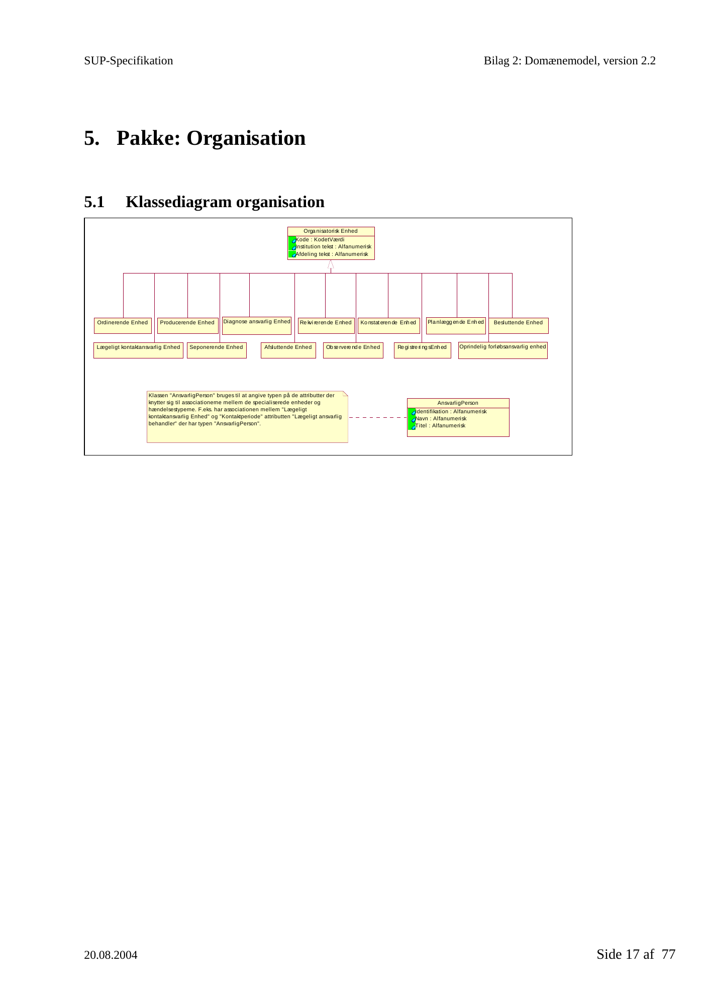

**Mermaid-rekonstruktion:** `bilag_02_v2_2_domaenemodel_assets/bilag_02_v2_2_domaenemodel_organisation.mmd`

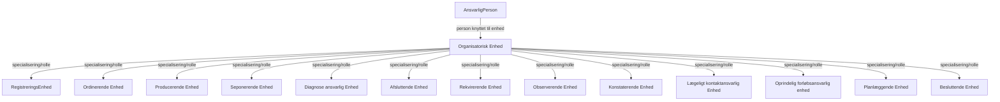
```mermaid
flowchart TB
    O["Organisatorisk Enhed"]
    AP["AnsvarligPerson"]
    R0["RegistreringsEnhed"]
    R1["Ordinerende Enhed"]
    R2["Producerende Enhed"]
    R3["Seponerende Enhed"]
    R4["Diagnose ansvarlig Enhed"]
    R5["Afsluttende Enhed"]
    R6["Rekvirerende Enhed"]
    R7["Observerende Enhed"]
    R8["Konstaterende Enhed"]
    R9["Lægeligt kontaktansvarlig Enhed"]
    R10["Oprindelig forløbsansvarlig enhed"]
    R11["Planlæggende Enhed"]
    R12["Besluttende Enhed"]
    O -->|"specialisering/rolle"| R0
    O -->|"specialisering/rolle"| R1
    O -->|"specialisering/rolle"| R2
    O -->|"specialisering/rolle"| R3
    O -->|"specialisering/rolle"| R4
    O -->|"specialisering/rolle"| R5
    O -->|"specialisering/rolle"| R6
    O -->|"specialisering/rolle"| R7
    O -->|"specialisering/rolle"| R8
    O -->|"specialisering/rolle"| R9
    O -->|"specialisering/rolle"| R10
    O -->|"specialisering/rolle"| R11
    O -->|"specialisering/rolle"| R12
    AP -->|"person knyttet til enhed"| O
```

## Diagramrekonstruktion: Klassediagram administrativ karakteristikum

<!-- Billedbeskrivelse: Administrativt karakteristikum kan være relateret til en rekvisition eller udført procedure og har relationer til konstaterende og afsluttende enhed. -->

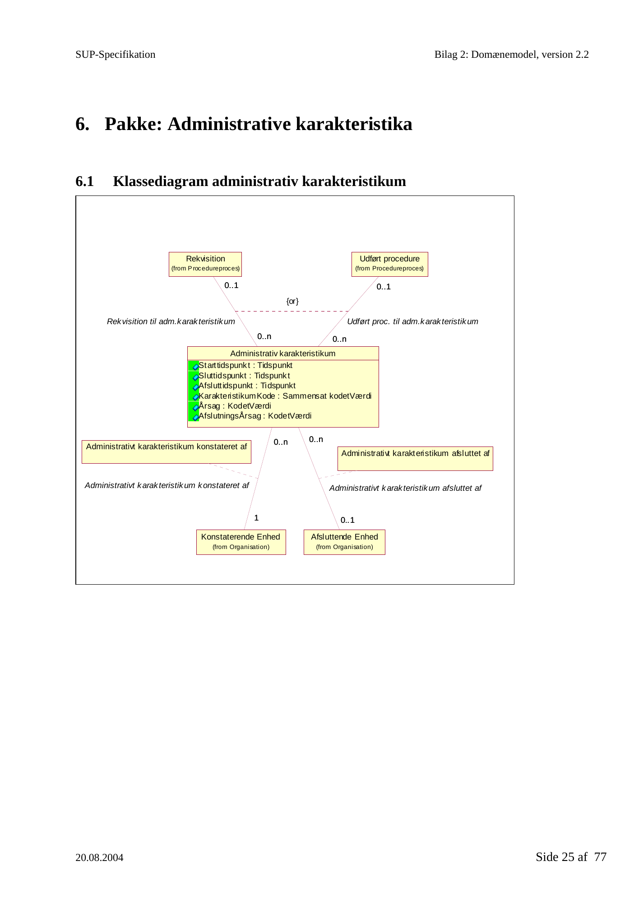

**Mermaid-rekonstruktion:** `bilag_02_v2_2_domaenemodel_assets/bilag_02_v2_2_domaenemodel_administrativ_karakteristikum.mmd`

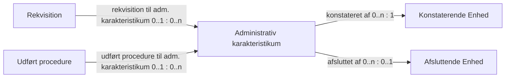
```mermaid
flowchart LR
    A["Administrativ karakteristikum"]
    R["Rekvisition"]
    U["Udført procedure"]
    K["Konstaterende Enhed"]
    F["Afsluttende Enhed"]
    R -->|"rekvisition til adm. karakteristikum 0..1 : 0..n"| A
    U -->|"udført procedure til adm. karakteristikum 0..1 : 0..n"| A
    A -->|"konstateret af 0..n : 1"| K
    A -->|"afsluttet af 0..n : 0..1"| F
```

## Diagramrekonstruktion: Klassediagram kontaktperiode

<!-- Billedbeskrivelse: Kontaktperiode kan have kontakt-/henvisnings-/planlægningsgrundlag fra procedureprocessen; højst én af de alternative associationer gælder. -->

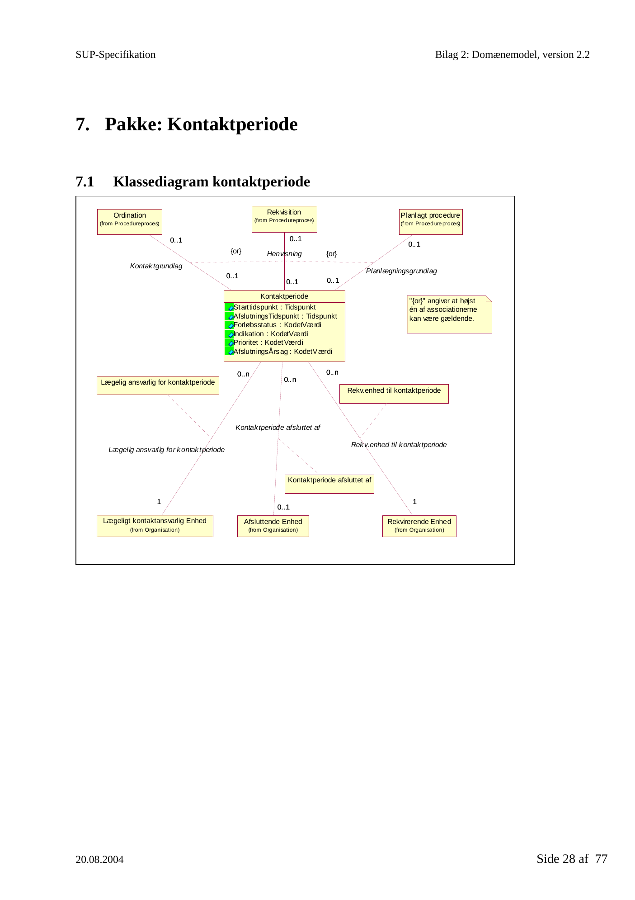

**Mermaid-rekonstruktion:** `bilag_02_v2_2_domaenemodel_assets/bilag_02_v2_2_domaenemodel_kontaktperiode.mmd`

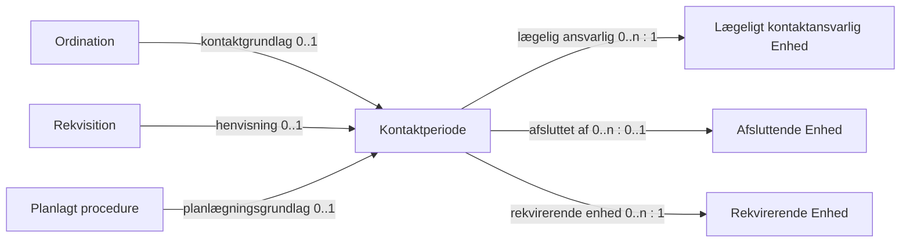
```mermaid
flowchart LR
    K["Kontaktperiode"]
    O["Ordination"]
    R["Rekvisition"]
    P["Planlagt procedure"]
    L["Lægeligt kontaktansvarlig Enhed"]
    A["Afsluttende Enhed"]
    RE["Rekvirerende Enhed"]
    O -->|"kontaktgrundlag 0..1"| K
    R -->|"henvisning 0..1"| K
    P -->|"planlægningsgrundlag 0..1"| K
    K -->|"lægelig ansvarlig 0..n : 1"| L
    K -->|"afsluttet af 0..n : 0..1"| A
    K -->|"rekvirerende enhed 0..n : 1"| RE
```

## Diagramrekonstruktion: Klassediagram medicinordination / medicingivning

<!-- Billedbeskrivelse: Medicinordination kan udløse medicingivninger. Begge typer knyttes til ordinerende/producerende enheder og kan afsluttes/seponeres. -->

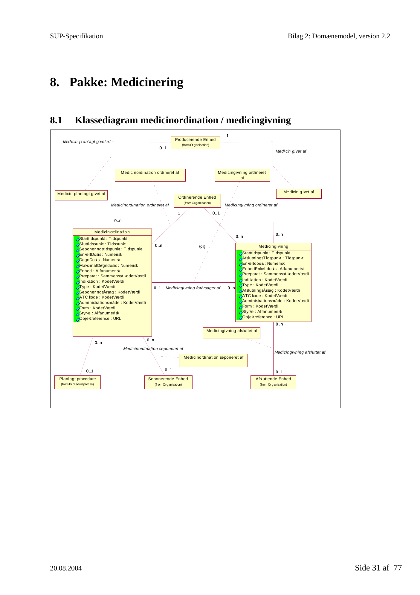

**Mermaid-rekonstruktion:** `bilag_02_v2_2_domaenemodel_assets/bilag_02_v2_2_domaenemodel_medicinering.mmd`

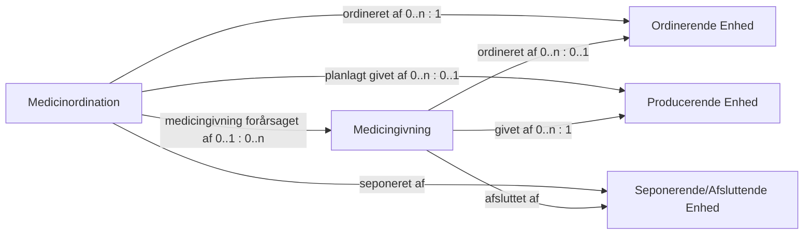
```mermaid
flowchart LR
    MO["Medicinordination"]
    MG["Medicingivning"]
    OE["Ordinerende Enhed"]
    PE["Producerende Enhed"]
    SE["Seponerende/Afsluttende Enhed"]
    MO -->|"medicingivning forårsaget af 0..1 : 0..n"| MG
    MO -->|"ordineret af 0..n : 1"| OE
    MO -->|"planlagt givet af 0..n : 0..1"| PE
    MG -->|"ordineret af 0..n : 0..1"| OE
    MG -->|"givet af 0..n : 1"| PE
    MO -->|"seponeret af"| SE
    MG -->|"afsluttet af"| SE
```

## Diagramrekonstruktion: Klassediagram notat

<!-- Billedbeskrivelse: Notat kan være rekvireret af en enhed, produceret af en enhed og relateret til en udført procedure. -->

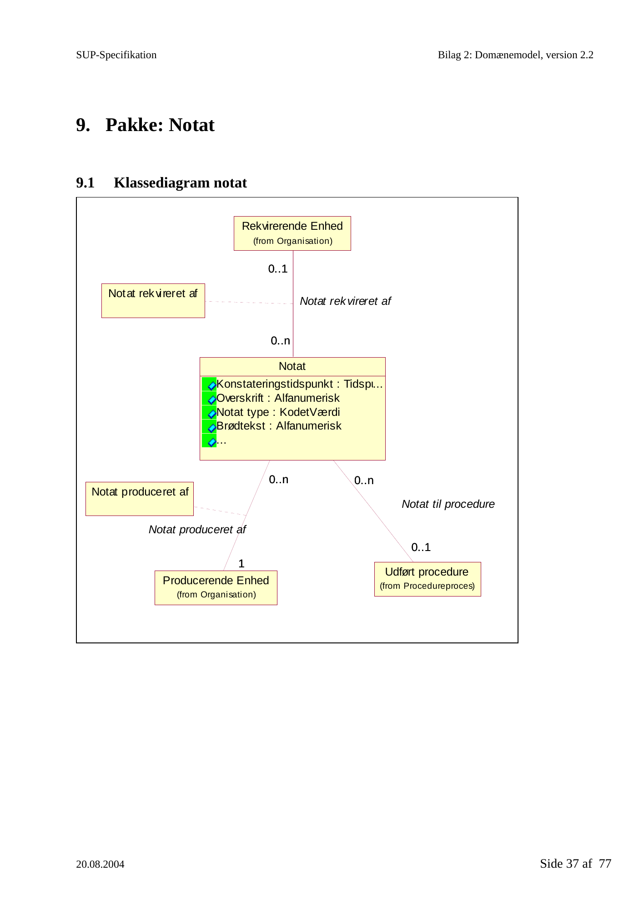

**Mermaid-rekonstruktion:** `bilag_02_v2_2_domaenemodel_assets/bilag_02_v2_2_domaenemodel_notat.mmd`

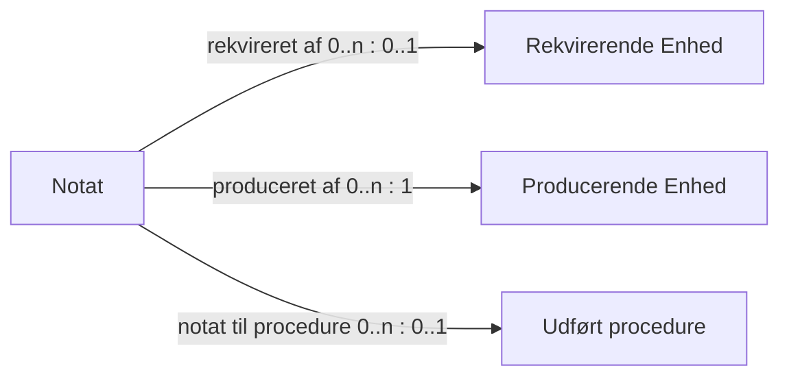
```mermaid
flowchart LR
    N["Notat"]
    R["Rekvirerende Enhed"]
    P["Producerende Enhed"]
    U["Udført procedure"]
    N -->|"rekvireret af 0..n : 0..1"| R
    N -->|"produceret af 0..n : 1"| P
    N -->|"notat til procedure 0..n : 0..1"| U
```

## Diagramrekonstruktion: Klassediagram procedureproces

<!-- Billedbeskrivelse: Procedureprocessen forbinder planlægning, ordination, rekvisition, booking og udførelse. Relationerne er valgfrie og afspejler mulige forløb gennem processen. -->

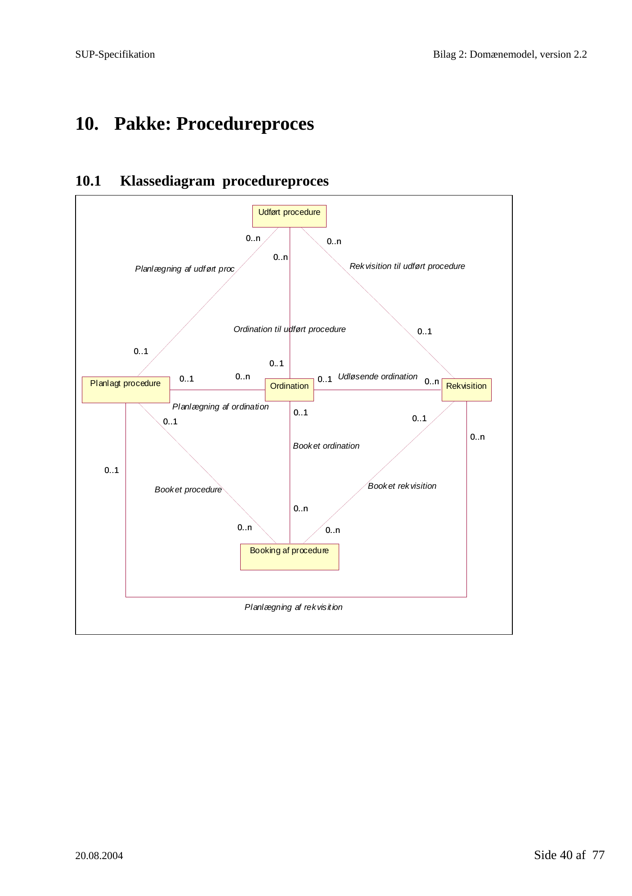

**Mermaid-rekonstruktion:** `bilag_02_v2_2_domaenemodel_assets/bilag_02_v2_2_domaenemodel_procedureproces.mmd`

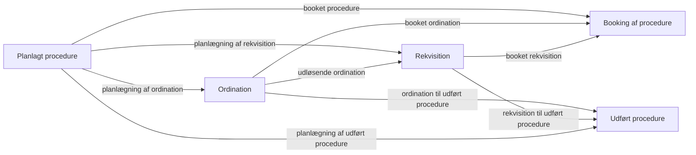
```mermaid
flowchart LR
    Plan["Planlagt procedure"]
    Ord["Ordination"]
    Rek["Rekvisition"]
    Book["Booking af procedure"]
    Udf["Udført procedure"]
    Plan -->|"planlægning af ordination"| Ord
    Plan -->|"planlægning af rekvisition"| Rek
    Plan -->|"booket procedure"| Book
    Ord -->|"booket ordination"| Book
    Rek -->|"booket rekvisition"| Book
    Ord -->|"udløsende ordination"| Rek
    Ord -->|"ordination til udført procedure"| Udf
    Rek -->|"rekvisition til udført procedure"| Udf
    Plan -->|"planlægning af udført procedure"| Udf
```

## Diagramrekonstruktion: Klassediagram Booking af procedure

<!-- Billedbeskrivelse: Booking kan være udløst af ordination, rekvisition eller planlagt procedure og er knyttet til rekvirerende, producerende og evt. afsluttende enhed. -->

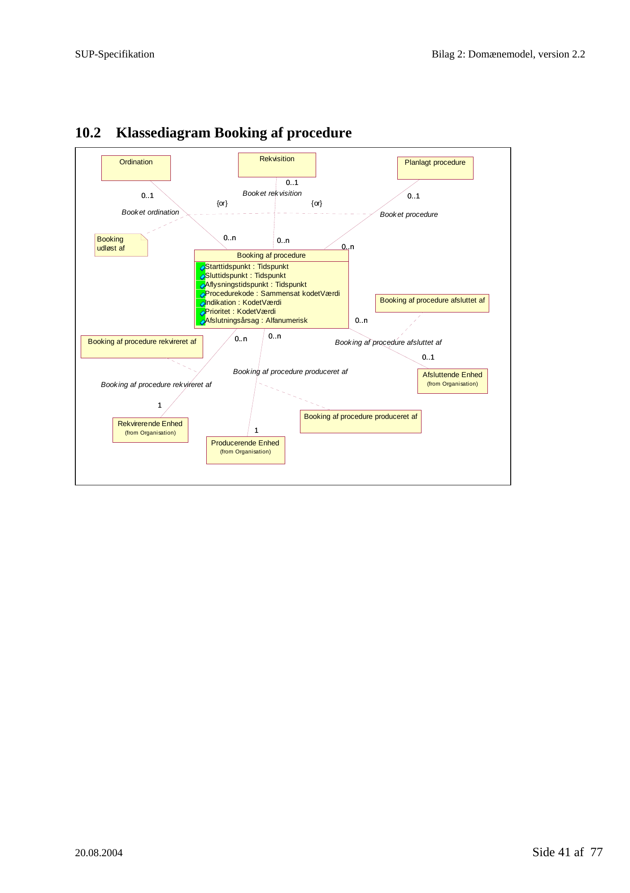

**Mermaid-rekonstruktion:** `bilag_02_v2_2_domaenemodel_assets/bilag_02_v2_2_domaenemodel_booking_af_procedure.mmd`

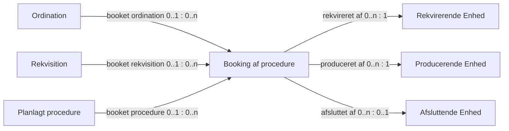
```mermaid
flowchart LR
    B["Booking af procedure"]
    O["Ordination"]
    R["Rekvisition"]
    P["Planlagt procedure"]
    RE["Rekvirerende Enhed"]
    PE["Producerende Enhed"]
    AE["Afsluttende Enhed"]
    O -->|"booket ordination 0..1 : 0..n"| B
    R -->|"booket rekvisition 0..1 : 0..n"| B
    P -->|"booket procedure 0..1 : 0..n"| B
    B -->|"rekvireret af 0..n : 1"| RE
    B -->|"produceret af 0..n : 1"| PE
    B -->|"afsluttet af 0..n : 0..1"| AE
```

## Diagramrekonstruktion: Klassediagram Ordination

<!-- Billedbeskrivelse: Ordination kan være planlagt/booket, udløse rekvisition og knyttes til udført procedure. Den har ordinerende, planlagt producerende og evt. seponerende enhed. -->

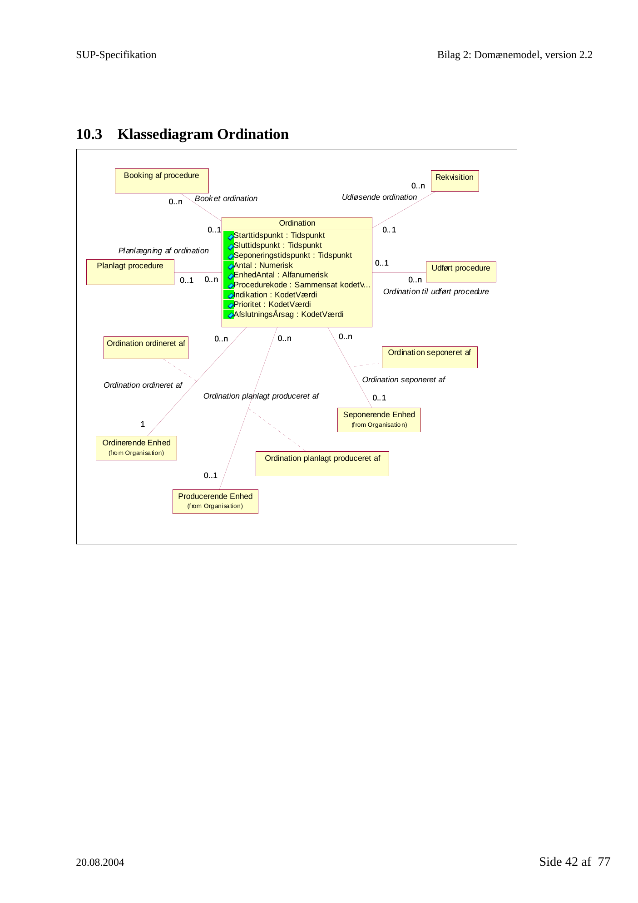

**Mermaid-rekonstruktion:** `bilag_02_v2_2_domaenemodel_assets/bilag_02_v2_2_domaenemodel_ordination.mmd`

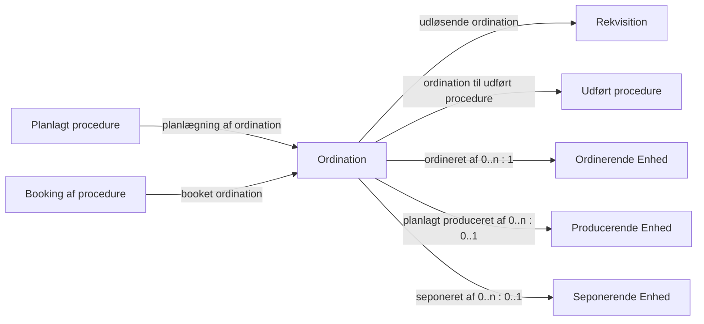
```mermaid
flowchart LR
    O["Ordination"]
    B["Booking af procedure"]
    P["Planlagt procedure"]
    R["Rekvisition"]
    U["Udført procedure"]
    OE["Ordinerende Enhed"]
    PE["Producerende Enhed"]
    SE["Seponerende Enhed"]
    P -->|"planlægning af ordination"| O
    B -->|"booket ordination"| O
    O -->|"udløsende ordination"| R
    O -->|"ordination til udført procedure"| U
    O -->|"ordineret af 0..n : 1"| OE
    O -->|"planlagt produceret af 0..n : 0..1"| PE
    O -->|"seponeret af 0..n : 0..1"| SE
```

## Diagramrekonstruktion: Klassediagram Planlagt procedure

<!-- Billedbeskrivelse: Planlagt procedure kan relateres til booking, senere ordination/rekvisition og udført procedure samt planlæggende og afsluttende enhed. -->

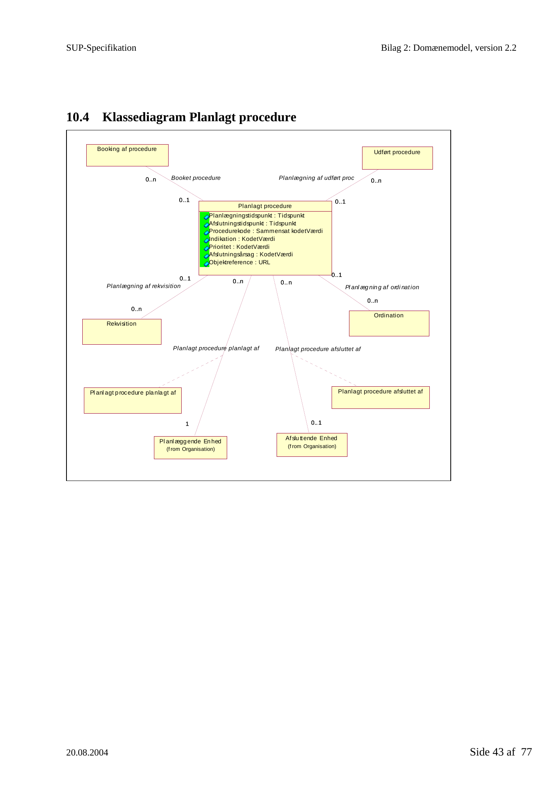

**Mermaid-rekonstruktion:** `bilag_02_v2_2_domaenemodel_assets/bilag_02_v2_2_domaenemodel_planlagt_procedure.mmd`

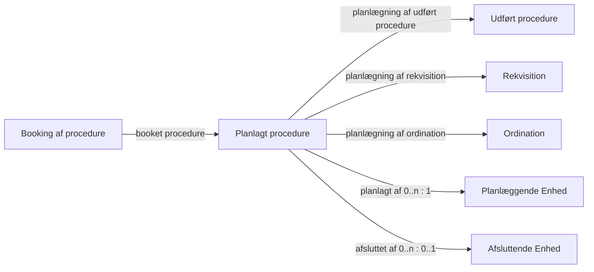
```mermaid
flowchart LR
    P["Planlagt procedure"]
    B["Booking af procedure"]
    U["Udført procedure"]
    R["Rekvisition"]
    O["Ordination"]
    PE["Planlæggende Enhed"]
    AE["Afsluttende Enhed"]
    B -->|"booket procedure"| P
    P -->|"planlægning af udført procedure"| U
    P -->|"planlægning af rekvisition"| R
    P -->|"planlægning af ordination"| O
    P -->|"planlagt af 0..n : 1"| PE
    P -->|"afsluttet af 0..n : 0..1"| AE
```

## Diagramrekonstruktion: Klassediagram Rekvisition

<!-- Billedbeskrivelse: Rekvisition kan følge en planlagt procedure eller ordination, bookes og føre til udført procedure; organisatoriske relationer angiver rekvirent, producent og afslutning. -->

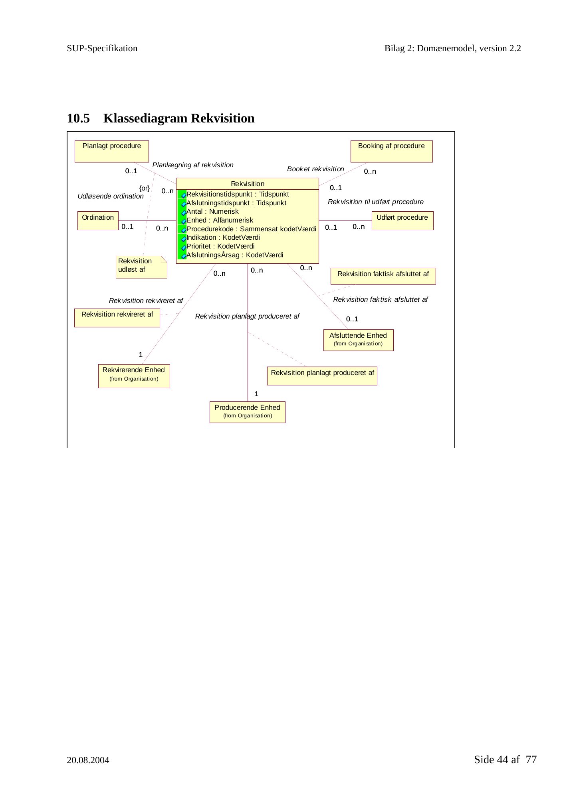

**Mermaid-rekonstruktion:** `bilag_02_v2_2_domaenemodel_assets/bilag_02_v2_2_domaenemodel_rekvisition.mmd`

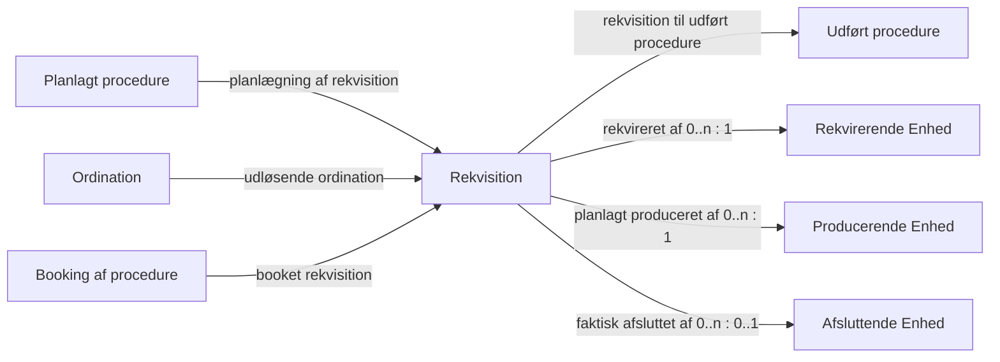
```mermaid
flowchart LR
    R["Rekvisition"]
    P["Planlagt procedure"]
    O["Ordination"]
    B["Booking af procedure"]
    U["Udført procedure"]
    RE["Rekvirerende Enhed"]
    PE["Producerende Enhed"]
    AE["Afsluttende Enhed"]
    P -->|"planlægning af rekvisition"| R
    O -->|"udløsende ordination"| R
    B -->|"booket rekvisition"| R
    R -->|"rekvisition til udført procedure"| U
    R -->|"rekvireret af 0..n : 1"| RE
    R -->|"planlagt produceret af 0..n : 1"| PE
    R -->|"faktisk afsluttet af 0..n : 0..1"| AE
```

## Diagramrekonstruktion: Klassediagram Udført procedure

<!-- Billedbeskrivelse: Udført procedure kan være knyttet til ordination, rekvisition eller planlagt procedure og til rekvirerende, producerende og afsluttende enheder. -->

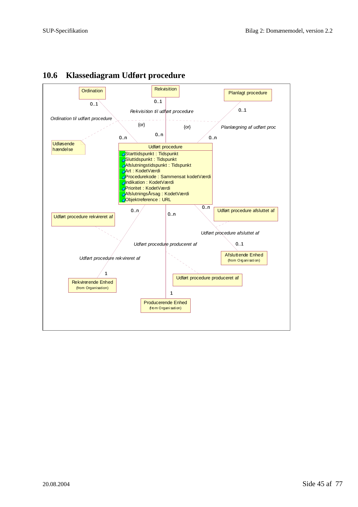

**Mermaid-rekonstruktion:** `bilag_02_v2_2_domaenemodel_assets/bilag_02_v2_2_domaenemodel_udfoert_procedure.mmd`

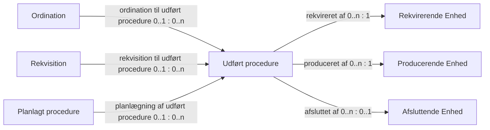
```mermaid
flowchart LR
    U["Udført procedure"]
    O["Ordination"]
    R["Rekvisition"]
    P["Planlagt procedure"]
    RE["Rekvirerende Enhed"]
    PE["Producerende Enhed"]
    AE["Afsluttende Enhed"]
    O -->|"ordination til udført procedure 0..1 : 0..n"| U
    R -->|"rekvisition til udført procedure 0..1 : 0..n"| U
    P -->|"planlægning af udført procedure 0..1 : 0..n"| U
    U -->|"rekvireret af 0..n : 1"| RE
    U -->|"produceret af 0..n : 1"| PE
    U -->|"afsluttet af 0..n : 0..1"| AE
```

## Diagramrekonstruktion: Klassediagram resultat

<!-- Billedbeskrivelse: Resultatpakken viser tre resultattyper, der valgfrit kan relateres til en udført procedure. -->

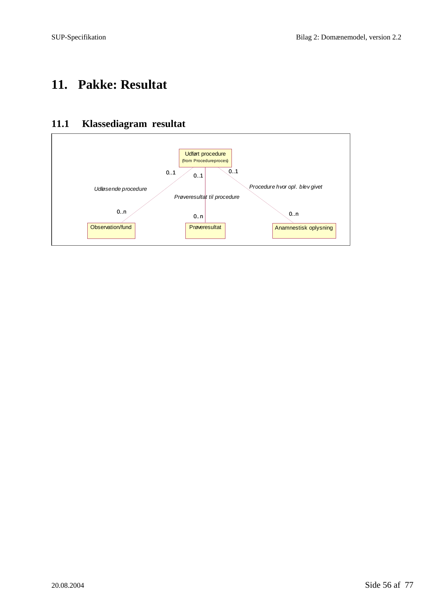

**Mermaid-rekonstruktion:** `bilag_02_v2_2_domaenemodel_assets/bilag_02_v2_2_domaenemodel_resultat.mmd`

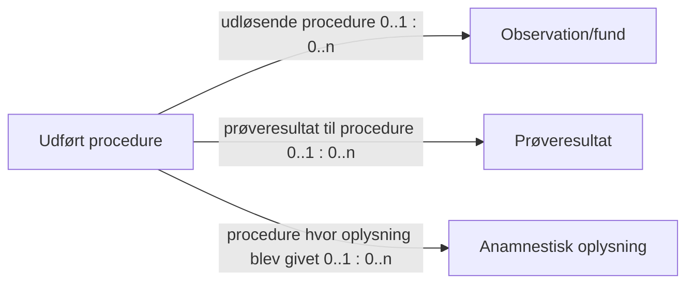
```mermaid
flowchart LR
    U["Udført procedure"]
    O["Observation/fund"]
    P["Prøveresultat"]
    A["Anamnestisk oplysning"]
    U -->|"udløsende procedure 0..1 : 0..n"| O
    U -->|"prøveresultat til procedure 0..1 : 0..n"| P
    U -->|"procedure hvor oplysning blev givet 0..1 : 0..n"| A
```

## Diagramrekonstruktion: Klassediagram Anamnestisk oplysning

<!-- Billedbeskrivelse: Anamnestisk oplysning kan knyttes til en udført procedure og en konstaterende enhed. -->

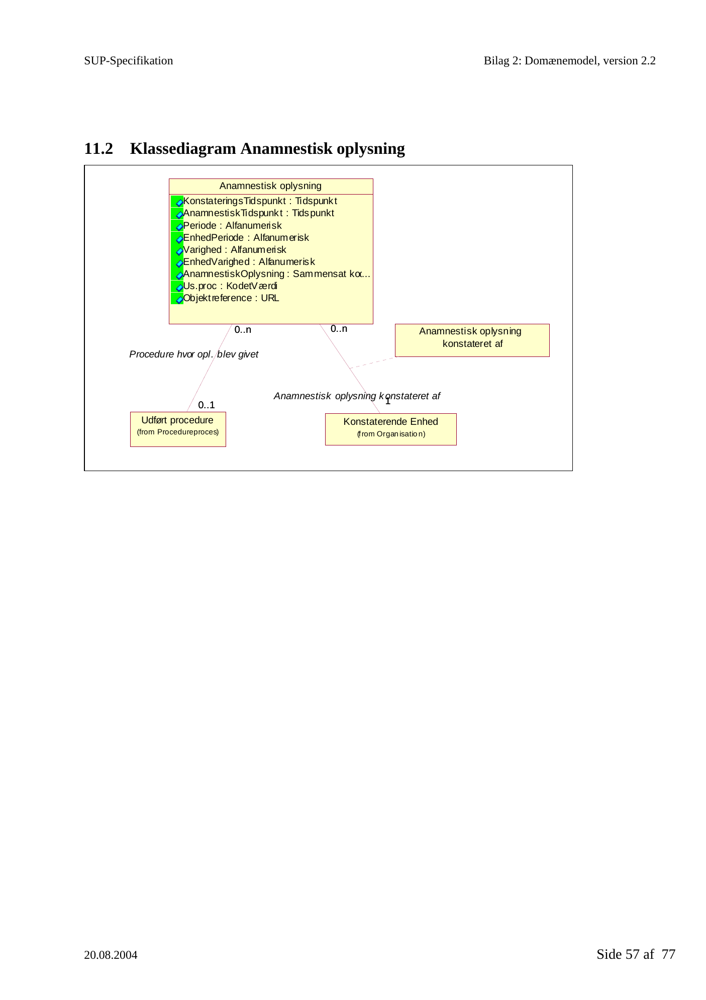

**Mermaid-rekonstruktion:** `bilag_02_v2_2_domaenemodel_assets/bilag_02_v2_2_domaenemodel_anamnestisk_oplysning.mmd`

```mermaid
flowchart LR
    A["Anamnestisk oplysning"]
    U["Udført procedure"]
    K["Konstaterende Enhed"]
    U -->|"procedure hvor oplysning blev givet 0..1 : 0..n"| A
    A -->|"konstateret af 0..n : 1"| K
```

## Diagramrekonstruktion: Klassediagram Observation/fund

<!-- Billedbeskrivelse: Observation/fund kan være udløst af en udført procedure og knyttes til observerende enhed. -->

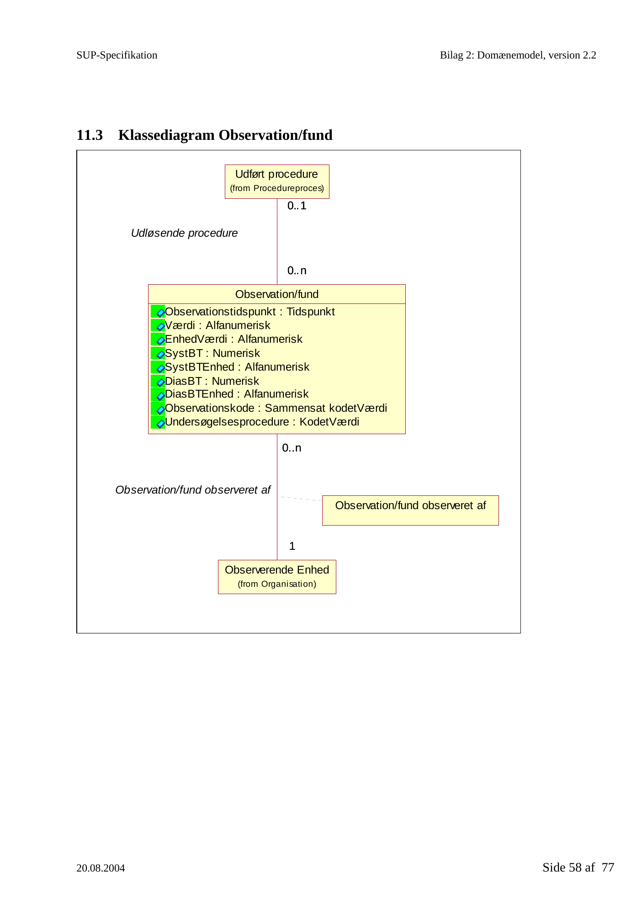

**Mermaid-rekonstruktion:** `bilag_02_v2_2_domaenemodel_assets/bilag_02_v2_2_domaenemodel_observation_fund.mmd`

```mermaid
flowchart LR
    O["Observation/fund"]
    U["Udført procedure"]
    E["Observerende Enhed"]
    U -->|"udløsende procedure 0..1 : 0..n"| O
    O -->|"observeret af 0..n : 1"| E
```

## Diagramrekonstruktion: Klassediagram Prøveresultat

<!-- Billedbeskrivelse: Prøveresultat kan relateres til den udførte procedure og har relationer til rekvirerende og producerende enheder. -->

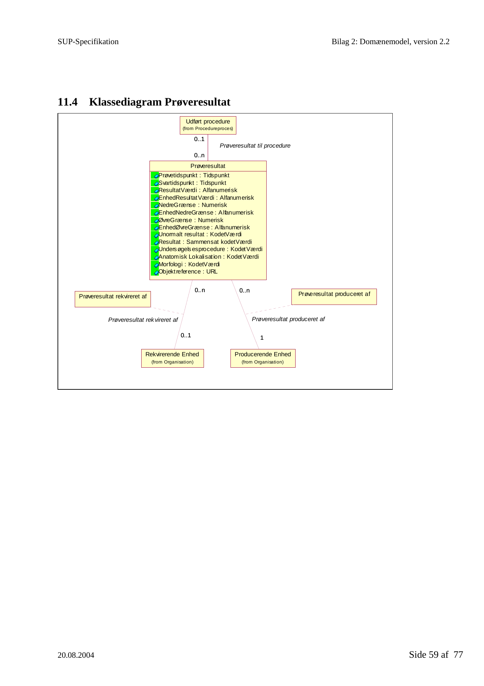

**Mermaid-rekonstruktion:** `bilag_02_v2_2_domaenemodel_assets/bilag_02_v2_2_domaenemodel_proeveresultat.mmd`

```mermaid
flowchart LR
    P["Prøveresultat"]
    U["Udført procedure"]
    R["Rekvirerende Enhed"]
    E["Producerende Enhed"]
    U -->|"prøveresultat til procedure 0..1 : 0..n"| P
    P -->|"rekvireret af 0..n : 0..1"| R
    P -->|"produceret af 0..n : 1"| E
```

## Diagramrekonstruktion: Klassediagram vurdering

<!-- Billedbeskrivelse: Vurderingspakken forbinder problem, mål, diagnose, komplikation/bivirkning og effekt af behandling til udførte procedurer. -->

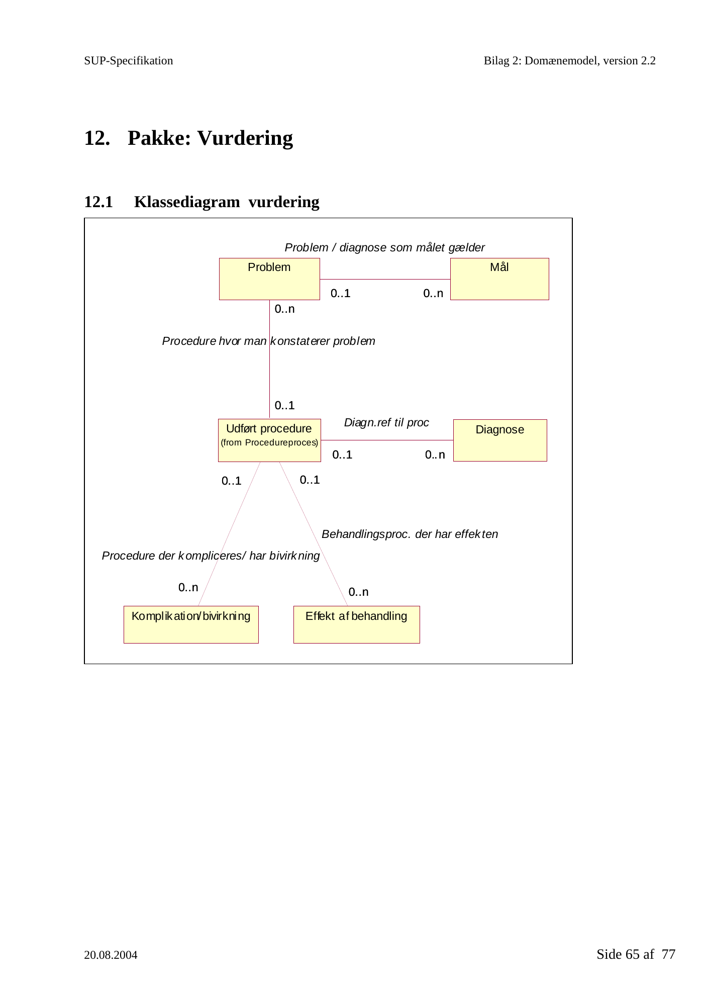

**Mermaid-rekonstruktion:** `bilag_02_v2_2_domaenemodel_assets/bilag_02_v2_2_domaenemodel_vurdering.mmd`

```mermaid
flowchart LR
    Prob["Problem"]
    M["Mål"]
    U["Udført procedure"]
    D["Diagnose"]
    K["Komplikation/bivirkning"]
    E["Effekt af behandling"]
    Prob -->|"problem/diagnose som målet gælder 0..1 : 0..n"| M
    U -->|"procedure hvor man konstaterer problem"| Prob
    U -->|"diagnosereference til procedure"| D
    U -->|"procedure der kompliceres/har bivirkning"| K
    U -->|"behandlingsprocedure der har effekten"| E
```

## Diagramrekonstruktion: Klassediagram Diagnose

<!-- Billedbeskrivelse: Diagnose kan referere til en udført procedure, har ansvarlig diagnosticerende enhed og kan afsluttes af en afsluttende enhed. -->

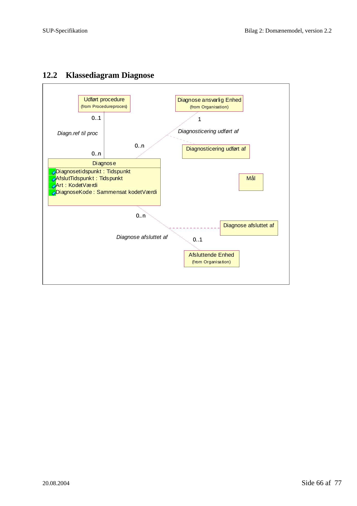

**Mermaid-rekonstruktion:** `bilag_02_v2_2_domaenemodel_assets/bilag_02_v2_2_domaenemodel_diagnose.mmd`

```mermaid
flowchart LR
    D["Diagnose"]
    U["Udført procedure"]
    E["Diagnose ansvarlig Enhed"]
    A["Afsluttende Enhed"]
    M["Mål"]
    U -->|"diagnosereference til procedure 0..1 : 0..n"| D
    D -->|"diagnosticering udført af 0..n : 1"| E
    D -->|"diagnose afsluttet af 0..n : 0..1"| A
    D -->|"kan være grundlag for mål"| M
```

## Diagramrekonstruktion: Klassediagram Effekt af behandling

<!-- Billedbeskrivelse: Effekt af behandling knyttes til behandlingsprocedure samt producerende og observerende enhed. -->

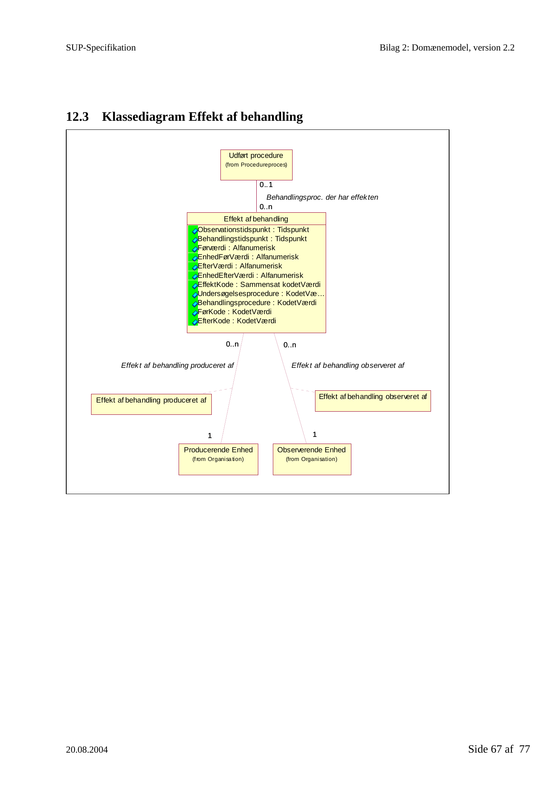

**Mermaid-rekonstruktion:** `bilag_02_v2_2_domaenemodel_assets/bilag_02_v2_2_domaenemodel_effekt_af_behandling.mmd`

```mermaid
flowchart LR
    E["Effekt af behandling"]
    U["Udført procedure"]
    P["Producerende Enhed"]
    O["Observerende Enhed"]
    U -->|"behandlingsprocedure der har effekten 0..1 : 0..n"| E
    E -->|"produceret af 0..n : 1"| P
    E -->|"observeret af 0..n : 1"| O
```

## Diagramrekonstruktion: Klassediagram Komplikation/bivirkning

<!-- Billedbeskrivelse: Komplikation/bivirkning relateres til den udførte procedure og til producerende og observerende enhed. -->

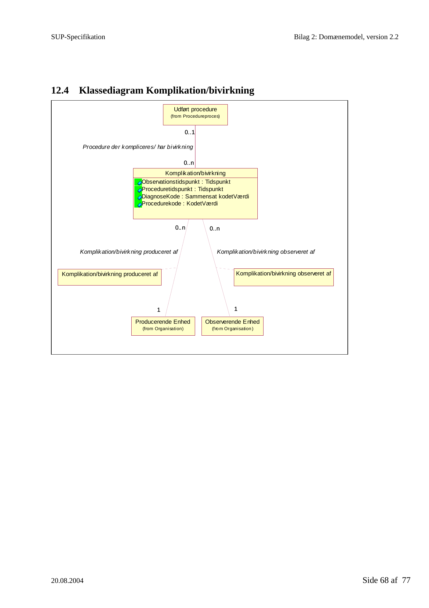

**Mermaid-rekonstruktion:** `bilag_02_v2_2_domaenemodel_assets/bilag_02_v2_2_domaenemodel_komplikation_bivirkning.mmd`

```mermaid
flowchart LR
    K["Komplikation/bivirkning"]
    U["Udført procedure"]
    P["Producerende Enhed"]
    O["Observerende Enhed"]
    U -->|"procedure der kompliceres/har bivirkning 0..1 : 0..n"| K
    K -->|"produceret af 0..n : 1"| P
    K -->|"observeret af 0..n : 1"| O
```

## Diagramrekonstruktion: Klassediagram Problem og Mål

<!-- Billedbeskrivelse: Problem og Mål viser mål knyttet til problem eller diagnose samt organisatoriske relationer for konstatering, beslutning og afslutning. -->

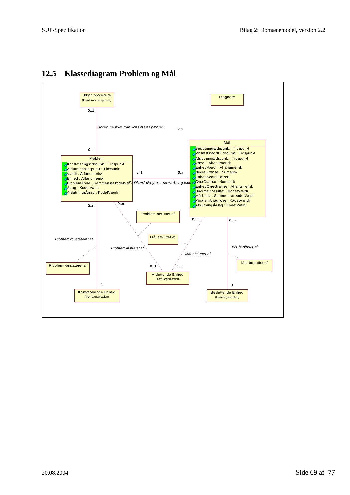

**Mermaid-rekonstruktion:** `bilag_02_v2_2_domaenemodel_assets/bilag_02_v2_2_domaenemodel_problem_maal.mmd`

```mermaid
flowchart LR
    P["Problem"]
    M["Mål"]
    U["Udført procedure"]
    D["Diagnose"]
    K["Konstaterende Enhed"]
    A["Afsluttende Enhed"]
    B["Besluttende Enhed"]
    U -->|"procedure hvor man konstaterer problem 0..1 : 0..n"| P
    P -->|"problem som målet gælder 0..1 : 0..n"| M
    D -->|"diagnose som målet gælder"| M
    P -->|"problem konstateret af 0..n : 1"| K
    P -->|"problem afsluttet af 0..n : 0..1"| A
    M -->|"mål afsluttet af 0..n : 0..1"| A
    M -->|"mål besluttet af 0..n : 1"| B
```
