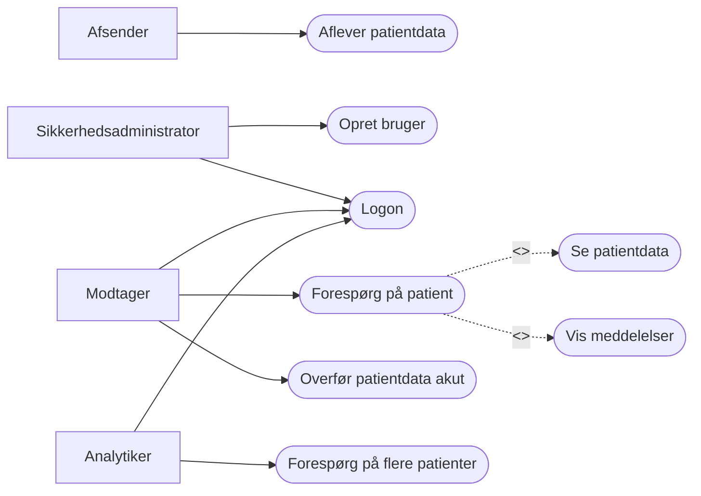
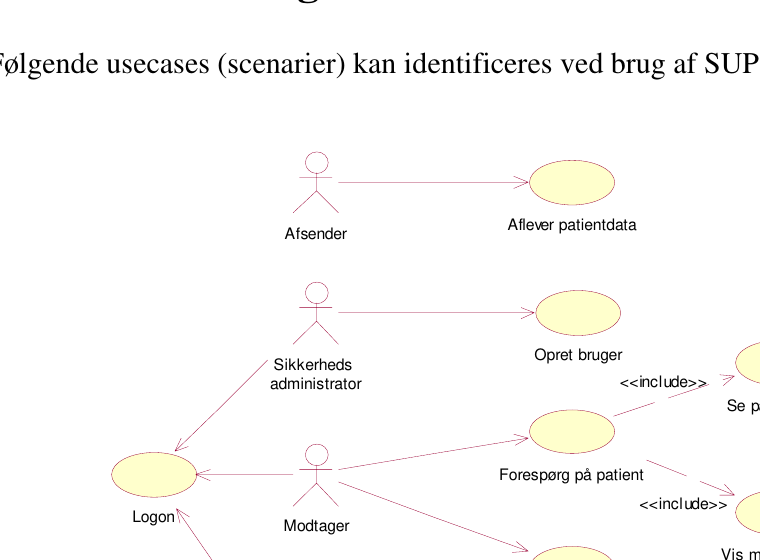

# SUP-specifikation, version 2.0 - Bilag 3: Usecases

> **Kildestatus:** Udkast af 12. juni 2003, udarbejdet for SUP-Styregruppen.  
> **Konverteringsnote:** Teksten er normaliseret til Markdown med henblik på maskinel/agentbaseret fortolkning. Sidehoved/-fod er fjernet, linjedelte ord er så vidt muligt samlet, og dokumentets overskriftsstruktur er bevaret. Originale faglige formuleringer er ikke moderniseret.

## Agentvejledning

- Brug de nummererede usecase-afsnit som primær semantisk struktur.
- Tekst i kantede parenteser, fx `[Ingen patientdata]`, betegner alternative forløb eller henvisninger til alternative forløb.
- `Include`-relationer er både beskrevet i teksten og genskabt i Mermaid-diagrammet nedenfor.
- Kommentarer af formen `<!-- Kildeside: N -->` kan bruges til at spore indhold tilbage til PDF-siden.
- Den originale figur er bevaret som billedressource; Mermaid-versionen er en semantisk rekonstruktion og ikke en pixelidentisk kopi.

## Centrale aktører

| Aktør | Rolle i SUP |
|---|---|
| Sikkerhedsadministrator | Opretter brugere i SUP-webapplikationen og tildeler adgang. |
| Modtager / bruger | Ser patientdata i SUP-databasen via SUP-webapplikationen. |
| Afsender | Fødesystem, fx EPJ eller PAS, som udtrækker og afleverer patientdata til SUP-databasen. |
| Analytiker | Anvender patientdata til statistisk analyse, anonymiseret eller ikke-anonymiseret afhængigt af rettigheder. |

## Usecase-diagram - semantisk Mermaid-rekonstruktion

<!-- Billedbeskrivelse: Diagrammet viser fire aktører. Afsender er forbundet med "Aflever patientdata". Sikkerhedsadministrator er forbundet med "Opret bruger" og "Logon". Modtager er forbundet med "Logon", "Forespørg på patient" og "Overfør patientdata akut". Analytiker er forbundet med "Logon" og "Forespørg på flere patienter". Usecasen "Forespørg på patient" inkluderer usecasene "Se patientdata" og "Vis meddelelser". -->

> **Billedbeskrivelse:** UML-usecase-diagram med aktørerne Afsender, Sikkerhedsadministrator, Modtager og Analytiker. Relationerne svarer til Mermaid-rekonstruktionen ovenfor. De to `<<include>>`-relationer går fra **Forespørg på patient** til henholdsvis **Se patientdata** og **Vis meddelelser**.

## Indholdsoversigt

1. Notation
2. Aktører
3. Usecase-diagram
4. Usecase Aflever patientdata
5. Usecase Opret bruger
6. Usecase Logon
7. Usecase Forespørg på patient
8. Usecase Se patientdata
9. Usecase Overfør patientdata akut
10. Usecase Vis meddelelser
11. Usecase Forespørg på flere patienter

---

# Transskriberet dokumentindhold

<!-- Kildeside: 4 -->
## 1 Notation

I usecase-diagrammerne er anvendt UML-notation1 til aktørerne, usecases og deres relationer.

I den tekstuelle beskrivelsen af usecasene er notationen "[xxx]" anvendt, når der henvises til et alternativt forløb i usecasen. Notationen "[Include xxx]" betyder, at usecasen "xxx" udføres fra det pågældende sted i usecasen.

## 2 Aktører

Sikkerhedsadministrator: En person (f.eks. en amtsansvarlig IT-koordinator), der kan oprette brugere i SUP-webapplikationen (også kaldet SUP-browser) og derved give dem mulighed for at se patientdata i SUP-databasen.

Modtager (også kaldet en bruger): En person (f.eks. en kliniker), der fra SUP-webapplikationen kan se patientdata i SUP-databasen.

Afsender: Et fødesystem, der indeholder patientdata (f.eks. EPJ eller PAS), og hvor data udtrækkes fra og afleveres til SUP-databasen.

Analytiker: En person, der anvender patientdata fra SUP-databasen til statistisk analyse. Data kan være anonymiseret eller ikke-anonymiseret afhængig af analytikerens adgangsrettigheder.

> Kilden henviser for UML-notation til OMG: `http://www.omg.org/cgi-bin/doc?formal/03-03-01`.

<!-- Kildeside: 5 -->
## 3 Usecase-diagram

Følgende usecases (scenarier) kan identificeres ved brug af SUP-løsningen:

administrator <<include>>

<!-- Kildeside: 6 -->
## 4 Usecase Aflever patientdata

### 4.1 Formål

Give et fødesystem (også kaldet afsendersystem) mulighed for at aflevere patientdata, der følger SUP-specifikationen, til SUP-databasen, således at brugere ved hjælp af en SUP-webapplikation kan se disse patientdata.

### 4.2 Frekvens

Patientdata, der er ændret i et fødesystem, skal minimum overføres én gang hver nat til SUP-databasen. Ved en akut forespørgsel skal patientdata overføres straks.

### 4.3 Startbetingelser

Data for den pågældende patient er udvalgt til overførelse til SUP-databasen.

Det skal afklares af den amtsansvarlige, hvilke patientdata der skal overføres til SUP-databasen. F.eks.: Hvilke sygehusafdelinger skal data overføres fra, og skal "gamle" patientdata overføres?

### 4.4 Hovedforløb

1. Afsender identificerer, hvorvidt der findes nye eller ændrede patientdata siden sidste aflevering til SUP-databasen [Ingen nye eller ændrede data siden sidst].
2. Afsender genererer udtræk, der følger SUP-specifikationen.
3. Afsender overfører udtræk til SUP-databasen [Overførslen går i fejl] .
### 4.5 Alternative forløb

**Alternativt forløb:** [Ingen nye eller ændrede data siden sidst]

Usecasen stopper.

**Alternativt forløb:** [Overførslen går i fejl]

Hvis der sker fejl i overførslen af data, registreres overførslen i loggen. Usecasen stopper.

<!-- Kildeside: 7 -->
### 4.6 Specielle krav

Den natlige overførelse skal være afsluttet, så den ikke er til gene for den daglige drift, f.eks. senest kl. 06.00 om morgenen.

### 4.7 Slutresultater

SUP-databasen er opdateret med nye og ændrede patientdata fra fødesystemet.

## 5 Usecase Opret bruger

### 5.1 Formål

Oprette en bruger i SUP-webapplikationen og give brugeren adgang til udvalgte aktiviteter.

Systemadministratoren skal sikre, at brugeren kun kan udføre de aktiviteter, der er relevante for vedkommendes arbejdsopgaver i henhold til registerforskriftens ord, og at brugeren kun kan arbejde med data, der er relevante for brugerens arbejdsområde.

Usecasen beskriver det tilfælde, hvor brugeren oprettes i SUP-løsningens eget sikkerhedssystem. Brugeren kan også oprettes i Sundhedsportalen (SP), hvorfra brugeren kan få adgang til SUP-løsningen. Oprettelse af brugeren i SP er ikke omfattet af denne usecase.

### 5.2 Frekvens

Efter behov.

### 5.3 Startbetingelser

Systemadministratoren er logget på SUP-webapplikationen og har adgang til en funktion "Brugeradministration".

<!-- Kildeside: 8 -->
### 5.4 Hovedforløb

1. Systemadministratoren angiver brugerens navn, stilling og organisatorisk enhed og tildeler brugeren et brugernavn og et password. Adgang til funktioner og data gives til brugeren efter de gældende retningslinier. Følgende adgange skal kunne tildeles:
- Systemadministrator, som skal have adgang til alle funktioner, og skal kunne administrere brugere, dvs. oprette, rette og slette brugere.
- Analysator-1, som skal have adgang til anonymiseret analyseudtræk.
- Analysator-2, som skal have adgang til ikke-anonymiseret analyseudtræk.
- Bruger, som skal have adgang til at se SUP-data, men ikke til analyseudtræk.
2. Oplysningerne gemmes i brugerdefinitionen.
3. Systemadministratoren giver på forsvarlig vis brugeren besked om brugernavn og password, evt. via forseglet brev eller via krypteret mail.
### 5.5 Alternative forløb

Ingen.

### 5.6 Specielle krav

Systemadministratoren skal have oprettet brugeren og givet besked til brugeren om brugernavn og password i god tid, inden brugeren skal se patientdata i SUP-databasen.

### 5.7 Slutresultater

Brugeren er oprettet i SUP-webapplikationen og har mulighed for at se patientdata i SUP-databasen.

<!-- Kildeside: 9 -->
## 6 Usecase Logon

### 6.1 Formål

Logon til SUP-webapplikationen, dvs. sikre at det er den "rigtige" bruger, der får adgang til SUP-løsningen.

### 6.2 Frekvens

Efter behov.

### 6.3 Startbetingelser

Brugeren er oprettet i SUP-webapplikationens sikkerhedssystem og har fået besked om sit brugernavn og password fra systemadministratoren.

### 6.4 Hovedforløb

1. Brugeren åbner en browser og angiver adressen (URL) på SUP-webapplikationen [Ved hjælp af et link får brugeren adgang til SUP- webapplikationen via Sundhedsportalen]
2. Brugeren bliver bedt om at indtaste sit brugernavn og password.
3. Sikkerhedssystemet slår op i brugerdefinitionen, kontrollerer brugernavn og password og læser sikkerhedsparameter for brugeren, ud fra hvilket det kan fastslå, hvilke funktioner og data, brugeren har adgang til [Det angivne brugernavn og/eller password stemmer ikke overens med brugerdefinitionen]
4. Brugernavn gemmes i SUP-webapplikationens logfil.
### 6.5 Alternative forløb

**Alternativt forløb:** [Ved hjælp af et link får brugeren adgang til SUP-webapplikationen via Sundhedsportalen]

I tilfælde af at SUP-webapplikationen tilgås direkte fra Sundhedsportalen (SP), skal SP håndterer brugerautentifikation, tildeling af rettigheder og samtykkeerklæringer. Følgende fremgangsmåde er aftalt:

1. SP oprettes som systembruger af SUP's sikkerhedssystem.
2. SP fremsender oplysninger om :

<!-- Kildeside: 10 -->
   - **a.** SP's brugernavn og password (system-ID).
   - **b.** Bruger-ID (eller certifikatnr.) på brugeren, der ønsker at se data.
   - **c.** CPR-nummer på den person, som brugeren ønsker at se data for.
   - **d.** Brugerens valg af samtykkeerklæring.
3. Patientdata for det pågældende CPR-nummer vises i browseren, dvs. logonog samtykkedialoger vises ikke.
4. Alle fremsendte parametre gemmes i SUP-webapplikationens logfil.
5. Usecasen stopper.
**Alternativt forløb:** [Det angivne brugernavn og/eller password stemmer ikke overens med brugerdefinitionen]

Brugeren får i en dialogboks besked om, at logon ikke er gennemført på grund af forkert brugernavn og/eller password. Usecasen stopper.

### 6.6 Specielle krav

Brugeren skal være oprettet og have fået besked om sit brugernavn og password i god tid, inden patientdata i SUP-databasen skal anvendes.

### 6.7 Slutresultater

Brugeren er logget på SUP-webapplikationen, har afgivet samtykkeerklæring, og er parat til at se patientdata i SUP-databasen.

## 7 Usecase Forespørg på patient

### 7.1 Formål

Give brugeren mulighed for at forespørge om en specifik patient findes i SUPdatabasen.

### 7.2 Frekvens

Flere gange dagligt efter behov.

<!-- Kildeside: 11 -->
### 7.3 Startbetingelser

En eller flere fødesystemer har afleveret patientdata til SUP-databasen. Brugeren er logget på en SUP-webapplikation.

### 7.4 Hovedforløb

1. Usecasen starter, når brugeren ønsker at se patientdata for en specifik patient. Brugeren angiver:
   - **a.** de(n) SUP-database(r), som han ønsker at se patientdata fra.
   - **b.** CPR-nummer på den pågældende patient.
   - **c.** Evt. periodeafgrænsning for forløb i form af "Fradato" og/eller "Tildato".
2. Brugeren bliver bedt om at angive samtykkeerklæring [Brugeren kan ikke afgive erklæring om samtykke] .
3. Samtykkeerklæring gemmes i SUP-webapplikationens logfil.
4. SUP-webapplikationen kontrollerer om den specifikke patient findes i de(n) pågældende SUP-database(r). [Der findes ingen patientdata].
5. Browseren viser udvalgte personoplysninger og en oversigt over patientens forløb, hvor forløbet tidsmæssigt berører den bestilte periode; dvs. hvor der er et periode- eller et datosammenfald mellem forløbsperiode og den bestilte periode.
6. Brugeren kan vælge at se patientdata. [Include: Se patientdata], [Include: Vis Meddelelser] .
### 7.5 Alternative forløb

**Alternativt forløb:** [Brugeren kan ikke afgive erklæring om samtykke]

Bruger får besked om, at adgang til patientdata forudsætter, at der afgives en samtykkeerklæring. Usecasen stopper.

**Alternativt forløb:** [Der findes ingen patientdata]

Bruger får besked om, at der ikke findes patientdata i de(n) pågældende SUPdatabase(r) for den specifikke patient. Usecasen stopper.

### 7.6 Specielle krav

Svartiden må ikke virke generende for brugeren i hans arbejde.

<!-- Kildeside: 12 -->
### 7.7 Slutresultater

Brugeren kan i browseren se, at der findes person- og forløbsoplysninger for den specifikke patient.

### 7.8 Scenarier

Nedenstående er konkrete eksempler på anvendelsessituationer, hvor usecasen gennemløbes.

#### 7.8.1 Akut behandling af en patient med tidligere data et andet sted

Denne situation forekommer i to varianter:

- En vagtlæge undersøger en patient pga. forværring i en lidelse, som ifølge patienten tidligere er blevet behandlet på et sygehus. Lægen vil gerne se patientens sygehusjournal.
- En sygehusafdeling modtager en bevidstløs patient. Ifølge datteren har han vistnok været indlagt for nylig, men hun husker ikke på hvilket sygehus. Lægen vil gerne se patientens sygehusjournal.
#### 7.8.2 Konference med en specialist, der opholder sig et andet sted

Under indlæggelsen af en patient ønsker lægen at konsultere en specialist vedrørende et akut problem. Det kan være en specialist på et andet sygehus eller lægens bagvagt, som befinder sig hjemme hos sig selv. Specialisten vil gerne se journalen, inden han udtaler sig.

#### 7.8.3 Enkeltstående overflytning af patient mellem to afdelinger

En patient overføres fra sit lokalsygehus til en specialafdeling, der gerne vil kunne se hele patientens elektroniske journal fra det lokale sygehus.

#### 7.8.4 Samarbejde om et forløb mellem flere afdelinger/instanser

En gravid diabetiker med et kompliceret forløb ses på skift af sin praktiserende læge, jordemoderen, den obstetriske afdeling og den endokrinologiske afdeling. Disse parter vil alle gerne kunne læse hinandens journalnotater og under- søgelsesresultater.

<!-- Kildeside: 13 -->
Der kan også være tale om et rutineforløb indenfor en funktionsbærende enhed, hvor forundersøgelse og efterbehandling foregår på det lokale sygehus, medens selve operationen foregår på en specialafdeling.

#### 7.8.5 Opfølgning på sygehusbehandling hos egen læge

Udover et udskrivningskort ønsker den praktiserende læge for visse af sine patienter at have adgang til hele sygehusjournalen. Dette kan være relevant ved opfølgning på sygehusbehandlingen, eller hvis patienten har spørgsmål til indlæggelsesforløbet og/eller den videre behandlingsplan.

#### 7.8.6 Opfølgning på sygehusbehandling af hjemmesygeplejerske

Udover et udskrivningskort og/eller sygeplejenotat ønsker hjemmesygeplejersken for visse af sine patienter at have adgang til hele journalen. Det kan være relevant ved opfølgning på sygehusbehandlingen, eller hvis patienten har spørgsmål til indlæggelsesforløbet og/eller den videre behandlingsplan.

#### 7.8.7 Patienten ønsker at se sine egne data fra sygehusets systemer

Der kan f.eks. være tale om en kronisk patient, der løbende ønsker at følge med i sin egen journal, herunder bl.a. blodprøveresultater. Patienten skal her være oprettet i Sundhedsportalen og kan via et link få adgang til SUP-løsningen.

## 8 Usecase Se patientdata

### 8.1 Formål

Give en bruger mulighed for at se patientdata på en specifik patient i SUPdatabasen.

### 8.2 Frekvens

Flere gange dagligt efter behov.

<!-- Kildeside: 14 -->
### 8.3 Startbetingelser

Brugeren er logget på en SUP-webapplikation.

Bruger har forespurgt på et specifik CPR-nummer i en eller flere SUPdatabaser og har som svar fået vist udvalgte personoplysninger og en oversigt over patientens forløb.

### 8.4 Hovedforløb

1. Brugeren kan vælge:
   - **a.** At se patientens personoplysninger.
   - **b.** At se hændelser tilhørende ét forløb eller for alle forløb. Brugeren kan periodeafgrænse hændelserne i de(t) valgte forløb ved at markere hvilke af følgende afgrænsninger, der ønskes:
- Alle hændelser, inkl. hændelser udenfor den valgte periode.
- Alle hændelser, som ligger indenfor den valgte periode.
2. Har brugeren valgt at se:
   - **a.** personoplysninger, viser browseren en oversigt over patientens personog Cave-oplysninger. Usecasen stopper.
   - **b.** hændelser, viser browseren en oversigt over hændelsestyper tilhørende de(t) valgte forløb for den valgte periodeafgrænsning.
3. Brugeren kan vælge hvilken hændelsestype, der ønskes vist, f.eks. alle hændelser af typen "Diagnoser".
4. Har brugeren valgt en hændelsestype, viser browseren en oversigt over alle hændelser af den valgte hændelsestype.
5. Brugeren kan vælge, hvilken specifik hændelse han ønsker at se alle oplysninger på, f.eks. en bestemt diagnosehændelse.
6. Har brugeren valgt en specifik hændelse i oversigten over hændelser, viser browseren alle oplysninger på denne hændelse.
### 8.5 Alternative forløb

Ingen.

### 8.6 Specielle krav

Svartiden må ikke virke generende for brugeren i det daglige arbejde.

Det skal være let at navigerer rundt mellem de relevante hændelser og oversigter samt ændre rækkefølgen af hændelser. Der henvises til Bilag 7.

<!-- Kildeside: 15 -->
### 8.7 Slutresultater

Brugeren har fået præsenteret patientdata for en specifik patient.

## 9 Usecase Overfør patientdata akut

### 9.1 Formål

Give en bruger mulighed for at bestille et akut udtræk af patientdata fra fødesystemet til SUP-databasen.

### 9.2 Frekvens

Efter behov.

### 9.3 Startbetingelser

Brugeren er logget på en SUP-webapplikation.

### 9.4 Hovedforløb

1. Brugeren starter usecasen, når han ønsker at bestille en akut opdatering af patientdata vedr. et bestemt CPR-nummer fra en afsenders fødesystem.
2. Bruger angiver CPR-nummer og sygehusafdeling og vælger, hvilket fødesystem udtrækket skal bestilles fra.
3. Udtræk bestilles via forespørgsel til SUP-databasen hos Afsenders fødesystem.
4. Afsender undersøger, hvorvidt patientdata findes på det forespurgte CPRnummer, og sender en meddelelse "Akut-udtræk er igangsat den xx.xx.xx kl. yy:yy fra sygehus zzzzzz" tilbage til SUP-databasen [Ingen patientdata for CPR-nummer].
5. Afsender igangsætter udtræk af de seneste patientdata på CPR-nummer og overfører data til SUP-databasen.
6. Bruger kan i SUP-webapplikationen gå ind under "Meddelelser" for det pågældende CPR-nummer og se meddelelsen "Akut-udtræk er igangsat den xx.xx.xx kl. yy:yy fra sygehus zzzzzz".

<!-- Kildeside: 16 -->
7. Bruger kan i SUP-webapplikationen gå ind under "Meddelelser" for det pågældende CPR-nummer og se om meddelelsen "Data er overført den xx.xx.xx kl. yy:yy fra sygehus zzzzzz".
8. Bruger kan i SUP-webapplikationen forespørge på den specifikke patient via et CPR-nummer.
### 9.5 Alternative forløb

**Alternativt forløb:** [Ingen patientdata for CPR-nummer]

1. Afsender sender en meddelelse "Data findes ikke på sygehus zzzzzz" til SUP-databasen.
2. Bruger kan i browseren gå ind under "Meddelelser" for det pågældende CPR-nummer og se meddelelsen "Data findes ikke på sygehus zzzzzz". Usecasen stopper.
### 9.6 Specielle krav

Patientdata skal straks overføres til SUP-databasen

### 9.7 Slutresultater

Patientdata på et CPR-nummer er overført til SUP-databasen.

## 10 Usecase Vis meddelelser

### 10.1 Formål

Give en Bruger mulighed for at se meddelelser vedrørende en patients dataudtræk.

### 10.2 Frekvens

Flere gange dagligt efter behov.

<!-- Kildeside: 17 -->
### 10.3 Startbetingelser

Brugeren er logget på en SUP-webapplikation.

Bruger har forespurgt på en specifik patient via et CPR-nummer og har som svar fået en oversigt over patientens forløb og personoplysninger.

SUP-databasen indeholder en række meddelelser knyttet til det enkelte udtræk af patientdata. Følgende typer af meddelelser kan eksistere:

1. Data er overført den xx.xx.xx kl. yy:yy fra sygehus zzzzzz.
2. Data findes, men der er fejl i udtrækket, kontakt sygehus zzzzzz.
3. Data findes ikke på sygehus zzzzzz.
4. Akut-udtræk er igangsat den xx.xx.xx kl. yy:yy fra sygehus zzzzzz.
Meddelelse nr. 1. og 2. vil være genereret af SUP-databaseloaderen ved indlæsning af en XML-fil indeholdende patientdata fremsendt af Afsender. Meddelelse nr. 3. og 4. genereres af Afsender ved modtagelse af en akutforespørgsel og sendes som svar til SUP-databasen.

### 10.4 Hovedforløb

1. Bruger starter usecasen, når han ønsker at se patientdata på den specifikke patient.
2. Brugeren kan vælge at se meddelelser.
3. Browseren viser i omvendt kronologisk rækkefølge de meddelelser, der er knyttet til patientens dataudtræk.
### 10.5 Alternative forløb

Ingen.

### 10.6 Specielle krav

Kun de 25 seneste meddelelser skal vises.

### 10.7 Slutresultater

Brugeren har fået et overblik over:

<!-- Kildeside: 18 -->
- hvornår patientdata er trukket ud fra fødesystemet.
- om der er fejl i udtrækket af patientdata.
- om et akut-udtræk er igangsat.
- om patientdata findes i et givet fødesystem.
## 11 Usecase Forespørg på flere patienter

### 11.1 Formål

Give en Analytiker mulighed for at hente både anonymiserede og ikke-anonymiserede patientdata om flere patienter i SUP-databasen i forbindelse med statistisk analyse.

### 11.2 Frekvens

Flere gange dagligt efter behov.

### 11.3 Startbetingelser

Analytikeren er logget på en SUP-webapplikation.

### 11.4 Hovedforløb

1. Analytikeren starter usecasen, når han ønsker at se oplysninger om flere patienter.
2. Analytikeren kan angiver en kombination af følgende afgrænsningskriterier jf. Bilag 8:
- Hændelsestyper, evt. alle typer.
- Organisatorisk enhed og enhedstype.
- Periode og periodetype.
- Analytikeren kan desuden vælge, om data skal anonymiseres eller ej. Ikke-anonymiserede data kan dog kun vælges af brugere, der har autorisation hertil.
3. Systemet påbegynder udtræk af de patientdata, der opfylder de opstillede afgrænsningskriterier. [Der er ingen patientdata i SUP-databasen, der opfylder afgrænsningskriterierne].

<!-- Kildeside: 19 -->
4. Analytikeren modtager en besked, der fortæller, at analyseudtræk er igangsat, og at et datasæt vil blive genereret.
5. Analytiker kan vælge at få vist siden "Download generet datasæt".
6. På siden er der links til alle de datasæt, som Analytikeren har bestilt i den sidste periode (antal dage skal kunne angives af den databaseansvarlige).
7. Hvis datasættet er færdiggenereret, kan Analytikeren downloade datasættet; ellers vises der en fejlmeddelelse.
8. Analytikeren kan gemme datasættet som en fil i et vilkårlig valgt katalog, hvorefter Analytikeren har ansvaret for filen og dets indhold.
### 11.5 Alternative forløb

**Alternativt forløb:** [Der er ingen patientdata i SUP-databasen, der opfylder afgrænsningskriterierne]

Analytikeren får en meddelelse om, at der ikke findes patientdata, der svarer til de opstillede afgrænsningskriterier. Usecasen stopper.

### 11.6 Specielle krav

Filen med data udtrækket skal være en tekstbaseret semikolon-separeret fil, der kan indlæses i f.eks. Excel.

### 11.7 Slutresultater

Analytikeren har rådighed over et datasæt med de patientdata, der opfylder de opstillede afgrænsningskriterier.

