# SUP-specifikation, version 2.0 - Bilag 4: XML-specifikation

<!-- Agentnote: Denne Markdown-fil er en struktureret transskription af Bilag 4. XML/XSD-sourceteksten er bevaret i kodeblokke. Mermaid-diagrammer er semantiske rekonstruktioner af de informative XML-strukturdiagrammer og bør ikke betragtes som en erstatning for den normative XSD. -->

## Dokumentmetadata

- **Bilag:** 4
- **Titel:** XML-specifikation
- **Version:** SUP-specifikation 2.0
- **Status:** Udkast
- **Dato:** 12. juni 2003
- **Udarbejdet for:** SUP-Styregruppen

## Agentvejledning

Den normative del er XSD-sourceteksten i afsnit 5 og 6. Diagrammerne i afsnit 4 er informative oversigter. Ved maskinel fortolkning bør `minOccurs`, `maxOccurs`, `use`, `xsd:choice`, datatyper og `xsd:include` i XSD have forrang frem for Mermaid-rekonstruktionerne. Stiplede relationer i Mermaid bruges her som visuel markering af optionalitet.

## 1 Introduktion

Dette bilag specificerer SUP-XML-formatet for:

- Servicen **Aflever Patientdata**
- Output-delen i webservicen **Forløbs-Service**
- Output-delen i webservicen **Hændelses-Service**
- Output-delen i webservicen **EnkeltHændelses-Service**
- Output-delen i webservicen **Meddelelses-service**
- Output-delen i webservicen **SUPakut**

En nærmere beskrivelse af webservicerne findes i de respektive snitfladebeskrivelser (Bilag 5 og 6).

XML-formatet er fremstillet ud fra Domænemodellen (Bilag 2) efter disse principper:

- Hver klasse afbildes som et element med samme navn.
- Som udgangspunkt afbildes hver attribut som en XML-attribut med samme navn. Attributter med komplekse datatyper (fx `Behandler`, `KodetVærdi`, `SammensatKodetVærdi`, `OrganisatoriskEnhed`) modelleres dog som selvstændige elementer.
- Hver association modelleres som et selvstændigt element med samme navn.
- Ved associationer fra én hændelsesklasse til en anden medtages kun identifikationsattributten fra den associerede klasse.
- Komplekse datatyper modelleres som elementer med samme navn.
- Danske tegn oversættes til engelske ækvivalenter i navne.
- Mellemrum og specialtegn i navne erstattes af `_`.

XML-specifikationen tilfører desuden optionalitet og omsætter netværksdomænemodellen til en hierarkisk model med en fast gennemløbsrækkefølge for de enkelte services. **Sourcetekst** og **Include XML schemaer** er den normative specifikation; diagrammerne er informative.

## 2 Håndtering af "kan ikke afleveres"

Hvis en værdi af applikationstekniske grunde ikke kan afleveres, kan dette markeres med `?`.

- For numeriske værdier og dato/tid bruges de særlige typer `SUPfloat` og `SUPdateTime`, som tillader `?`.
- For almindelige alfanumeriske felter er `?` reserveret til betydningen *kan ikke udtrækkes*.
- Hvis kildedata faktisk indeholder et `?`, kommunikeres dette som `? ` (spørgsmålstegn efterfulgt af blanktegn).

Formålet er at kunne skelne mellem en reel tom værdi og en værdi, som teknisk ikke kan afleveres.

## 3 Tegnsæt og reserverede tegn

Tegnsættet er **ISO 8859-1**. Kontrol-/reserverede XML-tegn substitueres efter W3C XML-reglerne som angivet i dokumentet:

| Tegn | XML-repræsentation |
|---|---|
| `<` | `&lt` |
| `>` | `&gt` |
| `&` | `&amp` |
| `"` | `&apos` |
| `”` | `&quot` |

## 4 Diagrammer

Diagrammerne i originalen er informative og viser XML-hierarkiet. Hvert diagram nedenfor findes både som et udtrukket originalbillede og som en Mermaid-rekonstruktion.

### 4.1 Aflever patientdata

<!-- Billedbeskrivelse: Hierarkiet starter i `Aflever_patientdata`, indeholder nul eller flere `Person`, der kan indeholde patientforløb og Cave-oplysninger. Et patientforløb har oprindeligt ansvarlig enhed og en choice mellem SUP-hændelsestyperne. -->

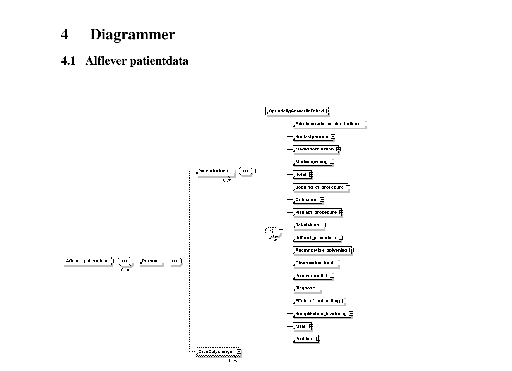

**Billedbeskrivelse:** Hierarkiet starter i `Aflever_patientdata`, indeholder nul eller flere `Person`, der kan indeholde patientforløb og Cave-oplysninger. Et patientforløb har oprindeligt ansvarlig enhed og en choice mellem SUP-hændelsestyperne.

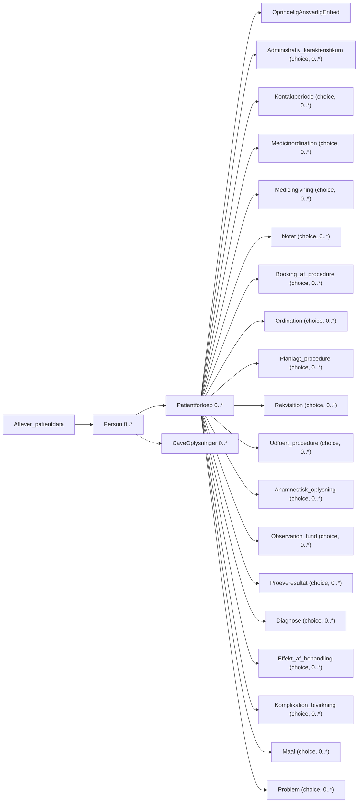
```mermaid
flowchart LR
  ROOT["Aflever_patientdata"]
  ROOT --> P["Person 0..*"]
  P --> PF["Patientforloeb 0..*"]
  P -.-> C["CaveOplysninger 0..*"]
  PF --> O["OprindeligAnsvarligEnhed"]
  PF --> E0["Administrativ_karakteristikum (choice, 0..*)"]
  PF --> E1["Kontaktperiode (choice, 0..*)"]
  PF --> E2["Medicinordination (choice, 0..*)"]
  PF --> E3["Medicingivning (choice, 0..*)"]
  PF --> E4["Notat (choice, 0..*)"]
  PF --> E5["Booking_af_procedure (choice, 0..*)"]
  PF --> E6["Ordination (choice, 0..*)"]
  PF --> E7["Planlagt_procedure (choice, 0..*)"]
  PF --> E8["Rekvisition (choice, 0..*)"]
  PF --> E9["Udfoert_procedure (choice, 0..*)"]
  PF --> E10["Anamnestisk_oplysning (choice, 0..*)"]
  PF --> E11["Observation_fund (choice, 0..*)"]
  PF --> E12["Proeveresultat (choice, 0..*)"]
  PF --> E13["Diagnose (choice, 0..*)"]
  PF --> E14["Effekt_af_behandling (choice, 0..*)"]
  PF --> E15["Komplikation_bivirkning (choice, 0..*)"]
  PF --> E16["Maal (choice, 0..*)"]
  PF --> E17["Problem (choice, 0..*)"]
```

Mermaid-kilde: `bilag_04_xml_specifikation_assets/bilag_04_4_1_aflever_patientdata.mmd`

### 4.2 Forløbsservice

<!-- Billedbeskrivelse: Forløbsservice returnerer personoplysninger, Cave-oplysninger og en liste af `PatientforloebOversigt`; hvert forløb indeholder ansvarlig enhed og nul eller flere diagnoser. -->

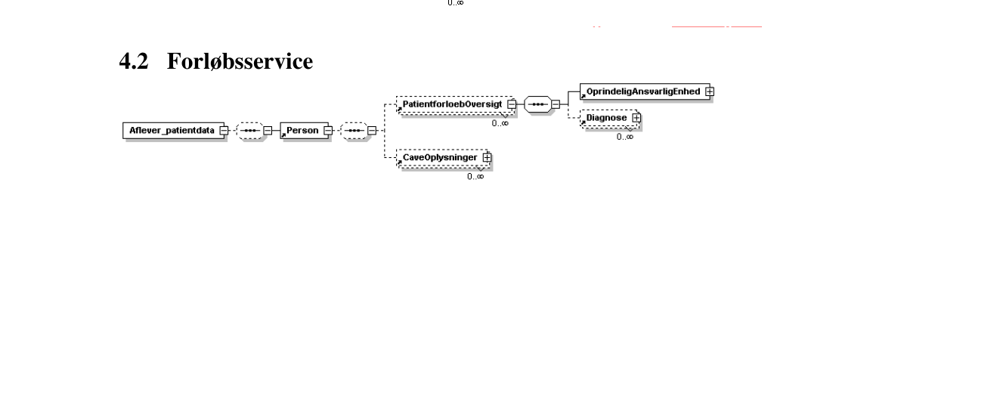

**Billedbeskrivelse:** Forløbsservice returnerer personoplysninger, Cave-oplysninger og en liste af `PatientforloebOversigt`; hvert forløb indeholder ansvarlig enhed og nul eller flere diagnoser.

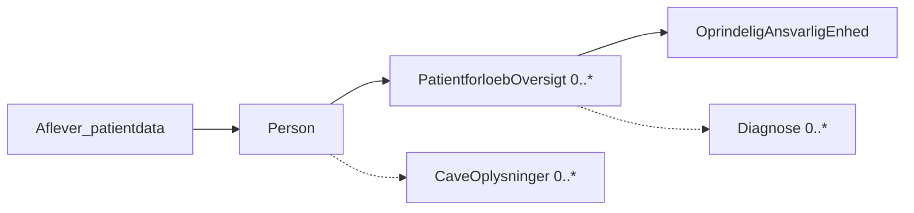
```mermaid
flowchart LR
  ROOT["Aflever_patientdata"]
  ROOT --> P["Person"]
  P --> PF["PatientforloebOversigt 0..*"]
  P -.-> C["CaveOplysninger 0..*"]
  PF --> O["OprindeligAnsvarligEnhed"]
  PF -.-> D["Diagnose 0..*"]
```

Mermaid-kilde: `bilag_04_xml_specifikation_assets/bilag_04_4_2_forloebsservice.mmd`

### 4.3 Hændelsesservice

<!-- Billedbeskrivelse: Hændelsesservice viser en person med et patientforløb og de hændelser, der kan forekomme i forløbet; strukturen svarer til hændelses-choice i XSD. -->

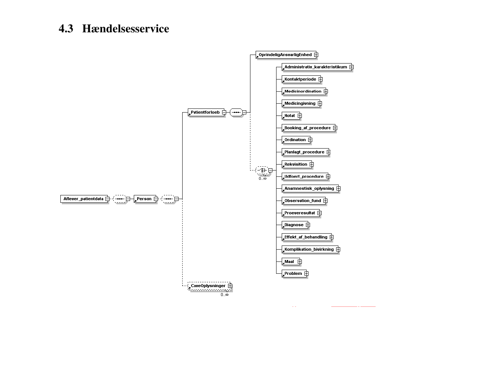

**Billedbeskrivelse:** Hændelsesservice viser en person med et patientforløb og de hændelser, der kan forekomme i forløbet; strukturen svarer til hændelses-choice i XSD.

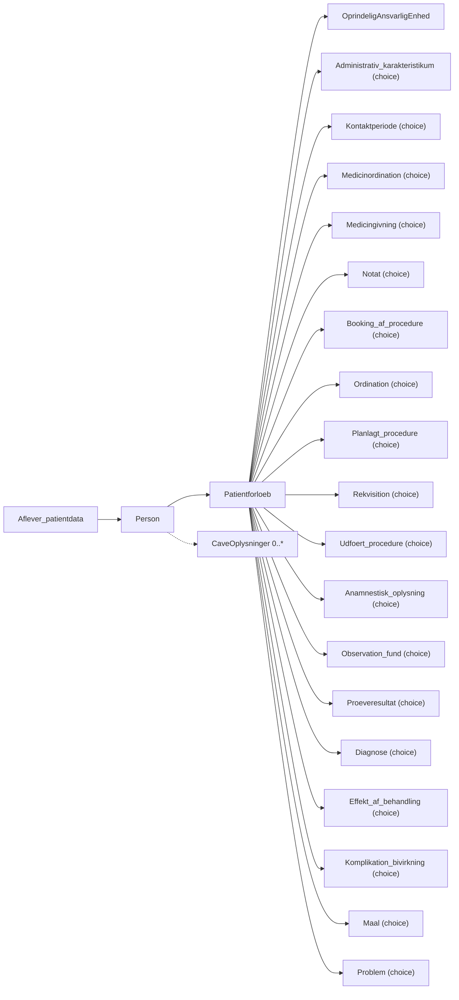
```mermaid
flowchart LR
  ROOT["Aflever_patientdata"]
  ROOT --> P["Person"]
  P --> PF["Patientforloeb"]
  P -.-> C["CaveOplysninger 0..*"]
  PF --> O["OprindeligAnsvarligEnhed"]
  PF --> E0["Administrativ_karakteristikum (choice)"]
  PF --> E1["Kontaktperiode (choice)"]
  PF --> E2["Medicinordination (choice)"]
  PF --> E3["Medicingivning (choice)"]
  PF --> E4["Notat (choice)"]
  PF --> E5["Booking_af_procedure (choice)"]
  PF --> E6["Ordination (choice)"]
  PF --> E7["Planlagt_procedure (choice)"]
  PF --> E8["Rekvisition (choice)"]
  PF --> E9["Udfoert_procedure (choice)"]
  PF --> E10["Anamnestisk_oplysning (choice)"]
  PF --> E11["Observation_fund (choice)"]
  PF --> E12["Proeveresultat (choice)"]
  PF --> E13["Diagnose (choice)"]
  PF --> E14["Effekt_af_behandling (choice)"]
  PF --> E15["Komplikation_bivirkning (choice)"]
  PF --> E16["Maal (choice)"]
  PF --> E17["Problem (choice)"]
```

Mermaid-kilde: `bilag_04_xml_specifikation_assets/bilag_04_4_3_haendelsesservice.mmd`

### 4.4 Enkelthændelsesservice

<!-- Billedbeskrivelse: Enkelthændelsesservice bruger samme hændelsestyper, men til detailoplysninger for en enkelt hændelse sammen med tilknyttet person og patientforløb. -->

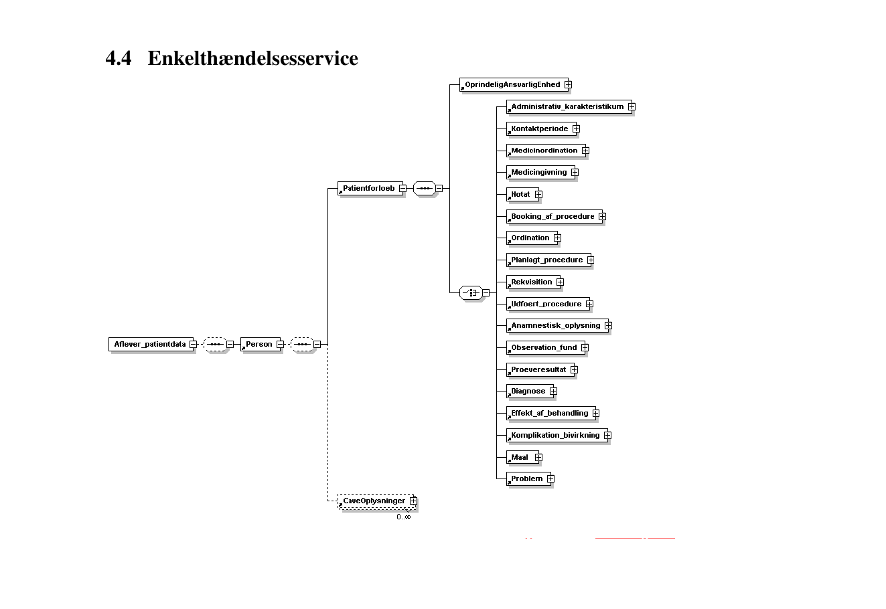

**Billedbeskrivelse:** Enkelthændelsesservice bruger samme hændelsestyper, men til detailoplysninger for en enkelt hændelse sammen med tilknyttet person og patientforløb.

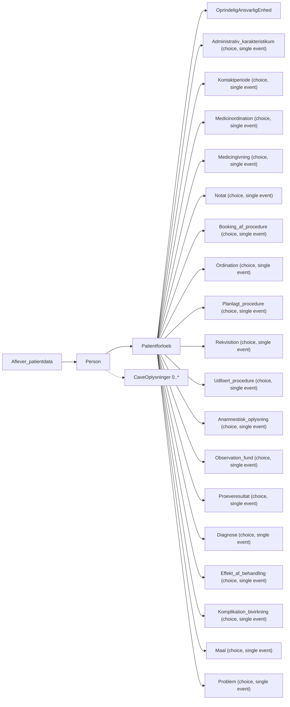
```mermaid
flowchart LR
  ROOT["Aflever_patientdata"]
  ROOT --> P["Person"]
  P --> PF["Patientforloeb"]
  P -.-> C["CaveOplysninger 0..*"]
  PF --> O["OprindeligAnsvarligEnhed"]
  PF --> E0["Administrativ_karakteristikum (choice, single event)"]
  PF --> E1["Kontaktperiode (choice, single event)"]
  PF --> E2["Medicinordination (choice, single event)"]
  PF --> E3["Medicingivning (choice, single event)"]
  PF --> E4["Notat (choice, single event)"]
  PF --> E5["Booking_af_procedure (choice, single event)"]
  PF --> E6["Ordination (choice, single event)"]
  PF --> E7["Planlagt_procedure (choice, single event)"]
  PF --> E8["Rekvisition (choice, single event)"]
  PF --> E9["Udfoert_procedure (choice, single event)"]
  PF --> E10["Anamnestisk_oplysning (choice, single event)"]
  PF --> E11["Observation_fund (choice, single event)"]
  PF --> E12["Proeveresultat (choice, single event)"]
  PF --> E13["Diagnose (choice, single event)"]
  PF --> E14["Effekt_af_behandling (choice, single event)"]
  PF --> E15["Komplikation_bivirkning (choice, single event)"]
  PF --> E16["Maal (choice, single event)"]
  PF --> E17["Problem (choice, single event)"]
```

Mermaid-kilde: `bilag_04_xml_specifikation_assets/bilag_04_4_4_enkelthaendelsesservice.mmd`

### 4.5 Meddelelserservice

<!-- Billedbeskrivelse: Meddelelseslisten indeholder personens CPR-nummer og nul eller flere meddelelser, hver med dato, returtekst og returkode. -->

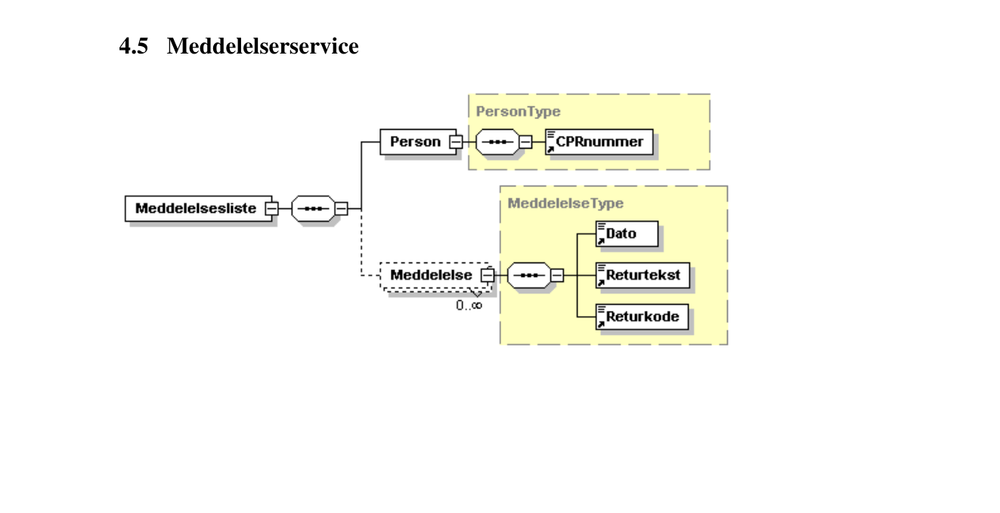

**Billedbeskrivelse:** Meddelelseslisten indeholder personens CPR-nummer og nul eller flere meddelelser, hver med dato, returtekst og returkode.

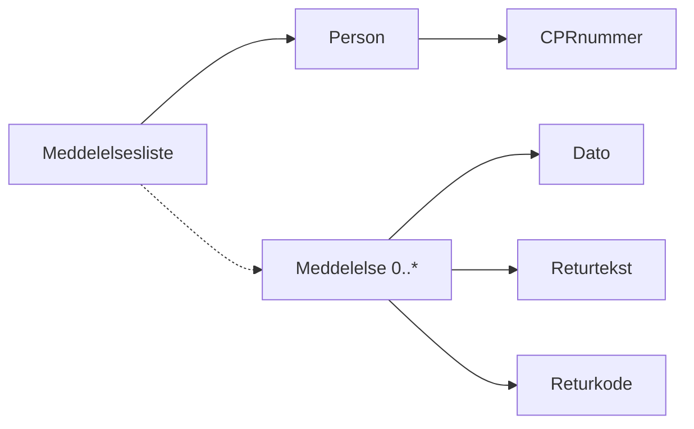
```mermaid
flowchart LR
  ROOT["Meddelelsesliste"]
  ROOT --> P["Person"]
  P --> CPR["CPRnummer"]
  ROOT -.-> M["Meddelelse 0..*"]
  M --> D["Dato"]
  M --> T["Returtekst"]
  M --> K["Returkode"]
```

Mermaid-kilde: `bilag_04_xml_specifikation_assets/bilag_04_4_5_meddelelserservice.mmd`

### 4.6 SUPakutservice

<!-- Billedbeskrivelse: SUPakut returnerer status for et akut bestilt udtræk som én meddelelse med dato, returtekst og returkode sammen med CPR-nummer. -->

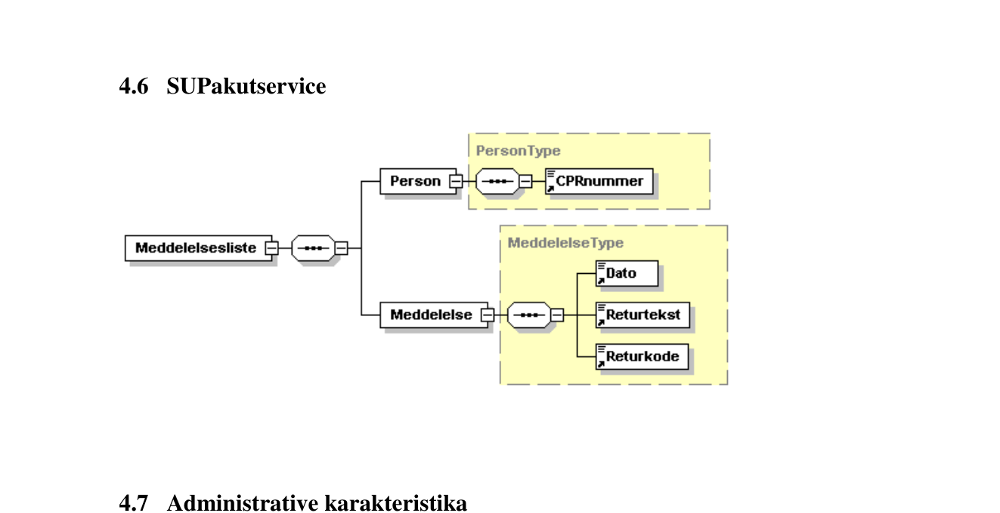

**Billedbeskrivelse:** SUPakut returnerer status for et akut bestilt udtræk som én meddelelse med dato, returtekst og returkode sammen med CPR-nummer.

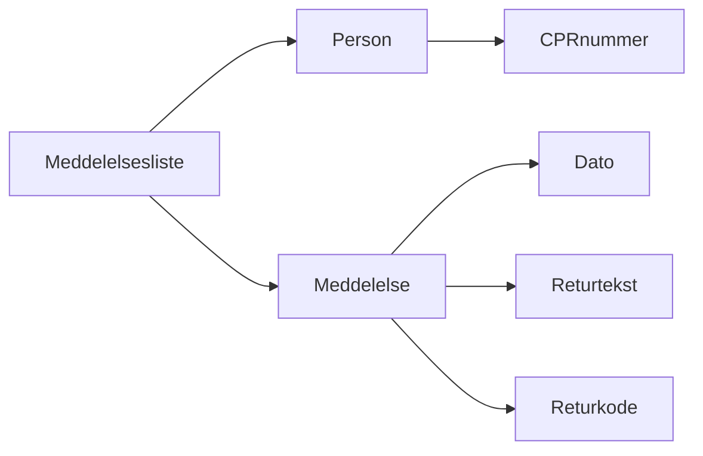
```mermaid
flowchart LR
  ROOT["Meddelelsesliste"]
  ROOT --> P["Person"]
  P --> CPR["CPRnummer"]
  ROOT --> M["Meddelelse"]
  M --> D["Dato"]
  M --> T["Returtekst"]
  M --> K["Returkode"]
```

Mermaid-kilde: `bilag_04_xml_specifikation_assets/bilag_04_4_6_supakutservice.mmd`

### 4.7 Administrative karakteristika

<!-- Billedbeskrivelse: Administrativt karakteristikum består af fælles hændelsesdata, kode og valgfri årsager samt relationer til konstaterende/afsluttende behandler og enhed og eventuelt udløsende rekvisition/procedure. -->

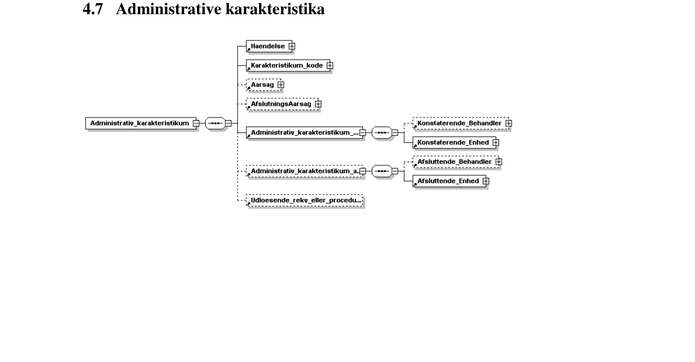

**Billedbeskrivelse:** Administrativt karakteristikum består af fælles hændelsesdata, kode og valgfri årsager samt relationer til konstaterende/afsluttende behandler og enhed og eventuelt udløsende rekvisition/procedure.

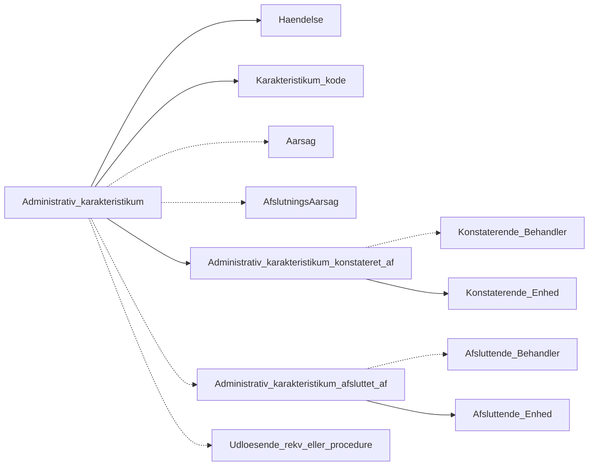
```mermaid
flowchart LR
  ROOT["Administrativ_karakteristikum"]
  ROOT --> H["Haendelse"]
  ROOT --> K["Karakteristikum_kode"]
  ROOT -.-> A["Aarsag"]
  ROOT -.-> AA["AfslutningsAarsag"]
  ROOT --> KF["Administrativ_karakteristikum_konstateret_af"]
  KF -.-> KB["Konstaterende_Behandler"]
  KF --> KE["Konstaterende_Enhed"]
  ROOT -.-> AF["Administrativ_karakteristikum_afsluttet_af"]
  AF -.-> AB["Afsluttende_Behandler"]
  AF --> AE["Afsluttende_Enhed"]
  ROOT -.-> U["Udloesende_rekv_eller_procedure"]
```

Mermaid-kilde: `bilag_04_xml_specifikation_assets/bilag_04_4_7_administrative_karakteristika.mmd`

### 4.8 Kontaktperiode

<!-- Billedbeskrivelse: Kontaktperiode indeholder hændelse, forløbsstatus, valgfri indikation/prioritet/afslutningsårsag samt ansvarlig, afsluttende og rekvirerende kontekst og eventuelle referencer til henvisning/kontaktgrundlag. -->

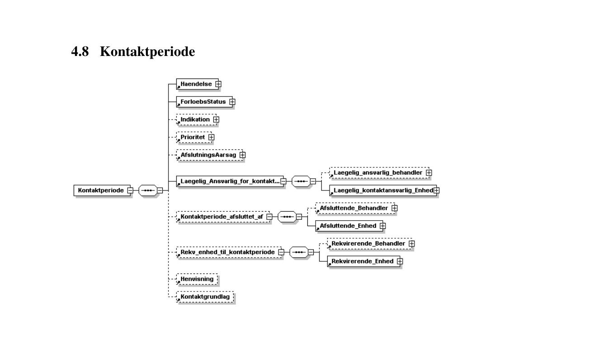

**Billedbeskrivelse:** Kontaktperiode indeholder hændelse, forløbsstatus, valgfri indikation/prioritet/afslutningsårsag samt ansvarlig, afsluttende og rekvirerende kontekst og eventuelle referencer til henvisning/kontaktgrundlag.

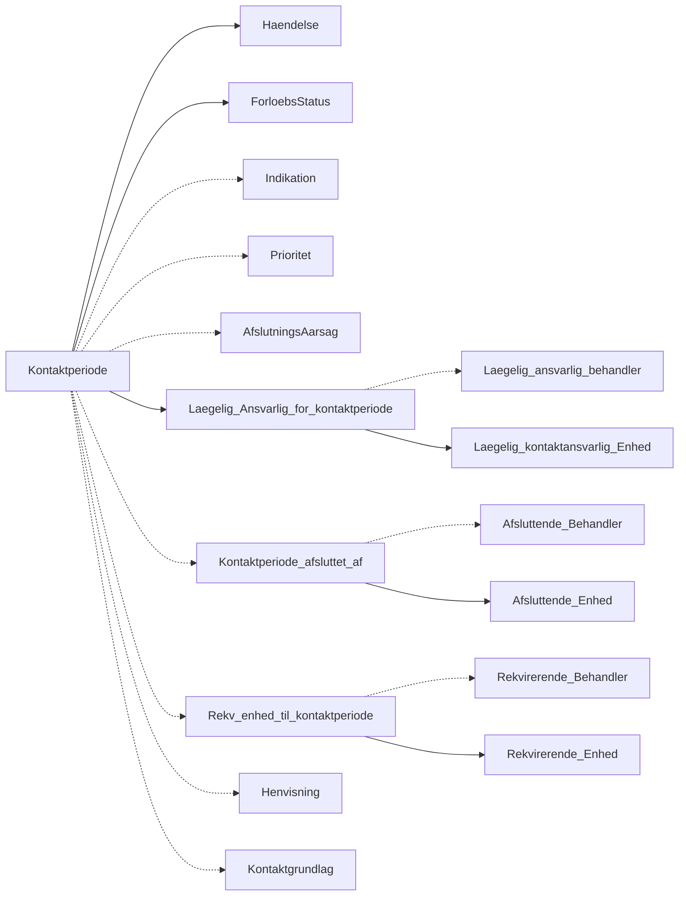
```mermaid
flowchart LR
  ROOT["Kontaktperiode"]
  ROOT --> H["Haendelse"]
  ROOT --> FS["ForloebsStatus"]
  ROOT -.-> I["Indikation"]
  ROOT -.-> P["Prioritet"]
  ROOT -.-> A["AfslutningsAarsag"]
  ROOT --> L["Laegelig_Ansvarlig_for_kontaktperiode"]
  L -.-> LB["Laegelig_ansvarlig_behandler"]
  L --> LE["Laegelig_kontaktansvarlig_Enhed"]
  ROOT -.-> K["Kontaktperiode_afsluttet_af"]
  K -.-> AB["Afsluttende_Behandler"]
  K --> AE["Afsluttende_Enhed"]
  ROOT -.-> R["Rekv_enhed_til_kontaktperiode"]
  R -.-> RB["Rekvirerende_Behandler"]
  R --> RE["Rekvirerende_Enhed"]
  ROOT -.-> HEN["Henvisning"]
  ROOT -.-> KG["Kontaktgrundlag"]
```

Mermaid-kilde: `bilag_04_xml_specifikation_assets/bilag_04_4_8_kontaktperiode.mmd`

### 4.9 Medicingivning

<!-- Billedbeskrivelse: Medicingivning indeholder hændelsesdata, lægemiddeltype/præparat, ATC, administrationsmåde, organisatoriske relationer og eventuel reference til den medicinordination, der forårsagede givningen. -->

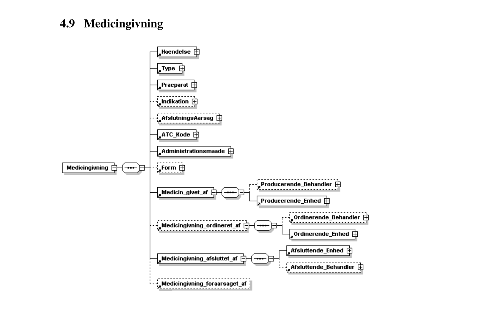

**Billedbeskrivelse:** Medicingivning indeholder hændelsesdata, lægemiddeltype/præparat, ATC, administrationsmåde, organisatoriske relationer og eventuel reference til den medicinordination, der forårsagede givningen.

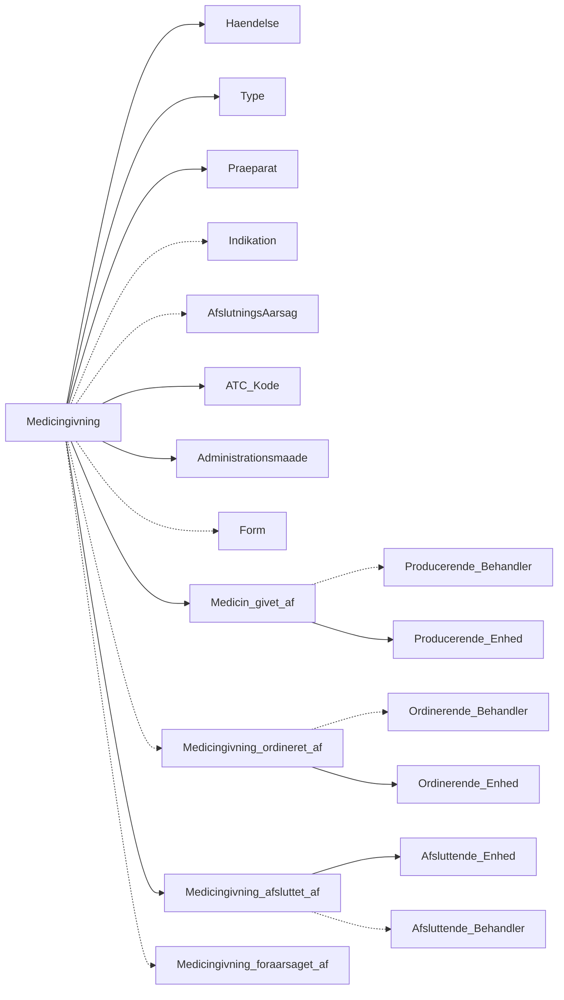
```mermaid
flowchart LR
  ROOT["Medicingivning"]
  ROOT --> H["Haendelse"]
  ROOT --> T["Type"]
  ROOT --> PR["Praeparat"]
  ROOT -.-> I["Indikation"]
  ROOT -.-> AA["AfslutningsAarsag"]
  ROOT --> ATC["ATC_Kode"]
  ROOT --> AM["Administrationsmaade"]
  ROOT -.-> F["Form"]
  ROOT --> G["Medicin_givet_af"]
  G -.-> PB["Producerende_Behandler"]
  G --> PE["Producerende_Enhed"]
  ROOT -.-> O["Medicingivning_ordineret_af"]
  O -.-> OB["Ordinerende_Behandler"]
  O --> OE["Ordinerende_Enhed"]
  ROOT --> A["Medicingivning_afsluttet_af"]
  A --> AE["Afsluttende_Enhed"]
  A -.-> AB["Afsluttende_Behandler"]
  ROOT -.-> FRS["Medicingivning_foraarsaget_af"]
```

Mermaid-kilde: `bilag_04_xml_specifikation_assets/bilag_04_4_9_medicingivning.mmd`

### 4.10 Notat

<!-- Billedbeskrivelse: Notat indeholder hændelsesdata, valgfri notattype, relation til producerende og eventuelt rekvirerende enhed/behandler samt eventuel procedurereference. -->

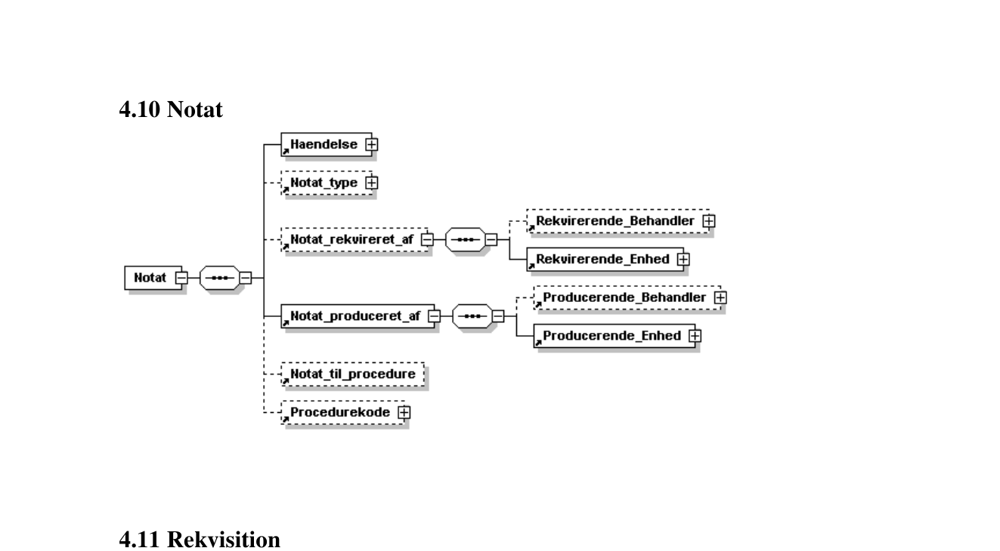

**Billedbeskrivelse:** Notat indeholder hændelsesdata, valgfri notattype, relation til producerende og eventuelt rekvirerende enhed/behandler samt eventuel procedurereference.

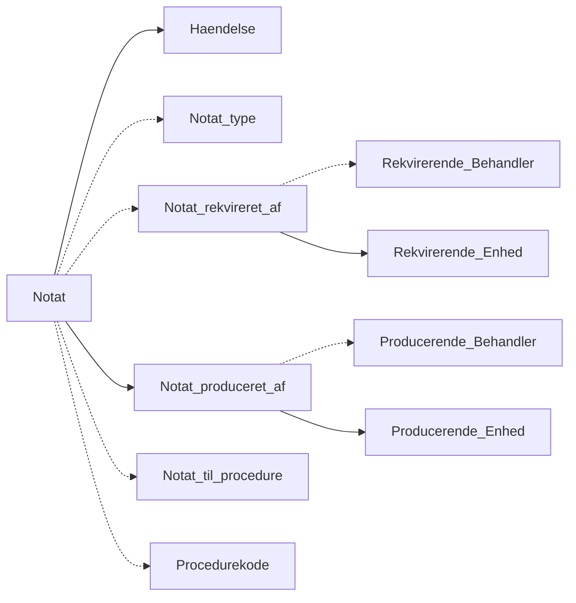
```mermaid
flowchart LR
  ROOT["Notat"]
  ROOT --> H["Haendelse"]
  ROOT -.-> NT["Notat_type"]
  ROOT -.-> R["Notat_rekvireret_af"]
  R -.-> RB["Rekvirerende_Behandler"]
  R --> RE["Rekvirerende_Enhed"]
  ROOT --> P["Notat_produceret_af"]
  P -.-> PB["Producerende_Behandler"]
  P --> PE["Producerende_Enhed"]
  ROOT -.-> NP["Notat_til_procedure"]
  ROOT -.-> PK["Procedurekode"]
```

Mermaid-kilde: `bilag_04_xml_specifikation_assets/bilag_04_4_10_notat.mmd`

### 4.11 Rekvisition

<!-- Billedbeskrivelse: Rekvisition indeholder hændelsesdata, procedurekode og kliniske/administrative parametre samt relationer til rekvirerende, planlagt producerende og eventuelt faktisk afsluttende enhed/behandler. -->

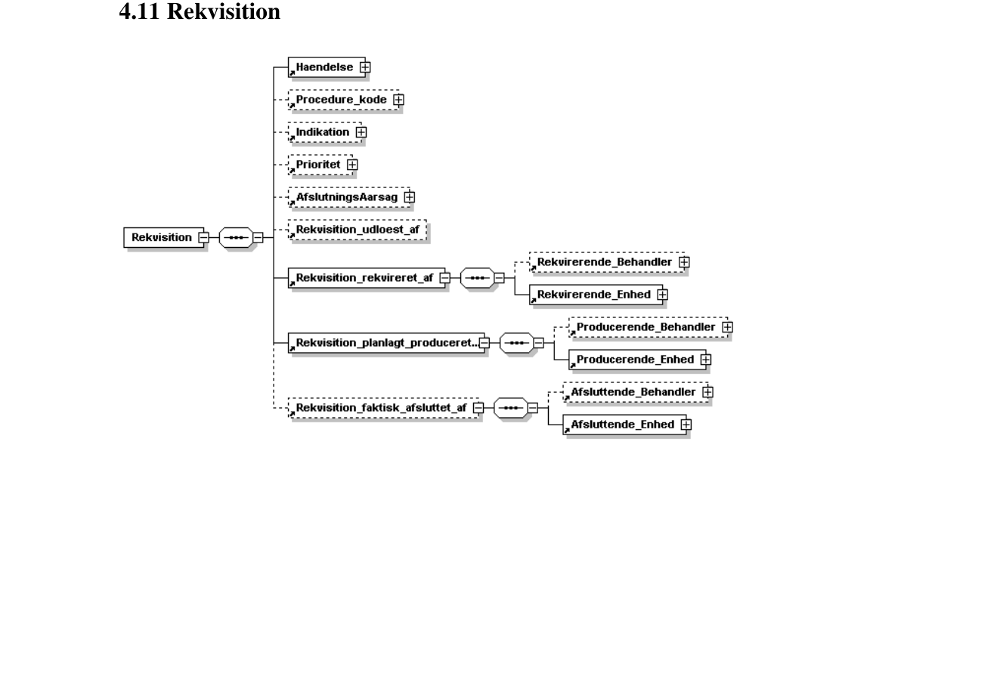

**Billedbeskrivelse:** Rekvisition indeholder hændelsesdata, procedurekode og kliniske/administrative parametre samt relationer til rekvirerende, planlagt producerende og eventuelt faktisk afsluttende enhed/behandler.

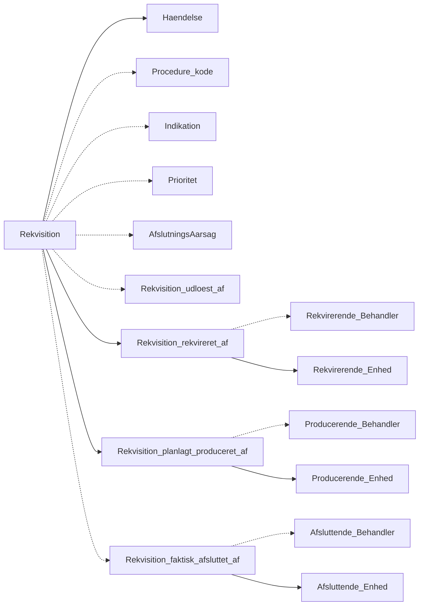
```mermaid
flowchart LR
  ROOT["Rekvisition"]
  ROOT --> H["Haendelse"]
  ROOT -.-> PK["Procedure_kode"]
  ROOT -.-> I["Indikation"]
  ROOT -.-> P["Prioritet"]
  ROOT -.-> A["AfslutningsAarsag"]
  ROOT -.-> U["Rekvisition_udloest_af"]
  ROOT --> R["Rekvisition_rekvireret_af"]
  R -.-> RB["Rekvirerende_Behandler"]
  R --> RE["Rekvirerende_Enhed"]
  ROOT --> PP["Rekvisition_planlagt_produceret_af"]
  PP -.-> PB["Producerende_Behandler"]
  PP --> PE["Producerende_Enhed"]
  ROOT -.-> F["Rekvisition_faktisk_afsluttet_af"]
  F -.-> AB["Afsluttende_Behandler"]
  F --> AE["Afsluttende_Enhed"]
```

Mermaid-kilde: `bilag_04_xml_specifikation_assets/bilag_04_4_11_rekvisition.mmd`

### 4.12 Prøveresultat

<!-- Billedbeskrivelse: Prøveresultat indeholder hændelsesdata, resultatkode, eventuelle undersøgelses-/lokalisations-/morfologidata, procedurereference samt producerende og eventuelt rekvirerende kontekst. -->

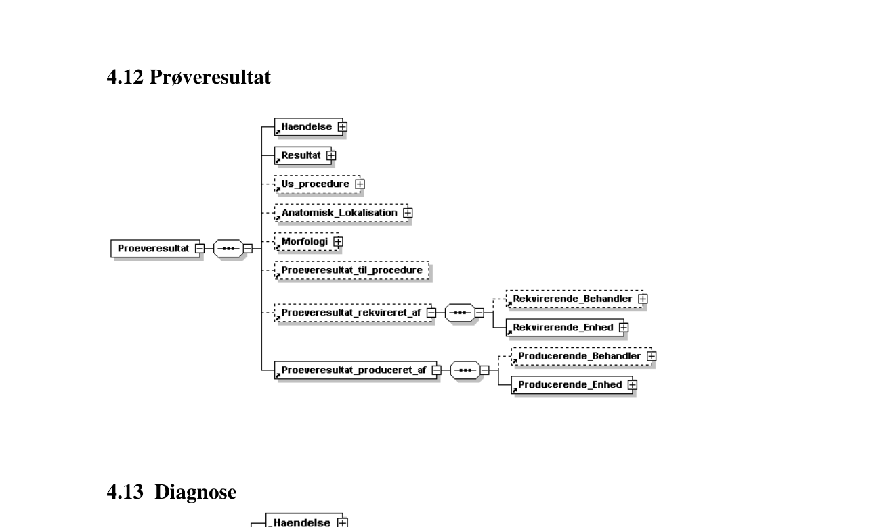

**Billedbeskrivelse:** Prøveresultat indeholder hændelsesdata, resultatkode, eventuelle undersøgelses-/lokalisations-/morfologidata, procedurereference samt producerende og eventuelt rekvirerende kontekst.

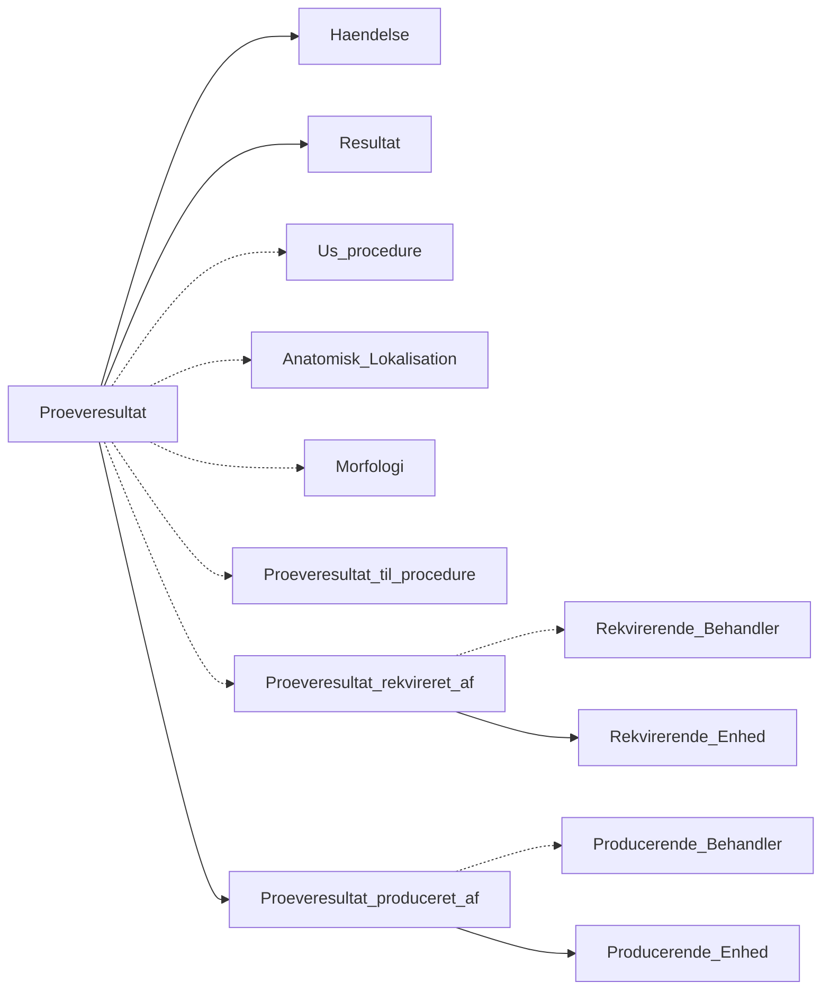
```mermaid
flowchart LR
  ROOT["Proeveresultat"]
  ROOT --> H["Haendelse"]
  ROOT --> R["Resultat"]
  ROOT -.-> U["Us_procedure"]
  ROOT -.-> AL["Anatomisk_Lokalisation"]
  ROOT -.-> M["Morfologi"]
  ROOT -.-> TP["Proeveresultat_til_procedure"]
  ROOT -.-> REQ["Proeveresultat_rekvireret_af"]
  REQ -.-> RB["Rekvirerende_Behandler"]
  REQ --> RE["Rekvirerende_Enhed"]
  ROOT --> PROD["Proeveresultat_produceret_af"]
  PROD -.-> PB["Producerende_Behandler"]
  PROD --> PE["Producerende_Enhed"]
```

Mermaid-kilde: `bilag_04_xml_specifikation_assets/bilag_04_4_12_proeveresultat.mmd`

### 4.13 Diagnose

<!-- Billedbeskrivelse: Diagnose indeholder hændelse, art og diagnosekode samt hvem/hvilken enhed der udførte diagnosticeringen, eventuel afslutning og eventuel procedurereference. -->

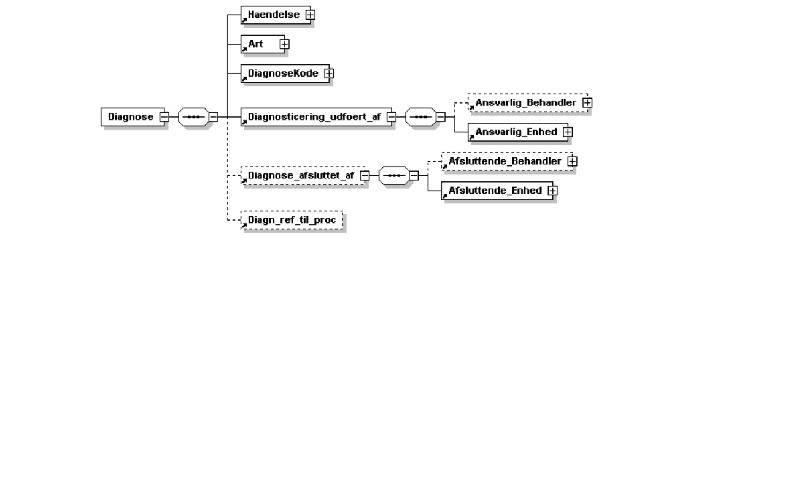

**Billedbeskrivelse:** Diagnose indeholder hændelse, art og diagnosekode samt hvem/hvilken enhed der udførte diagnosticeringen, eventuel afslutning og eventuel procedurereference.

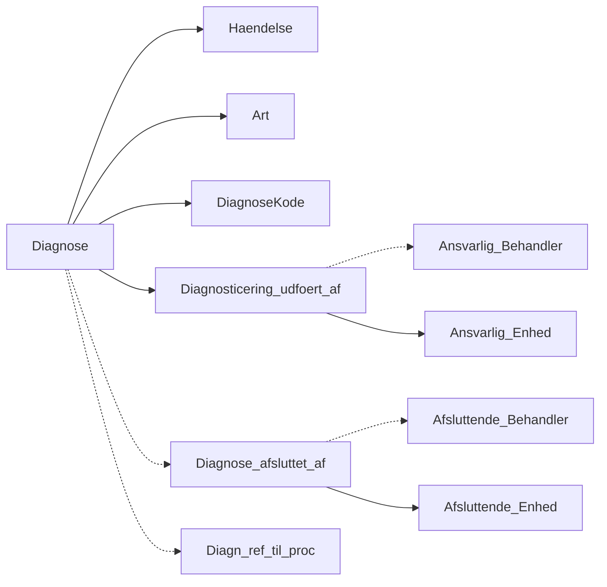
```mermaid
flowchart LR
  ROOT["Diagnose"]
  ROOT --> H["Haendelse"]
  ROOT --> A["Art"]
  ROOT --> DK["DiagnoseKode"]
  ROOT --> U["Diagnosticering_udfoert_af"]
  U -.-> AB["Ansvarlig_Behandler"]
  U --> AE["Ansvarlig_Enhed"]
  ROOT -.-> AF["Diagnose_afsluttet_af"]
  AF -.-> FB["Afsluttende_Behandler"]
  AF --> FE["Afsluttende_Enhed"]
  ROOT -.-> RP["Diagn_ref_til_proc"]
```

Mermaid-kilde: `bilag_04_xml_specifikation_assets/bilag_04_4_13_diagnose.mmd`

## 5 Sourcetekst

> **Normativ del.** XSD-koden nedenfor er transskriberet fra dokumentet. Sideombrydninger og PDF-sidehoveder er fjernet, men indholdet er ellers bevaret så tæt som muligt.

### 5.1 Aflever Patientdata XML schema

**Schemafil:** `SUPAfleverPatientdataService.xsd`

```xml
<?xml version="1.0" encoding="ISO-8859-1"?>
<xsd:schema targetNamespace="http://www.viborgamt.dk/SUP_AJ001" xmlns:xsd="http://www.w3.org/2001/XMLSchema"
xmlns="http://www.viborgamt.dk/SUP_AJ001">
<xsd:annotation>
<xsd:documentation>SUP II version 2.0 XML schema for output af "Aflever patientdata"</xsd:documentation>
</xsd:annotation>
<xsd:include schemaLocation="SUPTyper.xsd"/>
<xsd:include schemaLocation="SUPFaellesAttributter.xsd"/>
<xsd:include schemaLocation="SUPPatientforloeb.xsd"/>
<xsd:annotation>
<xsd:documentation>
Giver for et cpr-nummer alle forløb med alle hændelser for en given periode samt personoplysninger.
Hændelser uden et forløb tilkyttet i fødesystemet (PAS/EPJ system) sendes med et teknisk oprettet forløb til SUP databasen.
</xsd:documentation>
</xsd:annotation>
<xsd:element name="Aflever_patientdata">
<xsd:complexType>
<xsd:sequence minOccurs="0" maxOccurs="unbounded">
<xsd:element ref="Person"/>
</xsd:sequence>
<xsd:attributeGroup ref="AfleverPatientdataAttributter"/>
</xsd:complexType>
</xsd:element>
<xsd:element name="Person">
<xsd:complexType>
<xsd:sequence minOccurs="0">
<xsd:element ref="Patientforloeb" minOccurs="0" maxOccurs="unbounded"/>
<xsd:element ref="CaveOplysninger" minOccurs="0" maxOccurs="unbounded"/>
</xsd:sequence>
<xsd:attributeGroup ref="PersonAttributter"/>
</xsd:complexType>
</xsd:element>
</xsd:schema>
```

### 5.2 Forløbsservice XML Schema.

**Schemafil:** `SUPForloebsService.xsd`

```xml
<?xml version="1.0" encoding="ISO-8859-1"?>
<xsd:schema targetNamespace="http://www.viborgamt.dk/SUP_AJ001" xmlns="http://www.viborgamt.dk/SUP_AJ001"
xmlns:xsd="http://www.w3.org/2001/XMLSchema">
<xsd:annotation>
<xsd:documentation>SUP II version 2.0 schema for "Forloebs-Service".</xsd:documentation>
</xsd:annotation>
<xsd:include schemaLocation="SUPFaellesAttributter.xsd"/>
<xsd:include schemaLocation="SUPVurdering.xsd"/>
<xsd:annotation>
<xsd:documentation>
Giver for et cpr-nummer personoplysninger og liste over alle forløb for en given periode.
</xsd:documentation>
</xsd:annotation>
<xsd:element name="Aflever_patientdata">
<xsd:complexType>
<xsd:sequence minOccurs="0">
<xsd:element ref="Person"/>
</xsd:sequence>
<xsd:attributeGroup ref="AfleverPatientdataAttributter"/>
</xsd:complexType>
</xsd:element>
<xsd:element name="Person">
<xsd:complexType>
<xsd:sequence minOccurs="0">
<xsd:element ref="PatientforloebOversigt" minOccurs="0" maxOccurs="unbounded"/>
<xsd:element ref="CaveOplysninger" minOccurs="0" maxOccurs="unbounded"/>
</xsd:sequence>
<xsd:attributeGroup ref="PersonAttributter"/>
</xsd:complexType>
</xsd:element>
<xsd:element name="PatientforloebOversigt">
<xsd:complexType>
<xsd:sequence>
<xsd:element ref="OprindeligAnsvarligEnhed"/>
<xsd:element ref="Diagnose" minOccurs="0" maxOccurs="unbounded"/>
</xsd:sequence>
<xsd:attribute name="Identifikation" type="xsd:string" use="required"/>
<xsd:attribute name="Starttidspunkt" type="SUPdateTime" use="optional"/>
<xsd:attribute name="Sluttidspunkt" type="SUPdateTime" use="optional"/>
<xsd:attribute name="Teknisk_forloeb" use="optional">
<xsd:simpleType>
<xsd:restriction base="xsd:string">
<xsd:enumeration value="X"/>
</xsd:restriction>
</xsd:simpleType>
</xsd:attribute>
<xsd:attribute name="Foedesystem" use="required"/>
</xsd:complexType>
</xsd:element>
</xsd:schema>
```

### 5.3 Hændelsesservice XML schema

**Schemafil:** `SUPHaendelsesService.XSD`

```xml
<?xml version="1.0" encoding="ISO-8859-1"?>
<xsd:schema targetNamespace="http://www.viborgamt.dk/SUP_AJ001" xmlns="http://www.viborgamt.dk/SUP_AJ001"
xmlns:xsd="http://www.w3.org/2001/XMLSchema">
<xsd:include schemaLocation="SUPFaellesAttributter.xsd"/>
<xsd:include schemaLocation="SUPPatientforloeb.xsd"/>
<xsd:annotation>
<xsd:documentation>
Giver for et cpr-nummer og et forløb alle hændelser for en given periode.
Hvis forløb ikke er angivet som input til servicen returneres alle forløb i perioden.
Hændelser uden et forløb tilkyttet i fødesystemet (PAS/EPJ system) sendes med et teknisk oprettet forløb til SUP databasen.
</xsd:documentation>
</xsd:annotation>
<xsd:element name="Aflever_patientdata">
<xsd:complexType>
<xsd:sequence minOccurs="0">
<xsd:element ref="Person"/>
</xsd:sequence>
<xsd:attributeGroup ref="AfleverPatientdataAttributter"/>
</xsd:complexType>
</xsd:element>
<xsd:element name="Person">
<xsd:complexType>
<xsd:sequence minOccurs="0">
<xsd:element ref="Patientforloeb"/>
<xsd:element ref="CaveOplysninger" minOccurs="0" maxOccurs="unbounded"/>
</xsd:sequence>
<xsd:attributeGroup ref="PersonAttributter"/>
</xsd:complexType>
</xsd:element>
</xsd:schema>
```

### 5.4 Enkelt hændelsesservice XML schema

**Schemafil:** `SUPEnkeltHaendelsesService.xsd`

```xml
<?xml version="1.0" encoding="ISO-8859-1"?>
<xsd:schema targetNamespace="http://www.viborgamt.dk/SUP_AJ001" xmlns="http://www.viborgamt.dk/SUP_AJ001"
xmlns:xsd="http://www.w3.org/2001/XMLSchema">
<xsd:annotation>
<xsd:documentation>SUP II version 2.0 XML schema for "EnkelHændelsse-Service".</xsd:documentation>
</xsd:annotation>
<xsd:include schemaLocation="SUPTyper.xsd"/>
<xsd:include schemaLocation="SUPFaellesAttributter.xsd"/>
<xsd:include schemaLocation="SUPEnkeltHaendelsePatientforloeb.xsd"/>
<xsd:annotation>
<xsd:documentation>
Giver for et cpr-nummer og hændelsesid detailoplysninger på hændelsen, tilknyttet forløb og person.
Hændelser uden et forløb tilkyttet i fødesystemet (PAS/EPJ system) sendes med et teknisk oprettet forløb til SUP databasen.
</xsd:documentation>
</xsd:annotation>
<xsd:element name="Aflever_patientdata">
<xsd:complexType>
<xsd:sequence minOccurs="0">
<xsd:element ref="Person"/>
</xsd:sequence>
<xsd:attributeGroup ref="AfleverPatientdataAttributter"/>
</xsd:complexType>
</xsd:element>
<xsd:element name="Person">
<xsd:complexType>
<xsd:sequence minOccurs="0">
<xsd:element ref="Patientforloeb"/>
<xsd:element ref="CaveOplysninger" minOccurs="0" maxOccurs="unbounded"/>
</xsd:sequence>
<xsd:attributeGroup ref="PersonAttributter"/>
</xsd:complexType>
</xsd:element>
</xsd:schema>
```

### 5.5 Meddelelserservice XML schema

**Schemafil:** `SUPMeddelelserService.xsd`

```xml
<?xml version="1.0" encoding="ISO-8859-1"?>
<xsd:schema targetNamespace="http://www.viborgamt.dk/SUP_AJ001" xmlns="http://www.viborgamt.dk/SUP_AJ001"
xmlns:xsd="http://www.w3.org/2001/XMLSchema">
<xsd:annotation>
<xsd:documentation>SUP II version 2.0 XML schema for "Meddelelser-Service".</xsd:documentation>
</xsd:annotation>
<xsd:include schemaLocation="SUPTyper.xsd"/>
<xsd:annotation>
<xsd:documentation>
Giver for et cpr-nummer liste over alle meddelelser vedrørende udtræk til SUB databasen.
</xsd:documentation>
</xsd:annotation>
<xsd:complexType name="MeddelelseType">
<xsd:sequence>
<xsd:element ref="Dato"/>
<xsd:element ref="Returtekst"/>
<xsd:element ref="Returkode"/>
</xsd:sequence>
</xsd:complexType>
<xsd:element name="Meddelelsesliste">
<xsd:complexType>
<xsd:sequence>
<xsd:element name="Person" type="PersonType"/>
<xsd:element name="Meddelelse" type="MeddelelseType" minOccurs="0" maxOccurs="unbounded"/>
</xsd:sequence>
</xsd:complexType>
</xsd:element>
<xsd:complexType name="PersonType">
<xsd:sequence>
<xsd:element ref="CPRnummer"/>
</xsd:sequence>
</xsd:complexType>
<xsd:element name="CPRnummer" type="xsd:string"/>
<xsd:element name="Dato" type="SUPdateTime"/>
<xsd:element name="Returtekst" type="xsd:string"/>
<xsd:element name="Returkode" type="xsd:nonNegativeInteger"/>
</xsd:schema>
```

### 5.6 SUPakut XML schema

**Schemafil:** `SUPAkutService.xsd`

```xml
<?xml version="1.0" encoding="ISO-8859-1"?>
<xsd:schema targetNamespace="http://www.viborgamt.dk/SUP_AJ001" xmlns:xsd="http://www.w3.org/2001/XMLSchema"
xmlns="http://www.viborgamt.dk/SUP_AJ001">
<xsd:annotation>
<xsd:documentation>SUP II version 2.0 XML schema for "SUPakut-Service".</xsd:documentation>
</xsd:annotation>
<xsd:include schemaLocation="SUPTyper.xsd"/>
<xsd:annotation>
<xsd:documentation>
Angiver status på akut bestilt udtræk af patientdata hos EPJ/PAS udtræksprogrammel.
</xsd:documentation>
</xsd:annotation>
<xsd:complexType name="MeddelelseType">
<xsd:sequence>
<xsd:element ref="Dato"/>
<xsd:element ref="Returtekst"/>
<xsd:element ref="Returkode"/>
</xsd:sequence>
</xsd:complexType>
<xsd:element name="Meddelelsesliste">
<xsd:complexType>
<xsd:sequence>
<xsd:element name="Person" type="PersonType"/>
<xsd:element name="Meddelelse" type="MeddelelseType"/>
</xsd:sequence>
</xsd:complexType>
</xsd:element>
<xsd:complexType name="PersonType">
<xsd:sequence>
<xsd:element ref="CPRnummer"/>
</xsd:sequence>
</xsd:complexType>
<xsd:element name="CPRnummer" type="xsd:string"/>
<xsd:element name="Dato" type="SUPdateTime"/>
<xsd:element name="Returtekst" type="xsd:string"/>
<xsd:element name="Returkode" type="xsd:nonNegativeInteger"/>
</xsd:schema>
6 Include XML schemaer
```

## 6 Include XML schemaer

> **Normativ del.** De inkluderede XSD-filer definerer de delstrukturer, som hovedschemaerne bygger på.

### 6.1 Persondata

**Schemafil:** `SUPPersondata.xsd`

```xml
<?xml version="1.0" encoding="ISO-8859-1"?>
<xsd:schema targetNamespace="http://www.viborgamt.dk/SUP_AJ001" xmlns="http://www.viborgamt.dk/SUP_AJ001"
xmlns:xsd="http://www.w3.org/2001/XMLSchema">
<xsd:annotation>
<xsd:documentation>SUP II version 2.0 XML schema for "Person"</xsd:documentation>
</xsd:annotation>
<xsd:include schemaLocation="SUPFaellesAttributter.xsd"/>
<xsd:include schemaLocation="SUPOrganisation.xsd"/>
<xsd:include schemaLocation="SUPPatientforloeb.xsd"/>
<xsd:element name="Person">
<xsd:complexType>
<xsd:sequence minOccurs="0">
<xsd:element ref="Patientforloeb" minOccurs="0" maxOccurs="unbounded"/>
<xsd:element ref="CaveOplysninger" minOccurs="0" maxOccurs="unbounded"/>
</xsd:sequence>
<xsd:attributeGroup ref="PersonAttributter"/>
</xsd:complexType>
</xsd:element>
</xsd:schema>
```

### 6.2 Enkelthændelse patientforløb

**Schemafil:** `SUPEnkelthaendelsePatientforloeb.xsd`

```xml
<?xml version="1.0" encoding="ISO-8859-1"?>
<xsd:schema targetNamespace="http://www.viborgamt.dk/SUP_AJ001" xmlns:xsd="http://www.w3.org/2001/XMLSchema"
xmlns="http://www.viborgamt.dk/SUP_AJ001">
<xsd:annotation>
<xsd:documentation>SUP II version 2.0 XML schema for "Patientforløb"</xsd:documentation>
</xsd:annotation>
<xsd:include schemaLocation="SUPAdministrativeKarakteristika.xsd"/>
<xsd:include schemaLocation="SUPResultat.xsd"/>
<xsd:include schemaLocation="SUPVurdering.xsd"/>
<xsd:include schemaLocation="SUPMedicinering.xsd"/>
<xsd:include schemaLocation="SUPKontaktperiode.xsd"/>
<xsd:include schemaLocation="SUPNotat.xsd"/>
<xsd:include schemaLocation="SUPProcedureProces.xsd"/>
<xsd:element name="Patientforloeb">
<xsd:complexType>
<xsd:sequence>
<xsd:element ref="OprindeligAnsvarligEnhed"/>
<xsd:choice>
<xsd:element ref="Administrativ_karakteristikum"/>
<xsd:element ref="Kontaktperiode"/>
<xsd:element ref="Medicinordination"/>
<xsd:element ref="Medicingivning"/>
<xsd:element ref="Notat"/>
<xsd:element ref="Booking_af_procedure"/>
<xsd:element ref="Ordination"/>
<xsd:element ref="Planlagt_procedure"/>
<xsd:element ref="Rekvisition"/>
<xsd:element ref="Udfoert_procedure"/>
<xsd:element ref="Anamnestisk_oplysning"/>
<xsd:element ref="Observation_fund"/>
<xsd:element ref="Proeveresultat"/>
<xsd:element ref="Diagnose"/>
<xsd:element ref="Effekt_af_behandling"/>
<xsd:element ref="Komplikation_bivirkning"/>
<xsd:element ref="Maal"/>
<xsd:element ref="Problem"/>
</xsd:choice>
</xsd:sequence>
<xsd:attribute name="Identifikation" type="xsd:string" use="required"/>
<xsd:attribute name="Starttidspunkt" type="SUPdateTime" use="optional"/>
<xsd:attribute name="Sluttidspunkt" type="SUPdateTime" use="optional"/>
<xsd:attribute name="Teknisk_forloeb" use="optional">
<xsd:simpleType>
<xsd:restriction base="xsd:string">
<xsd:enumeration value="X"/>
</xsd:restriction>
</xsd:simpleType>
</xsd:attribute>
<xsd:attribute name="Foedesystem" use="required"/>
</xsd:complexType>
</xsd:element>
</xsd:schema>
```

### 6.3 Administrative karakteristika

**Schemafil:** `SUPAdministrativeKarakteristika.xsd`

```xml
<?xml version="1.0" encoding="ISO-8859-1"?>
<xsd:schema targetNamespace="http://www.viborgamt.dk/SUP_AJ001" xmlns:xsd="http://www.w3.org/2001/XMLSchema"
xmlns="http://www.viborgamt.dk/SUP_AJ001">
<xsd:include schemaLocation="SUPTyper.xsd"/>
<xsd:include schemaLocation="SUPBehandlere.xsd"/>
<xsd:include schemaLocation="SUPOrganisation.xsd"/>
<xsd:include schemaLocation="SUPKlassifikation.xsd"/>
<xsd:include schemaLocation="SUPFaellesAttributter.xsd"/>
<xsd:include schemaLocation="SUPHaendelse.xsd"/>
<!-- ====================== Pakke: Administrative Karakteristika ==============-->
<xsd:element name="Administrativ_karakteristikum">
<xsd:complexType>
<xsd:sequence>
<xsd:element ref="Haendelse"/>
<xsd:element ref="Karakteristikum_kode"/>
<xsd:element ref="Aarsag" minOccurs="0"/>
<xsd:element ref="AfslutningsAarsag" minOccurs="0"/>
<xsd:element ref="Administrativ_karakteristikum_konstateret_af"/>
<xsd:element ref="Administrativ_karakteristikum_afsluttet_af" minOccurs="0"/>
<xsd:element ref="Udloesende_rekv_eller_procedure" minOccurs="0"/>
</xsd:sequence>
<xsd:attribute name="Starttidspunkt" type="SUPdateTime" use="required"/>
<xsd:attribute name="SlutTidspunkt" type="SUPdateTime" use="optional"/>
<xsd:attribute name="AfslutTidspunkt" type="SUPdateTime" use="optional"/>
</xsd:complexType>
</xsd:element>
<xsd:element name="Administrativ_karakteristikum_afsluttet_af">
<xsd:complexType>
<xsd:sequence>
<xsd:element ref="Afsluttende_Behandler" minOccurs="0"/>
<xsd:element ref="Afsluttende_Enhed"/>
</xsd:sequence>
</xsd:complexType>
</xsd:element>
<xsd:element name="Administrativ_karakteristikum_konstateret_af">
<xsd:complexType>
<xsd:sequence>
<xsd:element ref="Konstaterende_Behandler" minOccurs="0"/>
<xsd:element ref="Konstaterende_Enhed"/>
</xsd:sequence>
</xsd:complexType>
</xsd:element>
<xsd:element name="Karakteristikum_kode">
<xsd:complexType>
<xsd:sequence>
<xsd:element ref="SammensatKodetVaerdi"/>
</xsd:sequence>
</xsd:complexType>
</xsd:element>
<xsd:element name="Udloesende_rekv_eller_procedure">
<xsd:complexType>
<xsd:attribute name="Rekvisition_Identifikation" type="xsd:string" use="required"/>
<xsd:attribute name="Procedure_identifikation" type="xsd:string" use="required"/>
</xsd:complexType>
</xsd:element>
</xsd:schema>
```

### 6.4 Kontakperiode

**Schemafil:** `SUPKontaktperiode.xsd`

```xml
<?xml version="1.0" encoding="ISO-8859-1"?>
<xsd:schema targetNamespace="http://www.viborgamt.dk/SUP_AJ001" xmlns="http://www.viborgamt.dk/SUP_AJ001"
xmlns:xsd="http://www.w3.org/2001/XMLSchema">
<xsd:include schemaLocation="SUPTyper.xsd"/>
<xsd:include schemaLocation="SUPKlassifikation.xsd"/>
<xsd:include schemaLocation="SUPOrganisation.xsd"/>
<xsd:include schemaLocation="SUPBehandlere.xsd"/>
<xsd:include schemaLocation="SUPFaellesAttributter.xsd"/>
<xsd:include schemaLocation="SUPHaendelse.xsd"/>
<!-- ====================== Pakke: Kontaktperiode =========================-->
<xsd:element name="Kontaktperiode">
<xsd:complexType>
<xsd:sequence>
<xsd:element ref="Haendelse"/>
<xsd:element ref="ForloebsStatus"/>
<xsd:element ref="Indikation" minOccurs="0"/>
<xsd:element ref="Prioritet" minOccurs="0"/>
<xsd:element ref="AfslutningsAarsag" minOccurs="0"/>
<xsd:element ref="Laegelig_Ansvarlig_for_kontaktperiode"/>
<xsd:element ref="Kontaktperiode_afsluttet_af" minOccurs="0"/>
<xsd:element ref="Rekv_enhed_til_kontaktperiode" minOccurs="0"/>
<xsd:element ref="Henvisning" minOccurs="0"/>
<xsd:element ref="Kontaktgrundlag" minOccurs="0"/>
</xsd:sequence>
<xsd:attribute name="StartTidspunkt" type="SUPdateTime" use="required"/>
<xsd:attribute name="Afslutningstidspunkt" type="SUPdateTime" use="optional"/>
</xsd:complexType>
</xsd:element>
<xsd:element name="Kontaktperiode_afsluttet_af">
<xsd:complexType>
<xsd:sequence>
<xsd:element ref="Afsluttende_Behandler" minOccurs="0"/>
<xsd:element ref="Afsluttende_Enhed"/>
</xsd:sequence>
</xsd:complexType>
</xsd:element>
<xsd:element name="Laegelig_Ansvarlig_for_kontaktperiode">
<xsd:complexType>
<xsd:sequence>
<xsd:element ref="Laegelig_ansvarlig_behandler" minOccurs="0"/>
<xsd:element ref="Laegelig_kontaktansvarlig_Enhed"/>
</xsd:sequence>
<xsd:attribute name="Stamsted" type="xsd:string" use="required"/>
</xsd:complexType>
</xsd:element>
<xsd:element name="Rekv_enhed_til_kontaktperiode">
<xsd:complexType>
<xsd:sequence>
<xsd:element ref="Rekvirerende_Behandler" minOccurs="0"/>
<xsd:element ref="Rekvirerende_Enhed"/>
</xsd:sequence>
</xsd:complexType>
</xsd:element>
<xsd:element name="ForloebsStatus">
<xsd:complexType>
<xsd:sequence>
<xsd:element ref="KodetVaerdi"/>
</xsd:sequence>
</xsd:complexType>
</xsd:element>
<xsd:element name="Henvisning">
<xsd:complexType>
<xsd:attribute name="Rekvisition_Identifikation" type="xsd:string" use="optional"/>
</xsd:complexType>
</xsd:element>
<xsd:element name="Kontaktgrundlag">
<xsd:complexType>
<xsd:attribute name="Ordination_Identifikation" type="xsd:string" use="optional"/>
</xsd:complexType>
</xsd:element>
</xsd:schema>
```

### 6.5 Medicinering

**Schemafil:** `SUPMedicinering.xsd`

```xml
<?xml version="1.0" encoding="ISO-8859-1"?>
<xsd:schema targetNamespace="http://www.viborgamt.dk/SUP_AJ001" xmlns="http://www.viborgamt.dk/SUP_AJ001"
xmlns:xsd="http://www.w3.org/2001/XMLSchema">
<xsd:include schemaLocation="SUPTyper.xsd"/>
<xsd:include schemaLocation="SUPKlassifikation.xsd"/>
<xsd:include schemaLocation="SUPOrganisation.xsd"/>
<xsd:include schemaLocation="SUPBehandlere.xsd"/>
<xsd:include schemaLocation="SUPFaellesAttributter.xsd"/>
<xsd:include schemaLocation="SUPHaendelse.xsd"/>
<!-- ====================== Pakke: Medicinering =========================-->
<xsd:element name="Administrationsmaade">
<xsd:complexType>
<xsd:sequence>
<xsd:element ref="KodetVaerdi"/>
</xsd:sequence>
</xsd:complexType>
</xsd:element>
<xsd:element name="ATC_Kode">
<xsd:complexType>
<xsd:sequence>
<xsd:element ref="KodetVaerdi"/>
</xsd:sequence>
</xsd:complexType>
</xsd:element>
<xsd:element name="Form">
<xsd:complexType>
<xsd:sequence>
<xsd:element ref="KodetVaerdi"/>
</xsd:sequence>
</xsd:complexType>
</xsd:element>
<xsd:element name="Medicin_givet_af">
<xsd:complexType>
<xsd:sequence>
<xsd:element ref="Producerende_Behandler" minOccurs="0"/>
<xsd:element ref="Producerende_Enhed"/>
</xsd:sequence>
<xsd:attribute name="Procedure_sted" type="xsd:string" use="optional"/>
</xsd:complexType>
</xsd:element>
<xsd:element name="Medicin_planlagt_givet_af">
<xsd:complexType>
<xsd:sequence>
<xsd:element ref="Producerende_Behandler" minOccurs="0"/>
<xsd:element ref="Producerende_Enhed"/>
</xsd:sequence>
</xsd:complexType>
</xsd:element>
<xsd:element name="Medicingivning">
<xsd:complexType>
<xsd:sequence>
<xsd:element ref="Haendelse"/>
<xsd:element ref="Type"/>
<xsd:element ref="Praeparat"/>
<xsd:element ref="Indikation" minOccurs="0"/>
<xsd:element ref="AfslutningsAarsag" minOccurs="0"/>
<xsd:element ref="ATC_Kode"/>
<xsd:element ref="Administrationsmaade"/>
<xsd:element ref="Form" minOccurs="0"/>
<xsd:element ref="Medicin_givet_af"/>
<xsd:element ref="Medicingivning_ordineret_af" minOccurs="0"/>
<xsd:element ref="Medicingivning_afsluttet_af"/>
<xsd:element ref="Medicingivning_foraarsaget_af" minOccurs="0"/>
</xsd:sequence>
<xsd:attribute name="Starttidspunkt" type="SUPdateTime" use="required"/>
<xsd:attribute name="Afslutningstidspunkt" type="SUPdateTime" use="optional"/>
<xsd:attribute name="Enkeltdosis" type="SUPfloat" use="required"/>
<xsd:attribute name="EnhedEnkeltdosis" type="xsd:string" use="required"/>
<xsd:attribute name="Styrke" type="xsd:string" use="optional"/>
<xsd:attribute name="Objektreference" type="xsd:anyURI" use="optional"/>
</xsd:complexType>
</xsd:element>
<xsd:element name="Medicingivning_afsluttet_af">
<xsd:complexType>
<xsd:sequence>
<xsd:element ref="Afsluttende_Enhed"/>
<xsd:element ref="Afsluttende_Behandler" minOccurs="0"/>
</xsd:sequence>
</xsd:complexType>
</xsd:element>
<xsd:element name="Medicingivning_ordineret_af">
<xsd:complexType>
<xsd:sequence>
<xsd:element ref="Ordinerende_Behandler" minOccurs="0"/>
<xsd:element ref="Ordinerende_Enhed"/>
</xsd:sequence>
</xsd:complexType>
</xsd:element>
<xsd:element name="Medicingivning_foraarsaget_af">
<xsd:complexType>
<xsd:attribute name="Medicinordination_Identifikation" type="xsd:string" use="required"/>
</xsd:complexType>
</xsd:element>
<xsd:element name="Medicinordination">
<xsd:complexType>
<xsd:sequence>
<xsd:element ref="Haendelse"/>
<xsd:element ref="Praeparat"/>
<xsd:element ref="Indikation" minOccurs="0"/>
<xsd:element ref="Type"/>
<xsd:element ref="SeponeringsAarsag" minOccurs="0"/>
<xsd:element ref="ATC_Kode"/>
<xsd:element ref="Administrationsmaade"/>
<xsd:element ref="Form" minOccurs="0"/>
<xsd:element ref="Medicinordination_ordineret_af"/>
<xsd:element ref="Medicin_planlagt_givet_af" minOccurs="0"/>
<xsd:element ref="Medicinordination_seponeret_af" minOccurs="0"/>
</xsd:sequence>
<xsd:attribute name="Starttidspunkt" type="SUPdateTime" use="required"/>
<xsd:attribute name="Sluttidspunkt" type="SUPdateTime" use="optional"/>
<xsd:attribute name="Seponeringstidspunkt" type="SUPdateTime" use="optional"/>
<xsd:attribute name="DoegnDosis" type="SUPfloat" use="optional"/>
<xsd:attribute name="EnkeltDosis" type="SUPfloat" use="optional"/>
<xsd:attribute name="MaksimalDoegnDosis" type="SUPfloat" use="optional"/>
<xsd:attribute name="Enhed" type="xsd:string" use="optional"/>
<xsd:attribute name="Styrke" type="xsd:string" use="optional"/>
<xsd:attribute name="Objektreference" type="xsd:anyURI" use="optional"/>
</xsd:complexType>
</xsd:element>
<xsd:element name="Medicinordination_ordineret_af">
<xsd:complexType>
<xsd:sequence>
<xsd:element ref="Ordinerende_Behandler" minOccurs="0"/>
<xsd:element ref="Ordinerende_Enhed"/>
</xsd:sequence>
<xsd:attribute name="Ordinationssted" type="xsd:string" use="optional"/>
</xsd:complexType>
</xsd:element>
<xsd:element name="Medicinordination_seponeret_af">
<xsd:complexType>
<xsd:sequence>
<xsd:element ref="Seponerende_Behandler" minOccurs="0"/>
<xsd:element ref="Seponerende_Enhed"/>
</xsd:sequence>
</xsd:complexType>
</xsd:element>
<xsd:element name="Praeparat">
<xsd:complexType>
<xsd:sequence>
<xsd:element ref="SammensatKodetVaerdi"/>
</xsd:sequence>
</xsd:complexType>
</xsd:element>
<xsd:element name="SeponeringsAarsag">
<xsd:complexType>
<xsd:sequence>
<xsd:element ref="KodetVaerdi"/>
</xsd:sequence>
</xsd:complexType>
</xsd:element>
<xsd:element name="Type">
<xsd:complexType>
<xsd:sequence>
<xsd:element ref="KodetVaerdi"/>
</xsd:sequence>
</xsd:complexType>
</xsd:element>
</xsd:schema>
```

### 6.6 Notat

**Schemafil:** `SUPNotat.xsd`

```xml
<?xml version="1.0" encoding="ISO-8859-1"?>
<xsd:schema targetNamespace="http://www.viborgamt.dk/SUP_AJ001" xmlns:xsd="http://www.w3.org/2001/XMLSchema"
xmlns="http://www.viborgamt.dk/SUP_AJ001">
<xsd:include schemaLocation="SUPTyper.xsd"/>
<xsd:include schemaLocation="SUPKlassifikation.xsd"/>
<xsd:include schemaLocation="SUPOrganisation.xsd"/>
<xsd:include schemaLocation="SUPBehandlere.xsd"/>
<xsd:include schemaLocation="SUPFaellesAttributter.xsd"/>
<xsd:include schemaLocation="SUPHaendelse.xsd"/>
<!-- ====================== Pakke: Notat ============================-->
<xsd:element name="Notat">
<xsd:complexType>
<xsd:sequence>
<xsd:element ref="Haendelse"/>
<xsd:element ref="Notat_type" minOccurs="0"/>
<xsd:element ref="Notat_rekvireret_af" minOccurs="0"/>
<xsd:element ref="Notat_produceret_af"/>
<xsd:element ref="Notat_til_procedure" minOccurs="0"/>
<xsd:element ref="Procedurekode" minOccurs="0"/>
</xsd:sequence>
<xsd:attribute name="Overskrift" type="xsd:string" use="optional"/>
<xsd:attribute name="KonstateringsTidspunkt" type="SUPdateTime" use="required"/>
<xsd:attribute name="Broedtekst" type="xsd:string" use="optional"/>
<xsd:attribute name="Objektreference" type="xsd:anyURI" use="optional"/>
</xsd:complexType>
</xsd:element>
<xsd:element name="Notat_produceret_af">
<xsd:complexType>
<xsd:sequence>
<xsd:element ref="Producerende_Behandler" minOccurs="0"/>
<xsd:element ref="Producerende_Enhed"/>
</xsd:sequence>
<xsd:attribute name="ProcedureSted" type="xsd:string" use="optional"/>
</xsd:complexType>
</xsd:element>
<xsd:element name="Notat_rekvireret_af">
<xsd:complexType>
<xsd:sequence>
<xsd:element ref="Rekvirerende_Behandler" minOccurs="0"/>
<xsd:element ref="Rekvirerende_Enhed"/>
</xsd:sequence>
</xsd:complexType>
</xsd:element>
<xsd:element name="Notat_type">
<xsd:complexType>
<xsd:sequence>
<xsd:element ref="KodetVaerdi"/>
</xsd:sequence>
</xsd:complexType>
</xsd:element>
<xsd:element name="Notat_til_procedure">
<xsd:complexType>
<xsd:attribute name="Udfoert_procedure_identifikation" type="xsd:string" use="optional"/>
</xsd:complexType>
</xsd:element>
</xsd:schema>
```

### 6.7 Procedure proces

**Schemafil:** `SUPProcedureProces.xsd`

```xml
<?xml version="1.0" encoding="ISO-8859-1"?>
<xsd:schema targetNamespace="http://www.viborgamt.dk/SUP_AJ001" xmlns:xsd="http://www.w3.org/2001/XMLSchema"
xmlns="http://www.viborgamt.dk/SUP_AJ001">
<xsd:include schemaLocation="SUPTyper.xsd"/>
<xsd:include schemaLocation="SUPKlassifikation.xsd"/>
<xsd:include schemaLocation="SUPOrganisation.xsd"/>
<xsd:include schemaLocation="SUPBehandlere.xsd"/>
<xsd:include schemaLocation="SUPFaellesAttributter.xsd"/>
<xsd:include schemaLocation="SUPHaendelse.xsd"/>
<!-- ====================== Pakke: Procedureproces ============================-->
<xsd:element name="Booking_af_procedure">
<xsd:complexType>
<xsd:sequence>
<xsd:element ref="Haendelse"/>
<xsd:element ref="Procedure_kode"/>
<xsd:element ref="Indikation"/>
<xsd:element ref="Prioritet"/>
<xsd:element ref="Booking_af_procedure_produceret_af"/>
<xsd:element ref="Booking_af_procedure_rekvireret_af"/>
<xsd:element ref="Booking_af_procedure_afsluttet_af" minOccurs="0"/>
<xsd:element ref="Booking_udloest_af" minOccurs="0"/>
</xsd:sequence>
<xsd:attribute name="Starttidspunkt" type="SUPdateTime" use="required"/>
<xsd:attribute name="Sluttidspunkt" type="SUPdateTime" use="optional"/>
<xsd:attribute name="Aflysningstidspunkt" type="SUPdateTime" use="optional"/>
<xsd:attribute name="Afslutningsaarsag" type="xsd:string" use="optional"/>
</xsd:complexType>
</xsd:element>
<xsd:element name="Booking_udloest_af">
<xsd:complexType>
<xsd:attribute name="Planlagt_procedure_identifikation" type="xsd:string" use="optional"/>
<xsd:attribute name="Ordination_identifikation" type="xsd:string" use="optional"/>
<xsd:attribute name="Rekvisition_identifikation" type="xsd:string" use="optional"/>
</xsd:complexType>
</xsd:element>
<xsd:element name="Booking_af_procedure_produceret_af">
<xsd:complexType>
<xsd:sequence>
<xsd:element ref="Producerende_Enhed"/>
<xsd:element ref="Producerende_Behandler"/>
</xsd:sequence>
<xsd:attribute name="Udfoerelsessted" type="xsd:string" use="optional"/>
</xsd:complexType>
</xsd:element>
<xsd:element name="Booking_af_procedure_rekvireret_af">
<xsd:complexType>
<xsd:sequence>
<xsd:element ref="Rekvirerende_Enhed"/>
<xsd:element ref="Rekvirerende_Behandler"/>
</xsd:sequence>
</xsd:complexType>
</xsd:element>
<xsd:element name="Booking_af_procedure_afsluttet_af">
<xsd:complexType>
<xsd:sequence>
<xsd:element ref="Afsluttende_Enhed"/>
<xsd:element ref="Afsluttende_Behandler"/>
</xsd:sequence>
</xsd:complexType>
</xsd:element>
<xsd:element name="Ordination">
<xsd:complexType>
<xsd:sequence>
<xsd:element ref="Haendelse"/>
<xsd:element ref="Procedure_kode"/>
<xsd:element ref="Indikation" minOccurs="0"/>
<xsd:element ref="Prioritet" minOccurs="0"/>
<xsd:element ref="AfslutningsAarsag" minOccurs="0"/>
<xsd:element ref="Ordination_ordineret_af"/>
<xsd:element ref="Ordination_planlagt_produceret_af" minOccurs="0"/>
<xsd:element ref="Ordination_seponeret_af" minOccurs="0"/>
<xsd:element ref="Planlaegning_af_ordination"/>
</xsd:sequence>
<xsd:attribute name="Starttidspunkt" type="SUPdateTime" use="required"/>
<xsd:attribute name="Sluttidspunkt" type="SUPdateTime" use="optional"/>
<xsd:attribute name="Seponeringstidspunkt" type="SUPdateTime" use="optional"/>
<xsd:attribute name="Antal" type="SUPfloat" use="optional"/>
<xsd:attribute name="Enhed" type="xsd:string" use="optional"/>
</xsd:complexType>
</xsd:element>
<xsd:element name="Ordination_ordineret_af">
<xsd:complexType>
<xsd:sequence>
<xsd:element ref="Ordinerende_Behandler" minOccurs="0"/>
<xsd:element ref="Ordinerende_Enhed"/>
</xsd:sequence>
<xsd:attribute name="Ordinationssted" type="xsd:string" use="optional"/>
</xsd:complexType>
</xsd:element>
<xsd:element name="Ordination_planlagt_produceret_af">
<xsd:complexType>
<xsd:sequence>
<xsd:element ref="Producerende_Behandler" minOccurs="0"/>
<xsd:element ref="Producerende_Enhed"/>
</xsd:sequence>
</xsd:complexType>
</xsd:element>
<xsd:element name="Ordination_seponeret_af">
<xsd:complexType>
<xsd:sequence>
<xsd:element ref="Seponerende_Behandler" minOccurs="0"/>
<xsd:element ref="Seponerende_Enhed"/>
</xsd:sequence>
</xsd:complexType>
</xsd:element>
<xsd:element name="Planlaegning_af_ordination">
<xsd:complexType>
<xsd:attribute name="Planlagt_procedure_identifikation" type="xsd:string" use="optional"/>
</xsd:complexType>
</xsd:element>
<xsd:element name="Planlagt_procedure">
<xsd:complexType>
<xsd:sequence>
<xsd:element ref="Haendelse"/>
<xsd:element ref="Procedure_kode" minOccurs="0"/>
<xsd:element ref="Indikation" minOccurs="0"/>
<xsd:element ref="Prioritet" minOccurs="0"/>
<xsd:element ref="AfslutningsAarsag" minOccurs="0"/>
<xsd:element ref="Planlagt_procedure_planlagt_af"/>
<xsd:element ref="Planlagt_procedure_afsluttet_af" minOccurs="0"/>
</xsd:sequence>
<xsd:attribute name="Planlaegningstidspunkt" type="xsd:string" use="optional"/>
<xsd:attribute name="Afslutningstidspunkt" type="xsd:string" use="optional"/>
<xsd:attribute name="Objektreference" type="xsd:anyURI" use="optional"/>
</xsd:complexType>
</xsd:element>
<xsd:element name="Planlagt_procedure_afsluttet_af">
<xsd:complexType>
<xsd:sequence>
<xsd:element ref="Afsluttende_Behandler" minOccurs="0"/>
<xsd:element ref="Afsluttende_Enhed"/>
</xsd:sequence>
</xsd:complexType>
</xsd:element>
<xsd:element name="Planlagt_procedure_planlagt_af">
<xsd:complexType>
<xsd:sequence>
<xsd:element ref="Planlaeggende_Behandler" minOccurs="0"/>
<xsd:element ref="Planlaeggende_Enhed"/>
</xsd:sequence>
<xsd:attribute name="Planlaegningssted" type="xsd:string" use="optional"/>
</xsd:complexType>
</xsd:element>
<xsd:element name="Rekvisition">
<xsd:complexType>
<xsd:sequence>
<xsd:element ref="Haendelse"/>
<xsd:element ref="Procedure_kode" minOccurs="0"/>
<xsd:element ref="Indikation" minOccurs="0"/>
<xsd:element ref="Prioritet" minOccurs="0"/>
<xsd:element ref="AfslutningsAarsag" minOccurs="0"/>
<xsd:element ref="Rekvisition_udloest_af" minOccurs="0"/>
<xsd:element ref="Rekvisition_rekvireret_af"/>
<xsd:element ref="Rekvisition_planlagt_produceret_af"/>
<xsd:element ref="Rekvisition_faktisk_afsluttet_af" minOccurs="0"/>
</xsd:sequence>
<xsd:attribute name="Rekvisitionstidspunkt" type="xsd:string" use="optional"/>
<xsd:attribute name="Afslutningstidspunkt" type="xsd:string" use="optional"/>
<xsd:attribute name="Antal" type="xsd:string" use="optional"/>
<xsd:attribute name="Enhed" type="xsd:string" use="optional"/>
</xsd:complexType>
</xsd:element>
<xsd:element name="Rekvisition_faktisk_afsluttet_af">
<xsd:complexType>
<xsd:sequence>
<xsd:element ref="Afsluttende_Behandler" minOccurs="0"/>
<xsd:element ref="Afsluttende_Enhed"/>
</xsd:sequence>
</xsd:complexType>
</xsd:element>
<xsd:element name="Rekvisition_planlagt_produceret_af">
<xsd:complexType>
<xsd:sequence>
<xsd:element ref="Producerende_Behandler" minOccurs="0"/>
<xsd:element ref="Producerende_Enhed"/>
</xsd:sequence>
</xsd:complexType>
</xsd:element>
<xsd:element name="Rekvisition_rekvireret_af">
<xsd:complexType>
<xsd:sequence>
<xsd:element ref="Rekvirerende_Behandler" minOccurs="0"/>
<xsd:element ref="Rekvirerende_Enhed"/>
</xsd:sequence>
<xsd:attribute name="Rekvisitionssted" type="xsd:string" use="optional"/>
</xsd:complexType>
</xsd:element>
<xsd:element name="Rekvisition_udloest_af">
<xsd:complexType>
<xsd:attribute name="Ordination_Identifikation" type="xsd:string" use="optional"/>
<xsd:attribute name="Planlagt_procedure_Identifikation" type="xsd:string" use="optional"/>
</xsd:complexType>
</xsd:element>
<xsd:element name="Udfoert_procedure">
<xsd:complexType>
<xsd:sequence>
<xsd:element ref="Haendelse"/>
<xsd:element ref="Art" minOccurs="0"/>
<xsd:element ref="Procedure_kode"/>
<xsd:element ref="Indikation" minOccurs="0"/>
<xsd:element ref="Prioritet" minOccurs="0"/>
<xsd:element ref="AfslutningsAarsag" minOccurs="0"/>
<xsd:element ref="Udloesende_haendelse" minOccurs="0"/>
<xsd:element ref="Udfoert_procedure_rekvireret_af"/>
<xsd:element ref="Udfoert_procedure_produceret_af"/>
<xsd:element ref="Udfoert_procedure_afsluttet_af" minOccurs="0"/>
</xsd:sequence>
<xsd:attribute name="Starttidspunkt" type="SUPdateTime" use="required"/>
<xsd:attribute name="Sluttidspunkt" type="SUPdateTime" use="optional"/>
<xsd:attribute name="Afslutningstidspunkt" type="SUPdateTime" use="optional"/>
<xsd:attribute name="Objektreference" type="xsd:anyURI" use="optional"/>
</xsd:complexType>
</xsd:element>
<xsd:element name="Udfoert_procedure_rekvireret_af">
<xsd:complexType>
<xsd:sequence>
<xsd:element ref="Rekvirerende_Behandler" minOccurs="0"/>
<xsd:element ref="Rekvirerende_Enhed"/>
</xsd:sequence>
</xsd:complexType>
</xsd:element>
<xsd:element name="Udfoert_procedure_produceret_af">
<xsd:complexType>
<xsd:sequence>
<xsd:element ref="Producerende_Behandler" minOccurs="0"/>
<xsd:element ref="Producerende_Enhed"/>
</xsd:sequence>
<xsd:attribute name="Udfoerelsessted" type="xsd:string" use="optional"/>
</xsd:complexType>
</xsd:element>
<xsd:element name="Udfoert_procedure_afsluttet_af">
<xsd:complexType>
<xsd:sequence>
<xsd:element ref="Afsluttende_Behandler" minOccurs="0"/>
<xsd:element ref="Afsluttende_Enhed"/>
</xsd:sequence>
</xsd:complexType>
</xsd:element>
<xsd:element name="Udloesende_haendelse">
<xsd:complexType>
<xsd:attribute name="Rekvisition_Identifikation" type="xsd:string" use="optional"/>
<xsd:attribute name="Ordination_Identifikation" type="xsd:string" use="optional"/>
<xsd:attribute name="Planlagt_procedure_Identifikation" type="xsd:string" use="optional"/>
</xsd:complexType>
</xsd:element>
</xsd:schema>
```

### 6.8 Resultat

**Schemafil:** `SUPResultat.xsd`

```xml
<?xml version="1.0" encoding="ISO-8859-1"?>
<xsd:schema targetNamespace="http://www.viborgamt.dk/SUP_AJ001" xmlns:xsd="http://www.w3.org/2001/XMLSchema"
xmlns="http://www.viborgamt.dk/SUP_AJ001">
<xsd:include schemaLocation="SUPTyper.xsd"/>
<xsd:include schemaLocation="SUPKlassifikation.xsd"/>
<xsd:include schemaLocation="SUPOrganisation.xsd"/>
<xsd:include schemaLocation="SUPBehandlere.xsd"/>
<xsd:include schemaLocation="SUPFaellesAttributter.xsd"/>
<xsd:include schemaLocation="SUPHaendelse.xsd"/>
<!-- ====================== Pakke: Resultat ============================== -->
<xsd:element name="Anamnestisk_oplysning">
<xsd:complexType>
<xsd:sequence>
<xsd:element ref="Haendelse"/>
<xsd:element ref="Art"/>
<xsd:element ref="Anamnestisk_oplysning"/>
<xsd:element ref="Us_procedure"/>
<xsd:element ref="Anamnestisk_oplysning_konstanteret_af"/>
<xsd:element ref="Procedure_hvor_oplysning_blev_givet" minOccurs="0"/>
</xsd:sequence>
<xsd:attribute name="Konstateringstidspunkt" type="SUPdateTime" use="required"/>
<xsd:attribute name="AnamnestiskTidspunkt" type="SUPdateTime" use="optional"/>
<xsd:attribute name="Periode" type="xsd:string" use="optional"/>
<xsd:attribute name="EnhedPeriode" type="xsd:string" use="optional"/>
<xsd:attribute name="Varighed" type="xsd:string" use="optional"/>
<xsd:attribute name="EnhedVarighed" type="xsd:string" use="optional"/>
<xsd:attribute name="Objektreference" type="xsd:anyURI" use="optional"/>
</xsd:complexType>
</xsd:element>
<xsd:element name="Anamnestisk_oplysning_konstanteret_af">
<xsd:complexType>
<xsd:sequence>
<xsd:element ref="Konstaterende_Behandler" minOccurs="0"/>
<xsd:element ref="Konstaterende_Enhed"/>
</xsd:sequence>
<xsd:attribute name="Observationssted" type="xsd:string" use="optional"/>
</xsd:complexType>
</xsd:element>
<xsd:element name="Procedure_hvor_oplysning_blev_givet">
<xsd:complexType>
<xsd:attribute name="Procedure_identifikation" type="xsd:string" use="optional"/>
</xsd:complexType>
</xsd:element>
<xsd:element name="Observation_fund">
<xsd:complexType>
<xsd:sequence>
<xsd:element ref="Haendelse"/>
<xsd:element ref="Observationskode" minOccurs="0"/>
<xsd:element ref="Undersoegelsesprocedure" minOccurs="0"/>
<xsd:element ref="Udloesende_procedure" minOccurs="0"/>
<xsd:element ref="Observation_fund_observeret_af"/>
</xsd:sequence>
<xsd:attribute name="Vaerdi" type="xsd:string" use="optional"/>
<xsd:attribute name="Enhed" type="xsd:string" use="optional"/>
<xsd:attribute name="ObservationsTidspunkt" type="SUPdateTime" use="required"/>
<xsd:attribute name="SystBT" type="xsd:string" use="optional"/>
<xsd:attribute name="DiasBT" type="xsd:string" use="optional"/>
</xsd:complexType>
</xsd:element>
<xsd:element name="Observation_fund_observeret_af">
<xsd:complexType>
<xsd:sequence>
<xsd:element ref="Observerende_Behandler" minOccurs="0"/>
<xsd:element ref="Observerende_Enhed"/>
</xsd:sequence>
<xsd:attribute name="Observationssted" type="xsd:string" use="optional"/>
</xsd:complexType>
</xsd:element>
<xsd:element name="Observationskode">
<xsd:complexType>
<xsd:sequence>
<xsd:element ref="SammensatKodetVaerdi"/>
</xsd:sequence>
</xsd:complexType>
</xsd:element>
<xsd:element name="Undersoegelsesprocedure">
<xsd:complexType>
<xsd:sequence>
<xsd:element ref="KodetVaerdi"/>
</xsd:sequence>
</xsd:complexType>
</xsd:element>
<xsd:element name="Udloesende_procedure">
<xsd:complexType>
<xsd:attribute name="Procedure_identifikation" type="xsd:string" use="required"/>
</xsd:complexType>
</xsd:element>
<xsd:element name="Proeveresultat">
<xsd:complexType>
<xsd:sequence>
<xsd:element ref="Haendelse"/>
<xsd:element ref="Resultat"/>
<xsd:element ref="Us_procedure" minOccurs="0"/>
<xsd:element ref="Anatomisk_Lokalisation" minOccurs="0"/>
<xsd:element ref="Morfologi" minOccurs="0"/>
<xsd:element ref="Proeveresultat_til_procedure" minOccurs="0"/>
<xsd:element ref="Proeveresultat_rekvireret_af" minOccurs="0"/>
<xsd:element ref="Proeveresultat_produceret_af"/>
</xsd:sequence>
<xsd:attribute name="Proevetidspunkt" type="SUPdateTime" use="required"/>
<xsd:attribute name="Svartidspunkt" type="SUPdateTime" use="optional"/>
<xsd:attribute name="ResultatVaerdi" type="xsd:string" use="optional"/>
<xsd:attribute name="EnhedResultatVaerdi" type="xsd:string" use="optional"/>
<xsd:attribute name="NedreGraense" type="xsd:string" use="optional"/>
<xsd:attribute name="EnhedNedreGraense" type="xsd:string" use="optional"/>
<xsd:attribute name="OevreGraense" type="xsd:string" use="optional"/>
<xsd:attribute name="EnhedOevreGraense" type="xsd:string" use="optional"/>
<xsd:attribute name="Unormalt_resultat" use="optional">
<xsd:simpleType>
<xsd:restriction base="xsd:string">
<xsd:enumeration value="*"/>
</xsd:restriction>
</xsd:simpleType>
</xsd:attribute>
<xsd:attribute name="Objektreference" type="xsd:anyURI" use="optional"/>
</xsd:complexType>
</xsd:element>
<xsd:element name="Proeveresultat_til_procedure">
<xsd:complexType>
<xsd:attribute name="Procedure_identifikation" type="xsd:string" use="required"/>
</xsd:complexType>
</xsd:element>
<xsd:element name="Proeveresultat_rekvireret_af">
<xsd:complexType>
<xsd:sequence>
<xsd:element ref="Rekvirerende_Behandler" minOccurs="0"/>
<xsd:element ref="Rekvirerende_Enhed"/>
</xsd:sequence>
</xsd:complexType>
</xsd:element>
<xsd:element name="Proeveresultat_produceret_af">
<xsd:complexType>
<xsd:sequence>
<xsd:element ref="Producerende_Behandler" minOccurs="0"/>
<xsd:element ref="Producerende_Enhed"/>
</xsd:sequence>
<xsd:attribute name="ProcedureSted" type="xsd:string" use="optional"/>
</xsd:complexType>
</xsd:element>
<xsd:element name="Anatomisk_Lokalisation">
<xsd:complexType>
<xsd:sequence>
<xsd:element ref="KodetVaerdi"/>
</xsd:sequence>
</xsd:complexType>
</xsd:element>
<xsd:element name="Morfologi">
<xsd:complexType>
<xsd:sequence>
<xsd:element ref="KodetVaerdi"/>
</xsd:sequence>
</xsd:complexType>
</xsd:element>
</xsd:schema>
```

### 6.9 Vurdering

**Schemafil:** `SUPVurdering.xsd`

```xml
<?xml version="1.0" encoding="ISO-8859-1"?>
<xsd:schema targetNamespace="http://www.viborgamt.dk/SUP_AJ001" xmlns:xsd="http://www.w3.org/2001/XMLSchema"
xmlns="http://www.viborgamt.dk/SUP_AJ001">
<xsd:include schemaLocation="SUPTyper.xsd"/>
<xsd:include schemaLocation="SUPKlassifikation.xsd"/>
<xsd:include schemaLocation="SUPOrganisation.xsd"/>
<xsd:include schemaLocation="SUPBehandlere.xsd"/>
<xsd:include schemaLocation="SUPFaellesAttributter.xsd"/>
<xsd:include schemaLocation="SUPHaendelse.xsd"/>
<!-- ====================== Pakke: Vurdering ============================== -->
<xsd:element name="Diagnose">
<xsd:complexType>
<xsd:sequence>
<xsd:element ref="Haendelse"/>
<xsd:element ref="Art"/>
<xsd:element ref="DiagnoseKode"/>
<xsd:element ref="Diagnosticering_udfoert_af"/>
<xsd:element ref="Diagnose_afsluttet_af" minOccurs="0"/>
<xsd:element ref="Diagn_ref_til_proc" minOccurs="0"/>
</xsd:sequence>
<xsd:attribute name="Diagnosetidspunkt" type="SUPdateTime" use="required"/>
<xsd:attribute name="Afsluttidspunkt" type="SUPdateTime" use="optional"/>
</xsd:complexType>
</xsd:element>
<xsd:element name="DiagnoseKode">
<xsd:complexType>
<xsd:sequence>
<xsd:element ref="SammensatKodetVaerdi"/>
</xsd:sequence>
</xsd:complexType>
</xsd:element>
<xsd:element name="Diagnosticering_udfoert_af">
<xsd:complexType>
<xsd:sequence>
<xsd:element ref="Ansvarlig_Behandler" minOccurs="0"/>
<xsd:element ref="Ansvarlig_Enhed"/>
</xsd:sequence>
<xsd:attribute name="Diagnosested" type="xsd:string" use="optional"/>
</xsd:complexType>
</xsd:element>
<xsd:element name="Diagnose_afsluttet_af">
<xsd:complexType>
<xsd:sequence>
<xsd:element ref="Afsluttende_Behandler" minOccurs="0"/>
<xsd:element ref="Afsluttende_Enhed"/>
</xsd:sequence>
</xsd:complexType>
</xsd:element>
<xsd:element name="Diagn_ref_til_proc">
<xsd:complexType>
<xsd:attribute name="Procedure_identifikation" type="xsd:string" use="optional"/>
</xsd:complexType>
</xsd:element>
<xsd:element name="Effekt_af_behandling">
<xsd:complexType>
<xsd:sequence>
<xsd:element ref="Haendelse"/>
<xsd:element ref="EffektKode"/>
<xsd:element ref="Us_procedure" minOccurs="0"/>
<xsd:element ref="Beh_procedure" minOccurs="0"/>
<xsd:element ref="Foerkode" minOccurs="0"/>
<xsd:element ref="Efterkode" minOccurs="0"/>
<xsd:element ref="Effekt_af_behandling_observeret_af"/>
<xsd:element ref="Effekt_af_behandling_produceret_af"/>
<xsd:element ref="Behandlings_procedure_der_har_effekten" minOccurs="0"/>
</xsd:sequence>
<xsd:attribute name="Observationstidspunkt" type="SUPdateTime" use="required"/>
<xsd:attribute name="Behandlingstidspunkt" type="SUPdateTime" use="optional"/>
<xsd:attribute name="Foervaerdi" type="xsd:string" use="optional"/>
<xsd:attribute name="EnhedFoervaerdi" type="xsd:string" use="optional"/>
<xsd:attribute name="Eftervaerdi" type="xsd:string" use="optional"/>
<xsd:attribute name="EnhedEftervaerdi" type="xsd:string" use="optional"/>
</xsd:complexType>
</xsd:element>
<xsd:element name="EffektKode">
<xsd:complexType>
<xsd:sequence>
<xsd:element ref="SammensatKodetVaerdi"/>
</xsd:sequence>
</xsd:complexType>
</xsd:element>
<xsd:element name="Beh_procedure">
<xsd:complexType>
<xsd:sequence>
<xsd:element ref="KodetVaerdi"/>
</xsd:sequence>
</xsd:complexType>
</xsd:element>
<xsd:element name="Foerkode">
<xsd:complexType>
<xsd:sequence>
<xsd:element ref="KodetVaerdi"/>
</xsd:sequence>
</xsd:complexType>
</xsd:element>
<xsd:element name="Efterkode">
<xsd:complexType>
<xsd:sequence>
<xsd:element ref="KodetVaerdi"/>
</xsd:sequence>
</xsd:complexType>
</xsd:element>
<xsd:element name="Effekt_af_behandling_produceret_af">
<xsd:complexType>
<xsd:sequence>
<xsd:element ref="Producerende_Behandler" minOccurs="0"/>
<xsd:element ref="Producerende_Enhed"/>
</xsd:sequence>
</xsd:complexType>
</xsd:element>
<xsd:element name="Effekt_af_behandling_observeret_af">
<xsd:complexType>
<xsd:sequence>
<xsd:element ref="Observerende_Behandler" minOccurs="0"/>
<xsd:element ref="Observerende_Enhed"/>
</xsd:sequence>
<xsd:attribute name="ObservationsSted" type="xsd:string" use="optional"/>
</xsd:complexType>
</xsd:element>
<xsd:element name="Behandlings_procedure_der_har_effekten">
<xsd:complexType>
<xsd:attribute name="Procedure_identifikation" type="xsd:string" use="required"/>
</xsd:complexType>
</xsd:element>
<xsd:element name="Komplikation_bivirkning">
<xsd:complexType>
<xsd:sequence>
<xsd:element ref="Haendelse"/>
<xsd:element ref="DiagnoseKode"/>
<xsd:element ref="Procedurekode" minOccurs="0"/>
<xsd:element ref="Beh_procedure" minOccurs="0"/>
<xsd:element ref="Komplikation_bivirkning_observeret_af"/>
<xsd:element ref="Komplikation_bivirkning_produceret_af"/>
<xsd:element ref="Procedure_der_kompliceres" minOccurs="0"/>
</xsd:sequence>
<xsd:attribute name="Observationstidspunkt" type="SUPdateTime" use="required"/>
<xsd:attribute name="Proceduretidspunkt" type="SUPdateTime" use="optional"/>
</xsd:complexType>
</xsd:element>
<xsd:element name="Komplikation_bivirkning_produceret_af">
<xsd:complexType>
<xsd:sequence>
<xsd:element ref="Producerende_Behandler" minOccurs="0"/>
<xsd:element ref="Producerende_Enhed"/>
</xsd:sequence>
</xsd:complexType>
</xsd:element>
<xsd:element name="Komplikation_bivirkning_observeret_af">
<xsd:complexType>
<xsd:sequence>
<xsd:element ref="Observerende_Behandler" minOccurs="0"/>
<xsd:element ref="Observerende_Enhed"/>
</xsd:sequence>
<xsd:attribute name="ObservationsSted" type="xsd:string" use="optional"/>
</xsd:complexType>
</xsd:element>
<xsd:element name="Procedure_der_kompliceres">
<xsd:complexType>
<xsd:attribute name="Procedure_identifikation" type="xsd:string" use="required"/>
</xsd:complexType>
</xsd:element>
<xsd:element name="Maal">
<xsd:complexType>
<xsd:sequence>
<xsd:element ref="Haendelse"/>
<xsd:element ref="UnormaltResultat"/>
<xsd:element ref="MaalKode"/>
<xsd:element ref="Problem_diagnose" minOccurs="0"/>
<xsd:element ref="AfslutningsAarsag" minOccurs="0"/>
<xsd:element ref="Maal_besluttet_af"/>
<xsd:element ref="Maal_afsluttet_af"/>
<xsd:element ref="Problem_diagnose_som_maalet_gaelder" minOccurs="0"/>
</xsd:sequence>
<xsd:attribute name="Beslutningstidspunkt" type="SUPdateTime" use="required"/>
<xsd:attribute name="OenskesOpfyldttidspunkt" type="SUPdateTime" use="optional"/>
<xsd:attribute name="Afslutningstidspunkt" type="SUPdateTime" use="optional"/>
<xsd:attribute name="Vaerdi" type="SUPfloat" use="optional"/>
<xsd:attribute name="EnhedVaerdi" type="xsd:string" use="optional"/>
<xsd:attribute name="NedreGraense" type="SUPfloat" use="optional"/>
<xsd:attribute name="EnhedNedregraense" type="xsd:string" use="optional"/>
<xsd:attribute name="OevreGraense" type="SUPfloat" use="optional"/>
<xsd:attribute name="EnhedOevreGraense" type="xsd:string" use="optional"/>
</xsd:complexType>
</xsd:element>
<xsd:element name="UnormaltResultat">
<xsd:complexType>
<xsd:sequence>
<xsd:element ref="KodetVaerdi"/>
</xsd:sequence>
</xsd:complexType>
</xsd:element>
<xsd:element name="MaalKode">
<xsd:complexType>
<xsd:sequence>
<xsd:element ref="SammensatKodetVaerdi"/>
</xsd:sequence>
</xsd:complexType>
</xsd:element>
<xsd:element name="Problem_diagnose">
<xsd:complexType>
<xsd:sequence>
<xsd:element ref="KodetVaerdi"/>
</xsd:sequence>
</xsd:complexType>
</xsd:element>
<xsd:element name="Maal_besluttet_af">
<xsd:complexType>
<xsd:sequence>
<xsd:element ref="Besluttende_Behandler" minOccurs="0"/>
<xsd:element ref="Besluttende_Enhed"/>
</xsd:sequence>
<xsd:attribute name="BesluttendeSted" type="xsd:string" use="optional"/>
</xsd:complexType>
</xsd:element>
<xsd:element name="Maal_afsluttet_af">
<xsd:complexType>
<xsd:sequence>
<xsd:element ref="Afsluttende_Behandler" minOccurs="0"/>
<xsd:element ref="Afsluttende_Enhed"/>
</xsd:sequence>
</xsd:complexType>
</xsd:element>
<xsd:element name="Problem_diagnose_som_maalet_gaelder">
<xsd:complexType>
<xsd:attribute name="Problem_identifikation" type="xsd:string" use="required"/>
<xsd:attribute name="Diagnose_identifikation" type="xsd:string" use="required"/>
</xsd:complexType>
</xsd:element>
<xsd:element name="Problem">
<xsd:complexType>
<xsd:sequence>
<xsd:element ref="Haendelse"/>
<xsd:element ref="ProblemKode"/>
<xsd:element ref="Aarsag" minOccurs="0"/>
<xsd:element ref="AfslutningsAarsag" minOccurs="0"/>
<xsd:element ref="Problem_konstateret_af"/>
<xsd:element ref="Problem_afsluttet_af"/>
<xsd:element ref="Procedure_hvor_man_konstaterer_problem" minOccurs="0"/>
</xsd:sequence>
<xsd:attribute name="Konstateringstidspunkt" type="SUPdateTime" use="required"/>
<xsd:attribute name="Afslutningstidspunkt" type="SUPdateTime" use="optional"/>
<xsd:attribute name="Vaerdi" type="SUPfloat" use="optional"/>
<xsd:attribute name="Enhed" type="xsd:string" use="optional"/>
</xsd:complexType>
</xsd:element>
<xsd:element name="ProblemKode">
<xsd:complexType>
<xsd:sequence>
<xsd:element ref="SammensatKodetVaerdi"/>
</xsd:sequence>
</xsd:complexType>
</xsd:element>
<xsd:element name="Problem_konstateret_af">
<xsd:complexType>
<xsd:sequence>
<xsd:element ref="Konstaterende_Behandler" minOccurs="0"/>
<xsd:element ref="Konstaterende_Enhed"/>
</xsd:sequence>
<xsd:attribute name="KonstateringsSted" type="xsd:string" use="optional"/>
</xsd:complexType>
</xsd:element>
<xsd:element name="Problem_afsluttet_af">
<xsd:complexType>
<xsd:sequence>
<xsd:element ref="Afsluttende_Behandler" minOccurs="0"/>
<xsd:element ref="Afsluttende_Enhed"/>
</xsd:sequence>
</xsd:complexType>
</xsd:element>
<xsd:element name="Procedure_hvor_man_konstaterer_problem">
<xsd:complexType>
<xsd:attribute name="Procedure_identifikation" type="xsd:string" use="required"/>
</xsd:complexType>
</xsd:element>
</xsd:schema>
```

### 6.10 Hændelse

**Schemafil:** `SUPHaendelse.xsd`

```xml
<?xml version="1.0" encoding="ISO-8859-1"?>
<xsd:schema targetNamespace="http://www.viborgamt.dk/SUP_AJ001" xmlns:xsd="http://www.w3.org/2001/XMLSchema"
xmlns="http://www.viborgamt.dk/SUP_AJ001">
<xsd:include schemaLocation="SUPTyper.xsd"/>
<xsd:include schemaLocation="SUPOrganisation.xsd"/>
<xsd:include schemaLocation="SUPFaellesAttributter.xsd"/>
<!-- ====================== Pakke: Hændelse ============================== -->
<xsd:element name="Haendelse">
<xsd:complexType>
<xsd:sequence>
<xsd:element ref="HaendelseRegistreretAf"/>
<xsd:element ref="Sikkerhedskode"/>
</xsd:sequence>
<xsd:attribute name="Identifikation" type="xsd:string" use="required"/>
<xsd:attribute name="FriTekst" type="xsd:string" use="optional"/>
<xsd:attribute name="Registreringstidspunkt" type="SUPdateTime" use="optional"/>
<xsd:attribute name="Tilstede_tidspunkt" type="SUPdateTime" use="optional"/>
<xsd:attribute name="Ugyldighedstidspunkt" type="SUPdateTime" use="optional"/>
</xsd:complexType>
</xsd:element>
<xsd:element name="HaendelseRegistreretAf">
<xsd:complexType>
<xsd:sequence>
<xsd:element ref="Registrerings_Enhed"/>
</xsd:sequence>
<xsd:attribute name="Registrerende_behandler" type="xsd:string" use="optional"/>
</xsd:complexType>
</xsd:element>
<xsd:element name="Sikkerhedskode">
<xsd:complexType>
<xsd:sequence>
<xsd:element ref="KodetVaerdi"/>
</xsd:sequence>
</xsd:complexType>
</xsd:element>
</xsd:schema>
```

### 6.11 Klassifikation

**Schemafil:** `SUPKlassifikation.xsd`

```xml
<?xml version="1.0" encoding="ISO-8859-1"?>
<xsd:schema targetNamespace="http://www.viborgamt.dk/SUP_AJ001" xmlns="http://www.viborgamt.dk/SUP_AJ001"
xmlns:xsd="http://www.w3.org/2001/XMLSchema">
<!-- ====================== Pakke: Klassifikation ============================== -->
<xsd:element name="Klassifikation">
<xsd:complexType>
<xsd:attribute name="Forkortelse" type="xsd:string" use="optional"/>
<xsd:attribute name="Navn" type="xsd:string" use="optional"/>
</xsd:complexType>
</xsd:element>
<xsd:element name="Klassificering">
<xsd:complexType>
<xsd:sequence>
<xsd:element ref="Klassifikation"/>
</xsd:sequence>
</xsd:complexType>
</xsd:element>
<xsd:element name="KodetVaerdi">
<xsd:complexType>
<xsd:sequence>
<xsd:element ref="Klassificering"/>
</xsd:sequence>
<xsd:attribute name="Kode" type="xsd:string" use="optional"/>
<xsd:attribute name="Kodetekst" type="xsd:string" use="optional"/>
</xsd:complexType>
</xsd:element>
<xsd:element name="Primaerkode">
<xsd:complexType>
<xsd:sequence>
<xsd:element ref="KodetVaerdi"/>
</xsd:sequence>
</xsd:complexType>
</xsd:element>
<xsd:element name="SammensatKodetVaerdi">
<xsd:complexType>
<xsd:sequence>
<xsd:element ref="Primaerkode"/>
<xsd:element ref="Tillaegskode" minOccurs="0" maxOccurs="unbounded"/>
</xsd:sequence>
</xsd:complexType>
</xsd:element>
<xsd:element name="Tillaegskode">
<xsd:complexType>
<xsd:sequence>
<xsd:element ref="KodetVaerdi"/>
</xsd:sequence>
</xsd:complexType>
</xsd:element>
</xsd:schema>
```

### 6.12 Organisation

**Schemafil:** `SUPOrganisation.xsd`

```xml
<?xml version="1.0" encoding="ISO-8859-1"?>
<xsd:schema targetNamespace="http://www.viborgamt.dk/SUP_AJ001" xmlns:xsd="http://www.w3.org/2001/XMLSchema"
xmlns="http://www.viborgamt.dk/SUP_AJ001">
<!-- ====================== Pakke: Organisation ============================== -->
<xsd:element name="Afsluttende_Enhed">
<xsd:complexType>
<xsd:sequence>
<xsd:element ref="Organisatorisk_Enhed"/>
</xsd:sequence>
</xsd:complexType>
</xsd:element>
<xsd:element name="Ansvarlig_Enhed">
<xsd:complexType>
<xsd:sequence>
<xsd:element ref="Organisatorisk_Enhed"/>
</xsd:sequence>
</xsd:complexType>
</xsd:element>
<xsd:element name="Besluttende_Enhed">
<xsd:complexType>
<xsd:sequence>
<xsd:element ref="Organisatorisk_Enhed"/>
</xsd:sequence>
</xsd:complexType>
</xsd:element>
<xsd:element name="Konstaterende_Enhed">
<xsd:complexType>
<xsd:sequence>
<xsd:element ref="Organisatorisk_Enhed"/>
</xsd:sequence>
</xsd:complexType>
</xsd:element>
<xsd:element name="Laegelig_Ansvarlig_Enhed">
<xsd:complexType>
<xsd:sequence>
<xsd:element ref="Organisatorisk_Enhed"/>
</xsd:sequence>
</xsd:complexType>
</xsd:element>
<xsd:element name="Laegelig_kontaktansvarlig_Enhed">
<xsd:complexType>
<xsd:sequence>
<xsd:element ref="Organisatorisk_Enhed"/>
</xsd:sequence>
</xsd:complexType>
</xsd:element>
<xsd:element name="Observerende_Enhed">
<xsd:complexType>
<xsd:sequence>
<xsd:element ref="Organisatorisk_Enhed"/>
</xsd:sequence>
</xsd:complexType>
</xsd:element>
<xsd:element name="OprindeligAnsvarligEnhed">
<xsd:complexType>
<xsd:sequence>
<xsd:element ref="Organisatorisk_Enhed"/>
</xsd:sequence>
</xsd:complexType>
</xsd:element>
<xsd:element name="Ordinerende_Enhed">
<xsd:complexType>
<xsd:sequence>
<xsd:element ref="Organisatorisk_Enhed"/>
</xsd:sequence>
</xsd:complexType>
</xsd:element>
<xsd:element name="Organisatorisk_Enhed">
<xsd:complexType>
<xsd:attribute name="Kode" type="xsd:string" use="optional"/>
<xsd:attribute name="Institution_tekst" type="xsd:string" use="optional"/>
<xsd:attribute name="Afdeling_tekst" type="xsd:string" use="optional"/>
</xsd:complexType>
</xsd:element>
<xsd:element name="Planlaeggende_Enhed">
<xsd:complexType>
<xsd:sequence>
<xsd:element ref="Organisatorisk_Enhed"/>
</xsd:sequence>
</xsd:complexType>
</xsd:element>
<xsd:element name="Producerende_Enhed">
<xsd:complexType>
<xsd:sequence>
<xsd:element ref="Organisatorisk_Enhed"/>
</xsd:sequence>
</xsd:complexType>
</xsd:element>
<xsd:element name="Registrerings_Enhed">
<xsd:complexType>
<xsd:sequence>
<xsd:element ref="Organisatorisk_Enhed"/>
</xsd:sequence>
</xsd:complexType>
</xsd:element>
<xsd:element name="Rekvirerende_Enhed">
<xsd:complexType>
<xsd:sequence>
<xsd:element ref="Organisatorisk_Enhed"/>
</xsd:sequence>
</xsd:complexType>
</xsd:element>
<xsd:element name="Seponerende_Enhed">
<xsd:complexType>
<xsd:sequence>
<xsd:element ref="Organisatorisk_Enhed"/>
</xsd:sequence>
</xsd:complexType>
</xsd:element>
</xsd:schema>
```

### 6.13 Behandlere

**Schemafil:** `SUPBehandlere.xsd`

```xml
<?xml version="1.0" encoding="ISO-8859-1"?>
<xsd:schema targetNamespace="http://www.viborgamt.dk/SUP_AJ001" xmlns="http://www.viborgamt.dk/SUP_AJ001"
xmlns:xsd="http://www.w3.org/2001/XMLSchema">
<!-- ====================== Pakke:Behandlere ============================== -->
<xsd:element name="Afsluttende_Behandler">
<xsd:complexType>
<xsd:sequence>
<xsd:element ref="AnsvarligPerson"/>
</xsd:sequence>
</xsd:complexType>
</xsd:element>
<xsd:element name="Ansvarlig_Behandler">
<xsd:complexType>
<xsd:sequence>
<xsd:element ref="AnsvarligPerson"/>
</xsd:sequence>
</xsd:complexType>
</xsd:element>
<xsd:element name="Besluttende_Behandler">
<xsd:complexType>
<xsd:sequence>
<xsd:element ref="AnsvarligPerson"/>
</xsd:sequence>
</xsd:complexType>
</xsd:element>
<xsd:element name="Konstaterende_Behandler">
<xsd:complexType>
<xsd:sequence>
<xsd:element ref="AnsvarligPerson"/>
</xsd:sequence>
</xsd:complexType>
</xsd:element>
<xsd:element name="Laegelig_ansvarlig_behandler">
<xsd:complexType>
<xsd:sequence>
<xsd:element ref="AnsvarligPerson"/>
</xsd:sequence>
</xsd:complexType>
</xsd:element>
<xsd:element name="Planlaeggende_Behandler">
<xsd:complexType>
<xsd:sequence>
<xsd:element ref="AnsvarligPerson"/>
</xsd:sequence>
</xsd:complexType>
</xsd:element>
<xsd:element name="Observerende_Behandler">
<xsd:complexType>
<xsd:sequence>
<xsd:element ref="AnsvarligPerson"/>
</xsd:sequence>
</xsd:complexType>
</xsd:element>
<xsd:element name="Ordinerende_Behandler">
<xsd:complexType>
<xsd:sequence>
<xsd:element ref="AnsvarligPerson"/>
</xsd:sequence>
</xsd:complexType>
</xsd:element>
<xsd:element name="Producerende_Behandler">
<xsd:complexType>
<xsd:sequence>
<xsd:element ref="AnsvarligPerson"/>
</xsd:sequence>
</xsd:complexType>
</xsd:element>
<xsd:element name="Rekvirerende_Behandler">
<xsd:complexType>
<xsd:sequence>
<xsd:element ref="AnsvarligPerson"/>
</xsd:sequence>
</xsd:complexType>
</xsd:element>
<xsd:element name="Seponerende_Behandler">
<xsd:complexType>
<xsd:sequence>
<xsd:element ref="AnsvarligPerson"/>
</xsd:sequence>
</xsd:complexType>
</xsd:element>
<xsd:element name="AnsvarligPerson">
<xsd:complexType>
<xsd:attribute name="Identifikation" type="xsd:string" use="optional"/>
<xsd:attribute name="Navn" type="xsd:string" use="optional"/>
<xsd:attribute name="Titel" type="xsd:string" use="optional"/>
</xsd:complexType>
</xsd:element>
</xsd:schema>
```

### 6.14 Fælles attributter

**Schemafil:** `SUPFaellesAttributter.xsd`

```xml
<?xml version="1.0" encoding="ISO-8859-1"?>
<xsd:schema targetNamespace="http://www.viborgamt.dk/SUP_AJ001" xmlns:xsd="http://www.w3.org/2001/XMLSchema"
xmlns="http://www.viborgamt.dk/SUP_AJ001">
<xsd:include schemaLocation="SUPOrganisation.xsd"/>
<xsd:include schemaLocation="SUPBehandlere.xsd"/>
<xsd:include schemaLocation="SUPKlassifikation.xsd"/>
<xsd:include schemaLocation="SUPTyper.xsd"/>
<!-- ====================== Fælles attributter============================-->
<xsd:element name="Prioritet">
<xsd:complexType>
<xsd:sequence>
<xsd:element ref="KodetVaerdi"/>
</xsd:sequence>
</xsd:complexType>
</xsd:element>
<xsd:element name="Indikation">
<xsd:complexType>
<xsd:sequence>
<xsd:element ref="KodetVaerdi"/>
</xsd:sequence>
</xsd:complexType>
</xsd:element>
<xsd:element name="AfslutningsAarsag">
<xsd:complexType>
<xsd:sequence>
<xsd:element ref="KodetVaerdi"/>
</xsd:sequence>
</xsd:complexType>
</xsd:element>
<xsd:element name="Procedure_kode">
<xsd:complexType>
<xsd:sequence>
<xsd:element ref="SammensatKodetVaerdi"/>
</xsd:sequence>
</xsd:complexType>
</xsd:element>
<xsd:element name="Procedurekode">
<xsd:complexType>
<xsd:sequence>
<xsd:element ref="KodetVaerdi"/>
</xsd:sequence>
</xsd:complexType>
</xsd:element>
<xsd:element name="Art">
<xsd:complexType>
<xsd:sequence>
<xsd:element ref="KodetVaerdi"/>
</xsd:sequence>
</xsd:complexType>
</xsd:element>
<xsd:element name="Resultat">
<xsd:complexType>
<xsd:sequence>
<xsd:element ref="SammensatKodetVaerdi"/>
</xsd:sequence>
</xsd:complexType>
</xsd:element>
<xsd:element name="Us_procedure">
<xsd:complexType>
<xsd:sequence>
<xsd:element ref="KodetVaerdi"/>
</xsd:sequence>
</xsd:complexType>
</xsd:element>
<xsd:element name="Aarsag">
<xsd:complexType>
<xsd:sequence>
<xsd:element ref="KodetVaerdi"/>
</xsd:sequence>
</xsd:complexType>
</xsd:element>
<xsd:element name="CaveOplysninger">
<xsd:complexType>
<xsd:sequence minOccurs="0">
<xsd:element ref="Organisatorisk_Enhed"/>
</xsd:sequence>
<xsd:attribute name="Tekst" type="xsd:string" use="required"/>
<xsd:attribute name="Dato" type="xsd:string" use="optional"/>
</xsd:complexType>
</xsd:element>
<xsd:attributeGroup name="PersonAttributter">
<xsd:attribute name="CPRnummer" type="xsd:string" use="required"/>
<xsd:attribute name="Navn" type="xsd:string" use="optional"/>
<xsd:attribute name="Adresse" type="xsd:string" use="optional"/>
<xsd:attribute name="Kommunekode" type="xsd:string" use="optional"/>
<xsd:attribute name="Kommune" type="xsd:string" use="optional"/>
<xsd:attribute name="KommuneTilflytningsdato" type="SUPdateTime" use="optional"/>
<xsd:attribute name="Koen" use="optional">
<xsd:simpleType>
<xsd:restriction base="xsd:string">
<xsd:enumeration value="M"/>
<xsd:enumeration value="K"/>
<xsd:enumeration value="U"/>
</xsd:restriction>
</xsd:simpleType>
</xsd:attribute>
<xsd:attribute name="Foedselsdato" type="SUPdateTime" use="optional"/>
<xsd:attribute name="Alder" type="xsd:string" use="optional"/>
<xsd:attribute name="TelefonNummer" type="xsd:string" use="optional"/>
<xsd:attribute name="Paaroerende" type="xsd:string" use="optional"/>
<xsd:attribute name="EgenLaegesNavn" type="xsd:string" use="optional"/>
<xsd:attribute name="EgenLægesYdernr" type="xsd:string" use="optional"/>
<xsd:attribute name="EgenLægeStartDato" type="xsd:string" use="optional"/>
</xsd:attributeGroup>
<xsd:attributeGroup name="AfleverPatientdataAttributter">
<xsd:attribute name="VersionsNummer" use="optional">
<xsd:annotation>
<xsd:documentation>Angiver SUP version af patientdata.</xsd:documentation>
</xsd:annotation>
<xsd:simpleType>
<xsd:restriction base="xsd:string">
<xsd:enumeration value="2.0"/>
</xsd:restriction>
</xsd:simpleType>
</xsd:attribute>
<xsd:attribute name="Identifikation" type="xsd:string" use="optional">
<xsd:annotation>
<xsd:documentation>Entydig identifikation af af patientdata-udtrækket. Identifikation dannes af
udtræksprogrammelet. Kan f.esk. benyttes i fejlsituatiuoner til at bestemme hvilke data der er
sendt/modtaget.</xsd:documentation>
</xsd:annotation>
</xsd:attribute>
<xsd:attribute name="ForsendelsesTid" type="SUPdateTime" use="optional">
<xsd:annotation>
<xsd:documentation>Tidspunkt hvor patientdata er sendt fra udtræksprogrammelet til SUP databa-
sen.</xsd:documentation>
</xsd:annotation>
</xsd:attribute>
<xsd:attribute name="AfsenderSystem" type="xsd:string" use="optional">
<xsd:annotation>
<xsd:documentation>Angiver system der har lavet patientudtræk og afsendt det.</xsd:documentation>
</xsd:annotation>
</xsd:attribute>
<xsd:attribute name="TransaktionsType" use="optional">
<xsd:annotation>
<xsd:documentation>Angiver transaktionstype der skal anvendes på patientdata. I version 2 er det
kun muligt at opdatere.</xsd:documentation>
</xsd:annotation>
<xsd:simpleType>
<xsd:restriction base="xsd:string">
<xsd:enumeration value="Opdater"/>
</xsd:restriction>
</xsd:simpleType>
</xsd:attribute>
</xsd:attributeGroup>
</xsd:schema>
```

### 6.15 Typer

**Schemafil:** `SUPTyper.xsd`

```xml
<?xml version="1.0" encoding="ISO-8859-1"?>
<xsd:schema targetNamespace="http://www.viborgamt.dk/SUP_AJ001" xmlns:xsd="http://www.w3.org/2001/XMLSchema"
xmlns="http://www.viborgamt.dk/SUP_AJ001">
<!-- ====================== types ============================== -->
<xsd:simpleType name="undef">
<xsd:restriction base="xsd:string">
<xsd:enumeration value="?"/>
</xsd:restriction>
</xsd:simpleType>
<xsd:simpleType name="SUPfloat">
<xsd:union memberTypes="xsd:float undef"/>
</xsd:simpleType>
<xsd:simpleType name="SUPdateTime">
<xsd:union memberTypes="xsd:dateTime undef"/>
</xsd:simpleType>
</xsd:schema>
```

## 7 Signaturforklaring

Originaldokumentet afslutter med en signaturforklaring for XML-schema-diagrammerne: **mandatory element**, **optional element**, **sequence** og **choice**. I Mermaid-rekonstruktionerne ovenfor er solide pile brugt for obligatoriske/centrale elementer, mens stiplede pile primært markerer optionelle elementer. Den normative kardinalitet findes i XSD-attributterne `minOccurs`, `maxOccurs` og `use`.
