# SUP-specifikation - Bilag 4 version 2.3 - XML-specifikation

> **Agentnote:** Dette dokument er en struktureret konvertering af PDF-kilden. XML/XSD-sourcetekst og include-filer er normative i kilden; diagrammerne er informative. Mermaid-diagrammerne er semantiske rekonstruktioner til navigation og forståelse. Ved uoverensstemmelse skal XSD-koden anvendes som autoritativ kilde.

## Dokumentmetadata
- Version: 2.3
- Dato: 31. januar 2006
- Bilag: 4
- Emne: XML-specifikation
- Udarbejdet for: SUP-Styregruppen

## Ændringslog

| Version | Dato | Ændring |
|---|---|---|
| 2.0 | 20.03.03 | Oprindelig 2.0-version. |
| 2.1 | 14.05.04 | Opdatering af håndtering af "kan ikke afleveres"; generel beskrivelse af AfleverPatientdata tilføjet; flere XSD-rettelser bl.a. optionalitet/required, observationsfelter, rekvisition, medicingivning, hændelse, fælles attributter og SUP-datatyper. |
| 2.2 | 20.08.2004 | `Udtraekstidspunkt` tilføjet relevante patientforløbsskemaer; `SUPPatientforloeb.xsd` indsat som selvstændigt include-schema. |
| 2.3 | 31.01.2006 | `VersionsNummer` udvidet med 2.1, 2.2 og 2.3; `TransaktionsType` udvidet med `OpdaterSpecielt`, `Slet` og `SletSpecielt`. |

<!-- Kildeside 5 -->
1
Introduktion
Dette bilag specificerer SUP-XML-formatet for:
- Servicen "AfleverPatientdata"
- Output-delen i webservicen "Forløbs-Service"
- Output-delen i webservicen "Hændelses-Service"
- Output-delen i webservicen "EnkeltHændelses-Service"
- Output-delen i webservicen "Meddelelses-service"
- Output-delen i webservicen "SUPakut"
En nærmere beskrivelse af webservicerne findes i de respektive snitfladebe-
skrivelser, se Bilag 5 og 6.
XML-formatet er fremstillet ud fra Domænemodellen [Bilag 2] ud fra følgende
principper:
- Hver klasse er afbildet som et element med samme navn.
- Som udgangspunkt er hver attribut til en klasse i modellen afbildet som
en attribut med samme navn i elementet svarende til klassen. Attributter
med komplekse datatyper (f.eks. Behandler, KodetVærdi, Sammensat-
KodetVærdi, OrganisatoriskEnhed) er dog modelleret som selvstændige
elementer.
- Hver association er modelleret som et element i sig selv med samme
navn.
- Hvis en association går fra en hændelsesklasse til en anden hændelses-
klasse, er kun identifikationsattributten medtaget fra den associerede
klasse. F.eks. er kun Medicinordination-Identifikation medtaget i asso-
ciationen "Medicingivning forårsaget af" fra Medicingivning.
- Komplekse datatyper er modelleret som elementer med samme navn.
- Danske tegn er oversat til engelske ækvivalenter i navne.
- Mellemrum og specialtegn i navne er erstattet af "_".
Udover informationer fra domænemodellen tilfører XML-specifikationen føl-
gende informationer:
- Optionalitet på attributter.
- Omdannelse af netværksdomænemodellen til en hierarkisk model. Der
er således valgt en bestemt "gennemløbsrækkefølge" af modellen i for-
hold til "Aflever Patientdata", "Forløbsservice", "Hændelsesservice" og
"Enkelthændelsesservice".
Kapitlet "Sourcetekst" med tilhørende "Include filer" er den normative specifi-
kation af XML-formatet. I XML-specifikationen findes desuden attributter som
benyttes til tekniske informationer omkring dataudtrækket. De er beskrevet
direkte i XML-specifikationen, hvor de indgår.
tionen ’Forløbsservice’¶

<!-- Kildeside 6 -->
Afsnittet "Diagrammer" er en informativ beskrivelse af udvalgte dele, der ude-
lukkende tjener til at skabe overblik og forståelse af formatet.

<!-- Kildeside 7 -->
2
Generel beskrivelse af ”AfleverPatientdata”
Et SUP udtræk baserer sig på XML-skemaet ” SUPAfleverPatientdataServi-
ce.xsd”.
Et SUP-udtræk er karakteriseret ved én XML-fil for hver patient. SUP udtræk-
ket er opdelt i 4 dele: en forsendelsesdel, en persondel, en patientforløbsdel og
en række hændelser. En hændelse er f.eks. et notat, en diagnose, en medicinor-
dination eller et prøveresultat. Reglen er:
- Hvert udtræk indeholder én forsendelsesdel.
- Hvert udtræk indeholder data for én person.
- For hver person medsendes oplysninger om eet eller flere patientforløb.
- Endelig kan hvert patientforløb indeholde én eller flere hændelser.
Udtrækket kan indeholde flere patientforløb tilhørende hver sin sygehusafde-
ling (overafdeling), hvorved man kan nøjes med ét udtræk fra et fødesystem,
som indeholder én journal for samme patient med forløb på flere afdelinger på
samme sygehus.
Ved genfremsendelse (opdatering) af et udtræk overskrives de eksisterende
data i SUP databasen, der opfylder flg. krav:
- Er tilknyttet samme CPR nummer.
- Er udtrukket fra samme fødesystem.
- Er udtrukket fra samme sygehusafdeling.
- Når udtrækket er ældre end det genfremsendte journaludtræk.
Ved ændring af et erstatningsCPR-nummer til et rigtigt CPR-nummer skal der
fremsendes et nyt udtræk vedrørende patienten.
### 2.1 Navngivning af fil
For at sikre sig mod overskrivning fra andre filer (udtrukket fra andre fødesy-
stemer) og af hensyn til overblik og hurtig filsøgning skal XML-filen navngi-
ves vha. præcis 26 karakterer på formen:
- fødesystem (10 karakterer, bygges op med de første 5 karakterer til le-
verandørnavnet og de næste 5 karakterer til systemnavnet)
- sygehusnummer (4 karakterer)
- afdelingsnummer (2 karakterer)
- CPR-nr.(10 karakterer)

<!-- Kildeside 8 -->
### 2.2 Overførelse af XML-filer
XML filer indeholdende journaldata overføres til SUP-databasen ved hjælp af
FTP via Sundhedsdatanettet. Filerne placeres på et fastlagt katalog på database
serveren, hvorfra de automatisk indlæses til SUP-databasen.
FTP username/password og katalog placering oplyses ved implementering.
En eller flere XML filer kan pakkes i en ZIP fil, og vil blive pakket ud før de
forsøges indlæst.
Ved indlæsningen valideres hver XML fil mod XML-skemaet. Efter indlæs-
ning flyttes XML filen til enten et Failure-katalog (hvis indlæsningen fejler)
eller et success-katalog (hvis indlæsningen går godt). Indlæsningen af XML
filen logges og logfilen overvåges. Såfremt indlæsningen fejler – eller der ikke
er indlæst filer fra et fødesystems udtræksprogram – kontaktes udtrækspro-
grammets leverandør.
### 2.3 Forsendelsesdel
En SUP-udtræksfil indledes med en forsendelsesdel. Forsendelsesdelen inde-
holder tekniske data, der benyttes ved kommunikation og validering af udtræk-
ket.
I forsendelsesdelen er følgende data krævet:
- VersionsNummer = SUP versionsnummer. Versionsnummeret skal benyt-
tes senere, når kravet om bagudkompatibilitet (til og med ver. 2.0) skal op-
fyldes.
- Identifikation = ID for denne forsendelse. Identifiktion skal bestå af netop
## 16 karakterer indeholdende:
- navnet på fødesystemet (10 karakterer, bygges op med de første 5
karakterer til leverandørnavnet og de næste 5 karakterer til system-
navnet)
- sygehusnummer (4 karakterer) (såfremt udtrækket indeholder forløb
fra flere sygehuse i samme amt, kan amtets institutionsnummer be-
nyttes).
- afdelingsnummer (2 karakterer)  (XX kan anvendes som afdelings-
betegnelse såfremt udtrækket indeholder forløb fra flere afdelinger.)
- ForsendelsesTid = Dato og klokkeslæt for forsendelsen. Forsendelsestid
skal indeholde udtrækstidspunktet, og vil blive brugt ved afklaring af om et
eksisterende journaludtræk (med samme identifikation) skal overskrives.
Såfremt forsendelsen er yngre end det eksisterende udtræk, så vil det eksi-
sterende journaludtræk blive overskrevet. Alt andet end et validt tidspunkt
vil medføre overskrivning af det eksisterende journaludtræk.

<!-- Kildeside 9 -->
Udtræk, hvis forsendelsestid er ældre eller lig med et eksisterende journal-
udtræks (med samme identifikation) forsendelsestid, vil blive afvist ved
indlæsningen.
- AfsenderSystem = Fødesystemets navn. AfsenderSystem skal bestå af
mindst 10 karakter startende med navnet på fødesystemet, som bygges op
med de første 5 karakterer til leverandørnavnet og de næste 5 karakterer til
systemnavnet.
- TransaktionsType = Kvalifikator for typen af forsendelsen. Koden for
TransaktionsType benyttes ikke. I dag angives udelukkende koden ’Opda-
ter’. TransaktionsType er medtaget af hensyn til evt. fremtidig brug, hvor
eks. sletning af en journal i SUP-databasen kan styres.
- Namespace:
- xmlns= http://www.vejleamt.dk/SUP_20
- xmlns:xsi=http://www.w3.org/2001/XMLSchema-instance
Navnet på namespace kan i prncippet være vilkårlig, men skal være en-
tydig. I SUP bruges en URL som navn.
- SchemaLocation:
- xsi:schemalocation=”http://www.vejleamt.dk/SUP_20 SUPAfle-
verPatientdataService.xsd”
SchemaLocation består af to elementer: navnet på namespace og fil-
navnet (evt. med placering) på XML-skemaet, som XML-udtræksfilen
skal valideres mod. I SUP er det valgt at placere filen SUPAfleverPa-
tientdataService.xsd i samme katalog, som XML-udtræksfilerne læses
fra.
### 2.4 Krav til data
Af hensyn til lagring i SUP-databasen skal forløbsIDen være unik og bygget op
på følgende måde:
- 
fødesystem (10 karakterer)
- 
sygehusnummer (4 karakterer)
- 
afdelingsnummer (2 karakterer)
- 
’normal’ forløbsID
hvor de første 16 karakterer skal udfyldes uden brug af blanke, og hvor ’nor-
mal’ forløbsID evt. kan referere til det forløbsID, som patientforløbet har i fø-
desystemet.

<!-- Kildeside 10 -->
Hændelser skal have en entydig hændelses-ID under det forløb, som hændelsen
tilhører.
Datoformat (SUPDateTime ) skal angives på formen yyyy-mm-ddThh:mm:ss
Attributten ’Teknisk Forløb’ skal udfyldes med et ’X’, såfremt der er tale om et
teknisk oprettet forløb (dvs. udtræk fra et fødesystem, der anvender kontaktre-
gistrering), ellers blank eller undladelse af attributten.
Medicingivninger skal udtrækkes, når de er dateret i udtræksdøgnet eller de to
forudgående døgn. Det skal dog være muligt ved simpel paramtersætning at
ændre antal døgn, som medicingivningsdata ønskes udtrukket for.

<!-- Kildeside 11 -->
3
Håndtering af "kan ikke afleveres"
Til understøttelse af de situationer, hvor det af applikationstekniske grunde
ikke er muligt at aflevere information til en attribut, er det i definitionen gjort
muligt at angive "$?" i den aktuelle attribut.
Dette er specificeret ved at anvende en udvidelse af XML-schemaernes ind-
byggede tal (float) og datotid format (dateTime) med "?" i to ny datatyper:
SUPfloat og SUPdateTime. For almindelige alfanumeriske felter er feltindhol-
det "$?" reserveret til betydningen "kan ikke udtrækkes". Indeholder feltet fra
brugersiden i fødesystemet "?" kommunikeres dette som  "? ".
Det er helt afgørende i en række situationer, at man kan se, hvorfor et felt er
blank, og derfor skal oplysningen, om at en given attribut ikke kan afleveres,
kommunikeres.

<!-- Kildeside 12 -->
4
Tegnsæt og reserverede tegn
ISO 8859-1 anvendes som tegnsæt.
Der anvendes substitution af kontroltegn i henhold til W3C-XML-specifikatio-
nens afsnit 4.6 på http://www.w3.org/TR/2000/REC-xml-20001006 således:
<
->
&lt
>
->
&gt
&
->
&amp
"
->
&apos
”
->
&quot

## 5 Diagrammer
Kilden beskriver diagramafsnittet som informativt. Hvert diagram nedenfor er bevaret som billedudsnit og genskabt i Mermaid, hvor strukturen kan repræsenteres meningsfuldt.

### 5.1 Aflever patientdata
<!-- Billedbeskrivelse: Hierarkiet fra Aflever_patientdata via Person og Patientforloeb til CaveOplysninger og et choice af hændelsestyper. -->
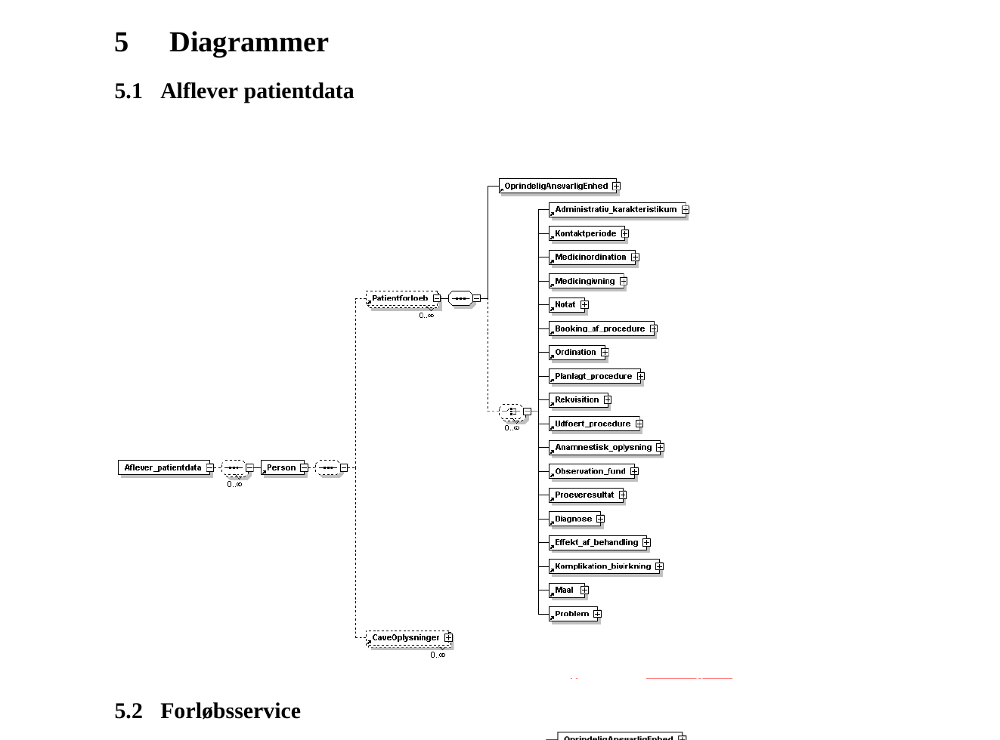

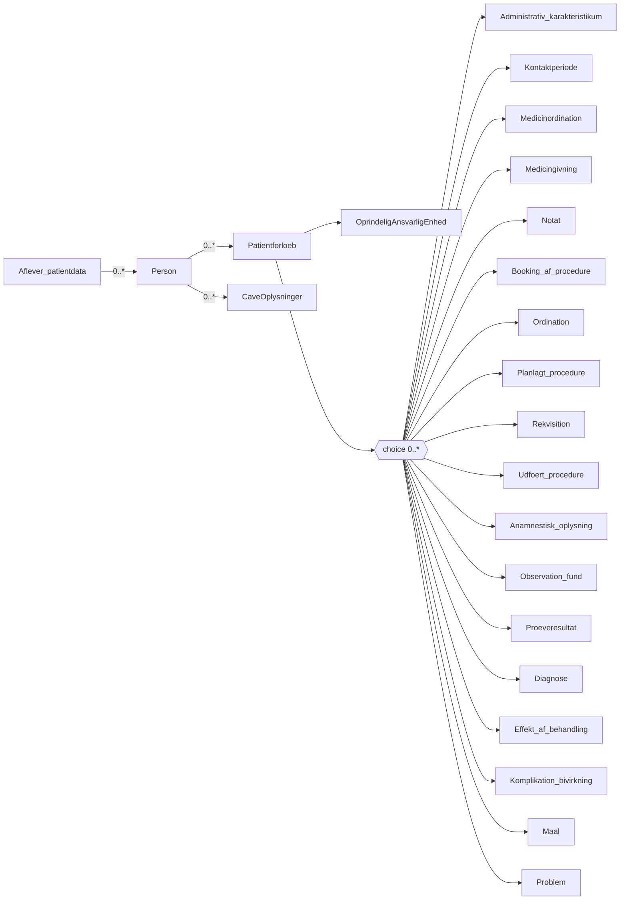
```mermaid
flowchart LR
  A[Aflever_patientdata] -->|0..*| P[Person]
  P -->|0..*| PF[Patientforloeb]
  P -->|0..*| C[CaveOplysninger]
  PF --> OA[OprindeligAnsvarligEnhed]
  PF --> CH{{choice 0..*}}
  CH --> AK[Administrativ_karakteristikum]
  CH --> KP[Kontaktperiode]
  CH --> MO[Medicinordination]
  CH --> MG[Medicingivning]
  CH --> N[Notat]
  CH --> B[Booking_af_procedure]
  CH --> O[Ordination]
  CH --> PP[Planlagt_procedure]
  CH --> R[Rekvisition]
  CH --> UP[Udfoert_procedure]
  CH --> AO[Anamnestisk_oplysning]
  CH --> OF[Observation_fund]
  CH --> PR[Proeveresultat]
  CH --> D[Diagnose]
  CH --> EB[Effekt_af_behandling]
  CH --> KB[Komplikation_bivirkning]
  CH --> M[Maal]
  CH --> PB[Problem]
```
Ekstern Mermaid-kilde: `bilag_04_v2_3_assets/bilag_04_v2_3_aflever_patientdata.mmd`.

### 5.2 Forløbsservice
<!-- Billedbeskrivelse: Person med PatientforloebOversigt og CaveOplysninger; forløbsoversigten indeholder oprindelig ansvarlig enhed og diagnoser. -->
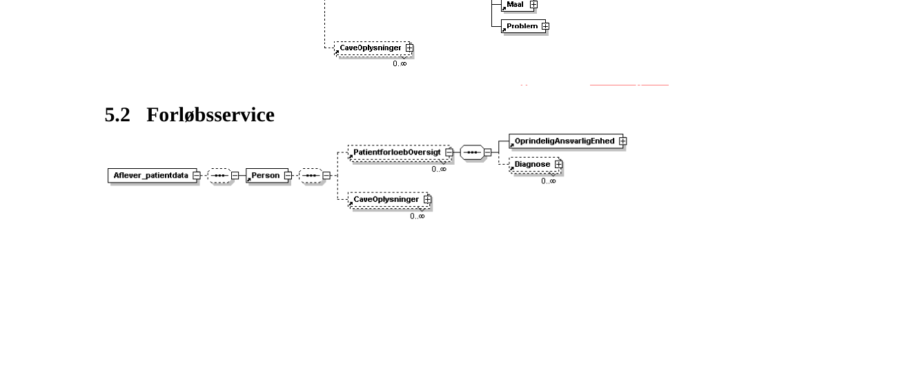

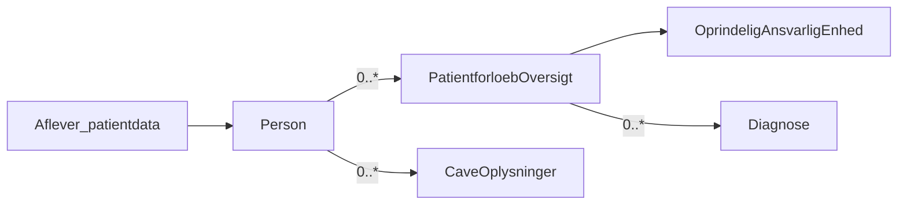
```mermaid
flowchart LR
  A[Aflever_patientdata] --> P[Person]
  P -->|0..*| F[PatientforloebOversigt]
  P -->|0..*| C[CaveOplysninger]
  F --> OA[OprindeligAnsvarligEnhed]
  F -->|0..*| D[Diagnose]
```
Ekstern Mermaid-kilde: `bilag_04_v2_3_assets/bilag_04_v2_3_forloebsservice.mmd`.

### 5.3 Hændelsesservice
<!-- Billedbeskrivelse: Patientforløb med alle hændelsestyper og CaveOplysninger, anvendt ved forespørgsel efter hændelser. -->
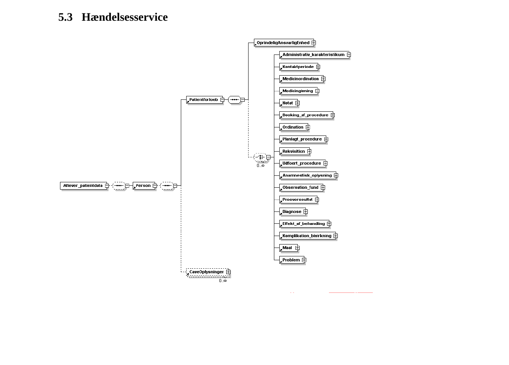

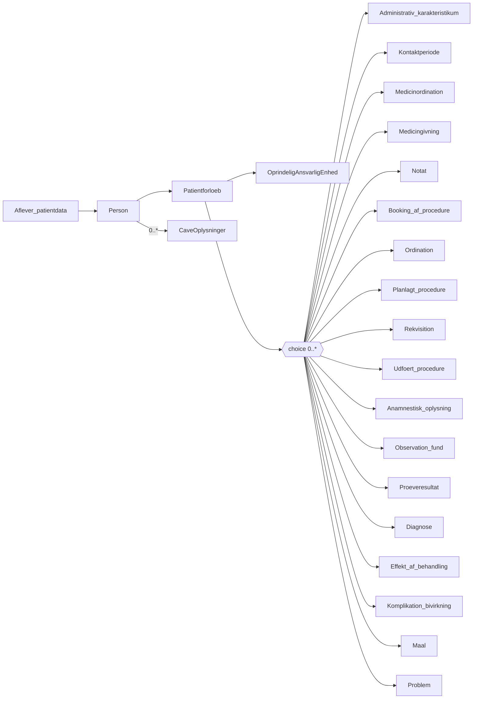
```mermaid
flowchart LR
  A[Aflever_patientdata] --> P[Person]
  P --> PF[Patientforloeb]
  P -->|0..*| C[CaveOplysninger]
  PF --> OA[OprindeligAnsvarligEnhed]
  PF --> CH{{choice 0..*}}
  CH --> AK[Administrativ_karakteristikum]
  CH --> KP[Kontaktperiode]
  CH --> MO[Medicinordination]
  CH --> MG[Medicingivning]
  CH --> N[Notat]
  CH --> B[Booking_af_procedure]
  CH --> O[Ordination]
  CH --> PP[Planlagt_procedure]
  CH --> R[Rekvisition]
  CH --> UP[Udfoert_procedure]
  CH --> AO[Anamnestisk_oplysning]
  CH --> OF[Observation_fund]
  CH --> PR[Proeveresultat]
  CH --> D[Diagnose]
  CH --> EB[Effekt_af_behandling]
  CH --> KB[Komplikation_bivirkning]
  CH --> M[Maal]
  CH --> PB[Problem]
```
Ekstern Mermaid-kilde: `bilag_04_v2_3_assets/bilag_04_v2_3_haendelsesservice.mmd`.

### 5.4 Enkelthændelsesservice
<!-- Billedbeskrivelse: Patientforløb med én valgt hændelsestype samt person/Cave-oplysninger. -->
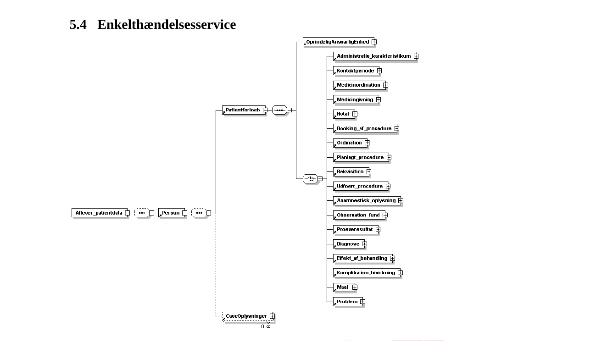

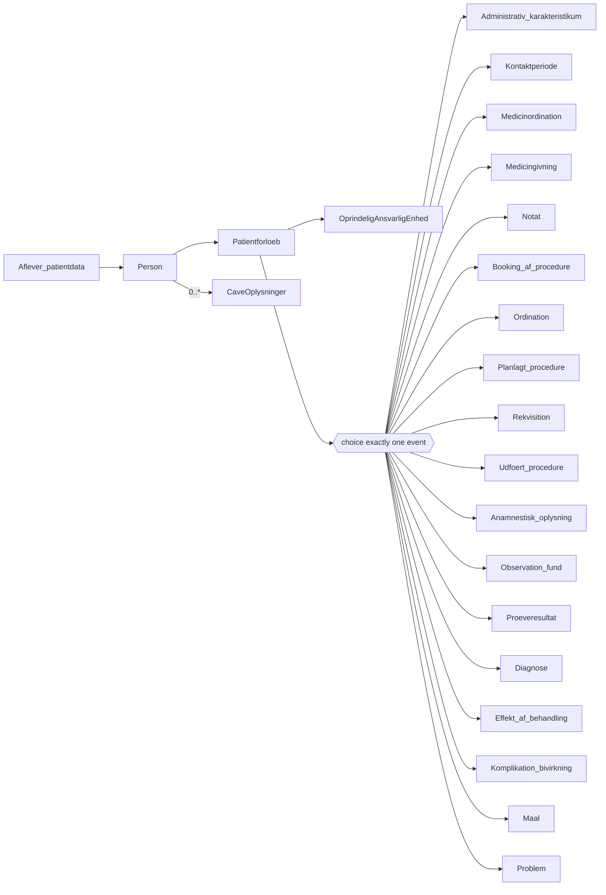
```mermaid
flowchart LR
  A[Aflever_patientdata] --> P[Person]
  P --> PF[Patientforloeb]
  P -->|0..*| C[CaveOplysninger]
  PF --> OA[OprindeligAnsvarligEnhed]
  PF --> CH{{choice exactly one event}}
  CH --> AK[Administrativ_karakteristikum]
  CH --> KP[Kontaktperiode]
  CH --> MO[Medicinordination]
  CH --> MG[Medicingivning]
  CH --> N[Notat]
  CH --> B[Booking_af_procedure]
  CH --> O[Ordination]
  CH --> PP[Planlagt_procedure]
  CH --> R[Rekvisition]
  CH --> UP[Udfoert_procedure]
  CH --> AO[Anamnestisk_oplysning]
  CH --> OF[Observation_fund]
  CH --> PR[Proeveresultat]
  CH --> D[Diagnose]
  CH --> EB[Effekt_af_behandling]
  CH --> KB[Komplikation_bivirkning]
  CH --> M[Maal]
  CH --> PB[Problem]
```
Ekstern Mermaid-kilde: `bilag_04_v2_3_assets/bilag_04_v2_3_enkelthaendelsesservice.mmd`.

### 5.5 Meddelelserservice
<!-- Billedbeskrivelse: Meddelelsesliste med Person/CPRnummer og nul eller flere meddelelser med dato, returtekst og returkode. -->
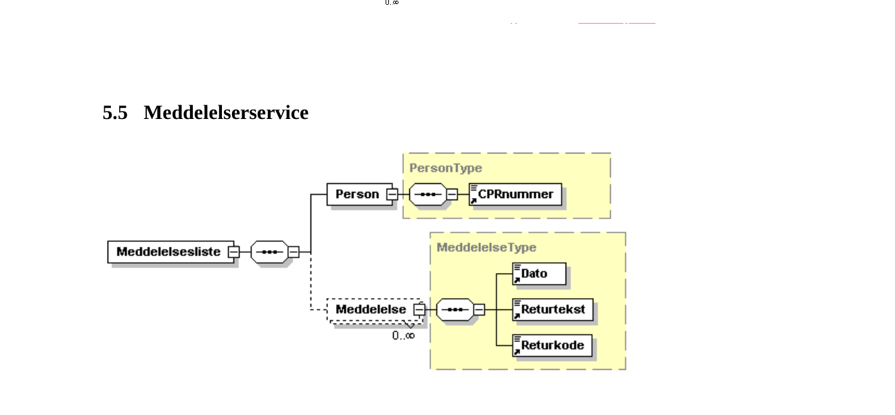

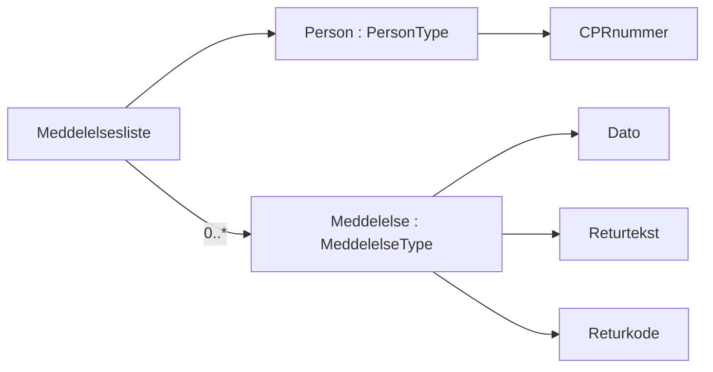
```mermaid
flowchart LR
  ML[Meddelelsesliste] --> P[Person : PersonType]
  P --> CPR[CPRnummer]
  ML -->|0..*| M[Meddelelse : MeddelelseType]
  M --> D[Dato]
  M --> T[Returtekst]
  M --> K[Returkode]
```
Ekstern Mermaid-kilde: `bilag_04_v2_3_assets/bilag_04_v2_3_meddelelserservice.mmd`.

### 5.6 SUPakutservice
<!-- Billedbeskrivelse: Meddelelsesliste med én person og én meddelelse som status på akut udtræk. -->
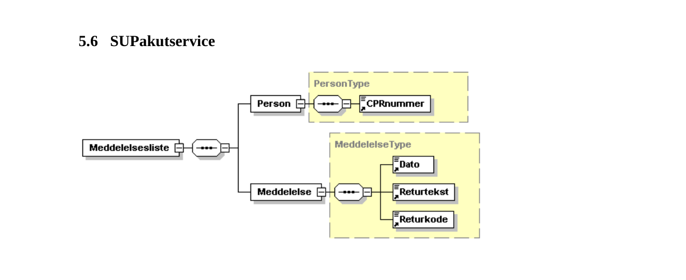

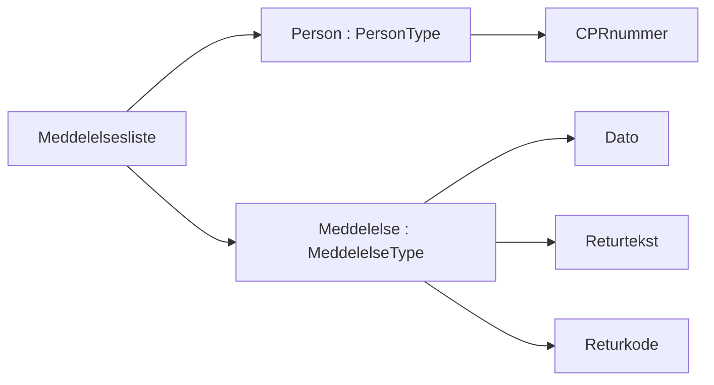
```mermaid
flowchart LR
  ML[Meddelelsesliste] --> P[Person : PersonType]
  P --> CPR[CPRnummer]
  ML --> M[Meddelelse : MeddelelseType]
  M --> D[Dato]
  M --> T[Returtekst]
  M --> K[Returkode]
```
Ekstern Mermaid-kilde: `bilag_04_v2_3_assets/bilag_04_v2_3_supakutservice.mmd`.

### 5.7 Administrative karakteristika
<!-- Billedbeskrivelse: Administrativt karakteristikum med hændelse, kode, valgfri årsag/afslutningsårsag og relationer til konstaterende/afsluttende aktører. -->
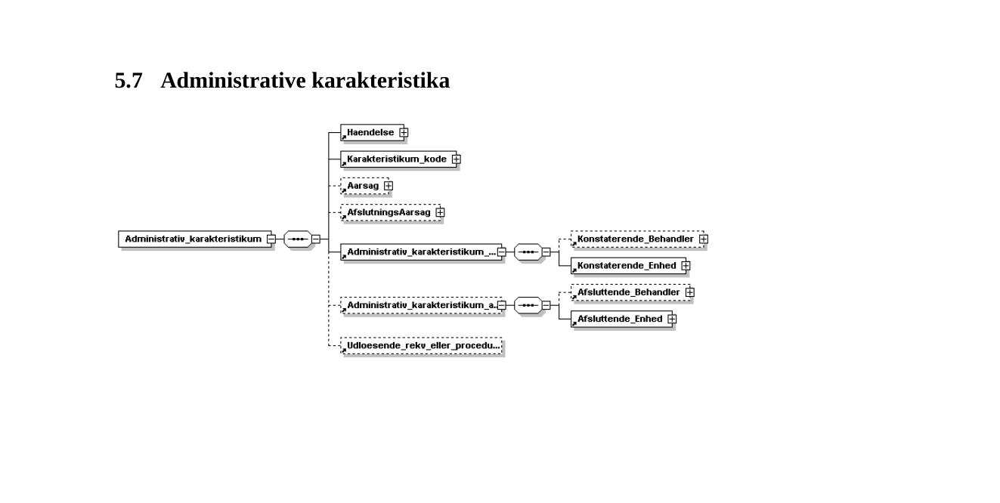

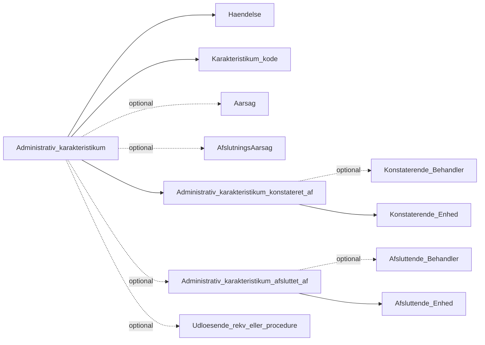
```mermaid
flowchart LR
  A[Administrativ_karakteristikum] --> H[Haendelse]
  A --> K[Karakteristikum_kode]
  A -. optional .-> AA[Aarsag]
  A -. optional .-> AF[AfslutningsAarsag]
  A --> KA[Administrativ_karakteristikum_konstateret_af]
  KA -. optional .-> KB[Konstaterende_Behandler]
  KA --> KE[Konstaterende_Enhed]
  A -. optional .-> SLA[Administrativ_karakteristikum_afsluttet_af]
  SLA -. optional .-> AB[Afsluttende_Behandler]
  SLA --> AE[Afsluttende_Enhed]
  A -. optional .-> U[Udloesende_rekv_eller_procedure]
```
Ekstern Mermaid-kilde: `bilag_04_v2_3_assets/bilag_04_v2_3_administrative_karakteristika.mmd`.

### 5.8 Kontaktperiode
<!-- Billedbeskrivelse: Kontaktperiode med status, indikation, prioritet, afslutningsårsag og ansvarlige/rekvirerende enheder og behandlere. -->
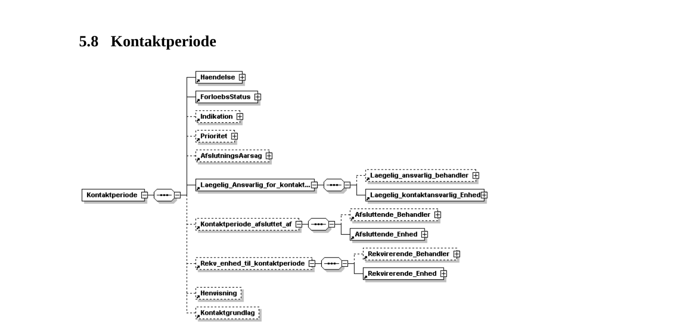

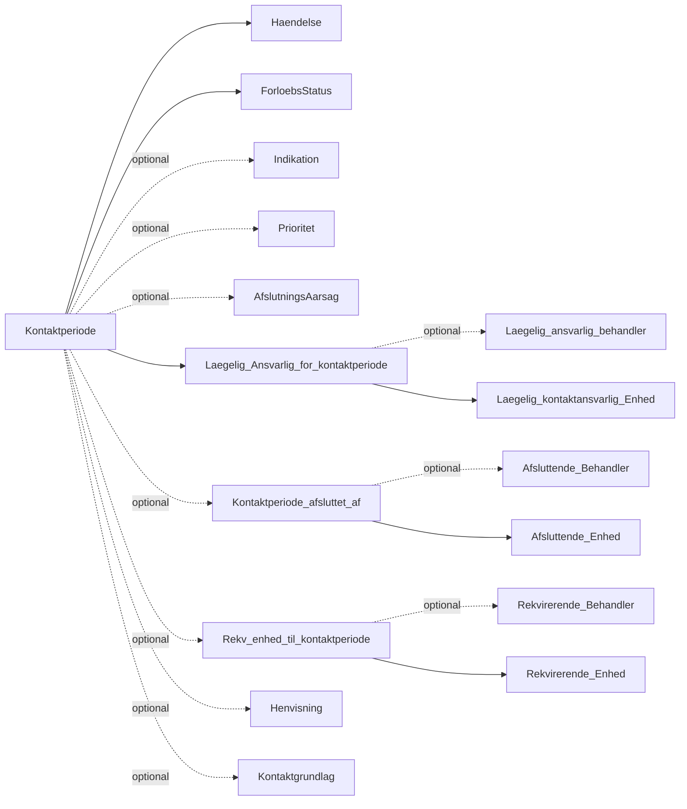
```mermaid
flowchart LR
  K[Kontaktperiode] --> H[Haendelse]
  K --> F[ForloebsStatus]
  K -. optional .-> I[Indikation]
  K -. optional .-> P[Prioritet]
  K -. optional .-> A[AfslutningsAarsag]
  K --> L[Laegelig_Ansvarlig_for_kontaktperiode]
  L -. optional .-> LB[Laegelig_ansvarlig_behandler]
  L --> LE[Laegelig_kontaktansvarlig_Enhed]
  K -. optional .-> AF[Kontaktperiode_afsluttet_af]
  AF -. optional .-> AB[Afsluttende_Behandler]
  AF --> AE[Afsluttende_Enhed]
  K -. optional .-> R[Rekv_enhed_til_kontaktperiode]
  R -. optional .-> RB[Rekvirerende_Behandler]
  R --> RE[Rekvirerende_Enhed]
  K -. optional .-> HV[Henvisning]
  K -. optional .-> KG[Kontaktgrundlag]
```
Ekstern Mermaid-kilde: `bilag_04_v2_3_assets/bilag_04_v2_3_kontaktperiode.mmd`.

### 5.9 Medicingivning
<!-- Billedbeskrivelse: Medicingivning med præparat/type, valgfrie kliniske koder og relationer til producerende, ordinerende og afsluttende aktører. -->
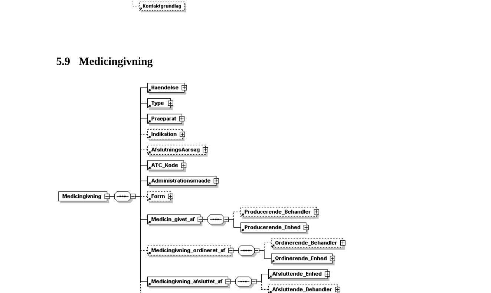

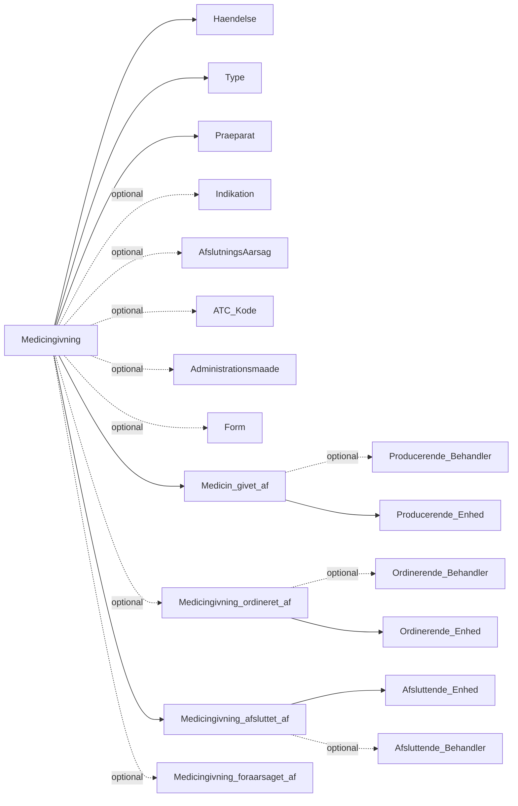
```mermaid
flowchart LR
  M[Medicingivning] --> H[Haendelse]
  M --> T[Type]
  M --> P[Praeparat]
  M -. optional .-> I[Indikation]
  M -. optional .-> A[AfslutningsAarsag]
  M -. optional .-> ATC[ATC_Kode]
  M -. optional .-> ADM[Administrationsmaade]
  M -. optional .-> F[Form]
  M --> G[Medicin_givet_af]
  G -. optional .-> PB[Producerende_Behandler]
  G --> PE[Producerende_Enhed]
  M -. optional .-> O[Medicingivning_ordineret_af]
  O -. optional .-> OB[Ordinerende_Behandler]
  O --> OE[Ordinerende_Enhed]
  M --> AF[Medicingivning_afsluttet_af]
  AF --> AE[Afsluttende_Enhed]
  AF -. optional .-> AB[Afsluttende_Behandler]
  M -. optional .-> FA[Medicingivning_foraarsaget_af]
```
Ekstern Mermaid-kilde: `bilag_04_v2_3_assets/bilag_04_v2_3_medicingivning.mmd`.

### 5.10 Notat
<!-- Billedbeskrivelse: Notat med hændelse, type, rekvirent, producent samt valgfrie procedurereferencer. -->
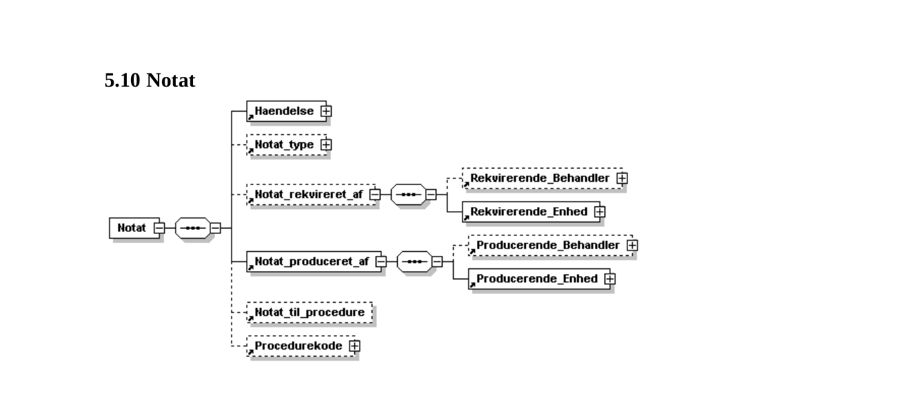

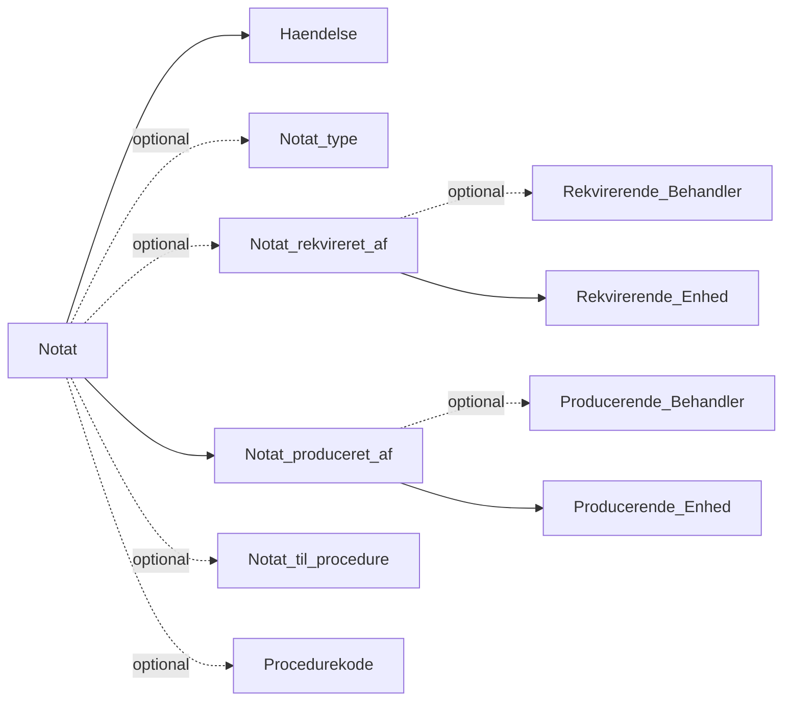
```mermaid
flowchart LR
  N[Notat] --> H[Haendelse]
  N -. optional .-> T[Notat_type]
  N -. optional .-> R[Notat_rekvireret_af]
  R -. optional .-> RB[Rekvirerende_Behandler]
  R --> RE[Rekvirerende_Enhed]
  N --> P[Notat_produceret_af]
  P -. optional .-> PB[Producerende_Behandler]
  P --> PE[Producerende_Enhed]
  N -. optional .-> TP[Notat_til_procedure]
  N -. optional .-> PK[Procedurekode]
```
Ekstern Mermaid-kilde: `bilag_04_v2_3_assets/bilag_04_v2_3_notat.mmd`.

### 5.11 Rekvisition
<!-- Billedbeskrivelse: Rekvisition med procedurekode, indikation/prioritet, rekvirent, planlagt producent og valgfri afslutning. -->
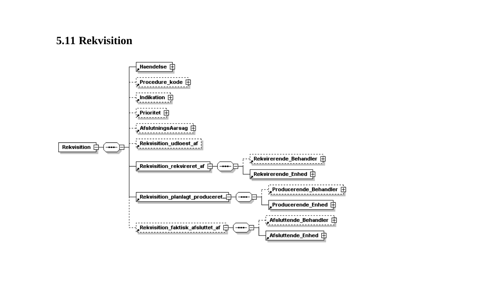

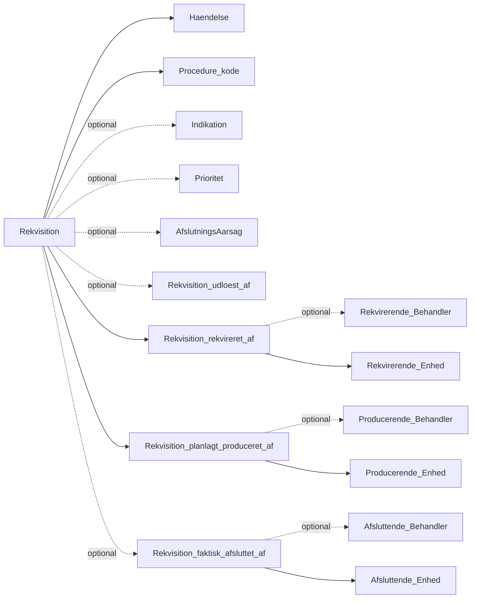
```mermaid
flowchart LR
  R[Rekvisition] --> H[Haendelse]
  R --> PK[Procedure_kode]
  R -. optional .-> I[Indikation]
  R -. optional .-> P[Prioritet]
  R -. optional .-> A[AfslutningsAarsag]
  R -. optional .-> U[Rekvisition_udloest_af]
  R --> RR[Rekvisition_rekvireret_af]
  RR -. optional .-> RB[Rekvirerende_Behandler]
  RR --> RE[Rekvirerende_Enhed]
  R --> PP[Rekvisition_planlagt_produceret_af]
  PP -. optional .-> PB[Producerende_Behandler]
  PP --> PE[Producerende_Enhed]
  R -. optional .-> AF[Rekvisition_faktisk_afsluttet_af]
  AF -. optional .-> AB[Afsluttende_Behandler]
  AF --> AE[Afsluttende_Enhed]
```
Ekstern Mermaid-kilde: `bilag_04_v2_3_assets/bilag_04_v2_3_rekvisition.mmd`.

### 5.12 Prøveresultat
<!-- Billedbeskrivelse: Prøveresultat med resultat, undersøgelses-/lokaliseringsoplysninger og rekvirerende/producerende aktører. -->
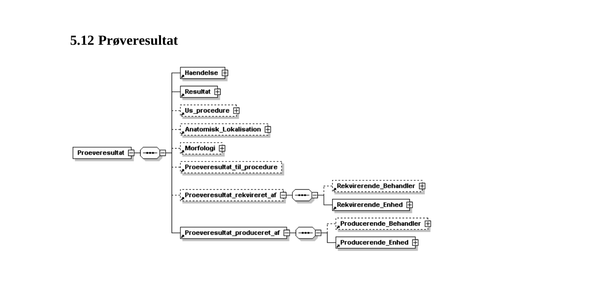

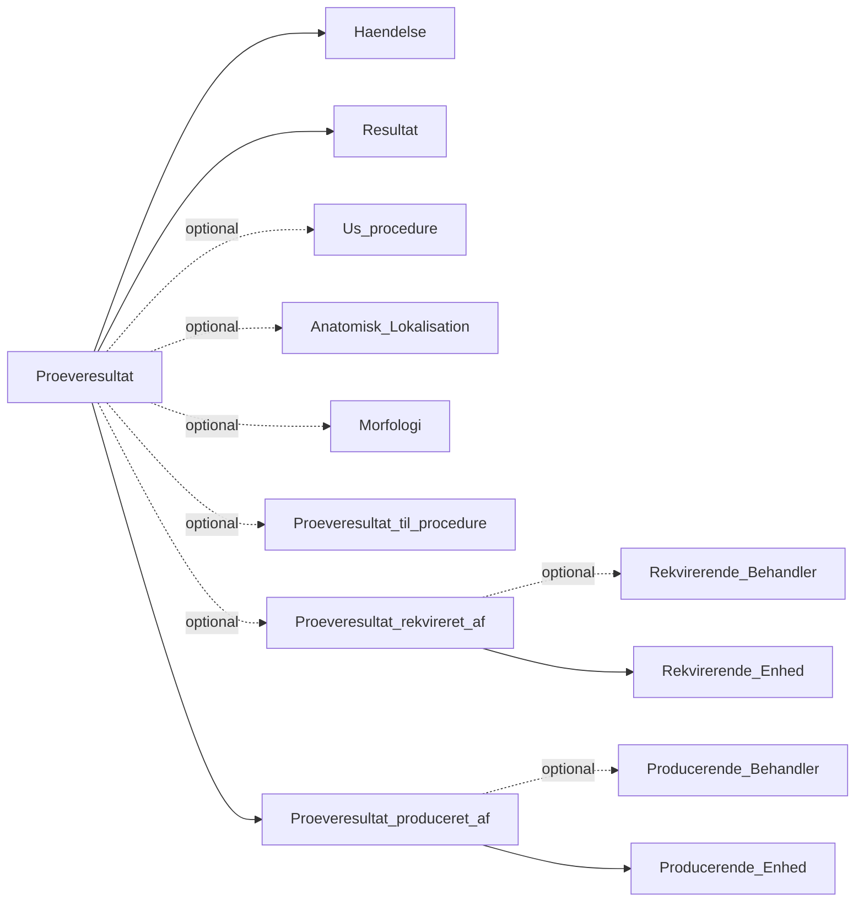
```mermaid
flowchart LR
  P[Proeveresultat] --> H[Haendelse]
  P --> R[Resultat]
  P -. optional .-> U[Us_procedure]
  P -. optional .-> A[Anatomisk_Lokalisation]
  P -. optional .-> M[Morfologi]
  P -. optional .-> TP[Proeveresultat_til_procedure]
  P -. optional .-> RR[Proeveresultat_rekvireret_af]
  RR -. optional .-> RB[Rekvirerende_Behandler]
  RR --> RE[Rekvirerende_Enhed]
  P --> PR[Proeveresultat_produceret_af]
  PR -. optional .-> PB[Producerende_Behandler]
  PR --> PE[Producerende_Enhed]
```
Ekstern Mermaid-kilde: `bilag_04_v2_3_assets/bilag_04_v2_3_proeveresultat.mmd`.

### 5.13 Diagnose
<!-- Billedbeskrivelse: Diagnose med art, diagnosekode, diagnosticerende aktører samt valgfri afslutning og procedurereference. -->
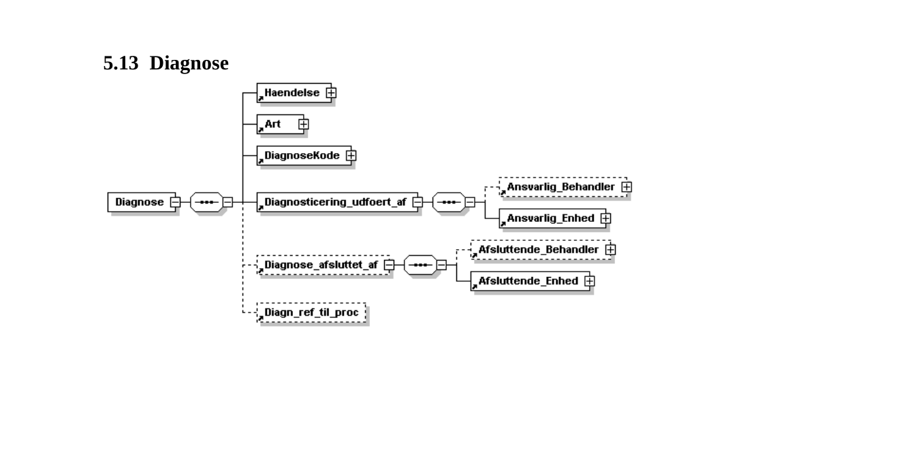

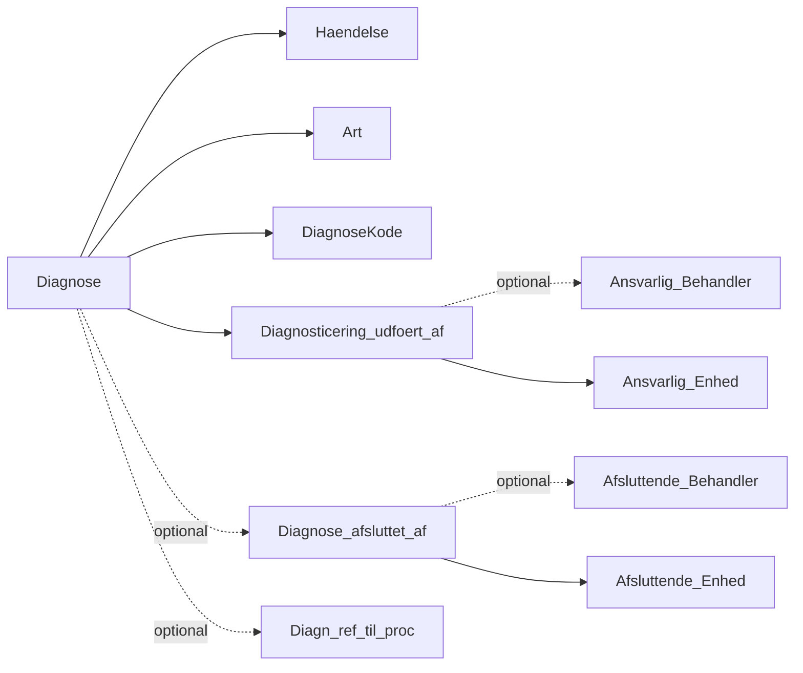
```mermaid
flowchart LR
  D[Diagnose] --> H[Haendelse]
  D --> A[Art]
  D --> K[DiagnoseKode]
  D --> U[Diagnosticering_udfoert_af]
  U -. optional .-> B[Ansvarlig_Behandler]
  U --> E[Ansvarlig_Enhed]
  D -. optional .-> AF[Diagnose_afsluttet_af]
  AF -. optional .-> AB[Afsluttende_Behandler]
  AF --> AE[Afsluttende_Enhed]
  D -. optional .-> RP[Diagn_ref_til_proc]
```
Ekstern Mermaid-kilde: `bilag_04_v2_3_assets/bilag_04_v2_3_diagnose.mmd`.

## 6 Sourcetekst og 7 Include XML schemaer
> **Normativitet:** Kilden angiver Sourcetekst med tilhørende Include-filer som den normative specifikation af XML-formatet. Teksten nedenfor er derfor bevaret som XML/XSD-orienteret kildetekst side for side.

### Kildeside 20
```xml
6
Sourcetekst
6.1 Aflever Patientdata XML schema
SUPAfleverPatientdataService.xsd
<?xml version="1.0" encoding="ISO-8859-1"?>
<xsd:schema targetNamespace="http://www.vejleamt.dk/SUP_20" xmlns:xsd="http://www.w3.org/2001/XMLSchema"
xmlns="http://www.vejleamt.dk/SUP_20">
<xsd:annotation>
<xsd:documentation>SUP II version 2.0 XML schema for output af "Aflever patientdata"</xsd:documentation>
</xsd:annotation>
<xsd:include schemaLocation="SUPTyper.xsd"/>
<xsd:include schemaLocation="SUPFaellesAttributter.xsd"/>
<xsd:include schemaLocation="SUPPatientforloeb.xsd"/>
<xsd:annotation>
<xsd:documentation>
Giver for et cpr-nummer alle forløb med alle hændelser for en given periode samt personoplysninger.
Hændelser uden et forløb tilkyttet i fødesystemet (PAS/EPJ system) sendes med et teknisk oprettet
forløb til SUP databasen.
</xsd:documentation>
</xsd:annotation>
<xsd:element name="Aflever_patientdata">
<xsd:complexType>
<xsd:sequence minOccurs="0" maxOccurs="unbounded">
<xsd:element ref="Person"/>
</xsd:sequence>
<xsd:attributeGroup ref="AfleverPatientdataAttributter"/>
</xsd:complexType>
</xsd:element>
<xsd:element name="Person">
<xsd:complexType>
```

### Kildeside 21
```xml
<xsd:sequence minOccurs="0">
<xsd:element ref="Patientforloeb" minOccurs="0" maxOccurs="unbounded"/>
<xsd:element ref="CaveOplysninger" minOccurs="0" maxOccurs="unbounded"/>
</xsd:sequence>
<xsd:attributeGroup ref="PersonAttributter"/>
</xsd:complexType>
</xsd:element>
</xsd:schema>
6.2
Forløbsservice XML Schema.
SUPForloebsService.xsd
<?xml version="1.0" encoding="ISO-8859-1"?>
<xsd:schema targetNamespace="http://www.vejleamt.dk/SUP_20" xmlns="http://www.vejleamt.dk/SUP_20"
xmlns:xsd="http://www.w3.org/2001/XMLSchema">
<xsd:annotation>
<xsd:documentation>SUP II version 2.0 schema for "Forloebs-Service".</xsd:documentation>
</xsd:annotation>
<xsd:include schemaLocation="SUPFaellesAttributter.xsd"/>
<xsd:include schemaLocation="SUPVurdering.xsd"/>
<xsd:annotation>
<xsd:documentation>
Giver for et cpr-nummer personoplysninger og liste over alle forløb for en given periode.
</xsd:documentation>
</xsd:annotation>
<xsd:element name="Aflever_patientdata">
<xsd:complexType>
<xsd:sequence minOccurs="0">
<xsd:element ref="Person"/>
</xsd:sequence>
<xsd:attributeGroup ref="AfleverPatientdataAttributter"/>
</xsd:complexType>
</xsd:element>
<xsd:element name="Person">
<xsd:complexType>
```

### Kildeside 22
```xml
<xsd:sequence minOccurs="0">
<xsd:element ref="PatientforloebOversigt" minOccurs="0" maxOccurs="unbounded"/>
<xsd:element ref="CaveOplysninger" minOccurs="0" maxOccurs="unbounded"/>
</xsd:sequence>
<xsd:attributeGroup ref="PersonAttributter"/>
</xsd:complexType>
</xsd:element>
<xsd:element name="PatientforloebOversigt">
<xsd:complexType>
<xsd:sequence>
<xsd:element ref="OprindeligAnsvarligEnhed"/>
<xsd:element ref="Diagnose" minOccurs="0" maxOccurs="unbounded"/>
</xsd:sequence>
<xsd:attribute name="Identifikation" type="xsd:string" use="required"/>
<xsd:attribute name="Starttidspunkt" type="SUPdateTime" use="optional"/>
<xsd:attribute name="Sluttidspunkt" type="SUPdateTime" use="optional"/>
<xsd:attribute name="Teknisk_forloeb" use="optional">
<xsd:simpleType>
<xsd:restriction base="xsd:string">
<xsd:enumeration value="X"/>
</xsd:restriction>
</xsd:simpleType>
</xsd:attribute>
<xsd:attribute name="Foedesystem" type="xsd:string" use="required"/>
<xsd:attribute name="Udtraekstidspunkt" type="SUPdateTime" use="optional"/>
</xsd:complexType>
</xsd:element>
</xsd:schema>
6.3 Hændelsesservice XML schema
SUPHaendelsesService.XSD
<?xml version="1.0" encoding="ISO-8859-1"?>
<xsd:schema targetNamespace="http://www.vejleamt.dk/SUP_20" xmlns="http://www.vejleamt.dk/SUP_20"
xmlns:xsd="http://www.w3.org/2001/XMLSchema">
```

### Kildeside 23
```xml
<xsd:include schemaLocation="SUPFaellesAttributter.xsd"/>
<xsd:include schemaLocation="SUPPatientforloeb.xsd"/>
<xsd:annotation>
<xsd:documentation>
Giver for et cpr-nummer og et forløb alle hændelser for en given periode.
Hvis forløb ikke er angivet som input til servicen returneres alle forløb i perioden.
Hændelser uden et forløb tilkyttet i fødesystemet (PAS/EPJ system) sendes med et teknisk oprettet
forløb til SUP databasen.
</xsd:documentation>
</xsd:annotation>
<xsd:element name="Aflever_patientdata">
<xsd:complexType>
<xsd:sequence minOccurs="0">
<xsd:element ref="Person"/>
</xsd:sequence>
<xsd:attributeGroup ref="AfleverPatientdataAttributter"/>
</xsd:complexType>
</xsd:element>
<xsd:element name="Person">
<xsd:complexType>
<xsd:sequence minOccurs="0">
<xsd:element ref="Patientforloeb"/>
<xsd:element ref="CaveOplysninger" minOccurs="0" maxOccurs="unbounded"/>
</xsd:sequence>
<xsd:attributeGroup ref="PersonAttributter"/>
</xsd:complexType>
</xsd:element>
</xsd:schema>
6.4
Enkelt hændelsesservice XML schema
SUPEnkeltHaendelsesService.xsd
<?xml version="1.0" encoding="ISO-8859-1"?>
<xsd:schema targetNamespace="http://www.vejleamt.dk/SUP_20" xmlns="http://www.vejleamt.dk/SUP_20"
xmlns:xsd="http://www.w3.org/2001/XMLSchema">
```

### Kildeside 24
```xml
<xsd:annotation>
<xsd:documentation>SUP II version 2.0 XML schema for "EnkelHændelsse-Service".</xsd:documentation>
</xsd:annotation>
<xsd:include schemaLocation="SUPTyper.xsd"/>
<xsd:include schemaLocation="SUPFaellesAttributter.xsd"/>
<xsd:include schemaLocation="SUPEnkeltHaendelsePatientforloeb.xsd"/>
<xsd:annotation>
<xsd:documentation>
Giver for et cpr-nummer og hændelsesid detailoplysninger på hændelsen, tilknyttet forløb og person.
Hændelser uden et forløb tilkyttet i fødesystemet (PAS/EPJ system) sendes med et teknisk oprettet
forløb til SUP databasen.
</xsd:documentation>
</xsd:annotation>
<xsd:element name="Aflever_patientdata">
<xsd:complexType>
<xsd:sequence minOccurs="0">
<xsd:element ref="Person"/>
</xsd:sequence>
<xsd:attributeGroup ref="AfleverPatientdataAttributter"/>
</xsd:complexType>
</xsd:element>
<xsd:element name="Person">
<xsd:complexType>
<xsd:sequence minOccurs="0">
<xsd:element ref="Patientforloeb"/>
<xsd:element ref="CaveOplysninger" minOccurs="0" maxOccurs="unbounded"/>
</xsd:sequence>
<xsd:attributeGroup ref="PersonAttributter"/>
</xsd:complexType>
</xsd:element>
</xsd:schema>
6.5 Meddelelserservice XML schema
SUPMeddelelserService.xsd
```

### Kildeside 25
```xml
<?xml version="1.0" encoding="ISO-8859-1"?>
<xsd:schema targetNamespace="http://www.vejleamt.dk/SUP_20" xmlns="http://www.vejleamt.dk/SUP_20"
xmlns:xsd="http://www.w3.org/2001/XMLSchema">
<xsd:annotation>
<xsd:documentation>SUP II version 2.0 XML schema for "Meddelelser-Service".</xsd:documentation>
</xsd:annotation>
<xsd:include schemaLocation="SUPTyper.xsd"/>
<xsd:annotation>
<xsd:documentation>
Giver for et cpr-nummer liste over alle meddelelser vedrørende udtræk til SUB databasen.
</xsd:documentation>
</xsd:annotation>
<xsd:complexType name="MeddelelseType">
<xsd:sequence>
<xsd:element ref="Dato"/>
<xsd:element ref="Returtekst"/>
<xsd:element ref="Returkode"/>
</xsd:sequence>
</xsd:complexType>
<xsd:element name="Meddelelsesliste">
<xsd:complexType>
<xsd:sequence>
<xsd:element name="Person" type="PersonType"/>
<xsd:element name="Meddelelse" type="MeddelelseType" minOccurs="0" maxOccurs="unbounded"/>
</xsd:sequence>
</xsd:complexType>
</xsd:element>
<xsd:complexType name="PersonType">
<xsd:sequence>
<xsd:element ref="CPRnummer"/>
</xsd:sequence>
</xsd:complexType>
<xsd:element name="CPRnummer" type="xsd:string"/>
<xsd:element name="Dato" type="SUPdateTime"/>
<xsd:element name="Returtekst" type="xsd:string"/>
<xsd:element name="Returkode" type="xsd:nonNegativeInteger"/>
</xsd:schema>
```

### Kildeside 26
```xml
6.6  SUPakut XML schema
SUPAkutService.xsd
<?xml version="1.0" encoding="ISO-8859-1"?>
<xsd:schema targetNamespace="http://www.vejleamt.dk/SUP_20" xmlns:xsd="http://www.w3.org/2001/XMLSchema"
xmlns="http://www.vejleamt.dk/SUP_20">
<xsd:annotation>
<xsd:documentation>SUP II version 2.0 XML schema for "SUPakut-Service".</xsd:documentation>
</xsd:annotation>
<xsd:include schemaLocation="SUPTyper.xsd"/>
<xsd:annotation>
<xsd:documentation>
Angiver status på akut bestilt udtræk af patientdata hos EPJ/PAS udtræksprogrammel.
</xsd:documentation>
</xsd:annotation>
<xsd:complexType name="MeddelelseType">
<xsd:sequence>
<xsd:element ref="Dato"/>
<xsd:element ref="Returtekst"/>
<xsd:element ref="Returkode"/>
</xsd:sequence>
</xsd:complexType>
<xsd:element name="Meddelelsesliste">
<xsd:complexType>
<xsd:sequence>
<xsd:element name="Person" type="PersonType"/>
<xsd:element name="Meddelelse" type="MeddelelseType"/>
</xsd:sequence>
</xsd:complexType>
</xsd:element>
<xsd:complexType name="PersonType">
<xsd:sequence>
<xsd:element ref="CPRnummer"/>
</xsd:sequence>
</xsd:complexType>
<xsd:element name="CPRnummer" type="xsd:string"/>
```

### Kildeside 27
```xml
<xsd:element name="Dato" type="SUPdateTime"/>
<xsd:element name="Returtekst" type="xsd:string"/>
<xsd:element name="Returkode" type="xsd:nonNegativeInteger"/>
</xsd:schema>
```

### Kildeside 28
```xml
7
Include XML schemaer
7.1 Persondata
SUPPersondata.xsd
<?xml version="1.0" encoding="ISO-8859-1"?>
<xsd:schema targetNamespace="http://www.vejleamt.dk/SUP_20" xmlns="http://www.vejleamt.dk/SUP_20"
xmlns:xsd="http://www.w3.org/2001/XMLSchema">
<xsd:annotation>
<xsd:documentation>SUP II version 2.0 XML schema for "Person"</xsd:documentation>
</xsd:annotation>
<xsd:include schemaLocation="SUPFaellesAttributter.xsd"/>
<xsd:include schemaLocation="SUPOrganisation.xsd"/>
<xsd:include schemaLocation="SUPPatientforloeb.xsd"/>
<xsd:element name="Person">
<xsd:complexType>
<xsd:sequence minOccurs="0">
<xsd:element ref="Patientforloeb" minOccurs="0" maxOccurs="unbounded"/>
<xsd:element ref="CaveOplysninger" minOccurs="0" maxOccurs="unbounded"/>
</xsd:sequence>
<xsd:attributeGroup ref="PersonAttributter"/>
</xsd:complexType>
</xsd:element>
</xsd:schema>
7.2 Enkelthændelse patientforløb
SUPEnkelthaendelsePatientforloeb.xsd
<?xml version="1.0" encoding="ISO-8859-1"?>
<xsd:schema targetNamespace="http://www.vejleamt.dk/SUP_20" xmlns="http://www.vejleamt.dk/SUP_20"
xmlns:xsd="http://www.w3.org/2001/XMLSchema">
<xsd:annotation>
<xsd:documentation>SUP II version 2.0 XML schema for "Patientforløb"</xsd:documentation>
```

### Kildeside 29
```xml
</xsd:annotation>
<xsd:include schemaLocation="SUPAdministrativeKarakteristika.xsd"/>
<xsd:include schemaLocation="SUPResultat.xsd"/>
<xsd:include schemaLocation="SUPVurdering.xsd"/>
<xsd:include schemaLocation="SUPMedicinering.xsd"/>
<xsd:include schemaLocation="SUPKontaktperiode.xsd"/>
<xsd:include schemaLocation="SUPNotat.xsd"/>
<xsd:include schemaLocation="SUPProcedureProces.xsd"/>
<xsd:element name="Patientforloeb">
<xsd:complexType>
<xsd:sequence>
<xsd:element ref="OprindeligAnsvarligEnhed"/>
<xsd:choice>
<xsd:element ref="Administrativ_karakteristikum"/>
<xsd:element ref="Kontaktperiode"/>
<xsd:element ref="Medicinordination"/>
<xsd:element ref="Medicingivning"/>
<xsd:element ref="Notat"/>
<xsd:element ref="Booking_af_procedure"/>
<xsd:element ref="Ordination"/>
<xsd:element ref="Planlagt_procedure"/>
<xsd:element ref="Rekvisition"/>
<xsd:element ref="Udfoert_procedure"/>
<xsd:element ref="Anamnestisk_oplysning"/>
<xsd:element ref="Observation_fund"/>
<xsd:element ref="Proeveresultat"/>
<xsd:element ref="Diagnose"/>
<xsd:element ref="Effekt_af_behandling"/>
<xsd:element ref="Komplikation_bivirkning"/>
<xsd:element ref="Maal"/>
<xsd:element ref="Problem"/>
</xsd:choice>
</xsd:sequence>
<xsd:attribute name="Identifikation" type="xsd:string" use="required"/>
<xsd:attribute name="Starttidspunkt" type="SUPdateTime" use="optional"/>
<xsd:attribute name="Sluttidspunkt" type="SUPdateTime" use="optional"/>
<xsd:attribute name="Teknisk_forloeb" use="optional">
```

### Kildeside 30
```xml
<xsd:simpleType>
<xsd:restriction base="xsd:string">
<xsd:enumeration value="X"/>
</xsd:restriction>
</xsd:simpleType>
</xsd:attribute>
<xsd:attribute name="Foedesystem" type="xsd:string" use="required"/>
<xsd:attribute name="Udtraekstidspunkt" type="SUPdateTime" use="optional"/>
</xsd:complexType>
</xsd:element>
</xsd:schema>
7.3 Patientforløb
SUPPatientforloeb.xsd
<?xml version="1.0" encoding="ISO-8859-1"?>
<xsd:schema targetNamespace="http://www.vejleamt.dk/SUP_20" xmlns="http://www.vejleamt.dk/SUP_20"
xmlns:xsd="http://www.w3.org/2001/XMLSchema">
<xsd:annotation>
<xsd:documentation>SUP II version 2.0 XML schema for "Patientforløb"</xsd:documentation>
</xsd:annotation>
<xsd:include schemaLocation="SUPAdministrativeKarakteristika.xsd"/>
<xsd:include schemaLocation="SUPResultat.xsd"/>
<xsd:include schemaLocation="SUPVurdering.xsd"/>
<xsd:include schemaLocation="SUPMedicinering.xsd"/>
<xsd:include schemaLocation="SUPKontaktperiode.xsd"/>
<xsd:include schemaLocation="SUPNotat.xsd"/>
<xsd:include schemaLocation="SUPProcedureProces.xsd"/>
<xsd:element name="Patientforloeb">
<xsd:complexType>
<xsd:sequence>
<xsd:element ref="OprindeligAnsvarligEnhed"/>
<xsd:choice minOccurs="0" maxOccurs="unbounded">
<xsd:element ref="Administrativ_karakteristikum"/>
<xsd:element ref="Kontaktperiode"/>
```

### Kildeside 31
```xml
<xsd:element ref="Medicinordination"/>
<xsd:element ref="Medicingivning"/>
<xsd:element ref="Notat"/>
<xsd:element ref="Booking_af_procedure"/>
<xsd:element ref="Ordination"/>
<xsd:element ref="Planlagt_procedure"/>
<xsd:element ref="Rekvisition"/>
<xsd:element ref="Udfoert_procedure"/>
<xsd:element ref="Anamnestisk_oplysning"/>
<xsd:element ref="Observation_fund"/>
<xsd:element ref="Proeveresultat"/>
<xsd:element ref="Diagnose"/>
<xsd:element ref="Effekt_af_behandling"/>
<xsd:element ref="Komplikation_bivirkning"/>
<xsd:element ref="Maal"/>
<xsd:element ref="Problem"/>
</xsd:choice>
</xsd:sequence>
<xsd:attribute name="Identifikation" type="xsd:string" use="required"/>
<xsd:attribute name="Starttidspunkt" type="SUPdateTime" use="optional"/>
<xsd:attribute name="Sluttidspunkt" type="SUPdateTime" use="optional"/>
<xsd:attribute name="Teknisk_forloeb" use="optional">
<xsd:simpleType>
<xsd:restriction base="xsd:string">
<xsd:enumeration value="X"/>
</xsd:restriction>
</xsd:simpleType>
</xsd:attribute>
<xsd:attribute name="Foedesystem" type="xsd:string" use="required"/>
<xsd:attribute name="Udtraekstidspunkt" type="SUPdateTime" use="optional"/>
</xsd:complexType>
</xsd:element>
</xsd:schema>
```

### Kildeside 32
```xml
7.4
Administrative karakteristika
SUPAdministrativeKarakteristika.xsd
<?xml version="1.0" encoding="ISO-8859-1"?>
<xsd:schema targetNamespace="http://www.vejleamt.dk/SUP_20" xmlns:xsd="http://www.w3.org/2001/XMLSchema"
xmlns="http://www.vejleamt.dk/SUP_20">
<xsd:include schemaLocation="SUPTyper.xsd"/>
<xsd:include schemaLocation="SUPBehandlere.xsd"/>
<xsd:include schemaLocation="SUPOrganisation.xsd"/>
<xsd:include schemaLocation="SUPKlassifikation.xsd"/>
<xsd:include schemaLocation="SUPFaellesAttributter.xsd"/>
<xsd:include schemaLocation="SUPHaendelse.xsd"/>
<!-- ====================== Pakke: Administrative Karakteristika ==============-->
<xsd:element name="Administrativ_karakteristikum">
<xsd:complexType>
<xsd:sequence>
<xsd:element ref="Haendelse"/>
<xsd:element ref="Karakteristikum_kode"/>
<xsd:element ref="Aarsag" minOccurs="0"/>
<xsd:element ref="AfslutningsAarsag" minOccurs="0"/>
<xsd:element ref="Administrativ_karakteristikum_konstateret_af"/>
<xsd:element ref="Administrativ_karakteristikum_afsluttet_af" minOccurs="0"/>
<xsd:element ref="Udloesende_rekv_eller_procedure" minOccurs="0"/>
</xsd:sequence>
<xsd:attribute name="Starttidspunkt" type="SUPdateTime" use="required"/>
<xsd:attribute name="SlutTidspunkt" type="SUPdateTime" use="optional"/>
<xsd:attribute name="AfslutTidspunkt" type="SUPdateTime" use="optional"/>
</xsd:complexType>
</xsd:element>
<xsd:element name="Administrativ_karakteristikum_afsluttet_af">
<xsd:complexType>
<xsd:sequence>
<xsd:element ref="Afsluttende_Behandler" minOccurs="0"/>
<xsd:element ref="Afsluttende_Enhed"/>
</xsd:sequence>
</xsd:complexType>
```

### Kildeside 33
```xml
</xsd:element>
<xsd:element name="Administrativ_karakteristikum_konstateret_af">
<xsd:complexType>
<xsd:sequence>
<xsd:element ref="Konstaterende_Behandler" minOccurs="0"/>
<xsd:element ref="Konstaterende_Enhed"/>
</xsd:sequence>
</xsd:complexType>
</xsd:element>
<xsd:element name="Karakteristikum_kode">
<xsd:complexType>
<xsd:sequence>
<xsd:element ref="SammensatKodetVaerdi"/>
</xsd:sequence>
</xsd:complexType>
</xsd:element>
<xsd:element name="Udloesende_rekv_eller_procedure">
<xsd:complexType>
<xsd:attribute name="Rekvisition_Procedure_Identifikation" type="xsd:string" use="required"/>
</xsd:complexType>
</xsd:element>
</xsd:schema>
7.5
Kontakperiode
SUPKontaktperiode.xsd
<?xml version="1.0" encoding="ISO-8859-1"?>
<xsd:schema targetNamespace="http://www.vejleamt.dk/SUP_20" xmlns="http://www.vejleamt.dk/SUP_20"
xmlns:xsd="http://www.w3.org/2001/XMLSchema">
<xsd:include schemaLocation="SUPTyper.xsd"/>
<xsd:include schemaLocation="SUPKlassifikation.xsd"/>
<xsd:include schemaLocation="SUPOrganisation.xsd"/>
<xsd:include schemaLocation="SUPBehandlere.xsd"/>
<xsd:include schemaLocation="SUPFaellesAttributter.xsd"/>
<xsd:include schemaLocation="SUPHaendelse.xsd"/>
```

### Kildeside 34
```xml
<!-- ====================== Pakke: Kontaktperiode =========================-->
<xsd:element name="Kontaktperiode">
<xsd:complexType>
<xsd:sequence>
<xsd:element ref="Haendelse"/>
<xsd:element ref="ForloebsStatus"/>
<xsd:element ref="Indikation" minOccurs="0"/>
<xsd:element ref="Prioritet" minOccurs="0"/>
<xsd:element ref="AfslutningsAarsag" minOccurs="0"/>
<xsd:element ref="Laegelig_Ansvarlig_for_kontaktperiode"/>
<xsd:element ref="Kontaktperiode_afsluttet_af" minOccurs="0"/>
<xsd:element ref="Rekv_enhed_til_kontaktperiode" minOccurs="0"/>
<xsd:element ref="Henvisning" minOccurs="0"/>
<xsd:element ref="Kontaktgrundlag" minOccurs="0"/>
</xsd:sequence>
<xsd:attribute name="StartTidspunkt" type="SUPdateTime" use="required"/>
<xsd:attribute name="Afslutningstidspunkt" type="SUPdateTime" use="optional"/>
</xsd:complexType>
</xsd:element>
<xsd:element name="Kontaktperiode_afsluttet_af">
<xsd:complexType>
<xsd:sequence>
<xsd:element ref="Afsluttende_Behandler" minOccurs="0"/>
<xsd:element ref="Afsluttende_Enhed"/>
</xsd:sequence>
</xsd:complexType>
</xsd:element>
<xsd:element name="Laegelig_Ansvarlig_for_kontaktperiode">
<xsd:complexType>
<xsd:sequence>
<xsd:element ref="Laegelig_ansvarlig_behandler" minOccurs="0"/>
<xsd:element ref="Laegelig_kontaktansvarlig_Enhed"/>
</xsd:sequence>
<xsd:attribute name="Stamsted" type="xsd:string" use="required"/>
</xsd:complexType>
</xsd:element>
<xsd:element name="Rekv_enhed_til_kontaktperiode">
```

### Kildeside 35
```xml
<xsd:complexType>
<xsd:sequence>
<xsd:element ref="Rekvirerende_Behandler" minOccurs="0"/>
<xsd:element ref="Rekvirerende_Enhed"/>
</xsd:sequence>
</xsd:complexType>
</xsd:element>
<xsd:element name="ForloebsStatus">
<xsd:complexType>
<xsd:sequence>
<xsd:element ref="KodetVaerdi"/>
</xsd:sequence>
</xsd:complexType>
</xsd:element>
<xsd:element name="Henvisning">
<xsd:complexType>
<xsd:attribute name="Rekvisition_Identifikation" type="xsd:string" use="optional"/>
</xsd:complexType>
</xsd:element>
<xsd:element name="Kontaktgrundlag">
<xsd:complexType>
<xsd:attribute name="Ordination_Identifikation" type="xsd:string" use="optional"/>
</xsd:complexType>
</xsd:element>
</xsd:schema>
7.6
Medicinering
SUPMedicinering.xsd
<?xml version="1.0" encoding="ISO-8859-1"?>
<xsd:schema targetNamespace="http://www.vejleamt.dk/SUP_20" xmlns:xsd="http://www.w3.org/2001/XMLSchema"
xmlns="http://www.vejleamt.dk/SUP_20">
<xsd:include schemaLocation="SUPTyper.xsd"/>
```

### Kildeside 36
```xml
<xsd:include schemaLocation="SUPKlassifikation.xsd"/>
<xsd:include schemaLocation="SUPOrganisation.xsd"/>
<xsd:include schemaLocation="SUPBehandlere.xsd"/>
<xsd:include schemaLocation="SUPFaellesAttributter.xsd"/>
<xsd:include schemaLocation="SUPHaendelse.xsd"/>
<!-- ====================== Pakke: Medicinering =========================-->
<xsd:element name="Administrationsmaade">
<xsd:complexType>
<xsd:sequence>
<xsd:element ref="KodetVaerdi"/>
</xsd:sequence>
</xsd:complexType>
</xsd:element>
<xsd:element name="ATC_Kode">
<xsd:complexType>
<xsd:sequence>
<xsd:element ref="KodetVaerdi"/>
</xsd:sequence>
</xsd:complexType>
</xsd:element>
<xsd:element name="Form">
<xsd:complexType>
<xsd:sequence>
<xsd:element ref="KodetVaerdi"/>
</xsd:sequence>
</xsd:complexType>
</xsd:element>
<xsd:element name="Medicin_givet_af">
<xsd:complexType>
<xsd:sequence>
<xsd:element ref="Producerende_Behandler" minOccurs="0"/>
<xsd:element ref="Producerende_Enhed"/>
</xsd:sequence>
<xsd:attribute name="Procedure_sted" type="xsd:string" use="optional"/>
</xsd:complexType>
</xsd:element>
<xsd:element name="Medicin_planlagt_givet_af">
```

### Kildeside 37
```xml
<xsd:complexType>
<xsd:sequence>
<xsd:element ref="Producerende_Behandler" minOccurs="0"/>
<xsd:element ref="Producerende_Enhed"/>
</xsd:sequence>
</xsd:complexType>
</xsd:element>
<xsd:element name="Medicingivning">
<xsd:complexType>
<xsd:sequence>
<xsd:element ref="Haendelse"/>
<xsd:element ref="Type"/>
<xsd:element ref="Praeparat"/>
<xsd:element ref="Indikation" minOccurs="0"/>
<xsd:element ref="AfslutningsAarsag" minOccurs="0"/>
<xsd:element ref="ATC_Kode" minOccurs="0"/>
<xsd:element ref="Administrationsmaade" minOccurs="0"/>
<xsd:element ref="Form" minOccurs="0"/>
<xsd:element ref="Medicin_givet_af"/>
<xsd:element ref="Medicingivning_ordineret_af" minOccurs="0"/>
<xsd:element ref="Medicingivning_afsluttet_af"/>
<xsd:element ref="Medicingivning_foraarsaget_af" minOccurs="0"/>
</xsd:sequence>
<xsd:attribute name="Starttidspunkt" type="SUPdateTime" use="required"/>
<xsd:attribute name="Afslutningstidspunkt" type="SUPdateTime" use="optional"/>
<xsd:attribute name="Enkeltdosis" type="SUPfloat" use="required"/>
<xsd:attribute name="EnhedEnkeltdosis" type="xsd:string" use="required"/>
<xsd:attribute name="Styrke" type="xsd:string" use="optional"/>
<xsd:attribute name="Objektreference" type="xsd:anyURI" use="optional"/>
</xsd:complexType>
</xsd:element>
<xsd:element name="Medicingivning_afsluttet_af">
<xsd:complexType>
<xsd:sequence>
<xsd:element ref="Afsluttende_Enhed"/>
<xsd:element ref="Afsluttende_Behandler" minOccurs="0"/>
</xsd:sequence>
```

### Kildeside 38
```xml
</xsd:complexType>
</xsd:element>
<xsd:element name="Medicingivning_ordineret_af">
<xsd:complexType>
<xsd:sequence>
<xsd:element ref="Ordinerende_Behandler" minOccurs="0"/>
<xsd:element ref="Ordinerende_Enhed"/>
</xsd:sequence>
</xsd:complexType>
</xsd:element>
<xsd:element name="Medicingivning_foraarsaget_af">
<xsd:complexType>
<xsd:attribute name="Medicinordination_Identifikation" type="xsd:string" use="required"/>
</xsd:complexType>
</xsd:element>
<xsd:element name="Medicinordination">
<xsd:complexType>
<xsd:sequence>
<xsd:element ref="Haendelse"/>
<xsd:element ref="Praeparat"/>
<xsd:element ref="Indikation" minOccurs="0"/>
<xsd:element ref="Type"/>
<xsd:element ref="SeponeringsAarsag" minOccurs="0"/>
<xsd:element ref="ATC_Kode"/>
<xsd:element ref="Administrationsmaade"/>
<xsd:element ref="Form" minOccurs="0"/>
<xsd:element ref="Medicinordination_ordineret_af"/>
<xsd:element ref="Medicin_planlagt_givet_af" minOccurs="0"/>
<xsd:element ref="Medicinordination_seponeret_af" minOccurs="0"/>
</xsd:sequence>
<xsd:attribute name="Starttidspunkt" type="SUPdateTime" use="required"/>
<xsd:attribute name="Sluttidspunkt" type="SUPdateTime" use="optional"/>
<xsd:attribute name="Seponeringstidspunkt" type="SUPdateTime" use="optional"/>
<xsd:attribute name="DoegnDosis" type="SUPfloat" use="optional"/>
<xsd:attribute name="EnkeltDosis" type="SUPfloat" use="optional"/>
<xsd:attribute name="MaksimalDoegnDosis" type="SUPfloat" use="optional"/>
<xsd:attribute name="Enhed" type="xsd:string" use="optional"/>
```

### Kildeside 39
```xml
<xsd:attribute name="Styrke" type="xsd:string" use="optional"/>
<xsd:attribute name="Objektreference" type="xsd:anyURI" use="optional"/>
</xsd:complexType>
</xsd:element>
<xsd:element name="Medicinordination_ordineret_af">
<xsd:complexType>
<xsd:sequence>
<xsd:element ref="Ordinerende_Behandler" minOccurs="0"/>
<xsd:element ref="Ordinerende_Enhed"/>
</xsd:sequence>
<xsd:attribute name="Ordinationssted" type="xsd:string" use="optional"/>
</xsd:complexType>
</xsd:element>
<xsd:element name="Medicinordination_seponeret_af">
<xsd:complexType>
<xsd:sequence>
<xsd:element ref="Seponerende_Behandler" minOccurs="0"/>
<xsd:element ref="Seponerende_Enhed"/>
</xsd:sequence>
</xsd:complexType>
</xsd:element>
<xsd:element name="Praeparat">
<xsd:complexType>
<xsd:sequence>
<xsd:element ref="SammensatKodetVaerdi"/>
</xsd:sequence>
</xsd:complexType>
</xsd:element>
<xsd:element name="SeponeringsAarsag">
<xsd:complexType>
<xsd:sequence>
<xsd:element ref="KodetVaerdi"/>
</xsd:sequence>
</xsd:complexType>
</xsd:element>
<xsd:element name="Type">
<xsd:complexType>
```

### Kildeside 40
```xml
<xsd:sequence>
<xsd:element ref="KodetVaerdi"/>
</xsd:sequence>
</xsd:complexType>
</xsd:element>
</xsd:schema>
7.7 Notat
SUPNotat.xsd
<?xml version="1.0" encoding="ISO-8859-1"?>
<xsd:schema targetNamespace="http://www.vejleamt.dk/SUP_20" xmlns:xsd="http://www.w3.org/2001/XMLSchema"
xmlns="http://www.vejleamt.dk/SUP_20">
<xsd:include schemaLocation="SUPTyper.xsd"/>
<xsd:include schemaLocation="SUPKlassifikation.xsd"/>
<xsd:include schemaLocation="SUPOrganisation.xsd"/>
<xsd:include schemaLocation="SUPBehandlere.xsd"/>
<xsd:include schemaLocation="SUPFaellesAttributter.xsd"/>
<xsd:include schemaLocation="SUPHaendelse.xsd"/>
<!-- ====================== Pakke: Notat ============================-->
<xsd:element name="Notat">
<xsd:complexType>
<xsd:sequence>
<xsd:element ref="Haendelse"/>
<xsd:element ref="Notat_type" minOccurs="0"/>
<xsd:element ref="Notat_rekvireret_af" minOccurs="0"/>
<xsd:element ref="Notat_produceret_af"/>
<xsd:element ref="Notat_til_procedure" minOccurs="0"/>
<xsd:element ref="Procedurekode" minOccurs="0"/>
</xsd:sequence>
<xsd:attribute name="Overskrift" type="xsd:string" use="optional"/>
<xsd:attribute name="KonstateringsTidspunkt" type="SUPdateTime" use="required"/>
<xsd:attribute name="Broedtekst" type="xsd:string" use="optional"/>
<xsd:attribute name="Objektreference" type="xsd:anyURI" use="optional"/>
</xsd:complexType>
```

### Kildeside 41
```xml
</xsd:element>
<xsd:element name="Notat_produceret_af">
<xsd:complexType>
<xsd:sequence>
<xsd:element ref="Producerende_Behandler" minOccurs="0"/>
<xsd:element ref="Producerende_Enhed"/>
</xsd:sequence>
<xsd:attribute name="ProcedureSted" type="xsd:string" use="optional"/>
</xsd:complexType>
</xsd:element>
<xsd:element name="Notat_rekvireret_af">
<xsd:complexType>
<xsd:sequence>
<xsd:element ref="Rekvirerende_Behandler" minOccurs="0"/>
<xsd:element ref="Rekvirerende_Enhed"/>
</xsd:sequence>
</xsd:complexType>
</xsd:element>
<xsd:element name="Notat_type">
<xsd:complexType>
<xsd:sequence>
<xsd:element ref="KodetVaerdi"/>
</xsd:sequence>
</xsd:complexType>
</xsd:element>
<xsd:element name="Notat_til_procedure">
<xsd:complexType>
<xsd:attribute name="Udfoert_procedure_identifikation" type="xsd:string" use="optional"/>
</xsd:complexType>
</xsd:element>
</xsd:schema>
7.8 Procedure proces
SUPProcedureProces.xsd
```

### Kildeside 42
```xml
<?xml version="1.0" encoding="ISO-8859-1"?>
<xsd:schema targetNamespace="http://www.vejleamt.dk/SUP_20" xmlns:xsd="http://www.w3.org/2001/XMLSchema"
xmlns="http://www.vejleamt.dk/SUP_20">
<xsd:include schemaLocation="SUPTyper.xsd"/>
<xsd:include schemaLocation="SUPKlassifikation.xsd"/>
<xsd:include schemaLocation="SUPOrganisation.xsd"/>
<xsd:include schemaLocation="SUPBehandlere.xsd"/>
<xsd:include schemaLocation="SUPFaellesAttributter.xsd"/>
<xsd:include schemaLocation="SUPHaendelse.xsd"/>
<!-- ====================== Pakke: Procedureproces ============================-->
<xsd:element name="Booking_af_procedure">
<xsd:complexType>
<xsd:sequence>
<xsd:element ref="Haendelse"/>
<xsd:element ref="Procedure_kode"/>
<xsd:element ref="Indikation"/>
<xsd:element ref="Prioritet"/>
<xsd:element ref="Booking_af_procedure_produceret_af"/>
<xsd:element ref="Booking_af_procedure_rekvireret_af"/>
<xsd:element ref="Booking_af_procedure_afsluttet_af" minOccurs="0"/>
<xsd:element ref="Booking_udloest_af" minOccurs="0"/>
</xsd:sequence>
<xsd:attribute name="Starttidspunkt" type="SUPdateTime" use="required"/>
<xsd:attribute name="Sluttidspunkt" type="SUPdateTime" use="optional"/>
<xsd:attribute name="Aflysningstidspunkt" type="SUPdateTime" use="optional"/>
<xsd:attribute name="Afslutningsaarsag" type="xsd:string" use="optional"/>
</xsd:complexType>
</xsd:element>
<xsd:element name="Booking_udloest_af">
<xsd:complexType>
<xsd:attribute name="Planlagt_procedure_identifikation" type="xsd:string" use="optional"/>
<xsd:attribute name="Ordination_identifikation" type="xsd:string" use="optional"/>
<xsd:attribute name="Rekvisition_identifikation" type="xsd:string" use="optional"/>
</xsd:complexType>
</xsd:element>
<xsd:element name="Booking_af_procedure_produceret_af">
<xsd:complexType>
```

### Kildeside 43
```xml
<xsd:sequence>
<xsd:element ref="Producerende_Enhed"/>
<xsd:element ref="Producerende_Behandler"/>
</xsd:sequence>
<xsd:attribute name="Udfoerelsessted" type="xsd:string" use="optional"/>
</xsd:complexType>
</xsd:element>
<xsd:element name="Booking_af_procedure_rekvireret_af">
<xsd:complexType>
<xsd:sequence>
<xsd:element ref="Rekvirerende_Enhed"/>
<xsd:element ref="Rekvirerende_Behandler"/>
</xsd:sequence>
</xsd:complexType>
</xsd:element>
<xsd:element name="Booking_af_procedure_afsluttet_af">
<xsd:complexType>
<xsd:sequence>
<xsd:element ref="Afsluttende_Enhed"/>
<xsd:element ref="Afsluttende_Behandler"/>
</xsd:sequence>
</xsd:complexType>
</xsd:element>
<xsd:element name="Ordination">
<xsd:complexType>
<xsd:sequence>
<xsd:element ref="Haendelse"/>
<xsd:element ref="Procedure_kode"/>
<xsd:element ref="Indikation" minOccurs="0"/>
<xsd:element ref="Prioritet" minOccurs="0"/>
<xsd:element ref="AfslutningsAarsag" minOccurs="0"/>
<xsd:element ref="Ordination_ordineret_af"/>
<xsd:element ref="Ordination_planlagt_produceret_af" minOccurs="0"/>
<xsd:element ref="Ordination_seponeret_af" minOccurs="0"/>
<xsd:element ref="Planlaegning_af_ordination"/>
</xsd:sequence>
<xsd:attribute name="Starttidspunkt" type="SUPdateTime" use="required"/>
```

### Kildeside 44
```xml
<xsd:attribute name="Sluttidspunkt" type="SUPdateTime" use="optional"/>
<xsd:attribute name="Seponeringstidspunkt" type="SUPdateTime" use="optional"/>
<xsd:attribute name="Antal" type="SUPfloat" use="optional"/>
<xsd:attribute name="Enhed" type="xsd:string" use="optional"/>
</xsd:complexType>
</xsd:element>
<xsd:element name="Ordination_ordineret_af">
<xsd:complexType>
<xsd:sequence>
<xsd:element ref="Ordinerende_Behandler" minOccurs="0"/>
<xsd:element ref="Ordinerende_Enhed"/>
</xsd:sequence>
<xsd:attribute name="Ordinationssted" type="xsd:string" use="optional"/>
</xsd:complexType>
</xsd:element>
<xsd:element name="Ordination_planlagt_produceret_af">
<xsd:complexType>
<xsd:sequence>
<xsd:element ref="Producerende_Behandler" minOccurs="0"/>
<xsd:element ref="Producerende_Enhed"/>
</xsd:sequence>
</xsd:complexType>
</xsd:element>
<xsd:element name="Ordination_seponeret_af">
<xsd:complexType>
<xsd:sequence>
<xsd:element ref="Seponerende_Behandler" minOccurs="0"/>
<xsd:element ref="Seponerende_Enhed"/>
</xsd:sequence>
</xsd:complexType>
</xsd:element>
<xsd:element name="Planlaegning_af_ordination">
<xsd:complexType>
<xsd:attribute name="Planlagt_procedure_identifikation" type="xsd:string" use="optional"/>
</xsd:complexType>
</xsd:element>
<xsd:element name="Planlagt_procedure">
```

### Kildeside 45
```xml
<xsd:complexType>
<xsd:sequence>
<xsd:element ref="Haendelse"/>
<xsd:element ref="Procedure_kode" minOccurs="0"/>
<xsd:element ref="Indikation" minOccurs="0"/>
<xsd:element ref="Prioritet" minOccurs="0"/>
<xsd:element ref="AfslutningsAarsag" minOccurs="0"/>
<xsd:element ref="Planlagt_procedure_planlagt_af"/>
<xsd:element ref="Planlagt_procedure_afsluttet_af" minOccurs="0"/>
</xsd:sequence>
<xsd:attribute name="Planlaegningstidspunkt" type="xsd:string" use="optional"/>
<xsd:attribute name="Afslutningstidspunkt" type="xsd:string" use="optional"/>
<xsd:attribute name="Objektreference" type="xsd:anyURI" use="optional"/>
</xsd:complexType>
</xsd:element>
<xsd:element name="Planlagt_procedure_afsluttet_af">
<xsd:complexType>
<xsd:sequence>
<xsd:element ref="Afsluttende_Behandler" minOccurs="0"/>
<xsd:element ref="Afsluttende_Enhed"/>
</xsd:sequence>
</xsd:complexType>
</xsd:element>
<xsd:element name="Planlagt_procedure_planlagt_af">
<xsd:complexType>
<xsd:sequence>
<xsd:element ref="Planlaeggende_Behandler" minOccurs="0"/>
<xsd:element ref="Planlaeggende_Enhed"/>
</xsd:sequence>
<xsd:attribute name="Planlaegningssted" type="xsd:string" use="optional"/>
</xsd:complexType>
</xsd:element>
<xsd:element name="Rekvisition">
<xsd:complexType>
<xsd:sequence>
<xsd:element ref="Haendelse"/>
<xsd:element ref="Procedure_kode"/>
```

### Kildeside 46
```xml
<xsd:element ref="Indikation" minOccurs="0"/>
<xsd:element ref="Prioritet" minOccurs="0"/>
<xsd:element ref="AfslutningsAarsag" minOccurs="0"/>
<xsd:element ref="Rekvisition_udloest_af" minOccurs="0"/>
<xsd:element ref="Rekvisition_rekvireret_af"/>
<xsd:element ref="Rekvisition_planlagt_produceret_af"/>
<xsd:element ref="Rekvisition_faktisk_afsluttet_af" minOccurs="0"/>
</xsd:sequence>
<xsd:attribute name="Rekvisitionstidspunkt" type="xsd:string" use="required"/>
<xsd:attribute name="Afslutningstidspunkt" type="xsd:string" use="optional"/>
<xsd:attribute name="Antal" type="xsd:string" use="optional"/>
<xsd:attribute name="Enhed" type="xsd:string" use="optional"/>
</xsd:complexType>
</xsd:element>
<xsd:element name="Rekvisition_faktisk_afsluttet_af">
<xsd:complexType>
<xsd:sequence>
<xsd:element ref="Afsluttende_Behandler" minOccurs="0"/>
<xsd:element ref="Afsluttende_Enhed"/>
</xsd:sequence>
</xsd:complexType>
</xsd:element>
<xsd:element name="Rekvisition_planlagt_produceret_af">
<xsd:complexType>
<xsd:sequence>
<xsd:element ref="Producerende_Behandler" minOccurs="0"/>
<xsd:element ref="Producerende_Enhed"/>
</xsd:sequence>
</xsd:complexType>
</xsd:element>
<xsd:element name="Rekvisition_rekvireret_af">
<xsd:complexType>
<xsd:sequence>
<xsd:element ref="Rekvirerende_Behandler" minOccurs="0"/>
<xsd:element ref="Rekvirerende_Enhed"/>
</xsd:sequence>
<xsd:attribute name="Rekvisitionssted" type="xsd:string" use="optional"/>
```

### Kildeside 47
```xml
</xsd:complexType>
</xsd:element>
<xsd:element name="Rekvisition_udloest_af">
<xsd:complexType>
<xsd:attribute name="Ordination_Identifikation" type="xsd:string" use="optional"/>
<xsd:attribute name="Planlagt_procedure_Identifikation" type="xsd:string" use="optional"/>
</xsd:complexType>
</xsd:element>
<xsd:element name="Udfoert_procedure">
<xsd:complexType>
<xsd:sequence>
<xsd:element ref="Haendelse"/>
<xsd:element ref="Art" minOccurs="0"/>
<xsd:element ref="Procedure_kode"/>
<xsd:element ref="Indikation" minOccurs="0"/>
<xsd:element ref="Prioritet" minOccurs="0"/>
<xsd:element ref="AfslutningsAarsag" minOccurs="0"/>
<xsd:element ref="Udloesende_haendelse" minOccurs="0"/>
<xsd:element ref="Udfoert_procedure_rekvireret_af" minOccurs="0"/>
<xsd:element ref="Udfoert_procedure_produceret_af"/>
<xsd:element ref="Udfoert_procedure_afsluttet_af" minOccurs="0"/>
</xsd:sequence>
<xsd:attribute name="Starttidspunkt" type="SUPdateTime" use="required"/>
<xsd:attribute name="Sluttidspunkt" type="SUPdateTime" use="optional"/>
<xsd:attribute name="Afslutningstidspunkt" type="SUPdateTime" use="optional"/>
<xsd:attribute name="Objektreference" type="xsd:anyURI" use="optional"/>
</xsd:complexType>
</xsd:element>
<xsd:element name="Udfoert_procedure_rekvireret_af">
<xsd:complexType>
<xsd:sequence>
<xsd:element ref="Rekvirerende_Behandler" minOccurs="0"/>
<xsd:element ref="Rekvirerende_Enhed"/>
</xsd:sequence>
</xsd:complexType>
</xsd:element>
<xsd:element name="Udfoert_procedure_produceret_af">
```

### Kildeside 48
```xml
<xsd:complexType>
<xsd:sequence>
<xsd:element ref="Producerende_Behandler" minOccurs="0"/>
<xsd:element ref="Producerende_Enhed"/>
</xsd:sequence>
<xsd:attribute name="Udfoerelsessted" type="xsd:string" use="optional"/>
</xsd:complexType>
</xsd:element>
<xsd:element name="Udfoert_procedure_afsluttet_af">
<xsd:complexType>
<xsd:sequence>
<xsd:element ref="Afsluttende_Behandler" minOccurs="0"/>
<xsd:element ref="Afsluttende_Enhed"/>
</xsd:sequence>
</xsd:complexType>
</xsd:element>
<xsd:element name="Udloesende_haendelse">
<xsd:complexType>
<xsd:attribute name="Rekvisition_Identifikation" type="xsd:string" use="optional"/>
<xsd:attribute name="Ordination_Identifikation" type="xsd:string" use="optional"/>
<xsd:attribute name="Planlagt_procedure_Identifikation" type="xsd:string" use="optional"/>
</xsd:complexType>
</xsd:element>
</xsd:schema>
7.9 Resultat
SUPResultat.xsd
<?xml version="1.0" encoding="ISO-8859-1"?>
<xsd:schema targetNamespace="http://www.vejleamt.dk/SUP_20" xmlns="http://www.vejleamt.dk/SUP_20"
xmlns:xsd="http://www.w3.org/2001/XMLSchema">
<xsd:include schemaLocation="SUPTyper.xsd"/>
<xsd:include schemaLocation="SUPKlassifikation.xsd"/>
<xsd:include schemaLocation="SUPOrganisation.xsd"/>
<xsd:include schemaLocation="SUPBehandlere.xsd"/>
```

### Kildeside 49
```xml
<xsd:include schemaLocation="SUPFaellesAttributter.xsd"/>
<xsd:include schemaLocation="SUPHaendelse.xsd"/>
<!-- ====================== Pakke: Resultat  ============================== -->
<xsd:element name="Anamnestisk_oplysning">
<xsd:complexType>
<xsd:sequence>
<xsd:element ref="Haendelse"/>
<xsd:element ref="Art"/>
<xsd:element ref="AnamnestiskOplysning"/>
<xsd:element ref="Us_procedure"/>
<xsd:element ref="Anamnestisk_oplysning_konstanteret_af"/>
<xsd:element ref="Procedure_hvor_oplysning_blev_givet" minOccurs="0"/>
</xsd:sequence>
<xsd:attribute name="Konstateringstidspunkt" type="SUPdateTime" use="required"/>
<xsd:attribute name="AnamnestiskTidspunkt" type="SUPdateTime" use="optional"/>
<xsd:attribute name="Periode" type="xsd:string" use="optional"/>
<xsd:attribute name="EnhedPeriode" type="xsd:string" use="optional"/>
<xsd:attribute name="Varighed" type="xsd:string" use="optional"/>
<xsd:attribute name="EnhedVarighed" type="xsd:string" use="optional"/>
<xsd:attribute name="Objektreference" type="xsd:anyURI" use="optional"/>
</xsd:complexType>
</xsd:element>
<xsd:element name="Anamnestisk_oplysning_konstanteret_af">
<xsd:complexType>
<xsd:sequence>
<xsd:element ref="Konstaterende_Behandler" minOccurs="0"/>
<xsd:element ref="Konstaterende_Enhed"/>
</xsd:sequence>
<xsd:attribute name="Observationssted" type="xsd:string" use="optional"/>
</xsd:complexType>
</xsd:element>
<xsd:element name="Procedure_hvor_oplysning_blev_givet">
<xsd:complexType>
<xsd:attribute name="Procedure_identifikation" type="xsd:string" use="optional"/>
</xsd:complexType>
</xsd:element>
<xsd:element name="Observation_fund">
```

### Kildeside 50
```xml
<xsd:complexType>
<xsd:sequence>
<xsd:element ref="Haendelse"/>
<xsd:element ref="Observationskode"/>
<xsd:element ref="Undersoegelsesprocedure" minOccurs="0"/>
<xsd:element ref="Udloesende_procedure" minOccurs="0"/>
<xsd:element ref="Observation_fund_observeret_af"/>
</xsd:sequence>
<xsd:attribute name="Vaerdi" type="xsd:string" use="optional"/>
<xsd:attribute name="EnhedVaerdi" type="xsd:string" use="optional"/>
<xsd:attribute name="ObservationsTidspunkt" type="SUPdateTime" use="required"/>
<xsd:attribute name="SystBT" type="xsd:string" use="optional"/>
<xsd:attribute name="SystBTEnhed" type="xsd:string" use="optional"/>
<xsd:attribute name="DiasBT" type="xsd:string" use="optional"/>
<xsd:attribute name="DiasBTEnhed" type="xsd:string" use="optional"/>
</xsd:complexType>
</xsd:element>
<xsd:element name="Observation_fund_observeret_af">
<xsd:complexType>
<xsd:sequence>
<xsd:element ref="Observerende_Behandler" minOccurs="0"/>
<xsd:element ref="Observerende_Enhed"/>
</xsd:sequence>
<xsd:attribute name="Observationssted" type="xsd:string" use="optional"/>
</xsd:complexType>
</xsd:element>
<xsd:element name="Observationskode">
<xsd:complexType>
<xsd:sequence>
<xsd:element ref="SammensatKodetVaerdi"/>
</xsd:sequence>
</xsd:complexType>
</xsd:element>
<xsd:element name="Undersoegelsesprocedure">
<xsd:complexType>
<xsd:sequence>
<xsd:element ref="KodetVaerdi"/>
```

### Kildeside 51
```xml
</xsd:sequence>
</xsd:complexType>
</xsd:element>
<xsd:element name="Udloesende_procedure">
<xsd:complexType>
<xsd:attribute name="Procedure_identifikation" type="xsd:string" use="required"/>
</xsd:complexType>
</xsd:element>
<xsd:element name="Proeveresultat">
<xsd:complexType>
<xsd:sequence>
<xsd:element ref="Haendelse"/>
<xsd:element ref="Resultat"/>
<xsd:element ref="Us_procedure" minOccurs="0"/>
<xsd:element ref="Anatomisk_Lokalisation" minOccurs="0"/>
<xsd:element ref="Morfologi" minOccurs="0"/>
<xsd:element ref="Proeveresultat_til_procedure" minOccurs="0"/>
<xsd:element ref="Proeveresultat_rekvireret_af" minOccurs="0"/>
<xsd:element ref="Proeveresultat_produceret_af"/>
</xsd:sequence>
<xsd:attribute name="Proevetidspunkt" type="SUPdateTime" use="required"/>
<xsd:attribute name="Svartidspunkt" type="SUPdateTime" use="optional"/>
<xsd:attribute name="ResultatVaerdi" type="xsd:string" use="optional"/>
<xsd:attribute name="EnhedResultatVaerdi" type="xsd:string" use="optional"/>
<xsd:attribute name="NedreGraense" type="xsd:string" use="optional"/>
<xsd:attribute name="EnhedNedreGraense" type="xsd:string" use="optional"/>
<xsd:attribute name="OevreGraense" type="xsd:string" use="optional"/>
<xsd:attribute name="EnhedOevreGraense" type="xsd:string" use="optional"/>
<xsd:attribute name="Unormalt_resultat" use="optional">
<xsd:simpleType>
<xsd:restriction base="xsd:string">
<xsd:enumeration value="*"/>
</xsd:restriction>
</xsd:simpleType>
</xsd:attribute>
<xsd:attribute name="Objektreference" type="xsd:anyURI" use="optional"/>
</xsd:complexType>
```

### Kildeside 52
```xml
</xsd:element>
<xsd:element name="Proeveresultat_til_procedure">
<xsd:complexType>
<xsd:attribute name="Procedure_identifikation" type="xsd:string" use="required"/>
</xsd:complexType>
</xsd:element>
<xsd:element name="Proeveresultat_rekvireret_af">
<xsd:complexType>
<xsd:sequence>
<xsd:element ref="Rekvirerende_Behandler" minOccurs="0"/>
<xsd:element ref="Rekvirerende_Enhed"/>
</xsd:sequence>
</xsd:complexType>
</xsd:element>
<xsd:element name="Proeveresultat_produceret_af">
<xsd:complexType>
<xsd:sequence>
<xsd:element ref="Producerende_Behandler" minOccurs="0"/>
<xsd:element ref="Producerende_Enhed"/>
</xsd:sequence>
<xsd:attribute name="ProcedureSted" type="xsd:string" use="optional"/>
</xsd:complexType>
</xsd:element>
<xsd:element name="Anatomisk_Lokalisation">
<xsd:complexType>
<xsd:sequence>
<xsd:element ref="KodetVaerdi"/>
</xsd:sequence>
</xsd:complexType>
</xsd:element>
<xsd:element name="Morfologi">
<xsd:complexType>
<xsd:sequence>
<xsd:element ref="KodetVaerdi"/>
</xsd:sequence>
</xsd:complexType>
</xsd:element>
```

### Kildeside 53
```xml
<xsd:element name="AnamnestiskOplysning">
<xsd:complexType>
<xsd:sequence>
<xsd:element ref="SammensatKodetVaerdi"/>
</xsd:sequence>
</xsd:complexType>
</xsd:element>
</xsd:schema>
7.10 Vurdering
SUPVurdering.xsd
<?xml version="1.0" encoding="ISO-8859-1"?>
<xsd:schema targetNamespace="http://www.vejleamt.dk/SUP_20" xmlns:xsd="http://www.w3.org/2001/XMLSchema"
xmlns="http://www.vejleamt.dk/SUP_20">
<xsd:include schemaLocation="SUPTyper.xsd"/>
<xsd:include schemaLocation="SUPKlassifikation.xsd"/>
<xsd:include schemaLocation="SUPOrganisation.xsd"/>
<xsd:include schemaLocation="SUPBehandlere.xsd"/>
<xsd:include schemaLocation="SUPFaellesAttributter.xsd"/>
<xsd:include schemaLocation="SUPHaendelse.xsd"/>
<!-- ====================== Pakke: Vurdering  ============================== -->
<xsd:element name="Diagnose">
<xsd:complexType>
<xsd:sequence>
<xsd:element ref="Haendelse"/>
<xsd:element ref="Art"/>
<xsd:element ref="DiagnoseKode"/>
<xsd:element ref="Diagnosticering_udfoert_af"/>
<xsd:element ref="Diagnose_afsluttet_af" minOccurs="0"/>
<xsd:element ref="Diagn_ref_til_proc" minOccurs="0"/>
</xsd:sequence>
<xsd:attribute name="Diagnosetidspunkt" type="SUPdateTime" use="required"/>
<xsd:attribute name="Afsluttidspunkt" type="SUPdateTime" use="optional"/>
</xsd:complexType>
```

### Kildeside 54
```xml
</xsd:element>
<xsd:element name="DiagnoseKode">
<xsd:complexType>
<xsd:sequence>
<xsd:element ref="SammensatKodetVaerdi"/>
</xsd:sequence>
</xsd:complexType>
</xsd:element>
<xsd:element name="Diagnosticering_udfoert_af">
<xsd:complexType>
<xsd:sequence>
<xsd:element ref="Ansvarlig_Behandler" minOccurs="0"/>
<xsd:element ref="Ansvarlig_Enhed"/>
</xsd:sequence>
<xsd:attribute name="Diagnosested" type="xsd:string" use="optional"/>
</xsd:complexType>
</xsd:element>
<xsd:element name="Diagnose_afsluttet_af">
<xsd:complexType>
<xsd:sequence>
<xsd:element ref="Afsluttende_Behandler" minOccurs="0"/>
<xsd:element ref="Afsluttende_Enhed"/>
</xsd:sequence>
</xsd:complexType>
</xsd:element>
<xsd:element name="Diagn_ref_til_proc">
<xsd:complexType>
<xsd:attribute name="Procedure_identifikation" type="xsd:string" use="optional"/>
</xsd:complexType>
</xsd:element>
<xsd:element name="Effekt_af_behandling">
<xsd:complexType>
<xsd:sequence>
<xsd:element ref="Haendelse"/>
<xsd:element ref="EffektKode"/>
<xsd:element ref="Us_procedure" minOccurs="0"/>
<xsd:element ref="Beh_procedure" minOccurs="0"/>
```

### Kildeside 55
```xml
<xsd:element ref="Foerkode" minOccurs="0"/>
<xsd:element ref="Efterkode" minOccurs="0"/>
<xsd:element ref="Effekt_af_behandling_observeret_af"/>
<xsd:element ref="Effekt_af_behandling_produceret_af"/>
<xsd:element ref="Behandlings_procedure_der_har_effekten" minOccurs="0"/>
</xsd:sequence>
<xsd:attribute name="Observationstidspunkt" type="SUPdateTime" use="required"/>
<xsd:attribute name="Behandlingstidspunkt" type="SUPdateTime" use="optional"/>
<xsd:attribute name="Foervaerdi" type="xsd:string" use="optional"/>
<xsd:attribute name="EnhedFoervaerdi" type="xsd:string" use="optional"/>
<xsd:attribute name="Eftervaerdi" type="xsd:string" use="optional"/>
<xsd:attribute name="EnhedEftervaerdi" type="xsd:string" use="optional"/>
</xsd:complexType>
</xsd:element>
<xsd:element name="EffektKode">
<xsd:complexType>
<xsd:sequence>
<xsd:element ref="SammensatKodetVaerdi"/>
</xsd:sequence>
</xsd:complexType>
</xsd:element>
<xsd:element name="Beh_procedure">
<xsd:complexType>
<xsd:sequence>
<xsd:element ref="KodetVaerdi"/>
</xsd:sequence>
</xsd:complexType>
</xsd:element>
<xsd:element name="Foerkode">
<xsd:complexType>
<xsd:sequence>
<xsd:element ref="KodetVaerdi"/>
</xsd:sequence>
</xsd:complexType>
</xsd:element>
<xsd:element name="Efterkode">
<xsd:complexType>
```

### Kildeside 56
```xml
<xsd:sequence>
<xsd:element ref="KodetVaerdi"/>
</xsd:sequence>
</xsd:complexType>
</xsd:element>
<xsd:element name="Effekt_af_behandling_produceret_af">
<xsd:complexType>
<xsd:sequence>
<xsd:element ref="Producerende_Behandler" minOccurs="0"/>
<xsd:element ref="Producerende_Enhed"/>
</xsd:sequence>
</xsd:complexType>
</xsd:element>
<xsd:element name="Effekt_af_behandling_observeret_af">
<xsd:complexType>
<xsd:sequence>
<xsd:element ref="Observerende_Behandler" minOccurs="0"/>
<xsd:element ref="Observerende_Enhed"/>
</xsd:sequence>
<xsd:attribute name="ObservationsSted" type="xsd:string" use="optional"/>
</xsd:complexType>
</xsd:element>
<xsd:element name="Behandlings_procedure_der_har_effekten">
<xsd:complexType>
<xsd:attribute name="Procedure_identifikation" type="xsd:string" use="required"/>
</xsd:complexType>
</xsd:element>
<xsd:element name="Komplikation_bivirkning">
<xsd:complexType>
<xsd:sequence>
<xsd:element ref="Haendelse"/>
<xsd:element ref="DiagnoseKode"/>
<xsd:element ref="Procedurekode" minOccurs="0"/>
<xsd:element ref="Beh_procedure" minOccurs="0"/>
<xsd:element ref="Komplikation_bivirkning_observeret_af"/>
<xsd:element ref="Komplikation_bivirkning_produceret_af"/>
<xsd:element ref="Procedure_der_kompliceres" minOccurs="0"/>
```

### Kildeside 57
```xml
</xsd:sequence>
<xsd:attribute name="Observationstidspunkt" type="SUPdateTime" use="required"/>
<xsd:attribute name="Proceduretidspunkt" type="SUPdateTime" use="optional"/>
</xsd:complexType>
</xsd:element>
<xsd:element name="Komplikation_bivirkning_produceret_af">
<xsd:complexType>
<xsd:sequence>
<xsd:element ref="Producerende_Behandler" minOccurs="0"/>
<xsd:element ref="Producerende_Enhed"/>
</xsd:sequence>
</xsd:complexType>
</xsd:element>
<xsd:element name="Komplikation_bivirkning_observeret_af">
<xsd:complexType>
<xsd:sequence>
<xsd:element ref="Observerende_Behandler" minOccurs="0"/>
<xsd:element ref="Observerende_Enhed"/>
</xsd:sequence>
<xsd:attribute name="ObservationsSted" type="xsd:string" use="optional"/>
</xsd:complexType>
</xsd:element>
<xsd:element name="Procedure_der_kompliceres">
<xsd:complexType>
<xsd:attribute name="Procedure_identifikation" type="xsd:string" use="required"/>
</xsd:complexType>
</xsd:element>
<xsd:element name="Maal">
<xsd:complexType>
<xsd:sequence>
<xsd:element ref="Haendelse"/>
<xsd:element ref="UnormaltResultat"/>
<xsd:element ref="MaalKode"/>
<xsd:element ref="Problem_diagnose" minOccurs="0"/>
<xsd:element ref="AfslutningsAarsag" minOccurs="0"/>
<xsd:element ref="Maal_besluttet_af"/>
<xsd:element ref="Maal_afsluttet_af"/>
```

### Kildeside 58
```xml
<xsd:element ref="Problem_diagnose_som_maalet_gaelder" minOccurs="0"/>
</xsd:sequence>
<xsd:attribute name="Beslutningstidspunkt" type="SUPdateTime" use="required"/>
<xsd:attribute name="OenskesOpfyldttidspunkt" type="SUPdateTime" use="optional"/>
<xsd:attribute name="Afslutningstidspunkt" type="SUPdateTime" use="optional"/>
<xsd:attribute name="Vaerdi" type="SUPfloat" use="optional"/>
<xsd:attribute name="EnhedVaerdi" type="xsd:string" use="optional"/>
<xsd:attribute name="NedreGraense" type="SUPfloat" use="optional"/>
<xsd:attribute name="EnhedNedregraense" type="xsd:string" use="optional"/>
<xsd:attribute name="OevreGraense" type="SUPfloat" use="optional"/>
<xsd:attribute name="EnhedOevreGraense" type="xsd:string" use="optional"/>
</xsd:complexType>
</xsd:element>
<xsd:element name="UnormaltResultat">
<xsd:complexType>
<xsd:sequence>
<xsd:element ref="KodetVaerdi"/>
</xsd:sequence>
</xsd:complexType>
</xsd:element>
<xsd:element name="MaalKode">
<xsd:complexType>
<xsd:sequence>
<xsd:element ref="SammensatKodetVaerdi"/>
</xsd:sequence>
</xsd:complexType>
</xsd:element>
<xsd:element name="Problem_diagnose">
<xsd:complexType>
<xsd:sequence>
<xsd:element ref="KodetVaerdi"/>
</xsd:sequence>
</xsd:complexType>
</xsd:element>
<xsd:element name="Maal_besluttet_af">
<xsd:complexType>
<xsd:sequence>
```

### Kildeside 59
```xml
<xsd:element ref="Besluttende_Behandler" minOccurs="0"/>
<xsd:element ref="Besluttende_Enhed"/>
</xsd:sequence>
<xsd:attribute name="BesluttendeSted" type="xsd:string" use="optional"/>
</xsd:complexType>
</xsd:element>
<xsd:element name="Maal_afsluttet_af">
<xsd:complexType>
<xsd:sequence>
<xsd:element ref="Afsluttende_Behandler" minOccurs="0"/>
<xsd:element ref="Afsluttende_Enhed"/>
</xsd:sequence>
</xsd:complexType>
</xsd:element>
<xsd:element name="Problem_diagnose_som_maalet_gaelder">
<xsd:complexType>
<xsd:attribute name="Problem_identifikation" type="xsd:string" use="required"/>
<xsd:attribute name="Diagnose_identifikation" type="xsd:string" use="required"/>
</xsd:complexType>
</xsd:element>
<xsd:element name="Problem">
<xsd:complexType>
<xsd:sequence>
<xsd:element ref="Haendelse"/>
<xsd:element ref="ProblemKode"/>
<xsd:element ref="Aarsag" minOccurs="0"/>
<xsd:element ref="AfslutningsAarsag" minOccurs="0"/>
<xsd:element ref="Problem_konstateret_af"/>
<xsd:element ref="Problem_afsluttet_af"/>
<xsd:element ref="Procedure_hvor_man_konstaterer_problem" minOccurs="0"/>
</xsd:sequence>
<xsd:attribute name="Konstateringstidspunkt" type="SUPdateTime" use="required"/>
<xsd:attribute name="Afslutningstidspunkt" type="SUPdateTime" use="optional"/>
<xsd:attribute name="Vaerdi" type="SUPfloat" use="optional"/>
<xsd:attribute name="Enhed" type="xsd:string" use="optional"/>
</xsd:complexType>
</xsd:element>
```

### Kildeside 60
```xml
<xsd:element name="ProblemKode">
<xsd:complexType>
<xsd:sequence>
<xsd:element ref="SammensatKodetVaerdi"/>
</xsd:sequence>
</xsd:complexType>
</xsd:element>
<xsd:element name="Problem_konstateret_af">
<xsd:complexType>
<xsd:sequence>
<xsd:element ref="Konstaterende_Behandler" minOccurs="0"/>
<xsd:element ref="Konstaterende_Enhed"/>
</xsd:sequence>
<xsd:attribute name="KonstateringsSted" type="xsd:string" use="optional"/>
</xsd:complexType>
</xsd:element>
<xsd:element name="Problem_afsluttet_af">
<xsd:complexType>
<xsd:sequence>
<xsd:element ref="Afsluttende_Behandler" minOccurs="0"/>
<xsd:element ref="Afsluttende_Enhed"/>
</xsd:sequence>
</xsd:complexType>
</xsd:element>
<xsd:element name="Procedure_hvor_man_konstaterer_problem">
<xsd:complexType>
<xsd:attribute name="Procedure_identifikation" type="xsd:string" use="required"/>
</xsd:complexType>
</xsd:element>
</xsd:schema>
7.11 Hændelse
SUPHaendelse.xsd
<?xml version="1.0" encoding="ISO-8859-1"?>
```

### Kildeside 61
```xml
<xsd:schema targetNamespace="http://www.vejleamt.dk/SUP_20" xmlns="http://www.vejleamt.dk/SUP_20"
xmlns:xsd="http://www.w3.org/2001/XMLSchema">
<xsd:include schemaLocation="SUPTyper.xsd"/>
<xsd:include schemaLocation="SUPOrganisation.xsd"/>
<xsd:include schemaLocation="SUPFaellesAttributter.xsd"/>
<!-- ====================== Pakke: Hændelse ============================== -->
<xsd:element name="Haendelse">
<xsd:complexType>
<xsd:sequence>
<xsd:element ref="HaendelseRegistreretAf"/>
<xsd:element ref="Sikkerhedskode" minOccurs="0"/>
</xsd:sequence>
<xsd:attribute name="Identifikation" type="xsd:string" use="required"/>
<xsd:attribute name="FriTekst" type="xsd:string" use="optional"/>
<xsd:attribute name="Registreringstidspunkt" type="SUPdateTime" use="optional"/>
<xsd:attribute name="Tilstede_tidspunkt" type="SUPdateTime" use="optional"/>
<xsd:attribute name="Ugyldighedstidspunkt" type="SUPdateTime" use="optional"/>
</xsd:complexType>
</xsd:element>
<xsd:element name="HaendelseRegistreretAf">
<xsd:complexType>
<xsd:sequence>
<xsd:element ref="Registrerings_Enhed"/>
</xsd:sequence>
<xsd:attribute name="Registrerende_behandler" type="xsd:string" use="optional"/>
</xsd:complexType>
</xsd:element>
<xsd:element name="Sikkerhedskode">
<xsd:complexType>
<xsd:sequence>
<xsd:element ref="KodetVaerdi"/>
</xsd:sequence>
</xsd:complexType>
</xsd:element>
</xsd:schema>
```

### Kildeside 62
```xml
7.12 Klassifikation
SUPKlassifikation.xsd
<?xml version="1.0" encoding="ISO-8859-1"?>
<xsd:schema targetNamespace="http://www.vejleamt.dk/SUP_20" xmlns="http://www.vejleamt.dk/SUP_20"
xmlns:xsd="http://www.w3.org/2001/XMLSchema">
<!-- ====================== Pakke: Klassifikation  ============================== -->
<xsd:element name="Klassifikation">
<xsd:complexType>
<xsd:attribute name="Forkortelse" type="xsd:string" use="optional"/>
<xsd:attribute name="Navn" type="xsd:string" use="optional"/>
</xsd:complexType>
</xsd:element>
<xsd:element name="Klassificering">
<xsd:complexType>
<xsd:sequence>
<xsd:element ref="Klassifikation"/>
</xsd:sequence>
</xsd:complexType>
</xsd:element>
<xsd:element name="KodetVaerdi">
<xsd:complexType>
<xsd:sequence>
<xsd:element ref="Klassificering"/>
</xsd:sequence>
<xsd:attribute name="Kode" type="xsd:string" use="optional"/>
<xsd:attribute name="Kodetekst" type="xsd:string" use="optional"/>
</xsd:complexType>
</xsd:element>
<xsd:element name="Primaerkode">
<xsd:complexType>
<xsd:sequence>
<xsd:element ref="KodetVaerdi"/>
</xsd:sequence>
</xsd:complexType>
</xsd:element>
```

### Kildeside 63
```xml
<xsd:element name="SammensatKodetVaerdi">
<xsd:complexType>
<xsd:sequence>
<xsd:element ref="Primaerkode"/>
<xsd:element ref="Tillaegskode" minOccurs="0" maxOccurs="unbounded"/>
</xsd:sequence>
</xsd:complexType>
</xsd:element>
<xsd:element name="Tillaegskode">
<xsd:complexType>
<xsd:sequence>
<xsd:element ref="KodetVaerdi"/>
</xsd:sequence>
</xsd:complexType>
</xsd:element>
</xsd:schema>
7.13 Organisation
SUPOrganisation.xsd
<?xml version="1.0" encoding="ISO-8859-1"?>
<xsd:schema targetNamespace="http://www.vejleamt.dk/SUP_20" xmlns:xsd="http://www.w3.org/2001/XMLSchema"
xmlns="http://www.vejleamt.dk/SUP_20">
<!-- ====================== Pakke: Organisation  ============================== -->
<xsd:element name="Afsluttende_Enhed">
<xsd:complexType>
<xsd:sequence>
<xsd:element ref="Organisatorisk_Enhed"/>
</xsd:sequence>
</xsd:complexType>
</xsd:element>
<xsd:element name="Ansvarlig_Enhed">
<xsd:complexType>
<xsd:sequence>
<xsd:element ref="Organisatorisk_Enhed"/>
```

### Kildeside 64
```xml
</xsd:sequence>
</xsd:complexType>
</xsd:element>
<xsd:element name="Besluttende_Enhed">
<xsd:complexType>
<xsd:sequence>
<xsd:element ref="Organisatorisk_Enhed"/>
</xsd:sequence>
</xsd:complexType>
</xsd:element>
<xsd:element name="Konstaterende_Enhed">
<xsd:complexType>
<xsd:sequence>
<xsd:element ref="Organisatorisk_Enhed"/>
</xsd:sequence>
</xsd:complexType>
</xsd:element>
<xsd:element name="Laegelig_Ansvarlig_Enhed">
<xsd:complexType>
<xsd:sequence>
<xsd:element ref="Organisatorisk_Enhed"/>
</xsd:sequence>
</xsd:complexType>
</xsd:element>
<xsd:element name="Laegelig_kontaktansvarlig_Enhed">
<xsd:complexType>
<xsd:sequence>
<xsd:element ref="Organisatorisk_Enhed"/>
</xsd:sequence>
</xsd:complexType>
</xsd:element>
<xsd:element name="Observerende_Enhed">
<xsd:complexType>
<xsd:sequence>
<xsd:element ref="Organisatorisk_Enhed"/>
</xsd:sequence>
</xsd:complexType>
```

### Kildeside 65
```xml
</xsd:element>
<xsd:element name="OprindeligAnsvarligEnhed">
<xsd:complexType>
<xsd:sequence>
<xsd:element ref="Organisatorisk_Enhed"/>
</xsd:sequence>
</xsd:complexType>
</xsd:element>
<xsd:element name="Ordinerende_Enhed">
<xsd:complexType>
<xsd:sequence>
<xsd:element ref="Organisatorisk_Enhed"/>
</xsd:sequence>
</xsd:complexType>
</xsd:element>
<xsd:element name="Organisatorisk_Enhed">
<xsd:complexType>
<xsd:attribute name="Kode" type="xsd:string" use="optional"/>
<xsd:attribute name="Institution_tekst" type="xsd:string" use="optional"/>
<xsd:attribute name="Afdeling_tekst" type="xsd:string" use="optional"/>
</xsd:complexType>
</xsd:element>
<xsd:element name="Planlaeggende_Enhed">
<xsd:complexType>
<xsd:sequence>
<xsd:element ref="Organisatorisk_Enhed"/>
</xsd:sequence>
</xsd:complexType>
</xsd:element>
<xsd:element name="Producerende_Enhed">
<xsd:complexType>
<xsd:sequence>
<xsd:element ref="Organisatorisk_Enhed"/>
</xsd:sequence>
</xsd:complexType>
</xsd:element>
<xsd:element name="Registrerings_Enhed">
```

### Kildeside 66
```xml
<xsd:complexType>
<xsd:sequence>
<xsd:element ref="Organisatorisk_Enhed"/>
</xsd:sequence>
</xsd:complexType>
</xsd:element>
<xsd:element name="Rekvirerende_Enhed">
<xsd:complexType>
<xsd:sequence>
<xsd:element ref="Organisatorisk_Enhed"/>
</xsd:sequence>
</xsd:complexType>
</xsd:element>
<xsd:element name="Seponerende_Enhed">
<xsd:complexType>
<xsd:sequence>
<xsd:element ref="Organisatorisk_Enhed"/>
</xsd:sequence>
</xsd:complexType>
</xsd:element>
</xsd:schema>
7.14 Behandlere
SUPBehandlere.xsd
<?xml version="1.0" encoding="ISO-8859-1"?>
<xsd:schema targetNamespace="http://www.vejleamt.dk/SUP_20" xmlns="http://www.vejleamt.dk/SUP_20"
xmlns:xsd="http://www.w3.org/2001/XMLSchema">
<!-- ====================== Pakke:Behandlere  ============================== -->
<xsd:element name="Afsluttende_Behandler">
<xsd:complexType>
<xsd:sequence>
<xsd:element ref="AnsvarligPerson"/>
</xsd:sequence>
</xsd:complexType>
```

### Kildeside 67
```xml
</xsd:element>
<xsd:element name="Ansvarlig_Behandler">
<xsd:complexType>
<xsd:sequence>
<xsd:element ref="AnsvarligPerson"/>
</xsd:sequence>
</xsd:complexType>
</xsd:element>
<xsd:element name="Besluttende_Behandler">
<xsd:complexType>
<xsd:sequence>
<xsd:element ref="AnsvarligPerson"/>
</xsd:sequence>
</xsd:complexType>
</xsd:element>
<xsd:element name="Konstaterende_Behandler">
<xsd:complexType>
<xsd:sequence>
<xsd:element ref="AnsvarligPerson"/>
</xsd:sequence>
</xsd:complexType>
</xsd:element>
<xsd:element name="Laegelig_ansvarlig_behandler">
<xsd:complexType>
<xsd:sequence>
<xsd:element ref="AnsvarligPerson"/>
</xsd:sequence>
</xsd:complexType>
</xsd:element>
<xsd:element name="Planlaeggende_Behandler">
<xsd:complexType>
<xsd:sequence>
<xsd:element ref="AnsvarligPerson"/>
</xsd:sequence>
</xsd:complexType>
</xsd:element>
<xsd:element name="Observerende_Behandler">
```

### Kildeside 68
```xml
<xsd:complexType>
<xsd:sequence>
<xsd:element ref="AnsvarligPerson"/>
</xsd:sequence>
</xsd:complexType>
</xsd:element>
<xsd:element name="Ordinerende_Behandler">
<xsd:complexType>
<xsd:sequence>
<xsd:element ref="AnsvarligPerson"/>
</xsd:sequence>
</xsd:complexType>
</xsd:element>
<xsd:element name="Producerende_Behandler">
<xsd:complexType>
<xsd:sequence>
<xsd:element ref="AnsvarligPerson"/>
</xsd:sequence>
</xsd:complexType>
</xsd:element>
<xsd:element name="Rekvirerende_Behandler">
<xsd:complexType>
<xsd:sequence>
<xsd:element ref="AnsvarligPerson"/>
</xsd:sequence>
</xsd:complexType>
</xsd:element>
<xsd:element name="Seponerende_Behandler">
<xsd:complexType>
<xsd:sequence>
<xsd:element ref="AnsvarligPerson"/>
</xsd:sequence>
</xsd:complexType>
</xsd:element>
<xsd:element name="AnsvarligPerson">
<xsd:complexType>
<xsd:attribute name="Identifikation" type="xsd:string" use="optional"/>
```

### Kildeside 69
```xml
<xsd:attribute name="Navn" type="xsd:string" use="optional"/>
<xsd:attribute name="Titel" type="xsd:string" use="optional"/>
</xsd:complexType>
</xsd:element>
</xsd:schema>
7.15 Fælles attributter
SUPFaellesAttributter.xsd
<?xml version="1.0" encoding="ISO-8859-1"?>
<xsd:schema xmlns:xsd="http://www.w3.org/2001/XMLSchema" xmlns="http://www.vejleamt.dk/SUP_20"
targetNamespace="http://www.vejleamt.dk/SUP_20">
<xsd:include schemaLocation="SUPOrganisation.xsd"/>
<xsd:include schemaLocation="SUPBehandlere.xsd"/>
<xsd:include schemaLocation="SUPKlassifikation.xsd"/>
<xsd:include schemaLocation="SUPTyper.xsd"/>
<!-- ====================== Fælles attributter============================-->
<xsd:element name="Prioritet">
<xsd:complexType>
<xsd:sequence>
<xsd:element ref="KodetVaerdi"/>
</xsd:sequence>
</xsd:complexType>
</xsd:element>
<xsd:element name="Indikation">
<xsd:complexType>
<xsd:sequence>
<xsd:element ref="KodetVaerdi"/>
</xsd:sequence>
</xsd:complexType>
</xsd:element>
<xsd:element name="AfslutningsAarsag">
<xsd:complexType>
<xsd:sequence>
<xsd:element ref="KodetVaerdi"/>
```

### Kildeside 70
```xml
</xsd:sequence>
</xsd:complexType>
</xsd:element>
<xsd:element name="Procedure_kode">
<xsd:complexType>
<xsd:sequence>
<xsd:element ref="SammensatKodetVaerdi"/>
</xsd:sequence>
</xsd:complexType>
</xsd:element>
<xsd:element name="Procedurekode">
<xsd:complexType>
<xsd:sequence>
<xsd:element ref="KodetVaerdi"/>
</xsd:sequence>
</xsd:complexType>
</xsd:element>
<xsd:element name="Art">
<xsd:complexType>
<xsd:sequence>
<xsd:element ref="KodetVaerdi"/>
</xsd:sequence>
</xsd:complexType>
</xsd:element>
<xsd:element name="Resultat">
<xsd:complexType>
<xsd:sequence>
<xsd:element ref="SammensatKodetVaerdi"/>
</xsd:sequence>
</xsd:complexType>
</xsd:element>
<xsd:element name="Us_procedure">
<xsd:complexType>
<xsd:sequence>
<xsd:element ref="KodetVaerdi"/>
</xsd:sequence>
</xsd:complexType>
```

### Kildeside 71
```xml
</xsd:element>
<xsd:element name="Aarsag">
<xsd:complexType>
<xsd:sequence>
<xsd:element ref="KodetVaerdi"/>
</xsd:sequence>
</xsd:complexType>
</xsd:element>
<xsd:element name="CaveOplysninger">
<xsd:complexType>
<xsd:sequence minOccurs="0">
<xsd:element ref="Organisatorisk_Enhed"/>
</xsd:sequence>
<xsd:attribute name="Tekst" type="xsd:string" use="required"/>
<xsd:attribute name="Dato" type="xsd:string" use="optional"/>
</xsd:complexType>
</xsd:element>
<xsd:attributeGroup name="PersonAttributter">
<xsd:attribute name="CPRnummer" type="xsd:string" use="required"/>
<xsd:attribute name="Navn" type="xsd:string" use="optional"/>
<xsd:attribute name="Adresse" type="xsd:string" use="optional"/>
<xsd:attribute name="Kommunekode" type="xsd:string" use="optional"/>
<xsd:attribute name="Kommune" type="xsd:string" use="optional"/>
<xsd:attribute name="KommuneTilflytningsdato" type="SUPdateTime" use="optional"/>
<xsd:attribute name="Koen" use="optional">
<xsd:simpleType>
<xsd:restriction base="xsd:string">
<xsd:enumeration value="M"/>
<xsd:enumeration value="K"/>
<xsd:enumeration value="U"/>
</xsd:restriction>
</xsd:simpleType>
</xsd:attribute>
<xsd:attribute name="Foedselsdato" type="SUPdateTime" use="optional"/>
<xsd:attribute name="TelefonNummer" type="xsd:string" use="optional"/>
<xsd:attribute name="Paaroerende" type="xsd:string" use="optional"/>
<xsd:attribute name="EgenLaegesNavn" type="xsd:string" use="optional"/>
```

### Kildeside 72
```xml
<xsd:attribute name="EgenLaegesYdernr" type="xsd:string" use="optional"/>
<xsd:attribute name="EgenLaegeStartDato" type="xsd:string" use="optional"/>
</xsd:attributeGroup>
<xsd:attributeGroup name="AfleverPatientdataAttributter">
<xsd:attribute name="VersionsNummer" use="required">
<xsd:annotation>
<xsd:documentation>Angiver SUP version af patientdata.</xsd:documentation>
</xsd:annotation>
<xsd:simpleType>
<xsd:restriction base="xsd:string">
<xsd:enumeration value="2.0"/>
<xsd:enumeration value="2.1"/>
<xsd:enumeration value="2.2"/>
<xsd:enumeration value="2.3"/>
</xsd:restriction>
</xsd:simpleType>
</xsd:attribute>
<xsd:attribute name="Identifikation" type="xsd:string" use="required">
<xsd:annotation>
<xsd:documentation>Entydig identifikation af af patientdata-udtrækket. Identifikation dannes af
udtræksprogrammelet. Kan f.esk. benyttes i fejlsituatiuoner til at bestemme hvilke data der er
sendt/modtaget.</xsd:documentation>
</xsd:annotation>
</xsd:attribute>
<xsd:attribute name="ForsendelsesTid" type="SUPdateTime" use="required">
<xsd:annotation>
<xsd:documentation>Tidspunkt hvor patientdata er sendt fra udtræksprogrammelet til SUP
databasen.</xsd:documentation>
</xsd:annotation>
</xsd:attribute>
<xsd:attribute name="AfsenderSystem" type="xsd:string" use="required">
<xsd:annotation>
<xsd:documentation>Angiver system der har lavet patientudtræk og afsendt det.</xsd:documentation>
</xsd:annotation>
</xsd:attribute>
<xsd:attribute name="TransaktionsType" use="required">
<xsd:annotation>
```

### Kildeside 73
```xml
<xsd:documentation>Angiver transaktionstype der skal anvendes på patientdata.</xsd:documentation>
</xsd:annotation>
<xsd:simpleType>
<xsd:restriction base="xsd:string">
<xsd:enumeration value="Opdater"/>
<xsd:enumeration value="OpdaterSpecielt"/>
<xsd:enumeration value="Slet"/>
<xsd:enumeration value="SletSpecielt"/>
</xsd:restriction>
</xsd:simpleType>
</xsd:attribute>
</xsd:attributeGroup>
</xsd:schema>
7.16 Typer
SUPTyper.xsd
<?xml version="1.0" encoding="ISO-8859-1"?>
<xsd:schema targetNamespace="http://www.vejleamt.dk/SUP_20" xmlns:xsd="http://www.w3.org/2001/XMLSchema"
xmlns="http://www.vejleamt.dk/SUP_20">
<!-- ====================== types  ============================== -->
<xsd:simpleType name="undef">
<xsd:restriction base="xsd:string">
<xsd:enumeration value="$?"/>
</xsd:restriction>
</xsd:simpleType>
<xsd:simpleType name="SUPfloat">
<xsd:union memberTypes="xsd:float undef"/>
</xsd:simpleType>
<xsd:simpleType name="SUPdateTime">
<xsd:union memberTypes="xsd:dateTime xsd:date undef"/>
</xsd:simpleType>
</xsd:schema>
```

## 8 Signaturforklaring
Kilden angiver symboler for mandatory element, optional element, sequence og choice. I Mermaid-rekonstruktionerne er required/mandatory vist med fuldt optrukne relationer, optional med stiplede relationer, og choice med en diamantformet node.
