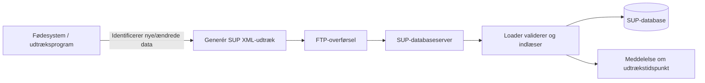
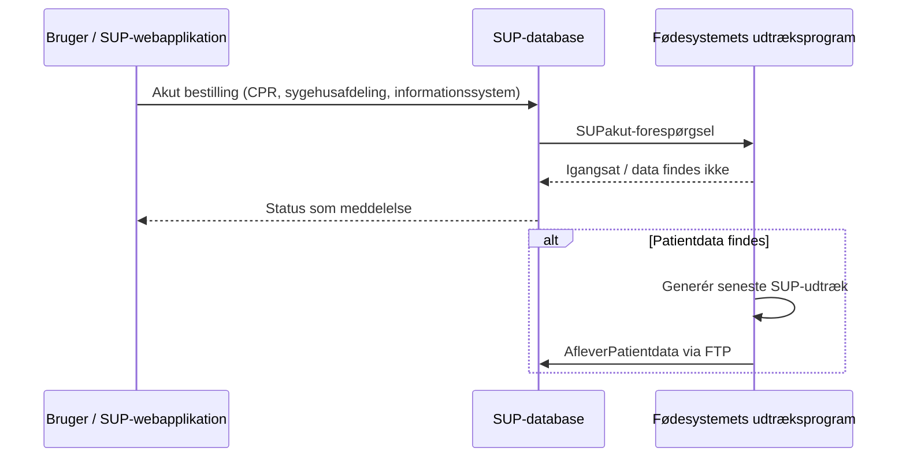

# SUP-specifikation, version 2.0 - Bilag 5: Snitflade mellem udtræksprogram og database

- **Status:** Udkast
- **Dato:** 12. juni 2003
- **Bilag:** 05
- **Kildeformat:** PDF
- **Bearbejdning:** Agent-egnet Markdown med kilde-sideankre og Mermaid-rekonstruktioner.

> **Agentnote:** PDF'en er den autoritative kilde. Mermaid-diagrammer mærket som semantiske rekonstruktioner er afledt af tekst eller figurer og er ikke normative. XML/WSDL-eksempler er bevaret som kodeblokke.

<!-- Kildeside 1 -->

SUP-specifikation, version 2.0

Snitflade mellem udtræksprogram og database

Udkast af 12. juni 2003

Udarbejdet for

SUP-Styregruppen

© Uddrag af indholdet kan gengives med tydelig kildeangivelse

<!-- Kildeside 2 -->

Indholdsfortegnelse

## 1 Snitfladebeskrivelse ................................................................. 3

## 2 Transaktionsflow ..................................................................... 3

### 2.1 AfleverPatientdata-Service................................................................. 3

### 2.2 SUPakut-Service................................................................................. 4

### 2.3 Inputparametre til SUPAkut-Service.................................................. 5

#### 2.3.1 CPR-nummer .............................................................................. 5

#### 2.3.2 Sygehusafdeling.......................................................................... 6

#### 2.3.3 Informationssystem .................................................................... 6

### 2.4 Returmeddelelser ................................................................................ 6

#### 2.4.1 AfleverPatientdata-Service......................................................... 6

#### 2.4.2 SUPakut-Service......................................................................... 6

## 3 Datamodel................................................................................. 7

## 4 XML og WSDL definitioner ................................................... 7

### 4.1 AfleverPatientdata-Service................................................................. 7

### 4.2 SUPAkut-service ................................................................................ 8

## 5 Eksempel på AfleverPatientdata-Service .............................. 9

## 6 Eksempel på SUPAkut-Service - Output ............................ 11

<!-- Kildeside 3 -->

## 1 Snitfladebeskrivelse

Grænsefladen mellem fødesystemets (EPJ/PAS) udtræksprogrammel og SUPdatabasen består af services, der muliggør en overførelse af patientdata til SUPdatabasen.

Udtræk til SUP-databasen skal ske dels dagligt med nye eller ændrede patientdata, dels akut, hvor overførelse eller opdateringer af patientdata sker på baggrund af en forespørgsel fra brugeren.

I tilfælde af, at patientdata ændres i fødesystemet - selv ved blot den mindste ændring, skal alle patientdata (hele journalen fra EPJ-systemer) overføres til SUP-databasen igen under den daglige overførelse.

## 2 Transaktionsflow

Der stilles to services til rådighed for overførelse af patientdata til SUPdatabasen, hhv. "AfleverPatientdata" og "SUPakut".

### 2.1 AfleverPatientdata-Service

<!-- Mermaid: Semantisk flowdiagram rekonstrueret fra servicebeskrivelsen. -->

Kildeasset: `bilag_05_snitflade_udtraek_database_assets/bilag_05_aflever_patientdata_flow.mmd`

Servicen "AfleverPatientdata" bruges, når fødesystemet (EPJ/PAS) skal overføre (aflevere) patientdata til en SUP-database.

Fødesystemets udtræksprogrammel danner et udtræk fra fødesystemet og konverterer dette til XML-format i henhold til minimum SUP-specifikation, version 2.0. Filen indeholdende XML-udtrækket sendes til SUP-databasen ved hjælp af FTP og placeres i et aftalt katalog på SUP-database serveren.

SUP-databasens loader indlæser herefter filen i SUP-databasen og genererer en meddelelse med oplysning om tidspunktet for dataudtrækket. Denne meddelelse kan ses af brugeren i forbindelse med visning af meddelelser for den pågældende patient.

Af hensyn til overblik og hurtig filsøgning skal XML-filen navngives på formen:

<fødesystem (10 karakterer)><sygehusnummer (4 karakterer)>- <afdelingsnummer (2 karakterer)><CPR-nr.(10 karakterer)>

<!-- Kildeside 4 -->

I alt 26 karakterer, hvor "fødesystem" angiver det fødesystem, som forløbet er udtrukket fra, se evt. nærmere beskrivelse af attributten under patientforløb i Domænemodellen i Bilag 2.

Servicen "AfleverPatientdata" afspejler usecasen "Aflever patientdata", som er beskrevet i Bilag 3.

Navn: AfleverPatientdata Input: XML-fil der overholder formatet beskrevet i XML-schemaet til "Aflever patientdata", se Bilag 4. Output: FTP-returkode fra FTP-serveren. Forudsætning: At der findes patientdata for den udvalgte patient Aktører: Fødesystemets udtræksprogrammel. Initiering: Patientdata for den pågældende patient er udvalgt af den amtsansvarlige til overførelse til SUP-databasen. Formål: Giver et fødesystem mulighed for at aflevere patientdata til SUP-databasen. Beskrivelse: 1. Udtræksprogrammet (afsender) identificerer, hvorvidt der findes nye eller ændrede patientdata siden sidste overførelse (aflevering) til SUP-databasen - eller om der er forespurgt på et akutudtræk af patientdata.

2. Afsender genererer udtræk, der følger SUP-specifika-
tionen.

3. Afsender overfører XML-udtræksfil til SUP-databasen.
### 2.2 SUPakut-Service

<!-- Mermaid: Sekvensdiagram rekonstrueret fra servicebeskrivelsen. -->

Kildeasset: `bilag_05_snitflade_udtraek_database_assets/bilag_05_supakut_flow.mmd`

Servicen "SUPakut" giver SUP-databasen mulighed for at bestille udtræk af patientdata på et bestemt CPR-nummer fra et bestemt fødesystem. SUP-databasen bestiller udtræk af patientdata som følge af en akut bestilling modtaget fra en SUP-webapplikation (fra en bruger) og får synkront et svar (meddelelse) tilbage fra fødesystemets udtræksprogram om status på bestillingen.

Servicen benyttes ifbm., at brugeren i SUP-webapplikationen angiver CPRnummer, sygehusafdeling og navnet på det fødesystem, udtrækket ønskes fra. Bestillingen stiles herved til SUP-databasen. SUP-databaseapplikationen bruger oplysningen om sygehusafdeling sammen med navnet på fødesystemet til at bestemme, hvor bestillingen skal viderestilles til.

Databaseapplikationen skal således administrere en tabel over de fødesystemer, som leverer data til databasen. Tabellen skal indeholde IP-adressen på det enkelte fødesystems inputkatalog, som benyttes til SUPAkut-Servicen.

<!-- Kildeside 5 -->

Bestillingen besvares af fødesystemets udtræksprogrammel med et synkront svar "Data findes ikke på sygehus zzzzzz" eller "Akut-udtræk er igangsat den xx.xx.xx kl. yy:yy fra sygehus zzzzzz". Svaret gemmes af SUP-databaseapplikationen og kan ses af brugeren i forbindelse med visning af meddelelser for den pågældende patient.

Såfremt fødesystemet indeholder patientdata for det pågældende CPR-nummer, igangsættes udtrækket, og XML-filen overføres straks til SUP-databasen vha. servicen "AfleverPatientdata".

Servicen "SUPakut" afspejler usecasen "Overfør patientdata akut", som er beskrevet i Bilag 3.

Navn: SUPakut-Service Input: CPR-nummer, sygehusafdeling, informationssystem. Formatet er i henhold til WSDL-definitionen, som angivet i kap. 4. Output: Returkode samt svar på bestilling af udtræk af patientdata i fødesystemet. Formatet er i henhold til WSDL -definition af "SUPakut" i Bilag 4. Forudsætning: Akut udtræk er bestilt af bruger via SUP-webapplikationen og modtaget af SUP-databaseapplikationen. Aktører: Fødesystemets udtræksprogrammel og SUP-databasen. Initiering: SUP-databasen Formål: Bestille et akut udtræk af patientdata til umiddelbar overførelse til SUP-databasen. Beskrivelse: 1. SUP-databasen viderestiller en forespørgsel på akut udtræk til et fødesystem ud fra oplysning om sygehusafdeling og informationssystem (fødesystem).

2. Fødesystemets udtræksprogrammel undersøger, hvorvidt
patientdata findes på det forespurgte CPR-nummer, og sender et svar "Akut-udtræk er igangsat" eller "Data findes ikke" tilbage til brugeren.

3. Fødesystemets udtræksprogrammel igangsætter udtræk
af de seneste patientdata på CPR-nummer og overfører straks data til SUP-databasen .

### 2.3 Inputparametre til SUPAkut-Service

#### 2.3.1 CPR-nummer

CPR-nummer er en tekststreng af formatet "ddmmåå-naan", hvor "n" er numerisk og "a" er alfanumerisk.

<!-- Kildeside 6 -->

#### 2.3.2 Sygehusafdeling

Sygehusafdeling skal følge Sundhedsstyrelsens Sygehusklassifikation og består af tekststreng med seks karakterer (fra venstre):

1-2 karakterer: Amt 3-4 karakter: Et sygehus 5-6 karakterer: En afdeling

#### 2.3.3 Informationssystem

Navnet på det fødesystem, som det akutte udtræk ønskes fra. Formatet er en tekststreng.

### 2.4 Returmeddelelser

Angiver status på udførelsen af servicen.

#### 2.4.1 AfleverPatientdata-Service

Her afleveres en FTP-returkode fra FTP-serveren, hvor XML-filen er afleveret. Hvis XML-filen ikke kan indlæses i SUP-databasen eller på anden vis er fejlbehæftet, skal den driftsansvarlige for fødesystemets udtræksprogrammel kontaktes, se Bilag 12 for en nærmere beskrivelse.

#### 2.4.2 SUPakut-Service

Servicen SUPakut har en returkode, der angiver status. Returkoden er et heltal.

Returkode Betydning Bemærkning

## 0 Forespørgslen gik godt.                   Besked "Akut udtræk er igang-

sat" returneres.

## 50 CPR-nummer ikke fundet                Besked "Data findes ikke" re-

turneres.

## 60 Sygehusafdeling ikke fundet           Besked "Data findes ikke" re-

turneres.

## 70 Informationssystem ikke fundet        Besked "Data findes ikke" re-

turneres.

## 90 Generel fejl i inputparametrene       Besked "Data findes ikke" re-

turneres.

## 999 Generel fejl                           Besked "Data findes ikke" re-

turneres.

<!-- Kildeside 7 -->

## 3 Datamodel

Se Domænemodellen (Bilag 2).

## 4 XML og WSDL definitioner

### 4.1 AfleverPatientdata-Service

WSDL for output:

Se Bilag 4 under XML-schemaet "SUP_aflever_patientdata.xsd".

<!-- Kildeside 8 -->

### 4.2 SUPAkut-service

WSDL for input (request):

```xml
<?xml version="1.0" encoding="UTF-8"?>
<definitions name="SUPakut" targetNamespace="http://services.sup.wsdl/SUPakut.wsdl" xmlns="http://schemas.xmlsoap.org/wsdl/" xmlns:soap="http://schemas.xmlsoap.org/wsdl/soap/"
xmlns:tns="http://services.sup.wsdl/SUPakut.wsdl" xmlns:xsd="http://www.w3.org/2001/XMLSchema" xmlns:xsd1="http://services.sup.wsdl/SUPakut.xsd1">
<types>
<xsd:schema targetNamespace="http://services.sup.wsdl/SUPakut.xsd1" xmlns="http://schemas.xmlsoap.org/wsdl/" xmlns:SOAP-ENC="http://schemas.xmlsoap.org/soap/encoding/"
xmlns:soap="http://schemas.xmlsoap.org/wsdl/soap/" xmlns:tns="http://services.sup.wsdl/SUPakut.wsdl" xmlns:xsd="http://www.w3.org/2001/XMLSchema"
xmlns:xsd1="http://services.sup.wsdl/SUPakut.xsd1">
<xsd:complexType name="SUBakutParametre">
<xsd:sequence>
<xsd:element name="CPRnummer" maxOccurs="1" minOccurs="1" type="xsd:string"/>
<xsd:element name="SygehusAfdeling" maxOccurs="1" minOccurs="1" type="xsd:string"/>
<xsd:element name="InformationsSystem" maxOccurs="1" minOccurs="1" type="xsd:string"/>
</xsd:sequence>
</xsd:complexType>
</xsd:schema>
</types>
<message name="SUBakutRequest">
<part name="arg0" type="xsd1:SUBakutParametre"/>
</message>
<message name="SUBakutResponse">
<part name="return" type="xsd:string"/>
</message>
<portType name="SUPakut">
<operation name="SUBakut">
<input message="tns:SUBakutRequest"/>
<output message="tns:SUBakutResponse"/>
</operation>
</portType>
</definitions>


WSDL for output:

Formatet er i henhold til WSDL definitionen af "SUPakut", som vist i Bilag 4.


```

<!-- Kildeside 9 -->

## 5 Eksempel på AfleverPatientdata-Service

```xml
<?xml version="1.0" encoding="ISO-8859-1"?>
<Aflever_patientdata VersionsNummer="2.0" Identifikation="24844_2003-05-27T07:48:39.171" ForsendelsesTid="2003-05-27T07:48:39.171" AfsenderSystem="CSC_EPJ_FJ" Transakti-
onsType="Opdater">
<Person CPRnummer="2406444917" Navn="Ole Jensen" Adresse="Villavej 3,8240 RISSKOV" Kommunekode="751" Kommune="Århus" KommuneTilflytningsdato="1997-01-04" Ko-
en="M" Foedselsdato="1944-06-24" Alder="58" TelefonNummer="89000000" Paaroerende="Ellen Jensen" EgenLaegesNavn="Hans Jensen" EgenLægesYdernr="111111" EgenLægeStart-
Dato="1998-07-26">
<Patientforloeb Identifikation="X1A24844_326_34" Starttidspunkt="2003-03-02T00:00:00" Sluttidspunkt="2003-03-25T13:00:00" Foedesystem="CSCSCEPJFJ">
<OprindeligAnsvarligEnhed>
<Organisatorisk_Enhed Kode="6006079" Institution_tekst="HORSENS SYGEHUS" Afdeling_tekst="ORGANKIRURGISK AMBULATORIUM" />
</OprindeligAnsvarligEnhed>
<Diagnose Diagnosetidspunkt="2003-03-18T08:00:00">
<Haendelse Identifikation="24334_312_124" Registreringstidspunkt="2003-03-18T11:27:32" Tilstede_tidspunkt="2003-03-27T07:48:39">
<HaendelseRegistreretAf Registrerende_behandler="lma">
<Registrerings_Enhed>
<Organisatorisk_Enhed Kode="6006070" Institution_tekst="HORSENS SYGEHUS" Afdeling_tekst="ORGANKIRURGISK AFDELING" />
</Registrerings_Enhed>
</HaendelseRegistreretAf>
</Haendelse>
<Art>
<KodetVaerdi Kode="A" Kodetekst="Aktionsdiagnose">
<Klassificering>
<Klassifikation Forkortelse="SKS" />
</Klassificering>
</KodetVaerdi>
</Art>
<DiagnoseKode>
<SammensatKodetVaerdi>
<Primaerkode>
<KodetVaerdi Kode="DK802" Kodetekst="Cholecystolithiasis uden cholecystitis">
<Klassificering>
<Klassifikation Forkortelse="SKS" />
</Klassificering>
</KodetVaerdi>
</Primaerkode>
</SammensatKodetVaerdi>
</DiagnoseKode>
<Diagnosticering_udfoert_af>
<Ansvarlig_Behandler>
<AnsvarligPerson Identifikation="ar" Navn="Allan Rasmussen" Titel="Læge" />


```

<!-- Kildeside 10 -->

```xml
</Ansvarlig_Behandler>
<Ansvarlig_Enhed>
<Organisatorisk_Enhed Kode="6006079" Institution_tekst="HORSENS SYGEHUS" Afdeling_tekst="ORGANKIRURGISK AMBULATORIUM" />
</Ansvarlig_Enhed>
</Diagnosticering_udfoert_af>
</Diagnose>
</Patientforloeb>
<CaveOplysninger Tekst="String" Dato="String">
<Organisatorisk_Enhed Kode="String" Institution_tekst="String" Afdeling_tekst="String"/>
</CaveOplysninger>
</Person>
</Aflever_patientdata>


```

<!-- Kildeside 11 -->

## 6 Eksempel på SUPAkut-Service - Output

XML for output (response):

```xml
<?xml version="1.0" encoding="ISO-8859-1"?>
<Meddelelsesliste >
<Person>
<CPRnummer>2406444917</CPRnummer>
</Person>
<Meddelelse>
<Dato>2003-05-31T19:30:00</Dato>
<Returtekst>Akut-udtræk er igangsat den 31.05.03 kl. 19:30:00 fra sygehus 6008031</Returtekst>
<Returkode>0</Returkode>
</Meddelelse>
</Meddelelsesliste>


```
