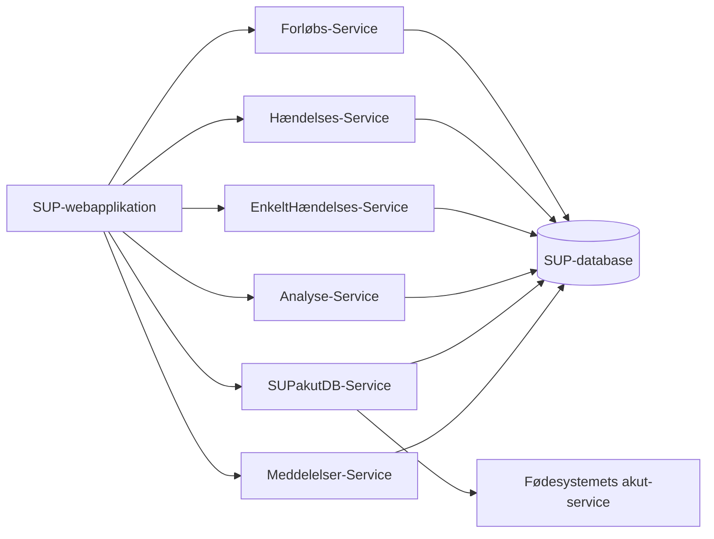
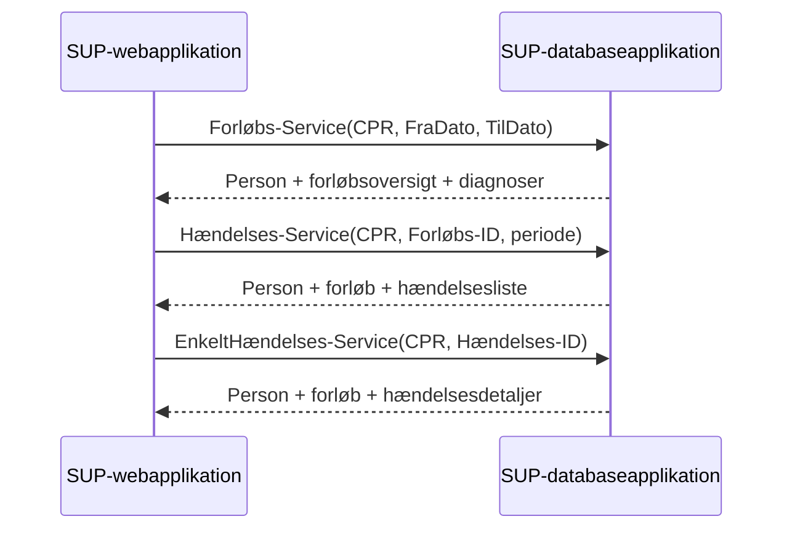
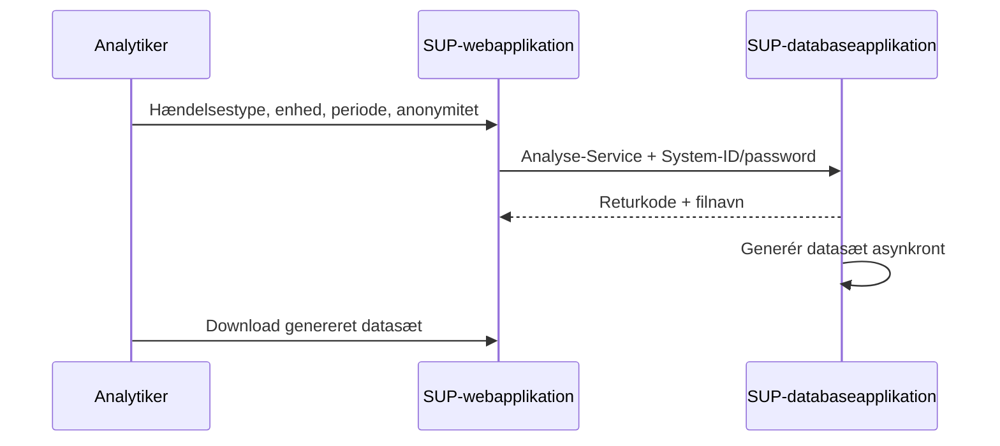
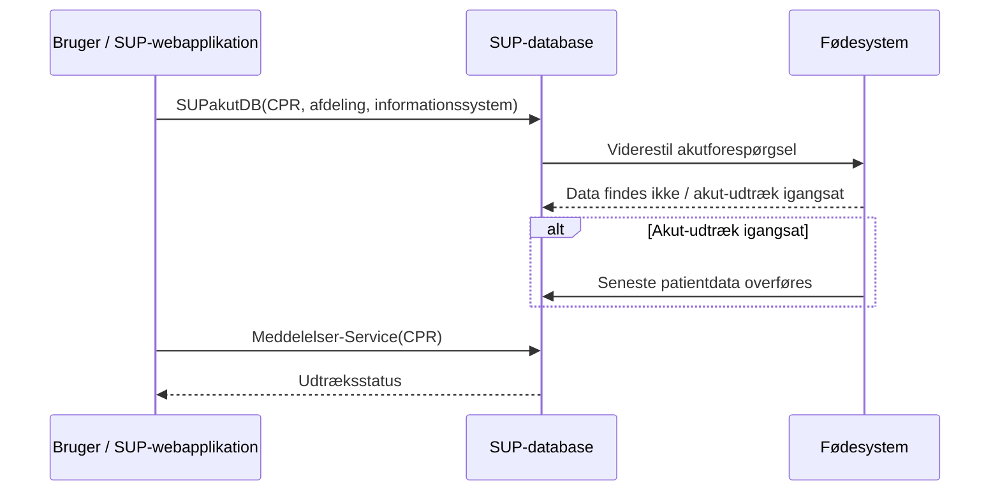

# SUP-specifikation, version 2.0 - Bilag 6: Snitflade mellem database og webapplikation

- **Status:** Udkast
- **Dato:** 12. juni 2003
- **Bilag:** 06
- **Kildeformat:** PDF
- **Bearbejdning:** Agent-egnet Markdown med kilde-sideankre og Mermaid-rekonstruktioner.

> **Agentnote:** PDF'en er den autoritative kilde. Mermaid-diagrammer mærket som semantiske rekonstruktioner er afledt af tekst eller figurer og er ikke normative. XML/WSDL-eksempler er bevaret som kodeblokke.

<!-- Kildeside 1 -->

SUP-specifikation, version 2.0

Snitflade mellem database og webapplikation

Udkast af 12. juni 2003

Udarbejdet for

SUP-Styregruppen

© Uddrag af indholdet kan gengives med tydelig kildeangivelse

<!-- Kildeside 2 -->

Indholdsfortegnelse

## 1 Snitfladebeskrivelse ................................................................. 4

## 2 Transaktionsflow ..................................................................... 4

### 2.1 Forløbs-Service................................................................................... 4

### 2.2 Hændelses-Service.............................................................................. 5

### 2.3 EnkeltHændelses-Service ................................................................... 6

### 2.4 Analyse-Service.................................................................................. 6

### 2.5 SUPakutDB-Service ........................................................................... 7

### 2.6 Meddelelser-Service ........................................................................... 8

### 2.7 Parametre til webservices ................................................................... 9

#### 2.7.1 CPR-nummer .............................................................................. 9

#### 2.7.2 Forløbs-ID .................................................................................. 9

#### 2.7.3 Hændelses-ID ............................................................................. 9

#### 2.7.4 FraDato og TilDato..................................................................... 9

#### 2.7.5 System-ID og Password.............................................................. 9

#### 2.7.6 XML (output) ........................................................................... 10

#### 2.7.7 Navn på fil (output) .................................................................. 10

#### 2.7.8 Returkode (output).................................................................... 10

#### 2.7.9 Udtræksstatus (output).............................................................. 10

#### 2.7.10 Sygehusafdeling........................................................................ 10

#### 2.7.11 Informationssystem. ................................................................. 10

### 2.8 Returmeddelelser .............................................................................. 11

### 2.9 Performance på webservices ............................................................ 11

## 3 Datamodel............................................................................... 11

## 4 XML eller WSDL definition ................................................. 12

### 4.1 Forløbs-Service................................................................................. 12

#### 4.1.1 WSDL for input (request)......................................................... 12

#### 4.1.2 WSDL for output ...................................................................... 13

### 4.2 Hændelses-Service............................................................................ 13

#### 4.2.1 WSDL for input (request)......................................................... 13

#### 4.2.2 WSDL for output ...................................................................... 14

### 4.3 EnkeltHændelses-Service ................................................................. 14

#### 4.3.1 WSDL for input (request)......................................................... 14

#### 4.3.2 WSDL for output ...................................................................... 14

### 4.4 Analyse-Service................................................................................ 15

#### 4.4.1 WSDL for input (request)......................................................... 15

#### 4.4.2 Output ....................................................................................... 15

### 4.5 SUPakutDB-Service ......................................................................... 16

#### 4.5.1 WSDL for input (request)......................................................... 16

### 4.6 Meddelelser-Service ......................................................................... 17

#### 4.6.1 WSDL for input (request)......................................................... 17

#### 4.6.2 WSDL for output ...................................................................... 17

### 4.7 Retur objektet ................................................................................... 18

## 5 Eksempel på Forløbs-Service - Output................................ 19

## 6 Eksempel på Hændelses-Service - Output .......................... 22

<!-- Kildeside 3 -->

## 7 Eksempel på EnkeltHændelses-Service - Output ............... 31

## 8 Eksempel på Analyse-Service - Output ............................... 33

## 9 Eksempel på SUPakutDB-Service - Output........................ 33

## 10 Eksempel på Meddelelser-Service - Output .................... 33

<!-- Kildeside 4 -->

## 1 Snitfladebeskrivelse

Grænsefladen mellem SUP-databaseapplikationen og SUP-webapplikationen består af webservices, som stiller data fra SUP-databaseapplikationen til rådighed for SUP-webapplikationen.

Grænsefladen mellem databasen og SUP-webapplikationen er implementeret som webservices for at give mulighed for, at andre systemer kan bruge oplysningerne i SUP-databasen (f.eks. NET-løsninger og Sundhedsportalen) samt at SUP-databaseapplikationen og SUP-webapplikationen kan implementeres uafhængigt.

## 2 Transaktionsflow

<!-- Mermaid: Semantisk oversigt over minimumssættet af webservices. -->

Kildeasset: `bilag_06_snitflade_database_webapplikation_assets/bilag_06_serviceoversigt.mmd`

Der stilles et antal services til rådighed for fremskaffelse af data (XML-format) til SUP-webapplikationen. Data, som returneres, er en delmængde af de patientdata, som det "originale" udtræk fra fødesystemet omfattede. Desuden stilles en webservice til rådighed for fremskaffelse af data til analytiske formål. Denne service returnerer data i et semikolonsepareret filformat.

Følgende webservices skal som et minimum stilles til rådighed: Forløbs- Service, Hændelses-Service, EnkeltHændelses-Service , SUPAkut-Service, Analyse-Service samt Meddelelser-Service.

### 2.1 Forløbs-Service

Givet et CPR-nummer og evt. periodeafgrænsningsparametre i form af FraDato og Tildato returneres patientens forløb og personoplysninger.

En mere detaljeret beskrivelse af brugerinteraktionen findes i Bilag 3 i usecasen "Forespørg på patient".

Navn: Forløbs-Service. Input: "CPR-nummer", "FraDato", "TilDato", "System-ID" samt "Password". Output: Returobjekt bestående af: Returkode samt XML (specificerende "Personoplysninger" inkl. CAVE-oplysninger, liste af Patientforløb inkl. ansvarlig enhed og liste af diagnosehændelser for de enkelte forløb). Se Bilag 4. Forudsætning: At der findes SUP-data for den udvalgte patient. Aktører: Modtager.

<!-- Kildeside 5 -->

Initiering: Modtageren er logget på en SUP-webapplikation. Formål: Give en modtager mulighed for at se udvalgte persondata og forløbsdata på en specifik patient i SUP-databasen. Beskrivelse: 1. Modtager starter usecasen, når han ønsker at se enten udvalgte persondata eller forløbsdata på den specifikke patient.

2. Browseren viser en oversigt over patientens forløb og
udvalgte personoplysninger

### 2.2 Hændelses-Service

Givet et CPR-nummer, evt. periodeafgrænsningsparametre i form af FraDato og Tildato og et forløbs-ID returneres det tilhørende forløb, en liste med alle forløbets hændelser og personoplysninger.

En mere detaljeret beskrivelse af bruger interaktionen findes i Bilag 3 i usecasen "Se patientdata".

Navn: Hændelses-Service Input: "CPR-nummer", " Forløbs-ID", "FraDato", "TilDato" , "System-ID" samt "Password". Hvis forløbs-ID"en er blank, returneres liste over alle hændelse for alle forløb. Output: Returobjekt bestående af: Returkode samt XML (specificerende "Tilhørende person", "Tilhørende Forløb" og "Liste af hændelser"). Se Bilag 4. Forudsætning: At der findes SUP-data for den udvalgte patient. Browseren viser en oversigt over patientens forløb og udvalgte personoplysninger. Aktører: Modtager. Initiering: Modtageren er logget på en SUP-webapplikationen. Formål: Give en modtager mulighed for at se en oversigt over en specifik patients hændelser i SUP-databasen for et valgt forløb. Beskrivelse: 1. Modtager starter usecasen, når han ønsker at se en hændelsesoversigt på den specifikke patient.

2. Modtageren kan vælge:
At se hændelser tilhørende et enkelt eller alle forløb.

3. Browseren viser en oversigt over hændelsestyper i
det valgte forløb eller for alle forløb.

<!-- Kildeside 6 -->

### 2.3 EnkeltHændelses-Service

<!-- Mermaid: Samlet sekvens for navigation fra forløb til hændelser og detaljer. -->

Kildeasset: `bilag_06_snitflade_database_webapplikation_assets/bilag_06_patient_navigation_flow.mmd`

Givet et CPR-nummer og en hændelsesidentifikation returneres det tilhørende forløb, den tilhørende hændelse og personoplysninger.

En mere detaljeret beskrivelse af bruger interaktionen findes i Bilag 3 i usecasen "Se patientdata".

Navn: EnkeltHændelses-Service Input: "CPR-nummer", "Hændelses-ID", "System-ID" samt "Password" Output: Returobjekt bestående af: Returkode samt XML (specificerende "Tilhørende person", "Tilhørende Forløb" og "Hændelse"). Se Bilag 4. Forudsætning: At der findes SUP data for den udvalgte patient. Browseren viser en oversigt over hændelser for et eller alle forløb. Aktører: Modtager. Initiering: Modtageren er logget på en SUP-webapplikationen. Formål: Give en modtager mulighed for at se detaljerede hændelsesdata på en specifik patient i SUP-databasen. Beskrivelse: 1. Modtageren starter usecasen, når han ønsker at se detailoplysninger vedr. en specifik hændelse.

2. Modtageren kan vælge, hvilken specifik hændelse
han ønsker at se, f.eks. et bestemt notat.

3. Browseren viser alle informationer knyttet til den
valgte hændelse.

### 2.4 Analyse-Service

<!-- Mermaid: Sekvensdiagram rekonstrueret fra Analyse-Service-beskrivelsen. -->

Kildeasset: `bilag_06_snitflade_database_webapplikation_assets/bilag_06_analyse_flow.mmd`

Analytikeren opstiller afgrænsningskriterier mht. hændelsestype, organisatorisk enhed, periode og anonymitet. Systemet fremstiller så et datasæt med de patientdata, der opfylder de opstillede afgrænsningskriterier.

Databaseapplikationen returnerer et filnavn på det (senere) generede datasæt. Når datasættet er genereret, placeres det i et katalog, hvortil webapplikationen har adgang (evt. via FTP). Det er nu webapplikationens opgave at sørge for, at analytikeren og kun analytikeren har adgang til at downloade datasættet.

En mere detaljeret beskrivelse af brugerinteraktionen findes i Bilag 3 i usecasen "Forespørg på flere patienter".

<!-- Kildeside 7 -->

Navn: Analyse-Service Input: "HændelsesType", "OrganisationsEnhed", "OrganistionsEnhedsType", "FraDato", "TilDato", "PeriodeType", "AnonymType" , "System-ID" samt "Password". Inputparametrene er nærmere beskrevet i Bilag 8. Output: Returobjekt bestående af: Returkode samt navn på filen indeholdende datasættet. Filens indhold er nærmere beskrevet i Forudsætning: At der findes SUP-data inden for afgrænsningskriterierne. Aktører: Analytiker. Initiering: Analytikeren er logget på en SUP-webapplikationen med rettigheder at udtrække data til analyseformål. Formål: Give en analytiker mulighed for at hente patientdata om flere patienter i SUP-databasen i forbindelse med analyser. Beskrivelse: 1. Analytikeren angiver en kombination af følgende afgrænsningskriterier:

- Hændelsestype
- Organisatorisk enhed
- Periode
- Anonymitet
2. Systemet påbegynder udtræk af et datasæt med de pa-
tientdata, der opfylder de opstillede afgrænsningskriterierne.

3. Analytikeren modtager en besked om, at datasættet er
ved at blive genereret.

4. Senere kan analytikeren logge ind på web-applikatio-
nen og her downloade de bestilte datasæt.

### 2.5 SUPakutDB-Service

<!-- Mermaid: Sekvensdiagram rekonstrueret fra SUPakutDB- og Meddelelser-Service-beskrivelserne. -->

Kildeasset: `bilag_06_snitflade_database_webapplikation_assets/bilag_06_supakutdb_flow.mmd`

Servicen "SUPakutDB" giver SUP-webapplikationen mulighed for at bestille akutudtræk af patientdata på et bestemt CPR-nummer.

SUP-databasen bestiller derefter udtrækket af patientdata hos et af sine fødesystemer (f.eks. EPJ/PAS). Bestillingen besvares af fødesystemets udtræksprogrammel med et svar "Data findes ikke" eller "Akutudtræk er igangsat", samtidig med at udtrækket igangsættes.

Svaret fra udtræksprogrammet gemmes i SUP-databasen og kan hentes af SUPwebapplikationen ved hjælp af servicen Meddelelser, se afsnit 2.6.

En mere detaljeret beskrivelse af brugerinteraktionen findes i Bilag 3 i usecasen "Overføre patientdata akut".

<!-- Kildeside 8 -->

Navn: SUPakutDB-Service. Input: "CPR-nummer", "Sygehusafdeling", "Informationssystem", "System-ID" samt "Password". Output: Returobjekt bestående af: Returkode. Forudsætning: Ingen. Aktører: SUP-webapplikationen og SUP-databasen. Initiering: SUP-webapplikationen. Formål: Give en bruger mulighed for at bestille et akut udtræk af patientdata til SUP-databasen Beskrivelse: 1. Brugeren forespørger på patientdata på et bestemt CPRnummer ved at angive sygehusafdeling og navnet på det fødesystem, som udtrækket ønskes fra.

2. Den kaldte SUP-databaseapplikation viderestiller fore-
spørgslen til det valgte udtræksprogram.

3. Det valgte udtræksprogram svarer tilbage med et svar
"Data findes ikke" eller "Akut-udtræk er igangsat", samtidig med at udtrækket igangsættes.

4. De seneste patientdata på det valgte CPR-nummer over-
føres til SUP-databasen.

5. Brugeren kan i browseren forespørge på patientdata via
opslag på CPR-nummer.

### 2.6 Meddelelser-Service

Servicen "Meddelelser" giver SUP-webapplikationen mulighed for at hente status på udtræk for et bestemt CPR-nummer.

En mere detaljeret beskrivelse af bruger interaktionen findes i Bilag 3 i usecasen "Vis Meddelelser".

Navn: Meddelelser-Service. Input: "CPR-nummer", "System-ID" samt "Password". Output: Returobjekt bestående af: Returkode samt Udtræksstatus. Forudsætning: Ingen. Aktører: SUP-webapplikationen og SUP-databasen. Initiering: SUP-webapplikationen. Formål: Give en bruger mulighed for at hente status på udtræk for et bestemt CPR-nummer.

<!-- Kildeside 9 -->

Beskrivelse: 1. Modtager starter usecasen, når han ønsker at se patientdata på en specifik patient.

2. Modtageren kan vælge at se meddelelser knyttet til de
udtrukne patientdata.

3. Browseren viser i omvendt kronologisk rækkefølge de
meddelelser, der ligger i SUP-databasen knyttet til patientens data.

### 2.7 Parametre til webservices

#### 2.7.1 CPR-nummer

CPR-nummeret er en tekststreng af formatet "ddmmåå-naan", hvor "n" er numerisk og "a" er alfanumerisk.

#### 2.7.2 Forløbs-ID

Tekststreng som identificerer forløb i SUP-databasen.

#### 2.7.3 Hændelses-ID

Tekststreng som identificerer hændelser i SUP-databasen. Dette er en kommasepareret tekststreng, hvor de ønskede hændelsestyper er listet med komma imellem.

#### 2.7.4 FraDato og TilDato

Der skal benyttes følgende dataformat: dd.mm.yyyy (fx 01.01.1900)

Hvor der er angivet en fraog en tildato, skal begge opfattes som inkluderet i perioden. Brugen af Fraog TilDato er nærmere defineret i Bilag 7.

#### 2.7.5 System-ID og Password

System-ID og password skal sikre, at systemet (f.eks. en anden SUPwebapplikation) som kalder webservicen, kan genkendes som et certificeret SUP-databasebruger.

Det pågældende systems system-ID og password skal på forhånd være registreret i SUP-databaseapplikationen. Ved brug af webservicen vil det fremsendte

<!-- Kildeside 10 -->

system-ID og password blive sammenlignet med det system-ID og password, der er registreret i SUP-databasen.

Formatet for både system-ID og password er en tekststreng. Almindelige sikkerhedsregler for password skal overholdes.

#### 2.7.6 XML (output)

XML"en er angivet i en tekststreng. Specifikationen af XML"en er givet i Bilag 4.

#### 2.7.7 Navn på fil (output)

Navnet på analysefilen er angivet i en tekststreng.

#### 2.7.8 Returkode (output)

Returkoden angives som et heltal [afsnit 2.8]. Returkoden er en del af Returobjektet [afsnit 4.7].

#### 2.7.9 Udtræksstatus (output)

Status for udtrækkene i et XML-format. XML"en er angivet i en tekststreng. Specifikationen af XML"en er givet i Bilag 4.

#### 2.7.10 Sygehusafdeling

Sygehusafdeling skal følge Sundhedsstyrelsens Sygehusklassifikation og består af tekststreng med seks karakterer (fra venstre):

- 1-2 karakterer: Amt
- 3-4 karakter: Et sygehus
- 5-6 karakterer: En afdeling
#### 2.7.11 Informationssystem.

Navnet på det fødesystem, som akutudtrækket ønskes fra. Formatet er en tekststreng.

Det pågældende fødesystem skal på forhånd være registreret i SUP-databaseapplikationen. Det fremsendte informationssystem vil blive sammenlignet med

<!-- Kildeside 11 -->

de fødesystemer, der har leveret data til den pågældende SUP-database, og den akutte forespørgsel vil af SUP-databaseapplikationen blive viderestillet til det pågældende fødesystems service for akutforespørgsler. Se Bilag 5 for en nærmere beskrivelse.

### 2.8 Returmeddelelser

Alle webservices har en returkode. Returkode er et heltal. Returkoden returneres som en del af Returobjektet, se afsnit 2.7.8 og afsnit 4.7.

Returkode Betydning Bemærkning

## 0 Forespørgslen gik godt. Resultat

returneres.

## 1 Forespørgslen gik godt. Servicen           F.eks. til Analyse- og SUP-

arbejder videre på forespørgslen. Akut-Servicen.

## 10 Generel fejl i System-ID og Pass-

word godkendelse.

## 11 System-ID ikke fundet.

## 12 Password ugyldigt .

## 20 Fejl i datoerne.

## 30 Forløbs-ID ikke fundet.

## 40 Hændelses-ID ikke fundet.

## 50 CPR-nummer ikke fundet.

## 60 Data findes ikke.                          SupAkutDB Servicen.

## 61 Akut-udtræk er igangsat.                   SupAkutDB Servicen.

## 90 Generel fejl i parametrene.

## 200 Database applikationen fejler.

## 999 Generel fejl.                              Fejlen er ikke specificeret nær-

mere.

### 2.9 Performance på webservices

Såfremt der (af performance hensyn) laves andre services (evt. andre services end webservices) fra databaseapplikationen til webapplikationen, skal disse have samme dataformat både som input og output, dvs. WSDL og XML som beskrevet i dette bilag og i Bilag 4 skal overholdes.

## 3 Datamodel

Se Domænemodellen [Bilag 2].

<!-- Kildeside 12 -->

## 4 XML eller WSDL definition

Se Bilag 4 for en præcisering af XML'en, som modtages fra de tre webservices beskrevet i afsnit 2:

- Forløbs-Service,
- Hændelses-Service,
- EnkeltHændelses-Service
### 4.1 Forløbs-Service

#### 4.1.1 WSDL for input (request)

```xml
<?xml version="1.0" encoding="UTF-8"?>
<definitions name="ForloebsService"
    targetNamespace="http://services.sup.wsdl/ForloebsService/"
    xmlns="http://schemas.xmlsoap.org/wsdl/"
    xmlns:tns="http://services.sup.wsdl/ForloebsService/"
    xmlns:xsd="http://www.w3.org/2001/XMLSchema" xmlns:xsd1="http://services.sup/">
<import location="ReturContainer.xsd" namespace="http://services.sup/"/>
<message name="getForloebsOversigtRequest">
<part name="cprnr" type="xsd:string"/>
<part name="fradato" type="xsd:dateTime"/>
<part name="tildato" type="xsd:dateTime"/>
<part name="userId" type="xsd:string"/>
<part name="password" type="xsd:string"/>
</message>
<message name="getForloebsOversigtResponse">
<part name="result" type="xsd1:ReturContainer"/>
</message>
<portType name="ForloebsService">
<operation name="getForloebsOversigt" parameterOrder="cprnr fradato tildato userId password">
<input message="tns:getForloebsOversigtRequest" name="getForloebsOversigtRequest"/>
<output message="tns:getForloebsOversigtResponse" name="getForloebsOversigtResponse"/>
</operation>
</portType>
</definitions>


```

<!-- Kildeside 13 -->

#### 4.1.2 WSDL for output

Formatet er i henhold til XML-schemadefinitionen af "Forløbsservice", som er vist i Bilag 4.

### 4.2 Hændelses-Service

#### 4.2.1 WSDL for input (request)

```xml
<?xml version="1.0" encoding="UTF-8"?>
<definitions name="HaendelseService"
    targetNamespace="http://services.sup.wsdl/HaendelseService/"
    xmlns="http://schemas.xmlsoap.org/wsdl/"
    xmlns:tns="http://services.sup.wsdl/HaendelseService/"
    xmlns:xsd="http://www.w3.org/2001/XMLSchema" xmlns:xsd1="http://services.sup/">
<import location="ReturContainer.xsd" namespace="http://services.sup/"/>
<message name="getHaendelsesOversigtRequest">
<part name="cprnr" type="xsd:string"/>
<part name="forloebsId" type="xsd:string"/>
<part name="fradato" type="xsd:dateTime"/>
<part name="tildato" type="xsd:dateTime"/>
<part name="userId" type="xsd:string"/>
<part name="password" type="xsd:string"/>
</message>
<message name="getHaendelsesOversigtResponse">
<part name="result" type="xsd1:ReturContainer"/>
</message>
<portType name="HaendelseService">
<operation name="getHaendelsesOversigt" parameterOrder="cprnr forloebsId fradato tildato userId password">
<input message="tns:getHaendelsesOversigtRequest" name="getHaendelsesOversigtRequest"/>
<output message="tns:getHaendelsesOversigtResponse" name="getHaendelsesOversigtResponse"/>
</operation>
</portType>
</definitions>


```

<!-- Kildeside 14 -->

#### 4.2.2 WSDL for output

Formatet er i henhold til XML-schemadefinitionen af "Hændelsesservice", som er vist i Bilag 4.

### 4.3 EnkeltHændelses-Service

#### 4.3.1 WSDL for input (request)

```xml
<?xml version="1.0" encoding="UTF-8"?>
<definitions name="EnkeltHaendelsesService"
    targetNamespace="http://services.sup.wsdl/EnkeltHaendelsesService/"
    xmlns="http://schemas.xmlsoap.org/wsdl/"
    xmlns:tns="http://services.sup.wsdl/EnkeltHaendelsesService/"
    xmlns:xsd="http://www.w3.org/2001/XMLSchema" xmlns:xsd1="http://services.sup/">
<import location="ReturContainer.xsd" namespace="http://services.sup/"/>
<message name="getHaendelseDetailsRequest">
<part name="cprnr" type="xsd:string"/>
<part name="haendelsesId" type="xsd:string"/>
<part name="userId" type="xsd:string"/>
<part name="password" type="xsd:string"/>
</message>
<message name="getHaendelseDetailsResponse">
<part name="result" type="xsd1:ReturContainer"/>
</message>
<portType name="EnkeltHaendelsesService">
<operation name="getHaendelseDetails" parameterOrder="cprnr haendelsesId userId password">
<input message="tns:getHaendelseDetailsRequest" name="getHaendelseDetailsRequest"/>
<output message="tns:getHaendelseDetailsResponse" name="getHaendelseDetailsResponse"/>
</operation>
</portType>
</definitions>


4.3.2 WSDL for output

Formatet er i henhold til XML-schemadefinitionen af "Enkelt hændelsesservice", som er vist i Bilag 4.


```

<!-- Kildeside 15 -->

### 4.4 Analyse-Service

#### 4.4.1 WSDL for input (request)

```xml
<?xml version="1.0" encoding="UTF-8"?>
<definitions name="AnalyseService"
    targetNamespace="http://services.sup.wsdl/AnalyseService/"
    xmlns="http://schemas.xmlsoap.org/wsdl/"
    xmlns:tns="http://services.sup.wsdl/AnalyseService/"
    xmlns:xsd="http://www.w3.org/2001/XMLSchema" xmlns:xsd1="http://services.sup/">
<import location="ReturContainer.xsd" namespace="http://services.sup/"/>
<message name="getHaendelsesOversigtRequest">
<part name="haendelsesType" type="xsd:string"/>
<part name="organisationsEnhed" type="xsd:string"/>
<part name="organisationsEnhedType" type="xsd:string"/>
<part name="fradato" type="xsd:dateTime"/>
<part name="tildato" type="xsd:dateTime"/>
<part name="periodeType" type="xsd:string"/>
<part name="anonymType" type="xsd:string"/>
<part name="userId" type="xsd:string"/>
<part name="password" type="xsd:string"/>
</message>
<message name="getHaendelsesOversigtResponse">
<part name="result" type="xsd1:ReturContainer"/>
</message>
<portType name="AnalyseService">
<operation name="getHaendelsesOversigt" parameterOrder="haendelsesType organisationsEnhed organisationsEnhedType
fradato tildato periodeType anonymType userId password">
<input message="tns:getHaendelsesOversigtRequest" name="getHaendelsesOversigtRequest"/>
<output message="tns:getHaendelsesOversigtResponse" name="getHaendelsesOversigtResponse"/>
</operation>
</portType>
</definitions>


4.4.2 Output

Formatet er i henhold til definitionen, som er vist i Bilag 8.


```

<!-- Kildeside 16 -->

### 4.5 SUPakutDB-Service

#### 4.5.1 WSDL for input (request)

```xml
<?xml version="1.0" encoding="UTF-8"?>
<definitions name="SUPAkutDBJava"
    targetNamespace="http://services.sup.wsdl/SUPAkutDBJava/"
    xmlns="http://schemas.xmlsoap.org/wsdl/"
    xmlns:format="http://schemas.xmlsoap.org/wsdl/formatbinding/"
    xmlns:interface1="http://services.sup.wsdl/SUPAkutDB/"
    xmlns:java="http://schemas.xmlsoap.org/wsdl/java/"
    xmlns:tns="http://services.sup.wsdl/SUPAkutDBJava/"
    xmlns:xsd="http://www.w3.org/2001/XMLSchema" xmlns:xsd1="http://services.sup/">
<import location="SUPAkutDB.wsdl" namespace="http://services.sup.wsdl/SUPAkutDB/"/>
<import location="ReturContainer.xsd" namespace="http://services.sup/"/>
<binding name="SUPAkutDBJavaBinding" type="interface1:SUPAkutDB">
<java:binding/>
<format:typeMapping encoding="Java" style="Java">
<format:typeMap formatType="java.lang.String" typeName="xsd:string"/>
<format:typeMap formatType="sup.services.ReturContainer" typeName="xsd1:ReturContainer"/>
</format:typeMapping>
<operation name="updateSUPAkutDB">
<java:operation methodName="updateSUPAkutDB"
                parameterOrder="cprnr sygehusAfd informationsSys userId password" returnPart="result"/>
<input name="updateSUPAkutDBRequest"/>
<output name="updateSUPAkutDBResponse"/>
</operation>
</binding>
<service name="SUPAkutDBService">
<port binding="tns:SUPAkutDBJavaBinding" name="SUPAkutDBJavaPort">
<java:address className="sup.services.SUPAkutDB"/>
</port>
</service>
</definitions>


```

<!-- Kildeside 17 -->

### 4.6 Meddelelser-Service

#### 4.6.1 WSDL for input (request)

```xml
<?xml version="1.0" encoding="UTF-8"?>
<definitions name="MeddelelserService"
    targetNamespace="http://services.sup.wsdl/MeddelelserService/"
    xmlns="http://schemas.xmlsoap.org/wsdl/"
    xmlns:tns="http://services.sup.wsdl/MeddelelserService/"
    xmlns:xsd="http://www.w3.org/2001/XMLSchema" xmlns:xsd1="http://services.sup/">
<import location="ReturContainer.xsd" namespace="http://services.sup/"/>
<message name="getMeddelelserRequest">
<part name="cprnr" type="xsd:string"/>
<part name="forloebsId" type="xsd:string"/>
<part name="fradato" type="xsd:dateTime"/>
<part name="tildato" type="xsd:dateTime"/>
<part name="userId" type="xsd:string"/>
<part name="password" type="xsd:string"/>
</message>
<message name="getMeddelelserResponse">
<part name="result" type="xsd1:ReturContainer"/>
</message>
<portType name="MeddelelserService">
<operation name="getMeddelelser" parameterOrder="cprnr forloebsId fradato tildato userId password">
<input message="tns:getMeddelelserRequest" name="getMeddelelserRequest"/>
<output message="tns:getMeddelelserResponse" name="getMeddelelserResponse"/>
</operation>
</portType>
</definitions>


4.6.2 WSDL for output

Formatet er i henhold til XML-schemadefinitionen af "Meddelelsesservice" som vist i Bilag 4.


```

<!-- Kildeside 18 -->

### 4.7 Retur objektet

Da webservicerne returnerer både en returkode og (oftest også) en tekststreng med XML, er disse to outputparametre samlet i et returobjekt. Returobjektet består af et heltal (returkode, se afsnit 2.8), samt en tekststreng (XML).

<!-- Kildeside 19 -->

## 5 Eksempel på Forløbs-Service - Output

```xml
<Aflever_patientdata AfsenderSystem="SUP Database" ForsendelsesTid="2003-06-04T12:58:40" Identifikation="SUP20030604125840" TransaktionsType="Opdater" VersionsNummer="2.0"
xmlns:xsi="http://www.w3.org/2001/XMLSchema-instance" xmlns="http://www.viborgamt.dk/SUP_AJ001" xsi:schemaLocation="http://www.viborgamt.dk/SUP_AJ001 SUPForloebsService.xsd">´
<Person Adresse="Nymarksgade 112, 7000 FREDERICIA" CPRnummer="010433-1AA5" Koen="M" Navn="Fritzen, Benny">
<Patientforloeb Identifikation="123AA60000" Sluttidspunkt="2001-09-16T13:30:00" Starttidspunkt="2001-09-14T03:10:00" Teknisk_forloeb="X" Foedesystem="IBM02">
<OprindeligAnsvarligEnhed>
<Organisatorisk_Enhed Afdeling_tekst="Organkirurgisk afd." Institution_tekst="Vejle sygehus" Kode="6008210"/>
</OprindeligAnsvarligEnhed>
<Diagnose Afsluttidspunkt="?" Diagnosetidspunkt="2001-09-16T14:30:00">
<Haendelse FriTekst="Term; Udskrivelsesdiagnose" Identifikation="DIAG55162215021" Registreringstidspunkt="2001-09-16T14:30:00" Tilstede_tidspunkt="?">
<HaendelseRegistreretAf Registrerende_behandler="LÆ210REO">
<Registrerings_Enhed>
<Organisatorisk_Enhed Afdeling_tekst="Organkirurgisk afd." Institution_tekst="Vejle sygehus" Kode="6008210"/>
</Registrerings_Enhed>
</HaendelseRegistreretAf>
<Sikkerhedskode>
<KodetVaerdi>
<Klassificering>
<Klassifikation/>
</Klassificering>
</KodetVaerdi>
</Sikkerhedskode>
</Haendelse>
<Art>
<KodetVaerdi Kode="A" Kodetekst="">
<Klassificering>
<Klassifikation Forkortelse="SKS" Navn="SKS-klassifikation"/>
</Klassificering>
</KodetVaerdi>
</Art>
<DiagnoseKode>
<SammensatKodetVaerdi>
<Primaerkode>
<KodetVaerdi Kode="DR108" Kodetekst="Abdominalia, anden og ikke specificeret">
<Klassificering>
<Klassifikation Forkortelse="SKS" Navn="SKS-klassifikation"/>
</Klassificering>
</KodetVaerdi>
</Primaerkode>
<Tillaegskode>
<KodetVaerdi Kode="X4" Kodetekst="Ikke kronisk diagnose">
<Klassificering>
<Klassifikation Forkortelse="LOK" Navn="lokal kode"/>
</Klassificering>
</KodetVaerdi>


```

<!-- Kildeside 20 -->

```xml
</Tillaegskode>
</SammensatKodetVaerdi>
</DiagnoseKode>
<Diagnosticering_udfoert_af Diagnosested="Organkirurgisk afd.">
<Ansvarlig_Behandler>
<AnsvarligPerson Navn="Rene Olesen læge"/>
</Ansvarlig_Behandler>
<Ansvarlig_Enhed>
<Organisatorisk_Enhed Afdeling_tekst="Organkirurgisk afd." Institution_tekst="Vejle sygehus" Kode="6008210"/>
</Ansvarlig_Enhed>
</Diagnosticering_udfoert_af>
<Diagnose_afsluttet_af>
<Afsluttende_Enhed>
<Organisatorisk_Enhed Afdeling_tekst="?" Institution_tekst="" Kode="?"/>
</Afsluttende_Enhed>
</Diagnose_afsluttet_af>
</Diagnose>
<Diagnose Afsluttidspunkt="?" Diagnosetidspunkt="2001-09-27T10:31:00">
<Haendelse FriTekst="Term; Udskrivelsesdiagnose (fra epikrise)" Identifikation="DIAG55572815021" Registreringstidspunkt="2001-09-27T10:31:00" Tilstede_tidspunkt="?">
<HaendelseRegistreretAf Registrerende_behandler="SE210BIJ">
<Registrerings_Enhed>
<Organisatorisk_Enhed Afdeling_tekst="Organkirurgisk afd." Institution_tekst="Vejle sygehus" Kode="6008210"/>
</Registrerings_Enhed>
</HaendelseRegistreretAf>
<Sikkerhedskode>
<KodetVaerdi>
<Klassificering>
<Klassifikation/>
</Klassificering>
</KodetVaerdi>
</Sikkerhedskode>
</Haendelse>
<Art>
<KodetVaerdi Kode="A" Kodetekst="">
<Klassificering>
<Klassifikation Forkortelse="SKS" Navn="SKS-klassifikation"/>
</Klassificering>
</KodetVaerdi>
</Art>
<DiagnoseKode>
<SammensatKodetVaerdi>
<Primaerkode>
<KodetVaerdi Kode="DR108" Kodetekst="Abdominalia, anden og ikke specificeret">
<Klassificering>
<Klassifikation Forkortelse="SKS" Navn="SKS-klassifikation"/>
</Klassificering>
</KodetVaerdi>
</Primaerkode>
<Tillaegskode>


```

<!-- Kildeside 21 -->

```xml
<KodetVaerdi Kode="X4" Kodetekst="Ikke kronisk diagnose">
<Klassificering>
<Klassifikation Forkortelse="LOK" Navn="lokal kode"/>
</Klassificering>
</KodetVaerdi>
</Tillaegskode>
</SammensatKodetVaerdi>
</DiagnoseKode>
<Diagnosticering_udfoert_af Diagnosested="Organkirurgisk afd.">
<Ansvarlig_Behandler>
<AnsvarligPerson Navn="Rene Olesen læge"/>
</Ansvarlig_Behandler>
<Ansvarlig_Enhed>
<Organisatorisk_Enhed Afdeling_tekst="Organkirurgisk afd." Institution_tekst="Vejle sygehus" Kode="6008210"/>
</Ansvarlig_Enhed>
</Diagnosticering_udfoert_af>
<Diagnose_afsluttet_af>
<Afsluttende_Enhed>
<Organisatorisk_Enhed Afdeling_tekst="?" Institution_tekst="" Kode="?"/>
</Afsluttende_Enhed>
</Diagnose_afsluttet_af>
</Diagnose>
</Patientforloeb>
<Patientforloeb Identifikation="123AA6008210" Starttidspunkt="2001-09-13T10:49:00" Teknisk_forloeb="X" Foedesystem="IBM01">
                        ......................................
</Patientforloeb>
<Patientforloeb Identifikation="123AA60524" Sluttidspunkt="2001-10-16T13:30:00" Starttidspunkt="2001-10-09T08:15:00" Teknisk_forloeb="X" Foedesystem="IBM02">
                        ........................................................
</Patientforloeb>
</Person>
</Aflever_patientdata>


```

<!-- Kildeside 22 -->

## 6 Eksempel på Hændelses-Service - Output

```xml
<Aflever_patientdata AfsenderSystem="SUP Database" ForsendelsesTid="2003-06-04T21:53:23" Identifikation="SUP20030604215323" TransaktionsType="Opdater" VersionsNummer="2.0"
xmlns:xsi="http://www.w3.org/2001/XMLSchema-instance" xmlns="http://www.viborgamt.dk/SUP_AJ001" xsi:schemaLocation="http://www.viborgamt.dk/SUP_AJ001 SUPhaendelsesservi-
ce.xsd">
<Person Adresse="Nymarksgade 112, 7000 FREDERICIA" CPRnummer="010433-1AA5" Koen="M" Navn="Fritzen, Benny">
<Patientforloeb Identifikation="123AA60000" Sluttidspunkt="2001-09-16T13:30:00" Starttidspunkt="2001-09-14T03:10:00" Teknisk_forloeb="X" Foedesystem="IBM02">
<OprindeligAnsvarligEnhed>
<Organisatorisk_Enhed Afdeling_tekst="Organkirurgisk afd." Institution_tekst="Vejle sygehus" Kode="6008210"/>
</OprindeligAnsvarligEnhed>
<Diagnose Afsluttidspunkt="?" Diagnosetidspunkt="2001-09-16T14:30:00">
<Haendelse FriTekst="Term; Udskrivelsesdiagnose" Identifikation="DIAG55162215021" Registreringstidspunkt="2001-09-16T14:30:00" Tilstede_tidspunkt="?">
<HaendelseRegistreretAf Registrerende_behandler="LÆ210REO">
<Registrerings_Enhed>
<Organisatorisk_Enhed Afdeling_tekst="Organkirurgisk afd." Institution_tekst="Vejle sygehus" Kode="6008210"/>
</Registrerings_Enhed>
</HaendelseRegistreretAf>
<Sikkerhedskode>
<KodetVaerdi>
<Klassificering>
<Klassifikation></Klassifikation>
</Klassificering>
</KodetVaerdi>
</Sikkerhedskode>
</Haendelse>
<Art>
<KodetVaerdi Kode="A" Kodetekst="">
<Klassificering>
<Klassifikation Forkortelse="SKS" Navn="SKS-klassifikation"/>
</Klassificering>
</KodetVaerdi>
</Art>
<DiagnoseKode>
<SammensatKodetVaerdi>
<Primaerkode>
<KodetVaerdi Kode="DR108" Kodetekst="Abdominalia, anden og ikke specificeret">
<Klassificering>
<Klassifikation Forkortelse="SKS" Navn="SKS-klassifikation"/>
</Klassificering>
</KodetVaerdi>
</Primaerkode>
<Tillaegskode>
<KodetVaerdi Kode="X4" Kodetekst="Ikke kronisk diagnose">


```

<!-- Kildeside 23 -->

```xml
<Klassificering>
<Klassifikation Forkortelse="LOK" Navn="lokal kode"/>
</Klassificering>
</KodetVaerdi>
</Tillaegskode>
</SammensatKodetVaerdi>
</DiagnoseKode>
<Diagnosticering_udfoert_af Diagnosested="Organkirurgisk afd.">
<Ansvarlig_Behandler>
<AnsvarligPerson Navn="Rene Olesen læge"/>
</Ansvarlig_Behandler>
<Ansvarlig_Enhed>
<Organisatorisk_Enhed Afdeling_tekst="Organkirurgisk afd." Institution_tekst="Vejle sygehus" Kode="6008210"/>
</Ansvarlig_Enhed>
</Diagnosticering_udfoert_af>
<Diagnose_afsluttet_af>
<Afsluttende_Enhed>
<Organisatorisk_Enhed Afdeling_tekst="?" Institution_tekst="" Kode="?"/>
</Afsluttende_Enhed>
</Diagnose_afsluttet_af>
</Diagnose>
<Diagnose Afsluttidspunkt="?" Diagnosetidspunkt="2001-09-27T10:31:00">
<Haendelse FriTekst="Term; Udskrivelsesdiagnose (fra epikrise)" Identifikation="DIAG55572815021" Registreringstidspunkt="2001-09-27T10:31:00" Tilstede_tidspunkt="?">
<HaendelseRegistreretAf Registrerende_behandler="SE210BIJ">
<Registrerings_Enhed>
<Organisatorisk_Enhed Afdeling_tekst="Organkirurgisk afd." Institution_tekst="Vejle sygehus" Kode="6008210"/>
</Registrerings_Enhed>
</HaendelseRegistreretAf>
<Sikkerhedskode>
<KodetVaerdi>
<Klassificering>
<Klassifikation></Klassifikation>
</Klassificering>
</KodetVaerdi>
</Sikkerhedskode>
</Haendelse>
<Art>
<KodetVaerdi Kode="A" Kodetekst="">
<Klassificering>
<Klassifikation Forkortelse="SKS" Navn="SKS-klassifikation"/>
</Klassificering>
</KodetVaerdi>
</Art>
<DiagnoseKode>
<SammensatKodetVaerdi>
<Primaerkode>


```

<!-- Kildeside 24 -->

```xml
<KodetVaerdi Kode="DR108" Kodetekst="Abdominalia, anden og ikke specificeret">
<Klassificering>
<Klassifikation Forkortelse="SKS" Navn="SKS-klassifikation"/>
</Klassificering>
</KodetVaerdi>
</Primaerkode>
<Tillaegskode>
<KodetVaerdi Kode="X4" Kodetekst="Ikke kronisk diagnose">
<Klassificering>
<Klassifikation Forkortelse="LOK" Navn="lokal kode"/>
</Klassificering>
</KodetVaerdi>
</Tillaegskode>
</SammensatKodetVaerdi>
</DiagnoseKode>
<Diagnosticering_udfoert_af Diagnosested="Organkirurgisk afd.">
<Ansvarlig_Behandler>
<AnsvarligPerson Navn="Rene Olesen læge"/>
</Ansvarlig_Behandler>
<Ansvarlig_Enhed>
<Organisatorisk_Enhed Afdeling_tekst="Organkirurgisk afd." Institution_tekst="Vejle sygehus" Kode="6008210"/>
</Ansvarlig_Enhed>
</Diagnosticering_udfoert_af>
<Diagnose_afsluttet_af>
<Afsluttende_Enhed>
<Organisatorisk_Enhed Afdeling_tekst="?" Institution_tekst="" Kode="?"/>
</Afsluttende_Enhed>
</Diagnose_afsluttet_af>
</Diagnose>
<Kontaktperiode Afslutningstidspunkt="2001-09-16T13:30:00" StartTidspunkt="2001-09-14T03:10:00">
<Haendelse Identifikation="KONSTA60000" Registreringstidspunkt="2001-09-14T03:10:00" Tilstede_tidspunkt="?">
<HaendelseRegistreretAf Registrerende_behandler="Helle C. Mathiasen sgpl.">
<Registrerings_Enhed>
<Organisatorisk_Enhed Afdeling_tekst="Organkirurgisk afd." Institution_tekst="Vejle sygehus" Kode="6008210"/>
</Registrerings_Enhed>
</HaendelseRegistreretAf>
<Sikkerhedskode>
<KodetVaerdi>
<Klassificering>
<Klassifikation></Klassifikation>
</Klassificering>
</KodetVaerdi>
</Sikkerhedskode>
</Haendelse>
<ForloebsStatus>
<KodetVaerdi Kode="I" Kodetekst="Indlagt">


```

<!-- Kildeside 25 -->

```xml
<Klassificering>
<Klassifikation Forkortelse="SUP" Navn="dedikeret SUP-kode"/>
</Klassificering>
</KodetVaerdi>
</ForloebsStatus>
<Indikation>
<KodetVaerdi Kode="X253" Kodetekst="Tarm - andet">
<Klassificering>
<Klassifikation Forkortelse="LOK" Navn="lokal kode"/>
</Klassificering>
</KodetVaerdi>
</Indikation>
<Prioritet>
<KodetVaerdi Kode="XSUP00P1" Kodetekst="Akut">
<Klassificering>
<Klassifikation Forkortelse="SUP" Navn="dedikeret SUP-kode"/>
</Klassificering>
</KodetVaerdi>
</Prioritet>
<AfslutningsAarsag>
<KodetVaerdi Kode="XEM" Kodetekst="EM Eget ambulatorium">
<Klassificering>
<Klassifikation Forkortelse="LOK" Navn="lokal kode"/>
</Klassificering>
</KodetVaerdi>
</AfslutningsAarsag>
<Laegelig_Ansvarlig_for_kontaktperiode Stamsted="">
<Laegelig_ansvarlig_behandler>
<AnsvarligPerson Navn="Helle C. Mathiasen sgpl."/>
</Laegelig_ansvarlig_behandler>
<Laegelig_kontaktansvarlig_Enhed>
<Organisatorisk_Enhed Afdeling_tekst="Organkirurgisk afd." Institution_tekst="Vejle sygehus" Kode="6008210"/>
</Laegelig_kontaktansvarlig_Enhed>
</Laegelig_Ansvarlig_for_kontaktperiode>
<Kontaktperiode_afsluttet_af>
<Afsluttende_Behandler>
<AnsvarligPerson Navn="Helle C. Mathiasen sgpl."/>
</Afsluttende_Behandler>
<Afsluttende_Enhed>
<Organisatorisk_Enhed Afdeling_tekst="Organkirurgisk afd." Institution_tekst="Vejle sygehus" Kode="6008210"/>
</Afsluttende_Enhed>
</Kontaktperiode_afsluttet_af>
</Kontaktperiode>
<Medicinordination DoegnDosis="?" Enhed="g" EnkeltDosis="" MaksimalDoegnDosis="?" Seponeringstidspunkt="?" Sluttidspunkt="?" Starttidspunkt="2001-09-14T08:00:00">
<Haendelse FriTekst="Dosering: 1g Instruktion: initialt 2g, derefter 1gx1" Identifikation="MEDORD600001" Registreringstidspunkt="2001-09-14T10:06:42" Tilste-
de_tidspunkt="?">


```

<!-- Kildeside 26 -->

```xml
<HaendelseRegistreretAf Registrerende_behandler="Ovl. A.H. Østergaard">
<Registrerings_Enhed>
<Organisatorisk_Enhed Afdeling_tekst="Organkirurgisk afd." Institution_tekst="Vejle sygehus" Kode="6008210"/>
</Registrerings_Enhed>
</HaendelseRegistreretAf>
<Sikkerhedskode>
<KodetVaerdi>
<Klassificering>
<Klassifikation></Klassifikation>
</Klassificering>
</KodetVaerdi>
</Sikkerhedskode>
</Haendelse>
<Praeparat>
<SammensatKodetVaerdi>
<Primaerkode>
<KodetVaerdi Kode="3281" Kodetekst="Rocephalin infusionssubs 2 g">
<Klassificering>
<Klassifikation Forkortelse="LMS" Navn="Lægemiddelstyrelsen"/>
</Klassificering>
</KodetVaerdi>
</Primaerkode>
</SammensatKodetVaerdi>
</Praeparat>
<Type>
<KodetVaerdi Kode="XSUP00MF" Kodetekst="Fast ordination">
<Klassificering>
<Klassifikation Forkortelse="SUP" Navn="dedikeret SUP-kode"/>
</Klassificering>
</KodetVaerdi>
</Type>
<ATC_Kode>
<KodetVaerdi Kode="J01DA13" Kodetekst="?">
<Klassificering>
<Klassifikation Forkortelse="ATC" Navn="ATC"/>
</Klassificering>
</KodetVaerdi>
</ATC_Kode>
<Administrationsmaade>
<KodetVaerdi Kode="X3 iv" Kodetekst="Injektion iv">
<Klassificering>
<Klassifikation Forkortelse="LOK" Navn="lokal kode"/>
</Klassificering>
</KodetVaerdi>
</Administrationsmaade>
<Medicinordination_ordineret_af Ordinationssted="A16">


```

<!-- Kildeside 27 -->

```xml
<Ordinerende_Behandler>
<AnsvarligPerson Navn="Ovl. A.H. Østergaard"/>
</Ordinerende_Behandler>
<Ordinerende_Enhed>
<Organisatorisk_Enhed Afdeling_tekst="Organkirurgisk afd." Institution_tekst="Vejle sygehus" Kode="6008210"/>
</Ordinerende_Enhed>
</Medicinordination_ordineret_af>
</Medicinordination>
<Medicinordination DoegnDosis="?" Enhed="g" EnkeltDosis="1" MaksimalDoegnDosis="?" Seponeringstidspunkt="2001-09-14T10:10:00" Sluttidspunkt="?" Starttidspunkt="2001-09-
14T10:09:00">
<Haendelse FriTekst="Dosering: 1+1+1" Identifikation="MEDORD600002" Registreringstidspunkt="2001-09-14T10:09:54" Tilstede_tidspunkt="?">
<HaendelseRegistreretAf Registrerende_behandler="Ovl. A.H. Østergaard">
<Registrerings_Enhed>
<Organisatorisk_Enhed Afdeling_tekst="Organkirurgisk afd." Institution_tekst="Vejle sygehus" Kode="6008210"/>
</Registrerings_Enhed>
</HaendelseRegistreretAf>
<Sikkerhedskode>
<KodetVaerdi>
<Klassificering>
<Klassifikation></Klassifikation>
</Klassificering>
</KodetVaerdi>
</Sikkerhedskode>
</Haendelse>
<Praeparat>
<SammensatKodetVaerdi>
<Primaerkode>
<KodetVaerdi Kode="5837" Kodetekst="Elyzol suppositorier 1 g">
<Klassificering>
<Klassifikation Forkortelse="LMS" Navn="Lægemiddelstyrelsen"/>
</Klassificering>
</KodetVaerdi>
</Primaerkode>
</SammensatKodetVaerdi>
</Praeparat>
<Type>
<KodetVaerdi Kode="XSUP00MF" Kodetekst="Fast ordination">
<Klassificering>
<Klassifikation Forkortelse="SUP" Navn="dedikeret SUP-kode"/>
</Klassificering>
</KodetVaerdi>
</Type>
<ATC_Kode>
<KodetVaerdi Kode="P01AB01" Kodetekst="?">
<Klassificering>
<Klassifikation Forkortelse="ATC" Navn="ATC"/>


```

<!-- Kildeside 28 -->

```xml
</Klassificering>
</KodetVaerdi>
</ATC_Kode>
<Administrationsmaade>
<KodetVaerdi Kode="X1" Kodetekst="Per os">
<Klassificering>
<Klassifikation Forkortelse="LOK" Navn="lokal kode"/>
</Klassificering>
</KodetVaerdi>
</Administrationsmaade>
<Medicinordination_ordineret_af Ordinationssted="A16">
<Ordinerende_Behandler>
<AnsvarligPerson Navn="Ovl. A.H. Østergaard"/>
</Ordinerende_Behandler>
<Ordinerende_Enhed>
<Organisatorisk_Enhed Afdeling_tekst="Organkirurgisk afd." Institution_tekst="Vejle sygehus" Kode="6008210"/>
</Ordinerende_Enhed>
</Medicinordination_ordineret_af>
</Medicinordination>
<Medicinordination DoegnDosis="?" Enhed="g" EnkeltDosis="1" MaksimalDoegnDosis="?" Seponeringstidspunkt="?" Sluttidspunkt="?" Starttidspunkt="2001-09-14T10:10:00">
<Haendelse FriTekst="Dosering: 1+1+1" Identifikation="MEDORD600003" Registreringstidspunkt="2001-09-14T10:10:44" Tilstede_tidspunkt="?">
<HaendelseRegistreretAf Registrerende_behandler="Ovl. A.H. Østergaard">
<Registrerings_Enhed>
<Organisatorisk_Enhed Afdeling_tekst="Organkirurgisk afd." Institution_tekst="Vejle sygehus" Kode="6008210"/>
</Registrerings_Enhed>
</HaendelseRegistreretAf>
<Sikkerhedskode>
<KodetVaerdi>
<Klassificering>
<Klassifikation></Klassifikation>
</Klassificering>
</KodetVaerdi>
</Sikkerhedskode>
</Haendelse>
<Praeparat>
<SammensatKodetVaerdi>
<Primaerkode>
<KodetVaerdi Kode="5837" Kodetekst="Elyzol suppositorier 1 g">
<Klassificering>
<Klassifikation Forkortelse="LMS" Navn="Lægemiddelstyrelsen"/>
</Klassificering>
</KodetVaerdi>
</Primaerkode>
</SammensatKodetVaerdi>
</Praeparat>
<Type>


```

<!-- Kildeside 29 -->

```xml
<KodetVaerdi Kode="XSUP00MF" Kodetekst="Fast ordination">
<Klassificering>
<Klassifikation Forkortelse="SUP" Navn="dedikeret SUP-kode"/>
</Klassificering>
</KodetVaerdi>
</Type>
<ATC_Kode>
<KodetVaerdi Kode="P01AB01" Kodetekst="?">
<Klassificering>
<Klassifikation Forkortelse="ATC" Navn="ATC"/>
</Klassificering>
</KodetVaerdi>
</ATC_Kode>
<Administrationsmaade>
<KodetVaerdi Kode="X1" Kodetekst="Per os">
<Klassificering>
<Klassifikation Forkortelse="LOK" Navn="lokal kode"/>
</Klassificering>
</KodetVaerdi>
</Administrationsmaade>
<Medicinordination_ordineret_af Ordinationssted="A16">
<Ordinerende_Behandler>
<AnsvarligPerson Navn="Ovl. A.H. Østergaard"/>
</Ordinerende_Behandler>
<Ordinerende_Enhed>
<Organisatorisk_Enhed Afdeling_tekst="Organkirurgisk afd." Institution_tekst="Vejle sygehus" Kode="6008210"/>
</Ordinerende_Enhed>
</Medicinordination_ordineret_af>
</Medicinordination>
<Administrativ_karakteristikum AfslutTidspunkt="?" SlutTidspunkt="?" Starttidspunkt="2001-09-14T03:24:24">
<Haendelse FriTekst="1. Pårørende navn og tlf.; Hustru Sigrid Frisk 75891831" Identifikation="ADM6000020090" Registreringstidspunkt="2001-09-14T03:24:24" Tilste-
de_tidspunkt="?">
<HaendelseRegistreretAf Registrerende_behandler="Helle C. Mathiasen sgpl.">
<Registrerings_Enhed>
<Organisatorisk_Enhed Afdeling_tekst="Organkirurgisk sektion" Institution_tekst="Vejle sygehus" Kode="6008210"/>
</Registrerings_Enhed>
</HaendelseRegistreretAf>
<Sikkerhedskode>
<KodetVaerdi>
<Klassificering>
<Klassifikation></Klassifikation>
</Klassificering>
</KodetVaerdi>
</Sikkerhedskode>
</Haendelse>
<Karakteristikum_kode>


```

<!-- Kildeside 30 -->

```xml
<SammensatKodetVaerdi>
<Primaerkode>
<KodetVaerdi Kode="X2009" Kodetekst="1. Pårørende navn og tlf.">
<Klassificering>
<Klassifikation Forkortelse="LOK" Navn="lokal kode"/>
</Klassificering>
</KodetVaerdi>
</Primaerkode>
</SammensatKodetVaerdi>
</Karakteristikum_kode>
<Administrativ_karakteristikum_konstateret_af>
<Konstaterende_Behandler>
<AnsvarligPerson Navn="Helle C. Mathiasen sgpl."/>
</Konstaterende_Behandler>
<Konstaterende_Enhed>
<Organisatorisk_Enhed Afdeling_tekst="Organkirurgisk sektion" Institution_tekst="Vejle sygehus" Kode="6008210"/>
</Konstaterende_Enhed>
</Administrativ_karakteristikum_konstateret_af>
<Administrativ_karakteristikum_afsluttet_af>
<Afsluttende_Behandler>
<AnsvarligPerson Navn="Helle C. Mathiasen sgpl."/>
</Afsluttende_Behandler>
<Afsluttende_Enhed>
<Organisatorisk_Enhed Afdeling_tekst="Organkirurgisk sektion" Institution_tekst="Vejle sygehus" Kode="6008210"/>
</Afsluttende_Enhed>
</Administrativ_karakteristikum_afsluttet_af>
</Administrativ_karakteristikum>
</Patientforloeb>
</Person>
</Aflever_patientdata>


```

<!-- Kildeside 31 -->

## 7 Eksempel på EnkeltHændelses-Service - Output

```xml
<Aflever_patientdata AfsenderSystem="SUP Database" ForsendelsesTid="2003-06-04T14:58:15" Identifikation="SUP20030604145815" TransaktionsType="Opdater" VersionsNummer="2.0"
xmlns:xsi="http://www.w3.org/2001/XMLSchema-instance" xmlns="http://www.viborgamt.dk/SUP_AJ001" xsi:schemaLocation="http://www.viborgamt.dk/SUP_AJ001 SUPEnkeltHaendelsesSer-
vice.xsd">
<Person Adresse="Nymarksgade 112, 7000 FREDERICIA" CPRnummer="010433-1AA5" Koen="M" Navn="Fritzen, Benny">
<Patientforloeb Identifikation="010433-1AA560000" Sluttidspunkt="2001-09-16T13:30:00" Starttidspunkt="2001-09-14T03:10:00" Teknisk_forloeb="X" Foedesystem="IBM02">
<OprindeligAnsvarligEnhed>
<Organisatorisk_Enhed Afdeling_tekst="Organkirurgisk afd." Institution_tekst="Vejle sygehus" Kode="6008210"/>
</OprindeligAnsvarligEnhed>
<Medicingivning Afslutningstidspunkt="?" Enkeltdosis="0" EnhedEnkeltdosis="suppositorier" Starttidspunkt="2001-09-15T18:10:14" Styrke="">
<Haendelse FriTekst="Dosisafvigelse" Identifikation="MEDGIV60000322001-09-15-18.10.14.671001" Registreringstidspunkt="2001-09-15T18:10:14" Tilstede_tidspunkt="?">
<HaendelseRegistreretAf Registrerende_behandler="Sygepl. J. Streit">
<Registrerings_Enhed>
<Organisatorisk_Enhed Afdeling_tekst="Organkirurgisk afd." Institution_tekst="Vejle sygehus" Kode="6008210"/>
</Registrerings_Enhed>
</HaendelseRegistreretAf>
<Sikkerhedskode>
<KodetVaerdi>
<Klassificering>
<Klassifikation></Klassifikation>
</Klassificering>
</KodetVaerdi>
</Sikkerhedskode>
</Haendelse>
<Type>
<KodetVaerdi Kode="XSUP00MF" Kodetekst="Fast ordination">
<Klassificering>
<Klassifikation Forkortelse="SUP" Navn="dedikeret SUP-kode"/>
</Klassificering>
</KodetVaerdi>
</Type>
<Praeparat>
<SammensatKodetVaerdi>
<Primaerkode>
<KodetVaerdi Kode="5837" Kodetekst="Elyzol suppositorier 1 g">
<Klassificering>
<Klassifikation Forkortelse="LMS" Navn="Lægemiddelstyrelsen"/>
</Klassificering>
</KodetVaerdi>
</Primaerkode>
</SammensatKodetVaerdi>
</Praeparat>


```

<!-- Kildeside 32 -->

```xml
<ATC_Kode>
<KodetVaerdi Kode="P01AB01" Kodetekst="METRONIDAZOL">
<Klassificering>
<Klassifikation Forkortelse="ATC" Navn="ATC"/>
</Klassificering>
</KodetVaerdi>
</ATC_Kode>
<Administrationsmaade>
<KodetVaerdi Kode="X1" Kodetekst="Per os">
<Klassificering>
<Klassifikation Forkortelse="LOK" Navn="lokal kode"/>
</Klassificering>
</KodetVaerdi>
</Administrationsmaade>
<Medicin_givet_af Procedure_sted="A16">
<Producerende_Enhed>
<Organisatorisk_Enhed Afdeling_tekst="Organkirurgisk afd." Institution_tekst="Vejle sygehus" Kode="6008210"/>
</Producerende_Enhed>
</Medicin_givet_af>
<Medicingivning_afsluttet_af>
<Afsluttende_Enhed>
<Organisatorisk_Enhed Afdeling_tekst="Organkirurgisk afd." Institution_tekst="Vejle sygehus" Kode="6008210"/>
</Afsluttende_Enhed>
</Medicingivning_afsluttet_af>
</Medicingivning>
</Patientforloeb>
</Person>
</Aflever_patientdata>


```

<!-- Kildeside 33 -->

## 8 Eksempel på Analyse-Service - Output

Output er blot et autogenereret filnavn, som identificerer analyseudtrækket, f.eks. "AXHg20030606.csv"

## 9 Eksempel på SUPakutDB-Service - Output

Output er blot returkode 60 eller 61.

## 10 Eksempel på Meddelelser-Service - Output

```xml
<Meddelelsesliste>
<Person>
<CPRnummer>2406444917</CPRnummer>
</Person>
<Meddelelse>
<Dato>2002-01-23T05:30:47</Dato>
<Returtekst>Data er overført den 23.01.02 kl. 05:30:47 fra sygehus 6008031</Returtekst>
<Returkode>0</Returkode>
</Meddelelse>
<Meddelelse>
<Dato>2003-05-30T09:30:47</Dato>
<Returtekst>Data findes ikke på sygehus 6006079</Returtekst>
<Returkode>60</Returkode>
</Meddelelse>
<Meddelelse>
<Dato>2003-05-31T19:30:00</Dato>
<Returtekst>Akut-udtræk er igangsat den 31.05.03 kl. 19:30:00 fra sygehus 6008031</Returtekst>
<Returkode>0</Returkode>
</Meddelelse>
</Meddelelsesliste>


```
