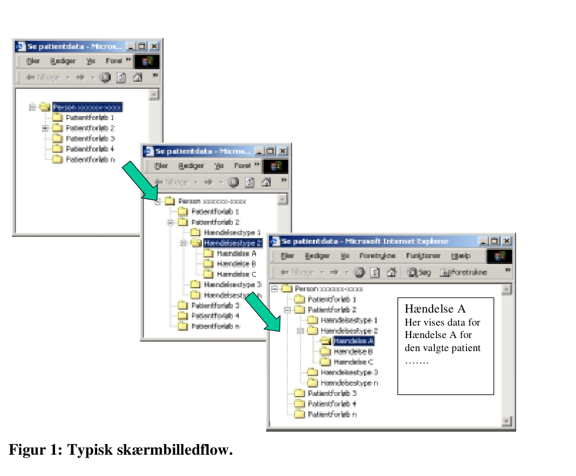
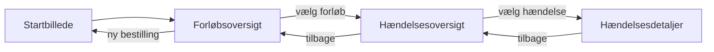
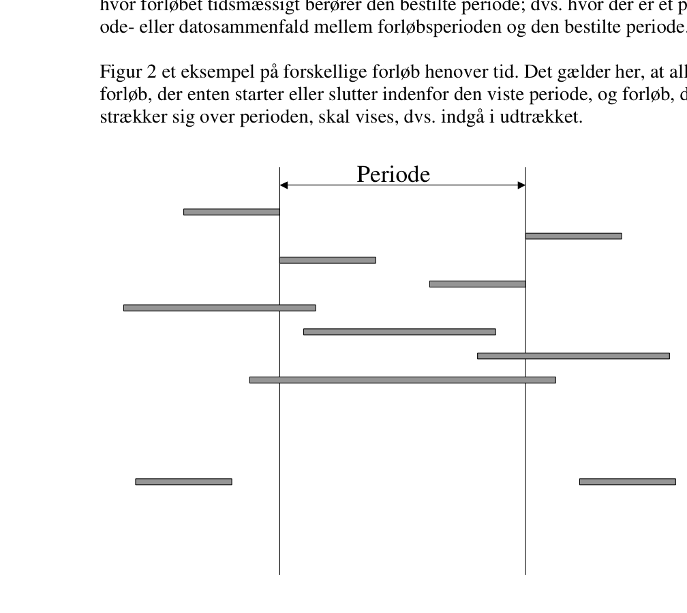
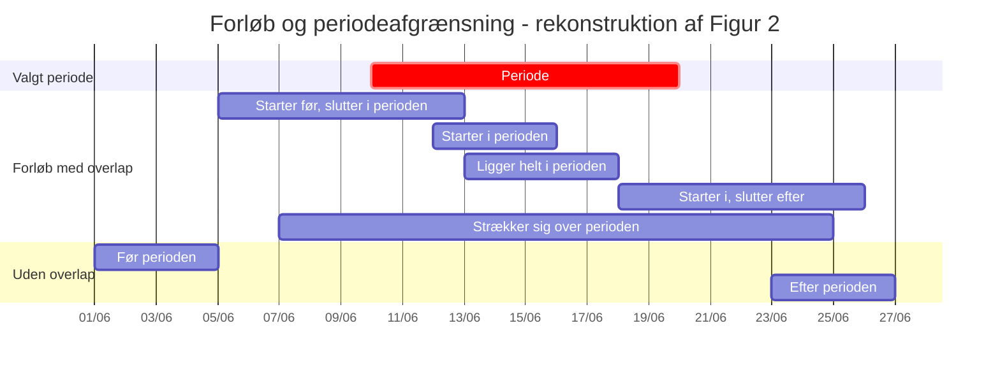

# SUP-specifikation, version 2.0 - Bilag 7: Browserløsning

- **Status:** Udkast
- **Dato:** 12. juni 2003
- **Bilag:** 07
- **Kildeformat:** PDF
- **Bearbejdning:** Agent-egnet Markdown med kilde-sideankre og Mermaid-rekonstruktioner.

> **Agentnote:** PDF'en er den autoritative kilde. Mermaid-diagrammer mærket som semantiske rekonstruktioner er afledt af tekst eller figurer og er ikke normative. XML/WSDL-eksempler er bevaret som kodeblokke.

<!-- Kildeside 1 -->

SUP-specifikation, version 2.0

Browserløsning

Udkast af 12. juni 2003

Udarbejdet for

SUP-Styregruppen

© Uddrag af indholdet kan gengives med tydelig kildeangivelse

<!-- Kildeside 2 -->

Indholdsfortegnelse

## 1 Indledning................................................................................. 3

## 2 Browserstyring......................................................................... 3

### 2.1 Logon.................................................................................................. 3

### 2.2 Skærmbilleder..................................................................................... 4

### 2.3 Visning af forløb og hændelser .......................................................... 4

#### 2.3.1 Browservisning af forløb med en periodeafgrænsning............... 6

#### 2.3.2 Browservisning af forløb uden periodeafgrænsning. ................. 7

### 2.4 Fremvisningsstyring ........................................................................... 7

### 2.5 Hjælpefunktioner ................................................................................ 8

#### 2.5.1 SUP-databaser ............................................................................ 8

#### 2.5.2 Analyseudtræk ............................................................................ 8

#### 2.5.3 Meddelelser ................................................................................ 9

#### 2.5.4 Samtykke .................................................................................... 9

#### 2.5.5 Dataindhold i SUP-databaser.................................................... 10

## 3 Browserindhold...................................................................... 10

### 3.1 Generelt om Browserindhold............................................................ 10

### 3.2 "Blanke felter" .................................................................................. 11

### 3.3 Indhold på skærmbilleder ................................................................. 12

### 3.4 Tilknytning af oplysninger vha. links............................................... 13

### 3.5 Logning............................................................................................. 13

### 3.6 Sikkerhed .......................................................................................... 14

### 3.7 Udskrifter.......................................................................................... 14

<!-- Kildeside 3 -->

## 1 Indledning

Dette bilag indeholder en beskrivelse af minimumkrav til browserstyring og browserindhold.

SUP-browseren (også kaldet SUP-webapplikation) skal gøre det muligt at se data (f.eks. journaler), der er udtrukket fra forskellige fødesystemer i SUPformat og indlæst i en database med tilgang via webservices. Det kan være data vedr. forløb / kontakter, der tilhører egen afdeling, andre afdelinger, andre sygehuse eller andre amter.

## 2 Browserstyring

De forskellige funktioner i SUP-browseren skal være logisk og hierarkisk opbygget, idet dette er en forudsætning for, at man kan udnytte fordelene ved den enkle begrebsmodel, der er defineret i SUP-løsningen.

### 2.1 Logon

Systemet skal være beskyttet af en logonfunktion, der etablerer adgang til systemet. Startbilledets udseende kan være afhængig af, hvilke parametre systemet kaldes med jf. Bilag 9. Logonfunktionen skal sikre, at kun de brugere, som har et bruger-ID og et password, og som kan genkendes af systemet, får adgang. I tilknytning til logonfunktionen skal brugeren autoriseres med tildeling af brugeradgange og -rettigheder. Autorisation på følgende niveauer er nødvendig:

- Systemadministrator, som skal have adgang til alle funktioner, og skal
kunne administrere brugere, dvs. oprette, rette og slette brugere.

- Analysator-1, som skal have adgang til anonymiseret analyseudtræk.
- Analysator-2, som skal have adgang til ikke-anonymiseret analyseudtræk.
- Bruger, som skal have adgang til at se SUP-data, men ikke til analyseud-
træk.

Når der er givet adgang til systemet, skal der være en tidsgrænse for, hvor længe systemet må stå åbent i ubenyttet tilstand. Hvis tidsgrænsen er overskredet, skal der foretages ny logon til systemet.

<!-- Kildeside 4 -->

### 2.2 Skærmbilleder

Visningsfunktionen i SUP-browseren skal indeholde følgende skærmbilleder:

- Startbillede, som skal indeholde felter til bestilling af data fra SUP-
databasen, herunder akut bestilling af data fra et fødesystem.

- Forløbsoversigt, som på oversigtsform skal vise de udtrukne forløb.
- Hændelsesoversigt, som på oversigtsform skal vise de udtrukne hændelser.
- Hændelsesdetaljer, som på detailniveau skal vise de relevante oplysninger
for en given hændelse.

Herudover skal der være skærmbilleder til følgende hjælpefunktioner:

- Redigering af tilgængelige SUP-databaser. Styring af, hvilke SUP-
databaser Browseren har adgang til, dvs. hvilke databaser brugeren kan se patientdata fra..

- Bestilling af dataudtræk til analyse og download af disse.
- Vis meddelelser. Her skal fremvises en meddelelseslog for hver patient,
hvor man bl.a. kan se, hvornår udtræk er foretaget fra fødesystemet, og hvornår akutudtræk er igangsat.

- Vis SUP-afdelingsbeskrivelse, hvor oplysninger om dataindhold i dataud-
træk fra den enkelte afdeling skal vises.

### 2.3 Visning af forløb og hændelser

<!-- Billedbeskrivelse: Figur 1: Typisk skærmbilledflow. Startbillede → Forløbsoversigt → Hændelsesoversigt → Hændelsesdetaljer. -->

<!-- Mermaid: Mermaid-rekonstruktion af Figur 1. -->

Kildeasset: `bilag_07_browserloesning_assets/bilag_07_figur_01_typisk_skaermbilledflow.mmd`

Hvis SUP-databasen for en given patient indeholder forløb med journaldata fra flere sygehusafdelinger, skal Browseren vise disse forløb efter samme sorteringsog visningskriterier, som hvis forløb kun kom fra én sygehusafdeling. Herudover skal Browseren efter samme regler også kunne håndtere visning af data, der er baseret på læsning fra flere forskellige SUP-databaser. Når Browseren viser data fra flere forskellige databaser, skal det se ud på samme måde, som når der vises data fra én afdeling eller fra én SUP-database.

Ved Browservisning er det typiske skærmbilledflow følgende:

- Startbillede
- Forløbsoversigt
- Hændelsesoversigt
- Hændelsesdetaljer
Dette hierarki er illustreret i Figur 1.

Navigeringen i browseren mellem forløb, hændelser og hændelsesdetaljer skal være nem, letforståelig og sammenhængende for brugeren på en brugervenlig måde.

<!-- Kildeside 5 -->

Hændelse A Her vises data for Hændelse A for den valgte patient …….

**Figur 1: Typisk skærmbilledflow.**

Ud over styring via f.eks. knapper, som beskrives efterfølgende, skal et klik på et forløb i forløbsoversigten give en hændelsesoversigt, og et klik på en hændelse på hændelsesoversigten skal give et billede med hændelsesdetalje. Måden, man navigerer rundt mellem oversigterne, bør være ens overalt i Browseren. Man kan evt. tilføje "links" for yderligere detaljering, f.eks. hændelsesnavnet "Notat" på et notat på en hændelsesoversigt. Et klik på linket "Notat" skal i dette eksempel resultere i et skærmbillede med notatdetalje.

Fremhævede links på hændelsesoversigten kan evt. ændres fra hændelsestype til f.eks. primærkodens tekst, hvor det måtte skønnes hensigtsmæssigt.

Brugeren skal i browseren have mulighed for at bestille patientdata fra en eller flere SUP-databaser ved at angive følgende parametre:

- SUP-databaser (bør default være udfyldt med "egen" SUP-database)
- CPR-nummer
- Fra dato/tid: (hvis uudfyldt antages "low" f.eks. = 01.01.1900)
- Til dato/tid: (hvis uudfyldt antages "high" f.eks. = 01.01.2500)
Se i øvrigt Bilag 6 for flere detaljer.

Angivelse af SUP-database(r) og CPR-nr. er obligatorisk, medens en periodeafgrænsning er frivillig. Manglende udfyldelse af Til-dato/tid skal opfattes som

<!-- Kildeside 6 -->

"alle forløb fra Fra-dato/tid og fremefter". Omvendt ved manglede udfyldelse af Fra-dato/tid.

Browseren skal for den givne patient herefter modtage og vise alle de forløb, hvor forløbet tidsmæssigt berører den bestilte periode; dvs. hvor der er et periodeeller datosammenfald mellem forløbsperioden og den bestilte periode.

**Figur 2 et eksempel på forskellige forløb henover tid. Det gælder her, at alle**

forløb, der enten starter eller slutter indenfor den viste periode, og forløb, der strækker sig over perioden, skal vises, dvs. indgå i udtrækket.

Periode

**Figur 2: Forløb og perioder.**

#### 2.3.1 Browservisning af forløb med en periodeafgrænsning.

<!-- Billedbeskrivelse: Figur 2: Forløb og perioder. Forløb med tidsmæssigt overlap med perioden medtages; forløb helt før eller efter perioden udelades. -->

<!-- Mermaid: Mermaid/Gantt-rekonstruktion af Figur 2. Tidsværdierne i rekonstruktionen er illustrative. -->

Kildeasset: `bilag_07_browserloesning_assets/bilag_07_figur_02_forloeb_og_perioder.mmd`

De forløb, der berører den valgte periode, skal vises på forløbsoversigten. I

**Figur 2 drejer det sig om alle forløb undtagen de to nederste, som ligger på**

hver side af periodeafgrænsningen.

Brugeren skal herefter have mulighed for at vælge ét eller alle forløb. De(t) valgte forløb skal efterfølgende være udgangspunktet for en visning af hændelser på en hændelsesoversigt, også selvom nogle af disse forløbs hændelser ligger udenfor periodeafgrænsningen. Brugeren skal imidlertid kunne afgrænse fremvisningen af hændelser, således at kun hændelser, der indgår i de valgte forløb, og hvis starttidspunkt ligger indenfor den valgte periode, fremvises.

<!-- Kildeside 7 -->

Bemærk at hændelsens starttidspunkt i Domænemodellen er navngivet forskelligt fra hændelse til hændelse, f.eks.: Diagnosetidspunkt, Starttidspunkt, Konstateringstidspunkt, Observationstidspunkt, Prøvetidspunkt og Rekvisitionstidspunkt.

Begrundelsen for disse krav til afgrænsningsmuligheder er bl.a., at lange ambulante forløb vil kunne forstyrre overblikket, såfremt det ikke er muligt at afgrænse indholdet ved hjælp af både en periode og et inklusionskriterium for hændelsernes starttidspunkt.

#### 2.3.2 Browservisning af forløb uden periodeafgrænsning.

Alle patientens forløb fra de(n) valgte SUP-database(r) skal vises på forløbsoversigten. I Figur 2 drejer det sig om alle de viste forløb.

Brugeren skal herefter have mulighed for at vælge ét eller alle forløb, hvorefter der skal fremvises en oversigt over de hændelser, der indgår i de valgte forløb.

### 2.4 Fremvisningsstyring

De "knapper", der anvendes til styring, skal altid være synlige, også når der scrolles på billedet.

På alle skærmbilleder skal det være muligt at foretage "Log af" og navigere tilbage til det foregående skærmbillede og til et skærmbillede indeholdende felter til bestilling af andre data.

Hændelserne er opdelt i typer, og det skal være muligt nemt at vælge og vise de enkelte hændelsestyper på oversigtsbillederne. Samtidig skal det være muligt at få en oversigt over samtlige hændelser.

De mest anvendte hændelsestyper skal kunne vælges først. Som standard rækkefølge for disse anbefales: Notater, Medicinordinationer, Prøveresultater, Diagnoser, Procedurer, Ordinationer, Rekvisitioner og Observationer/fund. Da de mest anvendte hændelsestyper kan variere fra afdeling til afdeling, kan det overvejes at designe systemet således, at hver afdeling kan opstille sin egen rækkefølge. Det vil dog være en klar fordel, såfremt man kunne blive enige om en fast rækkefølge, idet en dynamisk profilering ikke er en enkel sag.

Herudover skal styringen i Browseren håndtere differentiering af hændelsestyper afhængig af indhold. Hvis der ikke er indhold (dvs. der findes ingen hændelser af en bestemt type), skal oversigten gøres informativ, forstået på den måde, at det ikke skal være muligt at vælge denne hændelsestype, f.eks. ved at "knappen" ikke er klik-aktiv.

<!-- Kildeside 8 -->

Fremvisningen af Prøveresultater, Medicinordinationer, Medicingivninger og Observationer/fund vil ofte være uoverskuelig, fordi mange forløb har et stort antal hændelser af disse typer. Udover en periodeafgrænsning skal Browseren derfor kunne tilbyde forskellige former for sortering. Overskueligheden kan især opnås gennem forskellige sorteringer på kronologisk eller omvendt kronologisk samt prøveresultaters primærkode - efterfølgende kaldet "type".

Dette giver følgende sorteringsmuligheder:

1.   Kronologisk og type
2.   Omvendt kronologisk og type
3.   Type og kronologisk
4.   Type og omvendt kronologisk
For sorteringsmulighederne i 1 og 2 har det ingen relevans at vælge / fravælge "type", så derfor er "type" med som fast 2. sortering.

De knapper, der oprettes til sorteringen, skal på Browseren have en fornuftig ledetekst eller Tool Tip, således at det umiddelbart kan ses, hvad der sorteres på. Teksten i Tool Tip'et kan evt. være ovenstående tekst vedr. sorteringen.

Hvis der skulle være behov herfor, kan "Type" udvides, således at der valgfrit kan vælges mellem sortering på type eller dennes kodetekst.

### 2.5 Hjælpefunktioner

#### 2.5.1 SUP-databaser

Gennem Browseren skal der være mulighed for at styre, hvilke SUP-databaser Browseren kan vise data fra. Fra Browseren skal der være adgang til en tabel, som bl.a. indeholder følgende felter:

- URL/IP-adresse
- SUP-databasens ejerforhold
Felterne skal kunne ajourføres via Browseren af systemadministratoren.

Se yderligere krav og anbefalinger i Bilag 11.

#### 2.5.2 Analyseudtræk

Gennem Browseren skal det er være muligt at bestille udtræk til analyse ved angivelse af de parametre, der er anført i Bilag 8. I denne SUP version (SUP

<!-- Kildeside 9 -->

specifikation, version 2.0) må der kun hentes analyseudtræk fra eget amts SUPdatabase, evt. inkl. overførte patientdata fra andet amt jf. Bilag 11.

Brugeren bestiller et analyseudtræk ved at opstille afgrænsningskriterier med hensyn til hændelsestype, sygehusafdeling, periode og anonymitet. Browseren kalder databaseapplikationen via webservicen "Analyse-Service". Denne service returnerer et filnavn på det (senere) generede analyseudtræk. Når udtrækket er genereret, placeres det i et katalog, hvortil Browseren har adgang (evt. via FTP). Browseren skal styre, at det kun er den bruger, der har bestilt et bestemt udtræk, som har adgang til at downloade udtrækket.

Adgangskontrollen til udtrækket kan f.eks. implementeres ved, at Browseren har en database, som holder styr på sammenhængen mellem den enkelte bruger og det udtræk, han bestiller. Når brugeren vælger en funktion til download af generede datasæt, skal han kunne se links til alle de datasæt, han har bestilt indenfor f.eks. de sidste 10 dage (antal dage skal styres fra en property-fil, så denne er generel for hele Browseren). Når en bruger vælger at downloade et datasæt, undersøger Browseren, om udtrækket er tilgængelig (færdig) på serveren. Hvis udtrækket er færdigt, kan brugeren downloade dette; ellers skal han præsenteres for en fejlmeddelelse.

#### 2.5.3 Meddelelser

Det skal være muligt fra Browseren at se, hvornår patientdata er udtrukket fra et fødesystem, og ved bestilling af akutudtræk skal brugeren have mulighed for at se, om udtrækket er igangsat. For at håndtere disse situationer skal Browseren kunne vise de meddelelser, som relaterer sig til et SUP-udtræk. Det drejer sig om følgende meddelelser:

- Data er overført den xx.xx.xx kl. yy:yy fra sygehus zzzzzz
- Data findes, men der er fejl i udtrækket, kontakt sygehus zzzzzz
- Data findes ikke på sygehus zzzzzz
- Akut-udtræk er igangsat den xx.xx.xx kl. yy:yy fra sygehus zzzzzz
#### 2.5.4 Samtykke

I SUP-projektet er det valgt at basere sig på Sundhedsportalens "midlertidige" samtykkemodel, dvs. samtykke i SUP skal foregå efter samme principper som i Sundhedsportalen.

Det betyder, at før en bruger kan få adgang til patientfølsomme data, skal han i Browseren afgive en samtykkeerklæring svarende til nedenstående to muligheder:

- Patienten har givet samtykke til at brugeren kan indhente oplysninger om
patienten.

<!-- Kildeside 10 -->

- Indhentelse af oplysninger sker af hensyn til aktuelle behandlingsforløb og
patienten er ude af stand til at give sit samtykke.

Samtykket skal gemmes af Browseren, og det skal være muligt for en systemadministrator efterfølgende at kontrollere de afgivne samtykker. Det kan evt. ske via Browseren.

#### 2.5.5 Dataindhold i SUP-databaser

Når en kliniker ser på oplysninger i Browseren, vil han principielt have adgang til informationer fra en lang række sygehuse og afdelinger.

Det enkelte sygehus og den enkelte afdeling har sin egen individuelle anvendelse af amtets IT-systemer. Der kan således være en afdeling, der har indført et EPJ-system, mens afdelingen ved siden af endnu ikke har gjort det. En afdeling kan også have gennemført en arbejdsgangsomlægning, der har medført, at der registreres nye eller ændrede oplysninger i afdelingens IT-systemer.

For at styre denne problemstilling skal der oprettes en afdelingsbeskrivelse, der bl.a. skal indeholde informationer om, hvilke data der er indeholdt i SUPudtrækket for hver periode og i hvilken form. Den samlede problemstilling og en løsning herpå er beskrevet i Bilag 10.

Afdelingsbeskrivelsen skal være tilgængelig for brugere via Browseren, og funktionskravene til Browseren er følgende:

- SUP-browseren skal kunne fremvise en afdelingsbeskrivelse, f.eks. ved at
brugeren angiver en sygehusafdelings navn.

- SUP-browseren kan anvende de enkelte hændelsestypers beskrivelse til at
give en kontekstafhængig beskrivelse af afdelingens dataindhold.

## 3 Browserindhold.

### 3.1 Generelt om Browserindhold.

Det er et krav, at de data, som udtræksprogrammet danner fra det lokale fødesystem, fremstår i Browseren nøjagtig med samme dataindhold, som de er udtrukket med. Browseren må således ikke konvertere data (medmindre dette er specificeret), og må ikke forholde sig til det konkrete dataindhold, herunder lade sin funktionalitet styre af dette.

<!-- Kildeside 11 -->

Browseren skal kunne vise patientdata udtrukket i SUP-format version 2.0 og opefter.

Generelt for alle skærmbilleder gælder, at der skal være ledetekst til alle felter - også de felter, der er blanke i fødesystemet, og felter, som er blanke, fordi de ikke understøttes af fødesystemet (se afs. 3.2). Når der vises en kode eller en kodetekst, skal klassifikationstypen vises. Dog således, at hvis både kode og tekst felter vises i sammenhæng, vises klassifikationstypen kun én gang. Ledeteksten til en tillægskode skal kun medtages, såfremt der vises en tillægskode.

Med nogle få undtagelser, som er beskrevet i specifikationen af de enkelte felter, skal alle klassificerede begreber repræsenteres med følgende tre felter:

- Kode. Koder angives altid i deres fulde længde. SKS-koder skal derfor
være inkl. forbogstavet.

- Klassifikationstype. Her angives den anvendte klassifikation med nogle
fastlagte typebetegnelser, f.eks. "SKS", "LMS", "SNOMED", "SUP", "Lokal" og "Ingen". De 4 første typer giver sig selv, medens den sidste anvendes ved visse typer af ikke-klassificerede data. Angivelse af klassifikationstypen for hver kode muliggør, at SUP kan håndtere andre klassifikationer end SKS.

- Kodetekst. Feltet skal (ved alle klassifikationstyper undtagen "Ingen") in-
deholde den på hændelsens starttidspunkt gældende kodetekst for den pågældende kode. Ved at medtage kodeteksten opnår man for det første, at modtageren ikke nødvendigvis skal være i besiddelse af et fuldt opdateret klassifikationssystem for at kunne læse SUP-data. Dette er en stor fordel for brugere, der kun har adgang til data via en SUP-Browser, f.eks. en hjemmesygeplejerske eller patienten selv. For det andet indebærer medsendelse af kodeteksten, at SUP på struktureret form kan kommunikere lokalt klassificerede begreber og ikke-klassificerede begreber.

Alle skærmbilleder, der viser oplysninger, der kan knyttes til en person, skal vise CPR-nummer, Navn, Adresse, Postnr. og By. Herudover skal forløbsoversigter, hændelsesoversigter (hvis de tager udgangspunkt i ét bestemt forløb) og hændelsesdetailbilleder vise følgende oplysninger om forløbet: Startdato, slutdato, fødesystem, kode for ansvarlig enhed + tekst, seneste forløbsdiagnosekode + kodetekst + klassifikationstype (alternativt kode for aktionsdiagnose + tekst + klassifikationstype). Ovenstående oplysninger bør på hændelsesoversigter og detailbilleder blive stående i en fast ramme på skærmen, når der scrolles.

### 3.2 "Blanke felter"

Et felt kan være blank, enten fordi feltet er blank i fødesystemet, eller fordi fødesystemet ikke understøtter feltet.

<!-- Kildeside 12 -->

Hvis et felt er blank i fødesystemet, skal udtræksprogrammet fremsende en " " (én blank karakter). Hvis fødesystemet ikke understøtter feltet, skal udtræksprogrammet fremsende et "?" (et spørgsmålstegn) som Browseren skal omsætte til "" (et stopsignal), som er et specialtegn, som kun meget sjældent anvendes i andre sammenhænge. Når cursoren bevæger sig henover specialtegnet, skal der komme en lille forklaring (Tool Tip): "Understøttes ikke af fødesystemet"

Indeholder et felt i fødesystemet tilfældigvis et "?" som den første og eneste karakter, så skal udtræksprogrammet fremsende "? " (et spørgsmålstegn og en blank karakter).

### 3.3 Indhold på skærmbilleder

Man skal kunne vælge et skærmbillede med personoplysninger, som skal indeholde følgende oplysninger (gældende på udtrækstidspunktet):

- CPR-nummer.
- Navn
- Adresse
- Postnummer
- By
- Kommunekode
- Kommune
- Kommunetilflytningsdato
- Ydernummer for egen læge
- Navn for egen læge
- Dato for start for egen læge
Man skal kunne vælge et skærmbillede med Cave-oplysninger med følgende oplysninger:

- Dato for, hvornår Cave er registreret
- Kode for den sygehusafdeling, der har registreret oplysningen
- Tekst for Cave
På hændelsesoversigterne bør det tilstræbes, at hændelsestyperne medicinordination, medicingivning, prøveresultat og observationer/fund indeholder så mange af hændelsernes oplysninger, at oversigten er tilstrækkelig til det almindelige kliniske brug. Herved undgå klinikeren at skulle se på detailbilledet for hver enkelt af disse (ofte talrige) hændelser.

På detailskærmbillederne bør man overholde følgende grundregel og dennes undtagelser: Alle felter bør fremvises (evt. som blanke felter), hvis de kan være udfyldt i en konkret situation, også selvom et givet system ikke understøtter

<!-- Kildeside 13 -->

feltet. Felter, som ikke kan forekomme på en given hændelse, bør ikke fremvises. Der er følgende undtagelser fra denne grundregel:

- Tillægskodefelter bør kun fremvises, hvis de er udfyldt.
- Følgende felter bør udelades på detailskærmbillederne: Fødselsdato, Tek-
nisk oprettet forløb, Forløbs-ID, Hændelses-ID, Ugyldighedstidspunkt, Registreringstidspunkt, Registrerende institution, Registrerende person, Tilstedetidspunkt, Sikkerhedskode.

- Følgende felter kan evt. udelades på detailskærmbillederne: Køn, Personal-
der, Fødesystem, Forløbsstatus, Ansvarlig person ID + Titel + Navn.

Man kan overveje at tilføje en funktion, som muliggør, at alle notater kan ses samlet som ét langt notat. Det kan lette læsningen for brugeren.

### 3.4 Tilknytning af oplysninger vha. links.

SUP-specifikationen giver mulighed for at medsende "links" som en del af udtrækket. Links kan bl.a. benyttes til at tilknytte grafiske data som f.eks. EKG og røntgenbilleder, og starte andre applikationer.

Det forudsættes i denne version, at Browseren blot skal vise et "link-felt" som SUP-databasen leverer. En evt. grafisk præsentation skal foregå direkte via "linket", f.eks. som en pdf-fil. En afklaring af, hvordan linkede filer skal placeres i sikre og tilgængelige miljøer, er udenfor SUP-projektets opgave. Løsningen forudsætter sikre netforbindelser med stor båndbredde.

### 3.5 Logning.

Det skal sikres, at logningen af brugen af Browser-løsningen følger de sikkerhedsmæssige regler. Følgende skal logges:

- Brugerens bruger-ID
- IP-adresse på brugerens pc
- Hvornår en bruger logger på og logger af Browseren
- Hvilke CPR-nummer forespørger brugeren på
- Hvilke oversigtsbilleder brugeren ser
- Hvilke hændelsesdetailbilleder brugeren ser
- Brug af systemet efter timeout
- Uautoriseret forsøg på logon
På dette grundlag skal det være muligt at se, hvad en Bruger / IP-adresse har foretaget sig i SUP-Browseren og indenfor hvilket tidsrum, når man finder "sporet" fra Logon til Logout. Desuden skal læseservices logge request-

<!-- Kildeside 14 -->

parametrene og returkoden af de enkelte læsninger, så det bliver muligt at se omfanget af de data, der faktisk blev returneret.

Desuden bør der skabes en mulighed for at logge en række oplysninger på MSGog TRACE-log, som f.eks.:

- Information
- Fejlsituationer
- Trace
Der bør etableres adgang til logfiler fra Browseren for systemadministratoren jf. Bilag 12.

### 3.6 Sikkerhed

"Tilbage-" og "Fremknapperne" i menulinien i Browseren må kun vise de billeder, der ligger mellem logon og logout. Der må således ikke vises billeder fra en session, hvor brugeren har logget ud.

Det skal endvidere sikres, at bruger-ID, password og CPR-nummer m.v. ikke "caches" (huskes) af Browseren, således at uvedkommende ikke får en utilsigtet adgang til en kopi af de fremviste skærmbilleder.

For at gennemføre disse krav, er der en forudsætning, at der anvendes Microsoft Explorer 5.5 eller en nyere version.

Det høje sikkerhedsniveau vil principielt øge svartiderne, f.eks. fordi det ikke vil være muligt at gå tilbage til en allerede vist grafik, medmindre denne downloades igen. Det er dog tvivlsomt, om dette vil få nogen større betydning i praksis.

Browseren skal sikre, at sikkerheden ikke omgås ved anvendelse af funktionstaster, bl.a. F5 tasten.

### 3.7 Udskrifter

Browseren skal indeholde en printfunktion, der kan printe patientorienterede skærmbilleder. Printet skal som minimum indeholde patientens navn og CPRnummer, dato og klokkeslæt for printet, samt indholdet af skærmbilledet jf.

<!-- Kildeside 15 -->

Udskriftsprogrammet skal kunne udskrive de forskellige notater uden meningsforstyrrende forvrængning af indhold i det af afsenderen anvendte design. Styringen i udskriftsprogammet skal tage højde for, at notater kan indeholde grafik, tabeller og faste opstillinger, som så vidt det er muligt, skal udskrives samlet på én side. Det bør endvidere være muligt at udskrive en enkelt hændelse (f.eks. et enkelt journalnotat), en kontinuation af journalnotater eller en hel journal på én gang.

Den medsendte "Brødtekst" til hændelsestypen Notat anvendes direkte til visning i Browseren. Den afsenderstyrede redigering af teksten må således ikke i sig selv indeholde "sidedefinitioner" (HTML-sektionen <HEAD> ... </HEAD>), og af hensyn til en efterfølgende Stylesheet-transformation skal teksten være udtrykt i XHTML.

Ved at anvende simpel og udskriftsvenlig HTML kan Browseren danne udskrifter. Den afsenderstyrede redigering af tekst (fritekst og notater) skal være i A4-høj format, hvor der er taget hensyn til, at der normalt anvendes margin, sidehoved og sidefod ved udskrift fra en Browser. I Internet Explorer er dette som standard sat til ca. 1,75 cm. Hvis afsenderen anvender et fast sidelayout uden wrap, bør der tages højde for disse marginer i det generede print.
