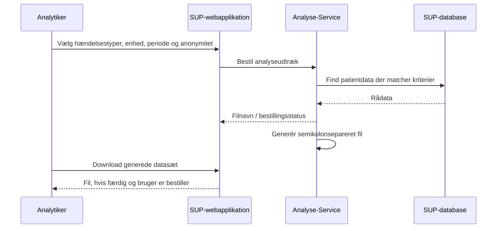
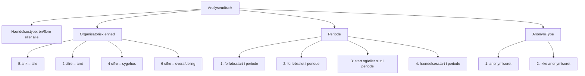

# SUP-specifikation, version 2.0 - Bilag 8: Analyseudtræk

- **Status:** Udkast
- **Dato:** 9. juni 2003
- **Bilag:** 08
- **Kildeformat:** PDF
- **Bearbejdning:** Agent-egnet Markdown med kilde-sideankre og Mermaid-rekonstruktioner.

> **Agentnote:** PDF'en er den autoritative kilde. Mermaid-diagrammer mærket som semantiske rekonstruktioner er afledt af tekst eller figurer og er ikke normative. XML/WSDL-eksempler er bevaret som kodeblokke.

<!-- Kildeside 1 -->

SUP-specifikation, version 2.0

Analyseudtræk

Udkast af 9. juni 2003

Udarbejdet for

SUP-Styregruppen

© Uddrag af indholdet kan gengives med tydelig kildeangivelse

<!-- Kildeside 2 -->

Indholdsfortegnelse

## 1 Snitfladebeskrivelse ................................................................. 3

## 2 Transaktionsflow ..................................................................... 3

### 2.1 Parametre til Analyseservice .............................................................. 3

#### 2.1.1 Valg af hændelsestyper............................................................... 3

#### 2.1.2 Valg af organisatorisk enhed ...................................................... 3

#### 2.1.3 Valg af periode ........................................................................... 4

#### 2.1.4 Valg af anonymitet / genkendelighed......................................... 4

### 2.2 Andre udtrækskriterier........................................................................ 5

### 2.3 Datagrundlaget for udtrækkene .......................................................... 5

### 2.4 Levering af udtræksfil ........................................................................ 5

#### 2.4.1 Leveringsmetode ........................................................................ 5

#### 2.4.2 Leveringstid ................................................................................ 6

#### 2.4.3 Leveringsmængde....................................................................... 6

### 2.5 Dataformat på udtræksfil .................................................................... 6

### 2.6 Sikkerhed ............................................................................................ 7

<!-- Kildeside 3 -->

## 1 Snitfladebeskrivelse

På baggrund af de oplysninger, der er lagret i SUP-databasen, er det muligt at udtrække data til analyseformål. Udtrækkene bestilles og downloades via skærmbilleder i SUP-webapplikationen, som også sørger for autentifikation og verifikation af brugeren. Data kan så efterfølgende behandles hos brugeren i en separat applikation.

De relevante data udtrækkes iht. brugerens ønsker om begrænsninger i periode og organisation (f.eks. sygehusafdeling) og har kun form af rå data, der kan leveres i både anonymiseret og ikke-anonymiseret form. Data leveres i en semikolonsepareret fil, der kan læses af et lokalt analyseværktøj, f.eks. Excel.

## 2 Transaktionsflow

<!-- Mermaid: Sekvensdiagram rekonstrueret fra transaktionsflowet. -->

Kildeasset: `bilag_08_analyseudtraek_assets/bilag_08_analyse_transaktionsflow.mmd`

Analytikeren opstiller afgrænsningskriterier mht. hændelsestyper, organisatorisk enhed, periode og anonymitet. Systemet fremstiller herefter et datasæt med de patientdata, der opfylder de opstillede afgrænsningskriterier.

En mere detaljeret beskrivelse af servicen findes i Bilag 3 i usecasen ”Forespørg på flere patienter”.

### 2.1 Parametre til Analyseservice

<!-- Mermaid: Flowdiagram over de beskrevne afgrænsningsparametre. -->

Kildeasset: `bilag_08_analyseudtraek_assets/bilag_08_parameterlogik.mmd`

Nedenstående er en beskrivelse af de parametre, som skal angives for at få det ønskede analyseudtræk. Værdien i [] f.eks. [1] angiver parameterens værdi for at opnå det ønskede.

#### 2.1.1 Valg af hændelsestyper

Man skal gennem afkrydsning kunne afgrænse udtrækket til netop de hændelsestyper (én eller flere), man ønsker medtaget. "Alle hændelser" bør også være en valgmulighed, således at brugeren undgår at skulle vælge alle hændelsestyperne én ad gangen.

#### 2.1.2 Valg af organisatorisk enhed

Man skal kunne afgrænse udtrækket fra en given SUP-database til en bestemt organisatorisk enhed gennem angivelse af følgende to parametre:

<!-- Kildeside 4 -->

- Enhed: Udtrækket skal kunne afgrænses til et amt, et sygehus eller en
overafdeling, hvilket skal ske gennem angivelse (fra venstre) i et "enhedsfelt" iht. Sundhedsstyrelsens Sygehusklassifikation:

  - blank: alle enheder
  - 2 cifre: Et amt
  - 4 cifre: Et sygehus
  - 6 cifre: En overafdeling
- Enhedstype: Hvis "Enhed" er blank udfyldes "Enhedstype" ikke. Ellers
angives én af følgende muligheder:

  - [1] Udtræk af hændelser tilhørende forløb, hvor "Enhed" er
"Oprindeligt forløbsansvarlige enhed".

  - [2] Udtræk af hændelser, hvor enhed er "Ansvarlig enhed" (se
Elementstrukturen i Bilag 1) for hændelsen.

#### 2.1.3 Valg af periode

Man skal kunne afgrænse de udtrukne hændelser tidsmæssigt ved at angive følgende to parametre:

- Periode. Her angives en fra- og en tildato, der begge skal opfattes som in-
kluderet i perioden.

- Periodetype. Her angives én af følgende muligheder for, hvad udtrækket
skal omfatte:

  - [1] Hændelser tilhørende forløb, hvis startdato ligger i perioden.
  - [2] Hændelser tilhørende forløb, hvis slutdato ligger i perioden.
  - [3] Hændelser tilhørende forløb, hvor enten start- og/eller slut-
dato ligger i perioden.

  - [4] Hændelser, hvor hændelsens startdato (se Elementstruktu-
ren) ligger i perioden.

Ved kontaktregistrering muliggør de teknisk oprettede forløb, at der her kan vælges en periode for kontaktperiodernes startog/eller slutdato.

#### 2.1.4 Valg af anonymitet / genkendelighed

Brugeren kan vælge, at data ikke skal anonymiseres, såfremt han har de rigtige rettigheder.

- AnonymType. Her angives én af følgende muligheder:
  - [1] Anonymiseret.
  - [2] Ikke anonymiseret.
<!-- Kildeside 5 -->

### 2.2 Andre udtrækskriterier

Med de her beskrevne kriterier kan man altid afgrænse sit udtræk til en for brugeren og systemet håndtérbar størrelse. Herudover kan det enkelte amt naturligvis efter aftale med sin leverandør få udviklet ethvert andet udtrækskriterium, man måtte ønske. Det vil det dog næsten altid være hurtigst og lettest at foretage en yderligere afgrænsning af udtrækket med det lokale analyseværktøj, f.eks. Excel.

I version 2.0 er det kun muligt at hente analysedata fra sin eget amts SUPdatabase. Udtræk fra flere SUP-databaser må derfor evt. samkøres efterfølgende.

### 2.3 Datagrundlaget for udtrækkene

Der må ikke optræde ”skjulte” personhenførbare oplysninger i dataudtrækkene fra fødesystemerne, f.eks. CPR-nummer skjult i hændelses-ID’er eller i fritekstfelter.

### 2.4 Levering af udtræksfil

#### 2.4.1 Leveringsmetode

Mht. til "aflevering" af den semikolonseparerede fil er der flere løsninger, som alle kan være aktuelle afhængigt af den valgte implementering og datasættenes størrelse:

- brugeren skal kunne downloade fra webapplikationen via HTTP
- brugeren kan downloade fra webapplikationen via FTP
- systemet kan udsende udtræksfilen vedhæftet en mail (mange mailbok-
se vil dog være for små til at rumme datasættene, medmindre disse er zippede og ret begrænsede i størrelse).

Download skal være beskyttet, således at kun "bestilleren" har adgang til udtræksfilen. Download af udtræksfilen foregår ved, at analytikeren efterfølgende i SUP-webapplikationen vælger skærmbilledet "Download generede datasæt", hvor hans bestillinger er præsenteret med nærmere oplysninger (f.eks. afgrænsningsoplysningerne og bestillingsdatoen) samt et link til filen. Fra dette link kan analytikeren downloade udtræksfilen.

<!-- Kildeside 6 -->

#### 2.4.2 Leveringstid

Leveringstiden afhænger af faktorer som: antal samtidige ønskede udtræk (på serveren), udtrækkenes størrelse, serverens belastning etc. Udtrækkene

- kan være tilgængelige realtime (her og nu)
- bør være tilgængelige samme arbejdsdag
- skal være tilgængelige næste arbejdsdag
#### 2.4.3 Leveringsmængde

Der bør ikke være begrænsninger på størrelsen af udtræksfilen. Såfremt der er begrænsninger, skal disse være klart formulerede og ikke så begrænsende, at klinikkerne ikke kan anvende udtrækkene. Det afhænger af den lokale konfiguration og afgøres lokalt.

### 2.5 Dataformat på udtræksfil

Analyseudtrækket skal være en semikolon-separeret fil, som indeholder relevante data for de valgte hændelser. Data er jf. Bilag 1 (se dette!) følgende:

Person ID;Køn;Personalder;Fødesystem;Tek. forløb;Forløbs-ID;Forløbsstart;Forløbsafslut;Opr. forløbs-ansv. enhed kode;Opr. forløbs-ansv. inst tekst;Opr. forløbs-ansv. afd. tekst;Forløbs-diag. kode;Diag. klas;Forløbs-diag. tekst;Hæn. ID;Hæn. type;Hæn. start;Hæn. slut;Andet tidspunkt;Ansv. enhed kode;Ansv. inst. tekst;Ansv. afd. tekst;Ansv. person;Anden enhed kode;Anden inst. tekst;Anden afd. tekst;Anden person;Afslut. enhed kode;Afslut. inst. tekst;Afslut. afd. tekst;Afslut. person;Stedkode;Sted-tekst;Forløb-status;Ugyl. tidsp;Reg. tidsp;Reg. inst-afd;Reg. pers.;Tilstede tidsp;Sik. kode;Hæn. ref.;Objekt ref.;Fri tekst;Værdi 1;Enhed værdi 1;Værdi 2; Enhed værdi 2;Værdi 3; Enhed værdi 3;Art;Primær-kode;Klas;Kode-tekst;Suppl. kode 1;Klas;Kodetekst;Suppl. kode 2;Klas;Kode-tekst;Suppl. kode 3;Klas;Kode-tekst;Suppl. kode 4;Klas;Kode-tekst;Suppl. kode 5;Klas;Kode-tekst;Til-lægs-kode 1; Klas;Kode-tekst;Til-lægs-kode 2;Klas;Kode-tekst;Til-lægs-kode 3; Klas; Kode-tekst;Til-lægs-kode 4;Klas;Kode-tekst;Til-lægs-kode 5;Klas;Kode-tekst

I den første linie af analyseudtrækket er overskrifterne som vist ovenfor (se

Data i analyseudtrækket er separeret med ’;’ (semikolon) og indledt og afsluttet med "" (anførselstegn). Her er et eksempel på en del af en linie i analyseudtræksfilen:

<!-- Kildeside 7 -->

"010433-1AA5";"M";"68";"CSC OPUS";"X";"x091332133560000";"2001- 09-14 03:10:00";"2001-09-16 13:30:00";"6008210";"Vejle sygehus";......

ID'er (undtagen CPR-numre) skal foranstilles med karakteren ’x’, således at de opfattes som en alfanumerisk streng i den videre analyse.

### 2.6 Sikkerhed

Bestillinger af analyseudtræk skal logges af SUP-webapplikationen.

I alle tilfælde er det webapplikationen, som sørger for autentifikation og autorisation af brugeren, både mht. bestilling og "aflevering" af analyseudtrækket.

I tilfælde af anonymiseret dataudtræk, så skal CPR-numre ved hvert udtræk anonymiseres på en sådan måde, at alle sammenhænge mellem hændelserne i samme analyseudtræk bevares.

CPR-numre bør anonymiseres ens ved hvert udtræk, således at forskellige udtræk kan sammenlignes. Dette kræver en sikker algoritme.

Såfremt data ikke anonymiseres, skal data behandles som personfølsomme data f.eks. ved datatransmission.
