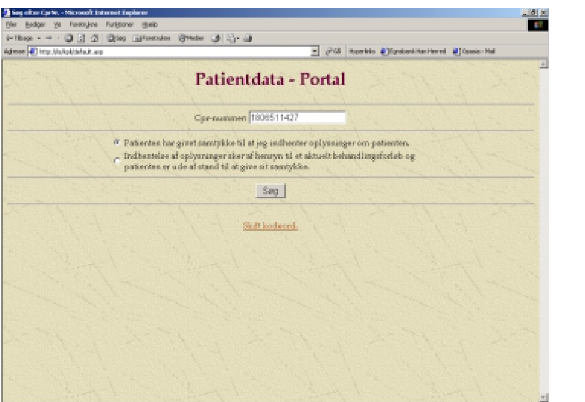

# SUP-specifikation, version 2.0 - Bilag 09: Sikkerhed og samtykke

> **Agentnote:** Dette dokument er konverteret fra den oprindelige PDF. Tekst og kode følger kildens ordlyd så tæt som praktisk muligt. Billedressourcer og Mermaid-rekonstruktioner er hjælpemidler til fortolkning; ved uoverensstemmelse har kildeteksten forrang.

## Billedressourcer

### Samtykke skaermbillede
<!-- Billedbeskrivelse: Skærmbillede med samtykkeerklæring fra Sundhedsportalen/SUP. Brugeren skal vælge en samtykkesituation før adgang til patientfølsomme data; samtykket gemmes til efterfølgende kontrol. -->

## Kildetekst

<!-- Kildeside 1 -->

SUP-specifikation, version 2.0

Bilag 9

Sikkerhed og samtykke

Udkast af 12. juni 2003

Udarbejdet for

SUP-Styregruppen

© Uddrag af indholdet kan gengives med tydelig kildeangivelse

<!-- Kildeside 2 -->

Bilag 9: Sikkerhed og samtykke
Udkast 12-06-03

Side 2 af 6
Indholdsfortegnelse

1
Introduktion ............................................................................. 3
2
Autentifikation......................................................................... 3
3
Autorisation.............................................................................. 5
4
Sikkerhedslogning og benyttelsesstatistik............................. 5
5
Samtykke .................................................................................. 6

<!-- Kildeside 3 -->

Bilag 9: Sikkerhed og samtykke
Udkast 12-06-03

Side 3 af 6
1
Introduktion

Som i alle IT-systemer, der indeholder personhenførbare sundhedsoplysninger,
er der krav om en høj grad af sikkerhed i SUP-løsningen. Dette bilag beskriver
SUP-projektets løsningsmodel for håndtering af sikkerhed og samtykke.

Sikkerhedsløsningen i SUP-projektet omfatter forskellige funktioner:

- Autentifikation: Korrekt identifikation af brugeren.
- Autorisation: Tildeling af rettigheder til brugeren, når denne er identificeret.
- Logning: Registrering af den enkelte brugers anvendelse af systemet.
- Benyttelsesstatistik og opfølgning. Administratorens værktøjer til at
kontrollere og afsløre misbrug.
- Samtykke: Overholdelse af gældende lov om patientrettigheder.

Da løsningen skal kunne kaldes fra andre systemer som f.eks. Sundhedsportalen, er der i dette bilag medtaget en beskrivelse af de sikkerhedsmæssige forhold i kommunikationen mellem Sundhedsportalen og SUP-løsningen.

2
Autentifikation

SUP-løsningen består af en række forskellige komponenter, der fysisk kan befinde sig i forskellige organisatoriske sammenhænge. Det betyder, at løsningen
skal kunne håndtere en række forskellige scenarier.

Et simpelt scenario findes, hvor brugeren anvender en SUP-webapplikation,
der befinder sig lokalt i samme IT-miljø (eksempelvis med komponenter på
samme applikationsserver og bag samme sæt af firewalls) som SUP-databasen,
og hvor det udelukkende er organisationens egne medarbejdere, der tilgår informationen.

Et lidt mere udvidet scenario kommer, når eksterne brugere, eksempelvis
praktiserende læger eller brugere fra et andet amt, tilgår et amts SUP-webapplikation og SUP-database.

Et tredje scenario kommer, når eksterne brugere anvender deres egen SUPwebapplikation til at tilgå et andet amts SUP-database.

Et fjerde scenario kommer, når brugere på Sundhedsportalen eller andre løsninger, anvender et amts SUP-webapplikation.

<!-- Kildeside 4 -->

Bilag 9: Sikkerhed og samtykke
Udkast 12-06-03

Side 4 af 6
I autentifikationsprocessen er der mindst 2 udfordringer:

- Hvilken metode anvendes til at autentificere den enkelte bruger, eksempelvis gennem bruger-ID + password eller brug af et certifikat?
- Hvorledes sikres autentifikationen af brugere, der ikke naturligt vil være registreret som en del af amtets brugerbase?

Der skal etableres en amtslig sikkerhedsløsning til brug for logon af brugere og
andre systemer, f.eks. Sundhedsportalen (SP).

Adgang til SUP-løsningen skal kunne ske via SP og dens sikkerhedsløsning.

Adgang til SUP-løsningen bør kunne ske fra eget amtsnet, hvor brugeren i amtets SUP-webapplikation autentificerer sig enten med minimum bruger-ID og
password eller via det offentlige OCES-certifikat.

Da SUP-databasen kan kaldes via webservices fra andre applikationer, er det
nødvendigt, at SUP-databasen ligeledes er i stand til at afvise kald, der ikke
kommer fra sikrede SUP-webapplikationer. SUP-projektet har valgt en løsning,
hvor SUP-webapplikationen skal autentificeres ved opslag i SUP-databasen.
Som minimum skal SUP-databasen kunne identificere en SUP-webapplikationen ud fra en (system-) bruger-ID og et password, eller via et certifikat.

Det fremgår heraf, at SUP-databasen skal administrere en tabel over de SUPwebapplikationer, der er godkendt (certificeret) til at forespørge på data fra
databasen. Tabellen skal indeholde bruger-ID og password på SUP-webapplikationerne.

Sikkerhedsadministratoren af SUP-databasen må således kun give adgang for
applikationer, når adgangen til applikationen sker gennem en "godkendt" autentificering.

Kommunikationen mellem SUP-webapplikationen og SUP-databasen skal foregå på en tilstrækkeligt sikret linie, eksempelvis ved hjælp af SSL.

For at kunne håndtere situationen, hvor brugeren allerede er autentificeret i et
andet system (f.eks. Sundhedsportalen), og via et link kalder en SUP-webapplikation, skal SUP-webapplikationen på samme måde som SUP-databasen kunne
håndtere en autentifikation af et andet system. SUP-webapplikationen skal således kunne startes med parametre til angivelse af systemets bruger-ID + password (evt. certifikat), samt brugerens bruger-ID (evt. certifikat).

Der er aftalt følgende trin i håndteringen af kommunikationen i det tilfælde,
hvor Sundhedsportalen (SP) kalder en SUP-webapplikation via et parameteriseret link:.

- SP oprettes som systembruger i SUP-webapplikationens sikkerhedssystem.

<!-- Kildeside 5 -->

Bilag 9: Sikkerhed og samtykke
Udkast 12-06-03

Side 5 af 6
- Via et parameteriseret link (URL) i SP fremsendes:
-
SP's bruger-ID og password (system-ID).
-
Bruger-ID (evt. certifikatnummer) på den konkrete bruger, der
ønsker at se data.
-
CPR-nummer på den patient, hvis data ønskes vist.
-
Valg af samtykkeerklæring (beskrevet nedenfor).
- Forløbsoversigten for det pågældende CPR-nummer vises direkte, dvs.
logon- og samtykke-dialoger vises ikke.
- Alle medsendte parametre gemmes af SUP-webapplikationen (dvs. logges).

For at lette administrationen af brugere bør SUP-webapplikationen og databasens brugeradministration basere sig på en løsning, der kan indgå i MedComs
fælles brugerhåndtering (LDAP).

3
Autorisation

I de fire forskellige scenarier fra foregående afsnit er behovet for autorisationer
og administration af disse forskellige.

I det første scenario er der tale om en traditionel autorisation, hvor amtet gennem personens ansættelsesforhold kan afgøre hvilke rettigheder brugeren skal
have.

I det andet scenario er brugeren i princippet ekstern, og amtet skal således enten gennem en manuel registrering af brugeren tildele ham rettigheder eller via
et opslag til en ekstern database skaffe informationer, der kan anvendes til rettighedstildelinger.

Det tredje og fjerde scenario kan man enten håndtere ved at anvende strategien
fra det andet scenario, eller man kan lade det andet amts SUP-webapplikation
eller Sundhedsportalen håndtere adgangsgivningen og så sikre at SUPwebapplikationen er godkendt til at trække data ud fra SUP-databasen.

4
Sikkerhedslogning og benyttelsesstatistik

Da en SUP-webapplikation kan kalde mange forskellige SUP-databaser, og en
SUP-database kan blive kaldt fra mange forskellige SUP-webapplikationer,
som befinder sig i en række forskellige organisationer, vil det i praksis ikke
være muligt at isolere sikkerhedslogning til en enkelt af komponenterne.

<!-- Kildeside 6 -->

Bilag 9: Sikkerhed og samtykke
Udkast 12-06-03

Side 6 af 6
Det er derfor et krav til såvel SUP-webapplikationen og SUP-databasen, at de
foretager sikkerhedslogning af benyttelsen. Heraf følger, at begge komponenter
også skal tilbyde funktionalitet til etablering af en benyttelsesstatistik.

5
Samtykke

I SUP-projektet er det valgt at basere sig på Sundhedsportalens "midlertidige"
samtykkemodel, dvs. at samtykke i SUP skal foregå efter de samme principper,
som i Sundhedsportalen. Det betyder, at før en bruger kan få adgang til patientfølsomme data, skal han i SUP-webapplikationen afgive en samtykkeerklæring
svarende til nedenstående skærmbillede:

Samtykket skal gemmes af SUP-webapplikationen, og det skal være muligt for
en administrator efterfølgende at kontrollere de afgivne samtykker. Det kan
evt. ske via SUP-webapplikationen.

> **Billedressource (side 6):** Skærmbillede med samtykkeerklæring fra Sundhedsportalen/SUP. Brugeren skal vælge en samtykkesituation før adgang til patientfølsomme data; samtykket gemmes til efterfølgende kontrol.
> Reference: `bilag_09_sikkerhed_og_samtykke_assets/bilag_09_samtykke_skaermbillede.png`
