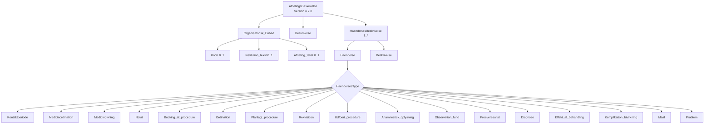

# SUP-specifikation, version 2.0 - Bilag 10: Dataindhold i SUP-databaser

> **Agentnote:** Dette dokument er konverteret fra den oprindelige PDF. Tekst og kode følger kildens ordlyd så tæt som praktisk muligt. Billedressourcer og Mermaid-rekonstruktioner er hjælpemidler til fortolkning; ved uoverensstemmelse har kildeteksten forrang.

## Diagramoversigt

Følgende Mermaid-diagrammer er rekonstruktioner af kildefigurer eller en direkte strukturel visualisering af kildeformatet. De er lavet for maskinel og menneskelig fortolkning og er ikke normative i sig selv.

### Afdelingsbeskrivelse xsd

<!-- Billedbeskrivelse: Strukturel visualisering af XML-schemaet i Tillæg A. AfdelingsBeskrivelse indeholder organisatorisk enhed, fri beskrivelse og én eller flere hændelsesbeskrivelser. -->



Mermaid-kilde: `bilag_10_dataindhold_i_sup_databaser_assets/bilag_10_afdelingsbeskrivelse_xsd.mmd`

## Kildetekst

<!-- Kildeside 1 -->

SUP-specifikation, version 2.0

Bilag 10


Dataindhold i SUP-databaser


Udkast af 12. juni 2003


Udarbejdet for


SUP-Styregruppen


© Uddrag af indholdet kan gengives med tydelig kildeangivelse

<!-- Kildeside 2 -->

Bilag 10: Dataindhold i SUP-databaser
Udkast 12-06-03

Side 2 af 11
Indholdsfortegnelse

1
Introduktion ............................................................................. 3
2
Variationer i datagrundlaget.................................................. 3
3
Afdelingsbeskrivelse ................................................................ 4
4
Etableringen af en SUP-afdelingsbeskrivelse ....................... 4
5
Fremvisningen af en afdelingsbeskrivelse............................. 5
6
Krav og anbefalinger............................................................... 6
Tillæg A
Dataindhold i afdelingsbeskrivelse........................... 7
Tillæg B
Eksempel på afdelingsbeskrivelse ............................ 8
Tillæg C
Eksempel på simpel transformation ...................... 10

<!-- Kildeside 3 -->

Bilag 10: Dataindhold i SUP-databaser
Udkast 12-06-03

Side 3 af 11
1
Introduktion

Når en kliniker ser på oplysninger gennem en SUP-browser, vil han principielt
have adgang til informationer fra en lang række sygehuse og afdelinger.

Det enkelte sygehus og den enkelte afdeling har sin egen individuelle anvendelse af amtets IT-systemer. Der kan således være en afdeling, der har indført
et EPJ-system, mens afdelingen ved siden af endnu ikke har gjort det. En afdeling kan også have gennemført en arbejdsgangsomlægning, der har medført, at
der registreres nye eller ændrede oplysninger i afdelingens IT-systemer.

For klinikeren, der får oplysningerne "langt væk" fra afdelingen, kan det være
forvirrende og svært at gennemskue, hvorfor og hvornår visse journaloplysninger på en patient findes hos én afdeling, medens de ikke kan findes i journaloplysningerne fra en anden.

Dette bilag beskriver SUP-projektets løsning på dette problem.


2
Variationer i datagrundlaget

Variationer i datagrundlaget fra de enkelte sygehuse og afdelinger skyldes flere
forskellige forhold.

For det første anvender de enkelte amter, sygehuse og afdelinger forskellige
IT-systemer. De enkelte IT-systemer implementerer forskellige domænemodeller og funktionalitet, hvilket i SUP sammenhæng giver sig udtryk i, at der vil
være forskel på, hvilke felter og situationer der er registreret. Eksempelvis vil
der i et system kunne registreres både medicinordinationer og givninger, mens
der i et andet kun kan registreres ordinationer. Forskellige systemer dækker
også over det faktum, at der selv indenfor samme produkt eksisterer forskellige
versioner, og at de forskellige versioner derfor kan understøtte en større eller
mindre del af datagrundlaget bag SUP-løsningen. Ligeledes vil ændringer i
systemer, hvorfra data tilvejebringes indirekte via snitflader (f.eks. når der anvendes to forskellige laboratoriesystemer) også kunne betyde forskelle i SUPdatagrundlaget.

For det andet er der forskel på, i hvilken grad de enkelte organisatoriske enheder og personalegrupper har taget systemernes funktionalitet i brug. Det typiske eksempel er et amt, der har anskaffet EPJ, men hvor implementeringen af
et EPJ foregår afdelingsvis. Her vil enkelte afdelinger kunne tilvejebringe en
stor del af SUP-datagrundlaget, mens andre afdelinger kun har en mindre del af
grundlaget. Et andet eksempel er, hvor der anvendes en funktionsorienteret
implementeringsstrategi. Her vil det f.eks. være muligt at få medicinoplysnin-

<!-- Kildeside 4 -->

Bilag 10: Dataindhold i SUP-databaser
Udkast 12-06-03

Side 4 af 11
ger for alle afdelinger, men ikke notater, fordi notatfunktionaliteten bliver implementeret senere.

For det tredje er der en stor variation i arbejdsgange og den tilhørende registreringspraksis i de forskellige afdelinger og blandt de enkelte specialer. På nogle
afdelinger anvendes booking funktionaliteten i en integreret arbejdsgang, mens
den på andre afdelinger i højere grad er et sekundært værktøj.


3
Afdelingsbeskrivelse

Som det kan ses, er der en lang række såvel tekniske og organisatoriske forhold, der kan have indflydelse på det datagrundlag, en bruger vil få adgang til
via en SUP-løsning. Der er ikke noget i datagrundlaget i sig selv, der logisk set
vil kunne give information om disse forhold. Der er derfor brug for en beskrivelse af disse udover selve dataindholdet, herefter kaldet ”Afdelingsbeskrivelse”.

Afdelingsbeskrivelsen bør umiddelbart struktureres som et afdelingsorienteret
dokument ud fra den konstatering, at der her er en organisatorisk enhed, der må
formodes at have en nogenlunde ensartet registreringspraksis. Afdelingen er
ligeledes typisk den mindste enhed, som EPJ-systemer implementeres på, ligesom den almindeligvis kun vil anvende ét EPJ-system.

Ud fra afdelingsbeskrivelsen bør det være muligt at kunne se, hvilke typer af
data man vil kunne få fra den enkelte afdeling. Der bør således være en liste
med de hændelsestyper, der understøttes. Da det ligeledes er tidsmæssigt betinget, bør der være en beskrivelse af, hvilke perioder de forskellige hændelser er
blevet registreret i.

Endelig bør der være plads til en beskrivelse af særlige forhold, eksempelvis at
der gennemføres forsøgs- eller forskningsprojekter, der på visse patienter vil
give anledning til udvidede eller andre typer af oplysninger.


4
Etableringen af en SUP-afdelingsbeskrivelse

Etableringen af en afdelingsbeskrivelse er såvel en teknisk som en organisatorisk orienteret opgave.

Opgaven har teknisk karakter, da det kræver en vis indsigt i såvel EPJ-systemernes funktionalitet, i SUP-løsningens indhold, samt i udtræksmodulerne fra
EPJ-systemerne for at kunne etablere en korrekt angivelse af datagrundlaget.

<!-- Kildeside 5 -->

Bilag 10: Dataindhold i SUP-databaser
Udkast 12-06-03

Side 5 af 11

Opgaven har organisatorisk karakter, da det kræver indsigt i systemernes udbredelse på hospitalerne, deres anvendelse og overblik over hvilke implementeringsprojekter, der gennemføres.

Det anbefales derfor, at udarbejdelsen og vedligeholdelsen af SUP-afdelingsbeskrivelsen forankres i sundheds-IT-organisationen i amtet, hvad enten den er
centralt organiseret eller organiseret på de enkelte sygehuse.

Teknisk set skal afdelingsbeskrivelsen være tilgængelig for brugere og SUPbrowsere i alle amter. Derfor anbefales det, at afdelingsbeskrivelsen som minimum er tilgængelig via de samme forbindelser som anvendes til opslag i de
tilgængelige SUP-databaser. Andre muligheder er at gøre afdelingsbeskrivelsen
offentligt tilgængelig, f.eks. via amtets website eller via en fælles amtslig service (f.eks. en partnerskabstabel eller Sundhedsportalen).

For at afdelingsbeskrivelsen skal kunne anvendes struktureret, skal den overholde et bestemt format. I Tillæg A er formatet givet ved en XML-schemadefinition.

I Tillæg B er vist et eksempel på, hvorledes en afdelingsbeskrivelse kunne se
ud for en afdeling.

I Tillæg C er der givet et eksempel på en simpel transformation af en XML-fil,
der opfylder specifikationen i tillæg A.


5
Fremvisningen af en afdelingsbeskrivelse

Afdelingsbeskrivelse har kun mening, hvis den er tilgængelig for SUP-brugeren på det tidspunkt, hvor han mest har brug for den, dvs. mens han kigger på
data i SUP-browseren. Derfor skal SUP-browseren indeholde en mulighed for
at brugeren kan se en given afdelingsbeskrivelse på udvalgte steder.

Den fælles adgang sikres ved, at afdelingsbeskrivelserne skal kunne hentes via
en sædvanlig URL:

Website?afdid=xxxxxx

Det anbefales, at SUP-webapplikationen indeholder en oversigt (tabel) over
adresser (URL) til de enkelte afdelingsbeskrivelser. En SUP-webapplikation
kan indeholde mulighed for opslag til de enkelte afdelingsbeskrivelser ud fra
en afdelingskode.

Der skal returneres det tilhørende XML dokument. Et eksempel på en simpel
fremvisning af dokumentet fra Tillæg B er dette skærmbillede:

<!-- Kildeside 6 -->

Bilag 10: Dataindhold i SUP-databaser
Udkast 12-06-03

Side 6 af 11


6
Krav og anbefalinger

Sammenfattende er der følgende krav til organisationen og til SUP-browseren:

- Amtets sundheds-IT-organisationen, som står bag en SUP-database,
skal udarbejde og vedligeholde en afdelingsbeskrivelse for hver afdeling, der udtrækker data til SUP-databasen.
- SUP-browseren skal kunne fremvise en afdelings SUP-afdelingsbeskrivelse, f.eks. ved at angive sygehusafdelingens navn.
- SUP-browseren kan anvende de enkelte hændelsestypers beskrivelse til
at give en kontekstafhængig beskrivelse af afdelingens dataindhold.


> **Billedressource (side 6):** Eksempel på browservisning af en SUP-afdelingsbeskrivelse. Visningen angiver organisatorisk enhed og beskriver for hver hændelsestype, hvilke data og perioder der er tilgængelige.
> Reference: `bilag_10_dataindhold_i_sup_databaser_assets/bilag_10_afdelingsbeskrivelse_skaermbillede.png`

<!-- Kildeside 7 -->

Bilag 10: Dataindhold i SUP-databaser
Udkast 12-06-03

Side 7 af 11
## Tillæg A Dataindhold i afdelingsbeskrivelse

For at afdelingsbeskrivelsen skal kunne anvendes struktureret, skal den overholde et bestemt format. Formatet er givet ved følgende XML schema definition:

```xml
<?xml version="1.0" encoding="ISO-8859-1"?>
<xsd:schema targetNamespace="http://www.viborgamt.dk/SUP_AFDBESK001"
xmlns:xsd="http://www.w3.org/2001/XMLSchema"
xmlns="http://www.viborgamt.dk/SUP_AFDBESK001">

<!-- ====================== Pakke: Afdelingsbeskrivelse
============================== -->

<xsd:element name="AfdelingsBeskrivelse">


<xsd:complexType>


<xsd:sequence>


<xsd:element ref="Organisatorisk_Enhed"/>


<xsd:element ref="Beskrivelse"/>


<xsd:element ref="HaendelsesBeskrivelse" maxOccurs="unbounded"/>


</xsd:sequence>


<xsd:attribute name="Version" type="xsd:string" use="required" fixed="2.0"/>


</xsd:complexType>

</xsd:element>

<xsd:element name="Organisatorisk_Enhed">


<xsd:complexType>


<xsd:attribute name="Kode" type="xsd:string" use="optional"/>


<xsd:attribute name="Institution_tekst" type="xsd:string" use="optional"/>


<xsd:attribute name="Afdeling_tekst" type="xsd:string" use="optional"/>


</xsd:complexType>

</xsd:element>

<xsd:element name="Beskrivelse" type="xsd:string"/>

<xsd:element name="HaendelsesBeskrivelse">


<xsd:complexType>


<xsd:sequence>


<xsd:element ref="Haendelse"/>


<xsd:element ref="Beskrivelse"/>


</xsd:sequence>


</xsd:complexType>

</xsd:element>

<xsd:element name="Haendelse" type="HaendelsesType"/>

<xsd:simpleType name="HaendelsesType">


<xsd:restriction base="xsd:string">


<xsd:enumeration value="Kontaktperiode"/>


<xsd:enumeration value="Medicinordination"/>


<xsd:enumeration value="Medicingivning"/>


<xsd:enumeration value="Notat"/>


<xsd:enumeration value="Booking_af_procedure"/>


<xsd:enumeration value="Ordination"/>


<xsd:enumeration value="Planlagt_procedure"/>


<xsd:enumeration value="Rekvisition"/>


<xsd:enumeration value="Udfoert_procedure"/>


<xsd:enumeration value="Anamnestisk_oplysning"/>


<xsd:enumeration value="Observation_fund"/>


<xsd:enumeration value="Proeveresultat"/>


<xsd:enumeration value="Diagnose"/>


<xsd:enumeration value="Effekt_af_behandling"/>


<xsd:enumeration value="Komplikation_bivirkning"/>


<xsd:enumeration value="Maal"/>


<xsd:enumeration value="Problem"/>


</xsd:restriction>

</xsd:simpleType>
</xsd:schema>
```

<!-- Kildeside 8 -->

Bilag 10: Dataindhold i SUP-databaser
Udkast 12-06-03

Side 8 af 11
## Tillæg B Eksempel på afdelingsbeskrivelse

Det følgende er et eksempel på, hvorledes en afdelingsbeskrivelse kunne se ud
for en afdeling, der i en periode har anvendt CSC Scandihealths Grønt System,
hvorefter IBM’s IPJ er implementeret. P.t. er afdelingen i færd med at implementere et ny medicinmodul i IPJ.

```xml
<?xml version="1.0" encoding="ISO-8859-1"?>
<n:AfdelingsBeskrivelse xmlns:n="http://www.viborgamt.dk/SUP_AFDBESK001"
xmlns:xsi="http://www.w3.org/2001/XMLSchema-instance"
xsi:schemaLocation="http://www.viborgamt.dk/SUP_AFDBESK001
W:\Projekter\SUPIIR~1\Projektleverancer\Afdelingsbeskrivelse\AfdelingsBeskrivelse.xsd" Version="2.0">

<n:Organisatorisk_Enhed Kode="1234567" Institution_tekst="X-købing Sygehus" Afdeling_tekst="Ortopædkirurgisk Afdeling"/>

<n:Beskrivelse>Afdelingen er i en implementeringsproces løbende fra d. 1/3 2003 - 1/6 2006,
hvor yderligere funktioner til elektronisk medicinhåndtering indføres.
Afdelingen indførte d. 27/4 2001 IBM IPJ systemet, hvorfor der efter denne dato vil være væsentlig
flere oplysninger.</n:Beskrivelse>

<n:HaendelsesBeskrivelse>


<n:Haendelse>Anamnestisk_oplysning</n:Haendelse>


<n:Beskrivelse>Fra 27/4 2001 oplysninger registreret i IPJ.
Før 27/4 2001 Ingen registreringer.</n:Beskrivelse>

</n:HaendelsesBeskrivelse>

<n:HaendelsesBeskrivelse>


<n:Haendelse>Booking_af_procedure</n:Haendelse>


<n:Beskrivelse>Udtrækkes ikke</n:Beskrivelse>

</n:HaendelsesBeskrivelse>

<n:HaendelsesBeskrivelse>


<n:Haendelse>Diagnose</n:Haendelse>


<n:Beskrivelse>Fra 27/4 2001 diagnoser registreret i IPJ.
Før 27/4 2001 diagnoser registreret i GS.
Diagnoser ældre end 1998 er ikke overført.</n:Beskrivelse>

</n:HaendelsesBeskrivelse>

<n:HaendelsesBeskrivelse>


<n:Haendelse>Effekt_af_behandling</n:Haendelse>


<n:Beskrivelse>Udtrækkes ikke</n:Beskrivelse>

</n:HaendelsesBeskrivelse>

<n:HaendelsesBeskrivelse>


<n:Haendelse>Komplikation_bivirkning</n:Haendelse>


<n:Beskrivelse>Udtrækkes ikke</n:Beskrivelse>

</n:HaendelsesBeskrivelse>

<n:HaendelsesBeskrivelse>


<n:Haendelse>Kontaktperiode</n:Haendelse>


<n:Beskrivelse>Fra 1/5 2003 GS kontakter, overført til IPJ.
Fra 27/4 2001 til 30/4 2003 kontakter oprettet i IPJ.
Før 27/4 2001 GS kontakter.
Kontakter ældre end 1998 er ikke overført.</n:Beskrivelse>

</n:HaendelsesBeskrivelse>

<n:HaendelsesBeskrivelse>


<n:Haendelse>Maal</n:Haendelse>


<n:Beskrivelse>Udtrækkes ikke</n:Beskrivelse>

</n:HaendelsesBeskrivelse>

<n:HaendelsesBeskrivelse>


<n:Haendelse>Medicingivning</n:Haendelse>


<n:Beskrivelse>Kun givninger fra det seneste døgn inden overførsel til SUP databasen medtages.</n:Beskrivelse>

</n:HaendelsesBeskrivelse>

<n:HaendelsesBeskrivelse>


<n:Haendelse>Medicinordination</n:Haendelse>


<n:Beskrivelse>Fra 27/4 2001 medicinordinationer registreret i IPJ. OBS afdelingen er i færd
med implementeringen af nyt medicinmodul.
Før 27/4 2001 Ingen registreringer.</n:Beskrivelse>

</n:HaendelsesBeskrivelse>
```

<!-- Kildeside 9 -->

Bilag 10: Dataindhold i SUP-databaser
Udkast 12-06-03

Side 9 af 11

```xml
<n:HaendelsesBeskrivelse>


<n:Haendelse>Notat</n:Haendelse>


<n:Beskrivelse>Fra 27/4 2001 notater registreret i IPJ.
Før 27/4 2001 Beskrivelser registreret i GS.</n:Beskrivelse>

</n:HaendelsesBeskrivelse>

<n:HaendelsesBeskrivelse>


<n:Haendelse>Observation_fund</n:Haendelse>


<n:Beskrivelse>Fra 27/4 01 observationer registreret i IPJ.
Før 27/4 2001 Ingen registreringer.</n:Beskrivelse>

</n:HaendelsesBeskrivelse>

<n:HaendelsesBeskrivelse>


<n:Haendelse>Planlagt_procedure</n:Haendelse>


<n:Beskrivelse>Udtrækkes ikke</n:Beskrivelse>

</n:HaendelsesBeskrivelse>

<n:HaendelsesBeskrivelse>


<n:Haendelse>Problem</n:Haendelse>


<n:Beskrivelse>Udtrækkes ikke</n:Beskrivelse>

</n:HaendelsesBeskrivelse>

<n:HaendelsesBeskrivelse>


<n:Haendelse>Proeveresultat</n:Haendelse>


<n:Beskrivelse>;Fra 27/4 2001 Laboratoriesvar fra Labka via IPJIngen laboratoriesvar før
27/4 2001.
Fra 19/6 2002 Røntgensvar fra Kodak via IPJ.</n:Beskrivelse>

</n:HaendelsesBeskrivelse>

<n:HaendelsesBeskrivelse>


<n:Haendelse>Rekvisition</n:Haendelse>


<n:Beskrivelse>Udtrækkes ikke</n:Beskrivelse>

</n:HaendelsesBeskrivelse>

<n:HaendelsesBeskrivelse>


<n:Haendelse>Udfoert_procedure</n:Haendelse>


<n:Beskrivelse>Fra 27/4 2001 procedurer registreret i IPJ.
Før 27/4 2001 Procedurer registreret i GS.
Procedurer ældre end 1998 er ikke overført.</n:Beskrivelse>

</n:HaendelsesBeskrivelse>
</n:AfdelingsBeskrivelse>
```

<!-- Kildeside 10 -->

Bilag 10: Dataindhold i SUP-databaser
Udkast 12-06-03

Side 10 af 11

## Tillæg C Eksempel på simpel transformation

Det følgende er et eksempel på en simpel transformation af XML filer, der opfylder specifikationen i tillæg A. Eksemplet i afsnit 5 er genereret ved hjælp af
denne transformation.

```xml
<?xml version="1.0" encoding="UTF-8"?>
<xsl:stylesheet version="1.0" xmlns:xsl="http://www.w3.org/1999/XSL/Transform"
xmlns:n1="http://www.viborgamt.dk/SUP_AFDBESK001"
xmlns:xsd="http://www.w3.org/2001/XMLSchema">

<xsl:template match="/">


<html>


<head/>


<body>


<h1>


<xsl:for-each select="n1:AfdelingsBeskrivelse">


<p>Afdelingsbeskrivelse for <xsl:for-each select="n1:Organisatorisk_Enhed">


<xsl:for-each select="@Kode">


<xsl:value-of select="."/>


</xsl:for-each>


<h2>


<xsl:for-each select="@Institution_tekst">


<xsl:value-of select="."/>


</xsl:for-each>


<br/>


<xsl:for-each select="@Afdeling_tekst">


<xsl:value-of select="."/>


</xsl:for-each>


</h2>


</xsl:for-each>


</p>


</xsl:for-each>


<br/>


</h1>


<p>


<xsl:for-each select="n1:AfdelingsBeskrivelse">


<xsl:for-each select="n1:Beskrivelse">


<xsl:apply-templates/>


</xsl:for-each>


</xsl:for-each>


</p>


<h1>


<xsl:for-each select="n1:AfdelingsBeskrivelse">


<xsl:for-each select="n1:HaendelsesBeskrivelse">


<xsl:if test="position()=1">


<table align="left" border="0" cellpadding="8" table-layout="fixed">


<tbody>


<xsl:for-each select="../n1:HaendelsesBeskrivelse">


<tr>


<td valign="top">


<xsl:for-each select="n1:Haendelse">


<span style="font-weight:bold">


<xsl:apply-templates/>


</span>


</xsl:for-each>


</td>


<td>


<xsl:for-each select="n1:Beskrivelse">


<xsl:apply-templates/>


</xsl:for-each>


</td>


</tr>


</xsl:for-each>
```

<!-- Kildeside 11 -->

Bilag 10: Dataindhold i SUP-databaser
Udkast 12-06-03

Side 11 af 11


```xml
</tbody>


</table>


</xsl:if>


</xsl:for-each>


</xsl:for-each>


</h1>


</body>


</html>

</xsl:template>
</xsl:stylesheet>
```
