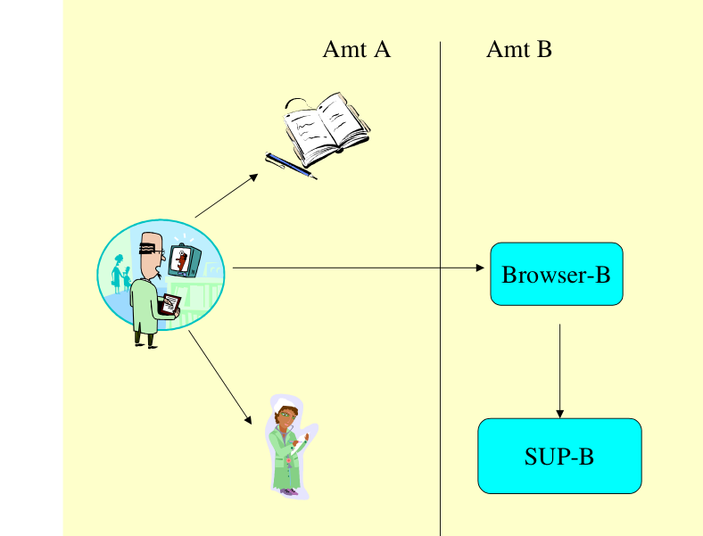
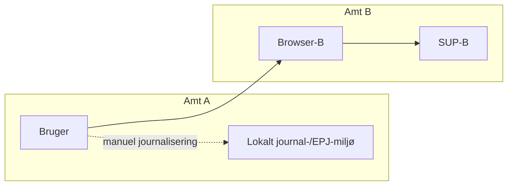
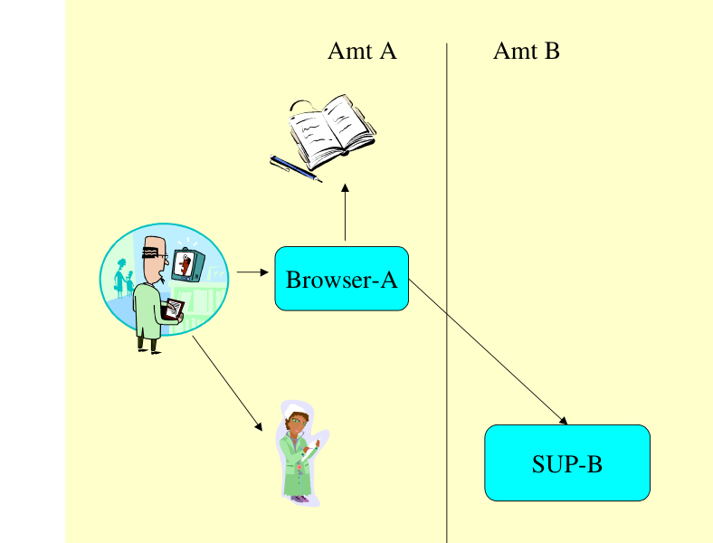
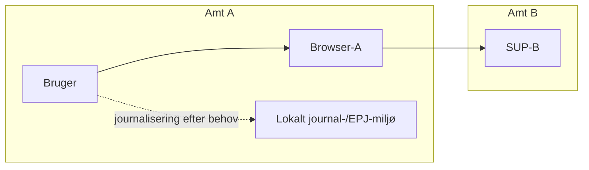
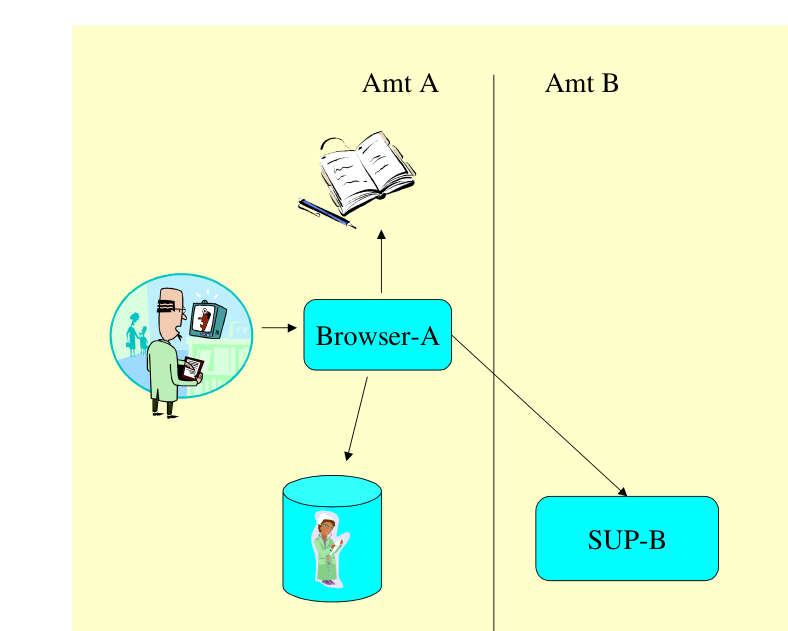
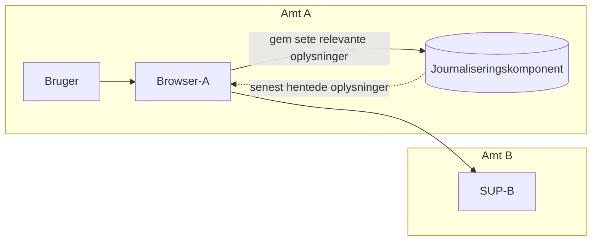
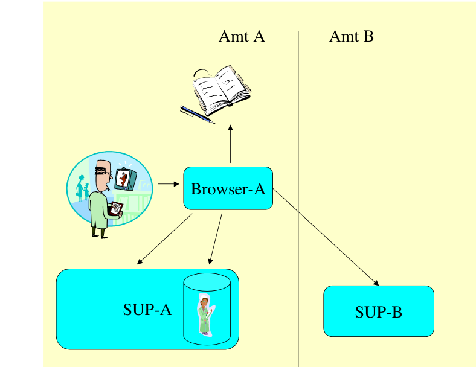
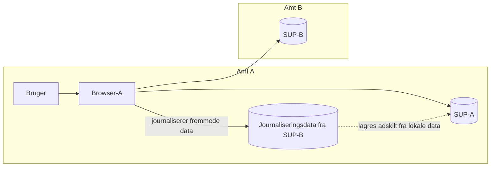

# SUP-specifikation, version 2.0 - Bilag 11: Kommunikation mellem flere SUP-databaser

> **Agentnote:** Dette dokument er konverteret fra den oprindelige PDF. Tekst og kode følger kildens ordlyd så tæt som praktisk muligt. Billedressourcer og Mermaid-rekonstruktioner er hjælpemidler til fortolkning; ved uoverensstemmelse har kildeteksten forrang.

## Diagramoversigt

Følgende Mermaid-diagrammer er rekonstruktioner af kildefigurer eller en direkte strukturel visualisering af kildeformatet. De er lavet for maskinel og menneskelig fortolkning og er ikke normative i sig selv.

### Scenario browser b

<!-- Billedbeskrivelse: Scenario 3.2.1: En bruger i Amt A anvender Browser-B i Amt B for at tilgå SUP-B. Data vises via den fremmede webapplikation, og brugeren må håndtere journalisering i eget miljø. -->

Mermaid-kilde: `bilag_11_kommunikation_mellem_flere_sup_databaser_assets/bilag_11_scenario_browser_b.mmd`

### Scenario browser a til sup b

<!-- Billedbeskrivelse: Scenario 3.2.2, simpel variant: Brugeren i Amt A anvender Browser-A, som finder og kalder SUP-B i Amt B. Browser-A er brugerens fælles adgang til den fremmede database. -->

Mermaid-kilde: `bilag_11_kommunikation_mellem_flere_sup_databaser_assets/bilag_11_scenario_browser_a_til_sup_b.mmd`

### Scenario browser a med journalisering

<!-- Billedbeskrivelse: Udvidet variant: Browser-A tilgår SUP-B og gemmer relevante viste oplysninger i en lokal journaliseringskomponent, så de senere kan genfindes. -->

Mermaid-kilde: `bilag_11_kommunikation_mellem_flere_sup_databaser_assets/bilag_11_scenario_browser_a_med_journalisering.mmd`

### Scenario sup a med journaliseringsdata

<!-- Billedbeskrivelse: Mest ambitiøse variant: Browser-A tilgår SUP-B, og journaliseringsdata lagres i SUP-A. Egne og fremmede data skal holdes adskilt, så andre opslag i SUP-A fortsat kun returnerer de oprindelige lokale data. -->

Mermaid-kilde: `bilag_11_kommunikation_mellem_flere_sup_databaser_assets/bilag_11_scenario_sup_a_med_journaliseringsdata.mmd`

## Kildetekst

<!-- Kildeside 1 -->

SUP-specifikation, version 2.0

Bilag 11

Kommunikation mellem flere
SUP-databaser

Udkast af 12. juni 2003

Udarbejdet for

SUP-Styregruppen

© Uddrag af indholdet kan gengives med tydelig kildeangivelse
Kan med fordel udskrives på en farveprinter,
idet figurerne er i farver.

<!-- Kildeside 2 -->

Bilag 11: Kommunikation mellem flere SUP-databaser
Udkast 12-06-03

Side 2 af 9
Indholdsfortegnelse

1
Introduktion ............................................................................. 3
2
Lovgivningen............................................................................ 3
3
Forskellige scenarier................................................................ 3
3.1
Anvendelse af eget amts SUP-database.............................................. 4
3.2
Anvendelse af andet amts SUP-database............................................ 4
4
Krav og anbefalinger............................................................... 8
5
Referencer................................................................................. 9

<!-- Kildeside 3 -->

Bilag 11: Kommunikation mellem flere SUP-databaser
Udkast 12-06-03

Side 3 af 9
1
Introduktion

Efter alt at dømme vil landets patientdata bliver lagret i et antal forskellige databaser, ligesom adgang til disse data vil skulle foregå via et antal forskellige
SUP-webapplikationer (også kaldet SUP-browsere).

En given bruger skal kunne fremsøge data i alle disse SUP-databaser, når det er
relevant ved behandlingen af en patient, men etableringen af en sådan tværgående adgang kræver løsning af en række problemer af informatisk, sikkerhedsmæssig og teknisk art.

Dette bilag beskriver håndteringen af lovgivningens krav og nogle informatiske
overvejelser, mens de sikkerhedsmæssige udfordringer beskrives i Bilag 9 og
de tekniske problemer beskrives i Bilag 6.

2
Lovgivningen

Af Sundhedsstyrelsens cirkulære og vejledning om journalføring [1, 2] fremgår
det, at "relevant materiale, herunder kopier af journaler, der hidrører fra andre
myndigheder eller enheder indenfor sundhedsvæsenet, er en del af journalen".

Der er tvivlsomt, om man kan overholde cirkulæret, hvis journaldata, der  er
indgået i beslutningsprocessen, alene ligger lagret i et andet amts SUP-database, hvor den journalføringspligtige principielt ikke kan sikre data efter reglerne.

Når data derimod ligger i "eget" amts SUP-database, så befinder de sig under
samme administrative myndighed som EPJ/PAS-systemet, og herved synes
kravene til journalføring at kunne opfyldes. Det vil dog formodentlig kræve, at
SUP-databasen er omfattet af registerforskrifter, der svarer til amtets øvrige
EPJ-orienterede systemer.

3
Forskellige scenarier

Lad os i det følgende begrænse problemstillingen til to amter A og B, der har
hver sin SUP-database med EPJ-data.

<!-- Kildeside 4 -->

Bilag 11: Kommunikation mellem flere SUP-databaser
Udkast 12-06-03

Side 4 af 9
3.1
Anvendelse af eget amts SUP-database

Når en bruger i amt A ønsker at se en journal, der er lagret i SUP-A (Amt A's
SUP-database), så transmitteres data til hans browser, men de kopieres ikke til
hans egen EPJ eller til noget andet system.

SUP-A opfattes som en del af brugerens informationssystem på samme måde
som hans eget EPJ-system, og begge systemer tilhører den samme administrative enhed med Amtsborgmesteren som den øverste ansvarlige. SUP-webapplikationen foretager en logning af brugerens anvendelse af SUP-systemet, og
både logfilerne og kontrollen er således placeret indenfor amtet.

3.2
Anvendelse af andet amts SUP-database

Når en bruger i Amt A ønsker at se data lagret i SUP-B (Amt B’s SUPdatabase), er der flere forskellige muligheder for at konfigurere dette.

#### 3.2.1 Brugeren i Amt A anvender Amt B’s SUP-webapplikation for at se
data i Amt B’s SUP-database

I det første tilfælde anvender brugeren Amt B’s SUP-webapplikation (Browser-B).

Browser-B
SUP-B
Amt B
Amt A

I denne situation vil brugeren skulle starte med at finde URL’en på Browser-B.
Herefter vil han slå op i SUP-B ved hjælp af Browser-B. For at overholde lov-

> **Billedressource (side 4):** Scenario 3.2.1: En bruger i Amt A anvender Browser-B i Amt B for at tilgå SUP-B. Data vises via den fremmede webapplikation, og brugeren må håndtere journalisering i eget miljø.
> Reference: `bilag_11_kommunikation_mellem_flere_sup_databaser_assets/bilag_11_scenario_browser_b.png`

<!-- Kildeside 5 -->

Bilag 11: Kommunikation mellem flere SUP-databaser
Udkast 12-06-03

Side 5 af 9
givningen vil han være nødt til at arkivere det sete som en del af sin egen journal.

Når A-brugeren ser på data fra SUP-B ved hjælp af Browser-B, kan Browser-B
være mere eller mindre forskellig fra den browserapplikation, som han bruger
til opslag i sit eget amts SUP-database. Denne løsning bør derfor kun bruges i
en overgangsfase.

#### 3.2.2 Brugeren i Amt A anvender Amt A’s SUP-webapplikation for at se
data i Amt B’s SUP-database

I det andet tilfælde har brugeren i forvejen en SUP-browser  (Browser-A).

Browser-A
SUP-B
Amt B
Amt A

Her vil brugeren starte Browser-A, som herefter på baggrund af logiske parametre (f.eks. indtastning af en afdelingskode) vil finde URL’en på SUP-B.
Browser-A skal indeholder en standardopsætning, der gør, at det bliver enkelt
at søge i naboamternes SUP-databaser.

I den simple udgave af en løsning er der ingen forskel mht. journalisering. Brugeren vil stadig selv skulle gennemføre dette via en manuel proces, hvorfor
denne simple udgave også kun bør anvendes i en overgangsfase.

En mere ambitiøs udgave er, at Browser-A varetager journaliseringen for brugeren.

> **Billedressource (side 5):** Scenario 3.2.2, simpel variant: Brugeren i Amt A anvender Browser-A, som finder og kalder SUP-B i Amt B. Browser-A er brugerens fælles adgang til den fremmede database.
> Reference: `bilag_11_kommunikation_mellem_flere_sup_databaser_assets/bilag_11_scenario_browser_a_til_sup_b.png`

<!-- Kildeside 6 -->

Bilag 11: Kommunikation mellem flere SUP-databaser
Udkast 12-06-03

Side 6 af 9
Browser-A
SUP-B
Amt B
Amt A

I dette tilfælde vil Browser-A sikre, at relevante sider, som brugeren har set,
bliver gemt.

SUP-webapplikationen eller en tilsvarende applikation skal i såfald stille funktioner til rådighed for, at brugeren kan genfinde de gemte informationer af hensyn til dokumentationspligten.

Hvis adgangen til SUP-B af en eller anden grund ikke er mulig (f.eks. på grund
af netværksproblemer eller vedligeholdelse på SUP-B), kan det være en mulighed, at Browser-A tilbyder brugeren at se de senest hentede informationer.

Da der er mange muligheder for at lave en præsentation af SUP-data i en
Browser ved hjælp af mange forskellige teknologier, er det i SUP-projektet
valgt ikke at give konkrete retningslinier for, hvorledes denne journalisering
skal struktureres. Generelt er det dog en god ide at skille det semantiske indhold fra selve præsentationen af oplysningerne.

Hvis data i journaliseringen er tilgængelige i sin fulde form, eksempelvis som
XML-filer, er det en mulighed for Browser-A at tilbyde et kombineret analyseudtræk fra egen SUP-database med et tilsvarende udtræk fra amtets journaliseringskomponent. Analyseudtræk via en journaliseringskomponent skal dog
behandles med særlig opmærksomhed, idet datagrundlaget kan være mangelfuldt og ikke-opdateret.

Når systemerne således lagrer information flere forskellige steder, vil oplysninger om patienten være tilgængelig i forskellig kvalitet og opdateringsgrad.
Der er derfor en risiko for, at brugeren vil kunne opleve oplysningerne som
værende inkonsistente. I sagens natur opdateres oplysningerne ikke efter lagring i journaliseringskomponenten. SUP-webapplikationen må derfor være

> **Billedressource (side 6):** Udvidet variant: Browser-A tilgår SUP-B og gemmer relevante viste oplysninger i en lokal journaliseringskomponent, så de senere kan genfindes.
> Reference: `bilag_11_kommunikation_mellem_flere_sup_databaser_assets/bilag_11_scenario_browser_a_med_journalisering.png`

<!-- Kildeside 7 -->

Bilag 11: Kommunikation mellem flere SUP-databaser
Udkast 12-06-03

Side 7 af 9
meget præcis i sin præsentation af oplysningerne, således at kilden og opdateringsgraden er klar for brugeren overalt i interaktionen. Derfor bør kriterierne
for forespørgslen ligeledes gemmes, så forudsætningerne for indholdet kan
præsenteres i forbindelse med etableringen af et kombineret analyseudtræk og i
forbindelse med opslag fra journaliseringsfunktionen.

En speciel opmærksomhed skal der knyttes til feltet "Tilstedetidspunkt", idet
det i SUP er defineret som værende det tidspunkt, hvor oplysningerne var tilstede i databasen. Når data gemmes og hentes fra journaliseringsfunktionen,
kan dette felt bruges til at angive det tidspunkt, hvor data blev journaliseret.

Den mest ambitiøse udgave er, at SUP-A udvides med journaliseringsdata fra
SUP-B for at udnytte det store overlap mellem de informationer, der gemmes i
forbindelse med journaliseringen og de informationer, der gemmes i forbindelse med normal load af udtræksdata fra EPJ/PAS-systemerne.

SUP-A
Browser-A
SUP-B
Amt B
Amt A

I denne løsning er det vigtigt, at SUP-A ikke sammenblander egne og "fremmede" oplysninger således, at opslag til SUP-A fra andre end Browser-A stadig
kun vil give de "oprindelige" data fra SUP-A tilbage.

Journaliseringsgrænsefladen mellem Browser-A og SUP-A er ikke en del af
SUP-specifikationerne.

> **Billedressource (side 7):** Mest ambitiøse variant: Browser-A tilgår SUP-B, og journaliseringsdata lagres i SUP-A. Egne og fremmede data skal holdes adskilt, så andre opslag i SUP-A fortsat kun returnerer de oprindelige lokale data.
> Reference: `bilag_11_kommunikation_mellem_flere_sup_databaser_assets/bilag_11_scenario_sup_a_med_journaliseringsdata.png`

<!-- Kildeside 8 -->

Bilag 11: Kommunikation mellem flere SUP-databaser
Udkast 12-06-03

Side 8 af 9
4
Krav og anbefalinger

Gennemgangen leder til følgende krav og anbefalinger til SUP-webapplikationen:

- En SUP-webapplikation skal indeholde en printfunktion, der kan printe
patientorienterede skærmbilleder. Printet skal som minimum indeholde
patientens navn og CPR-nummer, dato og klokkeslæt for printet, samt
indholdet af skærmbilledet.
- En SUP-webapplikation skal indeholde en oversigt (tabel) over de
SUP-databaser, der stiller data til rådighed. Defaultvalg (f.eks. eget amt
og naboamt) skal kunne opsættets af amtet.
- En SUP-webapplikation bør indeholde mulighed for opslag af adresser
på SUP-databaser ud fra en afdelingskode.
- En SUP-webapplikation kan indeholde funktioner til journalisering og
genfinding af journalmateriale, der tidligere er gemt fra SUP-webapplikation. Journaliseringen skal som minimum arkivere patientens navn og
CPR-nummer, dato og klokkeslæt for journaliseringen, brugerens identifikation samt indholdet af skærmbilledet. Journaliseringen skal adskille data og præsentation. Journaliseringen skal indeholde det fulde dataindhold i forespørgslen og kriterierne for forespørgslen.
- Hvis SUP-webapplikationen indeholder funktioner til journaliseringen,
bør den tilbyde brugeren en funktion til at se senest hentede oplysninger, hvis adgangen til en "fremmed" SUP-database ikke er mulig.
- En SUP-webapplikation kan indeholde funktioner til at kombinere et
analyseudtræk fra en lokal SUP-database med data fra en journaliseringsfunktion. En sådan kombination skal kunne præsentere grundlaget
for udtrækket for brugeren i form af eksempelvis kilde, journaliseringsdato/klokkeslæt og dato/klokkeslæt for opdatering i SUP-databasen.
- En SUP-database kan indeholde funktioner til at lagre journaliseringsoplysninger.

<!-- Kildeside 9 -->

Bilag 11: Kommunikation mellem flere SUP-databaser
Udkast 12-06-03

Side 9 af 9
5
Referencer

1.
Cirkulære om lægers pligt til at føre ordnede optegnelser (journalføring).
Sundhedsstyrelsens cirkulære nr. 235, 1996.
2.
Vejledning om lægers journalføring. Sundhedsstyrelsens vejledningscirkulære nr. 236, 1996.
