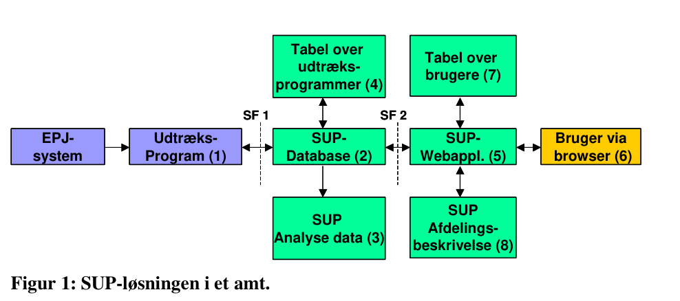
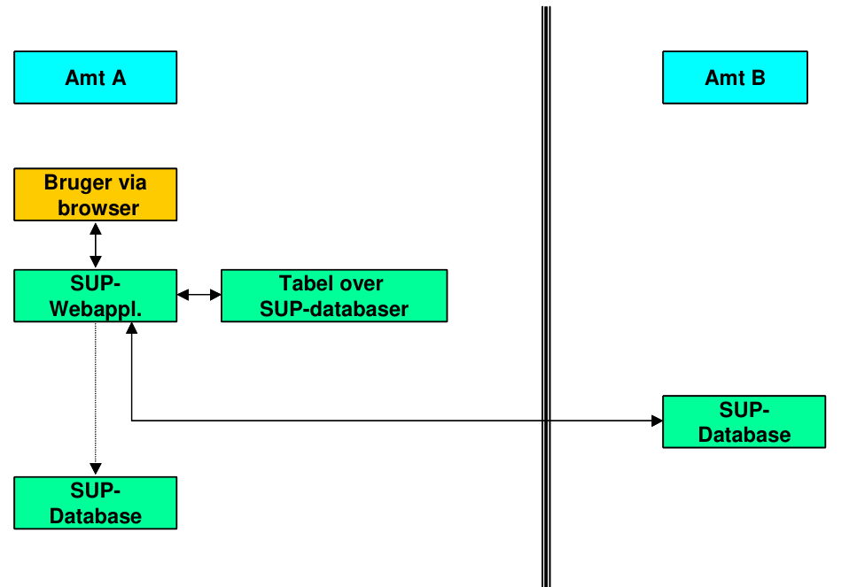
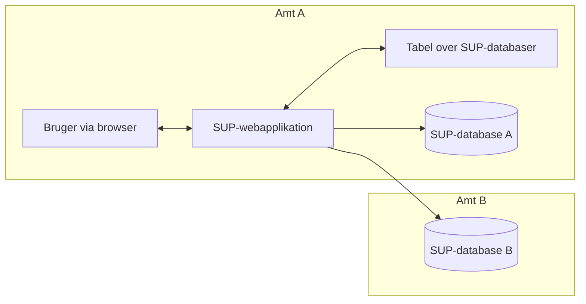

# SUP-specifikation, version 2.0 - Bilag 12: Drift af SUP-systemer

> **Agentnote:** Dette dokument er konverteret fra den oprindelige PDF. Tekst og kode følger kildens ordlyd så tæt som praktisk muligt. Billedressourcer og Mermaid-rekonstruktioner er hjælpemidler til fortolkning; ved uoverensstemmelse har kildeteksten forrang.

## Diagramoversigt

Følgende Mermaid-diagrammer er rekonstruktioner af kildefigurer eller en direkte strukturel visualisering af kildeformatet. De er lavet for maskinel og menneskelig fortolkning og er ikke normative i sig selv.

### Figur 01 sup loesningen i et amt

<!-- Billedbeskrivelse: Figur 1 viser SUP-løsningen i ét amt: fødesystem/EPJ -> udtræksprogram -> SUP-database -> SUP-webapplikation -> browserbruger. Dertil er knyttet analyseudtræk, tabel over udtræksprogrammer, brugertabel og afdelingsbeskrivelse. SF1 og SF2 markerer de to specificerede snitflader. -->



```mermaid
flowchart LR
  EPJ[EPJ-/fødesystem] -->|SF1| EXT[Udtræksprogram (1)]
  EXT -->|XML via FTP| DB[(SUP-database (2))]
  DB -->|SF2 / webservices| WEB[SUP-webapplikation (5)]
  WEB --> USER[Bruger via browser (6)]
  DB --> ANA[SUP analysedata (3)]
  TABEXT[Tabel over udtræksprogrammer (4)] --> DB
  USERS[Tabel over brugere (7)] --> WEB
  AFDB[SUP afdelingsbeskrivelse (8)] --> WEB
```

Mermaid-kilde: `bilag_12_drift_af_sup_systemer_assets/bilag_12_figur_01_sup_loesningen_i_et_amt.mmd`

### Figur 02 sup loesningen i to amter

<!-- Billedbeskrivelse: Figur 2 viser to-amts-scenariet: Browserbrugeren i Amt A anvender Amt A’s SUP-webapplikation, som både kan tilgå lokal SUP-database og en SUP-database i Amt B via en tabel over tilgængelige SUP-databaser. -->





Mermaid-kilde: `bilag_12_drift_af_sup_systemer_assets/bilag_12_figur_02_sup_loesningen_i_to_amter.mmd`

## Kildetekst

<!-- Kildeside 1 -->

SUP-specifikation, version 2.0

Bilag 12


Drift af SUP-systemer


Udkast af 12. juni 2003


Udarbejdet for


SUP-Styregruppen


© Uddrag af indholdet kan gengives med tydelig kildeangivelse
Kan med fordel udskrives på en farveprinter,
idet figurerne er i farver.

<!-- Kildeside 2 -->

Bilag 12: Drift af SUP-systemer
Udkast 12-06-03

Side 2 af 12
Indholdsfortegnelse

1
Introduktion ............................................................................. 3
2
Oversigt over SUP-løsningen.................................................. 3
3
Udtræksprogram ..................................................................... 6
3.1
Krav og anbefalinger til funktionalitet af udtræksprogram................ 6
3.2
Krav og anbefalinger til overvågning og opfølgning ......................... 6
4
SUP-database applikation....................................................... 7
4.1
Loader funktionalitet .......................................................................... 7
4.2
Krav og anbefalinger til loader........................................................... 7
4.3
Krav og anbefalinger til databasens funktionalitet............................. 8
4.4
Krav og anbefalinger til backup ......................................................... 9
4.5
Krav og anbefalinger til overvågning................................................. 9
5
SUP-webapplikation.............................................................. 10
5.1
Krav og anbefalinger til SUP-web funktionalitet............................. 10
5.2
Krav og anbefalinger til backup ....................................................... 11
5.3
Krav og anbefalinger til overvågning............................................... 11
6
Krav til sikkerhed.................................................................. 11

<!-- Kildeside 3 -->

Bilag 12: Drift af SUP-systemer
Udkast 12-06-03

Side 3 af 12
## 1 Introduktion

I en situation, hvor SUP-løsningen er landsdækkende implementeret, skal det
sikres, at løsningen er driftsmæssigt stabil, og at der reageres på evt. fejl, der
måtte opstå.

SUP-løsningen vil være kompleks bestående af følgende komponenter:

- En række udtræksprogrammer, der trækker patientdata ud af fødesystemerne (f.eks. EPJ- og PAS-systemer).
- Et antal SUP-databaser.
- Et antal SUP-webapplikationer (også kaldet SUP-browsere).
- Netværk til kommunikationen mellem udtræksprogrammerne, SUPdatabaserne og SUP-webapplikationerne.

Formålet med dette dokument er at sætte de driftsansvarlige i stand til at varetage den daglige drift dels af de enkelte komponenter i SUP-løsningen, dels af
kommunikationen mellem komponenterne.

Dokumentet indeholder derfor bl.a. krav til:

- hvilke services, der skal køre.
- overvågning.
- backup af filer.
- håndtering af logfiler.

Dokumentet beskriver ikke, hvilken opsætning og installation af software der
er nødvendig i forbindelse med implementeringen.


## 2 Oversigt over SUP-løsningen

Dette afsnit har til formål at beskrive de enkelte komponenter, som SUPløsningen er bygget op af, og hvordan data flyttes rundt. En detaljeret beskrivelse af Domænemodel, dataformat og snitfladerne mellem de enkelte komponenter findes i andre bilag.

Data trækkes ud fra de forskellige leverandørers EPJ-systemer, PAS-systemer
og andre relevante systemer (herefter kaldet fødesystemer) og placeres i en
SUP-database. På forespørgsel fra en bruger vha. en browser hentes data fra
databasen og afleveres i HTML-format til browseren.

Der henvises til Figur 1 for illustration af SUP-løsningen i et amt.

<!-- Kildeside 4 -->

Bilag 12: Drift af SUP-systemer
Udkast 12-06-03

Side 4 af 12

SUP består af otte komponenter:

1. Udtræksprogrammer fra forskellige leverandører trækker data ud fra fødesystemerne og overfører disse til databasen som XML-filer i SUP-format.
Overførslen sker ved hjælp af FTP til et bestemt katalog på SUP-databaseserveren. Udtræk af data skal minimum ske én gang i døgnet, hvor nye eller
opdaterede patientjournaler overføres. Desuden indeholder hvert udtræksprogram en service for akut overførsel af patientdata til SUP-databasen. En
akut overførsel initieres ved at brugeren i SUP-browseren angiver et CPRnummer og en sygehusafdeling på den akutte patient, og som resultat stilles
en forespørgsel direkte til det pågældende udtræksprogrammel (via SUPdatabase applikationen), som derefter øjeblikkeligt trækker patientdata ud
og overfører dem til SUP-databasen.
2. Data loades ind i SUP-databasen ved hjælp af et loaderprogram, der løbende loader filer ind i databasen fra et bestemt katalog. Der stilles en række
webservices til rådighed for udtræk af data fra databasen. Udtrukne data fra
databasen afleveres i XML-format til SUP-webapplikationen. Der henvises
til afs. 4 for en nærmere beskrivelse af databaseapplikationen.
3. På forespørgsel fra en bruger i SUP-browseren (med angivelse af en række
afgrænsningskriterier) trækkes strukturerede data ud af SUP-databasen og
lægges i en semikolon-separeret fil. Denne fil kan derefter læses af generelle rapportgeneratorer og regneark som f.eks. Excel. Der henvises til Bilag 6
og 8 for en nærmere beskrivelse af webservice og filindhold.
4. Ved en forespørgsel om akut overførsel af patientdata skal brugeren udover
CPR-nummer og sygehusafdeling angive, hvilket fødesystem patientdata
skal udtrækkes fra. Forespørgslen sendes til SUP-databaseapplikationen,
der ved opslag i en tabel over de udtræksprogrammer, der leverer data til
den pågældende SUP-database, afgør, hvor forespørgslen skal sendes hen i
form af en IP-adresse på det pågældende udtræksprograms input katalog.
5. Autentifikation og autorisation af brugeren håndteres af en SUP-webapplikation, som vha. de tilgængelige webservices trækker data ud fra SUPdatabasen, svarende til de aktuelle forespørgsler fra SUP-webapplikationen
(brugeren). Der henvises til Bilag 7 for en nærmere beskrivelse.
6. Brugeren kan ved hjælp af en browser og en webadresse få adgang til en
SUP-webapplikation, hvor man efter logon kan se patientdata. Udvalgte
EPJsystem
Udtræks-
Program (1)
SUP-
Database (2)
SUP-
Webappl. (5)
Bruger via
browser (6)
Tabel over
udtræksprogrammer (4)
SUP
Analyse data (3)
Tabel over
brugere (7)
SUP
Afdelingsbeskrivelse (8)
SF 1
SF 2
EPJsystem
Udtræks-
Program (1)
SUP-
Database (2)
SUP-
Webappl. (5)
Bruger via
browser (6)
Tabel over
udtræksprogrammer (4)
SUP
Analyse data (3)
Tabel over
brugere (7)
SUP
Afdelingsbeskrivelse (8)
SF 1
SF 2

Figur 1: SUP-løsningen i et amt.


> **Billedressource (side 4):** Figur 1 viser SUP-løsningen i ét amt: fødesystem/EPJ -> udtræksprogram -> SUP-database -> SUP-webapplikation -> browserbruger. Dertil er knyttet analyseudtræk, tabel over udtræksprogrammer, brugertabel og afdelingsbeskrivelse. SF1 og SF2 markerer de to specificerede snitflader.
> Reference: `bilag_12_drift_af_sup_systemer_assets/bilag_12_figur_01_sup_loesningen_i_et_amt.png`

<!-- Kildeside 5 -->

Bilag 12: Drift af SUP-systemer
Udkast 12-06-03

Side 5 af 12
brugere kan hhv. oprette brugere (administratorfunktion) og udtrække analysedata på struktureret form til videre statistisk bearbejdelse.
7. Autentificering af en bruger (ved logon) sker ved, at SUP-webapplikationen slår op i en tabel over oprettede brugere og kontrollerer bruger-ID og
password. Brugerens samtykkeerklæring og autorisation af brugeren sker i
samme proces, udfra hvilket SUP-webapplikationen kan fastslå hvilke
funktioner og data, brugeren har adgang til. Der henvises til Bilag 9 for en
nærmere beskrivelse.
8. Brugeren kan i SUP-webapplikationen se en given afdelingsbeskrivelse
indeholdende oplysninger om dataindhold i SUP-udtrækket fra den enkelte
afdeling. Der henvises til Bilag 10 for en nærmere beskrivelse.

De to snitflader SF 1 og SF 2 på figur 1 er beskrevet på detaljeret form:

- SF 1: Bilag 5: Snitflade mellem EPJ/PAS-udtræksprogram og SUP-DB
- SF 2: Bilag 6: Snitflade mellem SUP-database og SUP-webapplikation

Figur 2 viser en skitse af SUP-løsningen, hvor der er etableret en SUP-database
og en SUP-webapplikation i både amt A og amt B.


SUP-
Database
SUP-
Webappl.
Bruger via
browser
Amt A
Amt B
Tabel over
SUP-databaser
SUP-
Database
SUP-
Database
SUP-
Webappl.
Bruger via
browser
Amt A
Amt B
Tabel over
SUP-databaser
SUP-
Database

Figur 2: SUP-løsningen i to amter


> **Billedressource (side 5):** Figur 2 viser to-amts-scenariet: Browserbrugeren i Amt A anvender Amt A’s SUP-webapplikation, som både kan tilgå lokal SUP-database og en SUP-database i Amt B via en tabel over tilgængelige SUP-databaser.
> Reference: `bilag_12_drift_af_sup_systemer_assets/bilag_12_figur_02_sup_loesningen_i_to_amter.png`

<!-- Kildeside 6 -->

Bilag 12: Drift af SUP-systemer
Udkast 12-06-03

Side 6 af 12
Når brugeren i amt A vil se på patientdata i amt B’s SUP-database, skal brugeren i sit eget amts SUP-webapplikation have mulighed for at vælge den pågældende SUP-database ved opslag i en tabel.

Brugeren kan derefter via de webservices, som SUP-databasen i amt B stiller
til rådighed, se patientdata for et givet CPR-nummer. Patientdata gemmes evt. i
amt A’s egen SUP-database til brug for bl.a. journalisering. Der henvises til
Bilag 11 for en nærmere beskrivelse.


## 3 Udtræksprogram

Et udtræksprogram trækker data ud fra et fødesystem (f.eks. EPJ eller PAS),
formaterer data til SUP's XML-format og fremsender data vha. FTP til en SUPdatabasens loaderkatalog.

De enkelte udtræksprogrammer er systemafhængige, således at den enkelte
leverandør af et fødesystem også skal levere et modul til SUP-dataudtræk.


### 3.1 Krav og anbefalinger til funktionalitet af udtræksprogram

Det bør være muligt at konfigurere udtræksprogrammet, så kun en del af fødesystemets patientdata tilmeldes til overførsel til SUP-databasen.

Udtræksprogrammet skal i en initial load kunne overføre alle tilmeldte patientdata én gang til SUP-databasen. Herefter skal kun nye patientdata (f.eks. nye
journaler) og patientdata, som er opdaterede i fødesystemet siden sidste overførsel, overføres dagligt.

I tilknytning til udtræksprogrammet skal der etableres en webservice "SUP-
Akutservice", der kan benyttes til igangsætte et akut udtræk af patientdata. Se
Bilag 5 for en nærmere beskrivelse.

Udtrækket skal ske tilstrækkeligt hurtigt til, at klinikeren finder systemet anvendeligt i den akutte situation.


### 3.2 Krav og anbefalinger til overvågning og opfølgning

Der skal opsættes driftsrutiner til løbende overvågning af:

<!-- Kildeside 7 -->

Bilag 12: Drift af SUP-systemer
Udkast 12-06-03

Side 7 af 12
- at udtræk gennemføres.
- at FTP-overførslen af filer til SUP-databasen fungerer.
- at SUP-Akutservicen er aktiv.

Såfremt en af disse aktiviteter stopper utilsigtet, skal et alarmsystem aktiveres
og det fornødne arbejde med fejlretning og genstart skal igangsættes snarest
muligt.


## 4 SUP-database applikation

SUP-database applikationen består af tre dele:

- en indlæsningsdel (kaldet loader),
- en opbevaringsdel (kaldet database)
- en udlæsningsdel (kaldet webservices).

Loaderen, databasen og den generelle funktionalitet for webservices er beskrevet nedenfor, mens webservices er beskrevet detaljeret i Bilag 6.


### 4.1 Loader funktionalitet

Loaderen indlæser data til SUP-databasen. Data leveres i form af en XML-fil
af de udtræksprogrammer, der trækker data ud fra fødesystemerne. Loaderen
henter løbende de filer, der ligger i FTP-serverens inputkatalog. Det undersøges, om de er klar til indlæsning, dvs. om overførslen er færdig.

Hvis XML-dokumentet er validt, dvs. minimum følger SUP's XML-specifikation version 2.0, indlæses det til databasen, hvor patientdata lagres.

Hvis alt dette går godt, pakkes filen ned i zip-format og lægges i et backup katalog og næste fil behandles.


### 4.2 Krav og anbefalinger til loader

Loaderen skal kunne indlæse XML-filer samt zippede XML-filer fra et katalog,
hvortil filer kan overføres med FTP. Loaderen bør kunne indlæse filer fra flere
kataloger, f.eks. et katalog pr. udtræksprogram.

<!-- Kildeside 8 -->

Bilag 12: Drift af SUP-systemer
Udkast 12-06-03

Side 8 af 12
Loaderen skal være bagud kompatibel til SUP version 2.0. Dvs. den skal kunne
håndtere XML-filer i det aktuelle format samt alle tidligere formater til og med
version 2.0.

Alle opsætningsafhængige parametre (f.eks. katalognavne) skal kunne konfigureres ved installation og vedligehold.

Ved indlæsning af en XML-fil skal der som minimum logges filnavn og tidspunkt. Desuden skal der genereres en meddelelse, som skal gemmes i en meddelelseslog, hvorfra brugeren via SUP-webapplikationen bl.a. kan se, hvornår
data er udtrukket. Udtrækstidspunktet kan læses i XML-filens header under
attributten "Forsendelsestid".

Når en XML-fil er indlæst, skal denne zippes og gemmes i et backup katalog.
Dette sker for senere at kunne dokumentere modtagne data.

Såfremt der er fejl i en XML-fil, skal denne ikke indlæses, men der skal genereres en meddelelse, som skal gemmes i Meddelelsesloggen, hvorfra brugeren
via SUP-webapplikationen kan se, at de udtrukne patientdata er fejlbehæftede.

Fejl ved indlæsning skal logges, og de anvendte fejlkoder i loggen skal beskrives af leverandøren. Loaderen skal være forberedt til overvågning.

Loaderen skal kunne håndtere et dagligt udtræk samt et stort initialt udtræk fra
hvert fødesystem. Load af de samlede daglige udtræk skal kunne gennemføres
hen over natten inden næste arbejdsdags begyndelse.


### 4.3 Krav og anbefalinger til databasens funktionalitet

SUP-databasen indeholder udtrukne patientdata. Der er ingen krav til den konkrete implementering, men en række krav til den tilknyttede funktionalitet.
Alle opsætningsafhængige parametre (f.eks. katalog navne) skal kunne konfigureres ved installation og vedligehold.

Databaseapplikationen skal administrere en tabel over tilknyttede fødesystemer. Denne tabel skal bruges ved kald af akutte udtræk af patientdata fra et
bestemt fødesystem (EPJ/PAS). Tabellen skal indeholde adresse (IP) på det
enkelte fødesystems input katalog, som benyttes til SUP-Akut-Servicen.

Databaseapplikationen skal administrere en tabel over de SUP-webapplikationer, der er certificeret til at forespørge på data fra databasen. Tabellen skal indeholde system-ID og password på SUP-webapplikationerne.

Databasen skal stille en række webservices til rådighed for SUP-webapplikationen for udtræk af data: Forløbs-Service, Hændelses-Service, EnkeltHændelses-Service, SUPAkutDB-Service, Analyse-Service samt Meddelelser-Service.

<!-- Kildeside 9 -->

Bilag 12: Drift af SUP-systemer
Udkast 12-06-03

Side 9 af 12

Databasen skal være bagud kompatibel til version 2.0 af SUP-formatet. Databaseapplikationen skal lave logning til brug ved sikkerheds- og driftsadministration samt fejlsøgning. Anvendte fejlkoder i loggen skal beskrives af leverandøren. Databasen skal være forberedt til overvågning.


### 4.4 Krav og anbefalinger til backup

Der skal opsættes driftsrutiner til en daglig backup af:

- SUP-databasen.
- zippede XML-filer.
- logfiler.

Backup af SUP-databasen sikrer, at den kan genskabes, som den så ud på backuptidspunktet i tilfælde af nedbrud.

Backup af de zippede XML-filer sikrer, at SUP-databasen kan genskabes, som
den så ud på nedbrudstidspunktet, ved at indlæse de seneste XML-filer igen.
Ydermere sikrer backup af de zippede XML-filer, at det altid er muligt at finde
de patientdata, som en bruger på et givet tidspunkt har set.

Backup af logfiler sikrer, dels at det altid er muligt at se, hvilken SUP-webapplikation der har forespurgt på hvilken webservice på et givet tidspunkt, dels at
driftsadministration samt fejlsøgning lettes.

Det anbefales, at der tages backup, og at der slettes filer (efter backup!) med et
fast interval, så disksystemerne ikke løber fulde.


### 4.5 Krav og anbefalinger til overvågning

Der skal opsættes driftsrutiner til løbende overvågning af:

- at loaderen kører. Såfremt loaderen ikke kører, skal et alarmsystem aktiveres og det fornødne arbejde med fejlretning og genstart af loaderen skal
igangsættes snarest muligt.
- at der ikke ophobes udtræk, og at alle udtræk indlæses inden næste arbejdsdags begyndelse.
- loaderens logfil for at sikre, at den driftsansvarlige for det pågældende udtræksprogram kontaktes med henblik på at rette evt. fejl. Som et minimum
skal der opstilles rutiner for daglig manuel overvågning, hvis automatisk
overvågning fravælges.

<!-- Kildeside 10 -->

Bilag 12: Drift af SUP-systemer
Udkast 12-06-03

Side 10 af 12
- at webservices er aktive. Såfremt én af disse services ikke er aktiv, skal et
alarmsystem aktiveres, og det fornødne arbejde med fejlretning og genstart
af servicen skal igangsættes snarest muligt.
- at svartiderne for webservices er tilstrækkeligt hurtige til, at klinikeren finder systemet anvendeligt. Bemærk at performance krav til Analyse-Service
kan være meget forskellige i forhold til de øvrige webservices.
- at analyseudtræk gennemføres. Såfremt udtrækket ikke kan gennemføres,
skal et alarmsystem aktiveres, og det fornødne arbejde med fejlretning og
genstart af udtrækket skal igangsættes snarest muligt.
- at SUP-databasen er "oppe". I tilfælde af nedbrud skal de driftsansvarlige
alarmeres, og det fornødne arbejde med fejlretning og genstart skal igangsættes snarest muligt.
- At CPU, memory og diske på SUP-database serveren er i orden.


## 5 SUP-webapplikation

SUP-webapplikationen trækker data for en patient ud fra SUP-databasen, transformerer data fra XML til HTML-format og sender resultatet ud til en browser.

Derudover kan brugeren via SUP-webapplikationen bestille data fra SUP-databasen for flere patienter. SUP-databasen gemmer derefter de bestilte data i en
fil, som brugeren via SUP-webapplikationen kan downloade til analyseformål.


### 5.1 Krav og anbefalinger til SUP-web funktionalitet

Der henvises til Bilag 7 for detaljeret beskrivelse af minimumskrav for SUPwebapplikationen.

Enhver brug af SUP-webapplikationen skal logges, så de sikkerhedsmæssige
regler overholdes. Bl.a. skal det være muligt at se, hvem der har set på hvilke
data på hvilket tidspunkt. Der bør etableres adgang til logfiler fra SUP-webapplikationen.

SUP-webapplikationen skal indeholde mulighed for kald af SUP-databasens
webservices for udtræk af data: Forløbs-Service, Hændelses-Service, Enkelt-
Hændelses-Service, SUPAkutDB-Service, Analyse-Service samt Meddelelser-
Service.

SUP-webapplikationen skal administrere eller have adgang til en tabel over
tilgængelige SUP-databaser. Denne tabel skal bruges ved brugerens valg af
SUP-database. Tabellen skal indeholde IP-adressen på den enkelte SUPdatabases inputkatalog, som benyttes af de ovennævnte webservices.

<!-- Kildeside 11 -->

Bilag 12: Drift af SUP-systemer
Udkast 12-06-03

Side 11 af 12

SUP-webapplikationen skal kunne vise patientdata udtrukket i SUP-format
version 2.0 og opefter.


### 5.2 Krav og anbefalinger til backup

Der skal opsættes driftsrutiner til en daglig backup af logfiler.


### 5.3 Krav og anbefalinger til overvågning

Der skal opsættes driftsrutiner til løbende overvågning af:

- at webapplikations serveren er kørende. I tilfælde af nedbrud eller webapplikationsserveren på anden måde er stoppet, skal et alarmsystem aktiveres,
og det fornødne arbejde med fejlretning og genstart skal igangsættes snarest
muligt.
- at kommunikation til de enkelte SUP-database er muligt, dvs. at adgang via
det valgte netværk kan ske. Såfremt netadgang ikke er mulig, skal et alarmsystem aktiveres, og det fornødne arbejde med fejlretning skal igangsættes
snarest muligt.
- At CPU, memory og diske på SUP-webapplikationsserveren er i orden.


## 6 Krav til sikkerhed

De sikkerhedsmæssige regler skal overholdes i alle henseender. Dette betyder
bl.a.:

- at data, der overføres mellem de enkelte komponenter i SUP-løsningen,
skal overføres på sikre linier og/eller skal krypteres.
- at FTP-serveren på SUP-databaseserveren kun acceptere overførsler fra
kendte IP-adresser for at sikre, at uvedkommende ikke kan hente de aflevere data.
- at det skal sikres, at man ikke kan få adgang til SUP-webapplikationen
uden korrekt logon.
- at det skal sikres, at man ikke kan benytte SUP-databasens webservices
uden at være certificeret som "SUP-webapplikation".
- at minimum SUP-webapplikationsserveren er placeret i en DMZ (DeMilitariseret Zone) omgivet af firewalls, hvor kun de(n) nødvendige porte er åbne.

<!-- Kildeside 12 -->

Bilag 12: Drift af SUP-systemer
Udkast 12-06-03

Side 12 af 12
- at det skal sikres, at udtræksprogrammer og udtrukne data ligger beskyttet
bag en firewall.
- at det skal sikres, at man ikke fra internettet kan få adgang til SUP-databasen.

En regelmæssig sikkerhedstest af SUP-løsningen bør gennemføres af en uafhængig tredjepart.
