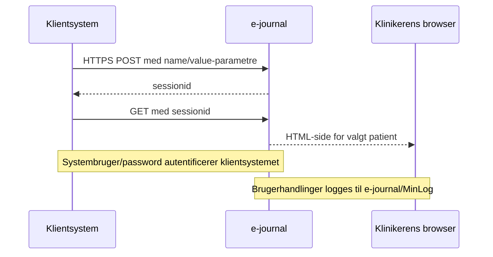
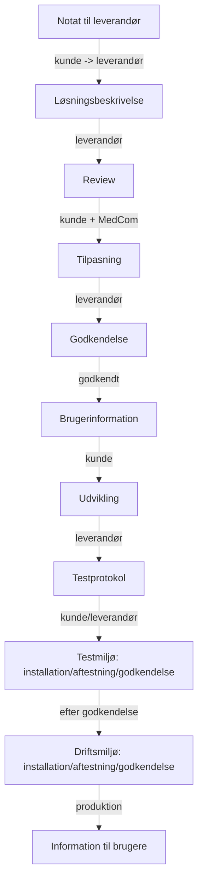

# Adgang til e-journal fra sygehussystemer

- **Kildedokument:** `medcom_adgang-til-e-journal-fra-sygehussystemer-2-0.pdf`
- **Dato:** 1. marts 2010
- **Konverteringsformål:** Agent-egnet tekstversion med kilde-sideankre og separate diagram-/billedressourcer.
- **Kildeprincip:** Teksten nedenfor følger PDF-kilden. Mermaid-diagrammer er semantiske rekonstruktioner og bør kontrolleres mod originalfiguren ved tvivl.

<!-- Kildeside: 1 -->

Hvis du har brug for at læse dette dokument i et keyboard eller skærmlæservenligt format, så klik venligst på denne knap.

                                                                                                                            Odense den. 1. marts 2010

      NOTAT - Adgang til e-journal fra sygehussystemer

      1. Generel beskrivelse af adgangen ........................................................ 1
      2. Grænsefladen .................................................................................. 2
           system_username / system_password ............................................. 3
           omraade....................................................................................... 3
           aktoertype.................................................................................... 4
           bruger_id/bruger_cpr/bruger_cvr/bruger_navn/bruger_titel ............... 4
           patient_cpr/samtykke_type/samtykke_begrundelse/skaerpet_logning . 4
           sgh_kode/sgh_navn/afd_kode/afd_navn .......................................... 4
      3. Anbefalinger .................................................................................... 4
      4. Etablerede knapløsninger i sygehussystemer ....................................... 4
      5. Bilag – Forslag til aktivitetsplan.......................................................... 6
      6. Bilag – Forslag til testprotokol............................................................ 7

      Dette notat beskriver adgangen til e-journal fra eksterne sygehussystemer.

      Formålet med dokumentet er at sikre, at leverandøren af et sygehussystem er
      i stand til at vurdere kravene til en teknisk løsning og omkostningerne ved
      etablering af en forbindelse til e-journal på det beskrevne grundlag. Der vil
      kunne komme flere notater, der dokumenterer de tekniske aspekter i løsnin-
      gen, hvis der opstår et behov herfor.

      Det eksterne sygehussystem vil i det efterfølgende blive betegnet som klient-
      systemet.

## 1 Generel beskrivelse af adgangen
      Adgangen til e-journal sker via en SSL-krypteret linje (HTTPS-protokollen). Til
      det formål vil e-journalserveren stille et certifikat til rådighed, som skal accep-
      teres af klientsystemet.

      Klientsystemet logger på e-journal via en systembruger/password. Det er altså
      ikke de enkelte brugere i klientsystemet, der logger på e-journal.

      Løsningen kan eventuelt kombineres med en løsning, hvor klientsystemet stil-
      ler et OCES-virksomheds- eller OCES-servercertifikat til rådighed. Denne del er
      ikke beskrevet yderligere her. MedCom vurderer at man i første omgang kan
      etablere en pilotimplementering baseret på systembruger/password, og hvis
      det ønskes fra regionernes side, kan man gå videre med en sådan løsning.

<!-- Kildeside: 2 -->

En bruger, der er logget på e-journal via et klientsystem, vil få sine handlinger
logget i e-journal. Relevante logningsoplysninger vil blive publiceret overfor
borgeren (patienten) via sundhed.dk’s borgervendte log, kaldet MinLog.

URL’en der skal anvendes vil blive fastsat i forbindelse med implementeringen.

## 2 Grænsefladen
Parametrene, der skal overføres til e-journal, skal overføres ved hjælp af
HTTP-protokollens POST-kommando.

Parametrene skal overføres som en liste af name/value par. Et par for hver
parameter. Parametre overføres i header-delen af POST-kommandoen. e-
journal returnerer en sessionid, som derefter sendes tilbage til e-journal med
en GET-kommando med sessionid som parameter. GET-kommandoen returne-
rer den HTML-side, der skal vises for klinikeren.

Informationen vil være som i nedenstående tabel. De enkelte parametre er
beskrevet yderligere i de efterfølgende afsnit.

Navn                     Tvunget Beskrivelse
system_username          Ja         Indeholder brugernavn, som e-journal an-
                                    vender til at identificere klientsystemet.
system_password          Ja         Det tilhørende password.
omraade                  Nej        Koden for regionen, der ønskes vist.
aktoer_type              Ja         Angivelse af, om det er en borger, en klini-
                                    ker eller et klientsystem, der logger på.
bruger_id                Ja         Brugeren (klinikeren) fra klientsystemet.
bruger_cpr               Nej        Cpr-nr. på den kliniker, der er logget på.
bruger_cvr               Nej        CVR på den organisation, som klinikeren
                                    tilhører.
bruger_navn              Ja         Navnet på brugeren.
bruger_titel             Nej        Titel på brugeren. Fx Læge, sygeplejerske.
patient_cpr              Ja         Patientens CPR-nr.
samtykke_type            Nej        Samtykketypen.
samtykke_begrundelse Nej            Samtykketeksten.
skaerpet_logning         Nej        Angivelse af, om der er tale om skærpet
                                    logning.
Sgh_kode                 Ja         SKS-koden på sygehuset, hvortil brugeren
                                    er knyttet. Der vælges 20 tegn mhp forbe-
                                    redelse for SOR-koder
Sgh_navn                 Ja         Navnet på sygehuset.

<!-- Kildeside: 3 -->

Navn                     Tvunget Beskrivelse
Afd_kode                 Nej        SKS-koden på afdelingen, hvortil brugeren
                                    er knyttet. Der vælges 20 tegn mhp forbe-
                                    redelse for SOR-koder
Afd_navn                 Nej        Navnet på afdelingen.

system_username / system_password
Systembrugeren, med tilhørende password. Der oprettes en bruger i e-journal
for klientsystemet. Denne bruger medsendes af klientsystemet til brug for au-
tentifikation af klientsystemet.

omraade
Den region, som klientsystemet ønsker at søge data fra. Parameteren har føl-
gende værdisæt:

                 Kode          Betydning
                 ALLE          Alle regioner
                 NDJA          Nordjyllands Amt
                 VIBORG        Viborg Amt
                 AARHUS        Århus Amt
                 VEJLE         Vejle Amt
                 RIBE          Ribe Amt
                 SDJA          Sønderjyllands Amt
                 FYNS          Fyns Amt
                 REGSJ         Region Sjælland
                 REGHS         Region Hovedstaden
                 REGNJ         Region Nordjylland
                 REGMI         Region Midtjylland
                 REGSD         Region Syddanmark

Koden ’ALLE’ anvendes, hvis der ønskes en oversigt, der viser seneste forløb
for alle regioner. Hvis klientsystemet ikke angiver et område, anvender e-
journal denne kode.

Koderne der vedrører amter, skal anvendes indtil e-journal lægges om til at
vise de vestdanske amter som regioner. Herefter udgår amtskoderne til fordel
for de tilsvarende vestdanske REG-koder.

<!-- Kildeside: 4 -->

aktoertype
Angiver typen    af   aktøren.   I   dette   tilfælde   altid   tekststrengen   ’SYGE-
HUSSYSTEM’.

bruger_id/bruger_cpr/bruger_cvr/bruger_navn/bruger_titel
Oplysninger om brugeren (klinikeren), der er logget på klientsystemet (fx en
læge). Oplysningerne anvendes til logning af brugerens aktiviteter i e-journal,
herunder de oplysninger, der stilles til rådighed for borgeren via MinLog i sund-
hed.dk.

bruger_id er en entydig identifikation af en bruger for et klientsystem. Udgør
sammen med system_username en entydig identifikation af brugeren på tværs
af klientsystemer.

patient_cpr/samtykke_type/samtykke_begrundelse/skaerpet_logning
Patientoplysninger. e-journal vil kun vise data for det angivne CPR-nr. Bruge-
ren kan ikke skifte CPR-nr. i e-journal. Derved sikres, at behandler / patient-
relationen kan skabes i klientsystemet, og ikke brydes i e-journal.

Hvis samtykkeerklæringen er afgivet i klientsystemet, sendes samtykkeoplys-
ningerne med til e-journal, og brugeren afkræves ikke en samtykkeerklæring i
e-journal. Hvis samtykkeoplysningerne ikke er fyldestgørende, vil brugeren
blive afkrævet en samtykkeerklæring i e-journal.

Parameteren skaerpet_logning betyder, at klinikeren af hensyn til den aktuelle
behandling har valgt at se patientens data, uden at have opnået patientens
samtykke. Dette vil medføre et skærpet logningskrav. Parameteren angives
som værdien ’1’, hvis der er krav om skærpet logning. Parameteren er tom,
hvis der ikke er krav om skærpet logning.

sgh_kode/sgh_navn/afd_kode/afd_navn
Brugerens organisatoriske tilhørsforhold. Afdelingsforholdet er dog ikke tvun-
get. Anvendes til logning.

## 3 Anbefalinger
Når sygehussystembrugeren ledes over i e-journal anbefales det at:

   • brugeren ledes over i e-journal med samtykket: ”Aktuelt behandlingsfor-
     løb” (Hvis der er tale om en anden samtykke situation kan klassisk ad-
     gang benyttes)
   • brugeren som første oversigt for vist oversigten: ”seneste forløb alle am-
     ter/ regioner

## 4 Etablerede knapløsninger i sygehussystemer
De systemer der har etablerer adgang til E-Journal er:

<!-- Kildeside: 5 -->

Region Nordjylland:     EPJ-system på Sygehus Thy-Mors fra Logica.
                        PAS-system i tidligere Nordjyllands Amt fra Logica

Region Midtjylland:     EPJ-system på Sygehus Viborg fra Logica.
                        Mangler: Columna fra Systematic, PAS-system fra CSC
                        (GS-Classic)

Region Syddanmark: EPJ-systemet på Sygehus Lillebælt IBM (IPJ).
                   PAS-systemet i Sygehus Sønderjylland fra CSC (GS-
                   Åben).
                   På vej: EPJ på OUH (Logica Cosmic)
                   Mangler: EPJ-system på Svendborg Sygehus fra IBM
                   (Medicare)

Region Sjælland:        På vej: PAS-systemet fra CSC (Opus arbejdsplads).

Region Hovedstaden: På vej: PAS-systemet fra CSC (Opus arbejdsplads).

MedCom koordinere aktiviteterne omkring etablering af adgang for sygehussy-
stemer – herunder
   • Tilpasning og udvikling af e-journal, så den ønskede snitflade er tilgænge-
     lig for sygehussystemer
   • Adgang til testmiljø til afprøvning af sygehusadgang
   • Formidling af testresultater fra e-journal log-databasen
   • Koordinering af evt. justeringer på klient- (sygehussystem-) og server-
     (e-journal-) side, der måtte være behov for.

<!-- Kildeside: 6 -->

## 5 Bilag – Forslag til aktivitetsplan.

Når et sygehussystem skal implementere knapløsningen kan dette gøres efter
følgende aktivitetsplan.

Aktivitet                                         Ansvarlig / Involveret
Notat "Adgang til e-journal fra sygehussyste- Kunden
mer" sendes til leverandøren
Udarbejdelse af løsningsbeskrivelse på basis af Leverandøren
notatet
Review af løsningsbeskrivelse                     Kunden og MedCom
Tilpasning af løsningsbeskrivelse                 Leverandøren
Godkendelse af løsningsbeskrivelse                Kunden og MedCom
Udarbejdelse af information til brugere (hvem Kunden
må hvad hvornår)                              (se oplæg fra MedCom)
Udvikling af integrationen                        Leverandøren
Udarbejdelse af leverandørspecifik testprotokol   Kunden/leverandøren
                                                  (se oplæg fra MedCom)
Aftestning af integration i testmiljø:            Leverandør/Kunde/MedCom,
   • Installation                                 der koordinerer med øvrige
   • Aftestning                                   samarbejdspartnere
   • Godkendelse                                  Kunden
Aftestning af integration i driftsmiljø:          Leverandør/Kunde/MedCom,
   • Installation                                 der koordinerer med øvrige
   • Aftestning                                   samarbejdspartnere
   • Godkendelse                                  Kunden
Information til brugere udsendes                  Kunden

<!-- Kildeside: 7 -->

## 6 Bilag – Forslag til testprotokol

                                                       E-journal
                                                Kvalitetssikring

             Standard-testprotokol for aftestning af knapløsning
                     (adgang til e-journal fra sygehussystemer)

<!-- Kildeside: 8 -->

Ændringslog

Version           Dato                Kommentarer
### 1.0 100210              Oprettet
### 1.1 100210              Teststrategi udfærdiget af Dorthe Wøldike og Vibeke
                                      Valbæk
### 1.2 250210              Ajourført efter review af Jens Rahbek Nørgaard

Testoplysninger

Oprettet af     vxv        Reviewet af               jrn
Testmiljø den              Produktionsmiljø
                           den
Formål                Formålet med denne standardtestplan er at udforme en testprotokol,
                      der skal gennemføres ved hver nye knap-løsning, der etableres fra et
                      sygehussystem
                      Vær opmærksom på, at denne testplan er generel, og den skal såle-
                      des tilpasses ved hver enkelt nye knap-løsning, der etableres, mhp.
                      målrettet aftestning af den nyetablerede snitflade
Teststrategi          Formålet er at kvalitetssikre, at leverancen og etablering af snitfladen
                      mellem e-journal og sygehussystemets leverandør fungerer efter
                      hensigten.
                      Aftestning skal først finde sted i testmiljøet, og der skal en godken-
                      delse til, før knapløsningen kan flyttes i produktion.
                      Følgende punkter skal som minimum testes:
                           •   At knappen/genvejen eksisterer og kan aktiveres
                           •   At knappen/genvejen ikke kan aktiveres, uden at brugeren har
                               adgang til en patient i kontekst (valgt en patient i eget sy-
                               stem)
                           •   At aktivering af knappen/genvejen medfører, at e-journal
                               præsenteres. Det er løsningsspecifikt, hvilken præsentation
                               der vises:
                                      Hvis samtykke ikke er afklaret i eget system møder
                                      man e-journal’s samtykkebillede
                                      Hvis samtykke er afklaret i eget system er der 2 mulig-
                                      heder:
                                      Enten logges brugeren på den lokale database med vis-
                                      ning af alle forløb
                                      Eller vises ”alle amter nyeste forløb”
                           •   At e-journal viser alle forventelige data på den valgte patient,
                               hvilket testes ved følgende sammenligninger:
                                      Brugeren sammenligner pålogning gennem
                                      knap/genvej med pålogning direkte på e-journal
                                      Brugeren sammenligner pålogning gennem
                                      knap/genvej med data fra primærsystemet
                           •   At performance i e-journal ved brug af knap/genvej og brug af
                               direkte pålogning er den samme

<!-- Kildeside: 9 -->

•   At det ikke er muligt at anvende et andet cpr.nr. i e-Journal –
                           brugeren skal være ”fastlåst” på den valgte patient fra pri-
                           mærsystemet
                       •   At der sker en aflogning i e-Journal, hvis brugeren vælger en
                           anden patient i primærsystemet (dvs. den aktive session af e-
                           Journal skal automatisk lukkes)
                       •   At brugeren ved valg af anden patient i primærsystemet og
                           aktivering af knap/genvej bringes over i e-Journal med den
                           nye patient i kontekst (den nye patient er valgt i e-Journal)
                       •   At en aflogning af brugeren i primærsystemet automatisk
                           medfører en aflogning i e-Journal (dvs. e-Journal lukker auto-
                           matisk ned)
                       •   At leverandøren af primærsystemet dokumenterer, at logfilen
                           til MinLog indeholder oplysninger om bruger (navn og stilling),
                           ansættelsessted (organisation med SKS-kode og navn), pati-
                           ent (cpr.nr.) og hvornår (dato og tid)
Forudsætninger         Der skal min. anvendes to forskellige cpr.nr.
Behov for testdata     Det er en nødvendighed for at kunne gennemføre testen, at
                       •   brugeren kan logge sig på som bruger på et sygehussystem med be-
                           handlingsrelation til patienter
                       •   brugeren har adgang til e-journal med et superbruger login
Forventet start/slut

<!-- Kildeside: 10 -->

Kvalitetstest.

Nr Hvad           Forudsætning            Hvordan             Forventet resultat   Status
## 1 Aftestning   Knap/genvejs løs-       Log på som bruger
                  ningen er installeret
                  i testmiljøet
 2

 3

# Mermaid-rekonstruktioner

## POST/session/GET-flow

<!-- Billedbeskrivelse: Grænsefladen bruger HTTPS. Klientsystemet sender POST-parametre, modtager et session-id og bruger dette i et GET-kald, som returnerer HTML-visningen til klinikeren. -->

Mermaid-kilde: `e_journal_adgang_sygehussystemer_assets/e_journal_adgang_sygehussystemer_integration_sequence.mmd`

## Aktivitetsplan for knapløsning

<!-- Billedbeskrivelse: Aktivitetsplanen beskriver den sekventielle proces fra fremsendelse af notat og løsningsbeskrivelse til review, udvikling, testmiljø, driftsmiljø og brugerinformation. -->

Mermaid-kilde: `e_journal_adgang_sygehussystemer_assets/e_journal_adgang_sygehussystemer_aktivitetsplan.mmd`
