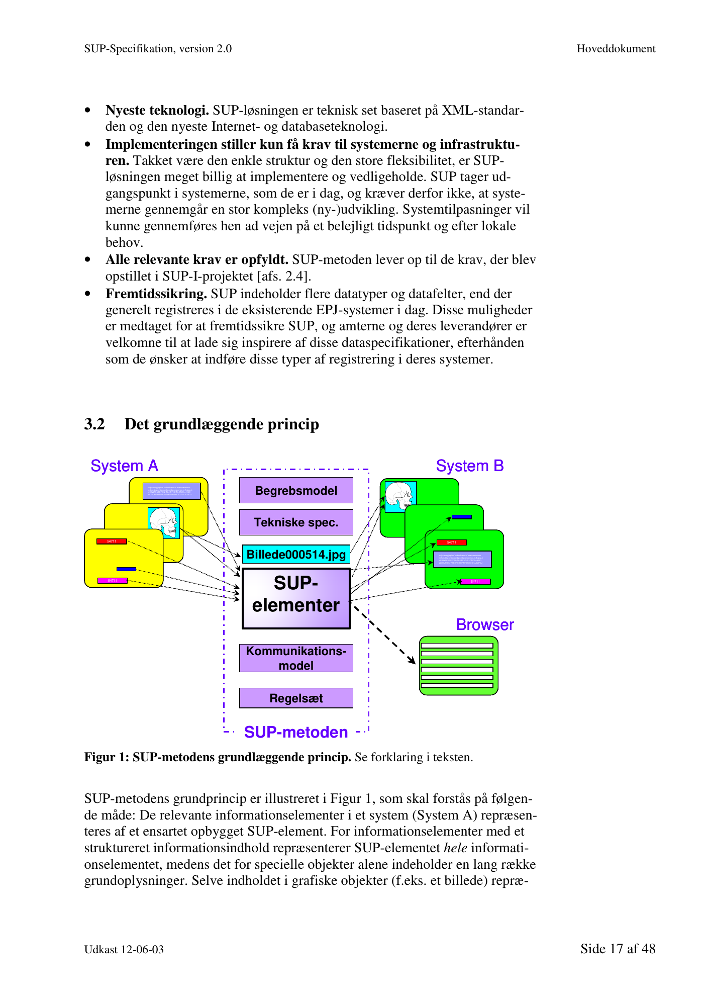
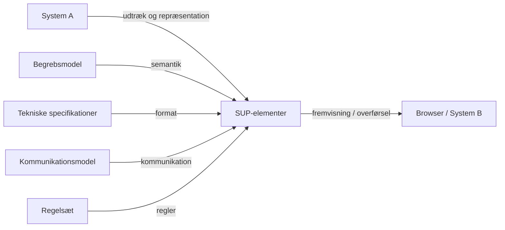
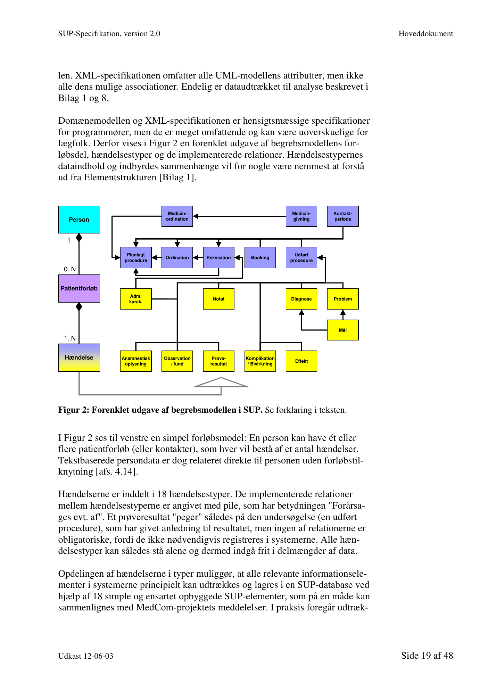
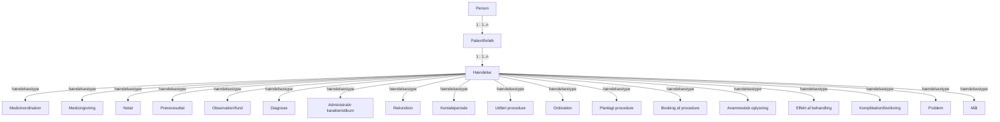
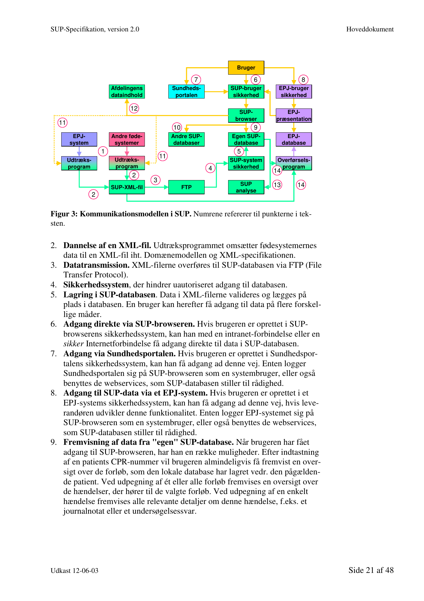
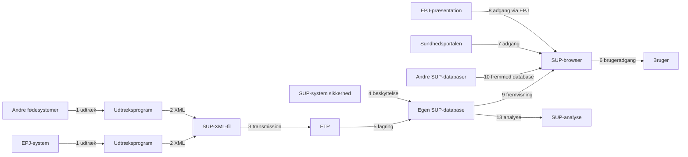

# SUP-specifikation, version 2.0 - Hoveddokument

- **Kildedokument:** `sup-specifikation_version_20_udk_120603.pdf`
- **Dato:** 12. juni 2003
- **Konverteringsformål:** Agent-egnet tekstversion med kilde-sideankre og separate diagram-/billedressourcer.
- **Kildeprincip:** Teksten nedenfor følger PDF-kilden. Mermaid-diagrammer er semantiske rekonstruktioner og bør kontrolleres mod originalfiguren ved tvivl.

<!-- Kildeside: 1 -->

Kan med fordel udskri-
ves på en farveprinter,
idet figurerne er i farver.

 SUP-specifikation

                    Version 2.0

               Udkast af 12. juni 2003

                           Udarbejdet for

             SUP-Styregruppen

       © Uddrag af indholdet kan gengives med tydelig kildeangivelse

<!-- Kildeside: 2 -->

Indholdsfortegnelse
1      Indledning................................................................................. 4
    1.1       Hvad er SUP? ..................................................................................... 4
    1.2       Formål med og målgruppe for dette dokument .................................. 4
    1.3       Specifikationens indhold, afgrænsning og struktur ............................ 4
    1.4       Læsevejledning................................................................................... 6
    1.5       Tak ...................................................................................................... 6
2      SUP-projektet........................................................................... 7
    2.1       Baggrund ............................................................................................ 7
    2.2       Formål................................................................................................. 7
    2.3       Projektorganisation............................................................................. 8
    2.4       Projektets første del: SUP-I ................................................................ 8
    2.5       Projektets anden del: SUP-II ............................................................ 11
    2.6       Pilotprojekter .................................................................................... 12
    2.7       Forhold til andre projekter................................................................ 14
    2.8       Det videre forløb............................................................................... 15
3      SUP-metoden.......................................................................... 16
    3.1       SUP-metodens vigtigste karakteristika............................................. 16
    3.2       Det grundlæggende princip .............................................................. 17
    3.3       Begrebsmodellen .............................................................................. 18
    3.4       Kommunikationsmodellen i SUP ..................................................... 20
    3.5       Analysemuligheder........................................................................... 22
4      Regler og anbefalinger .......................................................... 24
    4.1     Registreringskrav.............................................................................. 24
    4.2     Udtrækskrav...................................................................................... 25
    4.3     Validering ......................................................................................... 26
    4.4     Repræsentationsform ........................................................................ 26
    4.5     Utilstrækkelige repræsentationsmuligheder i SUP........................... 28
    4.6     Begrebsmæssige forskelle mellem afdelinger .................................. 28
    4.7     Konvertering..................................................................................... 29
    4.8     Dataindhold i udtræk fra den enkelte afdeling ................................. 29
    4.9     Manglende data................................................................................. 30
    4.10 Inkonsistensproblemer...................................................................... 31
    4.11 Håndtering af dataudtræk fra forskellige systemer........................... 32
       4.11.1 Samme data i flere SUP-databaser. .......................................... 32
       4.11.2 Samme data i samme SUP-database fra forskellige kilder....... 32
    4.12 Overførsel af SUP-data til andre systemer ....................................... 34
    4.13 Kontaktregistrering og forløbsregistrering ....................................... 34
    4.14 Persondata......................................................................................... 35
    4.15 Klassificerede data............................................................................ 36
       4.15.1    SKS-klassifikationen ................................................................ 36
       4.15.2 Andre større, officielle klassifikationer .................................... 37
       4.15.3    SUP-klassifikationen ................................................................ 37
       4.15.4 Lokale koder ............................................................................. 37
       4.15.5 Repræsentation af klassificerede begreber ............................... 37
    4.16 Ikke-klassificerede, strukturerede data ............................................. 38

Udkast 12-06-03                                                                                                               Side 2 af 48

<!-- Kildeside: 3 -->

4.17 Notater og notatrubrikker ................................................................. 39
    4.18 Tidspunkter....................................................................................... 40
       4.18.1 Format for tidspunkter .............................................................. 40
       4.18.2 Manglende tidspunkter ............................................................. 40
       4.18.3 Diagnosers starttidspunkt ......................................................... 41
       4.18.4 Tilstedetidspunkt ...................................................................... 42
       4.18.5 Ugyldighedstidspunkt............................................................... 42
    4.19 Relationer mellem hændelser ........................................................... 42
    4.20 Objektreferencer ............................................................................... 43
    4.21 Sikkerhedskode................................................................................. 43
    4.22 Markering i EPJ-systemerne for eksistens af SUP-data ................... 43
    4.23 Vedligeholdelse og versionsstyring.................................................. 43
5      Bilagsoversigt ......................................................................... 45
    Bilag 1: Elementstruktur............................................................................... 45
    Bilag 2: Domænemodel ................................................................................ 45
    Bilag 3: Usecases.......................................................................................... 46
    Bilag 4: XML-specifikation.......................................................................... 46
## Bilag 5: Snitflade mellem udtræksprogram og database .............................. 46
## Bilag 6: Snitflade mellem database og webapplikation................................ 46
    Bilag 7: Browserløsning ............................................................................... 46
    Bilag 8: Analyseudtræk ................................................................................ 46
    Bilag 9: Sikkerhed og samtykke ................................................................... 47
## Bilag 10: Dataindhold i SUP-databaser........................................................ 47
## Bilag 11: Kommunikation mellem flere SUP-databaser .............................. 47
    Bilag 12: Drift af SUP-systemer................................................................... 47
    Bilag 13: SUP-klassifikationer ..................................................................... 47
    Bilag 14: Ordliste.......................................................................................... 47
6      Referencer............................................................................... 48

Udkast 12-06-03                                                                                                        Side 3 af 48

<!-- Kildeside: 4 -->

## 1 Indledning
### 1.1 Hvad er SUP?

Standardiseret Udtræk af Patientdata - SUP - er navnet på en integrationsløs-
ning, som er udviklet af Vejle, Viborg og Århus Amter i et fælles projekt.

SUP-metoden muliggør kommunikation og analyse af patientdata på tværs af
forskellige IT-systemer i sundhedsvæsenet, herunder f.eks. kommunikation af
patientdata mellem sygehusafdelinger, der anvender elektroniske patientjour-
nalsystemer udviklet af forskellige leverandører.

### 1.2 Formål med og målgruppe for dette dokument

Formålet med dette dokument er:

• at specificere SUP-metoden
• at sætte bl.a. IT-leverandører og amternes IT-personale i stand til at udvik-
  le, implementere og vedligeholde kommunikationssystemer baseret på
  SUP-metoden.
• at udgøre en del af beslutningsgrundlaget for amterne ved udbud af SUP-
  løsninger.

Der er således ikke kun tale om en specifikation af SUP-metoden, men også om
en mere bred vejledning i udvikling, implementering og drift af SUP-systemer.

Specifikationens primære målgruppe er personer med et betydeligt kendskab
til sundhedsinformatik. En række tekniske og sundhedsfaglige begreber og
forhold forudsættes derfor bekendt. Der er dog som Bilag 14 medtaget en ord-
liste med forklaringer på en række vanskelige begreber for at gøre især de mere
generelle dele af specifikationen tilgængelig for personer udenfor den primære
målgruppe.

### 1.3 Specifikationens indhold, afgrænsning og struktur

SUP-specifikationen indeholder:

• En informativ del, bestående af kapitel 2, der beskriver SUP-projektet, og
  kapitel 3, der beskriver SUP-metoden på oversigtsform.
• En normativ del, hvor selve SUP-metoden er specificeret og forklaret i
  kapitel 4 og bilag 1-13, som er kortfattet beskrevet i kapitel 5.

Udkast 12-06-03                                                                    Side 4 af 48

<!-- Kildeside: 5 -->

Størstedelen af specifikationen er anbragt i bilagene, idet dette muliggør, at
dele af specifikationen om nødvendigt kan udsendes i en ny version, uden at
hele dokumentationen skal rettes af vedligeholdelsesorganisationen og senere
måske udskrives af alle interessenter. Der er et vist indholdsmæssigt overlap
mellem nogle dele af specifikationen for at opnå, at de enkelte dele kan læses
mere selvstændigt uden at skulle følge for mange henvisninger til andre dele af
teksten.

SUP-projektet har valgt at specificere andet og mere end blot de basale elemen-
ter i en kommunikation såsom begrebsmodellen, udvekslingsformatet og nogle
tekniske forhold. Dette er sket i erkendelse af, at man for at sikre en tilfredsstil-
lende funktion af et kommunikationssystem i både teknisk, informatisk og
sundhedsfaglig henseende må fastlægge et betydeligt antal regler og mini-
mumskrav vedrørende f.eks. udtræksomfang, præsentation og teknik.

SUP-specifikationen er baseret på et meget stort antal valg mellem alternative
delløsninger, der hver har deres fordele og ulemper. Sådanne valg vil altid
kunne diskuteres, og der er derfor ganske mange steder anført en begrundelse
for, hvorfor specifikationen er fastlagt på en bestemt måde, og ind i mellem
også hvorfor forskellige andre alternative løsninger er fravalgt. Dette kan må-
ske nedsætte overblikket over, hvad man skal overholde, men projektgruppen
skønner, at denne ulempe klart opvejes af den øgede forståelse for, hvorfor
specifikationen ser ud, som den gør. En sådan øget forståelse må forventes at
nedsætte fejlrisikoen og øge motivationen for fuldt ud at overholde både "ånd"
og "bogstav" i specifikationen.

For klart at adskille det obligatoriske fra det valgfrie skelnes der overalt i be-
skrivelserne både i dette hoveddokument og bilagene skarpt mellem følgende
begreber:

• Skal. Ordet "skal" anvendes, når den pågældende regel er obligatorisk. Til-
  svarende skal ordene "må ikke" og "kan ikke" opfattes obligatorisk.
• Bør. Ordet "bør" bruges, når en regel har karakter af en anbefaling [se ne-
  denfor].
• Kan og må. Ordene "kan" og "må" bruges, hvor amtet / leverandøren i
  forhold til SUP-specifikationen har valgfrihed vedr. det pågældende for-
  hold. Andre lokale forhold kan naturligvis betyde, at man alligevel ikke
  "kan" og "må" det pågældende. Omvendt gælder, at de muligheder, som er
  nævnt under ”kan” og ”må”, ikke skal opfattes som en afgrænsning, men
  blot som vigtige/oplagte eksempler.

Amterne bør forlange af deres IT-leverandører, at anbefalingerne overholdes,
medmindre der efter amtets opfattelse foreligger en god grund til at undlade
overholdelse, f.eks.:

• Faseinddeling. Det kan i nogle situationer være hensigtsmæssigt at opdele
  udvikling og implementering i nogle faser, og i så fald kan det være for-

Udkast 12-06-03                                                                          Side 5 af 48

<!-- Kildeside: 6 -->

målstjenligt ikke at medtage udviklingen og implementeringen af nogle af
  anbefalingerne i første fase.
• Særlige lokale forhold af sundhedsfaglig, informatisk eller teknisk art.

### 1.4 Læsevejledning

De færreste vil have fordel af at læse hele SUP-specifikationen fra A til Z. Man
bør ud fra Indholdsfortegnelsen og Bilagsoversigten i kapitel 5 udvælge de af-
snit og bilag, som man har behov for at sætte sig ind i.

Bemærk, at Afsnitshenvisninger er angivet som f.eks. [afs. x.x], medens litte-
raturhenvisninger er angivet som [x], der henviser til referencelisten i kapitel
6.

### 1.5 Tak

Tusind tak til alle, der har deltaget i specifikationsarbejdet, pilotprojekter, mø-
der og lignende, eller som på anden vis har bidraget med oplysninger og me-
ninger under udarbejdelsen af denne specifikation.

Udkast 12-06-03                                                                        Side 6 af 48

<!-- Kildeside: 7 -->

## 2 SUP-projektet
### 2.1 Baggrund

Sygehusvæsenet har i dag et stort antal forskellige informationssystemer, der er
udviklet af en række forskellige leverandører. Mellem nogle af disse systemer
er der indenfor det enkelte amt etableret snitflader, der muliggør en begrænset
udveksling af data til udførelse af en række basale opgaver. Generelt kan sy-
stemerne imidlertid ikke i relevant omfang og på en hensigtsmæssig måde ud-
veksle data til understøttelse af patientbehandlingen eller udtrække sammenlig-
nelige datasæt til planlægning og kvalitetssikring af patientforløb samt andre
ledelselsesmæssige formål.

Dette er uhensigtsmæssigt, idet man af denne grund langt fra kan opnå det ful-
de udbytte af de anskaffede systemer, herunder den optimale understøttelse af
det kliniske arbejde. Det er derfor en del af den nationale IT-strategi for syge-
husvæsenet, at systemerne skal integreres i relevant omfang. Målet er, at man i
amternes sygehusvæsener frit skal kunne opbygge et sammenhængende infor-
mationssystem bestående af delsystemer fra forskellige leverandører, uden at
dette hæmmer en relevant brug af data på tværs af systemerne. Man skal også
kunne sammenligne sine data med andre amters data.

### 2.2 Formål

Hovedformålet med SUP-projektet har været at sikre datatilgængelighed i
bred forstand gennem:

## 1 At muliggøre kommunikation af patientdata mellem enheder i sundheds-
      væsenet, der anvender forskellige IT-systemer, f.eks. ved at:
          • fremvise udvalgte data fra andre EPJ-systemer i en browser.
          • overføre patientdata fra ét EPJ-system til et andet, f.eks. ved ud-
               skiftning af et EPJ-system.
          • udveksle data mellem EPJ-systemer og andre systemer.
## 2 At muliggøre analyse af patientdata på tværs af IT-systemer, f.eks. mhp.:
          • kvalitetsstyring
          • forskning
          • ledelse
          • planlægning og administration
          • indberetninger til f.eks. kliniske databaser

SUP er således en kommunikationsmetode og ikke en systemmodel, og den
omfatter principielt relevante patientdata fra alle typer af sundheds-IT-syste-
mer, og altså ikke kun EPJ-data.

Udkast 12-06-03                                                                      Side 7 af 48

<!-- Kildeside: 8 -->

Et vigtigt delformål har været at foretage en vurdering af, hvilke data der er
relevante ved kommunikation og analyse. Dette skal ses som en afgrænsning af
projektet samt et første forsøg på at indkredse behovet for relevant viden i en
given situation.

### 2.3 Projektorganisation

SUP-projektet har været ledet af en styregruppe, der fra december 2001 har
bestået af:

        IT-strategichef Ole Filip Hansen, Viborg Amt
        IT-konsulent Jens Grønlund, Viborg Amt
        Kontorchef Vera Ibsen, Vejle Amt
        Fuldmægtig Morten Hansen, Vejle Amt, (sekretær)
        Informatikchef Mogens Engsig-Karup, Århus Amt
        Kontorchef Lars Hagerup, Amtsrådsforeningen
        Informatikchef Jan Hansen, H:S
        Centerchef Henrik Bjerregaard Jensen, MedCom

Konsulent Peter Sylvest Olsen fra PSO Sundhedsinformatik har været koordi-
nerende projektleder og ydet konsulentbistand, medens chefarkitekt Jan Mark
og senere projektchef Peer Frøkjær Smed, begge fra CSC Scandihealth, har
været tekniske projektledere.

Udviklingen af de tekniske specifikationer og systemmodulerne til pilotfasen er
foretaget af en leverandørgruppe bestående af B-DATA, IBM Danmark og
CSC Scandihealth.

### 2.4 Projektets første del: SUP-I

SUP-I-projektet blev gennemført af Vejle Amt og Viborg Amt i perioden fe-
bruar-juni 2000. Projektet er detaljeret beskrevet i en rapport [1], og her skal
kun fremhæves nogle hovedpunkter:

•     Analyse af 6 store sundheds-IT-systemer. Der foretages indledningsvis
      en grundig analyse af dataindholdet i seks store informationssystemer om-
      fattende tre EPJ-systemer, to patientadministrative systemer og et røntgen-
      informationssystem. Systemernes udseende og funktionalitet er meget for-
      skellige, men analysen viser, at alle systemerne datamæssigt består af rela-
      tivt simple, basale informationselementer, der hver for sig repræsenterer
      hændelser i relation til patienten. Der identificeres otte grundlæggende
      hændelsestyper, der tilsammen beskriver den kliniske proces, og som der-
      for kan danne grundlag for en integrationsløsning. Datas registrering, struk-
      turering, semantik og kontekst beskrives, og det konstateres, at der er store

Udkast 12-06-03                                                                        Side 8 af 48

<!-- Kildeside: 9 -->

forskelle mellem systemerne på, hvilke data der registreres, hvilke data der
    struktureres og hvordan data relateres til hinanden. Det stiller store krav til
    en standards fleksibilitet.
•   Relevansvurdering. Det diskuteres på basis af analysen, hvilke data der
    bør kunne kommunikeres mellem systemerne for at understøtte patientbe-
    handlingen, og hvilke data der bør kunne udtrækkes til analyse.
•   Integrationsproblemerne i sygehusvæsenet beskrives, og der opstilles 15
    krav til en standardiseret integrationsløsning [se nedenfor]. Målet er at fin-
    de en metode, som på den ene side tilgodeser formålet med standardiserin-
    gen og på den anden side tager hensyn til forskellige interessenters interes-
    ser, herunder f.eks. en rimelig beskyttelse af tidligere investeringer.
•   Opstilling af en løsningsmodel. Med udgangspunkt i projektets målsæt-
    ninger, analyserne og de opstillede krav beskrives et forslag til en integrati-
    onsløsning. Løsningsmodellen tager udgangspunkt i SEP-modellens prin-
    cipper [2], men på basis af projektets analyse og en aftestning af SEP-
    modellen med data fra de seks systemer foretages der en række ændringer
    og tilføjelser, hvorved der udvikles en ny model, som kaldes for SUP-
    metoden (Standardiseret Udtræk af Patientdata). Metoden er nærmere be-
    skrevet i kapitel 3.
•   Aftestning af SUP-metoden. Ved en "skrivebordstest" finder man ikke
    nogen relevante data i de 6 systemer, som ikke kan repræsenteres.
•   Konklusion. Det konkluderes, at SUP-metoden lever op til de stillede krav
    [se nedenfor] og vil kunne udgøre en del af løsningen på integrationspro-
    blemerne i det danske sygehusvæsen.

De ovenfor nævnte 15 krav til en standard på dette område, der blev opstillet
i SUP-I-projektet, er følgende:

## 1 Udgangspunkt i de eksisterende systemer. En standard bør tage udgangs-
   punkt i de eksisterende systemer i det danske sygehusvæsen. Man kan let
   opstille tilsyneladende teoretisk korrekte og idealiserede modeller, der fra
   starten forudsætter store ændringer i både systemer og registreringspraksis,
   men det vil være særdeles tids- og omkostningskrævende at implementere
   disse. Motivationen for sådanne omfattende og kostbare ændringer er ikke
   tilstede hverken hos sygehusejerne eller det sundhedsfaglige personale, og
   det er heller ikke sandsynliggjort, at man vil få et rimeligt udbytte af sådan-
   ne omlægninger. Kunsten er derfor på én gang at "møde" systemerne, hvor
   de er i dag, og samtidig sikre, at løsningen understøtter en hensigtsmæssig
   udvikling henover tid. Systemernes nuværende udformning og registre-
   ringspraksis er jo ikke en tilfældighed, men et udtryk for det mulige i for-
   hold til bl.a. den eksisterende økonomi, teknologi, motivation og forståelse
   for de teknologiske muligheder. Man må kunne krybe, før man kan gå.
## 2 Muliggøre udtræk af datasæt til alle gængse formål. Standarden må
   muliggøre, at der kan udtrækkes simple og sammenlignelige datasæt fra
   forskellige systemer til understøttelse af bl.a. patientbehandling, kvalitets-
   sikring, forskning, ledelse, administration, planlægning og anden analyse.
## 3 Enkel databehandling. En interesseret bruger skal efter én dags kursus og
   ved hjælp af et almindeligt databaseprogram/regneark kunne udføre simple

Udkast 12-06-03                                                                        Side 9 af 48

<!-- Kildeside: 10 -->

analyser på et dataudtræk, der er struktureret efter standarden. Dette forud-
    sætter en enkel struktur. De fleste brugere vil kun kunne håndtere en tabel.
## 4 Muliggøre overførsel af patientdata mellem forskellige systemer. Data
    fra ét system skal automatisk kunne overføres til og indpasses på en medi-
    cinsk og sikkerhedsmæssig forsvarlig måde i et andet system, indenfor de
    områder af standarden, som begge systemer overholder. Det modtagende
    system skal kunne arbejde videre med de modtagne data på samme måde,
    som hvis tilsvarende data var blevet registreret direkte i systemet.
## 5 Informationstab skal være kontrollerede. Det er ikke et krav, at en pati-
    ents data skal kunne flyttes fra system A  system B  system A og her-
    efter være uforandrede. Der må gerne være et informationstab, blot det er
    kontrolleret. Dels kan der være data, man bevidst frasorterer, dels kan det
    være nødvendigt, at data som et led i udtræksmekanismen får reduceret sit
    struktureringsniveau. Betydningsindholdet må imidlertid ikke blive forvan-
    sket.
## 6 Muliggøre brug af delmængder. Man skal kunne udvælge og kommuni-
    kere enhver relevant delmængde af systemernes informationselementer,
    uden at det til delmængden knyttede informationsindhold går tabt eller for-
    vanskes. Derimod er det ikke et krav, at en delmængdes data skal bevare al-
    le sine relationer.
## 7 Risikoen for fejl skal begrænses mest muligt. En standard er ikke et “sy-
    stem”, hvor man kan indbygge en række valideringer og andre mekanismer
    for at forebygge fejl. Derfor må strukturen bedst muligt nedsætte risikoen
    for fejl ved analyser og anden brug af data. Dette betyder f.eks., at struktu-
    ren skal være enkel, og at brugen af modificerende felter så vidt muligt skal
    undgås.
## 8 Håndtering af alle struktureringsniveauer. En standard skal kunne
    håndtere en vilkårlig kombination af tekst og strukturerede data og mulig-
    gøre en gradvis øgning af struktureringsniveauet henover tid i takt med de
    lokale behov. Et højere struktureringsniveau bør ikke gennemtvinges ved at
    vedtage en standard, der forudsætter en høj grad af strukturering. Erfarin-
    gen viser nemlig, at dette med stor sikkerhed vil resultere i en lav datakvali-
    tet. Dels vil leverandørerne hjælpe brugerne ved automatisk at udfylde nog-
    le af de strukturerede felter ved hjælp af dummykoder og lignende metoder,
    dels vil brugerne ikke udvise den fornødne omhu med registreringen under
    tvang.
## 9 Fremme en øget strukturering. Et højere struktureringsniveau kan alene
    gennemføres, hvis man gennem motivation af brugerne opnår konsensus
    om dette. Dette gøres bedst ved at brugerne oplever, at de har behov for
    mere strukturering, f.eks. ved at de gennem arbejde med kliniske databaser
    eller EPJ'er får øje på de utallige anvendelsesmuligheder, som strukturerede
    data har. Det er vigtigt, at en standard bidrager til at motivere brugerne ved
    at give dem nogle umiddelbare fordele i form af f.eks. let anvendelige data-
    udtræk.
## 10 Gradvis implementering. Standarden skal kunne indføres gradvist i takt
    med lokale behov og muligheder.

Udkast 12-06-03                                                                       Side 10 af 48

<!-- Kildeside: 11 -->

## 11 Baseret på hændelser, patientforløb og SKS-koder. Standarden skal væ-
    re baseret på hændelserne i den kliniske proces, patientforløb og det danske
    klassifikationssystem SKS.
## 12 Muliggøre individuel udformning af systemerne. Standarden skal mulig-
    gøre bl.a. frit valg af funktionalitet, brugergrænseflade og præsentations-
    form.
## 13 Muliggøre individuel udformning af journalstrukturen. Standarden skal
    tillade, at man på de enkelte afdelinger kan udforme journalstrukturen efter
    f.eks. speciale og lokale forhold.
## 14 Tilstrækkelig håndtering af sikkerhed. Standarden skal muliggøre en
    overholdelse af lovens krav til sikkerhed.
## 15 Nem vedligeholdelse og videreudvikling. Vedligeholdelsen skal kunne
    foretages “fra uge til uge” af et dansk sekretariat.

### 2.5 Projektets anden del: SUP-II

SUP-II-projektet blev påbegyndt i februar 2001 og afsluttet juni 2003. Det er
beskrevet i en projektplan [3], som Styregruppen dog undervejs har besluttet at
ændre på enkelte punkter. Det overordnede formål med denne del af projektet
har været dels at få SUP-metoden klinisk og datalogisk valideret, dels at få
udviklet og afprøvet de nødvendige systemmoduler.

SUP-II-projektet kan kortfattet beskrives med følgende punkter:

•     Sundhedsfagligt review. I samarbejde med udvalgte sundhedsfaglige per-
      soner med EPJ-erfaring i Vejle og Viborg amter er der gennemført et re-
      view af den kliniske procesmodel, som udgør grundlaget for SUP-metoden.
      Formålet har været at øge sikkerheden for, at SUP-metoden kan repræsen-
      tere patientdata på en tilfredsstillende måde for det sundhedsfaglige perso-
      nale.
•     Begrebsmæssigt review. Der er i samarbejde med leverandørerne foretaget
      et review af SUP-metoden med det formål at kvalificere og operationalisere
      denne. Hændelsestyperne, datafelterne og deres indbyrdes relationer er ble-
      vet analyseret og fastlagt, hvilket dog kun har betydet få ændringer i for-
      hold til begrebsmodellen fra SUP-I-projektet.
•     Teknisk og praktisk afklaring. Der er gennemført en teknisk og praktisk
      afklaring mhp. opstilling af en kommunikationsmodel og et sæt af regler,
      der gør det muligt at stille data til rådighed for både EPJ-afdelinger og ik-
      ke-EPJ-afdelinger samt andre aktører i sundhedsvæsenet [se afs. 3.4].
•     Udvikling af programmer. Der er udviklet forskellige systemmoduler dels
      til afprøvning i pilotprojekterne, dels som udgangspunkt for produktmod-
      ning / videreudvikling mhp. en kommende rutinemæssig drift.
•     Aftestning. Fra EPJ-systemerne i Vejle og Viborg amter er der udtrukket
      data i SUP's XML-format. For at gøre projektet overkommeligt og målret-
      tet blev der foretaget en afgrænsning af både datamængder og datatyper [4].
      Der er udført forskellige analyser for at vurdere, om repræsentationen af

Udkast 12-06-03                                                                       Side 11 af 48

<!-- Kildeside: 12 -->

data er tilfredsstillende. Oplysningerne fra databasen er herefter præsenteret
      dels i en internetbrowser, dels som en tabel til analyseformål. Denne Af-
      testning viste ikke større problemer og har derfor udgjort et "Proof of Con-
      cept" for SUP-metoden.
•     Pilotprojekter. Der er foreløbig gennemført tre pilotprojekter. Konklusio-
      nerne fra to af dem [5, 6] er resumeret i afsnit 2.6.
•     Revision: På basis af erfaringer fra pilotprojekterne og en lang række ana-
      lyser er specifikationerne revideret, hvilket dog kun har givet anledning til
      mindre rettelser i den grundlæggende metode. Der er imidlertid tilføjet en
      lang række tekniske beskrivelser, krav og anbefalinger for at opgradere
      SUP-specifikationerne fra understøttelse af pilotdrift til understøttelse af ru-
      tinemæssig drift.

### 2.6 Pilotprojekter

Ved afslutningen af dette specifikationsarbejde er der gennemført følgende
pilotprojekter:

## 1 Horsens-Kolding-projektet. Overførsel af EPJ-oplysninger fra Gynæko-
   logisk-Obstetrisk Afdeling på Horsens Sygehus til både Pædiatrisk Afde-
   ling og Gynækologisk-Obstetrisk Afdeling på Kolding Sygehus. Dette pro-
   jekt er afsluttet og beskrevet i en rapport [5]. Pilotdriften fortsætter efter
   brugernes ønske.
## 2 Det tværamtslige projekt. Overførsel af EPJ-oplysninger fra Organkirur-
   gisk Afdeling på Vejle Sygehus og Medicinsk Afdeling på Viborg Sygehus
   til Hjerte-Lunge-Karkirurgisk Afdeling på Skejby Sygehus. Projektet er af-
   sluttet og beskrevet i en rapport [6]. Pilotdriften fortsætter efter brugernes
   ønske.
## 3 Gradia-projektet. Konvertering af EPJ-data fra Gradia-systemet (EPJ for
   gravide diabetikere på Fredericia Sygehus) til SUP-format. Projektet er ik-
   ke evalueret endnu.

Man kan finde flere oplysninger om pilotprojekterne i "Projektstyringsplan for
SUP-II-pilotprojektet" [7]. Der er planlagt flere andre SUP-pilotprojekter i for-
længelse af SUP-II-projektet.

Evalueringerne fra de to første pilotprojekter har været positive. Den Sund-
hedsfaglige Evalueringsgruppe i projektet mellem Horsens og Kolding syge-
huse konkluderer bl.a. følgende:

        "SUP-systemet opfylder i dette pilotprojekt sit formål. Der er konstateret
        en række problemer, der kan korrigeres for, men ellers opfylder systemet
        de opstillede evalueringskriterier.

        SUP-systemet giver allerede i sin nuværende version et meget nyttigt bi-
        drag til understøttelsen af samarbejdet mellem afdelinger om fælles pati-

Udkast 12-06-03                                                                          Side 12 af 48

<!-- Kildeside: 13 -->

enter. Alt i alt et værktøj, der fremover vil være nødvendigt med henblik
      på optimal information og kommunikation om patienterne."

Den Sundhedsfaglige Evalueringsgruppe i det tværamtslige pilotprojekt kon-
kluderer bl.a. følgende:

      "Sygehusejerne i Danmark har gennem år investeret i mange forskellige
      Elektroniske Patient Journal systemer, som af flere grunde ikke umiddel-
      bart taler med hinanden. Der investeres fortsat og i øget tempo, og man
      kan være bekymret for, at situationen udvikler sig sådan, at vi vil se en
      række mere eller mindre smukke og velfungerende EPJ-øer uden de øn-
      skede broforbindelser. På sigt kan man overkomme denne besværlighed
      ved at harmonisere sprog, organisation og infrastruktur (model og kom-
      munikation) mellem disse ø-riger. Et tiltag som i sin spæde start er initie-
      ret med Sundhedsstyrelsens G-EPJ og som på sigt vil kræve ikke ubety-
      delige investeringer og geninvesteringer både hos de amter, som har fun-
      gerende EPJ-systemer, og de, som ikke har.

      SUP-projektet repræsenterer en alternativ tilgang til isolationsproblemet,
      idet man har udviklet et kommunikationsværktøj baseret på en relativ
      simpel, men viser det sig, ret robust model, hvor de forskellige EPJ-
      systemers enkeltelementer lader sig identificere, ekstrahere og samle i en
      fælles SUP-database og således kan gøres tilgængelige for udefra kom-
      mende brugere. Det gælder også i forhold til EPJ-systemer, som er op-
      bygget på grundlag af G-EPJ. SUP er altså en løsning på det problem, at
      nogle EPJ-systemer i de kommende år vil understøtte G-EPJ, medens an-
      dre ikke understøtter G-EPJ.

      Hjerte-Lunge-Karkirurgisk Afdeling T, Thoraxkirurgisk sektion, Skejby
      Sygehus, har et vist fælles patientgrundlag med Organkirurgisk Afdeling,
      Vejle Sygehus, og et mere ekstensivt fælles grundlag med Medicinsk
      (Kardiologisk) Afdeling, Viborg Sygehus, og har således haft mulighed
      for at evaluere SUP-værktøjet som kommunikationsmiddel.

      Vel vidende, at ikke alle journalelementer (eksempelvis sygeplejenotater,
      diverse blanketter og billeddiagnostisk materiale) har været tilgængelige
      for en konvertering til SUP-formatet, har oplevelsen været, at teknikken
      har fungeret, at programmet har virket umiddelbart let tilgængeligt for
      brugerne, og at vi faktisk fik adgang til journalindholdet, som det nu en-
      gang foreligger i den ”fremmede” journal.

      Afhængig af de bidragende EPJ-systemers struktureringsgrad, vil SUP-
      databasen endvidere kunne danne basis for en form for kvalitetsvurdering
      på sygdomsforløb. SUP-databasen vil på sigt endvidere være et oplagt
      sted, hvor man kunne give den enkelte patient direkte adgang til at se sin
      egen journal.

Udkast 12-06-03                                                                      Side 13 af 48

<!-- Kildeside: 14 -->

Alt i alt vil vi anbefale, at man arbejder videre med at udvikle SUP-værk-
      tøjet i stor skala. SUP-systemet har et stort potentiale, idet man dels vil
      kunne løse kommunikationsproblemet mellem de forskellige EPJ-
      systemer, men også både direkte og indirekte vil medvirke til et kvalitets-
      løft af de enkelte systemer."

Efter SUP-Styregruppens opfattelse viser disse pilotprojekter klart, at SUP-
projektet er på rette vej og opfylder sine formål. SUP-metoden gør det muligt
her og nu at få en operationel adgang til at se og sammenligne data på tværs af
de enkelte informationssystemer, herunder EPJ-systemer, og den bidrager såle-
des i betydeligt omfang til at løse et af de væsentligste sundhedsinformatiske
problemer. SUP-metoden har således både en stor, umiddelbar nytteværdi og et
langsigtet perspektiv som en del af en mere omfattende løsning på integrations-
problemerne.

### 2.7 Forhold til andre projekter

Når man sammenligner de forskellige igangværende standardiseringsinitiativer,
er det vigtigt at være opmærksom på forskellene i deres formål. SUP er en
kommunikationsmetode, der skal opfattes som et supplement til systemmodeller
som H:S's DHE-model, Århus Amts Domænemodel og for så vidt alle an-
dre systemers modeller i sundhedsvæsenet. SUP vil således kunne forøge disse
systemers mulighed for at kommunikere og sammenligne data indbyrdes på en
nem og billig måde.

Der er foretaget en indledende sammenligning mellem SUP-metoden og Århus
Amts Domænemodel, og her blev der ikke identificeret uløselige problemer.
Der skal primært træffes nogle valg og udvikles et udtræksprogram for at kun-
ne udtrække data fra Århus Amts EPJ-system i SUP-format.

Tilsvarende er der i samarbejde med DHE-projektet foretaget en indledende
sammenligning mellem SUP-metoden og DHE-modellen, hvilket heller ikke
gav anledning til bekymringer mht. en fremtidig implementering af metoden.

MedComs meddelelser og SUP-metoden supplerer og komplementerer hinan-
den. Det skyldes, at SUP-metoden primært sigter på pull-kommunikation, me-
dens MedComs meddelelser varetager push-kommunikation, og der er behov
for begge kommunikationstyper. HL7-standarden minder i denne sammen-
hæng om MedCom, så også HL7 og SUP supplerer hinanden.

SUP-projektet ser ikke SUP-metoden som et alternativ til Sundhedsstyrelsens
grundstruktur for EPJ, der har et bredere sigte end SUP. SUP-metoden er
ikke en fælles grundstruktur for EPJ-systemer, men tværtimod en metode til
udveksling af data mellem forskellige systemer. De to projekter vil efter SUP-
projektets opfattelse kunne berige hinanden.

Udkast 12-06-03                                                                     Side 14 af 48

<!-- Kildeside: 15 -->

Da specifikationen af Sundhedsstyrelsens G-EPJ-model og det forløbsbaserede
LPR ved færdiggørelsen af denne SUP-specifikation (juni 2003) fortsat er un-
der udarbejdelse, har det ikke være muligt at tage hensyn til denne. Det forven-
tes imidlertid, at SUP uden videre kan repræsentere data fra systemer, der over-
holder G-EPJ, på samme måde, som SUP kan repræsentere data fra alle andre
patientregistreringssystemer [afs. 4.4].

SUP-metoden er ikke baseret på internationale standarder af den simple
grund, at der ikke findes nogen godkendt og implementeringsklar, international
standard, der kan leve op til SUP-projektets formål og krav til en løsning. Det
ser heller ikke ud til, at der kommer en sådan standard foreløbig, hverken fra
den europæiske standardiseringsorganisation CEN eller den internationale
standardiseringsorganisation ISO.

### 2.8 Det videre forløb

Med færdiggørelsen af denne specifikation er selve SUP-II-projektet afsluttet.
Der kan dog eventuelt blive tale om en vis opfølgning på arbejdet.

Den videre implementering af SUP-systemer forventes organiseret primært i
MedComs SUP-projekt [8].

Udkast 12-06-03                                                                    Side 15 af 48

<!-- Kildeside: 16 -->

## 3 SUP-metoden
### 3.1 SUP-metodens vigtigste karakteristika

SUP-metoden kan kortfattet beskrives med bl.a. følgende vigtige punkter:

•     Model for kommunikation og dataanalyse. SUP-metoden er ikke et for-
      slag til en fælles grundstruktur for alle EPJ-systemer, og man kan ikke op-
      bygge et EPJ-system alene på basis af domænemodellen i SUP. Formålet er
      tværtimod at muliggøre kommunikation og dataanalyse på tværs af forskel-
      lige leverandørers systemer og systemtyper. Modellen tager udgangspunkt i
      en række fælles strukturer i de eksisterende systemer, men den anviser sam-
      tidig en vej til forbedring og harmonisering af den nuværende registrering,
      således at denne bliver mere anvendelig og får en højere datakvalitet.
•     Alle relevante patientdata kan repræsenteres. SUP kan repræsentere alle
      relevante data i patientjournaler på den ene eller den anden måde. Da pati-
      entjournaler kan indeholde alle datatyper, kan SUP således principielt
      håndtere alle relevante patientdata fra alle typer af sundheds-IT-systemer.
•     Baseret på den kliniske proces. SUP-metoden er direkte opbygget efter
      den kliniske proces og procedureprocessen, hvilket er nærmere beskrevet i
      SUP-I-rapporten [1].
•     Forløbsorientering. SUP kan repræsentere data fra både forløbsbaserede
      og kontaktbaserede systemer, og brugen af SUP er derfor ikke afhængig af,
      at alle amter og systemer går over til forløbsregistrering, endsige skifter
      hertil på en bestemt dato.
•     Hændelsesorientering. SUP-metodens grundidé er at repræsentere de en-
      kelte hændelser i patientforløbet (dvs. selvstændige mindsteenheder af in-
      formation) på en standardiseret måde. Det svarer til, at man standardiserer
      byggeelementerne i et hus (f.eks. mursten, vinduer, rør), frem for at stan-
      dardisere større enheder (f.eks. et helt køkken). Det er denne fremgangs-
      måde, der gør SUP fleksibel og let at overholde for interessenterne.
•     Problemorientering / diagnoseorientering. SUP kan valgfrit repræsentere
      en problem- / diagnoseorienteret registrering, men valget af implemente-
      ringstidspunkt og omfang af en eventuelt obligatorisk problemorientering /
      diagnoseorientering er op til amterne.
•     Klassifikationer. SUP anvender SKS-klassifikationer i det omfang disse
      findes, men kan også repræsentere næsten alle andre typer af klassifikatio-
      ner.
•     Valgfrit struktureringsniveau. SUP kan repræsentere en vilkårlig blan-
      ding af strukturerede data og tekstnotater. Det er således op til amterne og
      deres leverandører i hvilket tempo, man ønsker at indføre en øget datastruk-
      turering. Alle relevante, strukturerede data kan analyseres i SUP-formatet.
•     Strukturen er meget enkel og ensartet. Det skyldes dels hændelsesorien-
      teringen, dels at SUP-løsningen i alle henseender fokuserer på det alminde-
      lige og det nødvendige frem for det specielle.

Udkast 12-06-03                                                                      Side 16 af 48

<!-- Kildeside: 17 -->

•     Nyeste teknologi. SUP-løsningen er teknisk set baseret på XML-standar-
      den og den nyeste Internet- og databaseteknologi.
•     Implementeringen stiller kun få krav til systemerne og infrastruktu-
      ren. Takket være den enkle struktur og den store fleksibilitet, er SUP-
      løsningen meget billig at implementere og vedligeholde. SUP tager ud-
      gangspunkt i systemerne, som de er i dag, og kræver derfor ikke, at syste-
      merne gennemgår en stor kompleks (ny-)udvikling. Systemtilpasninger vil
      kunne gennemføres hen ad vejen på et belejligt tidspunkt og efter lokale
      behov.
•     Alle relevante krav er opfyldt. SUP-metoden lever op til de krav, der blev
      opstillet i SUP-I-projektet [afs. 2.4].
•     Fremtidssikring. SUP indeholder flere datatyper og datafelter, end der
      generelt registreres i de eksisterende EPJ-systemer i dag. Disse muligheder
      er medtaget for at fremtidssikre SUP, og amterne og deres leverandører er
      velkomne til at lade sig inspirere af disse dataspecifikationer, efterhånden
      som de ønsker at indføre disse typer af registrering i deres systemer.

### 3.2 Det grundlæggende princip

 System A                                                                           System B
                                                                 Begrebsmodel
                 judjhnaoøpjøpfbkj’skdbk’bæml’m’mælmælmknnn
                 kjshgijahkgoinionoombpombpompompo,m,fbåp,p,k
                 kjEBWFKIJBEFONHN<NFFNOIN<ONOI<<KND
                 WOIEJFOINHWEEFINHEFFINHOIOIOI<JIIJPOJ

                                                                 Tekniske spec.
## 54711 54711

                                                                Billede000514.jpg   judjhnaoøpjøpfbkj’skdbk’bæml’m’mælmælmknnn
                                                                                    kjshgijahkgoinionoombpombpompompo,m,fbåp,p,k
                                                                                    kjEBWFKIJBEFONHN<NFFNOIN<ONOI<<KND
                                                                                    WOIEJFOINHWEEF INHEFFINHOIOIOI<JIIJPOJ

      54711

                                                                    SUP-                                           54711

                                                                 elementer
                                                                                                     Browser
                                                                Kommunikations-
                                                                    model

                                                                   Regelsæt

                                                                SUP-metoden
Figur 1: SUP-metodens grundlæggende princip. Se forklaring i teksten.

SUP-metodens grundprincip er illustreret i Figur 1, som skal forstås på følgen-
de måde: De relevante informationselementer i et system (System A) repræsen-
teres af et ensartet opbygget SUP-element. For informationselementer med et
struktureret informationsindhold repræsenterer SUP-elementet hele informati-
onselementet, medens det for specielle objekter alene indeholder en lang række
grundoplysninger. Selve indholdet i grafiske objekter (f.eks. et billede) repræ-

Udkast 12-06-03                                                                                                                    Side 17 af 48

<!-- Kildeside: 18 -->

senteres ikke, men SUP-elementet kan indeholde et internet- eller intranetlink
til objektet.

SUP-elementerne udgør således et indeks over alle udtrukne data og det fulde
indhold for de strukturerede data. Elementerne udgør derfor samtidig et fuld-
gyldigt analysegrundlag. Alle elementerne kan uanset fødesystem fremvises
ensartet i en almindelig Internet-browser på f.eks. oversigtsform eller en mere
detaljeret form. Endelig kan elementerne overføres til System B, hvor de kan
anbringes i en ny sammenhæng, hvis der er behov for dette [afs. 4.12].

SUP-løsningen består, som det fremgår af Figur 1, af følgende hovedelementer:

•     En begrebsmodel, der direkte afspejler forløbstankegangen, den kliniske
      proces og procedureprocessen, og som muliggør problem- / diagnoseorien-
      tering. Modellens grundlag og tilblivelse beskrives i rapporten fra SUP-I-
      projektet [1], medens dens konkrete udformning beskrives overordnet i af-
      snit 3.3 og detaljeret i den udarbejdede domænemodel [Bilag 2].
•     En kommunikationsmodel, der beskriver hvordan SUP-metoden i praksis
      skal implementeres og fungere. Kommunikationsmodellen beskrives noget
      forenklet i afsnit 3.4. og mere detaljeret i bilagene.
•     Et sæt af regler og anbefalinger. SUP-projektet har undervejs analyseret
      en lang række forskellige, praktiske problemstillinger og valgt løsninger på
      disse. Disse løsninger er beskrevet dels i kapitel 4, dels i bilagene.
•     Et stort antal tekniske specifikationer, som er beskrevet i bilagene.
•     Nogle få og små SUP-klassifikationer, som dækker nogle mindre områ-
      der, der ikke p.t. er dækket af SKS-klassifikationen. Klassifikationerne og
      deres brug er beskrevet i afsnit 4.15 og i Bilag 2 og 13.

### 3.3 Begrebsmodellen

En begrebsmodel er en formålsbestemt og forenklet beskrivelse af, hvordan
nogle udvalgte forhold er defineret og relateret til hinanden indenfor et givet
område af den virkelige verden. Heraf følger, at en begrebsmodel indeholder
en lang række valg, som kan diskuteres, og en begrebsmodel er derfor langt fra
en "naturgivet" ting, der kun kan udformes på én måde.

SUP's begrebsmodel er en beskrivelse og operationalisering af den kliniske
proces, som denne blev identificeret i analysen i SUP-I-projektet. Den er i øv-
rigt nøje udformet efter SUP-projektets formål og krav.

Begrebsmodellen er beskrevet fra flere forskellige synsvinkler. Der er udarbej-
det en udførlig domænemodel i UML-notation [Bilag 2], som definerer de
datafelter (attributter) og datarelationer (associationer), som projektet har fun-
det relevante. Dataudtrækkene efter SUP-metoden er specificeret i en XML-
specifikation [Bilag 4], der fastlægger, hvilke data og datarelationer fra UML-
modellen, der skal eller kan medtages i de valgte implementeringer af model-

Udkast 12-06-03                                                                      Side 18 af 48

<!-- Kildeside: 19 -->

len. XML-specifikationen omfatter alle UML-modellens attributter, men ikke
alle dens mulige associationer. Endelig er dataudtrækket til analyse beskrevet i
## Bilag 1 og 8.

Domænemodellen og XML-specifikationen er hensigtsmæssige specifikationer
for programmører, men de er meget omfattende og kan være uoverskuelige for
lægfolk. Derfor vises i Figur 2 en forenklet udgave af begrebsmodellens for-
løbsdel, hændelsestyper og de implementerede relationer. Hændelsestypernes
dataindhold og indbyrdes sammenhænge vil for nogle være nemmest at forstå
ud fra Elementstrukturen [Bilag 1].

                                  Medicin-                                   Medicin-    Kontakt-
   Person                        ordination                                  givning     periode

  1

                    Planlagt                                                   Udført
                                 Ordination    Rekvisition     Booking
                   procedure                                                 procedure

 0..N

Patientforløb
                    Adm.
                                                 Notat                       Diagnose    Problem
                    karak.

                                                                                           Mål
 1..N

 Hændelse         Anamnestisk    Observation     Prøve-      Komplikation
                                                                              Effekt
                   oplysning       / fund       resultat      / Bivirkning

Figur 2: Forenklet udgave af begrebsmodellen i SUP. Se forklaring i teksten.

I Figur 2 ses til venstre en simpel forløbsmodel: En person kan have ét eller
flere patientforløb (eller kontakter), som hver vil bestå af et antal hændelser.
Tekstbaserede persondata er dog relateret direkte til personen uden forløbstil-
knytning [afs. 4.14].

Hændelserne er inddelt i 18 hændelsestyper. De implementerede relationer
mellem hændelsestyperne er angivet med pile, som har betydningen "Forårsa-
ges evt. af". Et prøveresultat "peger" således på den undersøgelse (en udført
procedure), som har givet anledning til resultatet, men ingen af relationerne er
obligatoriske, fordi de ikke nødvendigvis registreres i systemerne. Alle hæn-
delsestyper kan således stå alene og dermed indgå frit i delmængder af data.

Opdelingen af hændelserne i typer muliggør, at alle relevante informationsele-
menter i systemerne principielt kan udtrækkes og lagres i en SUP-database ved
hjælp af 18 simple og ensartet opbyggede SUP-elementer, som på en måde kan
sammenlignes med MedCom-projektets meddelelser. I praksis foregår udtræk-

Udkast 12-06-03                                                                                     Side 19 af 48

<!-- Kildeside: 20 -->

ket dog på en noget mere opdelt måde efter XML-specifikationen. De enkelte
"meddelelser" sendes i øvrigt ikke enkeltvis, men som en samlet enhed (som
regel en hel journal), der almindeligvis bliver udtrukket som led i en regelmæs-
sig opdatering af en SUP-database [se afs. 3.4].

Som det fremgår af Figur 2, implementerer man ikke i SUP alle hændelsesty-
pernes teoretisk mulige relationer, men alene dem, som skønnes nødvendige i
forhold til målsætningen for SUP-metoden. Nogle af hændelsestyperne (f.eks.
udførte procedurer) kan afhængig af situationen relatere sig til forskellige typer
af hændelser, men hver enkelt forekomst af en hændelse vil højst relatere sig til
én anden hændelse. Relationerne er udvalgt således, at man kan have gavn af
dem både ved almindelige fremvisninger af data og til et meget stort antal for-
skellige analyser.

Formålet med denne forenkling af modellens relationer er at kunne præsentere
data på en ensartet, enkel og dermed overskuelig måde uanset deres type og
oprindelse. Til analyseformål opnår man desuden, at alle systemernes informa-
tionselementer kan repræsenteres som rækker i en tabel, hvor de enkelte felter i
det store hele anvendes ens. Konsekvensen af dette er, at hele det strukturerede
dataindhold vedrørende en patient i en EPJ (eller et andet sundheds-IT-system)
kan overføres til en enkelt tabel i et regneark eller et databaseværktøj.

Fordelen ved denne fremgangsmåde er, at man får skabt den enkelhed, som er
en helt afgørende forudsætning for at opfylde de stillede krav. Det er ingen
kunst på kort tid at udvikle en kompleks og uforståelig begrebsmodel; den
kommer helt af sig selv, hvis man - hver gang man støder på et tilsyneladende
nyt begreb - opretter en ny klasse og nogle nye N:N-relationer. Kunsten er der-
imod at se det generelle og enkle i det specifikke og komplekse.

Der er anvendt flere metoder for at opnå denne enkelhed og generalitet, og de
er nærmere beskrevet i SUP-I-rapporten [1]. Det er disse metoder, der mulig-
gør, at data efter SUP-modellen til analyseformål kan repræsenteres i et fast,
fladt tabelformat, hvilket er det eneste format, det store flertal af almindelige
brugere vil kunne anvende.

### 3.4 Kommunikationsmodellen i SUP

Figur 3 viser noget forenklet funktionaliteten i SUP's kommunikationsmodel
(de korrekte tekniske detaljer gennemgås i bilagene). Figuren forstås bedst ved
at følge numrene således:

## 1 Udtræk af data. Data udtrækkes fra alle relevante fødesystemer, herunder
   EPJ-systemer og PAS-systemer. Udtrækket foregår almindeligvis rutine-
   mæssigt hver nat, men kan desuden igangsættes akut for en given patient
   efter behov. Alle nye eller ændrede data opdateres. Et dedikeret udtræks-
   program skal udvikles og vedligeholdes til hvert enkelt fødesystem.

Udkast 12-06-03                                                                      Side 20 af 48

<!-- Kildeside: 21 -->

Bruger

## 7 6                8
                          Afdelingens            Sundheds-          SUP-bruger    EPJ-bruger
                          dataindhold             portalen           sikkerhed     sikkerhed

                                12
                                                                      SUP-          EPJ-
                                                                     browser     præsentation
  11
## 10 9
        EPJ-              Andre føde-            Andre SUP-         Egen SUP-           EPJ-
       system              systemer               databaser          database         database
## 1 5
                                            11
       Udtræks-            Udtræks-                                 SUP-system    Overførsels-
       program             program                              4    sikkerhed     program
                                                                                 14
                                 2
                                        3
                                                                      SUP        13        14
                          SUP-XML-fil                 FTP
                                                                     analyse
                  2

Figur 3: Kommunikationsmodellen i SUP. Numrene refererer til punkterne i tek-
sten.

## 2 Dannelse af en XML-fil. Udtræksprogrammet omsætter fødesystemernes
   data til en XML-fil iht. Domænemodellen og XML-specifikationen.
## 3 Datatransmission. XML-filerne overføres til SUP-databasen via FTP (File
   Transfer Protocol).
## 4 Sikkerhedssystem, der hindrer uautoriseret adgang til databasen.
## 5 Lagring i SUP-databasen. Data i XML-filerne valideres og lægges på
   plads i databasen. En bruger kan herefter få adgang til data på flere forskel-
   lige måder.
## 6 Adgang direkte via SUP-browseren. Hvis brugeren er oprettet i SUP-
   browserens sikkerhedssystem, kan han med en intranet-forbindelse eller en
   sikker Internetforbindelse få adgang direkte til data i SUP-databasen.
## 7 Adgang via Sundhedsportalen. Hvis brugeren er oprettet i Sundhedspor-
   talens sikkerhedssystem, kan han få adgang ad denne vej. Enten logger
   Sundhedsportalen sig på SUP-browseren som en systembruger, eller også
   benyttes de webservices, som SUP-databasen stiller til rådighed.
## 8 Adgang til SUP-data via et EPJ-system. Hvis brugeren er oprettet i et
   EPJ-systems sikkerhedssystem, kan han få adgang ad denne vej, hvis leve-
   randøren udvikler denne funktionalitet. Enten logger EPJ-systemet sig på
   SUP-browseren som en systembruger, eller også benyttes de webservices,
   som SUP-databasen stiller til rådighed.
## 9 Fremvisning af data fra "egen" SUP-database. Når brugeren har fået
   adgang til SUP-browseren, har han en række muligheder. Efter indtastning
   af en patients CPR-nummer vil brugeren almindeligvis få fremvist en over-
   sigt over de forløb, som den lokale database har lagret vedr. den pågælden-
   de patient. Ved udpegning af ét eller alle forløb fremvises en oversigt over
   de hændelser, der hører til de valgte forløb. Ved udpegning af en enkelt
   hændelse fremvises alle relevante detaljer om denne hændelse, f.eks. et
   journalnotat eller et undersøgelsessvar.

Udkast 12-06-03                                                                                  Side 21 af 48

<!-- Kildeside: 22 -->

## 10 Fremvisning af data fra en "fremmed" SUP-database. Brugeren kan
    udvide sit søgeområde, således at også patientens forløb fra andre SUP-
    databaser fremvises sammen med den lokale databases forløb.
## 11 Akut opdatering. Hvis der er tale om en patient, der er akut overflyttet fra
    et andet sygehus, kan det være relevant at opdatere SUP-databasens oplys-
    ninger om patienten, således at de seneste oplysninger kommer med. Bru-
    geren kan igangsætte dette i SUP-browseren.
## 12 Afdelingens dataindhold. Hvis brugeren ønsker at få en oversigt over,
    hvilke datatyper han kan forvente at finde i SUP-databasen fra en given af-
    deling, kan han i browseren slå op på en oversigt over dataindholdet i de
    dataleverende afdelingers fødesystemer.
## 13 Udtræk af data til analyse. Brugeren kan med den fornødne autorisation
    udtrække alle strukturerede data til analyse - se afsnit 3.5 og Bilag 8.
## 14 Overførsel af SUP-data til et lokalt system. Som udgangspunkt fremvises
    SUP-data i en SUP-browser, og det vil dække langt de fleste kliniske be-
    hov. Der er imidlertid ikke noget i vejen for, at data overføres midlertidigt
    eller permanent til andre applikationssystemer, hvis der er fordele herved
    [afs. 4.12]. Dataoverførslen kan ske fra SUP-databasen (som har en række
    services, der kan bruges til formålet) eller evt. ved direkte overførsel af de
    udtrukne XML-filer.

### 3.5 Analysemuligheder

Analysemulighederne i SUP-systemet kan meget kortfattet beskrives således:

•     Udtræk af data kan igangsættes i et simpelt skærmbillede af brugere,
      som er autoriseret hertil. Systemet kan overføre hele eller dele af SUP-
      databasens indhold af strukturerede patientdata på anonymiseret eller ik-
      ke-anonymiseret form afhængig af behov og autorisation. Dette er be-
      skrevet i Bilag 8.
•     Justering. Efter download af data kan disse uden større besvær lægges
      ind i analyse-værktøjer, f.eks. et Excel-regneark, hvor man efter nogle få
      justeringer af formatering, kolonnebredder, filtre og lignende umiddelbart
      kan gå i gang med at analysere data.
•     Overblik. I regnearket fremtræder data systematisk opdelt på de anvend-
      te hændelsestyper, som alle principielt indeholder de samme felter. SUP-
      strukturen og feltindholdet er enkelt at forstå, når man har arbejdet med
      data nogle gange, og regnearkets filterfunktioner gør det nemt at øge
      overblikket ved at foretage et vilkårligt antal begrænsninger i data til
      f.eks. kun at omfatte bestemte hændelsestyper eller hændelser med be-
      stemte værdier i bestemte felter.
•     Simple analyser. Man kan i det enkelte datasæt umiddelbart foretage
      f.eks. fremsøgninger af hændelser, der opfylder bestemte kriterier, og
      herefter optælle disse, evt. som subtotaler. Simple beregninger som peri-
      odelængde etc. er også lette at udføre. Alene disse muligheder dækker et
      behov, som kun i begrænset omfang kan dækkes af faste uddata.

Udkast 12-06-03                                                                      Side 22 af 48

<!-- Kildeside: 23 -->

•     Mere avancerede analyser. Regneark indeholder et stort antal matema-
      tiske, logiske, statistiske og grafiske funktioner, som umiddelbart kan an-
      vendes på SUP-datasættet. Ved mere avancerede analyser er det ofte
      nødvendigt at arbejde med flere tabeller. Grundprincippet er, at man efter
      udvalgte kriterier danner en patientliste i den ene tabel, som herefter ind-
      går som kriterium i den anden tabel. Dette kræver noget mere øvelse,
      men muliggør så til gengæld yderligere et stort antal forskellige analyse-
      typer. Analyseresultatet kan uden videre præsenteres grafisk med regne-
      arkets indbyggede funktioner hertil.
•     Brugbarhed. Det kræver naturligvis en vis interesse, viden, undervisning
      og rutine at arbejde med SUP-data ubesværet og fejlfrit i f.eks. et Excel-
      regneark, men i betragtning af værktøjets talrige funktioner og mulighe-
      der samt store fleksibilitet, kan ad hoc-analyser næppe udføres enklere på
      nogen anden måde.

Udkast 12-06-03                                                                      Side 23 af 48

<!-- Kildeside: 24 -->

## 4 Regler og anbefalinger
I dette kapitel specificeres en række regler, der skal betragtes som en normativ
del af SUP-specifikationen. Det drejer sig om:

• regler, der ikke indgår i UML- og XML-specifikationerne eller i de øvrige
  bilag.
• regler, der indgår i andre dele af specifikationen, men hvor det er hensigts-
  mæssigt at angive en nærmere forklaring (evt. med nogle eksempler på reg-
  lens anvendelse) og/eller en begrundelse for, hvorfor man har fastlagt denne
  regel.

Desuden beskrives en række anbefalinger.

### 4.1 Registreringskrav

SUP stiller ikke nogen krav til omfanget af registreringen i sundhedsvæsenets
registreringssystemer, men kan principielt repræsentere alle de patientdata,
man har valgt at registrere i de enkelte systemer, når blot de opfylder nogle få,
basale krav, som næsten alle patientdata opfylder i forvejen.

SUP-specifikationerne beskriver imidlertid indirekte - baseret på mange års
erfaring med mange forskellige systemer - en hensigtsmæssig minimumsregi-
strering af en lang række basale forhold i sundhedsvæsenet, både hvad angår
feltindhold, definitioner og relationer. Amter og systemleverandører er natur-
ligvis velkomne til at lade sig inspirere af denne beskrivelse i den videre op-
bygning af deres systemer, hvilket vil bidrage til at øge brugbarheden af de
registrerede data og sikre det størst mulige udbytte af SUP-systemets mange
funktioner og analysemuligheder.

Minimumskravene for at patientdata kan repræsenteres i SUP er følgende:

•   Data, der er omfattet af "Fællesindholdet for basisregistrering af sygehus-
    patienter" [9], skal være registreret efter Sundhedsstyrelsens regler (eller
    kunne konverteres korrekt i overensstemmelse med disse).
•   Data skal være patienthenførbare og således være relateret til et CPR-
    nummer (evt. et erstatnings-CPR-nummer).
•   Bortset fra persondata [afs. 4.14] skal en hændelse være relateret til en kon-
    takt (efter Sundhedsstyrelsens LPR-regler) og/eller et patientforløb i form
    af en entydig forløbs-ID, et forløbsstarttidspunkt og en oprindelig forløbs-
    ansvarlig enhed.
•   Enhver hændelse skal have en ansvarlig enhed [Bilag 1 og 2].
•   Bortset fra persondata [afs. 4.14] skal en hændelse have en entydig hændel-
    ses-ID og et starttidspunkt [Bilag 1 og 2].

Udkast 12-06-03                                                                      Side 24 af 48

<!-- Kildeside: 25 -->

Herudover skal nogle af hændelsestyperne opfylde nogle få ekstra krav, som
primært er beskrevet i UML-specifikationen [Bilag 4].

### 4.2 Udtrækskrav

Kravene til udtræksomfanget er afhængig af systemtypen:

• EPJ-systemer. Hvis man udtrækker en patients data fra et EPJ-system, skal
  alle patientens data i dette system udtrækkes, bortset fra de datatyper, der
  eksplicit er undtaget i denne specifikation. En række data udtrækkes almin-
  deligvis fra EPJ-systemerne, selvom de oprindeligt er registreret i et andet
  system. Det gælder f.eks. ofte basale patientadministrative data og undersø-
  gelsesresultater som laboratoriesvar og røntgensvar.
• Andre systemer. Ved udtræk af data direkte fra andre systemer end EPJ-
  systemer er kravet, at man skal udtrække de data, som det pågældende sy-
  stem i anden almindelig sammenhæng stiller til rådighed for klinikerne, så-
  ledes at SUP kan opfylde klinikerens behov for at få præsenteret data i dis-
  se systemer. Der skal f.eks. ikke nødvendigvis udtrækkes data, som almin-
  deligvis kun bruges af administrativt personale eller af de parakliniske afde-
  lingers personale til f.eks. produktionskontrol eller andre mere specialisere-
  de formål.

Begrundelsen for disse krav til udtræksomfanget er, at en afgrænsning af SUP-
udtrækket ikke må være skyld i, at de sundhedsfaglige beslutningstagere præ-
senteres for et ufuldstændigt beslutningsgrundlag. Derimod løser disse ud-
trækskrav naturligvis ikke det problem, at de nuværende EPJ-systemer oftest
ikke indeholder alle relevante data, fordi de ikke registreres i eller overføres til
EPJ-systemet. Denne problematik er nærmere beskrevet i afsnit 4.8.

De eksplicitte undtagelser fra ovennævnte generelle udtrækskrav fremgår af
den øvrige specifikation, men det drejer sig primært om:

• Dobbeltudtræk. Data, som i forvejen udtrækkes til SUP fra et andet sy-
  stem, skal ikke nødvendigvis udtrækkes igen. Man bør dog nøje overveje
  fra hvilket system, det er bedst at udtrække data mht. registreringstidspunkt
  og opdateringsmuligheder etc. [afs. 4.11].
• Medicingivninger skal udtrækkes, når de er dateret i udtræksdøgnet eller
  de to forudgående døgn. Tidligere medicingivninger bør ikke udtrækkes ru-
  tinemæssigt, idet de almindeligvis er irrelevante og hæmmer overblikket.
  Man må gå ud fra, at patienten har fået den ordinerede medicin, og alle me-
  dicinordinationer skal udtrækkes til SUP.
• Ikke-godkendte data udtrækkes ikke. Det drejer sig f.eks. om foreløbige
  svar og ikke-godkendte notater. Hvis der i et system findes en godkendel-
  sesprocedure for notater, men denne ikke anvendes på en given afdeling, så
  betragtes alle notater som godkendte.

Udkast 12-06-03                                                                        Side 25 af 48

<!-- Kildeside: 26 -->

Som det fremgår af afsnit 4.1, er kun meget få af de mange specificerede felter
i SUP's hændelsestyper absolut obligatoriske forstået på den måde, at man
ikke kan repræsentere en hændelse i SUP, såfremt disse datafelter mangler i
registreringssystemet. Alle øvrige felter (på nær de tre felter, som er omtalt
nedenfor) i SUP's hændelsestyper er imidlertid betinget obligatoriske forstået
på den måde, at de skal udtrækkes, hvis de er registreret på en anvendelig måde
i registreringssystemet. Et felt kan være valgfrit i et registreringssystem, men
ikke i SUP.

De tre felter, der falder uden for denne beskrivelse, er Ugyldighedstidspunkt
[afs. 4.18.5], Tilstedetidspunkt [afs. 4.18.4] og Sikkerhedskode [afs. 4.21], hvis
brug indtil videre er valgfri og bl.a. afhænger af valget mellem forskellige tek-
niske løsninger ved opbygningen af de lokale SUP-systemer.

### 4.3 Validering

Den nødvendige validering af data skal foregå i fødesystemet og SUP-udtræks-
programmet. Det er således alene registreringsafdelingen og leverandøren af
registreringssystemet og udtræksprogrammet, der har ansvaret for datakvalite-
ten i SUP-systemet. Datakvaliteten i SUP-udtrækkene bør inden implemente-
ringen (og senere med mellemrum) kontrolleres af en ekstern instans.

Databasen skal således almindeligvis modtage de data, der fremsendes, idet
disse dog som minimum skal følge SUP-version 2.0; ellers skal de afvises. Der
skal ved afvisning udskrives en fejlmeddelelse i logfilen, som skal overvåges af
den driftsansvarlige. Hvis der er fejl i udtrækket, skal den driftsansvarlige for
udtræksprogrammet alarmeres jf. Bilag 12.

Browserens fremvisning af data må gerne styres af den af udtræksprogrammets
medsendte DTD (Document Type Definition), men ikke af det konkrete data-
indhold, medmindre dette fremgår af specifikationen. Data, der ikke overholder
SUP-version 2.0, skal som nævnt ovenfor afvises ved indlæsning i databasen,
og det følger heraf, at Browseren skal fremvise data, som de forefindes i data-
basen, medmindre andet fremgår af specifikationen.

### 4.4 Repræsentationsform

Når data udtrækkes til SUP, skal de repræsenteres som en notathændelse og /
eller som én af de 17 strukturerede hændelsestyper efter følgende regler:

## 1 Alle data, som efter reglerne i afsnit 4.2 skal udtrækkes, skal som minimum
   repræsenteres i et notat, der i videst muligt omfang bevarer den sammen-
   hæng, som data er registreret i. Det er muligt at repræsentere alle patientda-
   ta som et notat i SUP, enten fordi de i registreringssystemet er registreret

Udkast 12-06-03                                                                      Side 26 af 48

<!-- Kildeside: 27 -->

som et notat, eller fordi man ved udtrækket til SUP opretter en notathæn-
     delse til formålet [afs. 4.17].
## 2 En hændelse, hvis primære meningsindhold er registreret med en datastruk-
     tur, der er anvendelig til databehandling (udover tekstbehandling), skal re-
     præsenteres som en struktureret SUP-hændelse, såfremt der er specificeret
     en brugbar SUP-hændelsestype (og det er der næsten altid). Ved "databe-
     handling" tænkes her primært på analyse og præsentationsstyring (f.eks.
     fremsøgning, udvælgelse, sortering etc.). Dette krav gælder som udgangs-
     punkt også, selvom den pågældende hændelse fremgår af et udtrukket notat,
     og der vil således være tale om en bevidst gentagelse på struktureret form.
## 3 Hvis en given hændelse imidlertid kan repræsenteres fuldt ud med en struk-
     tureret hændelsestype, behøver den ikke også være repræsenteret i et notat.
     Det vil som regel gælde f.eks. kontaktperioder, diagnoser, udførte procedu-
     rer, undersøgelsessvar, medicinordinationer og -givninger. Omvendt vil
     sammensatte notater (f.eks. skemaer) med både fri tekst og strukturerede
     felter som regel skulle repræsenteres både som en notathændelse og et antal
     strukturerede hændelser for at sikre, at data bevarer dels indhold og sam-
     menhæng, dels struktur.
## 4 Ved omfattende sæt af strukturerede data, der ikke primært er registreret i
     en EPJ (f.eks. et stort antal måleresultater fra en klinisk-fysiologisk under-
     søgelse), kan man i stedet vælge enten at repræsentere datasættet alene som
     et SUP-notat (skema) eller at anføre en objektreference (link) til datasættet
     [afs. 4.20] på en enkelt struktureret hændelse, såfremt brugeren kan få ad-
     gang til datasættet via sit intranet eller via internettet på en sikker måde.
     Grundlaget for valget mellem at følge regel 2 eller én af disse alternative
     muligheder bør være amtets vurdering af datas relevans ved analyser af
     SUP-data.
## 5 Det er tilladt at anvende et SUP-notat som eneste repræsentation af struktu-
     rerede data registreret i fødesystemet, hvis mindst én af følgende betingel-
     ser er opfyldt:
              o Mængden af data er så stor, at en struktureret repræsentation af
                  hver enkelt værdi kan gøre SUP-præsentationen uoverskuelig.
                  Dette vil f.eks. gælde værdierne på nogle typer af observations-
                  skemaer, rapportskemaer og lignende.
              o Værdien af at analysere de pågældende data er meget begrænset,
                  enten fordi datakvaliteten er dårlig f.eks. pga. utilstrækkelig va-
                  lidering, eller fordi de ikke er analytisk relevante. Vurderingen
                  af relevansen bør foretages af amtet.

Disse regler skal ses på baggrund af den typiske brug af SUP-systemets data:
Den sundhedsfaglige bruger vil ved behandlingen af patienten almindeligvis
indlede med at se på notaterne, hvor han vil hente hovedparten af den nødven-
dige information. Herefter kan der være behov for at fremsøge, sortere og se
udvalgte strukturerede data, f.eks. laboratoriesvar og medicinordinationer. En-
delig kan de strukturerede data senere analyseres i brugerdefinerede udtræk fra
SUP-databasen.

Udkast 12-06-03                                                                         Side 27 af 48

<!-- Kildeside: 28 -->

### 4.5 Utilstrækkelige repræsentationsmuligheder i SUP

SUP-projektet har gjort sig store anstrengelser for at udforme SUP-modellen
således, at den på et relevant struktureringsniveau kan repræsentere alle rele-
vante, patientrelaterede hændelser og deres relevante datafelter fra alle sund-
hedsfaglige informationssystemer.

Hvis man alligevel ved udarbejdelsen af et SUP-udtræksprogram ikke i denne
specifikation kan finde en egnet måde at repræsentere bestemte data fra regi-
streringssystemet, skal man forholde sig således:

• Hændelser. Hvis det er en struktureret hændelse, man ikke kan få repræ-
  senteret korrekt med én af SUP's strukturerede hændelsestyper, repræsente-
  res denne hændelse alene som en SUP-notathændelse, evt. i samme notat
  som andre notathændelser.
• Datafelt. Hvis man ikke kan få et datafelt korrekt repræsenteret med et
  eller flere af den pågældende hændelsestypes strukturerede datafelter, skal
  man placere informationen i feltet "Fri tekst" med en sigende ledetekst for-
  an. Hvis flere oplysninger skal placeres her, foretages et linieskift mellem
  hver af dem, og de indledes alle med en sigende ledetekst.

Problemer af denne type bør dog om muligt inden anvendelse af ovenstående
(nød-)løsninger programmeres forelægges implementerings- og vedligeholdel-
sesorganisationen. Dels kan det være relevant at ændre SUP-specifikationen,
dels kan programmøren jo have misforstået noget.

### 4.6 Begrebsmæssige forskelle mellem afdelinger

SUP-metoden kan principielt repræsentere alle kliniske data, men det er indly-
sende, at man herved inddrager et meget omfattende begrebsområde, som kun i
begrænset omfang er formelt standardiseret i dag. SUP-projektet har gjort sig
store anstrengelser for at tage højde for alle mulige kliniske forhold og variati-
oner i brugen af begreberne, og der er da også kun påvist forbløffende få be-
grebsmæssige problemer i pilotprojekterne. Alligevel må man i forbindelse
med den nationale udbredning af SUP-metoden fortsat forvente at støde på
denne type af problemer, når nye afdelinger og udtræksprogrammer kommer
med. Det skal understreges, at påvisningen af sådanne begrebsmæssige forskel-
le kun sjældent kan ske ved en almindelig datavalidering, men kræver mere
avancerede analyser og/eller kliniske sammenligninger.

Nogle vil måske mene, at man ikke skal implementere et kommunikationssy-
stem som SUP, før alle begrebsmæssige problemer er identificeret og løst, men
det er urealistisk og uhensigtsmæssigt. En del af problemerne kan nemlig i
praksis først identificeres under implementeringen og brugen af SUP-systemet,
og ofte vil brugerne ikke være motiverede for at rette deres anvendelse af be-

Udkast 12-06-03                                                                      Side 28 af 48

<!-- Kildeside: 29 -->

greberne ind efter en fælles standard, før de kan se et konkret formål hermed.
Et sådant formål kan f.eks. være en eksisterende kommunikation eller sammen-
ligning med andre afdelinger gennem SUP-metoden.

Det er erfaringen fra pilotprojekterne, at ulemperne ved de relativt få begrebs-
mæssige forskelle er langt mindre end fordelene ved at ibrugtage systemet.
Alternativet er jo papirudskrifter fra EPJ-systemer, og her er både de begrebs-
mæssige problemer og en række andre kommunikationsproblemer langt større.

### 4.7 Konvertering

Hvis ikke begrebsindholdet i et af SUP's felter registreres direkte efter denne
specifikation i et givet informationssystem, kan det nogle gange lade sig gøre
at udlede det specificerede SUP-dataindhold korrekt ved at konvertere indhol-
det i et eller flere af systemets datafelter. Det er dog et krav, at dataindholdet i
SUP ikke herved bliver forvansket ifht. de registrerede data.

Konverteringsbegrebet og dets faldgruber er nærmere beskrevet andre steder
[10, 11].

### 4.8 Dataindhold i udtræk fra den enkelte afdeling

Det er et problem, at de nuværende EPJ-systemer oftest ikke indeholder alle
relevante data, fordi de ikke registreres i eller overføres til EPJ-systemet. Det
må forventes, at der i lang tid fremover vil findes patientdata, der alene regi-
streres på papir eller i et IT-system, hvorfra systemejeren (endnu) ikke kan
eller vil overføre data til EPJ-systemet eller udtrække data direkte til SUP. An-
vendelsen af SUP-systemet vil forhåbentligt øge motivationen for, at alle pati-
entdata snarest muligt registreres elektronisk i systemer, hvorfra man udtræk-
ker data til SUP direkte eller via en overførsel til EPJ-systemet.

Det er særdeles hensigtsmæssigt, at brugeren af SUP-data ved, hvilke data han
kan forvente at finde. Hvis der ikke findes noget røntgensvar i SUP-databasen,
er det så fordi, der ikke eksisterer et svar, eller fordi svaret ikke overføres til
afdelingens EPJ og derfra til SUP? Og hvis der ikke findes nogle medicinordi-
nationer i SUP-databasen, er det så fordi, patienten ikke får nogen medicin,
eller fordi afdelingen ikke registrerer medicinordinationer i deres EPJ-system?

Denne problemstilling er især knyttet til EPJ-systemer, idet dataindholdet i
andre typer af systemer ikke varierer nær så meget. Dels er registreringen mere
ensartet, dels overføres der kun i begrænset omfang data fra andre systemer.
Dog vil f.eks. PAS-systemer kunne indeholde bl.a. EDI-svar fra andre syste-
mer. Desuden kan anvendelsen af de enkelte felter i systemerne variere.

Udkast 12-06-03                                                                        Side 29 af 48

<!-- Kildeside: 30 -->

For at mindske risikoen for at brugeren vildledes pga. manglende data, skal
amtet udarbejde og løbende vedligeholde en beskrivelse af den enkelte afde-
lings egen registrering og overførsel af data fra f.eks. parakliniske afdelinger.

Denne beskrivelse kaldes for en "Afdelingsbeskrivelse", og den skal være spe-
cifik for den enkelte afdeling, idet brugen af et givet system og dets integration
til andre systemer kan variere betydeligt fra afdeling til afdeling. Den senest
opdaterede beskrivelse af dataindholdet for en given afdeling skal umiddelbart
kunne nås af brugeren fra SUP-browseren. Dette er nærmere beskrevet i Bilag
10.

### 4.9 Manglende data

Et SUP-datafelt kan mangle indhold f.eks. af følgende årsager:

• Feltet eksisterer i registreringssystemet, men kan/skal af logiske grunde
  ikke udfyldes. Det kunne f.eks. være en afslutningsdato for en diagnose,
  hvor diagnosen ikke er afsluttet.
• Feltet eksisterer i registreringssystemet og burde/skal udfyldes, men bruge-
  ren har ikke gjort dette (endnu).
• Feltet eksisterer ikke i registreringssystemet, og dataindholdet kan ikke
  udledes sikkert (dvs. helt uden forvanskning) af andre registrerede data.

Manglende data håndteres på følgende måde:

• Datafelter, der ikke kan udfyldes, fordi data af logiske grunde ikke findes
  registreret i systemet, udfyldes med en "blank". Det gælder f.eks. en afslut-
  ningsdato, der mangler, fordi hændelsen faktisk ikke er afsluttet.
• Datafelter, som ikke kan udfyldes, fordi feltet ikke findes i systemet (eller
  evt. ikke findes i systemet på en for SUP acceptabel måde), udfyldes ved
  udtrækket med "?". Skulle der i registreringssystemet forekomme et felt
  med et brugerregistreret "?" udtrækkes dette til SUP som "? " (altså "?" +
  "blank").

I browseren oversættes "?" til et stoptegn  med et tilknyttet tooltip med tek-
sten: "Understøttes ikke af fødesystemet”. På denne måde kan brugeren se,
hvorfor et givet datafelt er tomt. Det kunne f.eks. være feltet "Afslutningsdato"
for en diagnosehændelse, hvor det gør en stor forskel, om feltet er blankt, fordi
diagnosen ikke er afsluttet, eller fordi man ikke ved, om diagnosen er afsluttet,
f.eks. fordi feltet ikke eksisterer eller ikke kan udtrækkes korrekt pga. definito-
riske forskelle.

Udkast 12-06-03                                                                       Side 30 af 48

<!-- Kildeside: 31 -->

### 4.10 Inkonsistensproblemer

SUP-metoden er grundlæggende baseret på, at en kopi af data fra fødesyste-
merne lagres i en SUP-database. Desuden rummer SUP-metoden mulighed for
at kopiere data fra én SUP-database til en anden, hvilket beskrives i Bilag 11.

Når man overfører en kopi af data fra ét system til et andet, opstår der redun-
dante data (dvs. data, der er lagret to steder). Redundante data giver anledning
til inkonsistente data, hvis de originale data rettes, efter at kopieringen er sket.

Med EPJ-systemer skal inkonsistensproblemet ses i sammenhæng med et sæt
regler for, hvilke data der må overføres fra en journal til en SUP-database.
F.eks. må man kun overføre journalnotater og undersøgelsessvar, der kan be-
tragtes som godkendte og derfor ikke må rettes i originaludgaven. Så opstår der
ikke inkonsistens. Sådanne datakopier vil dog naturligvis blive forældede over
tid, hvis der ikke regelmæssigt sker en opdatering med nye data fra originalsy-
stemerne. Det er her vigtigt at skelne mellem inkonsistente og forældede data;
de første er mere problematisk end de sidste.

Redundans er imidlertid et problem, hvis man kopierer data, der kan blive rettet
senere. Det gælder f.eks. diagnoser og en række administrative data. Også an-
dre strukturerede data kan ændres i mange systemer. Den regelmæssige opdate-
ring af SUP, hver gang noget i en EPJ bliver ændret, løser selve inkonsistens-
problemet, men ikke det medicolegale problem, der består i, at man måske alle-
rede har handlet på grundlag af de data, der rettes.

Hvis man derimod kopierer data fra SUP-A til SUP-B, således som det er be-
skrevet i Bilag 11, foregår der ikke nogen opdatering, idet det primære formål
med denne kopiering er en journalisering af de data, brugeren har set på fra
SUP-B. Her kan der derfor opstå inkonsistente data, men de er kun et potentielt
problem for patientbehandlingen, hvis browseren fremviser datakopien, næste
gang brugeren skal bruge de pågældende data i behandlingsøjemed, frem for
atter at hente disse i SUP-B. Det er altså ikke kopieringen af data i sig selv,
men brugen af de kopierede data, der kan udgøre en risiko for patientbehand-
lingen.

Inkonsistensproblemet kan principielt løses ved, at SUP-B holder styr på, hvil-
ke data der er overført til SUP-A, og herefter ved enhver opdatering af SUP-B
med nye data foretager en overførsel af disse til SUP-A. Denne fremgangsmå-
de stiller dog store krav til teknikken og netkapaciteten, og man skal være op-
mærksom på, at den ikke løser det inkonsistensproblem, der kan opstå, hvis
SUP-data citeres i et fritekst-notat i modtagerens journal eller er udtrukket til
analyse.

Det skal imidlertid understreges, at man p.t. overalt i sundhedsvæsenet dagligt
lever med inkonsistensproblemet f.eks. ved kopiering af papirjournaler og
kommunikation af patientdata via EDIFACT og dedikerede snitflader, uden at
det tilsyneladende har uacceptable konsekvenser. For papirkopiernes vedkom-

Udkast 12-06-03                                                                        Side 31 af 48

<!-- Kildeside: 32 -->

mende skyldes det formentlig, at kopieringen almindeligvis først finder sted på
et tidspunkt, hvor man ikke længere ændrer i data, f.eks. fordi patienten for
længst er afsluttet eller overflyttet til en anden afdeling. Det største problem i
denne sammenhæng er snarere, at nogle data (f.eks. notater og prøvesvar) lo-
kalt kan blive ændret, efter man har truffet beslutninger på basis af dem, snare-
re end det forhold, at disse data måske senere kopieres til andre databaser.

### 4.11 Håndtering af dataudtræk fra forskellige systemer

Browseren bør kun vise den samme oplysning én gang i en given visning. Det
kan imidlertid være et problem at sikre dette, hvis den samme oplysning er
lagret flere steder i SUP-systemet, hvilket kan forekomme i to forskellige situa-
tioner:

•   Samme oplysning i flere forskellige SUP-databaser.
•   Samme oplysning flere steder i samme SUP-database fra flere forskellige
    kilder.

#### 4.11.1 Samme data i flere SUP-databaser.

Data fra et givent fødesystem skal kun udtrækkes til én SUP-database, men
som beskrevet i Bilag 11 vil man i nogle implementeringer af SUP lagre en
kopi af de data, der hentes af en bruger fra andre SUP-databaser. Hvis f.eks. en
bruger i Amt A henter data fra Amts B's SUP-database, vil en kopi af de hente-
de data blive gemt i Amts A's SUP-database. Hvis herefter en bruger fra Amt C
henter data fra både Amt A's og Amt B's SUP-databaser, skal han imidlertid
alene have overført de "originale" SUP-data, og altså ikke kopien af Amt B's
data fra Amt A's database. Derfor skal kopidata kunne skelnes fra originaldata i
databasen.

Hvis reglerne overholdes, udgør denne form for redundans således ikke noget
problem.

#### 4.11.2 Samme data i samme SUP-database fra forskellige kilder.

De samme oplysninger kan være udtrukket flere gange til samme SUP-
database fra flere forskellige systemer, og det forekommer i flere forskellige
situationer. Forskellige afdelinger kan med hver sit (uintegrerede) system regi-
strere de samme oplysninger om et fælles patientforløb, men som hovedregel
vil de enkelte afdelinger alene registrere data om hver deres del af forløbet.

Langt hyppigere er det, at de samme data fra en given afdeling lagres i flere
forskellige systemer pga. indbyrdes dataoverførsler. Det gælder f.eks. udvalgte
patientadministrative data, der kan overføres begge veje mellem PAS-systemet

Udkast 12-06-03                                                                      Side 32 af 48

<!-- Kildeside: 33 -->

og EPJ-systemet. Kan man udtrække alle relevante data til SUP fra det ene af
de to systemer, er der ikke noget problem.

Dette er imidlertid ikke altid muligt, idet der kun kommunikeres udvalgte data
mellem de to fødesystemer, og så må man udtrække data fra begge systemer.
Hvis de forskellige systemer ikke er 100 % integrerede (og det er de kun sjæl-
dent!) er det svært eller umuligt at sikre, at den samme oplysning ikke udtræk-
kes to gange til SUP-databasen af flere grunde, herunder:

• Registreringsrækkefølge. Pga. bl.a. variationer i registreringsrækkefølgen
  i de enkelte systemer, vil det ofte være svært at fastlægge med sikkerhed,
  hvorfra en given oplysning skal udtrækkes.
• Identifikationsproblemer. I bedste fald kobler de to systemer data til det
  samme forløb ved at benytte samme forløbs-ID, men oplysningerne kan
  meget vel være koblet til forskellige forløbs-ID'er, selvom de i virkelighe-
  den tilhører det samme forløb. Tilsvarende kan den samme hændelse være
  koblet med et forskelligt hændelses-ID til samme eller to forskellige forløb.
• Håndtering af rettelser. Der vil ofte være en utilstrækkelig håndtering af
  rettelser i data i begge retninger.

Disse problemstillinger kan umiddelbart håndteres på to måder. Hvis det er
muligt, må det tilrådes, at der for de konkrete systemer defineres en klar algo-
ritme, som gør det muligt for udtræksprogrammet at håndtere problemet. Ud
fra alle lagrede data i de to systemer skal udtræksprogrammet danne et entydigt
og korrekt forløb indeholdende de nyeste versioner af data (herunder f.eks.
aktions- / forløbsdiagnosen).

Hvis dette ikke er muligt, er det nødvendigt at udtrække alle forløbene som
selvstændige forløb for at sikre, at alle oplysninger altid er til stede i nyeste
version. Tilsvarende skal alle hændelser udtrækkes, selvom der kan være gen-
gangere. Man skal nemlig ved SUP-udtræk prioritere fuldstændighed højere
end risikoen for redundans, idet brugeren hellere må se de samme data to gange
end at mangle vigtige data.

Denne "nødløsning" rummer imidlertid en række ulemper, f.eks.:

•   Antallet af forløb stiger, hvilket forstyrrer overblikket.
•   De "forskellige" forløb/hændelser kan være mere eller mindre ens, hvilket
    vil virke forvirrende på brugeren. For at synliggøre forklaringen på disse
    dobbeltudtræk, skal man fremvise attributten "Fødesystem" for hvert enkelt
    forløb på forløbsoversigten.
•   Ved udtræk til analyse, er det ikke umiddelbart muligt at se, at der findes
    dobbeltregistreringer.

Det skal understreges, at attributten "Fødesystem" angiver det system, hvor
data er udtrukket fra, også selvom nogle data oprindeligt er registreret i et an-
det system.

Udkast 12-06-03                                                                     Side 33 af 48

<!-- Kildeside: 34 -->

### 4.12 Overførsel af SUP-data til andre systemer

Som udgangspunkt fremvises SUP-data i en SUP-browser, og det vil dække
langt de fleste kliniske behov. Hertil kommer så muligheden for at udtrække
SUP-data til brug i diverse analyseværktøjer.

Der er imidlertid ikke noget i vejen for, at data overføres midlertidigt eller
permanent til andre applikationssystemer, hvis der er fordele herved. Faktisk er
data repræsenteret efter SUP-specifikationens meget enkle struktur et godt ud-
gangspunkt for de fleste typer af dataoverførsler. Der er desuden defineret en
række web-services, som kan anvendes af andre applikationer, hvis de er god-
kendt til det. En oplagt mulighed vil f.eks. være en integreret fremvisning i et
EPJ-system af f.eks. både systemets "egne" medicinordinationer og "fremme-
de" medicinordinationer hentet fra en SUP-database. Ved sådanne anvendelser
af SUP-data bør man dog ved præsentationen af data tydeligt kunne skelne
mellem egne og andres data, f.eks. gennem anvendelse af forskellige farver.

Man skal naturligvis også ved overførsel af SUP-data til andre systemer være
opmærksom på alle de generelle problemer, der er ved dataoverførsler, såsom
redundans / inkonsistens, validering og mulige begrebsforskelle.

### 4.13 Kontaktregistrering og forløbsregistrering

SUP kan håndtere både den nuværende kontaktregistrering og flere forskellige
typer af forløbsregistrering.

P.t. kan man i nogle få systemer registrere forløb efter leverandørspecifikke
forløbsmodeller, og her kan et forløb indeholde flere sammenhængende kon-
taktperioder, f.eks. en indlæggelse og et efterfølgende ambulant forløb. Disse
kontaktperioder svarer så til forløbsmodellens statusser [12].

Langt de fleste systemer anvender imidlertid fortsat kontaktregistrering. Hæn-
delsen "Kontaktperiode " vil derfor i SUP almindeligvis indeholde en "Kon-
takt" iht. det nuværende fællesindhold i LPR, og det enkelte SUP-forløb vil
kun indeholde én kontaktperiode og dermed én kontakt.

I praksis skal man ved udtræk af kontaktbaserede data til SUP oprette et forløb
(kaldet et "Teknisk oprettet forløb"), og disse forløb skal markeres med et "x" i
attributten "Teknisk forløb" jf. UML-modellen.

Bortset fra persondata [afs. 4.14] er alle data i SUP således knyttet til et forløb,
selvom disse forløb altså ofte kun vil omfatte en enkelt kontakt. Persondata kan
være knyttet til et forløb [afs. 4.14].

Udkast 12-06-03                                                                        Side 34 af 48

<!-- Kildeside: 35 -->

### 4.14 Persondata

Ved persondata (eller stamdata) forstås data, der af natur ikke kun er relateret
til en bestemt kontakt eller et bestemt forløb, men er knyttet mere generelt og
tværgående til personen og hans helbredsforhold. Almindeligvis tænkes pri-
mært på CPR-oplysninger (f.eks. navn og adresse) og CAVE-oplysninger
(f.eks. allergier).

Det er imidlertid vanskeligt at afgrænse begrebet persondata både logisk konsi-
stent og praktisk, idet man for så vidt kan få brug for at se næsten alle patien-
tens tidligere data som led i behandlingen af ethvert af patientens kontakter /
forløb. Eksempler på relevante, tidligere data kunne være medicinordinationer,
undersøgelsessvar, operationsbeskrivelser og dispositioner. I nogle systemer er
én eller flere af disse datatyper derfor ikke er relateret til en kontakt / forløb,
men dette er uhensigtsmæssigt, idet relationen til en bestemt kontakt / forløb er
næsten uundværlig ved analyser af f.eks. kvalitet, produktion, omkostninger og
effektivitet. Relationen til en kontakt / forløb forhindrer i øvrigt ikke, at sådan-
ne data opfattes som "tværgående", når data præsenteres.

Man skal i denne sammenhæng huske på, at relateringen af data til kontakter
og forløb primært sker aht. til analyser, og fordi det i nogle tilfælde er hen-
sigtsmæssigt for overskuelighedens skyld at begrænse præsentationen af data
til kun at omfatte en enkelt kontakt / forløb. Ethvert system bør imidlertid kun-
ne fremvise alle patientens data på én gang i hensigtsmæssige sorteringer og
filtreringer uafhængig af forløbstilknytningen, og SUP-browsere skal kunne
dette [Bilag 7]. Ellers bliver risikoen for at overse vigtige data hos patienter
med mange kontakter / forløb alt for stor.

I SUP henregnes følgende to typer af oplysninger til persondata:

## 1 CPR-oplysninger og lignende, f.eks. navn, adresse, telefonnumre, pårø-
   rende og egen læge. Sådanne persondatafelter repræsenteres separat i faste
   felter i SUP [Bilag 2].
## 2 Cave-oplysninger, f.eks. allergier, vigtige dispositioner, pacemaker, visse
   diagnoser som epilepsi og diabetes. Ofte vil disse data kunne hentes fra ét
   felt med navnet "Cave" i registreringssystemet, men de kan også være
   spredt på flere felter. Cave-oplysningerne repræsenteres (som minimum)
   sammen i ét fast tekstfelt i SUP, der om muligt skal formateres med en si-
   gende ledetekst og en dato før hver enkelt oplysning. De enkelte oplysnin-
   ger skal adskilles med et linieskift. Se i øvrigt nedenfor om øvrige anbefa-
   lede felter til cave-oplysninger.

Begge typer af oplysninger skal i SUP-browseren umiddelbart kunne fremvises
som persondata uanset valg af forløb. Det skal således i SUP-browseren være
muligt at "springe" direkte fra ethvert skærmbillede til patientens persondata,
f.eks. ved at benytte en generel "knap" til dette formål i browserens margin
[Bilag 7].

Udkast 12-06-03                                                                        Side 35 af 48

<!-- Kildeside: 36 -->

I nogle systemer er ovennævnte persondata ikke daterede, og ved udtræk af
sådanne persondata til SUP skal disse så være gyldige på udtrækstidspunktet.

Persondata bør imidlertid altid registreres med mindst et starttidspunkt. Cave-
oplysninger bør herudover være relateret til en kontakt eller et patientforløb,
samt have en ansvarlig enhed og et muligt afslutningstidspunkt. Dette indebæ-
rer ikke, at disse persondata så kun vedrører den pågældende kontakt / forløb,
men det angiver, at også disse data er konstateret på et bestemt tidspunkt i rela-
tion til en konkret kontakt / forløb. Desuden kan også persondata ændres med
tiden, og hvis denne historik skal fastholdes, så kræver det registrering af af-
slutningstidspunkter. Forløbstilknytningen og de ekstra datafelter kan endvide-
re være nyttige ved analyser.

Såfremt cave-data er registreret struktureret med de nødvendige relationer og
datafelter, så skal de i SUP (udover den tekstuelle repræsentation som cave-
data) repræsenteres som strukturerede hændelser med de relevante hændelses-
typer. Tilsvarende skal "Egen læge" og "Kommunekode" også repræsenteres
som hændelser af typen "Administrativt karakteristikum", hvis disse oplysnin-
ger forefindes på struktureret form.

### 4.15 Klassificerede data
#### 4.15.1 SKS-klassifikationen

Hvis der i originalsystemet er anvendt en SKS-kode til beskrivelsen af det pri-
mære indhold i en struktureret hændelse, så bruges denne kode almindeligvis
som hændelsens primærkode. Tilsvarende kan SKS-koder, der er brugt som
tillægskoder, umiddelbart repræsenteres som tillægskoder i SUP. Både supple-
rende koder og tillægskoder supplerer primærkodens indhold.

SKS-koder angives altid i deres fulde længde, således at f.eks. diagnosekoder
indledes med et D og operationskoder med et K. Dette gælder også, selvom
koderne ikke er registreret med disse forbogstaver i registreringssystemerne.

I nogle registreringssystemer kan brugeren (eller afdelingen/sygehuset) indivi-
duelt ændre kodeteksten til en SKS-kode eller andre officielle koder. Dette er
yderst betænkeligt set fra en informatisk synsvinkel, idet man ved brug af de
registrerede data ikke har nogen sikkerhed for, hvilket begreb koden egentlig
repræsenterer, og ikke kan sammenligne med tilsvarende koder fra andre sy-
stemer.

Hvis man ved udtrækning af data fra et system med denne mulighed kan kon-
statere, at brugeren har ændret en kodetekst eller ikke ved, om dette er tilfæl-
det, skal kodetypen angives med L-SKS for "Lokal udgave af SKS-kode", uag-
tet at den brugermodificerede kodetekst udtrækkes sammen med koden. Dette
er en nødløsning på problemet, idet der er tale om en uhensigtsmæssig modifi-

Udkast 12-06-03                                                                      Side 36 af 48

<!-- Kildeside: 37 -->

kator. Den rigtige løsning er at fjerne enhver mulighed for lokal, individuel
ændring af kodetekster i registreringssystemerne. Klassifikationstekster bør
kun ændres af den ansvarlige instans for den pågældende klassifikation og kun
under anvendelse af fuld historikstyring.

Et stort antal begreber er p.t. ikke klassificeret i SKS, og på disse begrebsom-
råder findes principielt tre andre muligheder for at klassificere data: Andre
større, officielle klassifikationer, SUP-klassifikationen og lokale klassifikatio-
ner.

#### 4.15.2 Andre større, officielle klassifikationer

Her tænkes f.eks. på Lægemiddelstyrelsens varekatalog (LMS), IUPAC og
SNOMED. Disse kan ved angivelse af klassifikationstype uden videre repræ-
senteres i SUP.

#### 4.15.3 SUP-klassifikationen

SUP-klassifikationen [Bilag 13] omfatter et relativt lille antal begreber, som
næsten alle har en særlig funktion i SUP, f.eks. medicintyper og statustype.
Formålet med denne klassifikation er således almindeligvis ikke at dække de
manglende områder i SKS. SUP-koder kan alene oprettes af SUP-projektet og
kun i de tilfælde, hvor der ikke findes en SKS-kode, der på en hensigtsmæssig
måde beskriver og klassificerer det i originalsystemet anvendte begreb. Hvis
der efterfølgende oprettes en anvendelig SKS-kode for et SUP-klassificeret
begreb, skal udtræksprogrammerne almindeligvis på et passende tidspunkt
ændres til at bruge denne. Når dette er sket i alle udtræksprogrammer, lukkes
SUP-koden. Næsten alle SUP-koder indledes med bogstaverne XSUP.

#### 4.15.4 Lokale koder

Der findes ofte lokale koder for begreber, der ikke er klassificeret efter nogen
af ovennævnte klassifikationer. Sådanne koder kan repræsenteres i SUP ved
angivelse af klassifikationstypen "LOK".

#### 4.15.5 Repræsentation af klassificerede begreber

Med nogle få undtagelser, som er beskrevet i specifikationen af de enkelte fel-
ter [Bilag 1 og 2], repræsenteres alle klassificerede begreber med følgende tre
felter:

•   Kode. Koder angives altid i deres fulde længde, herunder med SKS-
    forbogstavet.

Udkast 12-06-03                                                                      Side 37 af 48

<!-- Kildeside: 38 -->

• Klassifikationstype. Her angives den anvendte klassifikation med nogle
  fastlagte typebetegnelser, f.eks. "SKS", "LMS", "SNOMED", "SUP",
  "LOK" og "Ingen". De 5 første typer giver sig selv, medens den sidste an-
  vendes ved visse typer af ikke-klassificerede data jf. afs. 4.16. Angivelse af
  klassifikationstypen for hver kode muliggør, at SUP kan håndtere andre
  klassifikationer end SKS.
• Kodetekst. Feltet skal (ved alle klassifikationstyper undtagen "Ingen") in-
  deholde den på hændelsens starttidspunkt gældende kodetekst for den på-
  gældende kode. Ved at medtage kodeteksten opnår man for det første, at
  modtageren ikke nødvendigvis skal være i besiddelse af et fuldt opdateret
  klassifikationssystem for at kunne læse SUP-data. Dette er en stor fordel for
  brugere, der kun har adgang til data via en SUP-browser, f.eks. en hjemme-
  sygeplejerske eller patienten selv. For det andet indebærer medsendelse af
  kodeteksten, at SUP på struktureret form kan kommunikere lokalt klassifi-
  cerede begreber og ikke-klassificerede begreber [se afs. 4.16].

### 4.16 Ikke-klassificerede, strukturerede data

Langt de fleste ikke-klassificerede data i systemerne er registreret som fri tekst
i notater, og de repræsenteres i SUP med notat-hændelser.

Der findes imidlertid også dedikerede felter med strukturerede data, hvis pri-
mære indhold ikke er klassificeret. Der kan være tale om f.eks.:

## 1 Manglende brug af eksisterende koder. Her anvender systemet et dedike-
   ret og struktureret felt til registreringen af data om et begreb, selvom dette
   begreb findes i en klassifikation. Denne praksis kan være meget hensigts-
   mæssig for hyppigt forekommende registreringer som f.eks. temperatur,
   puls og blodtryk, hvor det vil være for tidskrævende at skulle registrere en
   kode hver eneste gang, disse værdier skal registreres.
## 2 Ikke-klassificerede begreber. Det kan være begreber, der logisk tilhører
   en eksisterende klassifikation, men som endnu ikke er optaget i denne. Det
   kan også være begreber fra emneområder, der endnu ikke er klassificeret i
   SKS, f.eks. undersøgelsesresultater, effekter, mål, anamnestiske oplysnin-
   ger, observationer og fund. Hertil kommer så en lang række strukturerede
   felter, der anvendes i forskellige sammenhænge i systemerne.

Hvis der (som i punkt 1) findes en SKS-kode (eller evt. en SUP-kode), der be-
skriver det i originalsystemet anvendte begreb på en korrekt og hensigtsmæssig
måde, så anvendes denne kode ved repræsentationen i SUP. Hvis dette ikke er
tilfældet, kan en struktureret hændelse med et ikke-klassificeret begreb repræ-
senteres i SUP på følgende måde:

•   Primærkode-feltet efterlades blankt.
•   Klassifikationstypen angives som "Ingen".

Udkast 12-06-03                                                                      Side 38 af 48

<!-- Kildeside: 39 -->

•   Begrebet beskrives i feltet "Kodetekst" med feltets ledetekst fra originalsy-
    stemet.

Denne mulighed er klart at foretrække, frem for at undlade at udtrække og
kommunikere disse strukturerede data. Det skal dog naturligvis tilstræbes, at
begreber, der indgår i strukturerede hændelser, snarest muligt klassificeres for-
trinsvis i SKS, men evt. i SUP-klassifikationen.

Omvendt er det vigtigt at understrege, at data, der er registreret som fri tekst,
ikke må forsøges omsat til strukturerede data ved hjælp af "parsing", da usik-
kerheden ved denne metode er meget stor og kan lede til fatale fejl.

### 4.17 Notater og notatrubrikker

Notater udtrækkes almindeligvis fra EPJ-systemer, men findes også i flere
PAS-systemer.

De fleste notater i EPJ-systemer er opdelt i systemdannede notatrubrikker som
f.eks. Anamnese, Allergi, Objektivt, Abdomen og Blodtryk. Notatrubrikkerne
er almindeligvis formateret som fri tekst, men i nogle systemer kan notatru-
brikker indeholde strukturerede data, f.eks. en pulsværdi, et blodtryk, en dato
eller en kode, som enten er registreret af brugeren eller er hentet andre steder
fra af systemet. Hvis en rubrik i et notat indeholder sådanne strukturerede og
validerede data, skal disse tillige repræsenteres som strukturerede hændelser
iht. reglerne herfor i afsnit 4.4.

Begrebet notat anvendes meget bredt i SUP, og et notat kan have flere oprin-
delser:

• "Originalt" notat, hvor man ved præsentationen i Browseren så vidt mu-
  ligt efterligner notatets oprindelige udseende i fødesystemet. Sådanne nota-
  ter fremvises altså i originalt layout modsat alle andre hændelsestyper, hvor
  man sikrer en ensartet fremvisning uanset fødesystem.
• SUP-notat, der dannes af udtræksprogrammet for at repræsentere data, der
  ikke stammer fra et notat efter fødesystemets terminologi og design, men
  hvor denne repræsentation er den mest hensigtsmæssige i SUP. Det kan
  f.eks. være tekstbaserede prøve- og undersøgelsessvar, tilsyn, breve og
  epikriser, men også data fra skemaer, tabeller eller andre skærmbilleder
  uden karakter af notater jf. afsnit 4.4.

I nogle EPJ-systemer findes der en godkendelsesprocedure for notater, hvor et
af en sekretær indskrevet notat skal godkendes (signeres) af forfatteren og evt.
yderligere af f.eks. en overlæge. Hvis en sådan procedure anvendes, udtrækkes
kun notater, der er godkendt (i alle led). Hvis der i et system findes en godken-
delsesprocedure for notater, men denne ikke anvendes i praksis på en given
afdeling, så betragtes alle notater som godkendte.

Udkast 12-06-03                                                                     Side 39 af 48

<!-- Kildeside: 40 -->

### 4.18 Tidspunkter
#### 4.18.1 Format for tidspunkter

Et tidspunkt er i SUP en dato og evt. et klokkeslæt, og specifikationen indehol-
der mange forskellige tidspunkter, f.eks. hændelsens start- og sluttidspunkt.

SUP-projektet har efter mange overvejelser [4] valgt følgende grundformat for
tidspunkter:

      ÅÅÅÅ-MM-DD tt:mm:ss (f.eks. 2001-04-13 18:45:19)

Værktøjer som Access og Excel vender som default en sådan dato til DD-MM-
ÅÅÅÅ tt:mm:ss, men man kan herefter vælge mellem et stort antal forskellige
formater.

Hvis intet andet er specificeret for et givet felt, kan man forkorte formatet til ét
af følgende formater:

      ÅÅÅÅ-MM-DD tt:mm eller
      ÅÅÅÅ-MM-DD

Herudover anvendes decimal-komma. Tusindtals-punktummer og videnskabe-
lig tal-notation (flydende komma) må ikke bruges i strukturerede tidspunkter
(men naturligvis gerne i frie tekstfelter).

#### 4.18.2 Manglende tidspunkter

For at data kan repræsenteres i SUP (persondata undtaget), skal der foreligge et
begrebsmæssigt korrekt starttidspunkt (mindst en dato) for hændelsen. Dette
starttidspunkt skal enten være registreret direkte eller sikkert udledt af andre
tidspunkter.

Man må ikke benytte et registreringstidspunkt som hændelsens ”Starttids-
punkt”, ”Sluttidspunkt” og ”Andet tidspunkt” i stedet for et manglende faktisk
tidspunkt (medmindre dette er eksplicit specificeret), idet der ofte kan være en
klinisk betydningsfuld forskel mellem registreringstidspunktet og de i SUP
definerede tidsangivelser.

Hvis der ikke er registreret (eller kan udledes) et klokkeslæt til et af hændelsens
tidspunkter, skal klokkeslættet i SUP angives med blank. Manglende klokke-
slæt må ikke sættes til 00:00 eller en anden default værdi.

Udkast 12-06-03                                                                        Side 40 af 48

<!-- Kildeside: 41 -->

#### 4.18.3 Diagnosers starttidspunkt

Ved forløbsregistrering registreres diagnoser med et starttidspunkt (Diagnose-
tidspunktet) og et sluttidspunkt, hvis diagnosen er afsluttet (dvs. ikke længere
er gyldig). Her opfattes registreringen af diagnoser som en løbende karakteri-
stik af forløbet og dermed en begrundelse for de valgte handlinger.

Ved kontaktregistrering kan disse tidspunkter være registreret, men i mange
registreringssystemer findes muligheden ikke. Det skyldes, at man ved den
klassiske kontaktregistrering og dermed i LPR tidsfæster diagnoser til kontak-
tens sluttidspunkt, idet diagnoser traditionelt opfattes som en konklusion på en
afsluttet patientkontakt.

Denne praksis udgør et problem ved udtræk af diagnoser til SUP, hvor man af
mange gode grunde kræver, at alle hændelser har et starttidspunkt. Den bedste
løsning er, at alle registreringssystemer indfører registrering af i hvert fald et
starttidspunkt for diagnoser, men dette kan jo ikke umiddelbart gennemføres.

Alternativet er et valg mellem tre mere eller mindre uhensigtsmæssige nødløs-
ninger:

## 1 Kontaktens sluttidspunkt. Her bruges kontaktens sluttidspunkt som diag-
   nosens starttidspunkt. Fordelene ved denne løsning er, at man følger tanke-
   gangen i LPR og undgår ulempen ved den næste alternative løsning. Ulem-
   pen er, at løsningen ikke kan bruges for uafsluttede kontakter, og dem skal
   der også udtrækkes diagnoser fra, hvis der er registreret nogen.
## 2 Kontaktens starttidspunkt. Her bruges kontaktens starttidspunkt som
   diagnosens starttidspunkt. Fordelen ved denne løsning er, at den kan bruges
   for uafsluttede kontakter. Ulempen er, at man nemt kan forledes til at tro, at
   diagnosen er stillet på det pågældende tidspunkt. Ved visse ambulante for-
   løb vil kontaktens starttidspunkt imidlertid ofte ligge før det faktiske tids-
   punkt for diagnosens konstatering, og det kan lede til forkerte konklusioner
   ved f.eks. analyser af kvalitet. Det kan også give anledning til klagesager.
## 3 Diagnosens registreringstidspunkt. Her bruges diagnosens registrerings-
   tidspunkt som diagnosens starttidspunkt (modsat de øvrige hændelser, hvor
   det ikke er tilladt). Fordelene ved denne løsning er, at registreringstids-
   punktet som regel ligger meget tættere på det faktiske konstateringstids-
   punkt for diagnosen end kontaktens start- og sluttidspunkt. Desuden kan
   løsningen bruges for uafsluttede. Ulempen er, at det varierer, hvornår diag-
   nosen registreres ifht., hvornår den bliver konstateret. Nogle gange sker det
   først efter kontaktens afslutning, og så må man bruge kontaktens afslut-
   ningstidspunkt i stedet. I øvrigt er det langt fra alle systemer, der lagrer re-
   gistreringstidspunktet.

Ved udviklingen af SUP-udtræksprogrammet må man vælge den (kombination
af ) løsning(er), der skønnes at give det mest korrekte resultat for den pågæl-
dende afdeling og det pågældende system. Det skal ved anvendelse af en af

Udkast 12-06-03                                                                       Side 41 af 48

<!-- Kildeside: 42 -->

disse nødløsninger anføres i "Afdelingsbeskrivelsen" [Bilag 10], hvordan diag-
nosernes starttidspunkt er fremkommet.

#### 4.18.4 Tilstedetidspunkt

Feltet "Tilstedetidspunkt" defineres som "Tidspunktet for tilføjelse af dataele-
mentet til systemets database". Benyttelsen af feltet er valgfrit, men det skal i
givet fald overskrives ved overførsel eller kopiering af data til modtagerens
SUP-database, således at feltet angiver det tidspunkt, fra hvilket elementet var
tilgængelig i det nye systems database. Derimod bevares feltets indhold ved
udtræk til analyse.

Feltet kan være nyttigt ved visse analyser, f.eks. når klinikernes "reaktionstid"
på prøvesvar eller andre oplysninger ønskes belyst.

#### 4.18.5 Ugyldighedstidspunkt

Feltet "Ugyldighedstidspunkt" defineres som "Tidspunktet, hvor et element er
blevet ugyldigt". Benyttelsen af feltet er valgfrit, men et blankt felt angiver, at
elementet er gyldigt. Ugyldige elementer skal normalt ikke udtrækkes, præsen-
teres eller overføres til andre, da de almindeligvis alene har betydning i oprin-
delsessystemet eller i en SUP-database. Ved opdateringer er det også primært
systemerne og dernæst SUP-databasen, der skal styre historikken.

Hvis ugyldige elementer videregives til den almindelige bruger, vil feltet nor-
malt være en uhensigtsmæssig modifikator. Der kan imidlertid være situatio-
ner, hvor man har behov for at dokumentere og analysere tidligere udgaver af
et element, herunder ved klagesager og kvalitetssikring.

### 4.19 Relationer mellem hændelser

En konkret hændelse kan kun referere til én anden hændelse, og denne hændel-
se skal tilhøre samme forløb (og dermed samme person). Når der i UML-
specifikationen [Bilag 2] er angivet flere valgmuligheder, vælges ved udtræk-
ket referencen til den hændelse, som går umiddelbart forud for og udløser den
hændelse, som der relateres fra. En udført procedure kan f.eks. referere til en-
ten en rekvisition, en ordination eller en plan (planlagt procedure) alt efter
hvilke én af disse hændelser, der danner grundlag for at udføre proceduren.

Alle referencer mellem hændelser er valgfrie i denne version af SUP, idet erfa-
ringen fra pilotprojekterne er, at systemerne ofte ikke indeholder disse referen-
cer. Det bør imidlertid tilstræbes, at systemerne efterhånden kan levere de an-
givne referencer, idet disse kan være særdeles nyttige både ved brugerens sty-
ring af datafremvisningen i browseren og ved dataanalyser.

Udkast 12-06-03                                                                       Side 42 af 48

<!-- Kildeside: 43 -->

### 4.20 Objektreferencer

Det er for nogle typer af hændelser muligt at angive et internet/intranet-link til
eksterne objekter (f.eks. billedfiler, EKG eller datasæt fra andet medikoteknisk
udstyr ) eller applikationer i feltet "Objekt-reference". Når brugeren "følger" et
sådant link, bevæger han sig udenfor SUP-systemet, og det er derfor udenfor
SUP-regi at sikre, at brugeren har adgang til disse objekter, og at de præsente-
res på en hensigtsmæssig måde.

Der bør dog i næste version af SUP-specifikationen overvejes, om SUP-syste-
met ved en sådan link kan medsende et sæt af identifikationsoplysninger (f.eks.
bruger-ID, patientens personnummer, forløbs/kontakt-ID og hændelses-ID),
hvilket vil muliggøre, at brugerne logges direkte på link-applikationen og
umiddelbart får fremvist det relevante objekt.

Links til objekter bør kun medtages i SUP-udtræk, hvis de kan anvendes i
praksis af SUP-brugerne. Anvendelsen må dog godt forudsætte en særlig ad-
gangs-autorisation.

### 4.21 Sikkerhedskode

Sikkerhedskoden er defineret som en attribut på hændelsen, men der er ikke
udarbejdet nogen klassifikation for koden.

SUP-projektet har imidlertid fundet det relevant at medtage denne attribut, så-
ledes at man uden at skulle ændre en lang række steder i specifikationen rela-
tivt let kan indføre f.eks. en differentieret adgangsstyring, hvilket kunne blive
relevant bl.a. ifm. håndtering af patientsamtykke.

### 4.22 Markering i EPJ-systemerne for eksistens af SUP-data

Der bør på lidt længere sigt vises en markering i brugerens EPJ-system, hvis
der findes SUP-data i den amtslige database for en given patient. Det kan f.eks.
ske ved, at EPJ-systemet - når brugeren vælger en patient - undersøger, om der
er SUP-data og i givet fald angiver dette i oversigter over patientens data.

### 4.23 Vedligeholdelse og versionsstyring

Det er af afgørende betydning for en tilfredsstillende funktion af SUP-
systemerne på langt sigt, at der fastlægges en klar procedure for den fremtidige
vedligeholdelse og versionsstyring af SUP-specifikationen. En sådan procedure

Udkast 12-06-03                                                                      Side 43 af 48

<!-- Kildeside: 44 -->

kan imidlertid ikke fastlægges her, idet den vil være afhængig bl.a. af den
fremtidige organisation af SUP-specifikationens vedligeholdelse samt valget af
tekniske løsninger.

Man skal i denne forbindelse også være opmærksom på, at et givet SUP-
udtræksprogram skal ændres ved langt de fleste ændringer i det fødesystem,
som det udtrækker data fra. Systemejerne bør derfor indføre en fast procedure,
der sikrer, at aftaler om ændringer i et fødesystem altid omfatter de heraf afled-
te ændringer i SUP-udtræksprogrammet.

Udkast 12-06-03                                                                      Side 44 af 48

<!-- Kildeside: 45 -->

## 5 Bilagsoversigt
I dette afsnit beskrives bilagene kort som en form for læsevejledning, således at
den enkelte læser bedre kan udvælge bilag til læsning efter behov. Bemærk, at
alle bilag er normative under iagttagelse af den fastlagte brug af ordene "Skal",
"Bør" og "Kan" jf. afsnit 1.3.

## Bilag 1: Elementstruktur

Elementstrukturen har oprindeligt været udgangspunkt for udarbejdelsen af
Domænemodellen, men bruges nu primært til at specificere strukturen i analy-
sedatasættet. Elementstrukturen og Domænemodellen er langt hen af vejen to
forskellige indfaldsvinkler til den samme begrebsmodel, men man skal være
opmærksom på følgende forskelle:

• Tværgående sammenhæng. Elementstrukturen illustrerer i modsætning til
  Domænemodellen en tværgående sammenhæng og ensartethed i de enkelte
  hændelsestypers opbygning, og der anvendes derfor nogle fælles "generi-
  ske" navne som kolonneoverskrifter for begrebsmæssigt ensartede felter,
  der ofte har forskellige navne i Domænemodellen. Et eksempel herpå er
  "Ansvarlig enhed", der i domænemodellen har navne som: "Rekvirerende
  enhed", "Producerende enhed", "Konstaterende enhed" etc. Relationen til
  domænemodellens navne fremgår imidlertid klart af de enkelte feltnavne i
  Elementstrukturens rækker.
• Manglende attributter. Elementstrukturen indeholder ikke alle Domæne-
  modellens attributter, idet attributter, som ikke skønnes at være analytisk
  relevante, er udeladt. Det drejer sig om: Alle tekstbaserede persondatafelter,
  tekstbaserede Cave-oplysninger, Fødselsdato, Styrke (medicinering), Form
  (medicinering), Brødtekst (notater) og Ansvarlig Person-ID.

Elementstrukturen er en tabel i Excel-format, og den indeholder et meget stort
antal kommentarer indføjet med Excels kommentarfunktion. Den læses derfor
bedst på skærmen. Hvis arket udskrives, bør det ske på en farveprinter, og
kommentarerne vil så komme ud som en 31 sider lang og uoverskuelig liste
efter regnearket.

## Bilag 2: Domænemodel

Dette bilag indeholder den grundlæggende beskrivelse af SUP's begrebsmodel i
modelsproget UML. Her finder man alle definitioner, relationer etc. Det skal
bemærkes, at specifikationen af, om en attribut er obligatorisk eller ej, ikke
findes i domænemodellen, men i XML-specifikationen og i afsnit 4.2.

Udkast 12-06-03                                                                     Side 45 af 48

<!-- Kildeside: 46 -->

## Bilag 3: Usecases

I dette bilag beskrives de "brugssituationer" og dermed delvis den funktionali-
tet, som specifikationen understøtter i denne version.

## Bilag 4: XML-specifikation

Dette bilag specificerer de XML-filer, som kommunikeres mellem SUP-
systemets forskellige dele i forskellige situationer. XML-specifikationen af-
spejler og "implementerer" så at sige Domænemodellen og Usecases. Der er
tale om et teknisk bilag, som ikke-teknikere nok ikke skal bruge meget tid på.

## Bilag 5: Snitflade mellem udtræksprogram og database

I dette bilag specificeres den tekniske snitflade mellem på den ene side de pro-
grammer, der udtrækker data fra f.eks. EPJ- og PAS-systemer, og på den anden
side de SUP-databaser, der skal modtage og lagre disse data. Beskrivelsen om-
fatter bl.a. transaktionsflow, XML- og WSDL-definitioner samt eksempler.

## Bilag 6: Snitflade mellem database og webapplikation

I dette bilag specificeres den tekniske snitflade mellem SUP-databasen og
SUP-webapplikationen, der gør det muligt at fremvise SUP-data i en browser.
Beskrivelsen omfatter bl.a. transaktionsflow, XML- og WSDL-definitioner,
samt eksempler.

## Bilag 7: Browserløsning

I dette bilag specificeres de minimumskrav, som en SUP-browser skal opfylde
for at brugerne kan få et tilstrækkeligt udbytte af SUP-data.

## Bilag 8: Analyseudtræk

I dette bilag specificeres udtræk og transaktionsflow af SUP-data til analytiske
formål.

Udkast 12-06-03                                                                    Side 46 af 48

<!-- Kildeside: 47 -->

## Bilag 9: Sikkerhed og samtykke

I dette bilag specificeres løsninger og regler vedr. sikkerhedshåndtering og
overholdelse af samtykkereglerne.

## Bilag 10: Dataindhold i SUP-databaser

I dette bilag specificeres den funktionalitet i SUP-systemet, hvor brugeren kan
finde oplysninger om, hvilke SUP-data han kan forvente at finde fra en given
sygehusafdeling.

## Bilag 11: Kommunikation mellem flere SUP-databaser

I dette bilag specificeres løsninger og regler for kommunikation mellem flere
SUP-databaser.

## Bilag 12: Drift af SUP-systemer

I dette bilag specificeres de krav (f.eks. til services, overvågning, backup, log-
ning og anden funktionalitet), der skal overholdes for at opnå en tilfredsstillen-
de drift af SUP-systemer.

## Bilag 13: SUP-klassifikationer

I dette bilag beskrives brugen af klassifikationer i nogen specielle sammen-
hænge. Bilaget indeholder desuden en række små klassifikationer udarbejdet
af SUP-projektet til særlige formål.

## Bilag 14: Ordliste

I dette bilag forklares en række ord og begreber, som en del af læserne mulig-
vis ikke kender.

Udkast 12-06-03                                                                      Side 47 af 48

<!-- Kildeside: 48 -->

## 6 Referencer
Denne liste omfatter alene referencerne i dette hoveddokument. Enkelte af bi-
lagene har deres egen referenceliste.

## 1 Peter Sylvest Olsen. Integration af informationssystemer i sygehusvæse-
      net i Vejle Amt og Viborg Amt. Rapport udarbejdet for Vejle Amt og
      Viborg Amt af PSO Sundhedsinformatik, juni 2000.
## 2 Peter Sylvest Olsen. SEP - Strukturering af elektroniske patientdata. Ud-
      arbejdet af PSO Sundhedsinformatik for Sundhedsstyrelsen. Version 2.0
      af 30.09.98.
## 3 Projektplan for SUP-II-projektet: Udveksling af data mellem EPJ-syste-
      mer. SUP-projektet, 17. januar 2001.
## 4 Beslutningsgrundlag for SUP-II-projektet. Udarbejdet for Vejle Amt og
      Viborg Amt, 8. august 2001.
## 5 Evaluering af SUP-pilotprojektet på Horsens og Kolding Sygehuse. Ud-
      arbejdet for SUP-Styregruppen, 27. september 2002.
## 6 Evaluering af det tværamtslige SUP-pilotprojektet. Udarbejdet for SUP-
      Styregruppen, 21. januar 2003.
## 7 Projektstyringsplan for SUP-II-pilotprojektet. SUP-pilotprojektgruppen.
      Version 1.1.
## 8 Projektbeskrivelse for MedComs SUP-Projekt. MedCom, 9. februar
      2003.
## 9 Koordinationsgruppen for individbaseret patientregistrering. Fællesind-
      holdet for basisregistrering af sygehuspatienter. 12. udgave af Rapport nr.
      6, Sundhedsstyrelsen 2003.
## 10 Søren Vingtoft og Peter Sylvest Olsen. Sundhedsinformatisk integration
      og analyse - en foranalyse. Udarbejdet for Sundhedsstyrelsen, 3/3 2000.
      Afsnit 3.7 omhandler konverteringsbegrebet.
## 11 Peter Sylvest Olsen. Klassifikationsmæssigt review af ICNP. Udarbejdet
      for Dansk Sygeplejeråd, 19/3 2001. Afsnit 5.2 omhandler konverterings-
      begrebet.
## 12 Definitioner i patientregistreringen. Rapport fra en arbejdsgruppe nedsat
      af Koordinationsgruppen for individbaseret patientregistrering. Udkast.
      Sundhedsstyrelsen 1997.

Udkast 12-06-03                                                                     Side 48 af 48

# Figurer og Mermaid-rekonstruktioner

## Diagramrekonstruktion: Figur 1 - SUP-metodens grundlæggende princip

<!-- Billedbeskrivelse: Figuren viser, at informationselementer fra System A repræsenteres som SUP-elementer under styring af begrebsmodel, tekniske specifikationer, kommunikationsmodel og regelsæt, hvorefter de kan fremvises eller overføres til andre systemer. -->

**Mermaid-rekonstruktion:** `sup_hoveddokument_v2_0_assets/sup_hoveddokument_v2_0_figur_01_sup_metodens_princip.mmd`

## Diagramrekonstruktion: Figur 2 - Forenklet begrebsmodel

<!-- Billedbeskrivelse: Figuren viser Person -> Patientforløb -> Hændelse og de 18 hændelsestyper. Originalen viser desuden enkelte valgfrie årsagsrelationer mellem hændelsestyperne. -->

**Mermaid-rekonstruktion:** `sup_hoveddokument_v2_0_assets/sup_hoveddokument_v2_0_figur_02_forenklet_begrebsmodel.mmd`

## Diagramrekonstruktion: Figur 3 - Kommunikationsmodellen i SUP

<!-- Billedbeskrivelse: Kommunikationsmodellen viser dataflow fra fødesystemer via udtræksprogrammer og SUP-XML/FTP til SUP-database, samt adgang via browser, Sundhedsportalen, EPJ-systemer, andre SUP-databaser og analyse. Numrene svarer til forklaringspunkterne i kilden. -->

**Mermaid-rekonstruktion:** `sup_hoveddokument_v2_0_assets/sup_hoveddokument_v2_0_figur_03_kommunikationsmodel.mmd`

