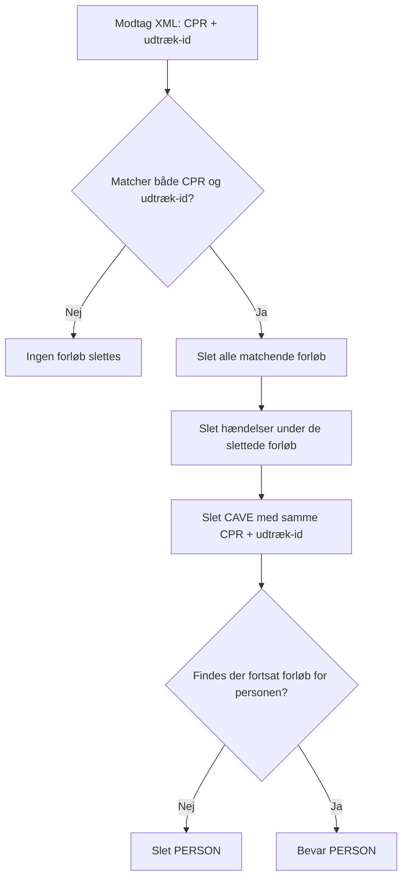
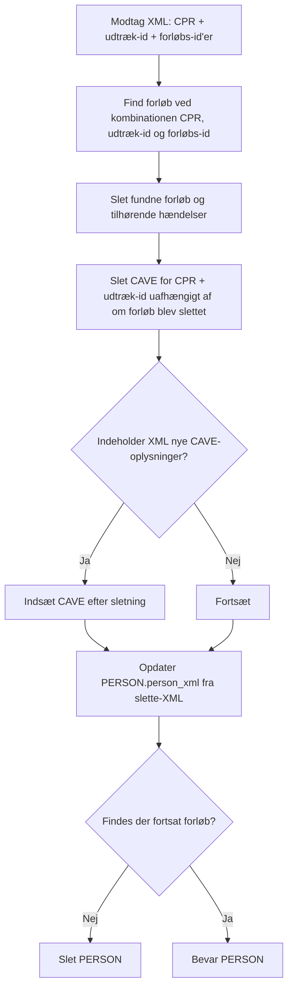
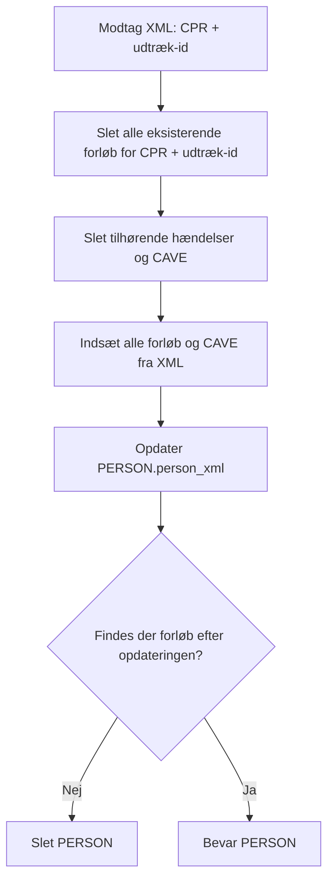
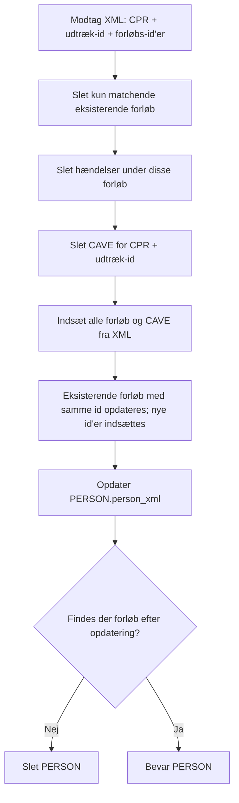

# e-journal Suploader-funktionalitet

- **Kildedokument:** `sup-20-loader-v2.pdf`
- **Dato:** 11. april 2012
- **Konverteringsformål:** Agent-egnet tekstversion med kilde-sideankre og separate diagram-/billedressourcer.
- **Kildeprincip:** Teksten nedenfor følger PDF-kilden. Mermaid-diagrammer er semantiske rekonstruktioner og bør kontrolleres mod originalfiguren ved tvivl.

<!-- Kildeside: 1 -->

Hvis du har brug for at læse dette dokument i et keyboard eller skærmlæservenligt format, så klik venligst på denne knap.

                                                                         Suploader-funktionalitet

                                                                                                                                           e-journal

                                                                                                                            Suploader-funktionalitet

                                                                                                             Forfatter: Erik H. Olesen
                                                                                   Fejl! Henvisningskilde ikke fundet. Erik H. Olesen
                                                                                                                     Kunde: MedCom

<!-- Kildeside: 2 -->

Suploader-funktionalitet

Dokumenthistorik

Revision Revisionsdato        Oversigt over rettelser                                      Rettelser
snummer                                                                                    markeret
### 1.0 11-05-2011        Oprettelse                                                         N
### 1.3 11-04-2012        Tilføjet beskrivelser for ”Opdater” og ”OpdaterSpecielt”           N

<!-- Kildeside: 3 -->

Suploader-funktionalitet

Indholdsfortegnelse
1.      Beskrivelse ............................................................................................................. 4
2.      TransaktionsType="Slet" ........................................................................................ 5
3.      TransaktionsType="SletSpecielt"............................................................................ 7
4.      TransaktionsType="Opdater".................................................................................. 9
5.      TransaktionsType="OpdaterSpecielt" ................................................................... 11

<!-- Kildeside: 4 -->

Suploader-funktionalitet

## 1 Beskrivelse

Dette dokument beskriver funktionaliteten af værdierne ’Slet’, ’SletSpecielt’, ’Opdater’ og
’OpdaterSpecielt’ for attributten ’TransaktionsType’ i XML-filer loadet af Suploaderen.

<!-- Kildeside: 5 -->

Suploader-funktionalitet

## 2 TransaktionsType="Slet"

’Slet’ tager udgangspunkt i det angivne CPR nummer samt udtræk-id (svarer til attributten Identifikation
på tagget Aflever_patientdata).
Alle forløb og Cave der identificeres ved disse parametre slettes (desuden slettes alle haendelser
tilhørende de slettede forløb).
Hvis der efter sletning af forløb ikke længere findes forløb for personen slettes også personen fra
databasen.

Eksempler:

Hvis man angiver et udtræk-id der findes, men for et forkert CPR slettes forløbet ikke.
Hvis man angiver et forkert udtræk-id (findes ikke), men for et korrekt CPR slettes forløbet ikke. Personen
slettes heller ikke på trods af ovenstående sql (den sql ses faktisk slet ikke i logfilen i dette tilfælde)!
Hvis man angiver et udtræk-id der findes, og for et korrekt CPR slettes alle forløb (med tilhørende
hændelser) samt CAVE informationer med det angivne udtraek_id.

Eksempel XML:

<?xml version="1.0" encoding="ISO-8859-1"?>
<Aflever_patientdata
   VersionsNummer="2.0"
   Identifikation="CSCOPUSJOU6003X9"
   AfsenderSystem="CSC-trial.AfsenderSystem"
   ForsendelsesTid="2006-05-19T00:00:01"
   TransaktionsType="Slet"
   xmlns=http://www.vejleamt.dk/SUP_20
   xmlns:xsi="http://www.w3.org/2001/XMLSchema-instance"
   xsi:schemaLocation="http://www.vejleamt.dk/SUP_20
   SUPAfleverPatientdataService.xsd">
   <Person CPRnummer="111111-1118">
   </Person>
</Aflever_patientdata>

Eksempel med data:

Findes fx. flg. data i databasen for en person:

<!-- Kildeside: 6 -->

Suploader-funktionalitet

FORLOEB:
ID                    UDTRAEK_ID
## 22863760 CSCOPUSJOU6003X4
## 22863762 CSCOPUSJOU6003X5
## 22863795 CSCOPUSJOU600_10
## 22863809 CSCOPUSJOU6003X7
## 22863890 CSCOPUSJOU6003XX
## 22863892 CSCOPUSJOU6003X3

CAVE:
ID                    UDTRAEK_ID
## 2605433 CSCOPUSJOU6003XX
## 2605434 CSCOPUSJOU6003XX
## 2605435 CSCOPUSJOU6003X3
## 2605436 CSCOPUSJOU6003X3

og der slettes med XML som ovenover med flg. værdi for ’Identifikation’:
Identifikation="CSCOPUSJOU6003XX"

hermed slettes et enkelt forløb (med id 22863890) (samt hændelser herunder) samt 2 CAVE
informationer (id 2605433 og 2605434).
I dette tilfælde findes der fortsat forløb for personen og personen slettes altså ikke fra databasen.

<!-- Kildeside: 7 -->

Suploader-funktionalitet

## 3 TransaktionsType="SletSpecielt"

SletSpecielt tager udgangspunkt i de forløbsid'er, der findes i den givne xml-fil.
Disse id'er bruges i kombination med CPR-nummer og udtræks-id til at finde de forløb, der skal slettes.
Når et givent forløb slettes, slettes de tilhørende hændelser også.
Hvis der findes Cave information for den angivne kombination af udtræksid og CPR-nummer slettes også
disse. Dette er uanset om der iøvrigt er slettet forløb!
Det er muligt at medsende CAVE informationer i XML’en, hvorved disse indsættes efter eventuelle
sletninger!
Hvis der efter sletning af forløb ikke længere findes forløb for personen slettes også personen fra
databasen.
Person_xml opdateres i PERSON-tabellen i databasen med Person-data fra slette-XML’en.

Eksempel XML:
<Aflever_patientdata
   VersionsNummer="2.0"
   Identifikation="CSCOPUSJOU6003X3"
   ForsendelsesTid="2006-05-19T00:00:01"
   AfsenderSystem="CSC-trial.AfsenderSysXXX"
   TransaktionsType="SletSpecielt"
   xmlns="http://www.vejleamt.dk/SUP_20"
   xmlns:xsi="http://www.w3.org/2001/XMLSchema-instance"
   xsi:schemaLocation="http://www.vejleamt.dk/SUP_20
      SUPAfleverPatientdataService.xsd">
   <Person
      CPRnummer="111111-1118"
      Navn=" Banngren -Viborg,Rabdi "
      ... flere Person-attributter her (fjernet for overskuelighed) ....
   >
      <Patientforloeb
         Identifikation="XX3OPUSJOU6003XaarPF.Identifikation1."
         Foedesystem="PF-Viborg.XXXXXXXXXXX">
         <OprindeligAnsvarligEnhed>
             <Organisatorisk_Enhed/>
         </OprindeligAnsvarligEnhed>
      </Patientforloeb>
      <Patientforloeb
         Identifikation="XX5OPUSJOU6003XaarPF.Identifikation2."
         Foedesystem="PF-Viborg.XXXXXXXXXXX">
         <OprindeligAnsvarligEnhed>
             <Organisatorisk_Enhed/>
         </OprindeligAnsvarligEnhed>
      </Patientforloeb>
   </Person>
</Aflever_patientdata>

Eksempel med data:

<!-- Kildeside: 8 -->

Suploader-funktionalitet

Findes fx. flg. data i databasen for en person:

FORLOEB:
ID                      FORLOEB_ID                                          UDTRAEK_ID
## 22863893 XXXOPUSJOU6003XaarPF.Identifikation1.               CSCOPUSJOU6003XX
## 22863903 XX3OPUSJOU6003XaarPF.Identifikation1.               CSCOPUSJOU6003X3
## 22863904 XX3OPUSJOU6003XaarPF.Identifikation2.               CSCOPUSJOU6003X3
## 22863905 XX5OPUSJOU6003XaarPF.Identifikation1.               CSCOPUSJOU6003X5
## 22863906 XX5OPUSJOU6003XaarPF.Identifikation2.               CSCOPUSJOU6003X5

CAVE:
ID                    UDTRAEK_ID
## 2605437 CSCOPUSJOU6003XX
## 2605438 CSCOPUSJOU6003XX
## 2605447 CSCOPUSJOU6003X3
## 2605446 CSCOPUSJOU6003X3

Slettes der med flg. værdier i XML’en (en del af XML’en er udeladt for overskuelighedens skyld):
<Aflever_patientdata
        Identifikation="CSCOPUSJOU6003X3"
                 <Patientforloeb
                           Identifikation="XX3OPUSJOU6003XaarPF.Identifikation1."

vil 1 forløb (id 22863903) slettes (samt tilhørende hændelser) samt 2 CAVE-oplysninger (id 2605446 og
2605447).

I dette tilfælde findes der fortsat forløb for personen og personen slettes altså ikke fra databasen.
Person_xml i tabellen PERSON opdateres med data fra XML-filen.

<!-- Kildeside: 9 -->

Suploader-funktionalitet

## 4 TransaktionsType="Opdater"
’Opdater’ tager udgangspunkt i det angivne CPR nummer samt udtræk-id.
Alle forløb og Cave der identificeres ved disse parametre slettes (desuden slettes alle haendelser
tilhørende de slettede forløb).
Herefter indsættes alle forloeb og cave-informationer der er angivet i filen.
Hvis der efter sletning/opdatering af forløb ikke længere findes forløb for personen slettes også personen
fra databasen.

Eksempel XML:
<Aflever_patientdata
   VersionsNummer="2.0"
   Identifikation="CSCOPUSJOU6003X3"
   ForsendelsesTid="2006-05-19T00:00:01"
   AfsenderSystem="CSC-trial.AfsenderSysXXX"
   TransaktionsType="Opdater"
   xmlns="http://www.vejleamt.dk/SUP_20"
   xmlns:xsi="http://www.w3.org/2001/XMLSchema-instance"
   xsi:schemaLocation="http://www.vejleamt.dk/SUP_20
      SUPAfleverPatientdataService.xsd">
   <Person
      CPRnummer="111111-1118"
      Navn=" Banngren -Viborg,Rabdi "
      ... flere Person-attributter her (fjernet for overskuelighed) ....
   >
      <Patientforloeb
         Identifikation="XX3OPUSJOU6003XaarPF.Identifikation1."
         Foedesystem="PF-Viborg.XXXXXXXXXXX">
         <OprindeligAnsvarligEnhed>
             <Organisatorisk_Enhed/>
         </OprindeligAnsvarligEnhed>
         <Notat
             ...
         </Notat>
      </Patientforloeb>
      <Patientforloeb
         Identifikation="XX5OPUSJOU6003XaarPF.Identifikation2."
         Foedesystem="PF-Viborg.XXXXXXXXXXX">
         <OprindeligAnsvarligEnhed>
             <Organisatorisk_Enhed/>
         </OprindeligAnsvarligEnhed>
         <Notat
             ...
         </Notat>
      </Patientforloeb>
   </Person>
</Aflever_patientdata>

<!-- Kildeside: 10 -->

Suploader-funktionalitet

Eksempel med data:

Findes fx. flg. data i databasen for personen med cpr nummer 111111-1118:

FORLOEB:
ID                      FORLOEB_ID                                          UDTRAEK_ID
## 22863893 XXXOPUSJOU6003XaarPF.Identifikation1.               CSCOPUSJOU6003XX
## 22863903 XX3OPUSJOU6003XaarPF.Identifikation1.               CSCOPUSJOU6003X3
## 22863904 XX3OPUSJOU6003XaarPF.Identifikation2.               CSCOPUSJOU6003X3
## 22863905 XX5OPUSJOU6003XaarPF.Identifikation1.               CSCOPUSJOU6003X5
## 22863906 XX5OPUSJOU6003XaarPF.Identifikation2.               CSCOPUSJOU6003X5

CAVE:
ID                    UDTRAEK_ID
## 2605437 CSCOPUSJOU6003XX
## 2605438 CSCOPUSJOU6003XX
## 2605447 CSCOPUSJOU6003X3
## 2605446 CSCOPUSJOU6003X3

Opdateres der med flg. værdier i XML’en (en del af XML’en er udeladt for overskuelighedens skyld):
<Aflever_patientdata
        Identifikation="CSCOPUSJOU6003X3"
                 <Patientforloeb
                           Identifikation="XX3OPUSJOU6003XaarPF.Identifikation1."
                           ...
                 </Patientforloeb>
                 <CaveOplysninger Tekst="..." Dato="...">
                           ...
                 </CaveOplysninger>

vil 2 forløb (id 22863903 og 22863904) slettes (sammen med tilhørende hændelser) ligesom 2 CAVE-
oplysninger (id 2605446 og 2605447) vil slettes. Forløbet fra XML-filen med id
’XX3OPUSJOU6003XaarPF.Identifikation1.’ vil herefter indsættes ligesom en række med Cave-
oplysninger fra XML-filen vil indsættes.

I dette tilfælde findes der fortsat forløb for personen og personen slettes altså ikke fra databasen.
Person_xml i tabellen PERSON opdateres med data fra XML-filen.

<!-- Kildeside: 11 -->

Suploader-funktionalitet

## 5 TransaktionsType="OpdaterSpecielt"
OpdaterSpecielt tager udgangspunkt i de forløbsid'er, der findes i den givne xml-fil.
Disse id'er bruges i kombination med CPR-nummer og udtræks-id til at finde de forløb, der skal slettes.
Når et givent forløb slettes, slettes de tilhørende hændelser også.
Hvis der findes Cave information for den angivne kombination af udtræksid og CPR-nummer slettes også
disse. Dette er uafhængigt af forloebs-id’er og uanset om der iøvrigt er slettet forløb!
Herefter indsættes alle forloeb og cave-informationer der er angivet i filen.
Det er således muligt fx. at angive et id på et eksiterende forløb samt et nyt forløb, hvorved det
eksisterende opdateres og det nye indsættes.
Person_xml opdateres i PERSON-tabellen i databasen.
Hvis der efter sletning/opdatering af forløb ikke længere findes forløb for personen slettes også personen
fra databasen.

Eksempel XML:
<Aflever_patientdata
   VersionsNummer="2.0"
   Identifikation="CSCOPUSJOU6003X3"
   ForsendelsesTid="2006-05-19T00:00:01"
   AfsenderSystem="CSC-trial.AfsenderSysXXX"
   TransaktionsType="OpdaterSpecielt"
   xmlns="http://www.vejleamt.dk/SUP_20"
   xmlns:xsi="http://www.w3.org/2001/XMLSchema-instance"
   xsi:schemaLocation="http://www.vejleamt.dk/SUP_20
      SUPAfleverPatientdataService.xsd">
   <Person
      CPRnummer="111111-1118"
      Navn=" Banngren -Viborg,Rabdi "
      ... flere Person-attributter her (fjernet for overskuelighed) ....
   >
      <Patientforloeb
         Identifikation="XX3OPUSJOU6003XaarPF.Identifikation1."
         Foedesystem="PF-Viborg.XXXXXXXXXXX">
         <OprindeligAnsvarligEnhed>
             <Organisatorisk_Enhed/>
         </OprindeligAnsvarligEnhed>
         <Notat
             ...
         </Notat>
      </Patientforloeb>
   </Person>
</Aflever_patientdata>

Eksempel med data:

Findes fx. flg. data i databasen for personen med cpr nummer 111111-1118:

<!-- Kildeside: 12 -->

Suploader-funktionalitet

FORLOEB:
ID                      FORLOEB_ID                                          UDTRAEK_ID
## 22863893 XXXOPUSJOU6003XaarPF.Identifikation1.               CSCOPUSJOU6003XX
## 22863903 XX3OPUSJOU6003XaarPF.Identifikation1.               CSCOPUSJOU6003X3
## 22863904 XX3OPUSJOU6003XaarPF.Identifikation2.               CSCOPUSJOU6003X3
## 22863905 XX5OPUSJOU6003XaarPF.Identifikation1.               CSCOPUSJOU6003X5
## 22863906 XX5OPUSJOU6003XaarPF.Identifikation2.               CSCOPUSJOU6003X5

CAVE:
ID                    UDTRAEK_ID
## 2605437 CSCOPUSJOU6003XX
## 2605438 CSCOPUSJOU6003XX
## 2605447 CSCOPUSJOU6003X3
## 2605446 CSCOPUSJOU6003X3

Opdateres der med flg. værdier i XML’en (en del af XML’en er udeladt for overskuelighedens skyld):
<Aflever_patientdata
        Identifikation="CSCOPUSJOU6003X3"
                 <Patientforloeb
                           Identifikation="XX3OPUSJOU6003XaarPF.Identifikation1."
                           ...
                 </Patientforloeb>
                 <CaveOplysninger Tekst="..." Dato="...">
                           ...
                 </CaveOplysninger>

vil 1 forløb (id 22863903) slettes (sammen med tilhørende hændelser) ligesom 2 CAVE-oplysninger (id
## 2605446 og 2605447) vil slettes. Forløbet fra XML-filen med id
’XX3OPUSJOU6003XaarPF.Identifikation1.’ vil herefter indsættes ligesom en række med Cave-
oplysninger fra XML-filen vil indsættes.

I dette tilfælde findes der fortsat forløb for personen og personen slettes altså ikke fra databasen.
Person_xml i tabellen PERSON opdateres med data fra XML-filen.

# Mermaid-rekonstruktioner af transaktionstyper

## TransaktionsType=Slet

<!-- Billedbeskrivelse: Slet anvender CPR og udtræk-id som samlet nøgle; matchende forløb, underliggende hændelser og CAVE slettes, og PERSON slettes kun hvis ingen forløb resterer. -->

Mermaid-kilde: `suploader_funktionalitet_assets/suploader_funktionalitet_slet.mmd`

## TransaktionsType=SletSpecielt

<!-- Billedbeskrivelse: SletSpecielt afgrænser sletning til forløbs-id’er i XML’en; CAVE slettes på CPR+udtræk-id, og medsendte CAVE kan indsættes bagefter. PERSON XML opdateres. -->

Mermaid-kilde: `suploader_funktionalitet_assets/suploader_funktionalitet_slet_specielt.mmd`

## TransaktionsType=Opdater

<!-- Billedbeskrivelse: Opdater erstatter hele datasættet for kombinationen CPR+udtræk-id: eksisterende forløb/CAVE slettes og alle XML-data indsættes igen. -->

Mermaid-kilde: `suploader_funktionalitet_assets/suploader_funktionalitet_opdater.mmd`

## TransaktionsType=OpdaterSpecielt

<!-- Billedbeskrivelse: OpdaterSpecielt opdaterer kun de forløb, der er nævnt i XML’en, men CAVE håndteres på CPR+udtræk-id; derefter indsættes både opdaterede og nye forløb/CAVE. -->

Mermaid-kilde: `suploader_funktionalitet_assets/suploader_funktionalitet_opdater_specielt.mmd`
